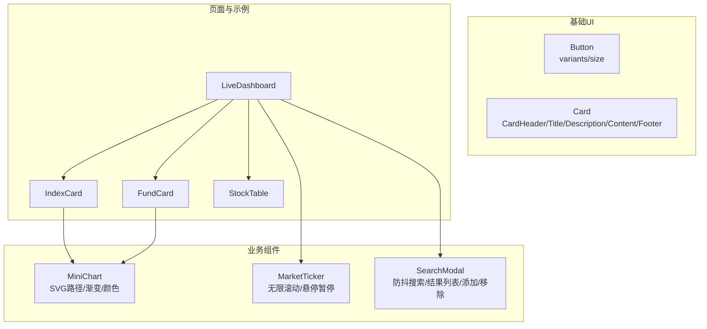
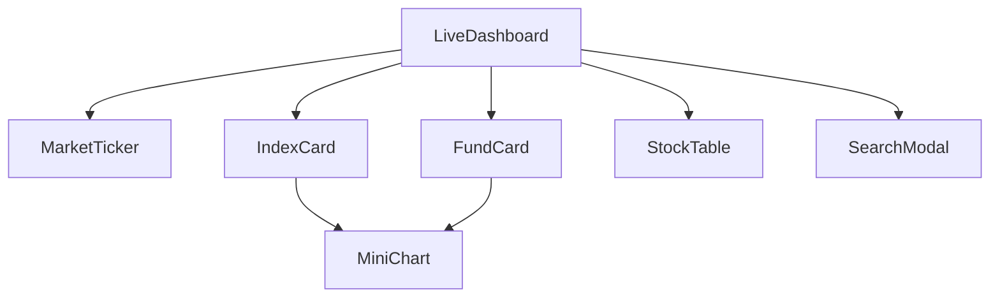
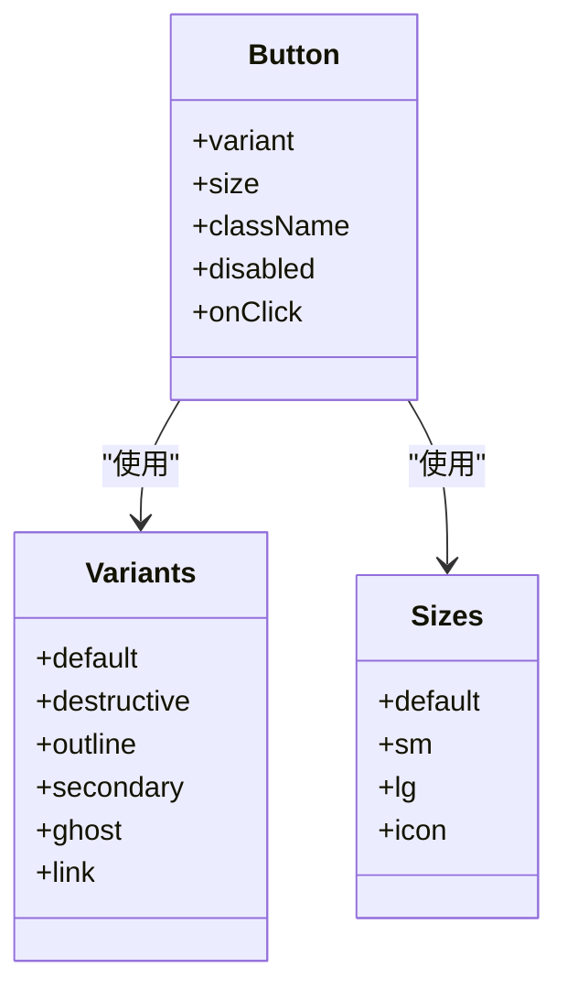
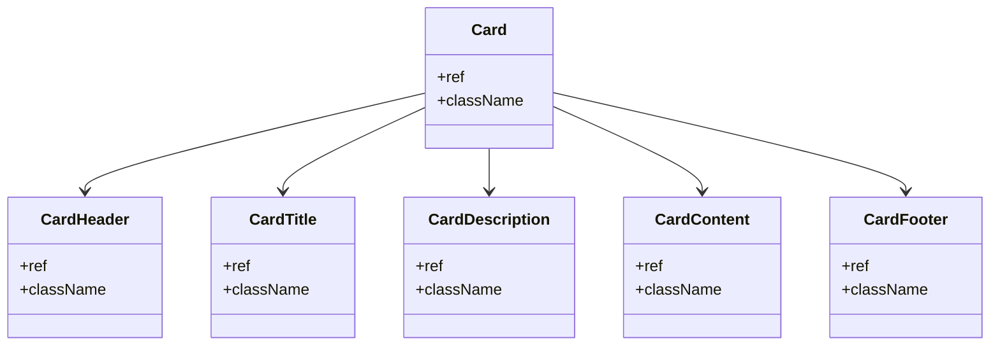
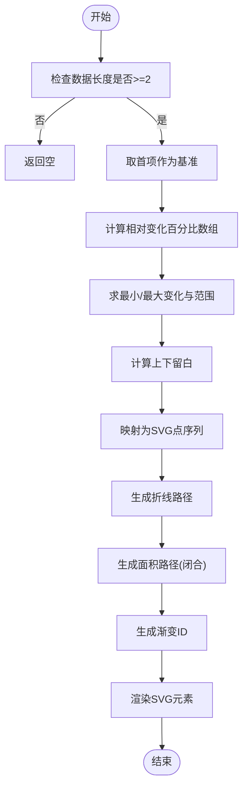
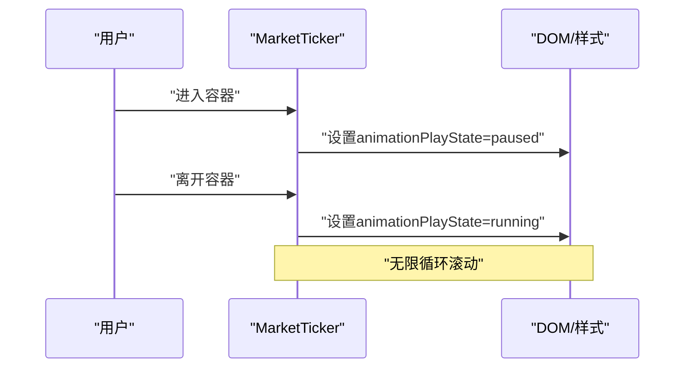
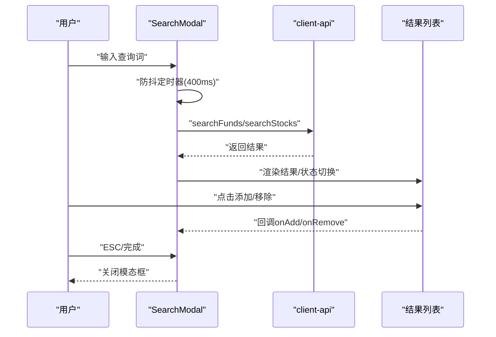
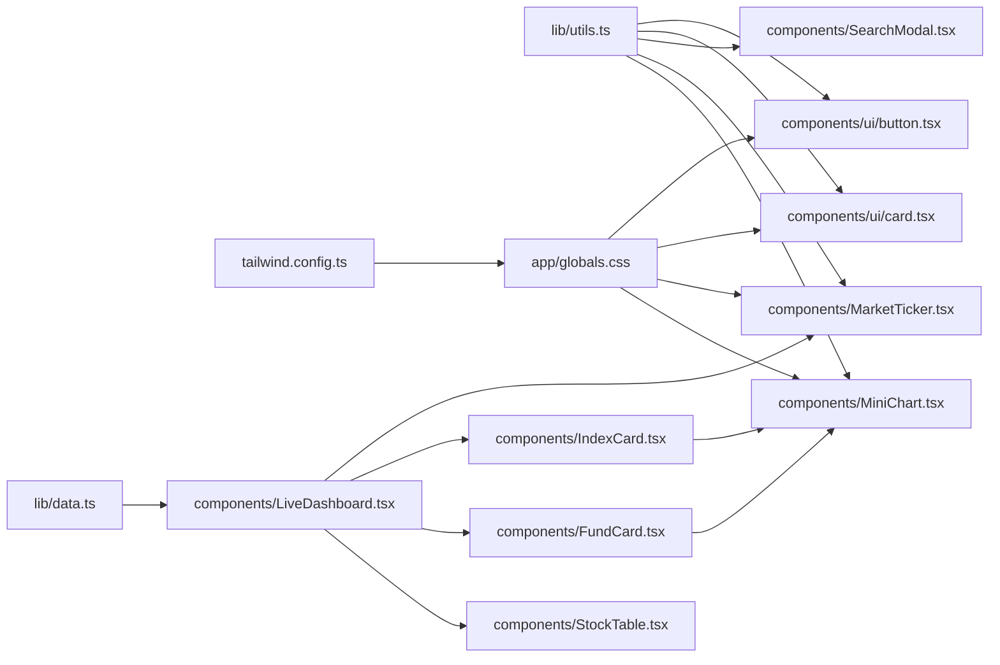

# UI组件库

<cite>
**本文档引用的文件**
- [components/ui/button.tsx](file://components/ui/button.tsx)
- [components/ui/card.tsx](file://components/ui/card.tsx)
- [components/MiniChart.tsx](file://components/MiniChart.tsx)
- [components/MarketTicker.tsx](file://components/MarketTicker.tsx)
- [components/SearchModal.tsx](file://components/SearchModal.tsx)
- [lib/utils.ts](file://lib/utils.ts)
- [app/globals.css](file://app/globals.css)
- [tailwind.config.ts](file://tailwind.config.ts)
- [components/IndexCard.tsx](file://components/IndexCard.tsx)
- [components/FundCard.tsx](file://components/FundCard.tsx)
- [components/StockTable.tsx](file://components/StockTable.tsx)
- [lib/data.ts](file://lib/data.ts)
- [components/LiveDashboard.tsx](file://components/LiveDashboard.tsx)
</cite>

## 目录
1. [简介](#简介)
2. [项目结构](#项目结构)
3. [核心组件](#核心组件)
4. [架构总览](#架构总览)
5. [详细组件分析](#详细组件分析)
6. [依赖关系分析](#依赖关系分析)
7. [性能考量](#性能考量)
8. [故障排查指南](#故障排查指南)
9. [结论](#结论)
10. [附录](#附录)

## 简介
本文件面向UI开发者与设计师，系统化梳理基金实盘跟踪应用中的UI组件库，重点覆盖基础UI组件（Button、Card）与业务组件（MiniChart、MarketTicker、SearchModal），并深入解析其设计理念、属性配置、样式定制、数据可视化算法与交互机制。文档同时提供组件复用性与扩展性建议、最佳实践与样式定制指南，帮助快速构建一致、可维护且高性能的金融仪表盘界面。

## 项目结构
UI组件库位于 components 目录下，采用按功能分层组织：
- 基础UI：components/ui 下的 Button 与 Card 组件，提供通用视觉与交互规范
- 业务组件：MiniChart、MarketTicker、SearchModal 等，承载具体业务场景
- 使用示例：LiveDashboard、IndexCard、FundCard、StockTable 等页面级组件组合上述UI组件

**图表来源**
- [components/ui/button.tsx:1-49](file://components/ui/button.tsx#L1-L49)
- [components/ui/card.tsx:1-79](file://components/ui/card.tsx#L1-L79)
- [components/MiniChart.tsx:1-57](file://components/MiniChart.tsx#L1-L57)
- [components/MarketTicker.tsx:1-52](file://components/MarketTicker.tsx#L1-L52)
- [components/SearchModal.tsx:1-210](file://components/SearchModal.tsx#L1-L210)
- [components/LiveDashboard.tsx:1-301](file://components/LiveDashboard.tsx#L1-L301)
- [components/IndexCard.tsx:1-53](file://components/IndexCard.tsx#L1-L53)
- [components/FundCard.tsx:1-132](file://components/FundCard.tsx#L1-L132)
- [components/StockTable.tsx:1-144](file://components/StockTable.tsx#L1-L144)

**章节来源**
- [components/ui/button.tsx:1-49](file://components/ui/button.tsx#L1-L49)
- [components/ui/card.tsx:1-79](file://components/ui/card.tsx#L1-L79)
- [components/MiniChart.tsx:1-57](file://components/MiniChart.tsx#L1-L57)
- [components/MarketTicker.tsx:1-52](file://components/MarketTicker.tsx#L1-L52)
- [components/SearchModal.tsx:1-210](file://components/SearchModal.tsx#L1-L210)
- [components/LiveDashboard.tsx:1-301](file://components/LiveDashboard.tsx#L1-L301)

## 核心组件
本节聚焦基础UI组件 Button 与 Card 的设计理念、属性配置与样式定制方法。

- Button 设计理念
  - 使用 class-variance-authority 实现变体与尺寸的声明式组合，支持默认值与可选参数
  - 通过 cn 合并类名，确保可扩展性与主题一致性
  - 支持 variant（default/destructive/outline/secondary/ghost/link）与 size（default/sm/lg/icon）
  - 遵循无障碍与焦点可见性规范，禁用态具备明确视觉反馈

- Card 设计理念
  - 提供卡片容器与语义化子组件：CardHeader、CardTitle、CardDescription、CardContent、CardFooter
  - 子组件均以 forwardRef 包裹，便于外部访问DOM节点
  - 默认样式基于语义化颜色变量，适配明暗主题

- 样式定制指南
  - 通过 Tailwind 颜色变量与阴影变量统一风格，如 --primary、--success、--destructive、--shadow-card 等
  - 使用 cn 合并类名，优先级控制与主题切换保持一致
  - 变体与尺寸通过 cva 配置，新增变体时需同步更新 Tailwind 主题与颜色映射

**章节来源**
- [components/ui/button.tsx:5-49](file://components/ui/button.tsx#L5-L49)
- [components/ui/card.tsx:4-79](file://components/ui/card.tsx#L4-L79)
- [lib/utils.ts:4-6](file://lib/utils.ts#L4-L6)
- [app/globals.css:6-90](file://app/globals.css#L6-L90)
- [tailwind.config.ts:20-74](file://tailwind.config.ts#L20-L74)

## 架构总览
UI组件库与页面级组件的协作关系如下：
- LiveDashboard 作为主页面，聚合 MarketTicker、IndexCard、FundCard、StockTable 等组件
- IndexCard 与 FundCard 内部嵌入 MiniChart，用于展示历史走势
- SearchModal 在用户触发“添加”操作时弹出，提供搜索与结果管理
- 所有组件共享统一的样式体系（Tailwind 变量、cn 类名合并）

**图表来源**
- [components/LiveDashboard.tsx:109-299](file://components/LiveDashboard.tsx#L109-L299)
- [components/IndexCard.tsx:44-48](file://components/IndexCard.tsx#L44-L48)
- [components/FundCard.tsx:101-127](file://components/FundCard.tsx#L101-L127)
- [components/MiniChart.tsx:1-57](file://components/MiniChart.tsx#L1-L57)
- [components/SearchModal.tsx:280-299](file://components/SearchModal.tsx#L280-L299)

**章节来源**
- [components/LiveDashboard.tsx:1-301](file://components/LiveDashboard.tsx#L1-L301)

## 详细组件分析

### Button 组件
- 设计要点
  - 通过 cva 定义变体与尺寸，结合默认值与可选参数，形成稳定的视觉与交互基线
  - forwardRef 保证 ref 透传，便于表单集成与焦点管理
  - 支持禁用态与焦点可见性，遵循无障碍最佳实践

- 属性与行为
  - variant：控制背景、边框、前景色等
  - size：控制高度、内边距、图标尺寸
  - 其他原生 button 属性透传

- 样式定制
  - 新增变体时，需在 Tailwind 主题中补充对应颜色映射
  - 尺寸扩展需同步调整圆角、内边距与字体大小

**图表来源**
- [components/ui/button.tsx:5-29](file://components/ui/button.tsx#L5-L29)

**章节来源**
- [components/ui/button.tsx:31-49](file://components/ui/button.tsx#L31-L49)

### Card 组件
- 设计要点
  - 卡片容器与语义化子组件分离，便于灵活布局与内容组织
  - 子组件均暴露 ref，支持外部交互与可访问性

- 组合使用
  - CardHeader + CardTitle/Description + CardContent + CardFooter 形成完整卡片结构
  - 适用于统计卡片、信息面板、对话框等场景

**图表来源**
- [components/ui/card.tsx:4-79](file://components/ui/card.tsx#L4-L79)

**章节来源**
- [components/ui/card.tsx:1-79](file://components/ui/card.tsx#L1-L79)

### MiniChart 迷你图表
- 设计理念
  - 基于 SVG 渲染，使用 path 描绘折线与面积，配合线性渐变实现柔和填充
  - 数据归一化处理，确保不同量级曲线在同一画布内清晰对比
  - 颜色随趋势动态切换（正负趋势分别使用 success 与 destructive）

- 数据可视化算法
  - 输入：数值数组 data，首项作为基准，计算相对变化百分比
  - 计算：最小/最大变化与范围，用于坐标映射；padding 控制上下留白
  - 映射：线性映射到 SVG 坐标系，生成路径点序列
  - 路径：折线 path 与闭合面积 path（含渐变填充）

- 动画与交互
  - 通过 props 控制宽高与正负趋势颜色
  - 与父组件组合时，可设置固定尺寸与透明度，提升信息密度

**图表来源**
- [components/MiniChart.tsx:9-57](file://components/MiniChart.tsx#L9-L57)

**章节来源**
- [components/MiniChart.tsx:1-57](file://components/MiniChart.tsx#L1-L57)
- [components/IndexCard.tsx:44-48](file://components/IndexCard.tsx#L44-L48)
- [components/FundCard.tsx:101-127](file://components/FundCard.tsx#L101-L127)

### MarketTicker 滚动行情条
- 设计理念
  - 顶部滚动行情条，展示多只指数的实时行情，支持鼠标悬停暂停
  - 文本数字使用 tabular-nums 等宽字体，确保对齐与可读性

- 实现机制
  - 复制索引列表两次，形成无缝循环
  - 使用 CSS keyframes 与 animation 控制滚动速度与方向
  - 鼠标进入容器暂停动画，离开恢复播放

- 数据与样式
  - 每项包含旗帜、名称、数值、涨跌百分比与箭头图标
  - 正负趋势使用 success 与 destructive 颜色

**图表来源**
- [components/MarketTicker.tsx:8-52](file://components/MarketTicker.tsx#L8-L52)
- [tailwind.config.ts:88-98](file://tailwind.config.ts#L88-L98)

**章节来源**
- [components/MarketTicker.tsx:1-52](file://components/MarketTicker.tsx#L1-L52)
- [tailwind.config.ts:75-98](file://tailwind.config.ts#L75-L98)

### SearchModal 搜索模态框
- 功能概述
  - 支持基金与股票两类搜索，根据类型调用不同 API
  - 防抖搜索（400ms），加载状态与错误兜底
  - 结果列表支持“已添加/未添加”状态切换，一键添加或移除

- 搜索算法与交互
  - 输入变更触发定时器，避免频繁请求
  - 加载期间显示旋转指示器，结果为空时提示“未找到”
  - ESC 键关闭模态框，回车由外部触发（此处为键盘事件监听）

- 结果展示与用户交互
  - 列表项包含名称、代码、附加信息（如类型/代码），右侧按钮根据状态显示加号或勾选
  - 已添加项高亮，点击切换状态回调 onAdd/onRemove

**图表来源**
- [components/SearchModal.tsx:24-210](file://components/SearchModal.tsx#L24-L210)
- [lib/data.ts:1-41](file://lib/data.ts#L1-L41)

**章节来源**
- [components/SearchModal.tsx:1-210](file://components/SearchModal.tsx#L1-L210)
- [lib/data.ts:1-41](file://lib/data.ts#L1-L41)

## 依赖关系分析
- 组件间依赖
  - LiveDashboard 依赖 MarketTicker、IndexCard、FundCard、StockTable、SearchModal
  - IndexCard 与 FundCard 内部使用 MiniChart
  - 所有组件共享 cn 工具函数与 Tailwind 变量

- 样式与主题
  - app/globals.css 定义 CSS 变量与基础样式
  - tailwind.config.ts 扩展颜色、阴影与关键帧动画
  - lib/utils.ts 提供类名合并工具

**图表来源**
- [lib/utils.ts:4-6](file://lib/utils.ts#L4-L6)
- [app/globals.css:6-125](file://app/globals.css#L6-L125)
- [tailwind.config.ts:20-102](file://tailwind.config.ts#L20-L102)
- [lib/data.ts:1-41](file://lib/data.ts#L1-L41)
- [components/LiveDashboard.tsx:1-301](file://components/LiveDashboard.tsx#L1-L301)

**章节来源**
- [lib/utils.ts:4-6](file://lib/utils.ts#L4-L6)
- [app/globals.css:6-125](file://app/globals.css#L6-L125)
- [tailwind.config.ts:20-102](file://tailwind.config.ts#L20-L102)
- [lib/data.ts:1-41](file://lib/data.ts#L1-L41)
- [components/LiveDashboard.tsx:1-301](file://components/LiveDashboard.tsx#L1-L301)

## 性能考量
- 渲染优化
  - MiniChart 使用 SVG 路径绘制，数据量大时建议限制点数或采用采样策略
  - MarketTicker 通过复制列表实现无缝滚动，注意容器宽度与动画性能

- 交互与网络
  - SearchModal 的防抖搜索减少请求频率，建议结合缓存策略与错误重试
  - LiveDashboard 并行拉取多路数据，注意并发控制与失败兜底

- 样式与主题
  - 统一使用 CSS 变量与 Tailwind 主题，避免重复定义，降低打包体积
  - 按需引入动画与阴影，避免全局污染

[本节为通用指导，无需特定文件来源]

## 故障排查指南
- Button 无法点击或样式异常
  - 检查 variant/size 是否正确传递，确认禁用态样式
  - 核对 cn 合并顺序与 Tailwind 主题颜色映射

- Card 子组件错位
  - 确认 CardHeader/Title/Description/Content/Footer 的组合顺序与 className 透传

- MiniChart 不显示或颜色异常
  - 确认 data 长度至少为 2，检查正负趋势与颜色变量
  - 校验 viewBox 与宽高设置

- MarketTicker 滚动卡顿
  - 检查动画 keyframes 与 playState 设置
  - 减少容器内元素数量或优化字体渲染

- SearchModal 搜索无响应
  - 确认防抖定时器与异步请求逻辑
  - 检查 onAdd/onRemove 回调是否正确绑定

**章节来源**
- [components/ui/button.tsx:31-49](file://components/ui/button.tsx#L31-L49)
- [components/ui/card.tsx:19-79](file://components/ui/card.tsx#L19-L79)
- [components/MiniChart.tsx:9-57](file://components/MiniChart.tsx#L9-L57)
- [components/MarketTicker.tsx:8-52](file://components/MarketTicker.tsx#L8-L52)
- [components/SearchModal.tsx:48-88](file://components/SearchModal.tsx#L48-L88)

## 结论
本UI组件库以 Button、Card 为基础，结合 MiniChart、MarketTicker、SearchModal 等业务组件，构建了统一、可复用且可扩展的金融仪表盘界面体系。通过 cva 变体系统、SVG 数据可视化、CSS 动画与防抖搜索等技术手段，既保证了良好的用户体验，也兼顾了性能与可维护性。建议在实际项目中遵循本文档的最佳实践与样式定制指南，持续演进组件能力。

[本节为总结，无需特定文件来源]

## 附录
- 组件复用性与扩展性建议
  - 通过 props 抽象通用行为（如尺寸、颜色、状态），减少重复实现
  - 使用组合模式拆分复杂组件，保持单一职责
  - 为每个组件提供清晰的接口文档与类型定义

- 样式定制清单
  - 颜色：--primary/--secondary/--success/--destructive/--muted
  - 阴影：--shadow-card/--shadow-glow-* 等
  - 动画：fade-up/ticker-scroll 等 keyframes 与 animation
  - 字体：tabular-nums 等价态

**章节来源**
- [app/globals.css:6-125](file://app/globals.css#L6-L125)
- [tailwind.config.ts:75-98](file://tailwind.config.ts#L75-L98)
- [lib/utils.ts:4-6](file://lib/utils.ts#L4-L6)