# FundDetailModal 基金详情模态框组件

<cite>
**本文档引用的文件**
- [FundDetailModal.tsx](file://components/FundDetailModal.tsx)
- [LiveDashboard.tsx](file://components/LiveDashboard.tsx)
- [client-api.ts](file://lib/client-api.ts)
- [data.ts](file://lib/data.ts)
- [utils.ts](file://lib/utils.ts)
- [FundCard.tsx](file://components/FundCard.tsx)
- [SearchModal.tsx](file://components/SearchModal.tsx)
</cite>

## 目录
1. [简介](#简介)
2. [项目结构](#项目结构)
3. [核心组件](#核心组件)
4. [架构概览](#架构概览)
5. [详细组件分析](#详细组件分析)
6. [依赖关系分析](#依赖关系分析)
7. [性能考虑](#性能考虑)
8. [故障排除指南](#故障排除指南)
9. [结论](#结论)

## 简介

FundDetailModal 是一个用于显示基金详细信息的模态框组件，集成在金融数据监控应用中。该组件提供了基金的基本信息、净值表现、收益概览和持仓情况等关键数据的可视化展示，支持实时数据刷新和用户交互功能。

该组件采用现代化的前端技术栈构建，使用 Next.js 13+ 的 App Router 架构，结合 Tailwind CSS 进行样式设计，实现了响应式的用户界面和流畅的用户体验。

## 项目结构

该项目采用基于功能模块的组织方式，主要目录结构如下：

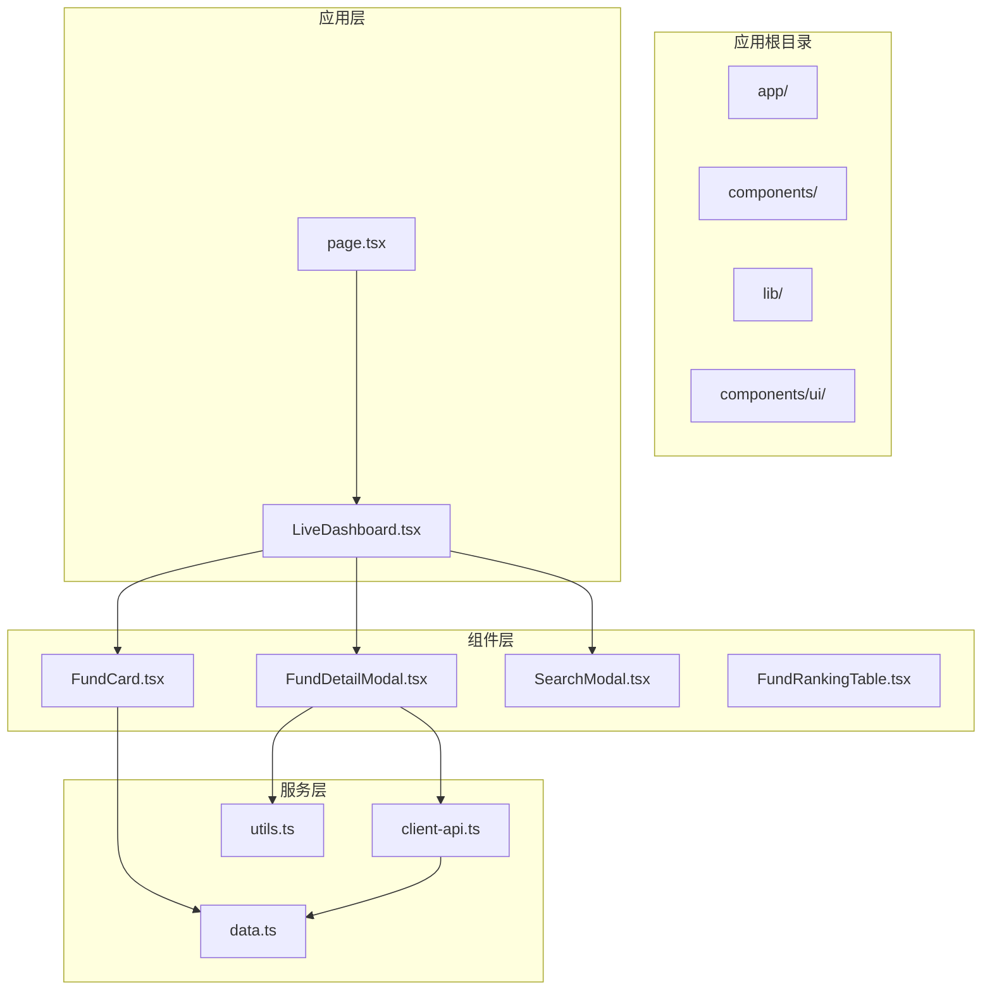

**图表来源**
- [page.tsx:10-23](file://app/page.tsx#L10-L23)
- [LiveDashboard.tsx:39-332](file://components/LiveDashboard.tsx#L39-L332)
- [FundDetailModal.tsx:1-233](file://components/FundDetailModal.tsx#L1-L233)

**章节来源**
- [page.tsx:1-24](file://app/page.tsx#L1-L24)
- [LiveDashboard.tsx:1-406](file://components/LiveDashboard.tsx#L1-L406)

## 核心组件

### FundDetailModal 组件架构

FundDetailModal 是一个专门用于展示基金详细信息的模态框组件，具有以下核心特性：

#### 主要功能特性
- **实时数据展示**：显示基金的净值、涨跌幅、收益概览等关键指标
- **详细信息面板**：提供基金经理、基金规模等基本信息
- **持仓情况展示**：显示前十大持仓股票及其占比
- **响应式设计**：适配不同屏幕尺寸的设备
- **用户交互**：支持模态框的打开、关闭和内容交互

#### 数据模型
组件使用 `FundRankingData` 接口作为数据输入，包含完整的基金信息结构：

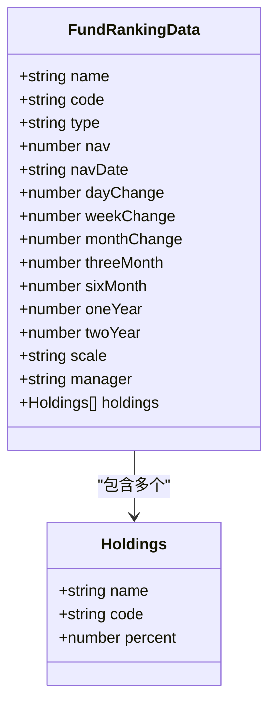

**图表来源**
- [data.ts:147-167](file://lib/data.ts#L147-L167)

**章节来源**
- [FundDetailModal.tsx:7-11](file://components/FundDetailModal.tsx#L7-L11)
- [data.ts:147-167](file://lib/data.ts#L147-L167)

## 架构概览

### 组件层次结构

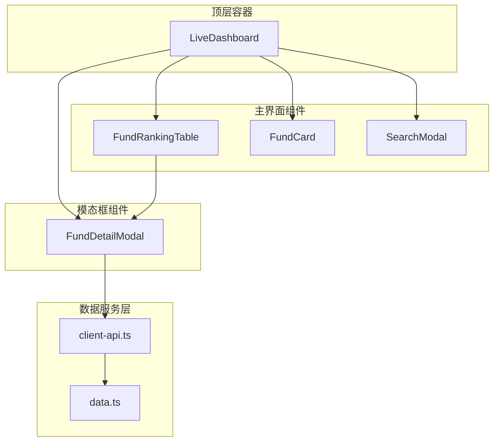

**图表来源**
- [LiveDashboard.tsx:12-332](file://components/LiveDashboard.tsx#L12-L332)
- [FundDetailModal.tsx:1-233](file://components/FundDetailModal.tsx#L1-L233)

### 数据流架构

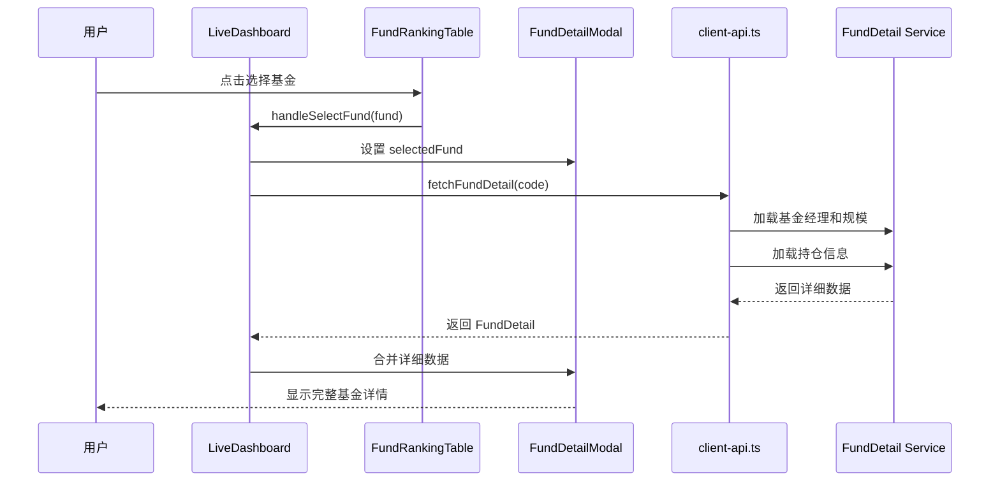

**图表来源**
- [LiveDashboard.tsx:58-71](file://components/LiveDashboard.tsx#L58-L71)
- [client-api.ts:539-596](file://lib/client-api.ts#L539-L596)

**章节来源**
- [LiveDashboard.tsx:39-332](file://components/LiveDashboard.tsx#L39-L332)

## 详细组件分析

### FundDetailModal 组件实现

#### 组件结构分析

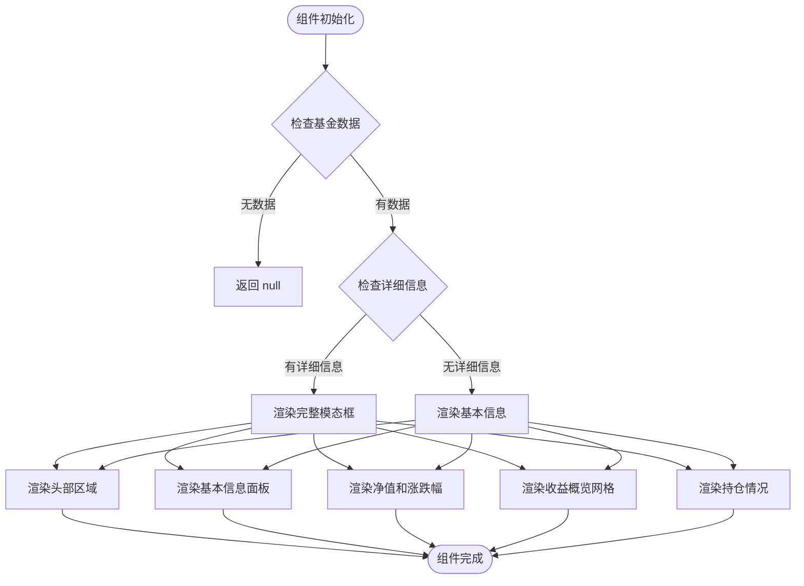

**图表来源**
- [FundDetailModal.tsx:13-233](file://components/FundDetailModal.tsx#L13-L233)

#### 核心功能实现

##### 数据格式化函数
组件实现了专门的数据格式化逻辑：

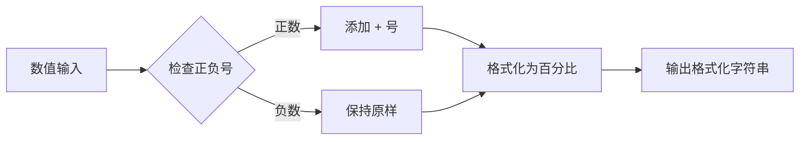

**图表来源**
- [FundDetailModal.tsx:21-24](file://components/FundDetailModal.tsx#L21-L24)

##### 条件渲染逻辑
组件使用条件渲染来处理不同的数据状态：

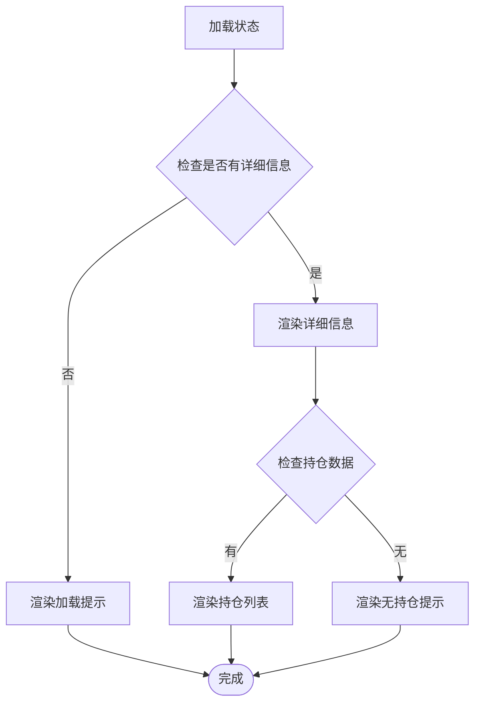

**图表来源**
- [FundDetailModal.tsx:56-84](file://components/FundDetailModal.tsx#L56-L84)
- [FundDetailModal.tsx:185-227](file://components/FundDetailModal.tsx#L185-L227)

**章节来源**
- [FundDetailModal.tsx:13-233](file://components/FundDetailModal.tsx#L13-L233)

### 数据获取与处理

#### API 集成架构

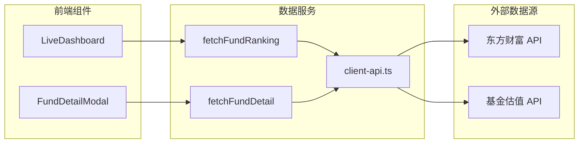

**图表来源**
- [LiveDashboard.tsx:58-71](file://components/LiveDashboard.tsx#L58-L71)
- [client-api.ts:539-596](file://lib/client-api.ts#L539-L596)

#### 数据获取流程

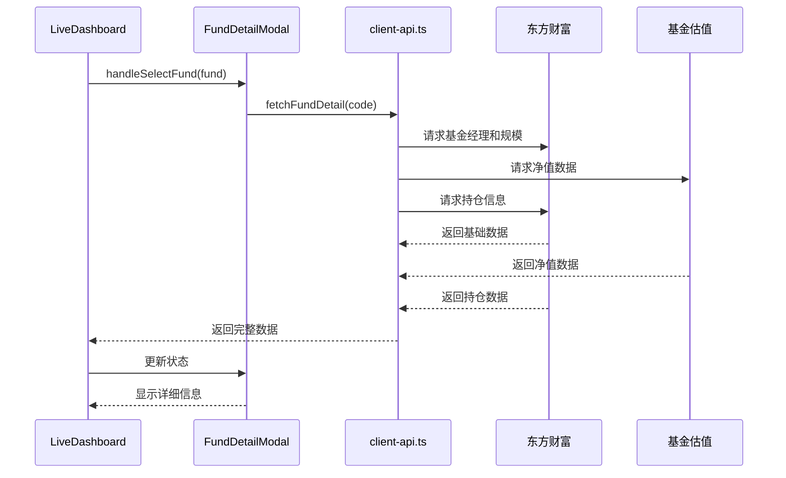

**图表来源**
- [LiveDashboard.tsx:58-71](file://components/LiveDashboard.tsx#L58-L71)
- [client-api.ts:539-596](file://lib/client-api.ts#L539-L596)

**章节来源**
- [client-api.ts:527-596](file://lib/client-api.ts#L527-L596)

### 样式与主题系统

#### Tailwind CSS 集成

组件使用 Tailwind CSS 进行样式管理，实现了响应式设计和主题一致性：

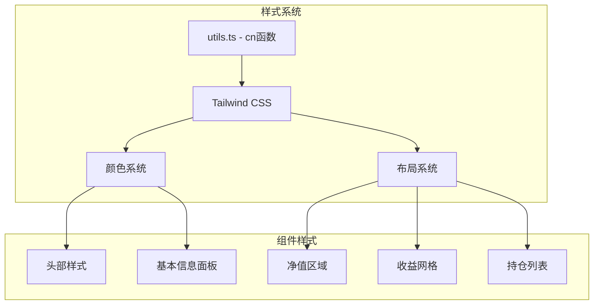

**图表来源**
- [utils.ts:4-6](file://lib/utils.ts#L4-L6)
- [FundDetailModal.tsx:26-51](file://components/FundDetailModal.tsx#L26-L51)

#### 响应式设计实现

组件采用移动优先的设计策略，通过 Tailwind CSS 的响应式断点实现多设备适配：

- **移动端**：单列布局，紧凑间距
- **平板端**：两列布局，适度间距  
- **桌面端**：三列收益网格，宽松布局

**章节来源**
- [FundDetailModal.tsx:26-233](file://components/FundDetailModal.tsx#L26-L233)

## 依赖关系分析

### 外部依赖

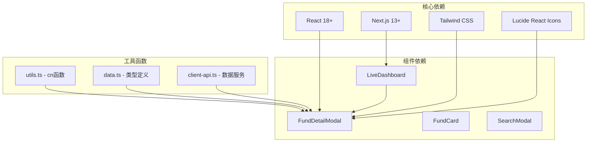

**图表来源**
- [package.json:11-29](file://package.json#L11-L29)
- [FundDetailModal.tsx:1-6](file://components/FundDetailModal.tsx#L1-L6)

### 内部依赖关系

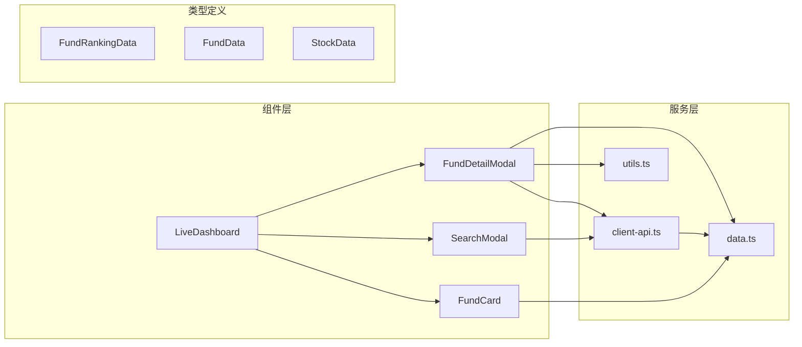

**图表来源**
- [LiveDashboard.tsx:12-37](file://components/LiveDashboard.tsx#L12-L37)
- [FundDetailModal.tsx:3-6](file://components/FundDetailModal.tsx#L3-L6)

**章节来源**
- [package.json:1-31](file://package.json#L1-L31)

## 性能考虑

### 数据加载优化

组件实现了多种性能优化策略：

1. **懒加载机制**：仅在用户点击时才加载详细数据
2. **缓存策略**：利用浏览器缓存减少重复请求
3. **防抖处理**：搜索和数据刷新操作使用防抖优化
4. **条件渲染**：根据数据可用性动态渲染不同内容

### 内存管理

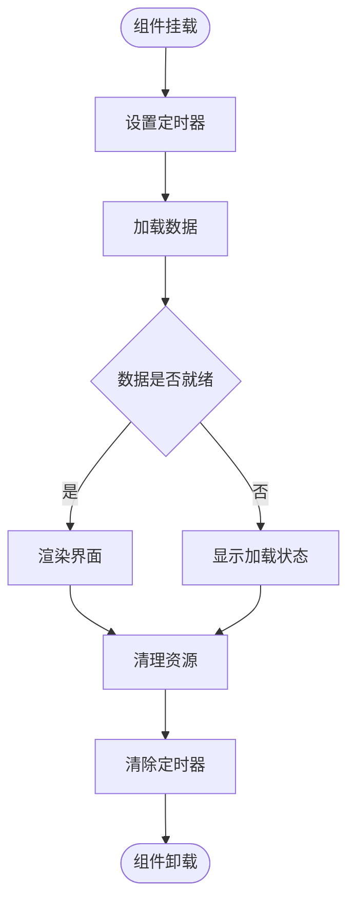

**图表来源**
- [LiveDashboard.tsx:114-119](file://components/LiveDashboard.tsx#L114-L119)

### 渲染性能优化

- **虚拟滚动**：对于大量数据使用虚拟滚动技术
- **组件拆分**：将复杂界面拆分为多个独立组件
- **状态管理**：使用 React hooks 优化状态更新
- **事件委托**：减少事件监听器数量

## 故障排除指南

### 常见问题诊断

#### 数据加载失败
**症状**：模态框显示加载状态但无法显示数据
**可能原因**：
1. 网络连接问题
2. 外部 API 服务不可用
3. 数据格式变更

**解决方案**：
1. 检查网络连接状态
2. 查看浏览器开发者工具的网络面板
3. 验证 API 响应格式

#### 样式显示异常
**症状**：组件样式错乱或布局异常
**可能原因**：
1. Tailwind CSS 配置问题
2. 样式冲突
3. 浏览器兼容性问题

**解决方案**：
1. 检查 Tailwind CSS 配置
2. 验证样式类名拼写
3. 测试不同浏览器兼容性

#### 性能问题
**症状**：页面响应缓慢或卡顿
**可能原因**：
1. 数据量过大
2. 渲染循环过长
3. 内存泄漏

**解决方案**：
1. 实施数据分页
2. 优化渲染逻辑
3. 使用 React DevTools 分析性能

**章节来源**
- [client-api.ts:539-596](file://lib/client-api.ts#L539-L596)
- [LiveDashboard.tsx:73-112](file://components/LiveDashboard.tsx#L73-L112)

## 结论

FundDetailModal 组件是一个功能完整、设计精良的金融数据展示组件。它成功地整合了现代前端开发的最佳实践，包括：

### 技术优势
- **架构清晰**：采用分层架构，职责分离明确
- **性能优化**：实现了多种性能优化策略
- **用户体验**：提供了流畅的用户交互体验
- **可维护性**：代码结构清晰，易于维护和扩展

### 设计特色
- **响应式设计**：适配多种设备和屏幕尺寸
- **主题一致**：与整体应用设计风格保持一致
- **数据丰富**：提供全面的基金信息展示
- **交互友好**：支持多种用户交互方式

### 扩展潜力
该组件为未来的功能扩展奠定了良好的基础，可以轻松添加更多金融数据展示功能，如历史走势分析、风险评估等高级功能。

通过合理使用和适当扩展，FundDetailModal 组件能够为用户提供高质量的金融数据可视化体验，成为金融应用中的重要组成部分。