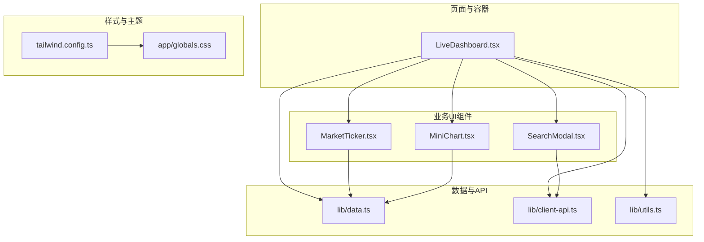
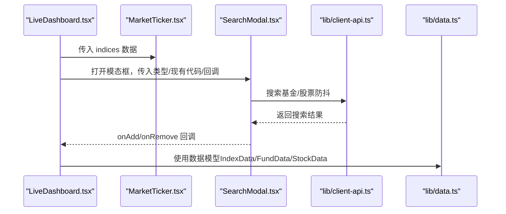
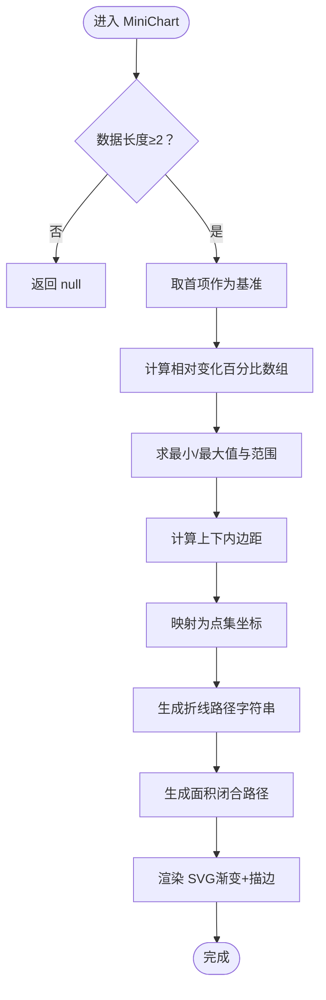
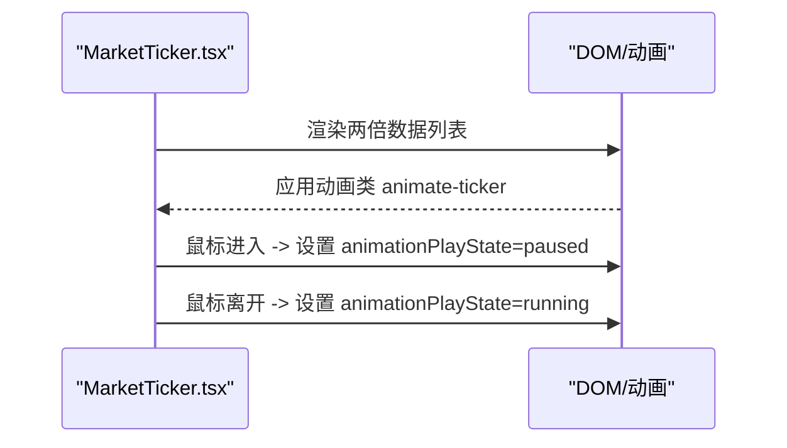
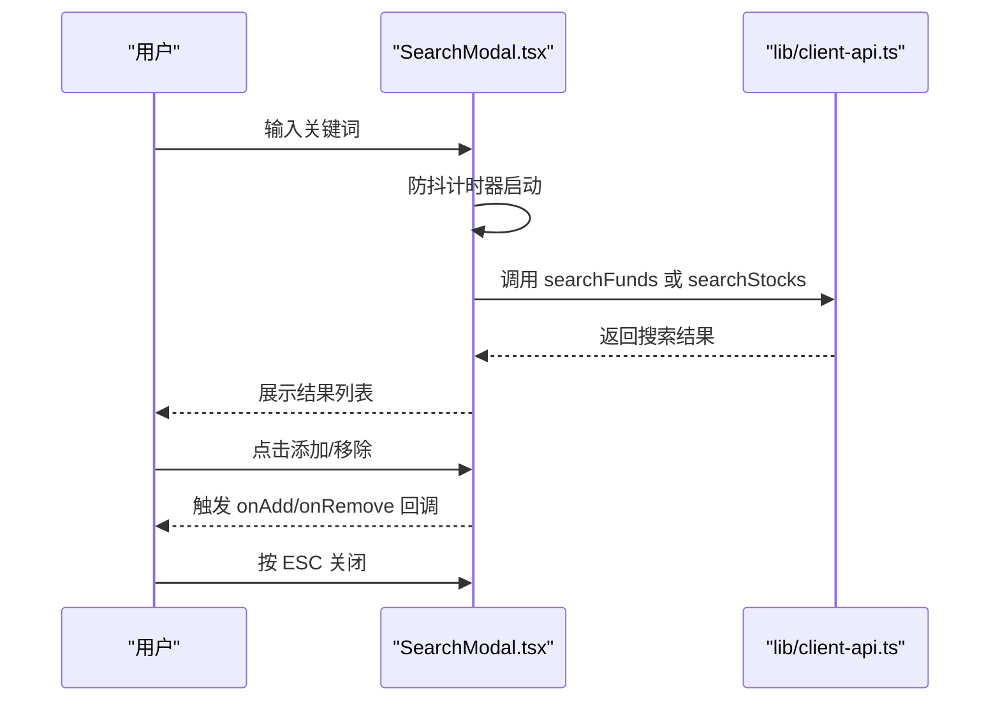
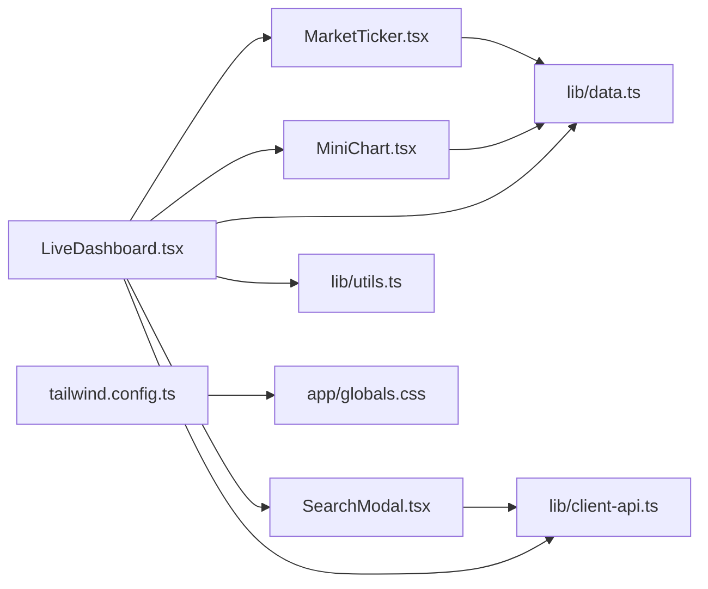

# 业务UI组件

<cite>
**本文引用的文件**
- [components/MiniChart.tsx](file://components/MiniChart.tsx)
- [components/MarketTicker.tsx](file://components/MarketTicker.tsx)
- [components/SearchModal.tsx](file://components/SearchModal.tsx)
- [lib/data.ts](file://lib/data.ts)
- [lib/client-api.ts](file://lib/client-api.ts)
- [lib/utils.ts](file://lib/utils.ts)
- [app/globals.css](file://app/globals.css)
- [tailwind.config.ts](file://tailwind.config.ts)
- [components/LiveDashboard.tsx](file://components/LiveDashboard.tsx)
</cite>

## 目录
1. [简介](#简介)
2. [项目结构](#项目结构)
3. [核心组件](#核心组件)
4. [架构总览](#架构总览)
5. [详细组件分析](#详细组件分析)
6. [依赖关系分析](#依赖关系分析)
7. [性能考量](#性能考量)
8. [故障排查指南](#故障排查指南)
9. [结论](#结论)
10. [附录：使用示例与定制方案](#附录使用示例与定制方案)

## 简介
本文件聚焦于基金实盘跟踪应用中的三大专业业务UI组件：MiniChart（迷你图表）、MarketTicker（滚动行情条）与 SearchModal（搜索模态框）。我们将从架构、数据流、渲染与动画实现、交互与状态管理、错误处理与性能优化等维度进行系统化剖析，并给出可直接落地的使用示例与定制方案，帮助开发者在金融数据可视化场景下高效集成与扩展。

## 项目结构
该应用采用 Next.js + TailwindCSS + Lucide React 的前端技术栈，组件按功能模块组织，业务数据通过 lib 层的 API 与工具函数抽象，页面级容器负责调度与状态管理。

图示来源
- [LiveDashboard.tsx:109-109](file://components/LiveDashboard.tsx#L109-L109)
- [MarketTicker.tsx:8-8](file://components/MarketTicker.tsx#L8-L8)
- [SearchModal.tsx:24-31](file://components/SearchModal.tsx#L24-L31)
- [MiniChart.tsx:9-9](file://components/MiniChart.tsx#L9-L9)
- [lib/data.ts:1-10](file://lib/data.ts#L1-L10)
- [lib/client-api.ts:348-417](file://lib/client-api.ts#L348-L417)
- [lib/utils.ts:4-6](file://lib/utils.ts#L4-L6)
- [tailwind.config.ts:75-98](file://tailwind.config.ts#L75-L98)
- [app/globals.css:1-125](file://app/globals.css#L1-L125)

章节来源
- [LiveDashboard.tsx:109-109](file://components/LiveDashboard.tsx#L109-L109)
- [tailwind.config.ts:75-98](file://tailwind.config.ts#L75-L98)
- [app/globals.css:1-125](file://app/globals.css#L1-L125)

## 核心组件
- MiniChart：基于 SVG 的迷你折线图，支持正负色值、渐变填充与路径绘制，适用于展示净值/指数的短期变化趋势。
- MarketTicker：水平滚动的行情条，复制列表以实现无缝循环滚动，支持鼠标悬停暂停与数值格式化。
- SearchModal：搜索模态框，支持基金/股票两类搜索，具备防抖、加载态、结果过滤与添加/移除操作回调。

章节来源
- [MiniChart.tsx:1-57](file://components/MiniChart.tsx#L1-L57)
- [MarketTicker.tsx:1-52](file://components/MarketTicker.tsx#L1-L52)
- [SearchModal.tsx:1-210](file://components/SearchModal.tsx#L1-L210)

## 架构总览
三大组件在 LiveDashboard 中被组合使用：MarketTicker 展示全球指数的实时滚动行情；SearchModal 提供搜索与添加/移除能力；MiniChart 在卡片中用于展示指数/基金的迷你趋势。

图示来源
- [LiveDashboard.tsx:109-109](file://components/LiveDashboard.tsx#L109-L109)
- [LiveDashboard.tsx:281-296](file://components/LiveDashboard.tsx#L281-L296)
- [SearchModal.tsx:48-77](file://components/SearchModal.tsx#L48-L77)
- [lib/client-api.ts:364-417](file://lib/client-api.ts#L364-L417)
- [lib/data.ts:1-41](file://lib/data.ts#L1-L41)

## 详细组件分析

### MiniChart 迷你图表组件
- 功能定位：在有限空间内展示数值序列的变化趋势，常用于指数/基金的短期走势。
- 输入参数：data 数值数组、宽高、正向标识、唯一 id。
- 数据处理：
  - 计算相对变化百分比，归一化到 [0,1] 区间，再映射到画布高度。
  - 自动计算最小/最大变化与 padding，避免贴边。
- SVG 渲染：
  - 生成折线路径与闭合面积路径，使用线性渐变填充，线条使用主题色。
  - 基于 id 生成唯一的渐变定义，保证多实例独立。
- 性能与可用性：
  - 当数据长度小于 2 时直接返回空，避免无效渲染。
  - 使用固定精度保留小数，确保路径字符串稳定。

图示来源
- [MiniChart.tsx:9-30](file://components/MiniChart.tsx#L9-L30)

章节来源
- [MiniChart.tsx:1-57](file://components/MiniChart.tsx#L1-L57)

### MarketTicker 滚动行情条
- 功能定位：展示多个指数的实时行情，支持无缝循环滚动与悬停暂停。
- 数据模型：IndexData，包含名称、代码、数值、涨跌额、涨跌幅、国旗标记等。
- 实现要点：
  - 将数据复制一份拼接，形成无限循环的列表。
  - 使用 CSS 动画 keyframes 与 animation 属性实现平滑滚动。
  - 鼠标进入容器时暂停动画，离开恢复，提升可读性。
  - 数值使用本地化格式化，百分比统一显示符号与小数位。
- 视觉与交互：
  - 使用 tabular-nums 确保数字宽度一致，便于对齐。
  - 正负颜色分别对应成功/破坏色，箭头方向直观表达涨跌。

图示来源
- [MarketTicker.tsx:8-21](file://components/MarketTicker.tsx#L8-L21)
- [tailwind.config.ts:88-98](file://tailwind.config.ts#L88-L98)

章节来源
- [MarketTicker.tsx:1-52](file://components/MarketTicker.tsx#L1-L52)
- [lib/data.ts:1-10](file://lib/data.ts#L1-L10)
- [tailwind.config.ts:88-98](file://tailwind.config.ts#L88-L98)
- [app/globals.css:121-125](file://app/globals.css#L121-L125)

### SearchModal 搜索模态框
- 功能定位：在弹窗中搜索并管理基金/股票的添加与移除。
- 搜索流程：
  - 输入变更触发防抖（400ms），避免频繁请求。
  - 根据类型调用不同搜索接口，解析返回并映射为统一结果结构。
  - 支持加载态与错误兜底（异常时清空结果）。
- 结果呈现：
  - 已添加项显示“已添加”状态与复选图标，按钮切换为移除。
  - 未添加项显示“添加”按钮，点击后触发 onAdd 回调。
- 交互与关闭：
  - ESC 键关闭模态框。
  - 打开时自动聚焦输入框并清空查询与结果。
- 类型与数据：
  - 基金搜索返回 code/name/type/manager。
  - 股票搜索返回 code/name/ticker，存储使用 QuoteID，显示使用 ticker。

图示来源
- [SearchModal.tsx:32-77](file://components/SearchModal.tsx#L32-L77)
- [lib/client-api.ts:364-417](file://lib/client-api.ts#L364-L417)

章节来源
- [SearchModal.tsx:1-210](file://components/SearchModal.tsx#L1-L210)
- [lib/client-api.ts:348-417](file://lib/client-api.ts#L348-L417)
- [lib/utils.ts:4-6](file://lib/utils.ts#L4-L6)

## 依赖关系分析
- 组件间耦合：
  - LiveDashboard 同时依赖 MarketTicker 与 SearchModal，作为顶层容器协调数据与交互。
  - MiniChart 仅依赖数据模型与主题色变量，低耦合、高内聚。
- 外部依赖：
  - TailwindCSS 提供动画与主题变量，Lucide React 提供图标。
  - client-api 提供搜索与行情数据的异步接口。
- 数据模型：
  - lib/data.ts 定义了 IndexData、StockData、FundData 等核心类型，贯穿组件层。

图示来源
- [LiveDashboard.tsx:1-375](file://components/LiveDashboard.tsx#L1-L375)
- [MarketTicker.tsx:1-52](file://components/MarketTicker.tsx#L1-L52)
- [SearchModal.tsx:1-210](file://components/SearchModal.tsx#L1-L210)
- [MiniChart.tsx:1-57](file://components/MiniChart.tsx#L1-L57)
- [lib/data.ts:1-255](file://lib/data.ts#L1-L255)
- [lib/client-api.ts:1-596](file://lib/client-api.ts#L1-L596)
- [lib/utils.ts:1-7](file://lib/utils.ts#L1-L7)
- [tailwind.config.ts:1-105](file://tailwind.config.ts#L1-L105)
- [app/globals.css:1-125](file://app/globals.css#L1-L125)

章节来源
- [LiveDashboard.tsx:1-375](file://components/LiveDashboard.tsx#L1-L375)
- [lib/data.ts:1-255](file://lib/data.ts#L1-L255)
- [lib/client-api.ts:1-596](file://lib/client-api.ts#L1-L596)

## 性能考量
- MiniChart
  - 数据预处理在组件内部完成，复杂度 O(n)，n 为数据点数量。
  - 坐标映射与路径字符串拼接为纯计算，渲染成本低。
  - 建议：当数据量较大时，可在上游做采样或缓存变化百分比。
- MarketTicker
  - 使用 CSS 动画而非 JS 动画，性能更优。
  - 复制列表实现无缝滚动，注意内存占用与重排成本。
  - 建议：在高频刷新场景下，减少不必要的重新渲染（如使用 memo）。
- SearchModal
  - 防抖 400ms 平衡响应与网络压力。
  - 加载态与错误兜底避免界面卡顿与异常状态。
  - 建议：对搜索结果做虚拟滚动（大量结果时）与结果缓存。

[本节为通用性能建议，不直接分析具体文件]

## 故障排查指南
- MarketTicker 不滚动
  - 检查是否正确应用动画类与 keyframes 是否生效。
  - 确认容器 overflow 与宽度设置，确保能产生滚动。
- SearchModal 搜索无响应
  - 检查防抖定时器是否被清理，确认 isOpen 状态与键盘事件绑定。
  - 确认 client-api 的搜索接口返回结构与字段映射一致。
- MiniChart 显示异常
  - 检查数据长度与变化百分比计算，确保非空范围。
  - 确认主题色变量与渐变 ID 唯一性。

章节来源
- [MarketTicker.tsx:18-21](file://components/MarketTicker.tsx#L18-L21)
- [SearchModal.tsx:39-88](file://components/SearchModal.tsx#L39-L88)
- [MiniChart.tsx:12-16](file://components/MiniChart.tsx#L12-L16)

## 结论
MiniChart、MarketTicker 与 SearchModal 三者协同，构成了金融数据可视化与交互的核心骨架：前者提供趋势概览，后者提供实时行情，前者支撑搜索与管理。它们均遵循低耦合、高内聚的设计原则，结合 TailwindCSS 的动画与主题系统，实现了专业而高效的用户体验。

[本节为总结性内容，不直接分析具体文件]

## 附录：使用示例与定制方案

### 使用示例
- 在页面中引入 MarketTicker
  - 将全局指数数据传入组件，组件会自动渲染滚动行情条。
  - 参考路径：[LiveDashboard.tsx:109-109](file://components/LiveDashboard.tsx#L109-L109)
- 在页面中引入 SearchModal
  - 通过 isOpen、type、existingCodes、onAdd、onRemove 控制与回调。
  - 参考路径：[LiveDashboard.tsx:281-296](file://components/LiveDashboard.tsx#L281-L296)
- 在卡片中嵌入 MiniChart
  - 传入数据数组、宽高、正向标识与唯一 id。
  - 参考路径：[MiniChart.tsx:9-9](file://components/MiniChart.tsx#L9-L9)

### 定制方案
- 自定义 MiniChart
  - 修改宽高与正向色，适配不同卡片尺寸与主题。
  - 可扩展为支持多段颜色、阴影或动画过渡。
  - 参考路径：[MiniChart.tsx:29-30](file://components/MiniChart.tsx#L29-L30)
- 自定义 MarketTicker
  - 调整动画时长与速度，平衡流畅度与可读性。
  - 增加点击跳转到详情页的交互。
  - 参考路径：[tailwind.config.ts:88-98](file://tailwind.config.ts#L88-L98)
- 自定义 SearchModal
  - 增加搜索历史、热门标签、快捷键导航。
  - 对搜索结果进行二次过滤（如按市场/类型筛选）。
  - 参考路径：[SearchModal.tsx:48-77](file://components/SearchModal.tsx#L48-L77)

[本节为实践建议，不直接分析具体文件]