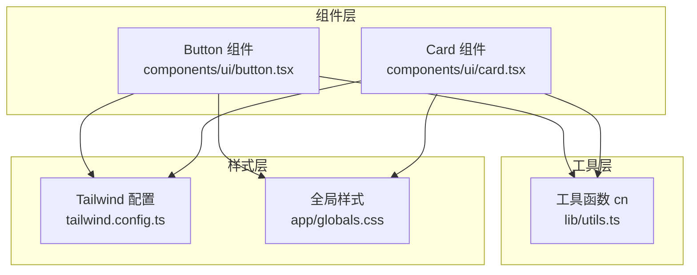
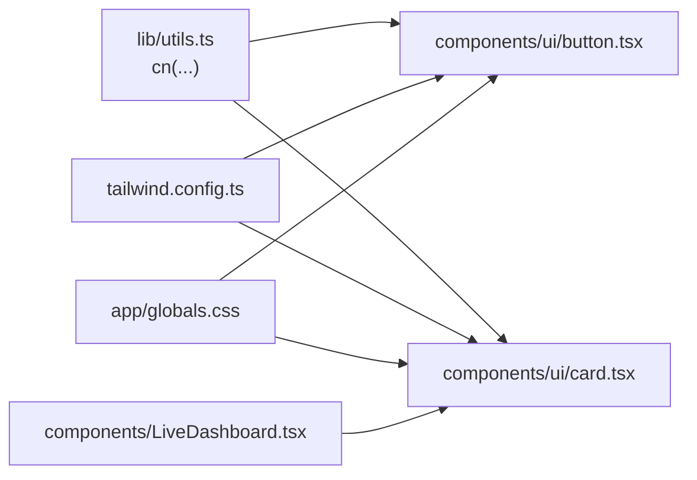
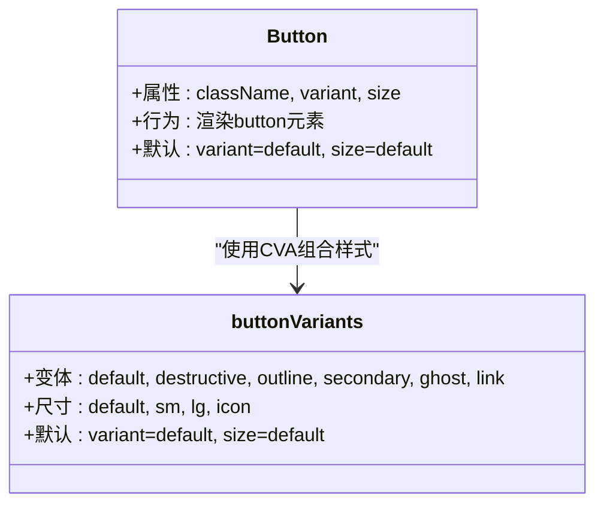
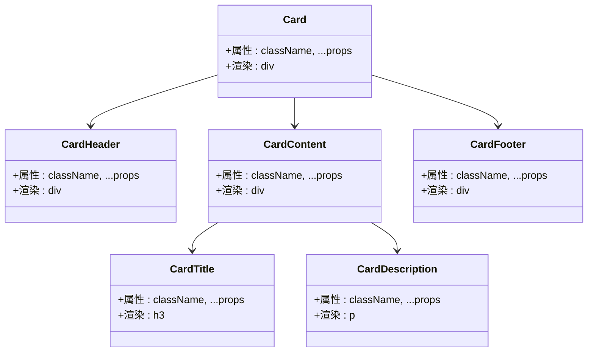
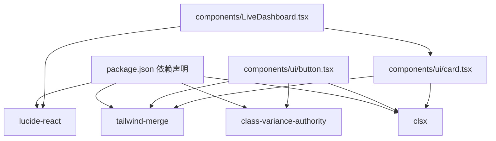

# 基础UI组件

<cite>
**本文引用的文件**
- [button.tsx](file://components/ui/button.tsx)
- [card.tsx](file://components/ui/card.tsx)
- [utils.ts](file://lib/utils.ts)
- [tailwind.config.ts](file://tailwind.config.ts)
- [globals.css](file://app/globals.css)
- [LiveDashboard.tsx](file://components/LiveDashboard.tsx)
- [package.json](file://package.json)
- [README.md](file://README.md)
</cite>

## 目录
1. [简介](#简介)
2. [项目结构](#项目结构)
3. [核心组件](#核心组件)
4. [架构总览](#架构总览)
5. [详细组件分析](#详细组件分析)
6. [依赖关系分析](#依赖关系分析)
7. [性能考量](#性能考量)
8. [故障排查指南](#故障排查指南)
9. [结论](#结论)
10. [附录](#附录)

## 简介
本文件聚焦于项目中的基础UI组件库，重点解析Button与Card两大组件的设计与实现，涵盖：
- Button组件的变体系统（默认、破坏性、轮廓、次要、Ghost、链接）
- Button组件的尺寸规格（默认、小号、大号、图标）
- CVA（Class Variance Authority）变体系统的样式组合逻辑与响应式设计
- Card组件的结构设计与使用场景
- 属性配置、样式定制与扩展指南
- 实际代码示例路径与最佳实践

## 项目结构
基础UI组件位于components/ui目录下，采用“按功能分层”的组织方式：
- components/ui/button.tsx：Button基础组件与CVA变体定义
- components/ui/card.tsx：Card复合组件（Card、CardHeader、CardTitle、CardDescription、CardContent、CardFooter）
- lib/utils.ts：通用工具函数cn（clsx + tailwind-merge）
- tailwind.config.ts：Tailwind主题与CSS变量映射
- app/globals.css：CSS变量与基础层样式
- components/LiveDashboard.tsx：业务页面中对Card组件的实际使用示例

图表来源
- [button.tsx:1-49](file://components/ui/button.tsx#L1-L49)
- [card.tsx:1-79](file://components/ui/card.tsx#L1-L79)
- [utils.ts:1-7](file://lib/utils.ts#L1-L7)
- [tailwind.config.ts:1-105](file://tailwind.config.ts#L1-L105)
- [globals.css:1-125](file://app/globals.css#L1-L125)

章节来源
- [button.tsx:1-49](file://components/ui/button.tsx#L1-L49)
- [card.tsx:1-79](file://components/ui/card.tsx#L1-L79)
- [utils.ts:1-7](file://lib/utils.ts#L1-L7)
- [tailwind.config.ts:1-105](file://tailwind.config.ts#L1-L105)
- [globals.css:1-125](file://app/globals.css#L1-L125)

## 核心组件
本节概述两个基础组件的能力边界与典型用法。

- Button组件
  - 支持六种变体：默认、破坏性、轮廓、次要、Ghost、链接
  - 支持四种尺寸：默认、小号、大号、图标
  - 使用CVA进行样式组合，并通过cn合并类名
  - 默认变体与尺寸由CVA定义，可通过属性覆盖

- Card组件
  - 提供容器、标题、描述、内容、页脚等子组件
  - 通过CSS变量与Tailwind主题实现明暗主题一致的视觉风格
  - 在业务页面中作为统计卡片、信息区块的基础容器

章节来源
- [button.tsx:5-29](file://components/ui/button.tsx#L5-L29)
- [card.tsx:1-79](file://components/ui/card.tsx#L1-L79)

## 架构总览
基础UI组件与样式系统的关系如下：
- Button与Card均依赖cn工具函数进行类名合并
- 样式来源于Tailwind主题配置与CSS变量，确保一致的主题行为
- 业务页面通过导入组件并在模板中直接使用

图表来源
- [utils.ts:1-7](file://lib/utils.ts#L1-L7)
- [button.tsx:1-49](file://components/ui/button.tsx#L1-L49)
- [card.tsx:1-79](file://components/ui/card.tsx#L1-L79)
- [tailwind.config.ts:1-105](file://tailwind.config.ts#L1-L105)
- [globals.css:1-125](file://app/globals.css#L1-L125)
- [LiveDashboard.tsx:1-375](file://components/LiveDashboard.tsx#L1-L375)

## 详细组件分析

### Button组件：变体系统与CVA实现
- 变体（variant）
  - default：主色背景与前景色，悬停时透明度降低
  - destructive：破坏性背景与前景色，悬停时透明度降低
  - outline：边框+背景+前景色，悬停时进入强调态
  - secondary：次级背景与前景色，悬停时透明度降低
  - ghost：仅悬停态有强调，无底色
  - link：文本链接样式，悬停时下划线
- 尺寸（size）
  - default：标准高度与内边距
  - sm：较小尺寸，圆角微调
  - lg：较大尺寸，圆角微调
  - icon：方形图标按钮，宽高相等
- 默认变体与尺寸
  - 通过CVA defaultVariants统一设置，未传参时生效
- 样式组合逻辑
  - 基础类名统一包含对齐、圆角、字体、焦点环、禁用态等
  - 变体与尺寸通过CVA映射到具体颜色与尺寸类
  - 最终通过cn合并用户传入的className
- 响应式设计
  - 组件本身不直接处理断点，但其尺寸类遵循Tailwind语义，可在父容器中结合响应式布局使用

图表来源
- [button.tsx:5-29](file://components/ui/button.tsx#L5-L29)

章节来源
- [button.tsx:5-29](file://components/ui/button.tsx#L5-L29)
- [button.tsx:31-48](file://components/ui/button.tsx#L31-L48)
- [utils.ts:4-6](file://lib/utils.ts#L4-L6)

### Button组件：使用示例与最佳实践
- 在业务页面中，Button组件常用于交互入口、操作按钮等场景
- 最佳实践
  - 明确区分操作意图：主操作使用default；危险操作使用destructive
  - 图标按钮使用icon尺寸，保持视觉一致性
  - 通过className扩展样式，避免覆盖CVA映射
  - 注意禁用态与焦点态的可访问性

章节来源
- [LiveDashboard.tsx:128-136](file://components/LiveDashboard.tsx#L128-L136)
- [LiveDashboard.tsx:222-250](file://components/LiveDashboard.tsx#L222-L250)
- [LiveDashboard.tsx:365-372](file://components/LiveDashboard.tsx#L365-L372)

### Card组件：结构设计与使用场景
- 结构组成
  - Card：容器，包含边框、背景、阴影与前景色
  - CardHeader：标题区域容器，垂直间距与内边距
  - CardTitle：标题文本，字号、字重、行高与字距
  - CardDescription：描述文本，字号与强调色
  - CardContent：内容区，上边距与内边距
  - CardFooter：底部操作区，对齐与内边距
- 使用场景
  - 业务页面中作为统计卡片、信息区块的基础容器
  - 与交互元素（如按钮、链接）组合，形成可点击的卡片

图表来源
- [card.tsx:4-78](file://components/ui/card.tsx#L4-L78)

章节来源
- [card.tsx:1-79](file://components/ui/card.tsx#L1-L79)

### Card组件：在业务页面中的使用
- 在LiveDashboard中，StatCard使用Card作为统计卡片容器，内部组合CardContent与其他元素
- 通过className扩展样式，实现悬停态与交互态

章节来源
- [LiveDashboard.tsx:314-350](file://components/LiveDashboard.tsx#L314-L350)

## 依赖关系分析
- 工具依赖
  - class-variance-authority：用于定义CVA变体
  - clsx/tailwind-merge：用于安全合并类名
  - lucide-react：图标库（业务页面使用）
- 样式依赖
  - Tailwind CSS：原子化样式框架
  - CSS变量：通过app/globals.css与tailwind.config.ts统一主题色板
- 组件依赖
  - Button与Card均依赖lib/utils.ts中的cn函数
  - 业务页面LiveDashboard导入Card组件并使用

图表来源
- [package.json:11-19](file://package.json#L11-L19)
- [button.tsx:1-49](file://components/ui/button.tsx#L1-L49)
- [card.tsx:1-79](file://components/ui/card.tsx#L1-L79)
- [LiveDashboard.tsx:1-375](file://components/LiveDashboard.tsx#L1-L375)

章节来源
- [package.json:11-19](file://package.json#L11-L19)
- [button.tsx:1-49](file://components/ui/button.tsx#L1-L49)
- [card.tsx:1-79](file://components/ui/card.tsx#L1-L79)
- [LiveDashboard.tsx:1-375](file://components/LiveDashboard.tsx#L1-L375)

## 性能考量
- 样式合并
  - 使用clsx与tailwind-merge合并类名，避免重复与冲突，减少无效样式
- 组件复用
  - 通过CVA集中管理变体与尺寸，降低重复代码与维护成本
- 主题一致性
  - CSS变量与Tailwind主题统一，减少主题切换时的重绘开销
- 响应式布局
  - 尺寸与布局通过Tailwind语义实现，避免额外的JavaScript计算

## 故障排查指南
- Button变体/尺寸无效
  - 检查是否正确传入variant与size属性
  - 确认className未覆盖CVA生成的类名
- 样式冲突
  - 使用cn函数合并类名，避免直接拼接字符串
- 主题色异常
  - 检查app/globals.css中的CSS变量与tailwind.config.ts的颜色映射
- 焦点环与禁用态
  - 确保未覆盖CVA中关于焦点环与禁用态的类名

章节来源
- [button.tsx:5-29](file://components/ui/button.tsx#L5-L29)
- [utils.ts:4-6](file://lib/utils.ts#L4-L6)
- [globals.css:5-90](file://app/globals.css#L5-L90)
- [tailwind.config.ts:21-63](file://tailwind.config.ts#L21-L63)

## 结论
本项目的基础UI组件库以简洁、可组合为核心设计原则：
- Button通过CVA实现清晰的变体与尺寸体系，配合cn保证样式安全合并
- Card提供模块化的卡片结构，便于在业务页面中快速搭建信息区块
- 依托Tailwind与CSS变量，实现跨主题的一致性与可扩展性
- 建议在实际使用中遵循最佳实践，明确变体与尺寸用途，合理扩展样式，提升可维护性与可访问性

## 附录

### 属性与配置参考
- Button
  - 属性：className、variant（默认/破坏性/轮廓/次要/Ghost/链接）、size（默认/小号/大号/图标）
  - 默认：variant=default，size=default
  - 扩展：通过className叠加自定义样式
- Card
  - 子组件：Card、CardHeader、CardTitle、CardDescription、CardContent、CardFooter
  - 适用场景：统计卡片、信息区块、可点击容器

章节来源
- [button.tsx:31-48](file://components/ui/button.tsx#L31-L48)
- [card.tsx:1-79](file://components/ui/card.tsx#L1-L79)

### 样式定制与扩展指南
- 使用cn函数合并类名，避免覆盖CVA生成的类
- 通过Tailwind主题扩展颜色与圆角，保持与现有变体一致
- 在业务页面中，优先使用现有变体与尺寸，必要时新增变体需统一命名与语义

章节来源
- [utils.ts:4-6](file://lib/utils.ts#L4-L6)
- [tailwind.config.ts:21-74](file://tailwind.config.ts#L21-L74)
- [globals.css:5-90](file://app/globals.css#L5-L90)