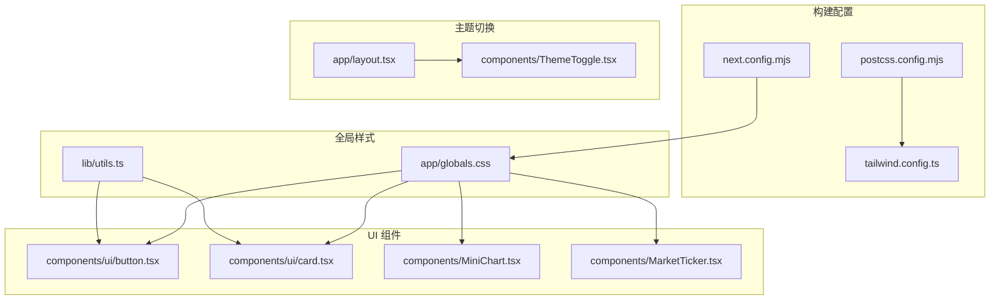
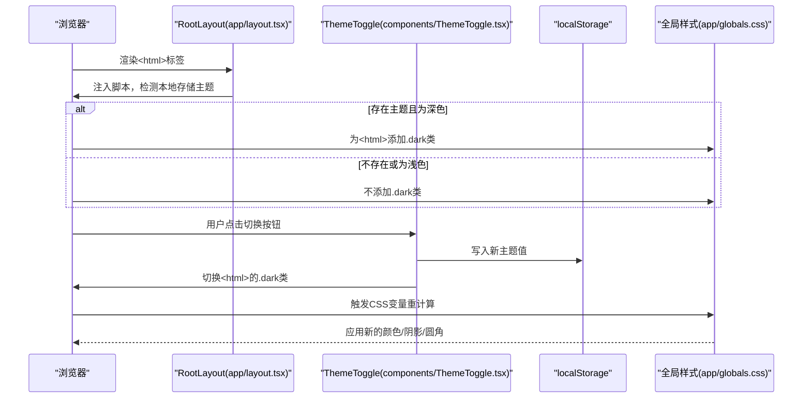
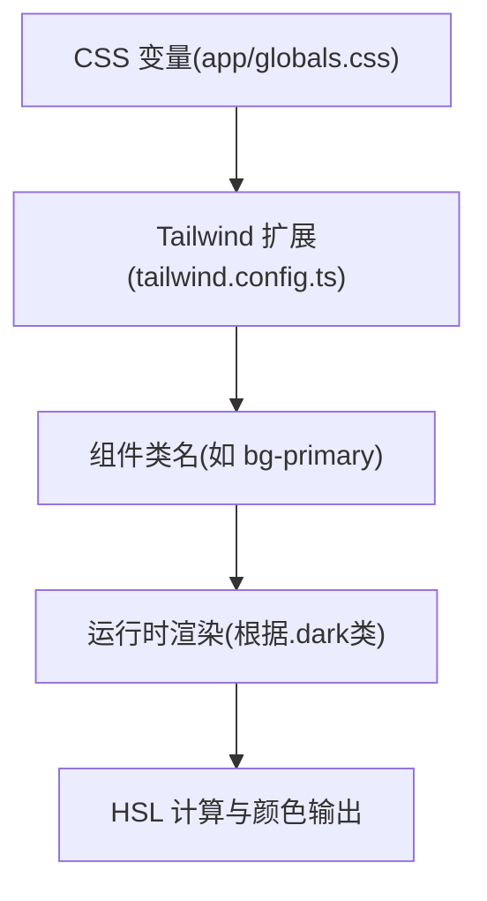
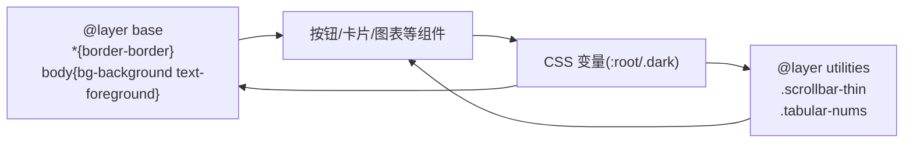
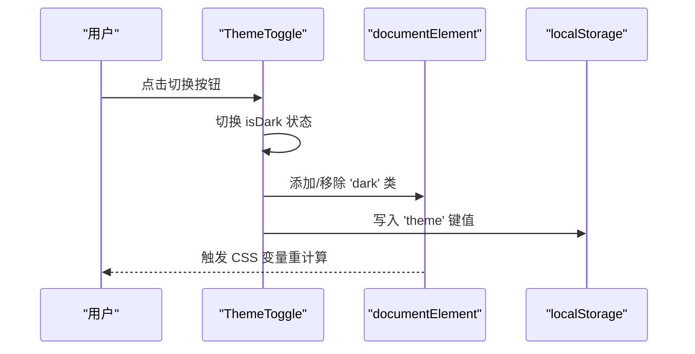
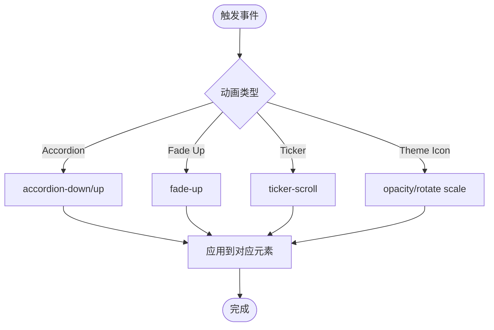
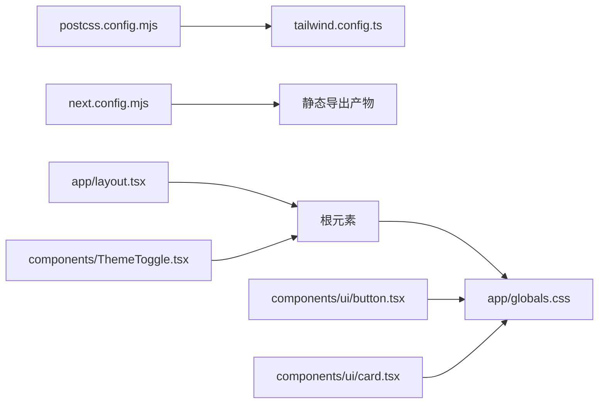

# 主题与样式

<cite>
**本文引用的文件**
- [tailwind.config.ts](file://tailwind.config.ts)
- [app/globals.css](file://app/globals.css)
- [components/ThemeToggle.tsx](file://components/ThemeToggle.tsx)
- [app/layout.tsx](file://app/layout.tsx)
- [postcss.config.mjs](file://postcss.config.mjs)
- [next.config.mjs](file://next.config.mjs)
- [components/ui/button.tsx](file://components/ui/button.tsx)
- [components/ui/card.tsx](file://components/ui/card.tsx)
- [lib/utils.ts](file://lib/utils.ts)
- [components/MiniChart.tsx](file://components/MiniChart.tsx)
- [components/MarketTicker.tsx](file://components/MarketTicker.tsx)
- [package.json](file://package.json)
</cite>

## 目录
1. [简介](#简介)
2. [项目结构](#项目结构)
3. [核心组件](#核心组件)
4. [架构总览](#架构总览)
5. [详细组件分析](#详细组件分析)
6. [依赖关系分析](#依赖关系分析)
7. [性能考量](#性能考量)
8. [故障排查指南](#故障排查指南)
9. [结论](#结论)
10. [附录：主题定制扩展指南](#附录主题定制扩展指南)

## 简介
本文件系统性解析基金实盘跟踪应用的主题与样式系统，重点覆盖以下方面：
- Tailwind CSS 3.4 的设计系统配置策略（设计变量、颜色体系、圆角与阴影、动画与过渡）
- 深色/浅色主题的实现原理（CSS 变量、类名切换、首屏无闪烁策略）
- ThemeToggle 组件的实现与状态持久化（用户偏好存储与状态同步）
- 全局样式的组织（CSS 变量定义、组件样式隔离、字体与排版）
- 动画与过渡效果（主题切换动画、组件交互动画）
- 主题定制扩展指南（颜色方案修改、样式变量调整）

## 项目结构
样式系统由“构建配置 + 全局样式 + 组件样式 + 主题切换”四部分组成：
- 构建配置：Tailwind 配置、PostCSS 插件链、Next 输出配置
- 全局样式：CSS 变量定义、基础层与工具层样式
- 组件样式：基于 Tailwind 类与设计变量的 UI 组件
- 主题切换：客户端组件负责主题切换与本地存储



图表来源
- [tailwind.config.ts:1-105](file://tailwind.config.ts#L1-L105)
- [postcss.config.mjs:1-10](file://postcss.config.mjs#L1-L10)
- [next.config.mjs:1-13](file://next.config.mjs#L1-L13)
- [app/globals.css:1-125](file://app/globals.css#L1-L125)
- [lib/utils.ts:1-7](file://lib/utils.ts#L1-L7)
- [app/layout.tsx:1-35](file://app/layout.tsx#L1-L35)
- [components/ThemeToggle.tsx:1-52](file://components/ThemeToggle.tsx#L1-L52)
- [components/ui/button.tsx:1-49](file://components/ui/button.tsx#L1-L49)
- [components/ui/card.tsx:1-79](file://components/ui/card.tsx#L1-L79)
- [components/MiniChart.tsx:1-41](file://components/MiniChart.tsx#L1-L41)
- [components/MarketTicker.tsx:1-33](file://components/MarketTicker.tsx#L1-L33)

章节来源
- [tailwind.config.ts:1-105](file://tailwind.config.ts#L1-L105)
- [app/globals.css:1-125](file://app/globals.css#L1-L125)
- [components/ThemeToggle.tsx:1-52](file://components/ThemeToggle.tsx#L1-L52)
- [app/layout.tsx:1-35](file://app/layout.tsx#L1-L35)
- [postcss.config.mjs:1-10](file://postcss.config.mjs#L1-L10)
- [next.config.mjs:1-13](file://next.config.mjs#L1-L13)
- [components/ui/button.tsx:1-49](file://components/ui/button.tsx#L1-L49)
- [components/ui/card.tsx:1-79](file://components/ui/card.tsx#L1-L79)
- [lib/utils.ts:1-7](file://lib/utils.ts#L1-L7)
- [components/MiniChart.tsx:1-41](file://components/MiniChart.tsx#L1-L41)
- [components/MarketTicker.tsx:1-33](file://components/MarketTicker.tsx#L1-L33)

## 核心组件
- Tailwind 设计系统：通过 CSS 变量桥接 HSL 色彩空间，统一颜色、圆角、阴影与动画
- 全局样式：在根作用域定义浅色/深色两套变量，配合暗色类名实现主题切换
- 主题切换：客户端组件读取本地存储，控制根元素类名，实现即时主题切换
- UI 组件：按钮与卡片等组件直接使用设计变量，自动适配当前主题

章节来源
- [tailwind.config.ts:20-99](file://tailwind.config.ts#L20-L99)
- [app/globals.css:5-91](file://app/globals.css#L5-L91)
- [components/ThemeToggle.tsx:6-33](file://components/ThemeToggle.tsx#L6-L33)
- [components/ui/button.tsx:5-29](file://components/ui/button.tsx#L5-L29)
- [components/ui/card.tsx:4-16](file://components/ui/card.tsx#L4-L16)

## 架构总览
下图展示从构建到运行时的主题切换流程，以及样式变量如何驱动组件渲染。



图表来源
- [app/layout.tsx:18-24](file://app/layout.tsx#L18-L24)
- [components/ThemeToggle.tsx:10-33](file://components/ThemeToggle.tsx#L10-L33)
- [app/globals.css:50-91](file://app/globals.css#L50-L91)

## 详细组件分析

### Tailwind 设计系统与变量映射
- 设计变量来源：全局 CSS 变量（app/globals.css），以 HSL 表达，包含背景、前景、主色、次色、强调色、破坏性、成功、警告、边框、输入、环形高光、圆角半径与阴影等
- 变量到 Tailwind：tailwind.config.ts 将颜色、圆角、阴影、动画等映射到 CSS 变量，确保组件无需硬编码颜色值
- 响应式断点：容器最大宽度至 2xl 屏幕，满足桌面端仪表盘布局需求



图表来源
- [app/globals.css:5-91](file://app/globals.css#L5-L91)
- [tailwind.config.ts:20-99](file://tailwind.config.ts#L20-L99)

章节来源
- [tailwind.config.ts:12-19](file://tailwind.config.ts#L12-L19)
- [tailwind.config.ts:20-68](file://tailwind.config.ts#L20-L68)
- [tailwind.config.ts:69-99](file://tailwind.config.ts#L69-L99)
- [app/globals.css:5-91](file://app/globals.css#L5-L91)

### 全局样式组织与样式隔离
- 基础层（base）：统一边框、背景、文字、抗锯齿与字体特性设置
- 工具层（utilities）：自定义滚动条与等宽数字排版
- 组件样式隔离：UI 组件通过 Tailwind 类与设计变量，避免直接写死颜色，保证主题切换时的一致性



图表来源
- [app/globals.css:93-125](file://app/globals.css#L93-L125)

章节来源
- [app/globals.css:1-125](file://app/globals.css#L1-L125)
- [lib/utils.ts:4-6](file://lib/utils.ts#L4-L6)

### ThemeToggle 组件：实现与状态同步
- 客户端组件：使用 React 状态管理主题布尔值
- 首屏无闪烁：服务端注入脚本优先判断本地存储并设置根元素类名
- 本地存储：持久化用户偏好，支持 light/dark
- 交互动画：太阳/月亮图标在不同主题下透明度与旋转状态平滑过渡



图表来源
- [components/ThemeToggle.tsx:6-33](file://components/ThemeToggle.tsx#L6-L33)
- [app/layout.tsx:18-24](file://app/layout.tsx#L18-L24)

章节来源
- [components/ThemeToggle.tsx:1-52](file://components/ThemeToggle.tsx#L1-L52)
- [app/layout.tsx:18-24](file://app/layout.tsx#L18-L24)

### UI 组件与设计变量的耦合
- 按钮组件：通过 Variants 定义多种变体与尺寸，内部使用设计变量作为色板
- 卡片组件：统一使用卡片背景与前景色，自动适配主题
- 图表与行情：图表线条与渐变使用设计变量，确保正负向状态的颜色一致性

```mermaid
classDiagram
class Button {
+variant(default/destructive/outline/secondary/ghost/link)
+size(default/sm/lg/icon)
+render()
}
class Card {
+CardHeader()
+CardTitle()
+CardDescription()
+CardContent()
+CardFooter()
}
class MiniChart {
+strokeColor(hsl(var(--success/--destructive)))
+render()
}
Button --> "使用" DesignVars["设计变量"]
Card --> "使用" DesignVars
MiniChart --> "使用" DesignVars
```

图表来源
- [components/ui/button.tsx:5-29](file://components/ui/button.tsx#L5-L29)
- [components/ui/card.tsx:4-16](file://components/ui/card.tsx#L4-L16)
- [components/MiniChart.tsx:29-41](file://components/MiniChart.tsx#L29-L41)

章节来源
- [components/ui/button.tsx:1-49](file://components/ui/button.tsx#L1-L49)
- [components/ui/card.tsx:1-79](file://components/ui/card.tsx#L1-L79)
- [components/MiniChart.tsx:1-41](file://components/MiniChart.tsx#L1-L41)

### 动画与过渡效果
- Accordion 动画：折叠/展开高度动画，使用 Radix 动画高度变量
- 上浮动画：淡入上移，用于页面元素入场
- 行情跑马灯：水平无限循环滚动，鼠标悬停暂停
- 主题切换过渡：太阳/月亮图标透明度与旋转过渡，持续时间固定



图表来源
- [tailwind.config.ts:75-98](file://tailwind.config.ts#L75-L98)
- [components/MarketTicker.tsx:12-21](file://components/MarketTicker.tsx#L12-L21)
- [components/ThemeToggle.tsx:40-49](file://components/ThemeToggle.tsx#L40-L49)

章节来源
- [tailwind.config.ts:75-98](file://tailwind.config.ts#L75-L98)
- [components/MarketTicker.tsx:1-33](file://components/MarketTicker.tsx#L1-L33)
- [components/ThemeToggle.tsx:40-49](file://components/ThemeToggle.tsx#L40-L49)

## 依赖关系分析
- 构建链路：PostCSS 加载 Tailwind 插件，Tailwind 读取配置并扫描内容，生成最终 CSS
- 运行时链路：Next 导出静态站点，根布局注入脚本以避免首屏闪烁；主题切换通过 JavaScript 控制根元素类名
- 组件依赖：UI 组件依赖设计变量与工具函数（clsx/twMerge），确保类名合并与冲突消除



图表来源
- [postcss.config.mjs:1-10](file://postcss.config.mjs#L1-L10)
- [tailwind.config.ts:1-105](file://tailwind.config.ts#L1-L105)
- [next.config.mjs:1-13](file://next.config.mjs#L1-L13)
- [app/layout.tsx:27-32](file://app/layout.tsx#L27-L32)
- [components/ThemeToggle.tsx:23-33](file://components/ThemeToggle.tsx#L23-L33)
- [app/globals.css:1-125](file://app/globals.css#L1-L125)
- [components/ui/button.tsx:1-49](file://components/ui/button.tsx#L1-L49)
- [components/ui/card.tsx:1-79](file://components/ui/card.tsx#L1-L79)

章节来源
- [postcss.config.mjs:1-10](file://postcss.config.mjs#L1-L10)
- [tailwind.config.ts:1-105](file://tailwind.config.ts#L1-L105)
- [next.config.mjs:1-13](file://next.config.mjs#L1-L13)
- [app/layout.tsx:1-35](file://app/layout.tsx#L1-L35)
- [components/ThemeToggle.tsx:1-52](file://components/ThemeToggle.tsx#L1-L52)
- [app/globals.css:1-125](file://app/globals.css#L1-L125)
- [components/ui/button.tsx:1-49](file://components/ui/button.tsx#L1-L49)
- [components/ui/card.tsx:1-79](file://components/ui/card.tsx#L1-L79)

## 性能考量
- 静态导出：Next 配置为静态导出，减少运行时开销，利于 CDN 分发
- CSS 变量：通过变量驱动颜色与阴影，避免重复计算与多处硬编码
- 动画优化：使用 CSS 动画而非 JS 动画，降低主线程压力
- 类名合并：使用 clsx 与 twMerge 合并类名，减少无效类名带来的样式冲突与体积

章节来源
- [next.config.mjs:4-6](file://next.config.mjs#L4-L6)
- [lib/utils.ts:4-6](file://lib/utils.ts#L4-L6)

## 故障排查指南
- 首屏闪烁问题
  - 现象：页面加载时主题闪烁
  - 排查：确认根布局是否注入了主题脚本，确保在客户端渲染前已设置根元素类名
  - 参考：[app/layout.tsx:18-24](file://app/layout.tsx#L18-L24)
- 主题切换无效
  - 现象：点击切换按钮后颜色未变化
  - 排查：检查 ThemeToggle 是否正确写入/移除根元素的 dark 类，确认本地存储键值是否正确
  - 参考：[components/ThemeToggle.tsx:23-33](file://components/ThemeToggle.tsx#L23-L33)
- 颜色不一致
  - 现象：组件颜色与设计变量不一致
  - 排查：确认组件是否使用设计变量类名，检查 tailwind.config.ts 中颜色映射是否正确
  - 参考：[tailwind.config.ts:21-63](file://tailwind.config.ts#L21-L63)
- 动画异常
  - 现象：动画不生效或卡顿
  - 排查：确认动画名称与 keyframes 是否匹配，检查浏览器兼容性与硬件加速
  - 参考：[tailwind.config.ts:75-98](file://tailwind.config.ts#L75-L98)

章节来源
- [app/layout.tsx:18-24](file://app/layout.tsx#L18-L24)
- [components/ThemeToggle.tsx:23-33](file://components/ThemeToggle.tsx#L23-L33)
- [tailwind.config.ts:21-63](file://tailwind.config.ts#L21-L63)
- [tailwind.config.ts:75-98](file://tailwind.config.ts#L75-L98)

## 结论
该样式系统以 CSS 变量为核心，结合 Tailwind 的设计变量映射与动画扩展，实现了可维护、可扩展、可定制的主题体系。通过根元素类名切换与首屏脚本策略，确保了良好的用户体验与性能表现。UI 组件通过设计变量与工具函数，保持了样式的一致性与隔离性。

## 附录：主题定制扩展指南
- 修改颜色方案
  - 在全局 CSS 变量中调整 HSL 值，例如背景、前景、主色、次色、强调色、破坏性、成功、警告等
  - 对应修改 tailwind.config.ts 中的颜色映射，确保组件类名仍能正确解析
  - 参考路径：[app/globals.css:5-91](file://app/globals.css#L5-L91)，[tailwind.config.ts:21-63](file://tailwind.config.ts#L21-L63)
- 调整圆角与阴影
  - 修改圆角变量与阴影变量，影响所有使用对应 Tailwind 扩展的组件
  - 参考路径：[app/globals.css:41](file://app/globals.css#L41)，[app/globals.css:44-47](file://app/globals.css#L44-L47)，[tailwind.config.ts:64-74](file://tailwind.config.ts#L64-L74)
- 自定义动画
  - 在 tailwind.config.ts 的 keyframes 与 animation 中新增或修改动画，确保命名规范与组件使用一致
  - 参考路径：[tailwind.config.ts:75-98](file://tailwind.config.ts#L75-L98)
- 本地存储与默认主题
  - 如需调整默认主题，可在 ThemeToggle 初始化逻辑中修改默认值
  - 参考路径：[components/ThemeToggle.tsx:17-21](file://components/ThemeToggle.tsx#L17-L21)
- 构建与导出
  - 如需调整静态导出路径或资源前缀，可在 Next 配置中修改
  - 参考路径：[next.config.mjs:5-6](file://next.config.mjs#L5-L6)