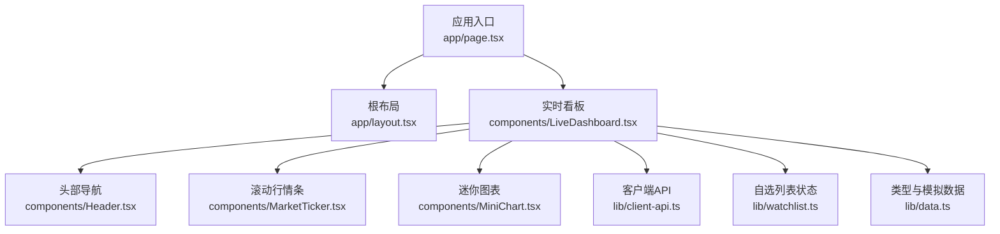
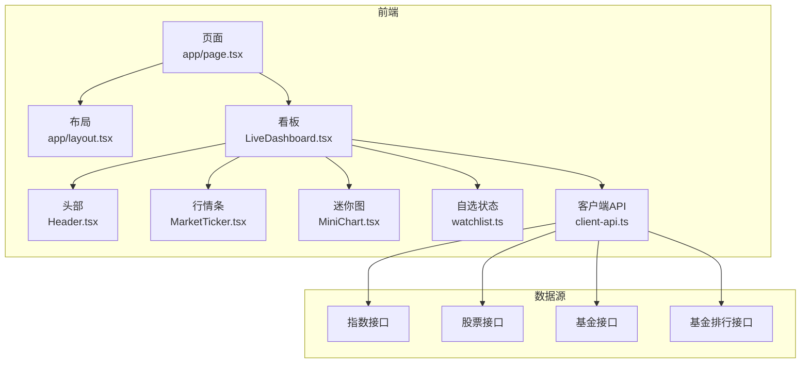
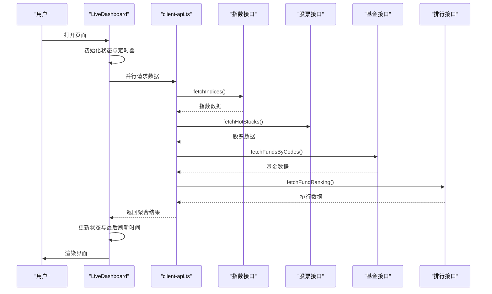
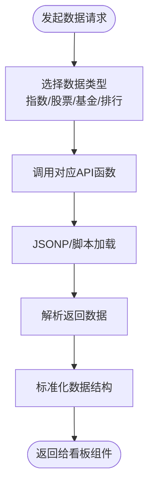
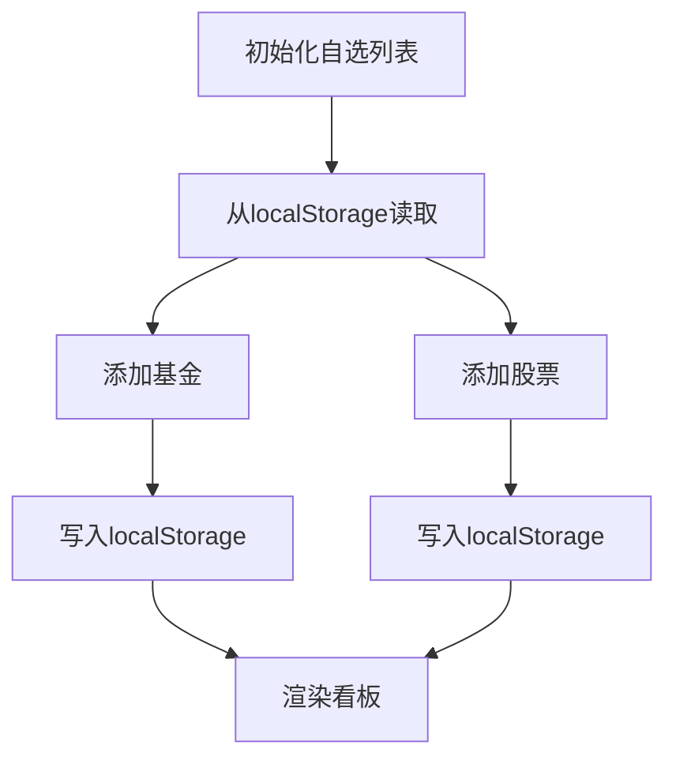
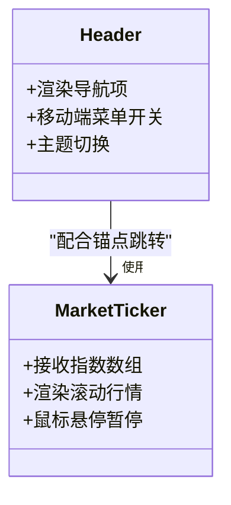
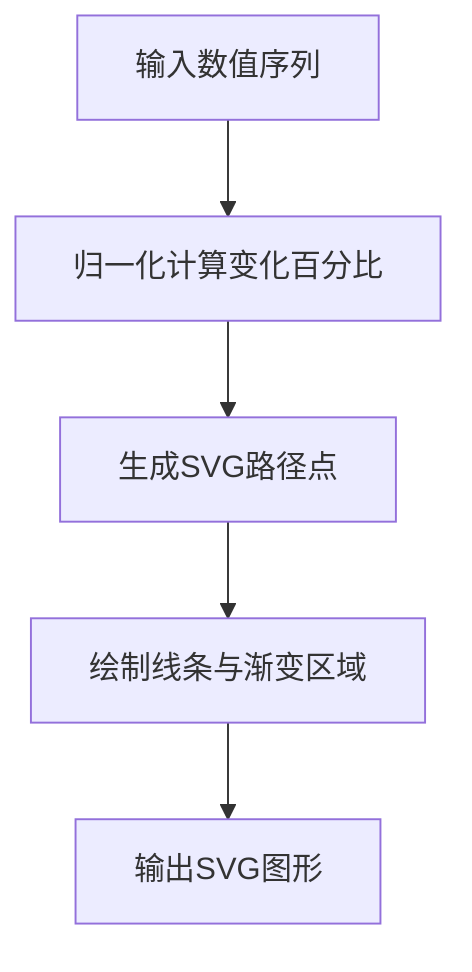
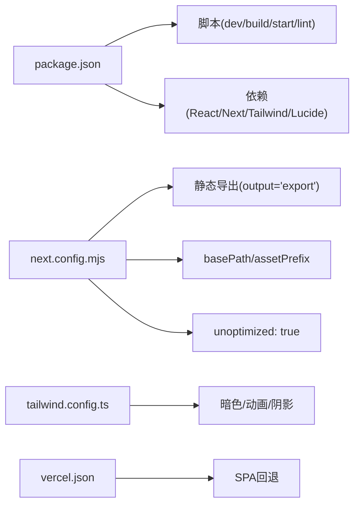

# 快速开始

<cite>
**本文引用的文件**
- [README.md](file://README.md)
- [package.json](file://package.json)
- [next.config.mjs](file://next.config.mjs)
- [vercel.json](file://vercel.json)
- [tailwind.config.ts](file://tailwind.config.ts)
- [app/layout.tsx](file://app/layout.tsx)
- [app/page.tsx](file://app/page.tsx)
- [components/LiveDashboard.tsx](file://components/LiveDashboard.tsx)
- [components/Header.tsx](file://components/Header.tsx)
- [components/MarketTicker.tsx](file://components/MarketTicker.tsx)
- [components/MiniChart.tsx](file://components/MiniChart.tsx)
- [lib/client-api.ts](file://lib/client-api.ts)
- [lib/watchlist.ts](file://lib/watchlist.ts)
- [lib/data.ts](file://lib/data.ts)
- [components/ui/button.tsx](file://components/ui/button.tsx)
</cite>

## 目录
1. [简介](#简介)
2. [项目结构](#项目结构)
3. [核心组件](#核心组件)
4. [架构总览](#架构总览)
5. [详细组件分析](#详细组件分析)
6. [依赖分析](#依赖分析)
7. [性能考虑](#性能考虑)
8. [故障排查指南](#故障排查指南)
9. [结论](#结论)
10. [附录](#附录)

## 简介
本指南面向首次接触“基金实盘跟踪”项目的开发者，帮助你在最短时间内完成环境准备、安装依赖、启动开发服务器、构建生产包，并了解静态部署配置。项目基于 Next.js 16（静态导出），采用 TypeScript、Tailwind CSS 3.4，前端通过 JSONP 与多个财经数据源交互，实现全球指数、热门股票、基金净值等实时数据面板。

## 项目结构
项目采用 Next.js App Router 结构，核心入口位于 app/page.tsx，根布局在 app/layout.tsx；业务逻辑集中在 components/ 与 lib/ 目录，样式由 Tailwind CSS 提供，静态导出通过 next.config.mjs 配置。

**图表来源**
- [app/page.tsx:10-23](file://app/page.tsx#L10-L23)
- [app/layout.tsx:13-34](file://app/layout.tsx#L13-L34)
- [components/LiveDashboard.tsx:39-301](file://components/LiveDashboard.tsx#L39-L301)
- [components/Header.tsx:16-91](file://components/Header.tsx#L16-L91)
- [components/MarketTicker.tsx:8-51](file://components/MarketTicker.tsx#L8-L51)
- [components/MiniChart.tsx:9-56](file://components/MiniChart.tsx#L9-L56)
- [lib/client-api.ts:154-199](file://lib/client-api.ts#L154-L199)
- [lib/watchlist.ts:28-88](file://lib/watchlist.ts#L28-L88)
- [lib/data.ts:1-255](file://lib/data.ts#L1-L255)

**章节来源**
- [README.md:132-161](file://README.md#L132-L161)
- [app/page.tsx:10-23](file://app/page.tsx#L10-L23)
- [app/layout.tsx:13-34](file://app/layout.tsx#L13-L34)

## 核心组件
- 应用入口与元数据：app/page.tsx 定义页面标题与描述，渲染 Header 与 LiveDashboard。
- 根布局：app/layout.tsx 设置字体、主题脚本与全局样式。
- 实时看板：components/LiveDashboard.tsx 负责拉取数据、定时刷新、渲染各模块。
- 客户端 API：lib/client-api.ts 通过 JSONP 与多个财经接口交互，返回指数、股票、基金数据。
- 自选列表：lib/watchlist.ts 使用 localStorage 存储用户自选的基金与股票。
- 类型与模拟数据：lib/data.ts 定义数据结构与部分模拟数据，用于开发阶段展示。

**章节来源**
- [app/page.tsx:5-23](file://app/page.tsx#L5-L23)
- [app/layout.tsx:8-34](file://app/layout.tsx#L8-L34)
- [components/LiveDashboard.tsx:39-301](file://components/LiveDashboard.tsx#L39-L301)
- [lib/client-api.ts:154-595](file://lib/client-api.ts#L154-L595)
- [lib/watchlist.ts:28-88](file://lib/watchlist.ts#L28-L88)
- [lib/data.ts:1-255](file://lib/data.ts#L1-L255)

## 架构总览
项目采用“静态导出 + 前端数据请求”的架构：开发时通过 Next.js 开发服务器提供热更新；构建时生成纯静态文件，部署至任意静态托管平台（如 Vercel、GitHub Pages）。数据层通过 JSONP 从多个财经接口获取实时行情，组件内部进行聚合与展示。

**图表来源**
- [app/page.tsx:10-23](file://app/page.tsx#L10-L23)
- [app/layout.tsx:13-34](file://app/layout.tsx#L13-L34)
- [components/LiveDashboard.tsx:39-301](file://components/LiveDashboard.tsx#L39-L301)
- [lib/client-api.ts:154-595](file://lib/client-api.ts#L154-L595)

## 详细组件分析

### 实时看板组件（LiveDashboard）
- 职责：统一调度指数、股票、基金与排行数据，控制自动刷新与手动刷新，维护自选列表。
- 关键点：
  - 使用 Promise.allSettled 并行请求多路数据，提升加载效率。
  - 每 30 秒自动刷新一次，支持手动点击刷新。
  - 通过 useWatchlist 管理自选，localStorage 持久化。
  - 通过 client-api.ts 的 fetchIndices、fetchHotStocks、fetchFundsByCodes、fetchFundRanking 获取数据。

**图表来源**
- [components/LiveDashboard.tsx:56-95](file://components/LiveDashboard.tsx#L56-L95)
- [lib/client-api.ts:154-595](file://lib/client-api.ts#L154-L595)

**章节来源**
- [components/LiveDashboard.tsx:39-301](file://components/LiveDashboard.tsx#L39-L301)
- [lib/client-api.ts:154-595](file://lib/client-api.ts#L154-L595)

### 客户端 API（client-api.ts）
- 职责：封装 JSONP 请求与脚本加载，对接多个财经接口，解析并标准化数据格式。
- 关键点：
  - JSONP 工具函数与超时处理，避免阻塞。
  - 指数、股票、基金净值与历史、搜索等接口统一管理。
  - 基金排行通过 fetch + 正则回退方案兼容不同环境。

**图表来源**
- [lib/client-api.ts:5-36](file://lib/client-api.ts#L5-L36)
- [lib/client-api.ts:154-595](file://lib/client-api.ts#L154-L595)

**章节来源**
- [lib/client-api.ts:1-596](file://lib/client-api.ts#L1-L596)

### 自选列表（watchlist.ts）
- 职责：管理用户自选的基金与股票，提供增删与持久化能力。
- 关键点：
  - 默认基金列表包含多个知名产品，便于演示。
  - localStorage 存储，兼容旧格式。
  - 提供 add/remove 方法与 mounted 标记避免水合问题。

**图表来源**
- [lib/watchlist.ts:28-88](file://lib/watchlist.ts#L28-L88)

**章节来源**
- [lib/watchlist.ts:1-89](file://lib/watchlist.ts#L1-L89)

### 头部导航与滚动行情条
- Header：提供移动端折叠菜单、主题切换与导航链接锚点。
- MarketTicker：展示全球指数实时滚动行情，支持鼠标悬停暂停动画。

**图表来源**
- [components/Header.tsx:16-91](file://components/Header.tsx#L16-L91)
- [components/MarketTicker.tsx:8-51](file://components/MarketTicker.tsx#L8-L51)

**章节来源**
- [components/Header.tsx:1-92](file://components/Header.tsx#L1-L92)
- [components/MarketTicker.tsx:1-52](file://components/MarketTicker.tsx#L1-L52)

### 迷你图表（MiniChart）
- 职责：根据传入数值序列绘制简洁的迷你折线图，支持正负颜色区分与渐变填充。
- 关键点：归一化计算坐标，SVG 绘制路径与渐变区域。

**图表来源**
- [components/MiniChart.tsx:9-56](file://components/MiniChart.tsx#L9-L56)

**章节来源**
- [components/MiniChart.tsx:1-57](file://components/MiniChart.tsx#L1-L57)

## 依赖分析
- 包管理与脚本：package.json 定义了 dev/build/start/lint 脚本，依赖 React、Next.js、Tailwind CSS、Lucide React 等。
- 静态导出配置：next.config.mjs 启用 output: 'export'，设置 basePath 与 assetPrefix，关闭图片优化以适配静态托管。
- 主题与样式：tailwind.config.ts 配置内容扫描路径、暗色模式、动画与阴影等。
- Vercel 重写：vercel.json 在 Vercel 上启用 SPA 回退，保证路由刷新正常。

**图表来源**
- [package.json:5-29](file://package.json#L5-L29)
- [next.config.mjs:2-10](file://next.config.mjs#L2-L10)
- [tailwind.config.ts:3-101](file://tailwind.config.ts#L3-L101)
- [vercel.json:1-1](file://vercel.json#L1-L1)

**章节来源**
- [package.json:1-31](file://package.json#L1-L31)
- [next.config.mjs:1-13](file://next.config.mjs#L1-L13)
- [tailwind.config.ts:1-105](file://tailwind.config.ts#L1-L105)
- [vercel.json:1-1](file://vercel.json#L1-L1)

## 性能考虑
- 并行请求：LiveDashboard 使用 Promise.allSettled 并行拉取多路数据，减少首屏等待。
- 自动刷新策略：每 30 秒刷新一次，避免过于频繁导致资源浪费；支持手动刷新。
- 图片优化：静态导出下关闭 Next.js 图片优化，改用原生 HTML，降低复杂度。
- 样式体积：Tailwind 内容扫描仅针对实际使用的组件与页面，避免打包无关样式。

[本节为通用性能建议，不直接分析具体文件，故无章节来源]

## 故障排查指南
- 开发服务器无法启动
  - 确认 Node.js 版本满足 ≥ 18，npm 版本满足 ≥ 9。
  - 清理缓存后重新安装依赖：删除 node_modules 与 lock 文件，执行安装命令。
- 页面空白或主题异常
  - 检查 app/layout.tsx 中的主题脚本是否正确注入。
  - 确认 Tailwind CSS 已正确编译，内容扫描路径包含组件与页面。
- 数据未刷新或显示为空
  - 检查网络面板是否存在 JSONP/脚本加载失败。
  - 确认 client-api.ts 对应接口返回正常，必要时查看浏览器控制台错误信息。
- 静态部署后路由 404
  - 确认 next.config.mjs 已启用静态导出与 basePath/assetPrefix。
  - 若部署至子路径，确保 basePath 与 assetPrefix 与部署路径一致。
  - Vercel 部署需启用 vercel.json 的重写规则。

**章节来源**
- [README.md:80-129](file://README.md#L80-L129)
- [app/layout.tsx:18-24](file://app/layout.tsx#L18-L24)
- [next.config.mjs:4-10](file://next.config.mjs#L4-L10)
- [vercel.json:1-1](file://vercel.json#L1-L1)
- [lib/client-api.ts:5-36](file://lib/client-api.ts#L5-L36)

## 结论
通过本指南，你可以快速完成环境准备、安装依赖、启动开发服务器，并了解构建与静态部署流程。项目采用静态导出与前端数据请求的架构，适合在 GitHub Pages、Vercel 等平台进行部署。遇到问题时，可依据故障排查指南逐项定位。

[本节为总结性内容，不直接分析具体文件，故无章节来源]

## 附录

### 快速开始步骤
- 环境要求
  - Node.js ≥ 18
  - npm ≥ 9
- 安装与运行
  - 克隆仓库、进入目录、安装依赖、启动开发服务器
  - 访问 http://localhost:3000/react-fund
- 构建
  - 执行构建命令，产物输出至 out/ 目录
- 部署
  - 项目已配置 GitHub Pages 自动部署（GitHub Actions）与 Vercel 回退重写

**章节来源**
- [README.md:80-129](file://README.md#L80-L129)
- [next.config.mjs:4-10](file://next.config.mjs#L4-L10)
- [vercel.json:1-1](file://vercel.json#L1-L1)