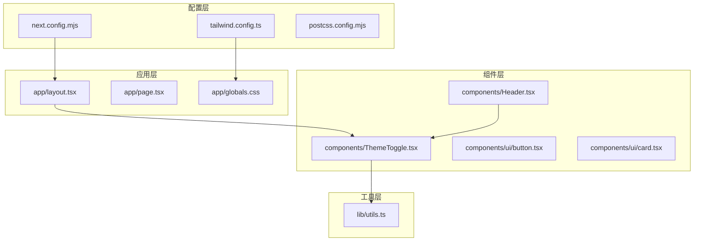
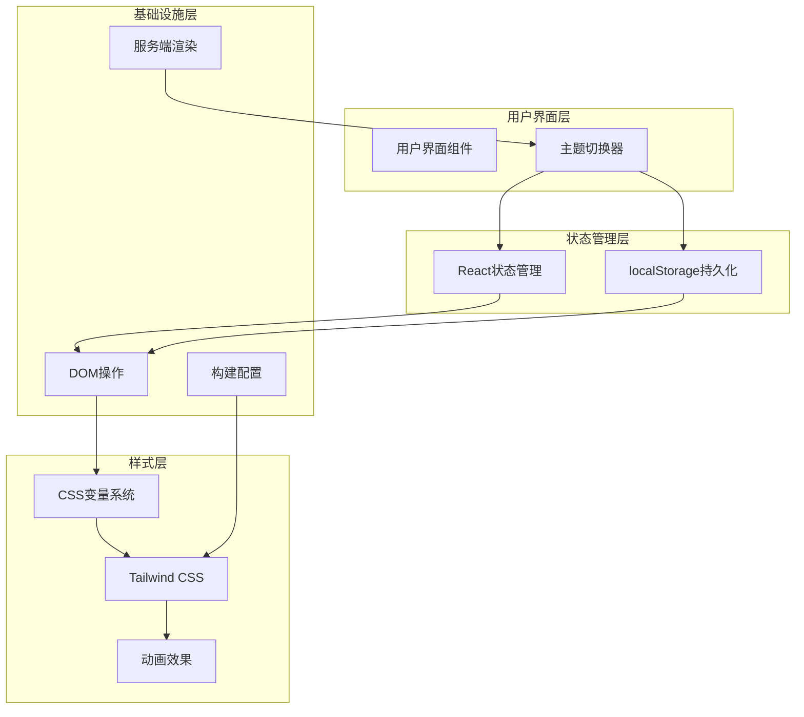
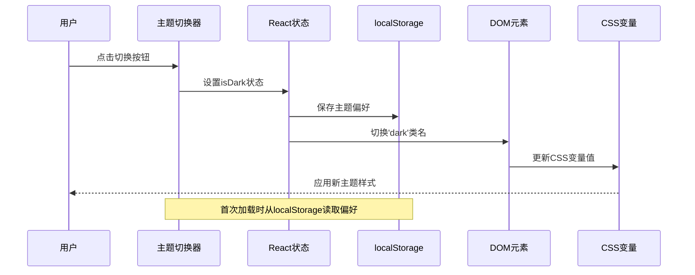
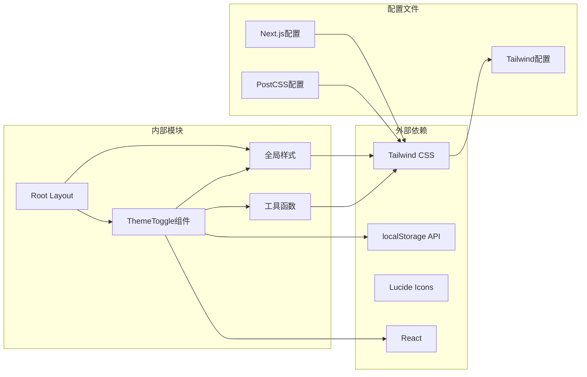

# 主题系统架构

<cite>
**本文档引用的文件**
- [app/layout.tsx](file://app/layout.tsx)
- [components/ThemeToggle.tsx](file://components/ThemeToggle.tsx)
- [tailwind.config.ts](file://tailwind.config.ts)
- [app/globals.css](file://app/globals.css)
- [next.config.mjs](file://next.config.mjs)
- [postcss.config.mjs](file://postcss.config.mjs)
- [components/Header.tsx](file://components/Header.tsx)
- [components/ui/button.tsx](file://components/ui/button.tsx)
- [components/ui/card.tsx](file://components/ui/card.tsx)
- [lib/utils.ts](file://lib/utils.ts)
- [package.json](file://package.json)
</cite>

## 目录
1. [简介](#简介)
2. [项目结构](#项目结构)
3. [核心组件](#核心组件)
4. [架构概览](#架构概览)
5. [详细组件分析](#详细组件分析)
6. [依赖关系分析](#依赖关系分析)
7. [性能考虑](#性能考虑)
8. [故障排除指南](#故障排除指南)
9. [结论](#结论)
10. [附录](#附录)

## 简介

本项目采用基于CSS变量和Tailwind CSS的主题系统架构，实现了深色/浅色主题的无缝切换。该系统通过HSL颜色空间定义统一的颜色变量，利用CSS类名切换机制实现主题切换，并通过localStorage实现用户偏好的持久化存储。整个系统支持服务端渲染和客户端渲染的一致性处理，提供了流畅的用户体验和良好的可访问性支持。

## 项目结构

主题系统相关的文件组织遵循Next.js的标准目录结构，主要分布在以下位置：

**图表来源**
- [app/layout.tsx:1-35](file://app/layout.tsx#L1-L35)
- [tailwind.config.ts:1-105](file://tailwind.config.ts#L1-L105)
- [components/ThemeToggle.tsx:1-52](file://components/ThemeToggle.tsx#L1-L52)

**章节来源**
- [app/layout.tsx:1-35](file://app/layout.tsx#L1-L35)
- [tailwind.config.ts:1-105](file://tailwind.config.ts#L1-L105)
- [components/ThemeToggle.tsx:1-52](file://components/ThemeToggle.tsx#L1-L52)

## 核心组件

### 主题切换器组件

主题切换器是整个主题系统的核心组件，负责用户交互和状态管理：

- **客户端组件**：使用'use client'指令确保在客户端运行
- **状态管理**：维护当前主题状态(isDark)和挂载状态(mounted)
- **本地存储**：持久化用户偏好设置
- **动画效果**：提供平滑的主题切换动画

### 布局组件

根布局负责初始化主题状态，确保服务端渲染和客户端渲染的一致性：

- **动态脚本**：在服务端注入JavaScript检测用户偏好
- **水合保护**：避免客户端和服务端渲染不一致
- **元数据**：提供SEO友好的页面信息

### Tailwind配置

Tailwind CSS配置定义了完整的主题系统：

- **深色模式**：启用基于类名的深色模式
- **颜色变量**：使用HSL变量定义颜色系统
- **阴影系统**：定义卡片和发光阴影效果
- **动画系统**：包含多种预定义动画效果

**章节来源**
- [components/ThemeToggle.tsx:6-51](file://components/ThemeToggle.tsx#L6-L51)
- [app/layout.tsx:13-34](file://app/layout.tsx#L13-L34)
- [tailwind.config.ts:3-102](file://tailwind.config.ts#L3-L102)

## 架构概览

主题系统的整体架构采用分层设计，确保各组件职责清晰且相互解耦：

**图表来源**
- [components/ThemeToggle.tsx:10-33](file://components/ThemeToggle.tsx#L10-L33)
- [app/layout.tsx:18-24](file://app/layout.tsx#L18-L24)
- [tailwind.config.ts:20-98](file://tailwind.config.ts#L20-L98)

## 详细组件分析

### 主题切换器实现机制

主题切换器采用React Hooks模式实现完整的主题切换逻辑：

#### 状态管理流程

**图表来源**
- [components/ThemeToggle.tsx:10-33](file://components/ThemeToggle.tsx#L10-L33)

#### 水合保护机制

为了防止服务端渲染(SSR)和客户端渲染(Hydration)之间的不一致，系统采用了特殊的水合保护策略：

- **占位符渲染**：在客户端挂载前渲染固定尺寸的占位符元素
- **条件渲染**：仅在mounted状态为true时渲染实际的切换按钮
- **无闪烁体验**：避免主题切换过程中的视觉闪烁

#### 动画系统设计

主题切换器内置了精美的动画效果：

- **图标切换**：太阳和月亮图标的平滑过渡动画
- **透明度变化**：使用CSS transition实现渐隐渐现效果
- **旋转动画**：图标在切换过程中的旋转效果
- **缩放效果**：图标大小的平滑变化

**章节来源**
- [components/ThemeToggle.tsx:35-50](file://components/ThemeToggle.tsx#L35-L50)

### CSS变量系统

系统采用HSL颜色空间定义统一的颜色变量，确保主题切换时颜色的一致性和协调性：

#### 浅色主题配色方案

浅色主题采用专业的金融配色方案：
- **背景色**：#F7FAFC (220° 20% 97%)
- **主色调**：#3182CE (199° 89% 42%)
- **辅助色**：#CBD5E0 (220° 14% 92%)
- **强调色**：#F6AD55 (38° 92% 50%)

#### 深色主题配色方案

深色主题采用深色金融仪表板配色：
- **背景色**：#0D1B29 (222° 30% 5%)
- **主色调**：#38A1D6 (199° 89% 48%)
- **辅助色**：#1A202C (220° 20% 13%)
- **强调色**：#F6AD55 (38° 92% 50%)

#### 阴影系统

系统定义了完整的阴影效果：
- **卡片阴影**：柔和的外阴影效果
- **发光阴影**：主色调和成功状态的发光效果
- **破坏性阴影**：错误状态的警示阴影

**章节来源**
- [app/globals.css:5-91](file://app/globals.css#L5-L91)
- [tailwind.config.ts:20-74](file://tailwind.config.ts#L20-L74)

### Tailwind CSS集成

Tailwind CSS配置实现了完整的主题系统集成：

#### 颜色系统映射

Tailwind配置将CSS变量映射到实用类：
- **基础颜色**：background、foreground、border等
- **语义颜色**：primary、secondary、destructive等
- **状态颜色**：success、warning、muted等
- **卡片颜色**：card及其前景色

#### 圆角和阴影系统

系统定义了统一的圆角和阴影标准：
- **圆角半径**：lg、md、sm三个层级
- **阴影效果**：card、glow-primary等预定义阴影
- **动画效果**：accordion、fade-up等常用动画

**章节来源**
- [tailwind.config.ts:21-74](file://tailwind.config.ts#L21-L74)

### 组件级主题应用

各个UI组件都遵循统一的主题系统规范：

#### 按钮组件主题适配

按钮组件使用主题变量实现自动适配：
- **默认状态**：使用primary和secondary颜色
- **悬停状态**：通过hover变体实现颜色变化
- **禁用状态**：通过opacity控制透明度
- **轮廓样式**：使用border和input颜色

#### 卡片组件主题适配

卡片组件实现完整的主题适配：
- **背景色**：使用card颜色变量
- **边框色**：使用border颜色变量
- **阴影效果**：使用card阴影变量
- **前景色**：使用card-foreground颜色变量

**章节来源**
- [components/ui/button.tsx:5-29](file://components/ui/button.tsx#L5-L29)
- [components/ui/card.tsx:4-16](file://components/ui/card.tsx#L4-L16)

## 依赖关系分析

主题系统的依赖关系清晰明确，各组件之间耦合度低，便于维护和扩展：

**图表来源**
- [package.json:11-29](file://package.json#L11-L29)
- [components/ThemeToggle.tsx:1-52](file://components/ThemeToggle.tsx#L1-L52)
- [tailwind.config.ts:1-105](file://tailwind.config.ts#L1-L105)

**章节来源**
- [package.json:11-29](file://package.json#L11-L29)
- [postcss.config.mjs:1-10](file://postcss.config.mjs#L1-L10)

## 性能考虑

主题系统在设计时充分考虑了性能优化：

### 渲染性能优化

- **CSS变量切换**：使用CSS变量而非JavaScript直接修改样式属性，避免重排重绘
- **类名切换**：通过添加/移除'dark'类名实现主题切换，性能开销最小
- **懒加载**：主题切换器采用懒加载模式，仅在需要时渲染

### 内存使用优化

- **事件监听器**：合理管理事件监听器的生命周期，避免内存泄漏
- **状态缓存**：localStorage用于缓存用户偏好，减少重复计算
- **组件卸载**：正确处理组件卸载时的状态清理

### SEO友好性

- **静态生成**：支持静态站点生成，有利于SEO优化
- **元数据**：提供完整的页面元数据信息
- **无障碍支持**：包含aria-label和title属性

## 故障排除指南

### 常见问题及解决方案

#### 主题切换不生效

**问题描述**：点击主题切换器后主题没有变化

**可能原因**：
1. CSS变量未正确更新
2. Tailwind配置未正确编译
3. 浏览器缓存问题

**解决方法**：
1. 检查CSS变量是否正确更新
2. 重新构建Tailwind CSS
3. 清除浏览器缓存

#### 水合不匹配错误

**问题描述**：出现hydration mismatch警告

**可能原因**：
1. 服务器端和客户端渲染不一致
2. 条件渲染逻辑错误

**解决方法**：
1. 确保占位符渲染逻辑正确
2. 检查mounted状态管理
3. 验证条件渲染逻辑

#### 动画效果异常

**问题描述**：主题切换动画效果不正常

**可能原因**：
1. CSS transition属性配置错误
2. 图标组件状态管理问题
3. 浏览器兼容性问题

**解决方法**：
1. 检查CSS transition属性
2. 验证图标组件的状态切换
3. 测试不同浏览器的兼容性

**章节来源**
- [components/ThemeToggle.tsx:35-38](file://components/ThemeToggle.tsx#L35-L38)
- [app/layout.tsx:27-31](file://app/layout.tsx#L27-L31)

## 结论

本主题系统架构通过合理的分层设计和组件解耦，实现了功能完整、性能优良的主题切换方案。系统采用CSS变量和Tailwind CSS的结合，既保证了样式的灵活性，又确保了开发效率。通过localStorage实现的用户偏好持久化，以及服务端渲染和客户端渲染的一致性处理，为用户提供了优秀的使用体验。

系统的扩展性良好，可以通过简单的配置变更实现新的颜色方案和主题变量管理。同时，完善的动画效果和无障碍支持确保了系统的可用性和用户体验。

## 附录

### 主题定制指南

#### 自定义颜色方案

要创建自定义主题，需要修改以下文件：

1. **CSS变量定义**：在app/globals.css中添加新的颜色变量
2. **Tailwind配置**：在tailwind.config.ts中扩展颜色映射
3. **组件适配**：确保UI组件使用主题变量而非硬编码颜色

#### 主题变量管理

系统支持的CSS变量包括：
- `--background`: 背景色
- `--foreground`: 前景色
- `--primary`: 主色调
- `--secondary`: 辅助色
- `--muted`: 柔和色
- `--accent`: 强调色
- `--destructive`: 破坏性颜色
- `--success`: 成功状态颜色
- `--warning`: 警告状态颜色
- `--border`: 边框色
- `--input`: 输入框颜色
- `--ring`: 环形光圈颜色
- `--radius`: 圆角半径
- `--shadow-card`: 卡片阴影
- `--shadow-glow-primary`: 主色调发光阴影
- `--shadow-glow-success`: 成功状态发光阴影
- `--shadow-glow-destructive`: 破坏性状态发光阴影

#### 扩展开发建议

1. **渐进增强**：保持向后兼容性
2. **测试覆盖**：确保所有主题变体都经过充分测试
3. **性能监控**：持续监控主题切换的性能表现
4. **用户反馈**：收集用户对主题系统的使用反馈