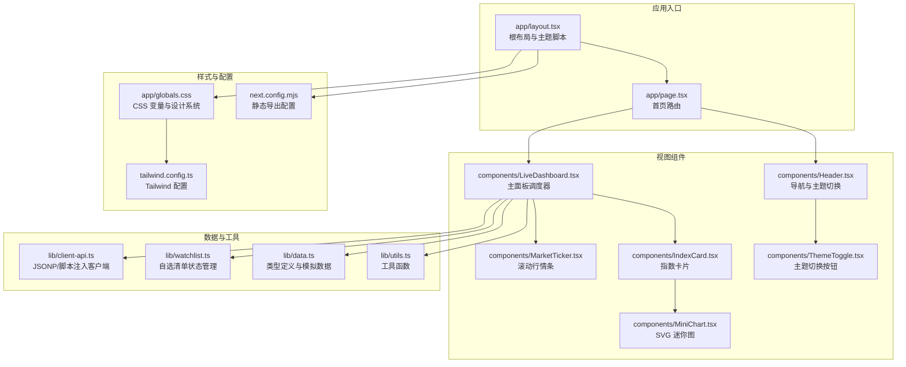
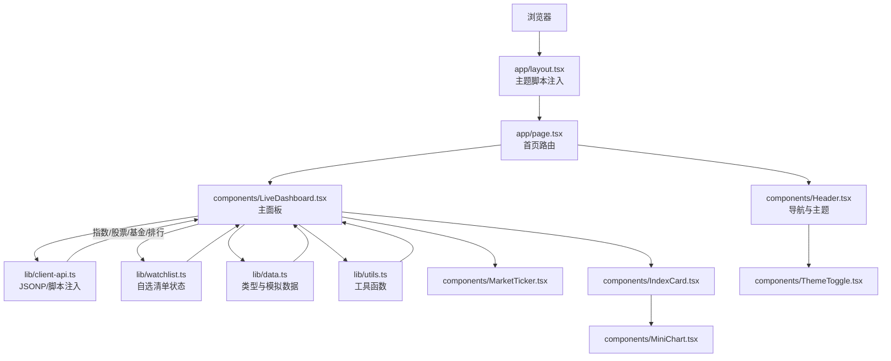
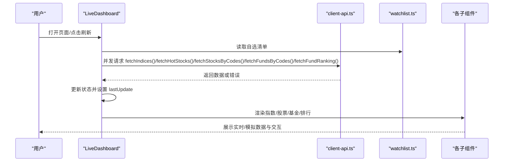
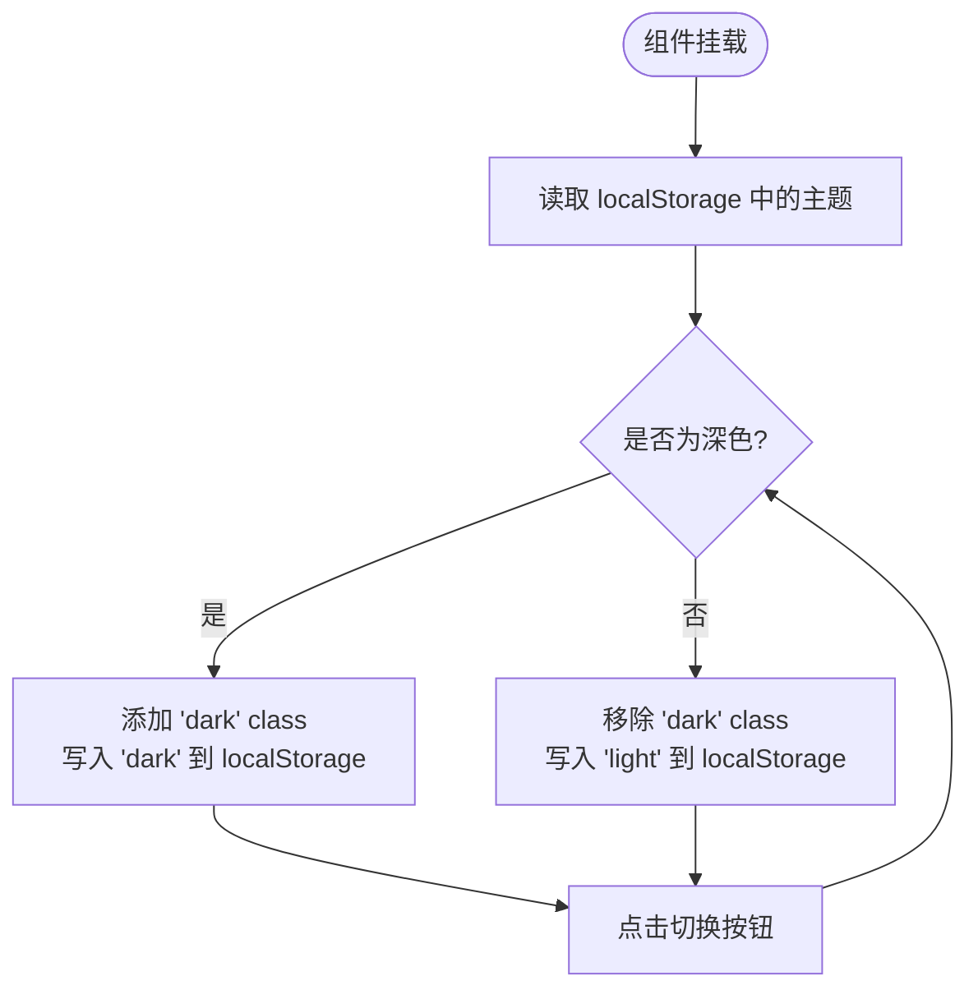
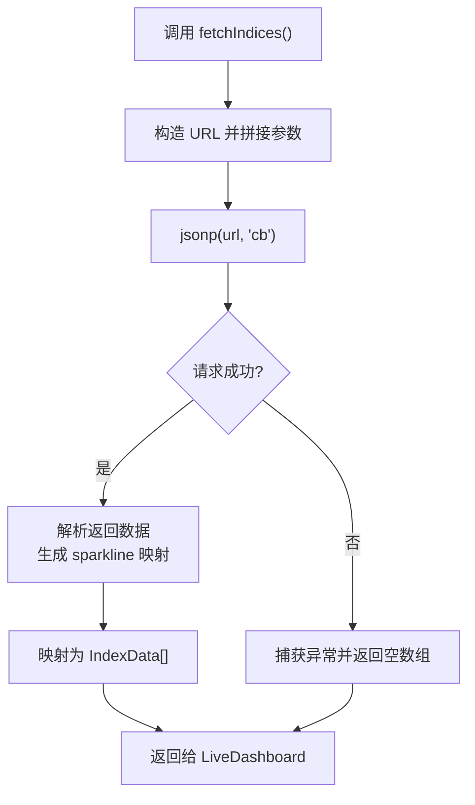
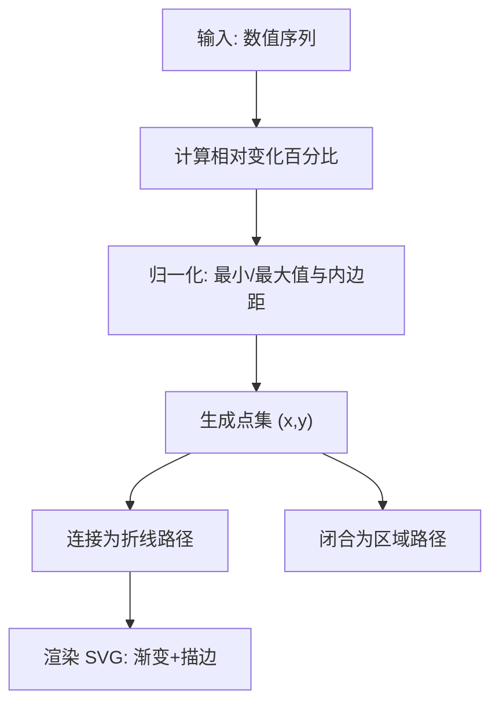
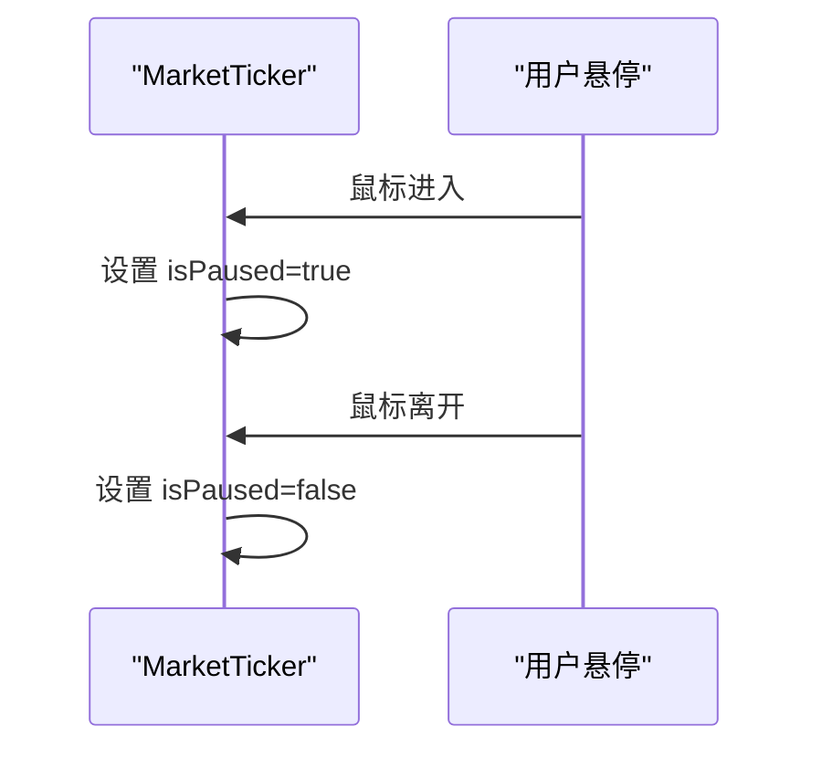
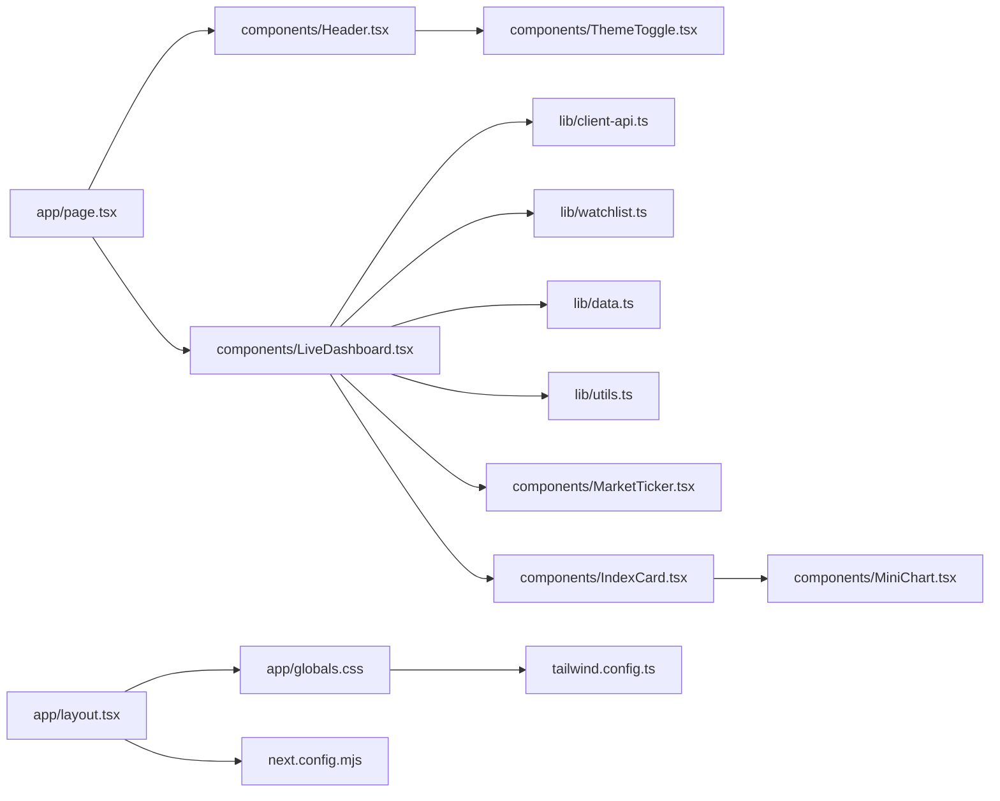

# 技术架构

<cite>
**本文引用的文件**
- [README.md](file://README.md)
- [package.json](file://package.json)
- [next.config.mjs](file://next.config.mjs)
- [tailwind.config.ts](file://tailwind.config.ts)
- [app/layout.tsx](file://app/layout.tsx)
- [app/page.tsx](file://app/page.tsx)
- [lib/client-api.ts](file://lib/client-api.ts)
- [lib/watchlist.ts](file://lib/watchlist.ts)
- [lib/data.ts](file://lib/data.ts)
- [lib/utils.ts](file://lib/utils.ts)
- [components/LiveDashboard.tsx](file://components/LiveDashboard.tsx)
- [components/ThemeToggle.tsx](file://components/ThemeToggle.tsx)
- [components/Header.tsx](file://components/Header.tsx)
- [components/IndexCard.tsx](file://components/IndexCard.tsx)
- [components/MiniChart.tsx](file://components/MiniChart.tsx)
- [components/MarketTicker.tsx](file://components/MarketTicker.tsx)
- [.github/workflows/deploy.yml](file://.github/workflows/deploy.yml)
</cite>

## 目录
1. [引言](#引言)
2. [项目结构](#项目结构)
3. [核心组件](#核心组件)
4. [架构总览](#架构总览)
5. [详细组件分析](#详细组件分析)
6. [依赖关系分析](#依赖关系分析)
7. [性能考量](#性能考量)
8. [故障排查指南](#故障排查指南)
9. [结论](#结论)
10. [附录](#附录)

## 引言
本项目是一个基于 Next.js 16 的金融数据实时面板，聚焦“全球指数 · 热门股票 · 实时基金”三大板块，采用 App Router 架构与静态导出（Static Export）部署方案，确保可直接部署至 GitHub Pages 等静态托管平台。项目以组件化为核心设计原则，结合 Hooks 模式与本地存储实现用户自选清单的持久化；数据层通过 JSONP 与少量脚本注入方式绕过同源限制，实现跨域数据获取；样式体系由 Tailwind CSS 提供，配合 CSS 变量与暗/亮主题切换，实现专业级金融仪表盘的视觉与交互体验。

## 项目结构
项目采用 Next.js App Router 的目录组织方式，按功能模块划分 app、components、lib 等层次，清晰分离路由层、视图层与业务/数据层。

**图表来源**
- [app/layout.tsx:1-35](file://app/layout.tsx#L1-L35)
- [app/page.tsx:1-24](file://app/page.tsx#L1-L24)
- [components/LiveDashboard.tsx:1-375](file://components/LiveDashboard.tsx#L1-L375)
- [components/MarketTicker.tsx:1-52](file://components/MarketTicker.tsx#L1-L52)
- [components/IndexCard.tsx:1-53](file://components/IndexCard.tsx#L1-L53)
- [components/MiniChart.tsx:1-57](file://components/MiniChart.tsx#L1-L57)
- [components/ThemeToggle.tsx:1-52](file://components/ThemeToggle.tsx#L1-L52)
- [components/Header.tsx:1-92](file://components/Header.tsx#L1-L92)
- [lib/client-api.ts:1-596](file://lib/client-api.ts#L1-L596)
- [lib/watchlist.ts:1-89](file://lib/watchlist.ts#L1-L89)
- [lib/data.ts:1-255](file://lib/data.ts#L1-L255)
- [lib/utils.ts:1-7](file://lib/utils.ts#L1-L7)
- [app/globals.css:1-125](file://app/globals.css#L1-L125)
- [tailwind.config.ts:1-105](file://tailwind.config.ts#L1-L105)
- [next.config.mjs:1-13](file://next.config.mjs#L1-L13)

**章节来源**
- [README.md:132-161](file://README.md#L132-L161)
- [package.json:1-31](file://package.json#L1-L31)
- [next.config.mjs:1-13](file://next.config.mjs#L1-L13)
- [tailwind.config.ts:1-105](file://tailwind.config.ts#L1-L105)
- [app/layout.tsx:1-35](file://app/layout.tsx#L1-L35)
- [app/page.tsx:1-24](file://app/page.tsx#L1-L24)

## 核心组件
- 根布局与主题初始化：根布局负责注入主题脚本，避免水合不一致，并设置基础字体与容器样式。
- 首页路由：承载 Header 与 LiveDashboard，作为应用入口。
- 主面板 LiveDashboard：统一调度数据拉取、状态管理与 UI 渲染，包含指数、股票、基金三大板块。
- 数据客户端 client-api：封装 JSONP 与脚本注入，统一处理跨域请求与解析。
- 自选清单 watchlist：基于 Hooks 的本地持久化状态管理，支持基金与股票两类清单。
- 主题切换 ThemeToggle：基于 localStorage 的深/浅色模式切换。
- 指数卡片与迷你图：指数卡片展示指标与涨跌，迷你图使用 SVG 绘制趋势区域与路径。
- 滚动行情条 MarketTicker：无限滚动展示指数快照，支持鼠标悬停暂停。

**章节来源**
- [app/layout.tsx:18-34](file://app/layout.tsx#L18-L34)
- [app/page.tsx:10-23](file://app/page.tsx#L10-L23)
- [components/LiveDashboard.tsx:39-301](file://components/LiveDashboard.tsx#L39-L301)
- [lib/client-api.ts:5-36](file://lib/client-api.ts#L5-L36)
- [lib/watchlist.ts:28-88](file://lib/watchlist.ts#L28-L88)
- [components/ThemeToggle.tsx:6-51](file://components/ThemeToggle.tsx#L6-L51)
- [components/IndexCard.tsx:5-52](file://components/IndexCard.tsx#L5-L52)
- [components/MiniChart.tsx:9-56](file://components/MiniChart.tsx#L9-L56)
- [components/MarketTicker.tsx:8-51](file://components/MarketTicker.tsx#L8-L51)

## 架构总览
系统采用“路由层 → 视图层 → 组件层 → 数据/状态层”的分层架构，数据流从外部 API 通过 JSONP/脚本注入进入，再由组件进行渲染与交互。

**图表来源**
- [app/layout.tsx:13-34](file://app/layout.tsx#L13-L34)
- [app/page.tsx:2-23](file://app/page.tsx#L2-L23)
- [components/LiveDashboard.tsx:39-301](file://components/LiveDashboard.tsx#L39-L301)
- [lib/client-api.ts:154-199](file://lib/client-api.ts#L154-L199)
- [lib/watchlist.ts:28-88](file://lib/watchlist.ts#L28-L88)
- [lib/data.ts:1-255](file://lib/data.ts#L1-L255)
- [lib/utils.ts:4-6](file://lib/utils.ts#L4-L6)
- [components/MarketTicker.tsx:8-51](file://components/MarketTicker.tsx#L8-L51)
- [components/IndexCard.tsx:5-52](file://components/IndexCard.tsx#L5-L52)
- [components/MiniChart.tsx:9-56](file://components/MiniChart.tsx#L9-L56)
- [components/ThemeToggle.tsx:6-51](file://components/ThemeToggle.tsx#L6-L51)

## 详细组件分析

### 组件 A：LiveDashboard（主面板）
职责与流程
- 初始化自选清单状态与定时刷新（每 30 秒），并发拉取指数、热门股票、自选股票、跟踪基金与基金排行。
- 使用 isLive 标志判断是否成功获取实时数据，失败时回退到模拟数据。
- 提供“热门成交/我的自选”标签切换、搜索与移除操作，以及统计卡片与空态提示。

**图表来源**
- [components/LiveDashboard.tsx:56-102](file://components/LiveDashboard.tsx#L56-L102)
- [lib/client-api.ts:154-199](file://lib/client-api.ts#L154-L199)
- [lib/client-api.ts:203-240](file://lib/client-api.ts#L203-L240)
- [lib/client-api.ts:421-458](file://lib/client-api.ts#L421-L458)
- [lib/client-api.ts:497-523](file://lib/client-api.ts#L497-L523)
- [lib/client-api.ts:527-595](file://lib/client-api.ts#L527-L595)
- [lib/watchlist.ts:28-88](file://lib/watchlist.ts#L28-L88)

**章节来源**
- [components/LiveDashboard.tsx:39-301](file://components/LiveDashboard.tsx#L39-L301)

### 组件 B：ThemeToggle（主题切换）
职责与流程
- 在挂载后读取 localStorage 决定初始主题；变更时写入 localStorage 并切换 html 的 class，实现深/浅色模式切换。
- 避免水合不一致：未挂载时返回占位元素。

**图表来源**
- [components/ThemeToggle.tsx:10-33](file://components/ThemeToggle.tsx#L10-L33)
- [app/layout.tsx:18-24](file://app/layout.tsx#L18-L24)

**章节来源**
- [components/ThemeToggle.tsx:6-51](file://components/ThemeToggle.tsx#L6-L51)

### 组件 C：client-api（跨域数据获取）
职责与流程
- JSONP 工具：动态插入 script 标签，生成唯一回调名，超时与失败清理，返回 Promise。
- 指数/股票/基金/搜索/排行等接口均通过 JSONP 或脚本注入完成跨域调用；部分接口因 Referer 限制使用 fetch + 正则解析回退方案。
- K 线数据解析与迷你图所需的时间序列生成。

**图表来源**
- [lib/client-api.ts:154-199](file://lib/client-api.ts#L154-L199)
- [lib/client-api.ts:5-36](file://lib/client-api.ts#L5-L36)

**章节来源**
- [lib/client-api.ts:1-596](file://lib/client-api.ts#L1-L596)

### 组件 D：MiniChart（SVG 迷你图）
职责与流程
- 输入为数值序列，计算相对变化百分比，归一化后生成折线点集，绘制区域渐变与描边路径。

**图表来源**
- [components/MiniChart.tsx:9-56](file://components/MiniChart.tsx#L9-L56)

**章节来源**
- [components/MiniChart.tsx:1-57](file://components/MiniChart.tsx#L1-L57)

### 组件 E：MarketTicker（滚动行情条）
职责与流程
- 将指数列表复制一份拼接，使用 CSS 动画实现无限滚动；鼠标悬停暂停动画，离开恢复。

**图表来源**
- [components/MarketTicker.tsx:8-51](file://components/MarketTicker.tsx#L8-L51)

**章节来源**
- [components/MarketTicker.tsx:1-52](file://components/MarketTicker.tsx#L1-L52)

## 依赖关系分析
- 路由层依赖视图层：app/page.tsx 依赖 Header 与 LiveDashboard。
- 视图层依赖组件库与工具：LiveDashboard 依赖 client-api、watchlist、data、utils。
- 样式层依赖 Tailwind 配置与全局 CSS：全局 CSS 定义 CSS 变量，Tailwind 配置启用暗色模式与动画插件。
- 配置层影响构建与部署：next.config.mjs 开启静态导出与路径前缀，便于 GitHub Pages 部署。

**图表来源**
- [app/page.tsx:2-23](file://app/page.tsx#L2-L23)
- [components/LiveDashboard.tsx:39-301](file://components/LiveDashboard.tsx#L39-L301)
- [lib/client-api.ts:1-596](file://lib/client-api.ts#L1-L596)
- [lib/watchlist.ts:1-89](file://lib/watchlist.ts#L1-L89)
- [lib/data.ts:1-255](file://lib/data.ts#L1-L255)
- [lib/utils.ts:1-7](file://lib/utils.ts#L1-L7)
- [components/MarketTicker.tsx:1-52](file://components/MarketTicker.tsx#L1-L52)
- [components/IndexCard.tsx:1-53](file://components/IndexCard.tsx#L1-L53)
- [components/MiniChart.tsx:1-57](file://components/MiniChart.tsx#L1-L57)
- [components/ThemeToggle.tsx:1-52](file://components/ThemeToggle.tsx#L1-L52)
- [app/layout.tsx:1-35](file://app/layout.tsx#L1-L35)
- [app/globals.css:1-125](file://app/globals.css#L1-L125)
- [tailwind.config.ts:1-105](file://tailwind.config.ts#L1-L105)
- [next.config.mjs:1-13](file://next.config.mjs#L1-L13)

**章节来源**
- [package.json:11-29](file://package.json#L11-L29)
- [next.config.mjs:1-13](file://next.config.mjs#L1-L13)
- [tailwind.config.ts:1-105](file://tailwind.config.ts#L1-L105)

## 性能考量
- 静态导出与无后端：next.config.mjs 启用静态导出与路径前缀，适合 GitHub Pages 部署，减少服务器成本与运维复杂度。
- 并发数据拉取：LiveDashboard 使用 Promise.allSettled 并发请求多路数据，缩短首屏等待时间。
- 懒加载与条件渲染：仅在有自选股票/基金时才发起对应请求，减少无效网络开销。
- 轻量动画与 SVG：迷你图采用 SVG，避免 Canvas 复杂度；滚动条与动画通过 Tailwind 与 CSS 实现，减少额外 JS。
- 本地存储与防抖：自选清单使用 localStorage，避免每次请求重复加载；定时刷新间隔 30 秒，平衡实时性与性能。
- 样式体积控制：Tailwind 通过 content 白名单扫描，仅打包实际使用的样式，降低体积。

[本节为通用性能指导，不直接分析具体文件，故无“章节来源”]

## 故障排查指南
- 主题切换不生效
  - 检查根节点是否正确添加/移除 'dark' class，确认 localStorage 中的 'theme' 值。
  - 参考：[components/ThemeToggle.tsx:23-33](file://components/ThemeToggle.tsx#L23-L33)，[app/layout.tsx:18-24](file://app/layout.tsx#L18-L24)
- 实时数据为空或延迟
  - 检查 client-api 的 JSONP 请求是否超时或失败，确认目标域名可访问。
  - 参考：[lib/client-api.ts:5-36](file://lib/client-api.ts#L5-L36)，[lib/client-api.ts:154-199](file://lib/client-api.ts#L154-L199)
- 自选清单无法持久化
  - 检查 localStorage 是否可用，确认键名与格式（兼容旧版字符串数组）。
  - 参考：[lib/watchlist.ts:33-51](file://lib/watchlist.ts#L33-L51)，[lib/watchlist.ts:16-17](file://lib/watchlist.ts#L16-L17)
- 部署后资源路径错误
  - 确认 basePath 与 assetPrefix 配置与 GitHub Pages 路径一致。
  - 参考：[next.config.mjs:4-6](file://next.config.mjs#L4-L6)
- 滚动行情条动画异常
  - 检查 CSS 动画类与鼠标事件绑定，确认 isPaused 状态切换。
  - 参考：[components/MarketTicker.tsx:8-51](file://components/MarketTicker.tsx#L8-L51)

**章节来源**
- [components/ThemeToggle.tsx:23-33](file://components/ThemeToggle.tsx#L23-L33)
- [app/layout.tsx:18-24](file://app/layout.tsx#L18-L24)
- [lib/client-api.ts:5-36](file://lib/client-api.ts#L5-L36)
- [lib/client-api.ts:154-199](file://lib/client-api.ts#L154-L199)
- [lib/watchlist.ts:33-51](file://lib/watchlist.ts#L33-L51)
- [lib/watchlist.ts:16-17](file://lib/watchlist.ts#L16-L17)
- [next.config.mjs:4-6](file://next.config.mjs#L4-L6)
- [components/MarketTicker.tsx:8-51](file://components/MarketTicker.tsx#L8-L51)

## 结论
本项目以 Next.js App Router 为基础，结合静态导出与组件化架构，实现了低门槛部署与高可维护性的金融数据面板。通过 JSONP 与脚本注入解决跨域问题，利用 Hooks 与 localStorage 实现轻量状态管理，Tailwind CSS 提供一致的设计系统与主题体系。整体架构清晰、职责明确，适合在静态托管平台上稳定运行，并为后续扩展（如服务端组件、增量静态再生等）预留空间。

[本节为总结性内容，不直接分析具体文件，故无“章节来源”]

## 附录
- 部署工作流：GitHub Actions 自动构建与部署至 GitHub Pages。
- 技术栈概览：Next.js 16、TypeScript、Tailwind CSS、Lucide React、静态导出。

**章节来源**
- [.github/workflows/deploy.yml](file://.github/workflows/deploy.yml)
- [README.md:67-77](file://README.md#L67-L77)
- [README.md:113-129](file://README.md#L113-L129)