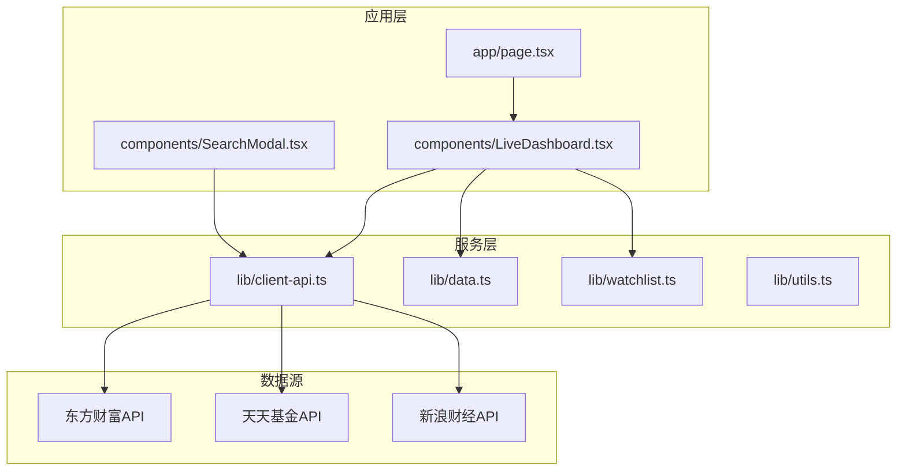
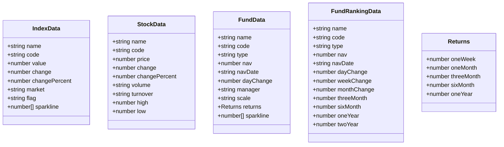
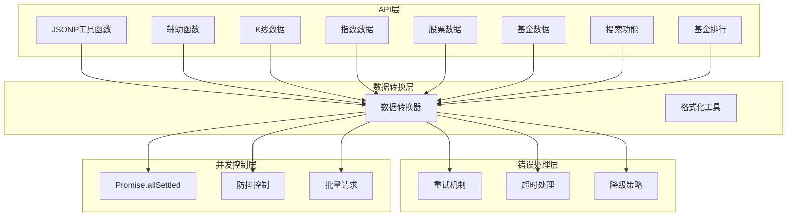
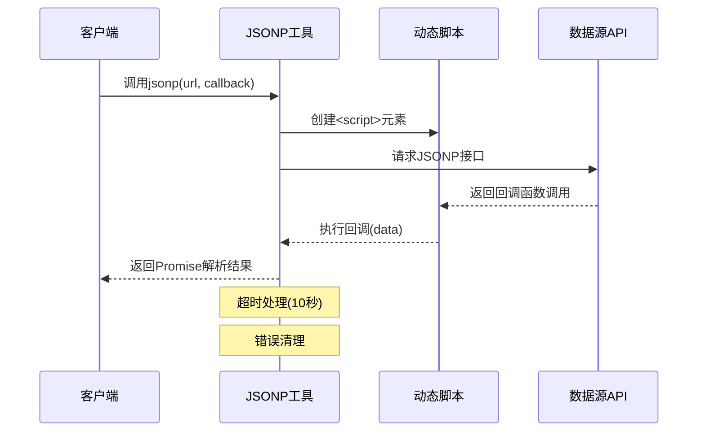
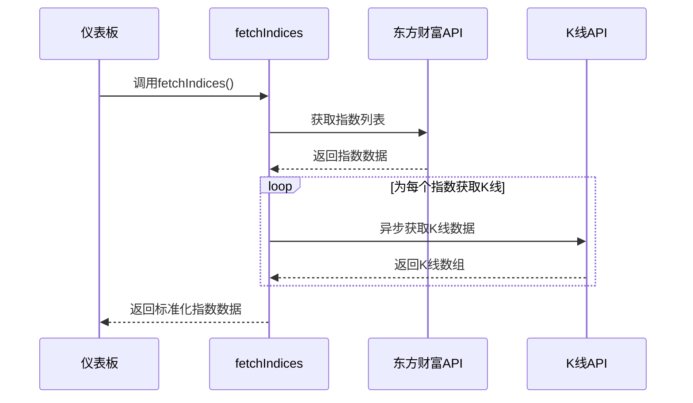
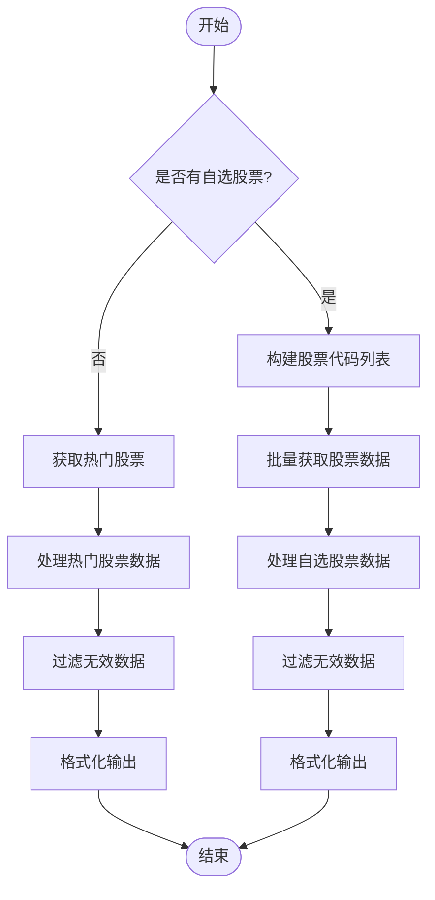
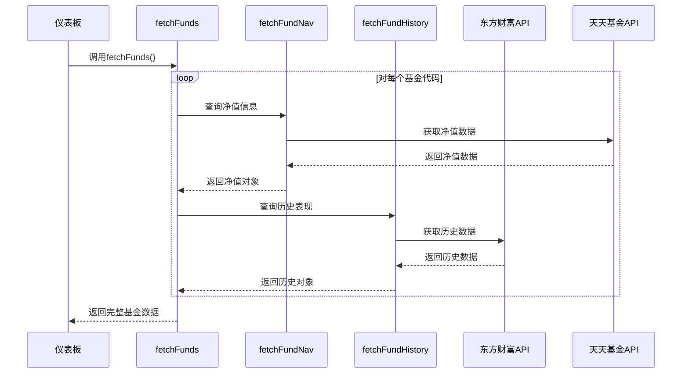
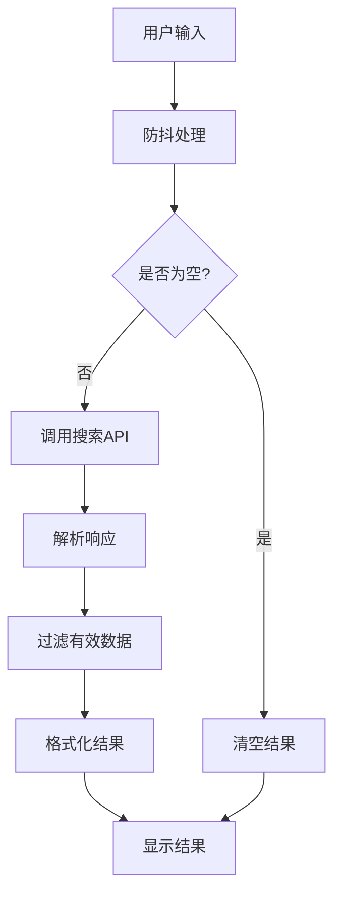
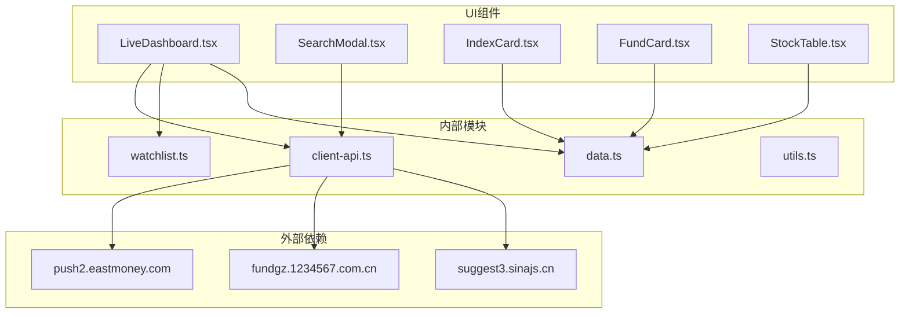
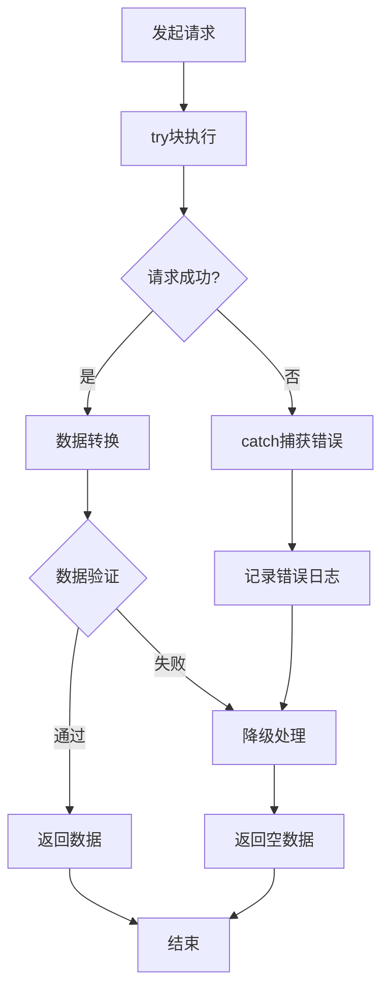

# API客户端设计

<cite>
**本文档引用的文件**
- [client-api.ts](file://lib/client-api.ts)
- [data.ts](file://lib/data.ts)
- [watchlist.ts](file://lib/watchlist.ts)
- [utils.ts](file://lib/utils.ts)
- [LiveDashboard.tsx](file://components/LiveDashboard.tsx)
- [SearchModal.tsx](file://components/SearchModal.tsx)
- [IndexCard.tsx](file://components/IndexCard.tsx)
- [FundCard.tsx](file://components/FundCard.tsx)
- [StockTable.tsx](file://components/StockTable.tsx)
- [page.tsx](file://app/page.tsx)
- [README.md](file://README.md)
</cite>

## 目录
1. [简介](#简介)
2. [项目结构](#项目结构)
3. [核心组件](#核心组件)
4. [架构总览](#架构总览)
5. [详细组件分析](#详细组件分析)
6. [依赖关系分析](#依赖关系分析)
7. [性能考虑](#性能考虑)
8. [故障排除指南](#故障排除指南)
9. [结论](#结论)
10. [附录](#附录)

## 简介
本项目是一个基于Next.js的实时金融数据面板，通过API客户端从多个数据源（东方财富、天天基金、新浪财经）获取全球指数、热门股票、基金净值等数据。API客户端采用模块化设计，将不同数据类型的获取逻辑分离，实现了统一的错误处理、并发控制和数据转换流程。

## 项目结构
项目采用按功能模块划分的组织方式，核心API逻辑集中在lib目录下，界面组件分布在components目录中，页面入口位于app目录。

**图表来源**
- [page.tsx:1-24](file://app/page.tsx#L1-L24)
- [LiveDashboard.tsx:1-375](file://components/LiveDashboard.tsx#L1-L375)
- [client-api.ts:1-596](file://lib/client-api.ts#L1-L596)

**章节来源**
- [README.md:132-161](file://README.md#L132-L161)
- [client-api.ts:1-596](file://lib/client-api.ts#L1-L596)

## 核心组件
API客户端由多个专门化的函数组成，每个函数负责特定的数据获取任务，并遵循统一的实现模式。

### 主要API函数分类
- **指数数据**: `fetchIndices()` - 获取全球主要指数的实时行情
- **股票数据**: `fetchHotStocks()`、`fetchStocksByCodes()` - 获取热门股票和自选股票数据
- **基金数据**: `fetchFunds()`、`fetchFundsByCodes()`、`fetchFundRanking()` - 获取基金净值、历史表现和排行榜
- **搜索功能**: `searchFunds()`、`searchStocks()` - 提供基金和股票的搜索能力
- **K线数据**: `fetchKline()` - 获取股票的历史K线数据

### 数据模型
API客户端定义了清晰的数据接口，确保前后端数据结构的一致性：

**图表来源**
- [data.ts:1-255](file://lib/data.ts#L1-L255)

**章节来源**
- [data.ts:1-255](file://lib/data.ts#L1-L255)

## 架构总览
API客户端采用分层架构设计，实现了职责分离和模块化组织。

**图表来源**
- [client-api.ts:1-596](file://lib/client-api.ts#L1-L596)

### 统一实现模式
所有API函数都遵循相同的实现模式：
1. **URL构建**: 使用模板字符串构建API请求地址
2. **参数传递**: 通过查询参数传递必需的业务参数
3. **响应解析**: 解析JSONP回调数据并进行数据转换
4. **错误处理**: 使用try-catch捕获异常并返回默认值
5. **数据转换**: 将原始API响应转换为标准化的数据结构

**章节来源**
- [client-api.ts:154-199](file://lib/client-api.ts#L154-L199)
- [client-api.ts:203-240](file://lib/client-api.ts#L203-L240)
- [client-api.ts:462-523](file://lib/client-api.ts#L462-L523)

## 详细组件分析

### JSONP工具函数
JSONP是该项目的核心通信机制，用于绕过同源策略限制。

**图表来源**
- [client-api.ts:5-36](file://lib/client-api.ts#L5-L36)

JSONP实现的关键特性：
- **唯一回调标识**: 自动生成唯一的回调函数名避免冲突
- **自动清理**: 成功或失败后自动清理DOM节点和全局变量
- **超时控制**: 10秒超时机制防止资源泄漏
- **错误处理**: 网络错误时拒绝Promise并清理资源

**章节来源**
- [client-api.ts:5-36](file://lib/client-api.ts#L5-L36)

### 指数数据获取
指数模块实现了多指数的批量获取和K线数据的异步加载。

**图表来源**
- [client-api.ts:154-199](file://lib/client-api.ts#L154-L199)

指数数据获取的特殊处理：
- **批量请求**: 使用Promise.allSettled并行获取所有指数数据
- **K线异步**: 每个指数单独获取15天的K线数据作为迷你图
- **数据过滤**: 过滤掉无效数值，确保数据完整性
- **格式转换**: 将字符串格式的数值转换为数字类型

**章节来源**
- [client-api.ts:154-199](file://lib/client-api.ts#L154-L199)

### 股票数据获取
股票模块提供了两种获取方式：热门股票和自选股票。

**图表来源**
- [client-api.ts:203-240](file://lib/client-api.ts#L203-L240)
- [client-api.ts:421-458](file://lib/client-api.ts#L421-L458)

股票数据处理的特色：
- **批量查询**: 支持一次性查询多个股票代码
- **单位转换**: 将大量数值转换为人类可读的单位格式
- **数据验证**: 确保数值字段的有效性和类型正确性
- **性能优化**: 对于自选股票使用批量查询减少请求数量

**章节来源**
- [client-api.ts:203-240](file://lib/client-api.ts#L203-L240)
- [client-api.ts:421-458](file://lib/client-api.ts#L421-L458)

### 基金数据获取
基金模块是最复杂的部分，包含净值查询、历史表现和排行榜功能。

**图表来源**
- [client-api.ts:497-523](file://lib/client-api.ts#L497-L523)
- [client-api.ts:253-290](file://lib/client-api.ts#L253-L290)
- [client-api.ts:292-346](file://lib/client-api.ts#L292-L346)

基金数据获取的复杂性：
- **双重API**: 净值使用天天基金API，历史表现使用东方财富API
- **异步处理**: 净值查询串行，历史查询并行以提高性能
- **数据合并**: 将多个API的响应合并为单一数据结构
- **历史计算**: 计算一周、一月、一年等时间段的收益率

**章节来源**
- [client-api.ts:497-523](file://lib/client-api.ts#L497-L523)
- [client-api.ts:253-290](file://lib/client-api.ts#L253-L290)
- [client-api.ts:292-346](file://lib/client-api.ts#L292-L346)

### 搜索功能
搜索模块提供了基金和股票的智能搜索能力。

**图表来源**
- [client-api.ts:364-417](file://lib/client-api.ts#L364-L417)

搜索功能的优化：
- **防抖机制**: 400ms防抖延迟减少不必要的请求
- **类型区分**: 基金搜索返回类型信息，股票搜索返回市场信息
- **结果限制**: 限制搜索结果数量提升用户体验
- **兼容处理**: 对不同API的响应格式进行统一处理

**章节来源**
- [client-api.ts:364-417](file://lib/client-api.ts#L364-L417)

## 依赖关系分析

**图表来源**
- [client-api.ts:1-596](file://lib/client-api.ts#L1-L596)
- [LiveDashboard.tsx:1-375](file://components/LiveDashboard.tsx#L1-L375)
- [SearchModal.tsx:1-210](file://components/SearchModal.tsx#L1-L210)

### 模块耦合度分析
- **低耦合**: API模块与UI组件通过数据接口解耦
- **单向依赖**: UI组件只依赖API模块，不反向依赖UI
- **清晰边界**: 数据模型独立于具体实现，便于测试和维护

**章节来源**
- [client-api.ts:1-596](file://lib/client-api.ts#L1-L596)
- [LiveDashboard.tsx:1-375](file://components/LiveDashboard.tsx#L1-L375)

## 性能考虑

### 并发控制策略
项目采用了多层次的并发控制机制：

1. **Promise.allSettled并行**: 主仪表板同时获取多种数据类型
2. **Promise.all并行**: 基金历史数据的批量获取
3. **串行处理**: 基金净值的逐个获取确保数据一致性
4. **防抖控制**: 搜索功能的400ms防抖减少请求频率

### 缓存和优化
- **本地存储**: 用户自选列表使用localStorage持久化
- **数据格式化**: 将大量数值转换为人类可读格式减少渲染负担
- **条件渲染**: 根据数据可用性动态调整UI显示

### 错误恢复机制
- **降级策略**: 当主API失败时尝试备用方案
- **超时处理**: JSONP请求10秒超时，避免长时间挂起
- **容错设计**: 即使部分数据获取失败也保证整体功能正常

**章节来源**
- [LiveDashboard.tsx:56-95](file://components/LiveDashboard.tsx#L56-L95)
- [SearchModal.tsx:47-77](file://components/SearchModal.tsx#L47-L77)

## 故障排除指南

### 常见问题诊断
1. **数据为空**: 检查API响应码和数据结构
2. **请求超时**: 验证网络连接和API可用性
3. **格式错误**: 确认数据类型转换逻辑
4. **内存泄漏**: 检查定时器和事件监听器清理

### 错误处理策略
API客户端实现了完整的错误处理机制：

**图表来源**
- [client-api.ts:195-198](file://lib/client-api.ts#L195-L198)
- [client-api.ts:236-239](file://lib/client-api.ts#L236-L239)

### 调试技巧
- **日志输出**: 关键API调用都有详细的console日志
- **状态检查**: 使用isLive状态指示数据来源
- **时间戳记录**: 记录最后更新时间便于调试

**章节来源**
- [client-api.ts:195-198](file://lib/client-api.ts#L195-L198)
- [LiveDashboard.tsx:89-94](file://components/LiveDashboard.tsx#L89-L94)

## 结论
该API客户端设计体现了良好的软件工程实践：

1. **模块化设计**: 清晰的功能分区和职责分离
2. **统一模式**: 所有API函数遵循一致的实现模式
3. **健壮性**: 完善的错误处理和降级策略
4. **性能优化**: 多层次的并发控制和缓存机制
5. **可扩展性**: 明确的接口规范便于新增功能

这种设计使得系统既满足了当前的功能需求，又为未来的扩展奠定了坚实的基础。

## 附录

### API调用扩展指南
新增API函数的基本步骤：
1. 在client-api.ts中添加新的函数定义
2. 实现URL构建和参数传递逻辑
3. 添加数据转换和验证代码
4. 实现错误处理和降级策略
5. 在相应的组件中调用新函数

### 数据格式化最佳实践
- 始终进行数据类型验证
- 提供合理的默认值
- 统一数值格式化规则
- 保持数据结构的向后兼容性

### 并发控制最佳实践
- 使用Promise.allSettled处理非关键操作
- 对关键操作使用Promise.all
- 实现适当的防抖和节流机制
- 监控内存使用情况避免泄漏