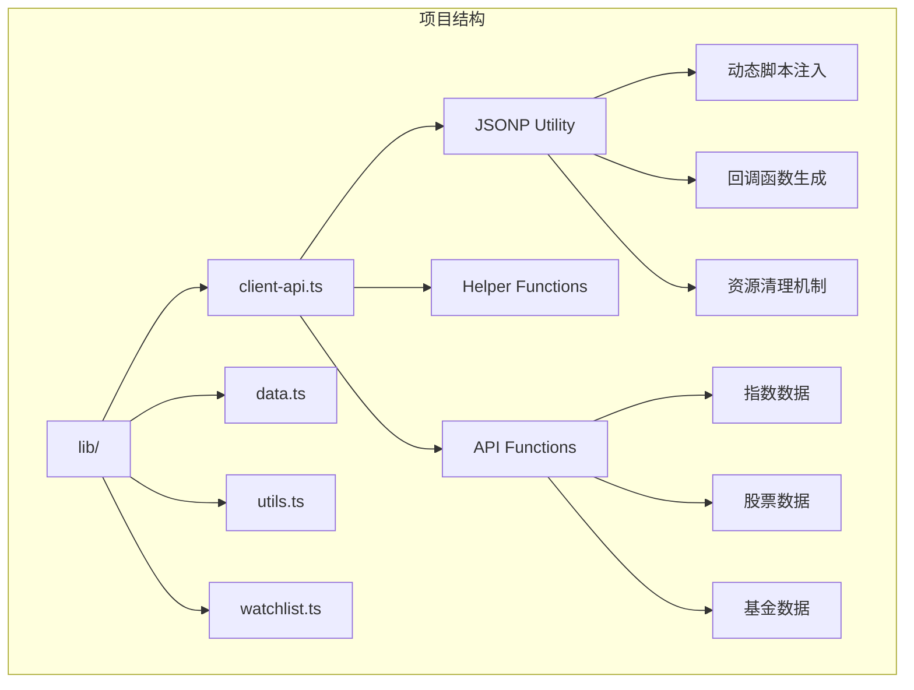
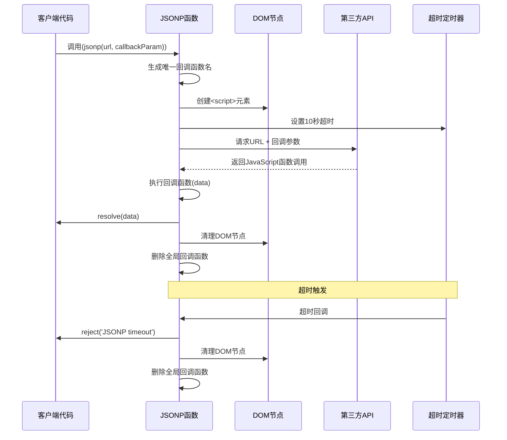
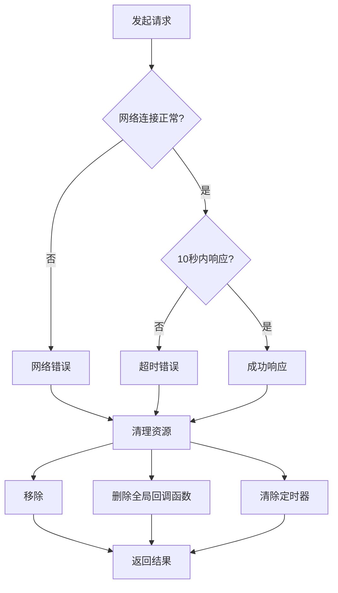
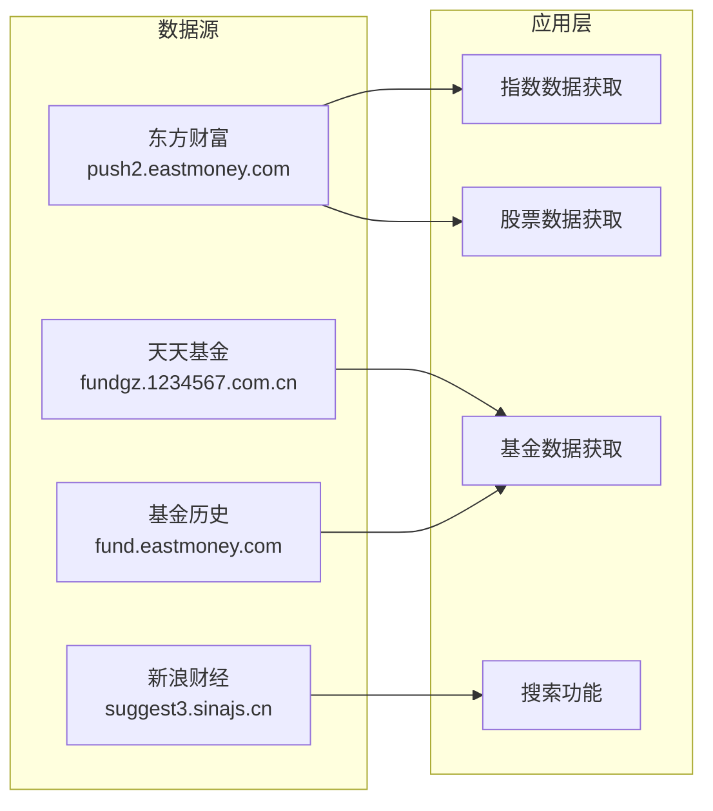
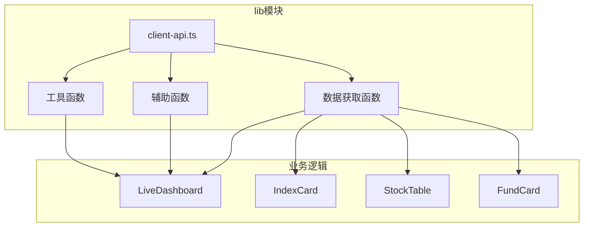

# JSONP工具函数

<cite>
**本文档引用的文件**
- [client-api.ts](file://lib/client-api.ts)
- [README.md](file://README.md)
</cite>

## 目录
1. [简介](#简介)
2. [项目结构](#项目结构)
3. [核心组件](#核心组件)
4. [架构概览](#架构概览)
5. [详细组件分析](#详细组件分析)
6. [依赖关系分析](#依赖关系分析)
7. [性能考虑](#性能考虑)
8. [故障排除指南](#故障排除指南)
9. [结论](#结论)

## 简介

本文档深入解析了项目中的JSONP工具函数实现，这是一个用于处理跨域请求的JavaScript技术。JSONP（JSON with Padding）是一种绕过同源策略限制的技术，允许网页从不同域名加载数据。该实现包含动态脚本注入、回调函数生成和清理机制，是整个金融数据面板项目的核心数据获取组件。

该项目是一个基于Next.js的实时金融数据面板，提供全球指数、热门股票和基金净值的实时监控功能。由于数据源主要来自第三方API，JSONP成为了处理跨域请求的最佳选择。

## 项目结构

项目采用模块化的组织方式，JSONP工具函数位于`lib/client-api.ts`文件中，专门负责处理各种金融数据的获取。



**图表来源**
- [client-api.ts:1-596](file://lib/client-api.ts#L1-L596)

**章节来源**
- [README.md:132-161](file://README.md#L132-L161)

## 核心组件

### JSONP工具函数实现

JSONP工具函数是整个系统的核心组件，提供了完整的跨域数据获取能力。该函数实现了以下关键功能：

#### 主要特性
- **动态脚本注入**：运行时创建并插入`<script>`元素
- **唯一回调标识符**：生成不可预测的全局函数名
- **超时控制**：10秒超时保护机制
- **错误处理**：网络错误和超时的统一处理
- **资源清理**：自动清理DOM节点和全局变量

#### 回调函数命名规则

回调函数采用`_jp_`前缀加时间戳和随机字符串的命名策略，这种设计具有以下考虑：

- **避免冲突**：`_jp_`前缀确保与现有全局变量不冲突
- **时间戳保证唯一性**：`Date.now()`确保每次调用都有唯一标识
- **随机字符串增强安全性**：`Math.random().toString(36).slice(2, 7)`生成5位随机字符
- **可读性**：前缀明确标识这是JSONP回调函数

**章节来源**
- [client-api.ts:5-36](file://lib/client-api.ts#L5-L36)

## 架构概览

整个JSONP架构采用了事件驱动的设计模式，通过Promise封装异步操作，提供了简洁的API接口。



**图表来源**
- [client-api.ts:5-36](file://lib/client-api.ts#L5-L36)

## 详细组件分析

### JSONP函数实现详解

#### 函数签名和参数
```typescript
function jsonp<T>(url: string, callbackParam = 'cb'): Promise<T>
```

该函数使用TypeScript泛型，允许编译时类型检查，确保返回数据的类型安全。

#### 动态脚本注入机制

```mermaid
flowchart TD
Start([函数调用]) --> GenName[生成唯一回调函数名<br/>_jp_{timestamp}_{random}]
GenName --> CreateScript[创建<script>元素]
CreateScript --> SetSrc[设置src属性<br/>URL + callback参数]
SetSrc --> AddHead[添加到<head>元素]
AddHead --> WaitEvent[等待事件触发]
WaitEvent --> OnSuccess{成功?}
OnSuccess --> |是| Resolve[执行回调函数<br/>resolve(data)]
OnSuccess --> |否| OnError{错误?}
OnError --> |网络错误| RejectFail[reject('JSONP failed')]
OnError --> |超时| RejectTimeout[reject('JSONP timeout')]
Resolve --> Cleanup[清理资源]
RejectFail --> Cleanup
RejectTimeout --> Cleanup
Cleanup --> RemoveNode[移除DOM节点]
Cleanup --> DeleteGlobal[删除全局函数]
Cleanup --> ClearTimer[清除定时器]
RemoveNode --> End([完成])
DeleteGlobal --> End
ClearTimer --> End
```

**图表来源**
- [client-api.ts:5-36](file://lib/client-api.ts#L5-L36)

#### 回调函数生成策略

回调函数的命名采用三层保障机制：

1. **前缀标识**：`_jp_`明确标识JSONP回调
2. **时间戳**：`Date.now()`确保绝对唯一性
3. **随机字符串**：`Math.random().toString(36).slice(2, 7)`增加额外随机性

这种设计有效避免了全局命名空间污染和函数覆盖问题。

#### 错误处理策略

系统实现了多层次的错误处理机制：



**图表来源**
- [client-api.ts:24-32](file://lib/client-api.ts#L24-L32)

#### 资源清理机制

cleanup函数是资源管理的关键组件，确保不会产生内存泄漏：

| 清理项目 | 清理方式 | 目的 |
|---------|---------|------|
| DOM节点 | `script.parentNode.removeChild(script)` | 释放DOM内存 |
| 全局变量 | `delete (window as any)[name]` | 防止全局命名空间污染 |
| 定时器 | `clearTimeout(timer)` | 防止定时器泄漏 |

**章节来源**
- [client-api.ts:11-15](file://lib/client-api.ts#L11-L15)

### 使用示例和最佳实践

#### 基本使用模式

```typescript
// 获取指数数据
const indices = await jsonp<any>(url, 'cb');

// 获取股票数据  
const stocks = await jsonp<any>(url, 'callback');

// 获取基金数据
const funds = await jsonp<any>(url, 'callback');
```

#### 错误处理最佳实践

```typescript
try {
  const data = await jsonp<any>(url, 'cb');
  // 处理成功响应
} catch (error) {
  if (error.message === 'JSONP timeout') {
    // 处理超时情况
  } else if (error.message === 'JSONP failed') {
    // 处理网络错误
  }
}
```

#### 性能优化建议

1. **合理设置超时时间**：根据API响应特点调整超时阈值
2. **避免频繁调用**：使用缓存机制减少重复请求
3. **批量请求**：合并多个小请求为单个大请求

**章节来源**
- [client-api.ts:113](file://lib/client-api.ts#L113)
- [client-api.ts:157](file://lib/client-api.ts#L157)
- [client-api.ts:206](file://lib/client-api.ts#L206)

## 依赖关系分析

### 外部API依赖

项目依赖多个第三方金融数据API，这些API都支持JSONP格式：



**图表来源**
- [README.md:165-176](file://README.md#L165-L176)

### 内部模块依赖



**图表来源**
- [client-api.ts:105-458](file://lib/client-api.ts#L105-L458)

**章节来源**
- [client-api.ts:105-458](file://lib/client-api.ts#L105-L458)

## 性能考虑

### 内存管理

JSONP实现特别注重内存管理，每个请求都会自动清理相关资源：

- **DOM节点清理**：请求完成后立即移除<script>元素
- **全局变量清理**：删除对应的回调函数
- **定时器清理**：防止定时器泄漏

### 网络优化

- **超时控制**：10秒超时防止长时间阻塞
- **错误重试**：结合应用层的重试机制
- **缓存策略**：利用浏览器缓存减少重复请求

### 并发控制

系统支持并发请求，但需要注意：

- 合理控制同时进行的请求数量
- 避免过度并发导致的性能问题
- 使用适当的超时和重试策略

## 故障排除指南

### 常见问题及解决方案

#### JSONP失败错误
**症状**：`Error: JSONP failed`
**原因**：网络请求失败或API响应异常
**解决**：检查网络连接，验证API地址正确性

#### JSONP超时错误  
**症状**：`Error: JSONP timeout`
**原因**：API响应超过10秒限制
**解决**：检查API性能，考虑增加超时时间或优化请求

#### 全局变量冲突
**症状**：回调函数被意外覆盖
**解决**：检查是否使用了相同的回调函数名

### 调试技巧

1. **启用详细日志**：在开发环境中输出请求和响应信息
2. **监控网络请求**：使用浏览器开发者工具观察请求状态
3. **检查API响应**：验证第三方API的响应格式

**章节来源**
- [client-api.ts:24-32](file://lib/client-api.ts#L24-L32)

## 结论

JSONP工具函数是该项目成功的关键组件，它解决了跨域数据获取的核心问题。通过精心设计的回调函数命名策略、完善的错误处理机制和严格的资源清理流程，该实现确保了系统的稳定性和可靠性。

该实现体现了现代前端开发的最佳实践：
- **类型安全**：使用TypeScript泛型确保类型安全
- **内存管理**：自动清理机制防止内存泄漏
- **错误处理**：全面的错误处理和超时保护
- **性能优化**：合理的超时控制和资源管理

对于需要处理跨域请求的项目，这个JSONP实现提供了一个可靠的参考模板，展示了如何在现代前端环境中正确使用这一经典技术。