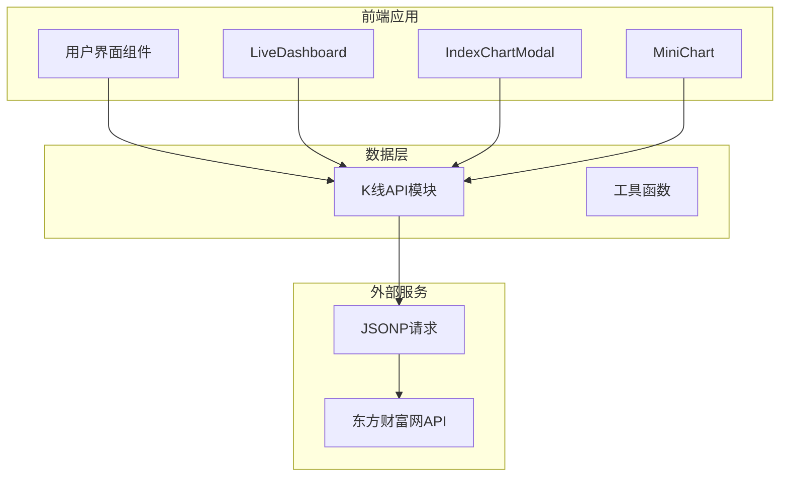
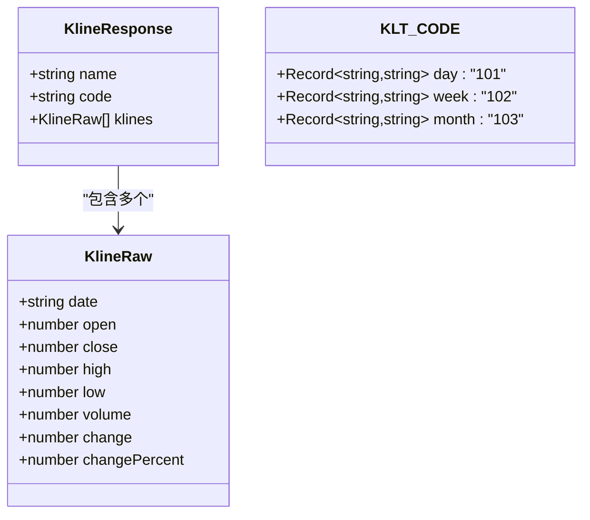
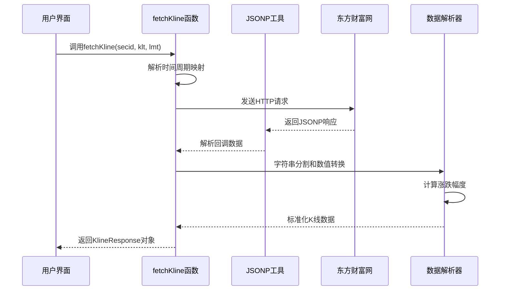
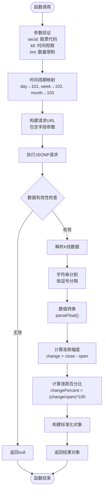
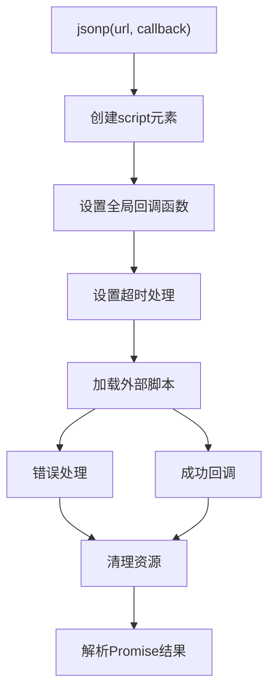
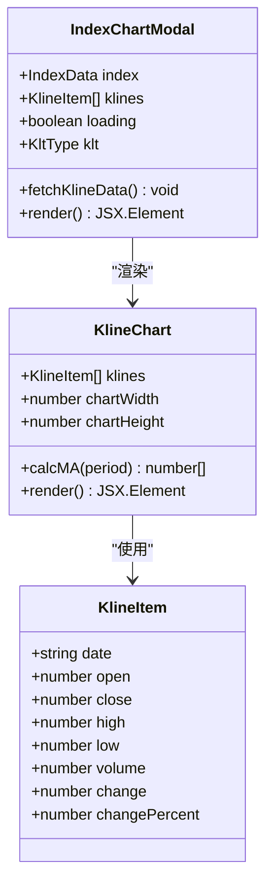
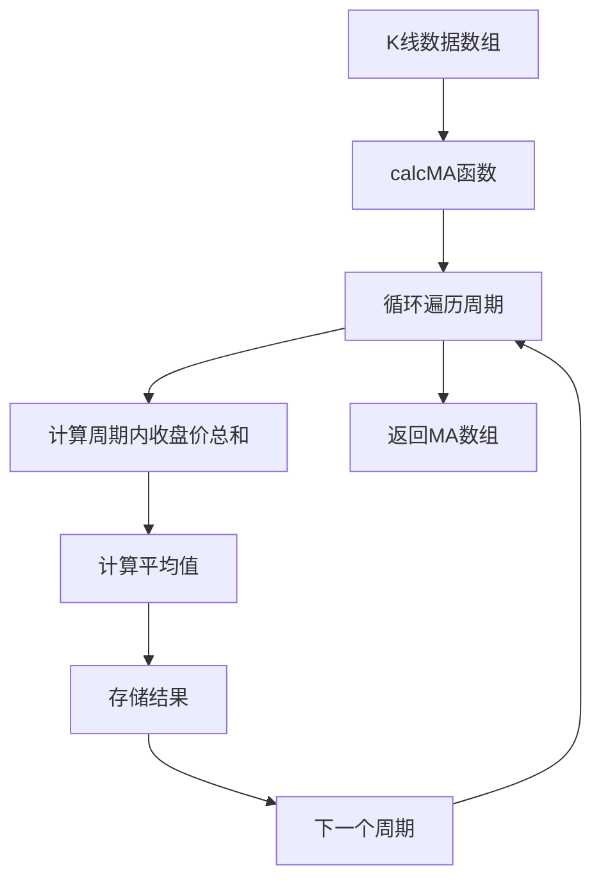
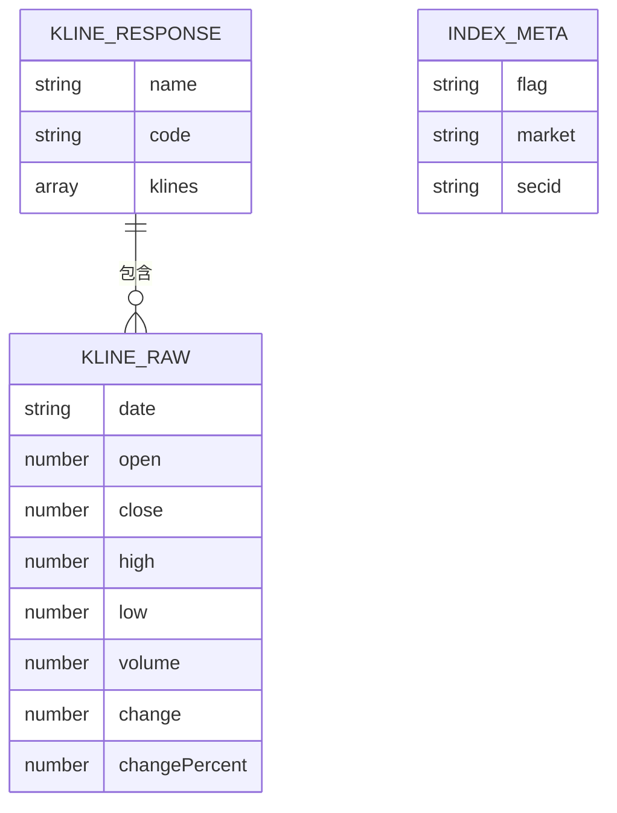
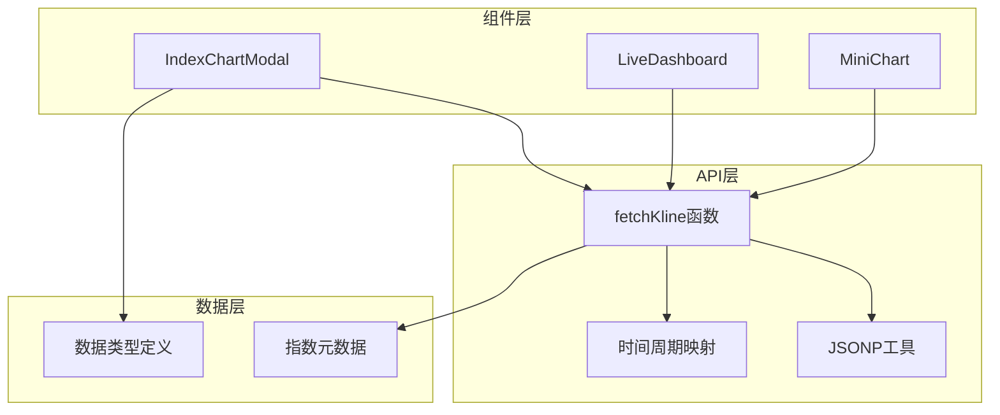

# K线数据API

<cite>
**本文档引用的文件**
- [client-api.ts](file://lib/client-api.ts)
- [IndexChartModal.tsx](file://components/IndexChartModal.tsx)
- [data.ts](file://lib/data.ts)
- [MiniChart.tsx](file://components/MiniChart.tsx)
- [LiveDashboard.tsx](file://components/LiveDashboard.tsx)
</cite>

## 目录
1. [简介](#简介)
2. [项目结构](#项目结构)
3. [核心组件](#核心组件)
4. [架构概览](#架构概览)
5. [详细组件分析](#详细组件分析)
6. [依赖关系分析](#依赖关系分析)
7. [性能考虑](#性能考虑)
8. [故障排除指南](#故障排除指南)
9. [结论](#结论)

## 简介

本文档详细介绍了项目中的K线数据API系统，重点分析了`fetchKline`函数的实现机制。该系统提供了从东方财富网获取历史K线数据的能力，支持日K、周K和月K三种时间周期，并将原始数据转换为标准化的K线数据结构，用于图表绘制和趋势分析。

## 项目结构

该项目采用React + TypeScript构建的金融数据仪表板应用，K线数据API位于`lib/client-api.ts`文件中，通过JSONP方式与东方财富网的股票数据接口进行交互。

**图表来源**
- [client-api.ts:105-136](file://lib/client-api.ts#L105-L136)
- [IndexChartModal.tsx:38-55](file://components/IndexChartModal.tsx#L38-L55)

**章节来源**
- [client-api.ts:1-596](file://lib/client-api.ts#L1-L596)
- [IndexChartModal.tsx:1-367](file://components/IndexChartModal.tsx#L1-L367)

## 核心组件

### K线数据接口定义

系统定义了标准的K线数据结构，包含完整的价格序列和成交量信息：

**图表来源**
- [client-api.ts:88-97](file://lib/client-api.ts#L88-L97)
- [client-api.ts:99-103](file://lib/client-api.ts#L99-L103)

### 时间周期映射机制

系统使用`KLT_CODE`常量将人类可读的时间周期映射到东方财富网的内部编码：

| 时间周期 | 映射值 | 用途 |
|---------|--------|------|
| day | 101 | 日K线数据 |
| week | 102 | 周K线数据 |
| month | 103 | 月K线数据 |

**章节来源**
- [client-api.ts:99-103](file://lib/client-api.ts#L99-L103)
- [client-api.ts:105-136](file://lib/client-api.ts#L105-L136)

## 架构概览

K线数据API采用分层架构设计，从底层的数据获取到上层的可视化展示形成完整的数据流。

**图表来源**
- [client-api.ts:105-136](file://lib/client-api.ts#L105-L136)
- [client-api.ts:5-36](file://lib/client-api.ts#L5-L36)

## 详细组件分析

### fetchKline函数实现

`fetchKline`是整个K线数据API的核心函数，负责从东方财富网获取历史K线数据并进行标准化处理。

#### 函数签名和参数

**图表来源**
- [client-api.ts:105-136](file://lib/client-api.ts#L105-L136)
- [client-api.ts:115-131](file://lib/client-api.ts#L115-L131)

#### 参数配置详解

| 参数名 | 类型 | 默认值 | 描述 |
|-------|------|--------|------|
| secid | string | 必需 | 证券代码，格式如"1.000001" |
| klt | string | 'day' | 时间周期，支持'day'、'week'、'month' |
| lmt | number | 120 | 获取K线数量限制 |

#### 数据转换逻辑

系统接收的原始数据格式为CSV字符串，每个K线条目包含7个字段：
1. 日期：`p[0]`
2. 开盘价：`p[1]`
3. 收盘价：`p[2]`
4. 最高价：`p[3]`
5. 最低价：`p[4]`
6. 成交量：`p[5]`
7. 其他字段：`p[6+]`

转换过程包括：
- 使用`parseFloat()`进行数值类型转换
- 计算绝对涨跌幅度：`change = close - open`
- 计算百分比涨跌：`changePercent = (change / open) * 100`
- 处理除零异常情况

**章节来源**
- [client-api.ts:105-136](file://lib/client-api.ts#L105-L136)
- [client-api.ts:115-131](file://lib/client-api.ts#L115-L131)

### JSONP工具函数

为了绕过跨域限制，系统使用自定义的JSONP实现：

**图表来源**
- [client-api.ts:5-36](file://lib/client-api.ts#L5-L36)

**章节来源**
- [client-api.ts:5-36](file://lib/client-api.ts#L5-L36)

### K线数据可视化组件

#### IndexChartModal组件

该组件负责显示完整的K线图表，支持多种时间周期切换：

**图表来源**
- [IndexChartModal.tsx:27-167](file://components/IndexChartModal.tsx#L27-L167)
- [IndexChartModal.tsx:169-367](file://components/IndexChartModal.tsx#L169-L367)

#### 技术指标计算

系统实现了简单的移动平均线(MA)计算：

**图表来源**
- [IndexChartModal.tsx:356-366](file://components/IndexChartModal.tsx#L356-L366)

**章节来源**
- [IndexChartModal.tsx:169-367](file://components/IndexChartModal.tsx#L169-L367)

### 数据模型定义

系统定义了完整的数据模型来描述K线数据的结构：

**图表来源**
- [client-api.ts:88-97](file://lib/client-api.ts#L88-L97)
- [client-api.ts:105-136](file://lib/client-api.ts#L105-L136)
- [client-api.ts:140-150](file://lib/client-api.ts#L140-L150)

**章节来源**
- [client-api.ts:88-97](file://lib/client-api.ts#L88-L97)
- [client-api.ts:140-150](file://lib/client-api.ts#L140-L150)

## 依赖关系分析

### 组件间依赖关系

**图表来源**
- [client-api.ts:105-136](file://lib/client-api.ts#L105-L136)
- [IndexChartModal.tsx:6](file://components/IndexChartModal.tsx#L6)
- [LiveDashboard.tsx:35](file://components/LiveDashboard.tsx#L35)

### 外部依赖分析

系统对外部服务的依赖主要体现在以下几个方面：

1. **东方财富网API**：提供历史K线数据
2. **JSONP协议**：绕过浏览器跨域限制
3. **浏览器环境**：依赖DOM操作和全局变量

**章节来源**
- [client-api.ts:105-136](file://lib/client-api.ts#L105-L136)
- [client-api.ts:5-36](file://lib/client-api.ts#L5-L36)

## 性能考虑

### 数据获取优化

1. **批量请求**：在`fetchIndices`函数中使用Promise.all并行获取多个指数的K线数据
2. **缓存策略**：利用浏览器缓存机制减少重复请求
3. **数据截断**：通过`lmt`参数控制返回数据量，避免过多数据传输

### 渲染性能优化

1. **虚拟滚动**：对于大量数据的场景，可以考虑实现虚拟滚动
2. **Canvas渲染**：对于大量K线数据，Canvas渲染比SVG更高效
3. **懒加载**：只在需要时才加载和渲染K线数据

### 内存管理

1. **及时清理**：组件卸载时清理定时器和事件监听器
2. **数据清理**：避免在组件状态中存储不必要的大数据
3. **垃圾回收**：及时释放不再使用的对象引用

## 故障排除指南

### 常见问题及解决方案

#### 1. JSONP请求失败

**症状**：控制台出现"JSONP failed"错误
**原因**：网络请求超时或服务器响应异常
**解决方案**：
- 检查网络连接状态
- 验证目标URL的有效性
- 增加超时时间设置

#### 2. K线数据为空

**症状**：返回null或空数组
**原因**：API返回数据格式不符合预期
**解决方案**：
- 检查`data.data.klines`是否存在
- 验证数据格式是否正确
- 确认时间周期参数的有效性

#### 3. 数值转换错误

**症状**：NaN值出现在价格数据中
**原因**：字符串无法转换为数字
**解决方案**：
- 添加数据验证和清理逻辑
- 处理特殊字符和格式问题
- 实现默认值处理机制

**章节来源**
- [client-api.ts:133-135](file://lib/client-api.ts#L133-L135)
- [client-api.ts:113-114](file://lib/client-api.ts#L113-L114)

### 调试技巧

1. **网络监控**：使用浏览器开发者工具监控网络请求
2. **数据验证**：在关键节点添加console.log输出
3. **错误边界**：实现React错误边界捕获组件级错误

## 结论

该K线数据API系统提供了完整的历史K线数据获取和处理能力，具有以下特点：

1. **标准化接口**：统一的K线数据结构便于后续处理和展示
2. **灵活的时间周期**：支持日K、周K、月K三种常见时间维度
3. **完善的错误处理**：包含网络请求和数据解析的多重保护
4. **高效的可视化**：配合React组件实现流畅的图表渲染

系统在实际应用中可用于：
- 股票和指数的K线图表展示
- 技术分析和趋势预测
- 投资组合的绩效追踪
- 金融数据的实时监控

通过进一步的优化，如实现数据缓存、支持更多技术指标、增强错误恢复机制等，可以进一步提升系统的稳定性和用户体验。