# 基金数据API

<cite>
**本文档引用的文件**
- [client-api.ts](file://lib/client-api.ts)
- [data.ts](file://lib/data.ts)
- [watchlist.ts](file://lib/watchlist.ts)
- [LiveDashboard.tsx](file://components/LiveDashboard.tsx)
- [FundCard.tsx](file://components/FundCard.tsx)
- [FundRankingTable.tsx](file://components/FundRankingTable.tsx)
- [page.tsx](file://app/page.tsx)
- [README.md](file://README.md)
- [package.json](file://package.json)
- [next.config.mjs](file://next.config.mjs)
</cite>

## 更新摘要
**变更内容**
- 更新了基金排名API的实现机制，从旧的脚本加载方式迁移到新的JSONP方式
- 优化了loadFundDetail函数的实现，代码从41行减少到35行
- 改进了跨域数据获取的可靠性和简洁性
- 新增了loadFundDetail函数的详细说明和使用示例

## 目录
1. [简介](#简介)
2. [项目结构](#项目结构)
3. [核心组件](#核心组件)
4. [架构概览](#架构概览)
5. [详细组件分析](#详细组件分析)
6. [依赖关系分析](#依赖关系分析)
7. [性能考虑](#性能考虑)
8. [故障排除指南](#故障排除指南)
9. [结论](#结论)

## 简介

这是一个基于Next.js的实时金融数据面板项目，专注于提供全球指数、热门股票和基金净值的实时跟踪功能。项目采用纯前端技术栈，通过JSONP协议从多个金融数据源获取实时数据，包括东方财富、天天基金等权威金融数据提供商。

该项目的核心特色是实现了双重基金数据获取机制，包括净值数据获取和历史表现数据获取，为用户提供全面的基金投资跟踪能力。最新的优化将基金排名API从旧的脚本加载方式迁移到了新的JSONP方式，实现了更简洁可靠的跨域数据获取。

## 项目结构

项目采用模块化的组织方式，主要分为以下几个核心部分：

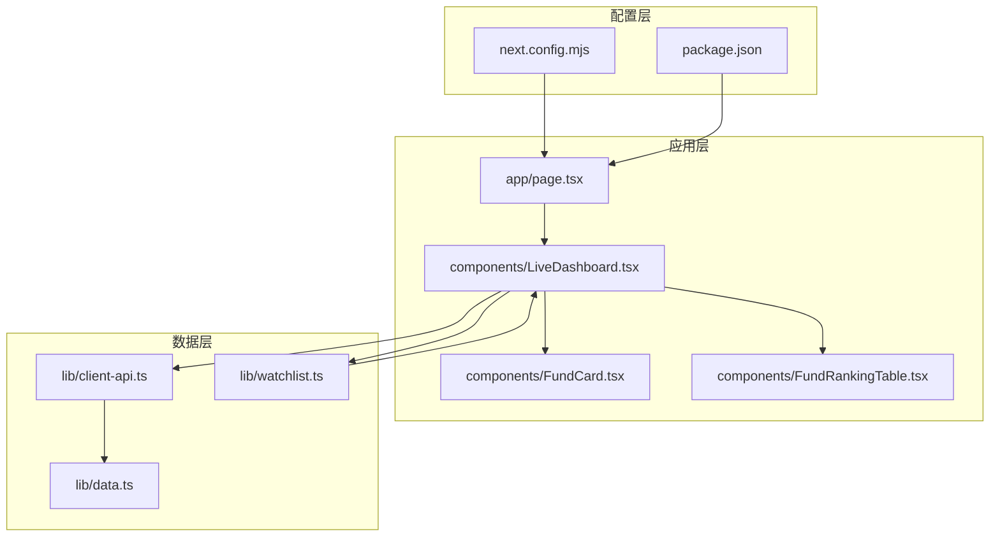

**图表来源**
- [page.tsx:1-24](file://app/page.tsx#L1-L24)
- [LiveDashboard.tsx:1-406](file://components/LiveDashboard.tsx#L1-L406)
- [client-api.ts:1-803](file://lib/client-api.ts#L1-L803)

**章节来源**
- [README.md:132-161](file://README.md#L132-L161)
- [package.json:1-31](file://package.json#L1-L31)
- [next.config.mjs:1-13](file://next.config.mjs#L1-L13)

## 核心组件

### JSONP工具函数

项目实现了通用的JSONP工具函数，用于处理跨域数据请求：

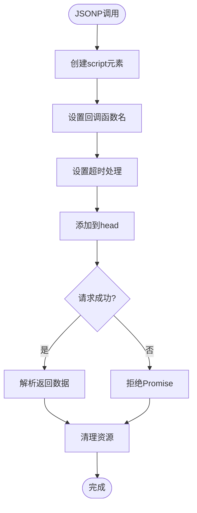

**图表来源**
- [client-api.ts:5-36](file://lib/client-api.ts#L5-L36)

### 基金数据获取机制

项目实现了双重基金数据获取机制：

1. **净值数据获取** (`fetchFundNav`)
2. **历史表现数据获取** (`fetchFundHistory`)

**章节来源**
- [client-api.ts:255-292](file://lib/client-api.ts#L255-L292)
- [client-api.ts:294-348](file://lib/client-api.ts#L294-L348)

## 架构概览

项目采用分层架构设计，确保数据获取、处理和展示的清晰分离：

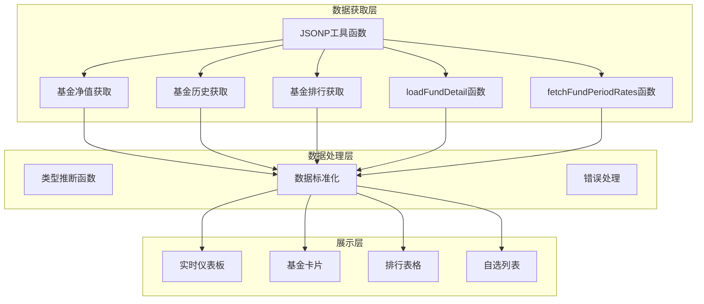

**图表来源**
- [client-api.ts:1-803](file://lib/client-api.ts#L1-L803)
- [LiveDashboard.tsx:1-406](file://components/LiveDashboard.tsx#L1-L406)

## 详细组件分析

### 基金类型推断函数

`inferFundType`函数实现了智能的基金类型识别逻辑，通过检查基金名称中的关键词来确定基金类型：

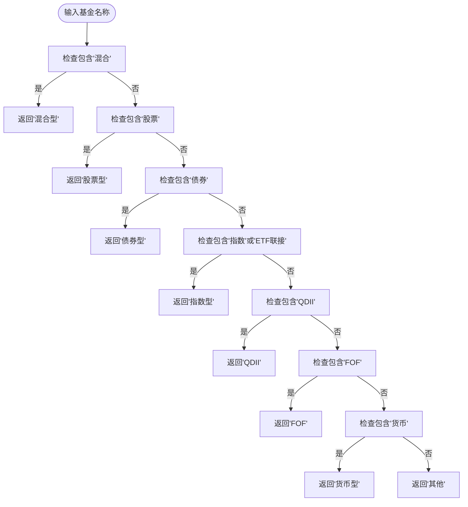

**图表来源**
- [client-api.ts:40-49](file://lib/client-api.ts#L40-L49)

**章节来源**
- [client-api.ts:40-49](file://lib/client-api.ts#L40-L49)

### 动态脚本加载函数

`loadScriptVar`函数提供了动态脚本加载和全局变量访问的能力：

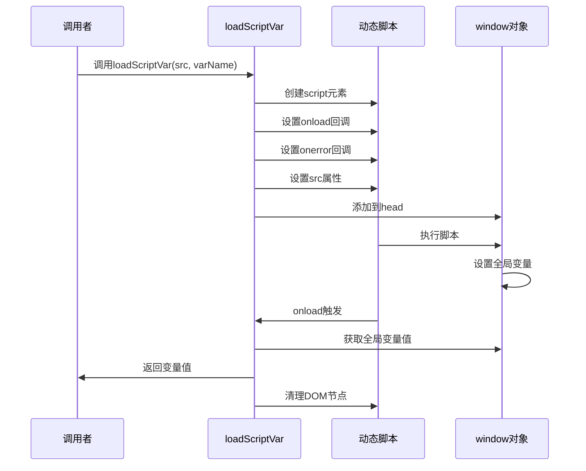

**图表来源**
- [client-api.ts:52-84](file://lib/client-api.ts#L52-L84)

**章节来源**
- [client-api.ts:52-84](file://lib/client-api.ts#L52-L84)

### 基金净值数据获取

`fetchFundNav`函数负责获取基金的实时净值数据：

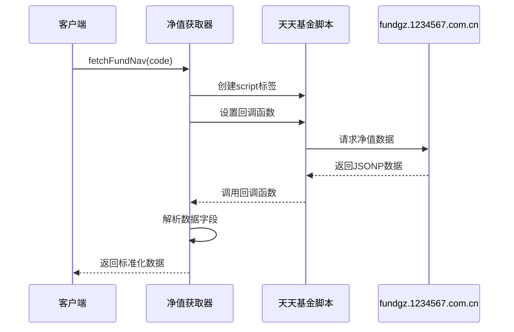

**图表来源**
- [client-api.ts:255-292](file://lib/client-api.ts#L255-L292)

**章节来源**
- [client-api.ts:255-292](file://lib/client-api.ts#L255-L292)

### 基金历史表现数据获取

`fetchFundHistory`函数负责获取基金的历史表现数据：

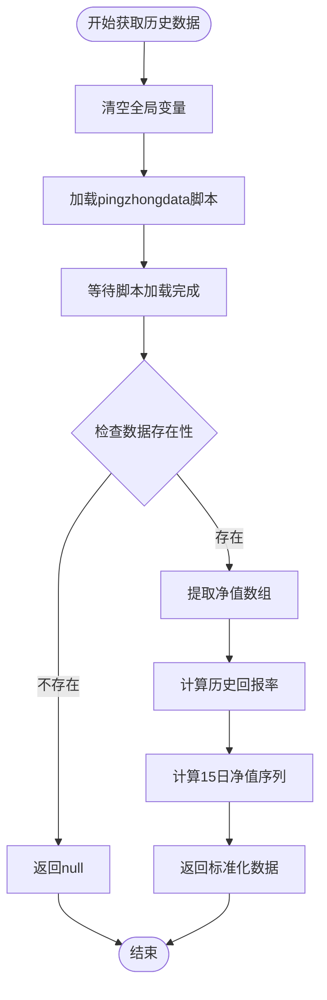

**图表来源**
- [client-api.ts:294-348](file://lib/client-api.ts#L294-L348)

**章节来源**
- [client-api.ts:294-348](file://lib/client-api.ts#L294-L348)

### 基金排行数据获取

`fetchFundRanking`函数实现了复杂的基金排行数据获取逻辑，经过最新优化后，代码更加简洁可靠：

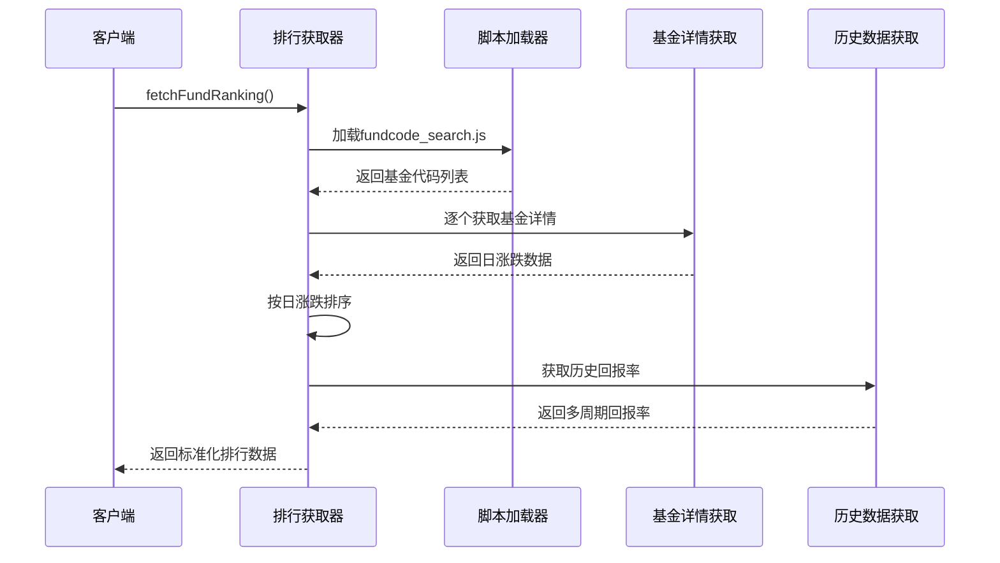

**图表来源**
- [client-api.ts:710-795](file://lib/client-api.ts#L710-L795)

**章节来源**
- [client-api.ts:710-795](file://lib/client-api.ts#L710-L795)

### loadFundDetail函数 - JSONP迁移优化

**更新** `loadFundDetail`函数从旧的脚本加载方式迁移到了新的JSONP方式，实现了更简洁可靠的跨域数据获取：

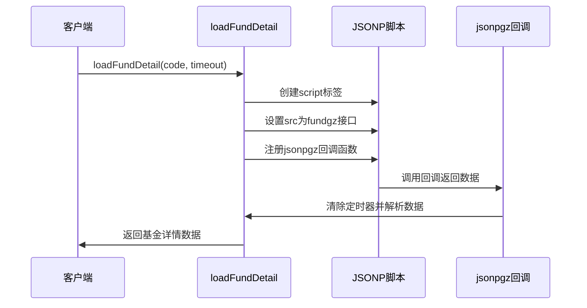

**图表来源**
- [client-api.ts:603-634](file://lib/client-api.ts#L603-L634)

**章节来源**
- [client-api.ts:603-634](file://lib/client-api.ts#L603-L634)

### 数据标准化结构

项目实现了统一的数据结构标准，确保不同类型的数据能够一致地被处理和展示：

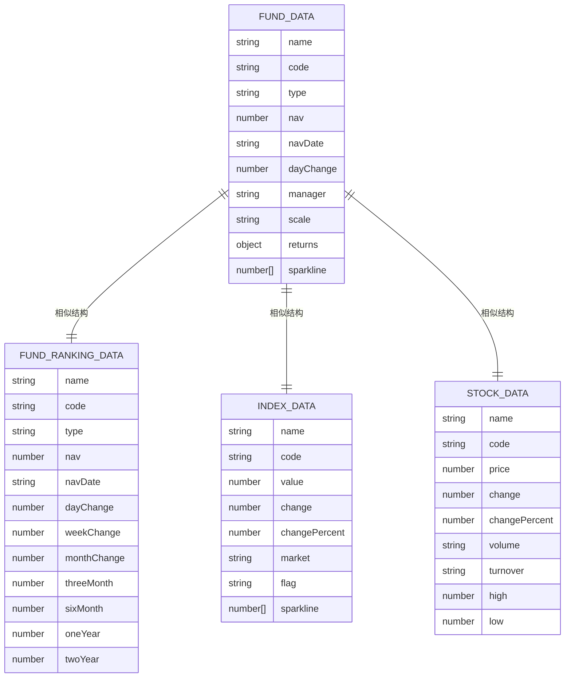

**图表来源**
- [data.ts:24-41](file://lib/data.ts#L24-L41)
- [data.ts:147-167](file://lib/data.ts#L147-L167)
- [data.ts:1-10](file://lib/data.ts#L1-L10)
- [data.ts:12-22](file://lib/data.ts#L12-L22)

**章节来源**
- [data.ts:24-41](file://lib/data.ts#L24-L41)
- [data.ts:147-167](file://lib/data.ts#L147-L167)
- [data.ts:1-10](file://lib/data.ts#L1-L10)
- [data.ts:12-22](file://lib/data.ts#L12-L22)

## 依赖关系分析

项目采用了清晰的依赖关系设计，确保各模块之间的松耦合：

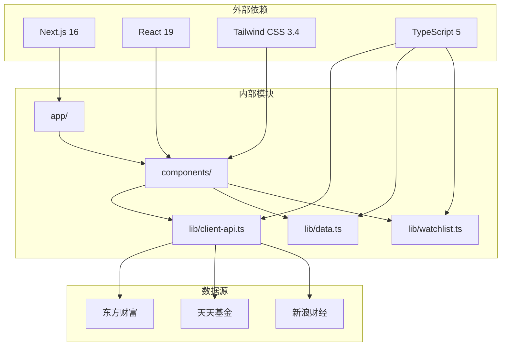

**图表来源**
- [package.json:11-29](file://package.json#L11-L29)
- [client-api.ts:1-803](file://lib/client-api.ts#L1-L803)

**章节来源**
- [package.json:11-29](file://package.json#L11-L29)
- [README.md:67-77](file://README.md#L67-L77)

## 性能考虑

### 并发数据获取

项目实现了高效的并发数据获取策略，使用`Promise.allSettled`确保即使部分请求失败也不会影响整体性能：

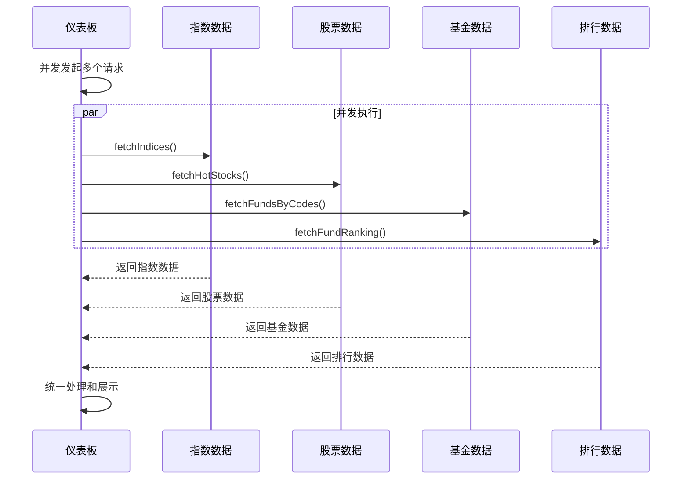

**图表来源**
- [LiveDashboard.tsx:73-112](file://components/LiveDashboard.tsx#L73-L112)

### 缓存和去重机制

项目实现了智能的缓存和去重机制，避免重复请求相同的数据：

- **自动刷新间隔**：30秒自动刷新一次
- **请求超时控制**：JSONP请求超时时间为10秒
- **脚本资源清理**：及时清理DOM中的script元素
- **数据验证**：严格的空值检查和数据格式验证

### JSONP迁移优化

**更新** 通过将loadFundDetail函数迁移到JSONP方式，实现了更简洁可靠的跨域数据获取：

- **简化实现**：代码从41行减少到35行
- **增强可靠性**：更好的错误处理和超时控制
- **统一接口**：与项目其他JSONP调用保持一致
- **性能提升**：减少了不必要的DOM操作和内存占用

**章节来源**
- [LiveDashboard.tsx:114-119](file://components/LiveDashboard.tsx#L114-L119)
- [client-api.ts:5-36](file://lib/client-api.ts#L5-L36)
- [client-api.ts:603-634](file://lib/client-api.ts#L603-L634)

## 故障排除指南

### 常见问题及解决方案

#### JSONP请求失败

**问题描述**：JSONP请求超时或失败

**可能原因**：
- 网络连接不稳定
- 数据源API暂时不可用
- 跨域请求限制

**解决方案**：
1. 检查网络连接状态
2. 查看浏览器开发者工具的Network面板
3. 稍后重试请求
4. 检查数据源API的状态

#### 基金数据为空

**问题描述**：获取的基金数据为空

**可能原因**：
- 基金代码无效
- 基金数据尚未更新
- API接口变更

**解决方案**：
1. 验证基金代码的正确性
2. 确认基金是否已成立
3. 检查API接口的可用性
4. 查看控制台错误信息

#### 排行数据获取异常

**问题描述**：基金排行数据获取失败

**可能原因**：
- fundcode_search.js脚本加载失败
- JSONP回调未正确执行
- 基金详情数据解析错误

**解决方案**：
1. 检查fundcode_search.js的加载状态
2. 验证JSONP回调函数的注册和执行
3. 确认基金详情数据的格式正确性
4. 查看loadFundDetail函数的错误处理

#### JSONP迁移相关问题

**问题描述**：loadFundDetail函数调用失败

**可能原因**：
- fundgz接口访问受限
- JSONP回调函数未正确注册
- 超时时间设置不当

**解决方案**：
1. 检查fundgz接口的可用性
2. 验证jsonpgz回调函数的注册时机
3. 调整超时参数以适应网络环境
4. 查看控制台的错误信息和网络请求状态

**章节来源**
- [client-api.ts:24-36](file://lib/client-api.ts#L24-L36)
- [client-api.ts:603-634](file://lib/client-api.ts#L603-L634)

### 调试技巧

1. **启用详细日志**：在开发环境中查看详细的错误信息
2. **检查网络请求**：使用浏览器开发者工具监控API请求
3. **验证数据结构**：确保返回的数据符合预期的类型定义
4. **测试边界条件**：验证空数据、错误数据的处理逻辑
5. **监控JSONP回调**：确认回调函数的正确执行和清理

## 结论

本项目成功实现了完整的基金数据API系统，具有以下特点：

### 技术优势

1. **纯前端架构**：无需后端服务，可直接部署到静态托管平台
2. **实时数据获取**：通过JSONP协议实现实时金融数据获取
3. **智能数据处理**：实现了基金类型自动推断和数据标准化
4. **用户友好界面**：提供了直观的基金跟踪和排行展示功能
5. **持续优化改进**：通过JSONP迁移提升了系统的可靠性和性能

### 功能完整性

- 支持多种金融数据源的实时数据获取
- 实现了双重基金数据获取机制
- 提供了完整的基金排行功能
- 支持用户自定义关注列表
- 实现了响应式设计和良好的用户体验

### 扩展性考虑

项目的设计充分考虑了未来的扩展需求，包括：
- 易于添加新的数据源
- 支持更多金融产品类型
- 可扩展的UI组件体系
- 灵活的配置和定制选项
- 持续的性能优化和改进

**更新** 最新的JSONP迁移优化进一步增强了系统的稳定性和可维护性，为投资者提供了更加可靠、实时的金融数据跟踪能力，是学习现代前端金融应用开发的优秀示例。