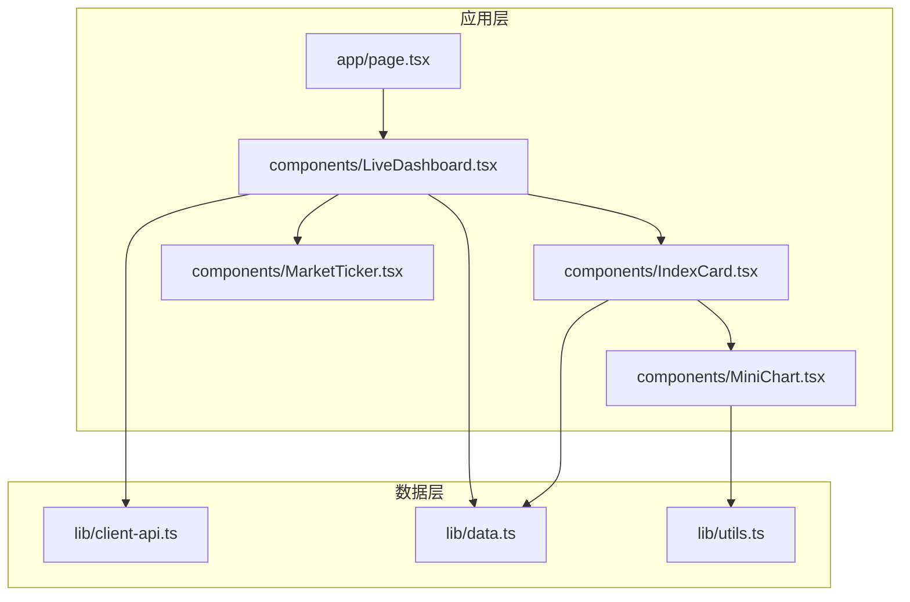
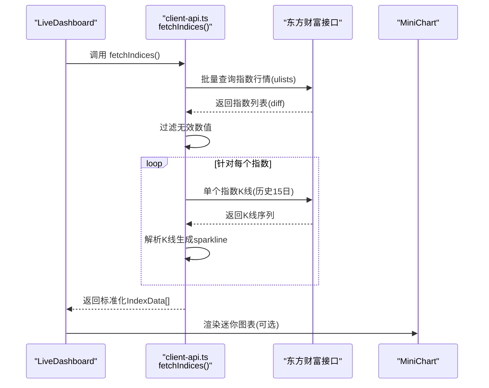
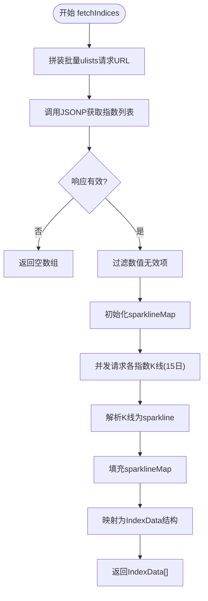
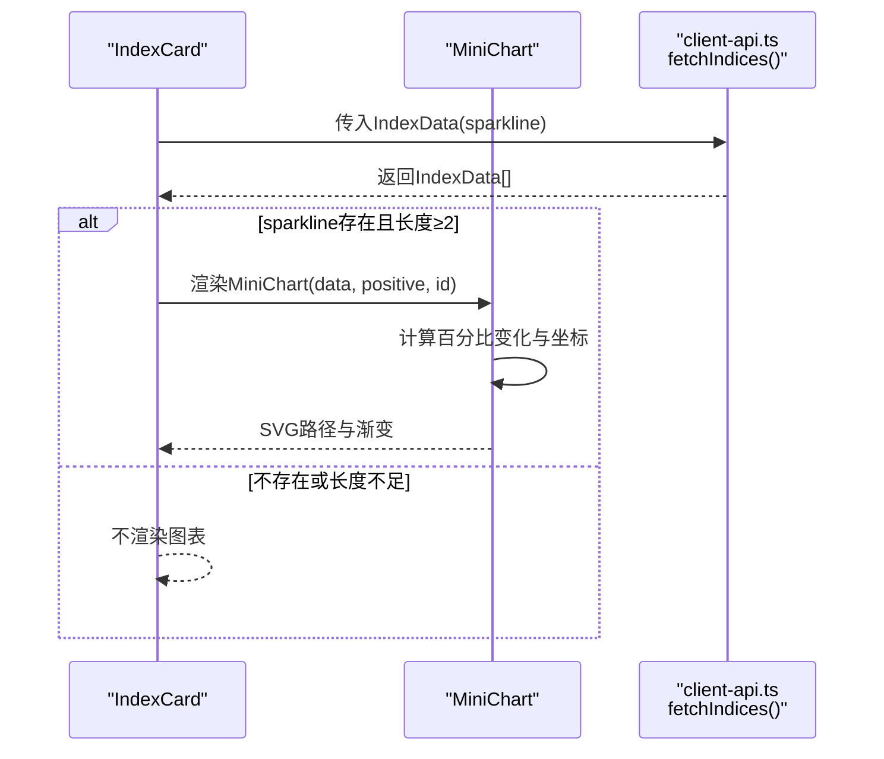
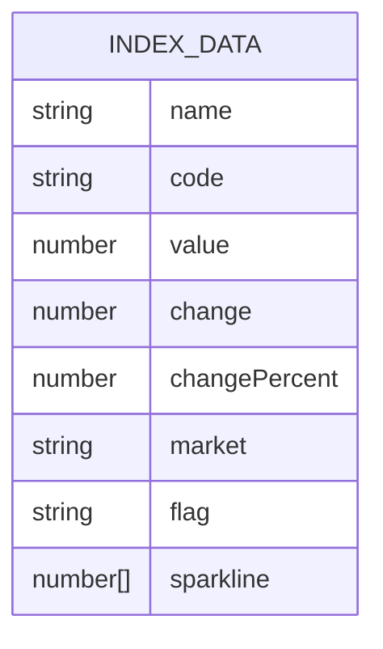
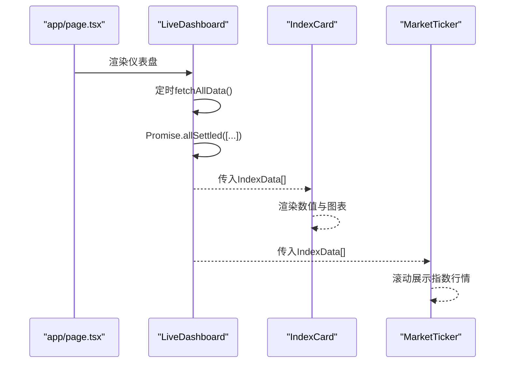
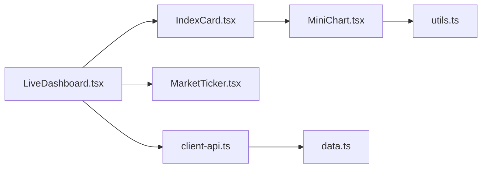

# 指数数据API

<cite>
**本文引用的文件**
- [client-api.ts](file://lib/client-api.ts)
- [data.ts](file://lib/data.ts)
- [IndexCard.tsx](file://components/IndexCard.tsx)
- [MiniChart.tsx](file://components/MiniChart.tsx)
- [LiveDashboard.tsx](file://components/LiveDashboard.tsx)
- [MarketTicker.tsx](file://components/MarketTicker.tsx)
- [page.tsx](file://app/page.tsx)
- [utils.ts](file://lib/utils.ts)
</cite>

## 目录
1. [简介](#简介)
2. [项目结构](#项目结构)
3. [核心组件](#核心组件)
4. [架构总览](#架构总览)
5. [详细组件分析](#详细组件分析)
6. [依赖关系分析](#依赖关系分析)
7. [性能考量](#性能考量)
8. [故障排查指南](#故障排查指南)
9. [结论](#结论)
10. [附录](#附录)

## 简介
本文件面向指数数据API的使用者与维护者，系统性阐述以下内容：
- INDEX_META配置对象的设计：市场标识符、地区代码与SECID映射的含义与来源
- fetchIndices函数的实现逻辑：批量请求构建、数据过滤与格式化流程
- 迷你图表（sparkline）数据的获取机制：并发请求与可选降级策略
- 指数数据的标准化结构：字段定义、单位与展示约定
- 使用示例与性能优化建议

## 项目结构
该项目为Next.js前端应用，围绕“指数/股票/基金”实时行情与跟踪功能组织代码。与指数API直接相关的核心文件如下：
- lib/client-api.ts：封装指数、股票、基金等数据接口，包含fetchIndices与INDEX_META
- lib/data.ts：定义IndexData等数据模型接口
- components/IndexCard.tsx：指数卡片UI组件，消费IndexData并渲染迷你图表
- components/MiniChart.tsx：迷你图表SVG绘制组件
- components/LiveDashboard.tsx：仪表盘页面，调度fetchIndices并管理状态
- components/MarketTicker.tsx：顶部跑马灯式指数行情展示
- app/page.tsx：首页入口，挂载仪表盘
- lib/utils.ts：工具类函数（样式合并）



**图表来源**
- [page.tsx:10-23](file://app/page.tsx#L10-L23)
- [LiveDashboard.tsx:39-301](file://components/LiveDashboard.tsx#L39-L301)
- [client-api.ts:138-199](file://lib/client-api.ts#L138-L199)
- [data.ts:1-41](file://lib/data.ts#L1-L41)
- [IndexCard.tsx:1-53](file://components/IndexCard.tsx#L1-L53)
- [MiniChart.tsx:1-57](file://components/MiniChart.tsx#L1-L57)
- [MarketTicker.tsx:1-52](file://components/MarketTicker.tsx#L1-L52)
- [utils.ts:1-7](file://lib/utils.ts#L1-L7)

**章节来源**
- [page.tsx:10-23](file://app/page.tsx#L10-L23)
- [LiveDashboard.tsx:39-301](file://components/LiveDashboard.tsx#L39-L301)
- [client-api.ts:138-199](file://lib/client-api.ts#L138-L199)
- [data.ts:1-41](file://lib/data.ts#L1-L41)
- [IndexCard.tsx:1-53](file://components/IndexCard.tsx#L1-L53)
- [MiniChart.tsx:1-57](file://components/MiniChart.tsx#L1-L57)
- [MarketTicker.tsx:1-52](file://components/MarketTicker.tsx#L1-L52)
- [utils.ts:1-7](file://lib/utils.ts#L1-L7)

## 核心组件
- INDEX_META：指数代码到市场、旗帜与SECID的映射表，用于统一索引标识与跨API调用
- fetchIndices：主指数批量拉取与格式化函数，返回标准化IndexData数组
- MiniChart：基于sparkline数据绘制的迷你图表组件
- IndexCard：展示指数名称、代码、数值、涨跌与百分比变化，并可选显示迷你图表
- LiveDashboard：调度fetchIndices并管理全局状态，定时刷新

**章节来源**
- [client-api.ts:140-150](file://lib/client-api.ts#L140-L150)
- [client-api.ts:154-199](file://lib/client-api.ts#L154-L199)
- [MiniChart.tsx:9-57](file://components/MiniChart.tsx#L9-L57)
- [IndexCard.tsx:5-53](file://components/IndexCard.tsx#L5-L53)
- [LiveDashboard.tsx:56-102](file://components/LiveDashboard.tsx#L56-L102)

## 架构总览
指数数据API的调用链路与数据流如下：



**图表来源**
- [LiveDashboard.tsx:56-95](file://components/LiveDashboard.tsx#L56-L95)
- [client-api.ts:154-199](file://lib/client-api.ts#L154-L199)
- [MiniChart.tsx:9-57](file://components/MiniChart.tsx#L9-L57)

## 详细组件分析

### INDEX_META配置对象设计
- 设计目标
  - 统一不同来源的指数代码与市场标识，便于跨API调用与UI展示
  - 提供旗帜emoji与地区代码，增强国际化与可读性
- 字段说明
  - code：指数内部代码（如000001、399001、HSI等）
  - flag：地区旗帜emoji，用于UI直观识别
  - market：地区代码（CN、HK、US、JP、EU、KR等）
  - secid：东方财富API使用的SECID参数值
- 映射来源
  - 通过东方财富接口的ulists与kline接口进行验证与适配
  - 示例：上证指数、深证成指、创业板指、恒生指数、纳斯达克、标普500、日经225、富时100、韩国综合

```mermaid
classDiagram
class INDEX_META {
+记录映射
+键 : 指数代码
+值 : {flag, market, secid}
}
class IndexData {
+name : string
+code : string
+value : number
+change : number
+changePercent : number
+market : string
+flag : string
+sparkline? : number[]
}
INDEX_META --> IndexData : "用于构造/补充"
```

**图表来源**
- [client-api.ts:140-150](file://lib/client-api.ts#L140-L150)
- [data.ts:1-10](file://lib/data.ts#L1-L10)

**章节来源**
- [client-api.ts:140-150](file://lib/client-api.ts#L140-L150)
- [data.ts:1-10](file://lib/data.ts#L1-L10)

### fetchIndices函数实现逻辑
- 批量请求构建
  - 基于INDEX_META生成SECIDs列表，一次性调用ulists接口获取多指数行情
- 数据过滤与格式化
  - 校验响应状态与数据存在性
  - 过滤掉数值无效项（仅保留数值字段有效）
  - 将返回字段映射为标准化IndexData结构
- 迷你图表数据获取
  - 并发请求每个指数的历史K线（15日），解析收盘价序列作为sparkline
  - 若某指数K线请求失败，不影响整体结果（可选降级）
- 返回值
  - 标准化的IndexData数组，包含名称、代码、数值、涨跌、百分比、市场、旗帜与可选sparkline



**图表来源**
- [client-api.ts:154-199](file://lib/client-api.ts#L154-L199)

**章节来源**
- [client-api.ts:154-199](file://lib/client-api.ts#L154-L199)

### 迷你图表数据获取机制
- 并发请求处理
  - 使用Promise.all并发向K线接口发起请求，提升整体吞吐
- 可选数据降级策略
  - 每个指数的K线请求独立try/catch，失败不影响其他指数
  - 若无sparkline，则在IndexData中置为空数组
- 图表渲染
  - IndexCard根据sparkline长度决定是否渲染MiniChart
  - MiniChart将数值序列转换为百分比变化，计算坐标点并绘制SVG路径与渐变区域



**图表来源**
- [IndexCard.tsx:44-48](file://components/IndexCard.tsx#L44-L48)
- [MiniChart.tsx:9-57](file://components/MiniChart.tsx#L9-L57)
- [client-api.ts:161-177](file://lib/client-api.ts#L161-L177)

**章节来源**
- [IndexCard.tsx:44-48](file://components/IndexCard.tsx#L44-L48)
- [MiniChart.tsx:9-57](file://components/MiniChart.tsx#L9-L57)
- [client-api.ts:161-177](file://lib/client-api.ts#L161-L177)

### 指数数据标准化结构
- 字段定义
  - name：指数名称
  - code：指数代码
  - value：当前数值
  - change：涨跌额
  - changePercent：涨跌百分比
  - market：地区代码
  - flag：地区旗帜emoji
  - sparkline：15日收盘价序列（可选）
- 展示约定
  - 数值与涨跌采用本地化格式化
  - 百分比保留两位小数并带%符号
  - 正负以颜色区分（成功/破坏性色）



**图表来源**
- [data.ts:1-10](file://lib/data.ts#L1-L10)

**章节来源**
- [data.ts:1-10](file://lib/data.ts#L1-L10)
- [IndexCard.tsx:30-43](file://components/IndexCard.tsx#L30-L43)

### 使用示例
- 在仪表盘中使用
  - LiveDashboard通过Promise.allSettled并发拉取指数、热门股票、自选股票、跟踪基金与排行榜
  - 成功后更新状态并设置最后更新时间
- 在卡片中展示
  - IndexCard接收IndexData，渲染名称、代码、数值、涨跌与百分比
  - 当sparkline可用时，渲染MiniChart
- 在跑马灯中展示
  - MarketTicker循环展示指数行情，鼠标悬停暂停滚动



**图表来源**
- [page.tsx:10-23](file://app/page.tsx#L10-L23)
- [LiveDashboard.tsx:56-102](file://components/LiveDashboard.tsx#L56-L102)
- [IndexCard.tsx:5-53](file://components/IndexCard.tsx#L5-L53)
- [MarketTicker.tsx:8-51](file://components/MarketTicker.tsx#L8-L51)

**章节来源**
- [page.tsx:10-23](file://app/page.tsx#L10-L23)
- [LiveDashboard.tsx:56-102](file://components/LiveDashboard.tsx#L56-L102)
- [IndexCard.tsx:5-53](file://components/IndexCard.tsx#L5-L53)
- [MarketTicker.tsx:8-51](file://components/MarketTicker.tsx#L8-L51)

## 依赖关系分析
- 组件耦合
  - LiveDashboard依赖client-api.ts中的fetchIndices与INDEX_META
  - IndexCard依赖MiniChart与data.ts中的IndexData接口
  - MarketTicker依赖IndexData进行展示
- 外部依赖
  - 东方财富接口（ulists与kline）
  - JSONP脚本注入方式获取数据
- 潜在风险
  - JSONP超时与失败处理
  - 并发请求过多可能触发风控
  - K线请求失败导致sparkline缺失



**图表来源**
- [LiveDashboard.tsx:39-301](file://components/LiveDashboard.tsx#L39-L301)
- [client-api.ts:138-199](file://lib/client-api.ts#L138-L199)
- [data.ts:1-41](file://lib/data.ts#L1-L41)
- [IndexCard.tsx:1-53](file://components/IndexCard.tsx#L1-L53)
- [MiniChart.tsx:1-57](file://components/MiniChart.tsx#L1-L57)
- [utils.ts:1-7](file://lib/utils.ts#L1-L7)

**章节来源**
- [LiveDashboard.tsx:39-301](file://components/LiveDashboard.tsx#L39-L301)
- [client-api.ts:138-199](file://lib/client-api.ts#L138-L199)
- [data.ts:1-41](file://lib/data.ts#L1-L41)
- [IndexCard.tsx:1-53](file://components/IndexCard.tsx#L1-L53)
- [MiniChart.tsx:1-57](file://components/MiniChart.tsx#L1-L57)
- [utils.ts:1-7](file://lib/utils.ts#L1-L7)

## 性能考量
- 并发优化
  - 使用Promise.all并发请求各指数K线，减少总等待时间
  - 使用Promise.allSettled并行拉取多个数据源，避免单点阻塞
- 请求节流
  - 仪表盘每30秒刷新一次，避免频繁请求触发风控
- 数据缓存
  - 对于静态配置（如INDEX_META），可在内存中复用，减少重复计算
- 渲染优化
  - MiniChart仅在数据充足时渲染，避免无效SVG绘制
  - 使用本地化格式化减少重复计算

[本节为通用性能建议，无需特定文件来源]

## 故障排查指南
- 常见问题
  - JSONP超时或失败：检查网络与接口可用性；确认回调参数名正确
  - 返回数据为空：确认INDEX_META中的secid与代码映射正确
  - sparkline缺失：单个指数K线请求失败不影响整体，属预期行为
- 日志定位
  - fetchIndices捕获异常并打印错误日志，便于定位问题
  - LiveDashboard在刷新失败时输出错误信息
- 降级策略
  - K线请求失败时返回空sparkline，不影响指数列表展示
  - 若指数列表为空，仪表盘显示“模拟数据”状态

**章节来源**
- [client-api.ts:195-198](file://lib/client-api.ts#L195-L198)
- [LiveDashboard.tsx:90-94](file://components/LiveDashboard.tsx#L90-L94)

## 结论
本指数数据API通过INDEX_META统一了指数代码、市场与SECID映射，利用批量请求与并发K线获取实现了高效的数据拉取与可视化。MiniChart提供了直观的短期趋势展示，配合LiveDashboard的定时刷新与错误降级策略，确保了用户体验与稳定性。建议在生产环境中结合缓存与限流策略进一步优化性能与可靠性。

[本节为总结性内容，无需特定文件来源]

## 附录
- 关键API与数据模型
  - INDEX_META：指数代码到市场与SECID的映射
  - fetchIndices：批量获取指数行情并生成sparkline
  - IndexData：标准化指数数据结构
  - MiniChart：基于sparkline的迷你图表组件

[本节为概要性内容，无需特定文件来源]