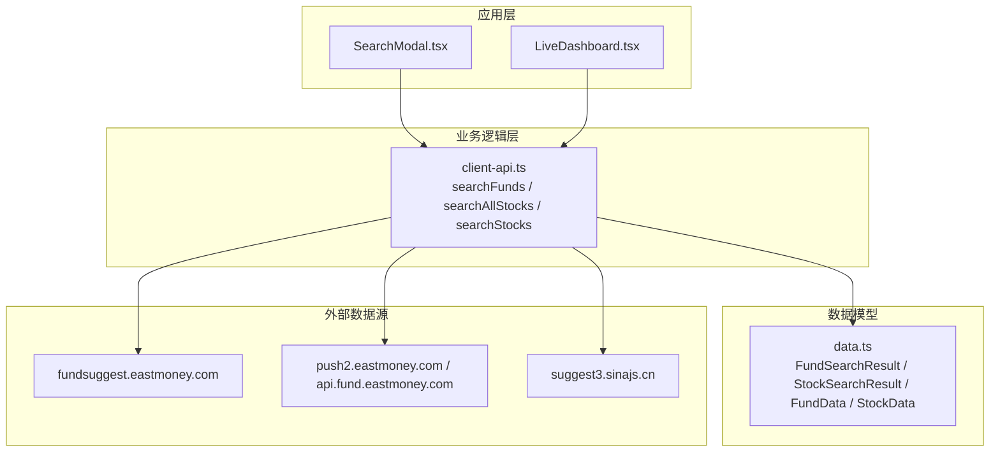
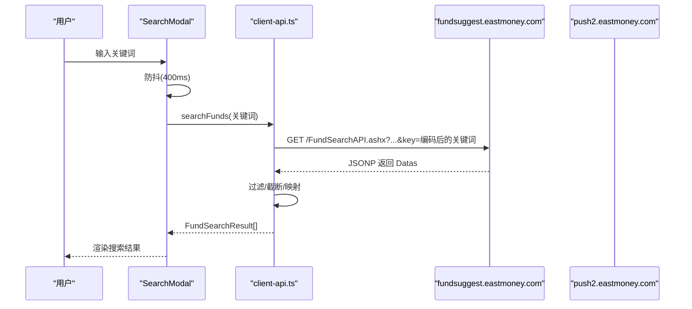
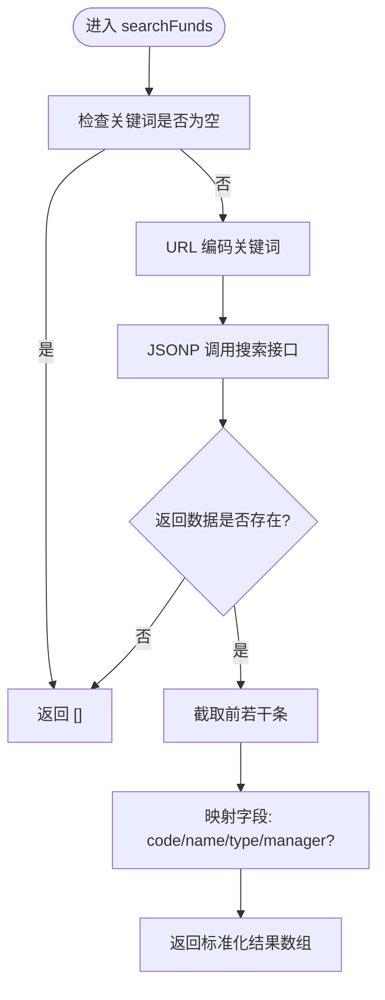
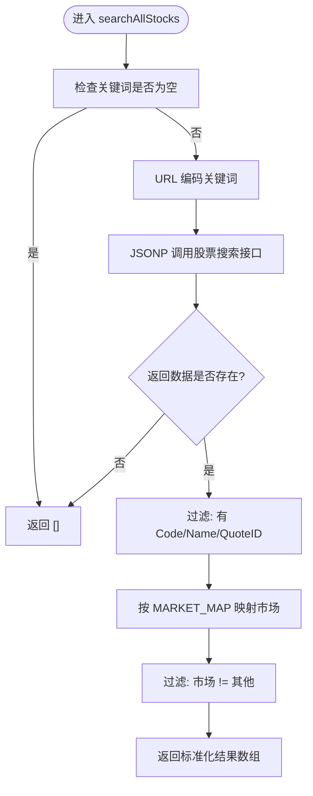
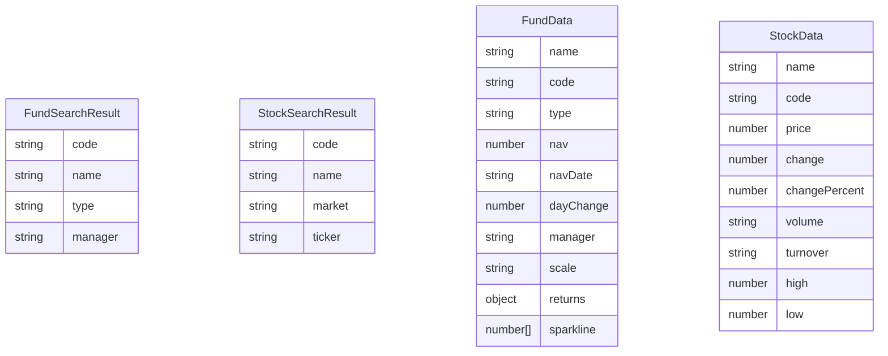
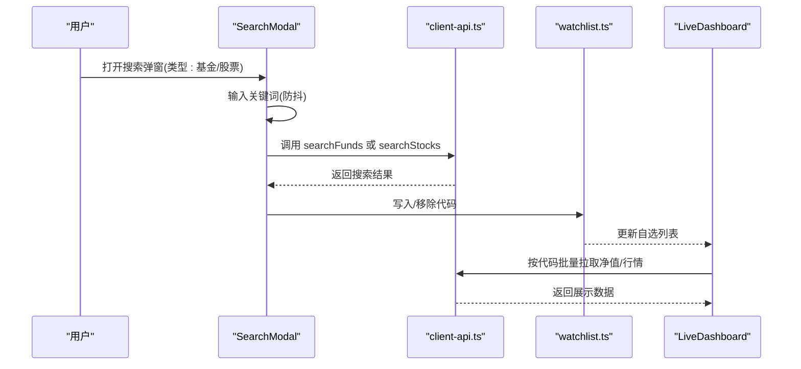
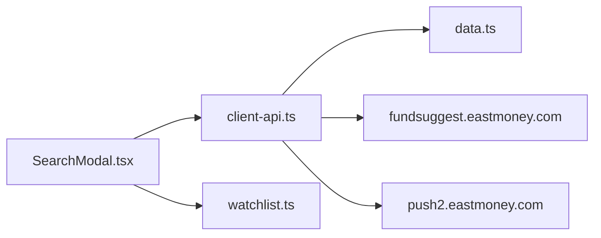

# 搜索API

<cite>
**本文引用的文件**
- [client-api.ts](file://lib/client-api.ts)
- [data.ts](file://lib/data.ts)
- [SearchModal.tsx](file://components/SearchModal.tsx)
- [LiveDashboard.tsx](file://components/LiveDashboard.tsx)
- [watchlist.ts](file://lib/watchlist.ts)
- [README.md](file://README.md)
</cite>

## 目录
1. [简介](#简介)
2. [项目结构](#项目结构)
3. [核心组件](#核心组件)
4. [架构总览](#架构总览)
5. [详细组件分析](#详细组件分析)
6. [依赖关系分析](#依赖关系分析)
7. [性能考量](#性能考量)
8. [故障排查指南](#故障排查指南)
9. [结论](#结论)
10. [附录](#附录)

## 简介
本文件聚焦于搜索API的实现与使用，重点解析以下内容：
- searchFunds 函数的关键词编码、API调用与结果过滤逻辑
- searchAllStocks 函数的复杂性，包括市场映射表（MARKET_MAP）的设计与多市场支持
- 搜索结果的数据结构，涵盖基金与股票搜索的标准化输出格式
- 错误处理与空值返回策略
- 使用示例与性能优化建议（缓存策略与请求频率控制）

## 项目结构
该项目采用前端全栈（Next.js）+ JSONP 的轻量级数据获取方案，搜索API位于客户端工具模块中，UI层通过弹窗组件触发搜索并展示结果。

图表来源
- [client-api.ts:348-417](file://lib/client-api.ts#L348-L417)
- [data.ts:12-41](file://lib/data.ts#L12-L41)
- [SearchModal.tsx:6-68](file://components/SearchModal.tsx#L6-L68)
- [LiveDashboard.tsx:281-296](file://components/LiveDashboard.tsx#L281-L296)

章节来源
- [README.md:132-161](file://README.md#L132-L161)
- [client-api.ts:348-417](file://lib/client-api.ts#L348-L417)
- [data.ts:12-41](file://lib/data.ts#L12-L41)

## 核心组件
- 搜索API模块：提供基金与股票搜索能力，基于 JSONP 调用第三方数据源。
- 搜索弹窗组件：负责用户交互、防抖触发与结果渲染。
- 数据模型：定义搜索结果与展示数据的标准结构。

章节来源
- [client-api.ts:348-417](file://lib/client-api.ts#L348-L417)
- [SearchModal.tsx:6-77](file://components/SearchModal.tsx#L6-L77)
- [data.ts:12-41](file://lib/data.ts#L12-L41)

## 架构总览
搜索流程由 UI 触发，经过防抖与编码处理，调用 JSONP 接口，再进行结果过滤与标准化，最终返回给 UI 展示。

图表来源
- [SearchModal.tsx:47-77](file://components/SearchModal.tsx#L47-L77)
- [client-api.ts:364-379](file://lib/client-api.ts#L364-L379)

## 详细组件分析

### searchFunds 关键词编码、API调用与结果过滤
- 关键词编码
  - 使用编码函数对关键词进行 URL 安全编码，确保特殊字符与空格被正确转义。
- API调用
  - 请求地址包含固定参数与时间戳，回调参数名固定为“callback”。
  - 使用 JSONP 工具函数发起请求，设置超时与失败清理逻辑。
- 结果过滤与标准化
  - 若返回数据为空，直接返回空数组。
  - 截取前若干条结果；字段映射优先使用完整名称，回退到简称或代码。
  - 基金类型提取自基础信息中的类型字段，并做首段拆分与去空白处理。
  - 经理信息可选存在时返回，否则省略。

图表来源
- [client-api.ts:364-379](file://lib/client-api.ts#L364-L379)

章节来源
- [client-api.ts:364-379](file://lib/client-api.ts#L364-L379)

### searchAllStocks 市场映射与多市场支持
- 关键词编码与请求
  - 对输入进行编码，请求股票搜索接口，限制返回数量。
- 市场映射表（MARKET_MAP）
  - 以市场编号为键，映射到中文市场名称，覆盖深A、沪A、港股、美股、日股、韩股等。
  - 未命中映射的记录会被过滤掉，仅保留明确市场的结果。
- 结果过滤与标准化
  - 仅保留具备代码、名称与报价ID的记录。
  - 输出包含名称、报价ID（用于后续API）、交易代码（展示用）与市场名称。

图表来源
- [client-api.ts:381-413](file://lib/client-api.ts#L381-L413)

章节来源
- [client-api.ts:381-413](file://lib/client-api.ts#L381-L413)

### 搜索结果数据结构
- 基金搜索结果
  - 字段：代码、名称、类型、可选经理。
  - 用途：用于 UI 列表展示与后续按代码拉取净值与历史。
- 股票搜索结果
  - 字段：报价ID（用于后续API）、名称、交易代码（展示用）、市场名称。
  - 用途：用于 UI 列表展示与后续按代码批量拉取行情。
- 展示数据结构
  - FundData：包含净值、日期、日涨跌、类型、经理、规模、历史收益与净值曲线等。
  - StockData：包含价格、涨跌、涨跌幅、成交量/手数、成交额等。

图表来源
- [client-api.ts:350-362](file://lib/client-api.ts#L350-L362)
- [data.ts:24-41](file://lib/data.ts#L24-L41)
- [data.ts:12-22](file://lib/data.ts#L12-L22)

章节来源
- [client-api.ts:350-362](file://lib/client-api.ts#L350-L362)
- [data.ts:24-41](file://lib/data.ts#L24-L41)
- [data.ts:12-22](file://lib/data.ts#L12-L22)

### 错误处理与空值返回策略
- JSONP 超时与失败
  - JSONP 工具函数内置超时与失败清理，避免内存泄漏与悬挂脚本。
- 搜索接口异常
  - 捕获异常并返回空数组，保证 UI 不崩溃。
- 数据缺失
  - 当返回数据为空或字段缺失时，统一返回空数组或默认值，确保下游处理安全。
- 控制台日志
  - 在股票搜索中打印调试日志，便于定位问题。

章节来源
- [client-api.ts:5-36](file://lib/client-api.ts#L5-L36)
- [client-api.ts:364-379](file://lib/client-api.ts#L364-L379)
- [client-api.ts:381-413](file://lib/client-api.ts#L381-L413)

### 使用示例与集成点
- 在 UI 中触发搜索
  - 弹窗组件根据类型选择调用基金或股票搜索，并在输入变化时进行防抖。
- 添加/移除到自选
  - 将搜索结果的代码写入自选列表，持久化存储在本地。
- 后续数据拉取
  - 基金：按代码批量拉取净值与历史收益。
  - 股票：按代码批量拉取实时行情。

图表来源
- [SearchModal.tsx:47-77](file://components/SearchModal.tsx#L47-L77)
- [watchlist.ts:28-88](file://lib/watchlist.ts#L28-L88)
- [LiveDashboard.tsx:281-296](file://components/LiveDashboard.tsx#L281-L296)
- [client-api.ts:462-495](file://lib/client-api.ts#L462-L495)
- [client-api.ts:421-458](file://lib/client-api.ts#L421-L458)

章节来源
- [SearchModal.tsx:6-77](file://components/SearchModal.tsx#L6-L77)
- [watchlist.ts:28-88](file://lib/watchlist.ts#L28-L88)
- [LiveDashboard.tsx:281-296](file://components/LiveDashboard.tsx#L281-L296)
- [client-api.ts:462-495](file://lib/client-api.ts#L462-L495)
- [client-api.ts:421-458](file://lib/client-api.ts#L421-L458)

## 依赖关系分析
- 模块耦合
  - SearchModal 依赖 client-api 的搜索函数与 watchlist 的状态管理。
  - client-api 依赖 JSONP 工具与外部数据源。
- 数据流
  - UI -> client-api -> 外部数据源 -> client-api -> UI
- 可能的循环依赖
  - 未发现循环依赖，各模块职责清晰。

图表来源
- [SearchModal.tsx:6](file://components/SearchModal.tsx#L6)
- [client-api.ts:348-417](file://lib/client-api.ts#L348-L417)
- [data.ts:12-41](file://lib/data.ts#L12-L41)

章节来源
- [SearchModal.tsx:6-77](file://components/SearchModal.tsx#L6-L77)
- [client-api.ts:348-417](file://lib/client-api.ts#L348-L417)
- [data.ts:12-41](file://lib/data.ts#L12-L41)

## 性能考量
- 防抖策略
  - UI 层对输入进行 400ms 防抖，减少频繁请求。
- 请求频率控制
  - 搜索接口本身限制返回数量，避免一次性返回过多数据。
- 缓存策略
  - 建议在 UI 层对最近一次搜索结果进行短期缓存（如 1 分钟），并在用户快速切换关键词时复用。
- 并发与批处理
  - 基金与股票的后续数据拉取采用批量方式，减少请求数量。
- 超时与降级
  - JSONP 超时与失败均返回空数组，保证 UI 响应性。

章节来源
- [SearchModal.tsx:47-77](file://components/SearchModal.tsx#L47-L77)
- [client-api.ts:5-36](file://lib/client-api.ts#L5-L36)
- [client-api.ts:421-458](file://lib/client-api.ts#L421-L458)
- [client-api.ts:462-495](file://lib/client-api.ts#L462-L495)

## 故障排查指南
- 搜索无结果
  - 检查关键词是否为空或仅含空白字符。
  - 确认网络可访问外部数据源。
  - 查看控制台是否有 JSONP 超时或失败错误。
- 市场映射异常
  - 检查 MARKET_MAP 是否覆盖目标市场编号。
  - 确认返回数据中的市场编号与映射一致。
- 结果字段缺失
  - 确保返回数据包含必需字段（如 Code/Name/QuoteID）。
  - 检查字段映射逻辑是否正确。
- 性能问题
  - 调整防抖间隔或增加本地缓存。
  - 合理控制批量拉取的数量与频率。

章节来源
- [client-api.ts:364-379](file://lib/client-api.ts#L364-L379)
- [client-api.ts:381-413](file://lib/client-api.ts#L381-L413)
- [client-api.ts:5-36](file://lib/client-api.ts#L5-L36)

## 结论
该搜索API通过简洁的 JSONP 调用与稳健的错误处理，实现了基金与股票的快速检索与展示。其数据结构标准化、市场映射清晰、UI 集成自然，适合在前端全栈场景下稳定运行。建议结合本地缓存与合理的请求频率控制，进一步提升用户体验与系统性能。

## 附录
- 数据来源与免责声明见项目说明文档。
- 如需扩展更多市场或搜索维度，可在 MARKET_MAP 与搜索接口参数中进行扩展。

章节来源
- [README.md:165-178](file://README.md#L165-L178)