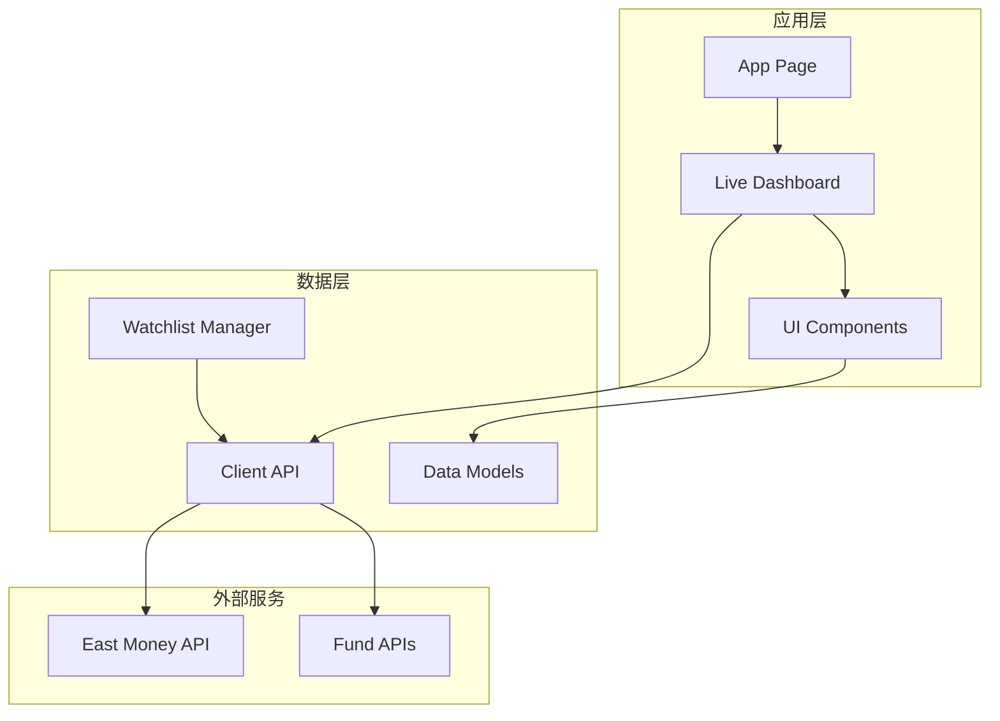
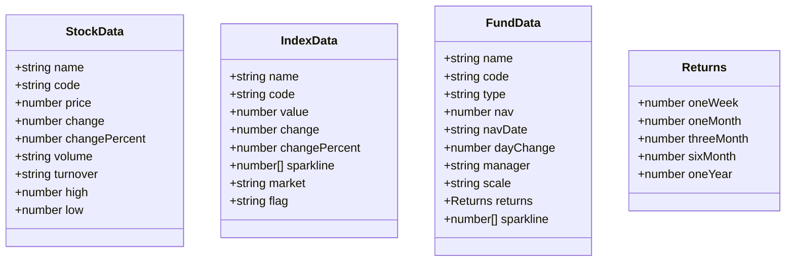
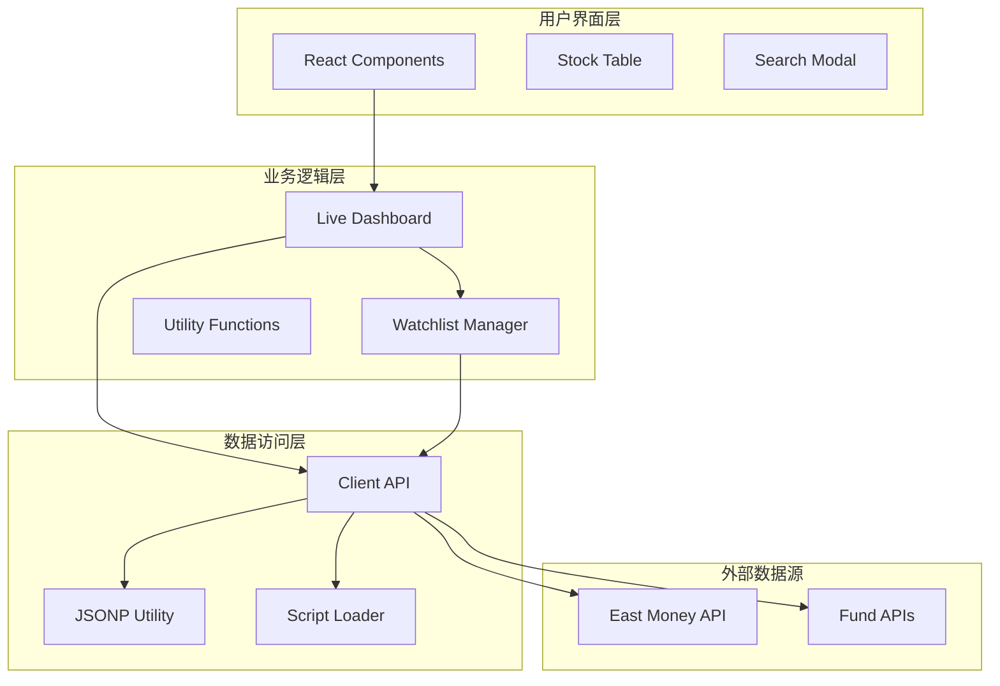
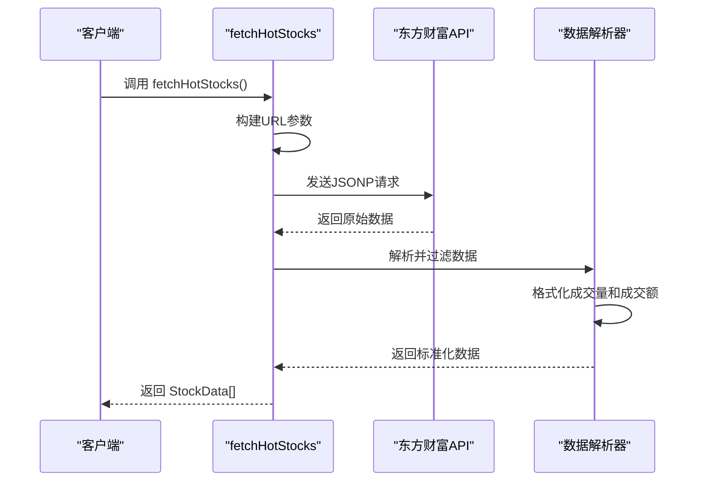
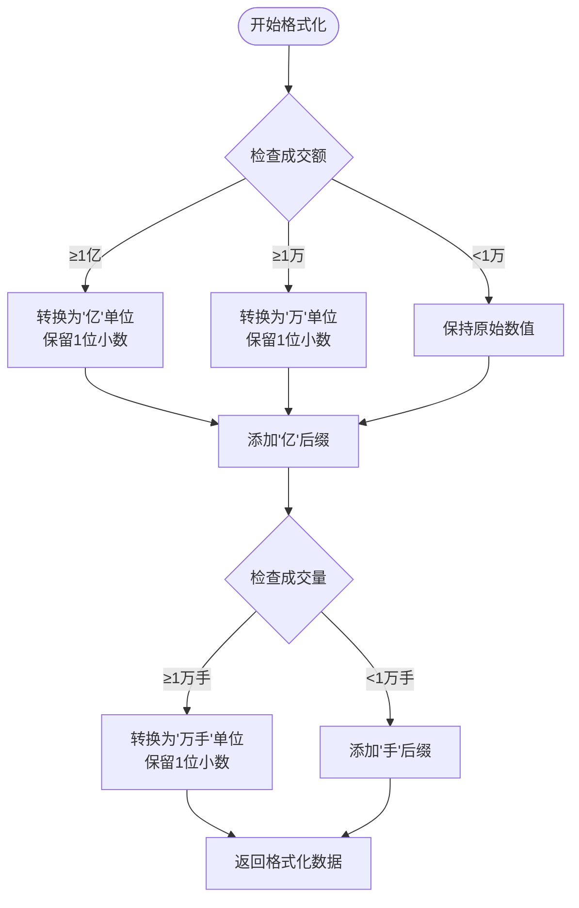
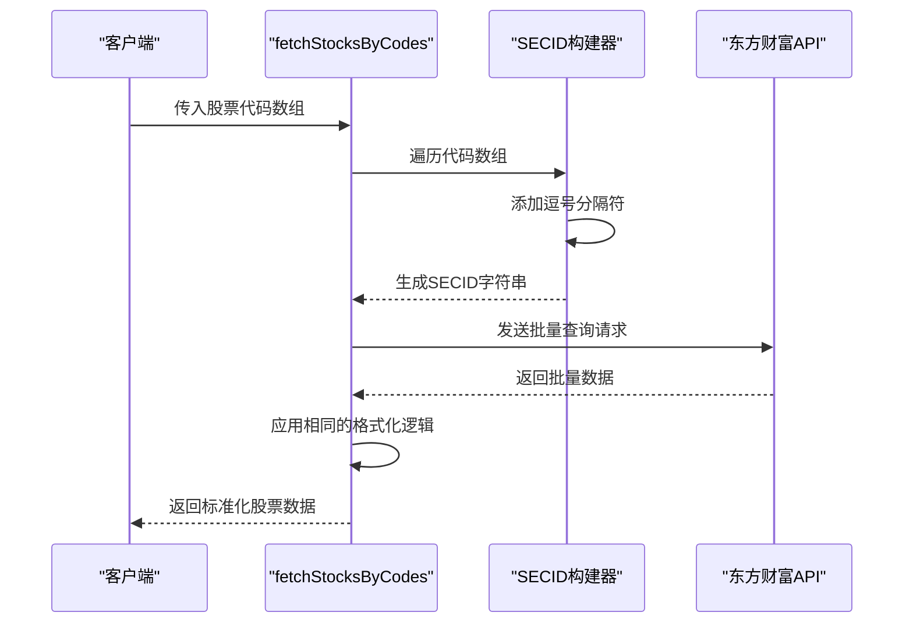
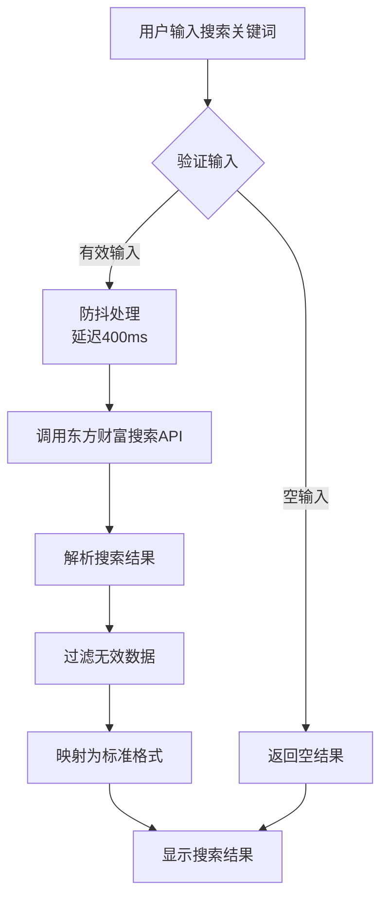
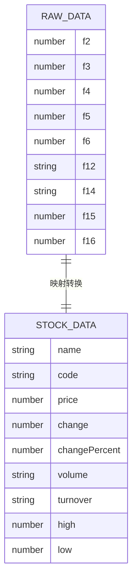
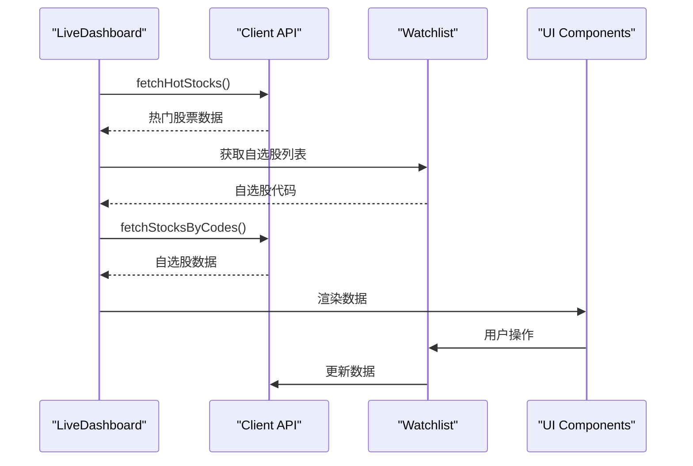
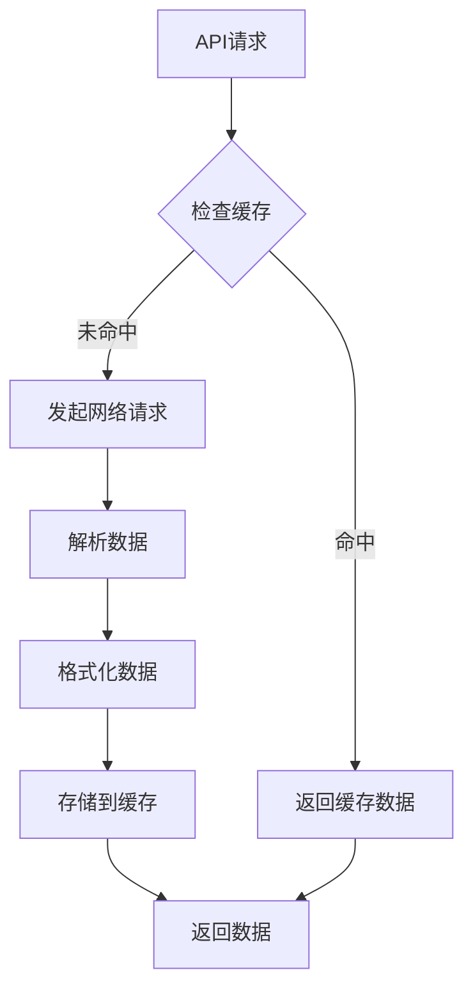

# 股票数据API

<cite>
**本文档引用的文件**
- [client-api.ts](file://lib/client-api.ts)
- [data.ts](file://lib/data.ts)
- [StockTable.tsx](file://components/StockTable.tsx)
- [LiveDashboard.tsx](file://components/LiveDashboard.tsx)
- [SearchModal.tsx](file://components/SearchModal.tsx)
- [watchlist.ts](file://lib/watchlist.ts)
</cite>

## 目录
1. [简介](#简介)
2. [项目结构](#项目结构)
3. [核心组件](#核心组件)
4. [架构概览](#架构概览)
5. [详细组件分析](#详细组件分析)
6. [依赖关系分析](#依赖关系分析)
7. [性能考虑](#性能考虑)
8. [故障排除指南](#故障排除指南)
9. [结论](#结论)

## 简介

本项目是一个基于Next.js的金融数据展示应用，专注于提供实时的股票、基金和指数数据。系统通过东方财富网的API接口获取数据，并提供了完整的股票数据API，包括热门股票抓取、批量股票查询、搜索功能等核心能力。

该应用采用现代化的前端技术栈，使用TypeScript进行类型安全编程，配合Tailwind CSS实现响应式设计，为用户提供直观的金融数据可视化界面。

## 项目结构

项目采用模块化的组织方式，主要分为以下几个核心部分：



**图表来源**
- [client-api.ts:1-596](file://lib/client-api.ts#L1-L596)
- [data.ts:1-255](file://lib/data.ts#L1-L255)

**章节来源**
- [client-api.ts:1-596](file://lib/client-api.ts#L1-L596)
- [data.ts:1-255](file://lib/data.ts#L1-L255)

## 核心组件

### 数据模型定义

系统定义了完整的数据结构来标准化各种金融产品数据：



**图表来源**
- [data.ts:12-41](file://lib/data.ts#L12-L41)

### API接口概览

系统提供了以下核心API接口：

| 接口名称 | 功能描述 | 请求参数 | 返回值 |
|---------|----------|----------|--------|
| `fetchHotStocks` | 获取热门股票数据 | 无 | `Promise<StockData[]>` |
| `fetchStocksByCodes` | 批量查询股票数据 | `string[]` codes | `Promise<StockData[]>` |
| `searchStocks` | 搜索股票 | `string` keyword | `Promise<StockSearchResult[]>` |
| `searchFunds` | 搜索基金 | `string` keyword | `Promise<FundSearchResult[]>` |
| `fetchIndices` | 获取全球指数数据 | 无 | `Promise<IndexData[]>` |
| `fetchFundsByCodes` | 批量查询基金数据 | `FundItem[]` items | `Promise<FundData[]>` |

**章节来源**
- [client-api.ts:203-240](file://lib/client-api.ts#L203-L240)
- [client-api.ts:421-458](file://lib/client-api.ts#L421-L458)
- [client-api.ts:381-417](file://lib/client-api.ts#L381-L417)
- [client-api.ts:364-379](file://lib/client-api.ts#L364-L379)

## 架构概览

系统采用分层架构设计，实现了清晰的关注点分离：



**图表来源**
- [LiveDashboard.tsx:39-301](file://components/LiveDashboard.tsx#L39-L301)
- [client-api.ts:5-84](file://lib/client-api.ts#L5-L84)

## 详细组件分析

### fetchHotStocks 函数实现

`fetchHotStocks` 是系统的核心功能之一，负责获取当前市场最活跃的股票数据。

#### API参数配置

函数使用了东方财富网的特定参数配置：



**图表来源**
- [client-api.ts:203-240](file://lib/client-api.ts#L203-L240)

#### 关键参数说明

| 参数 | 值 | 说明 |
|------|-----|------|
| `pn` | 1 | 页码，固定为第1页 |
| `pz` | 10 | 每页记录数，限制为10条热门股票 |
| `po` | 1 | 排序方式，按涨跌幅排序 |
| `np` | 1 | 排序方向，降序排列 |
| `fltt` | 2 | 过滤条件，过滤无效数据 |
| `invt` | 2 | 数据类型，股票数据 |
| `fid` | f6 | 排序字段，按涨跌幅排序 |
| `fs` | m:0+t:6,m:0+t:80,m:1+t:2,m:1+t:23 | 过滤条件，包含A股和港股数据 |

#### 数据筛选逻辑

函数实现了严格的数据验证和筛选机制：

1. **数据完整性检查**：验证返回状态码和数据结构
2. **数值有效性验证**：确保价格字段为有效数字
3. **正数过滤**：只保留价格大于0的有效股票
4. **数据映射**：将原始字段映射到标准化的StockData结构

#### 数据格式化逻辑

成交量和成交额采用了智能的单位转换：



**图表来源**
- [client-api.ts:213-235](file://lib/client-api.ts#L213-L235)

**章节来源**
- [client-api.ts:203-240](file://lib/client-api.ts#L203-L240)

### fetchStocksByCodes 函数实现

`fetchStocksByCodes` 提供了批量查询股票数据的能力，支持同时查询多个股票的实时行情。

#### SECID 构建机制

函数采用简洁高效的SECID构建策略：



**图表来源**
- [client-api.ts:421-458](file://lib/client-api.ts#L421-L458)

#### 并发处理策略

系统采用了多种并发处理策略来优化性能：

1. **Promise.allSettled 并行执行**：同时发起多个API请求
2. **独立错误处理**：每个请求都有独立的错误捕获机制
3. **数据合并策略**：统一处理成功和失败的结果

#### 批量查询优势

- **网络优化**：减少HTTP请求次数，提高整体性能
- **一致性保证**：所有股票数据在同一时间点获取
- **成本效益**：相比单个查询，批量查询更经济高效

**章节来源**
- [client-api.ts:421-458](file://lib/client-api.ts#L421-L458)
- [LiveDashboard.tsx:56-95](file://components/LiveDashboard.tsx#L56-L95)

### 股票搜索功能实现

系统提供了完整的股票搜索功能，支持模糊匹配和智能过滤。

#### 搜索流程设计



**图表来源**
- [SearchModal.tsx:47-77](file://components/SearchModal.tsx#L47-L77)

#### 搜索结果映射

搜索功能返回的数据结构经过标准化处理：

| 字段 | 来源 | 处理方式 |
|------|------|----------|
| `code` | QuoteID | 直接使用，用于API调用 |
| `name` | Name | 直接使用，显示名称 |
| `ticker` | Code | 人类可读的股票代码 |
| `market` | MktNum | 映射为市场标识符 |

#### 防抖机制

系统实现了400ms的防抖机制，避免频繁的API调用：

- **用户体验**：减少不必要的网络请求
- **性能优化**：降低服务器负载
- **成本控制**：减少API调用次数

**章节来源**
- [client-api.ts:381-417](file://lib/client-api.ts#L381-L417)
- [SearchModal.tsx:47-77](file://components/SearchModal.tsx#L47-L77)

### 数据标准化与格式化

#### 股票数据标准化结构

系统将来自不同API的数据统一转换为标准化的StockData结构：



**图表来源**
- [client-api.ts:212-235](file://lib/client-api.ts#L212-L235)

#### 单位转换算法

系统实现了智能的单位转换算法：

| 数值范围 | 转换规则 | 示例 |
|----------|----------|------|
| ≥ 1亿 | 除以1亿，保留1位小数 + "亿" | 150000000 → "150.0亿" |
| ≥ 1万 | 除以1万，保留1位小数 + "万" | 50000 → "5.0万" |
| < 1万 | 保持原值 + "手" | 8000 → "8000手" |

**章节来源**
- [client-api.ts:213-235](file://lib/client-api.ts#L213-L235)
- [StockTable.tsx:17-24](file://components/StockTable.tsx#L17-L24)

## 依赖关系分析

系统采用了松耦合的设计模式，各组件之间的依赖关系清晰明确：

```mermaid
graph TB
subgraph "核心依赖"
React[React 18+]
NextJS[Next.js App Router]
TailwindCSS[Tailwind CSS]
Lucide[Lucide Icons]
end
subgraph "工具库"
clsx[clsx]
tailwind-merge[tailwind-merge]
end
subgraph "类型定义"
TypeScript[TypeScript]
ReactTypes[@types/react]
end
LiveDashboard --> React
LiveDashboard --> NextJS
StockTable --> Lucide
SearchModal --> Lucide
LiveDashboard --> TailwindCSS
StockTable --> TailwindCSS
SearchModal --> TailwindCSS
Utils --> clsx
Utils --> tailwind-merge
```

**图表来源**
- [package.json](file://package.json)

### 组件间交互关系



**图表来源**
- [LiveDashboard.tsx:56-95](file://components/LiveDashboard.tsx#L56-L95)
- [watchlist.ts:28-88](file://lib/watchlist.ts#L28-L88)

**章节来源**
- [LiveDashboard.tsx:39-301](file://components/LiveDashboard.tsx#L39-L301)
- [watchlist.ts:1-89](file://lib/watchlist.ts#L1-L89)

## 性能考虑

### 缓存策略

系统实现了多层次的缓存机制：

1. **浏览器缓存**：利用浏览器的HTTP缓存机制
2. **本地存储**：使用localStorage缓存用户偏好设置
3. **内存缓存**：在组件内部缓存最近的数据

### 网络优化



### 错误处理机制

系统实现了完善的错误处理策略：

- **网络超时处理**：JSONP请求设置了10秒超时
- **数据验证**：严格的输入验证和输出校验
- **降级策略**：API失败时使用模拟数据

## 故障排除指南

### 常见问题及解决方案

| 问题类型 | 症状 | 可能原因 | 解决方案 |
|----------|------|----------|----------|
| 数据加载失败 | 页面空白或显示错误 | API接口不可用 | 检查网络连接，重试请求 |
| 数据格式异常 | 数字显示错误 | API返回格式变化 | 更新数据映射逻辑 |
| 搜索无结果 | 搜索框无响应 | 防抖机制导致延迟 | 确认输入字符长度 |
| 性能问题 | 页面加载缓慢 | 请求过多 | 优化并发策略 |

### 调试技巧

1. **开发者工具**：使用浏览器开发者工具监控网络请求
2. **控制台日志**：启用详细的日志输出
3. **数据验证**：检查API返回数据的完整性和正确性

**章节来源**
- [client-api.ts:5-36](file://lib/client-api.ts#L5-L36)
- [client-api.ts:381-417](file://lib/client-api.ts#L381-L417)

## 结论

本项目成功实现了完整的股票数据API系统，具有以下特点：

### 技术优势

1. **模块化设计**：清晰的组件分离和职责划分
2. **类型安全**：完整的TypeScript类型定义
3. **性能优化**：智能的缓存和并发处理策略
4. **用户体验**：响应式的界面设计和流畅的交互体验

### 功能特性

- **实时数据**：通过JSONP技术实现实时数据获取
- **批量查询**：支持多股票同时查询，提高效率
- **智能搜索**：提供模糊匹配和防抖优化的搜索功能
- **数据标准化**：统一的数据格式和单位转换

### 扩展性

系统具有良好的扩展性，可以轻松添加新的金融产品类型和API接口。模块化的架构设计使得功能增强和维护变得更加简单。

该系统为金融数据展示应用提供了一个优秀的参考实现，展示了现代前端开发的最佳实践和技术整合能力。