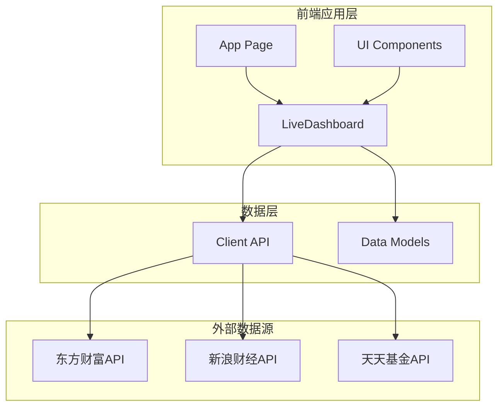
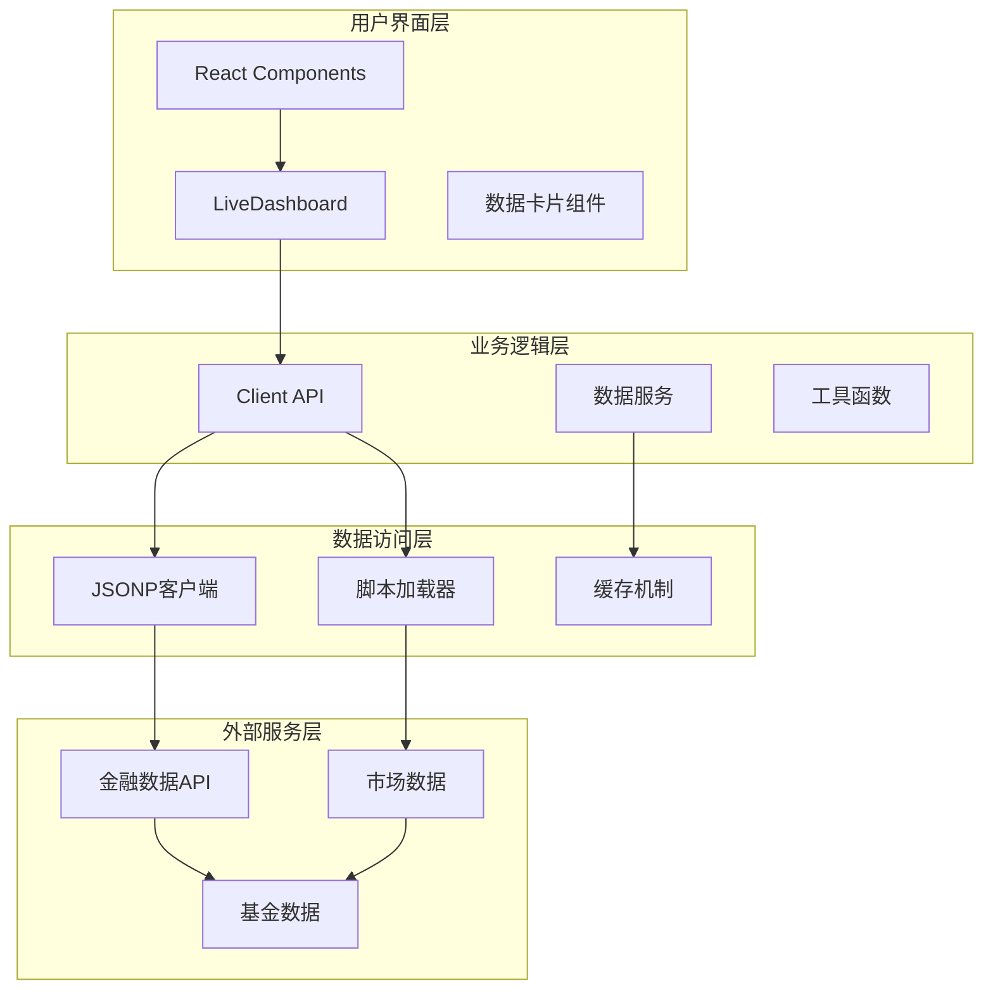
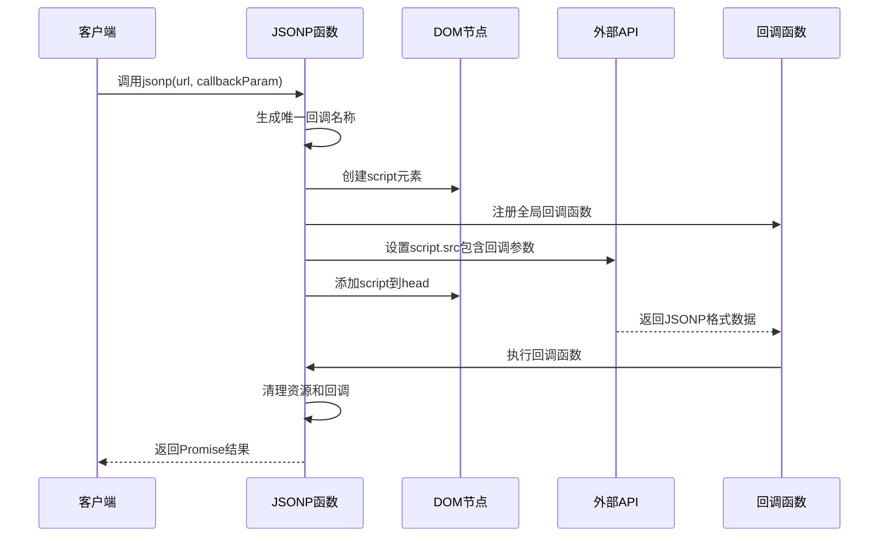
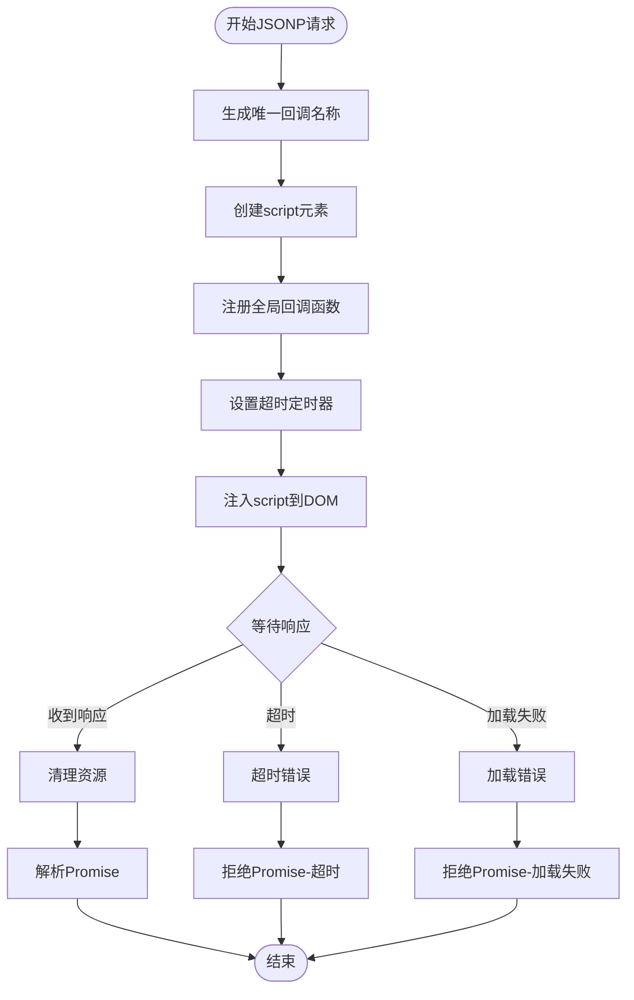
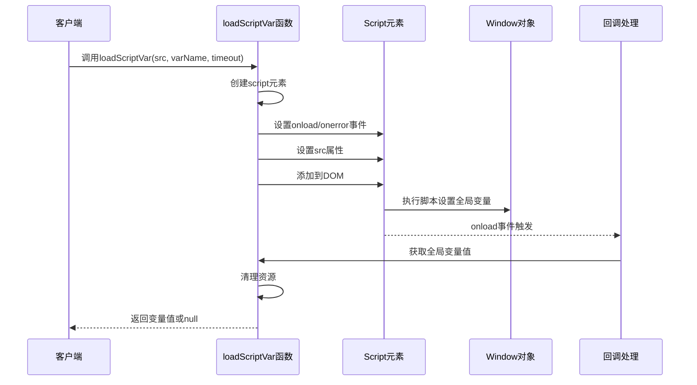
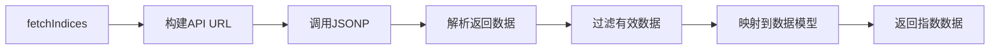
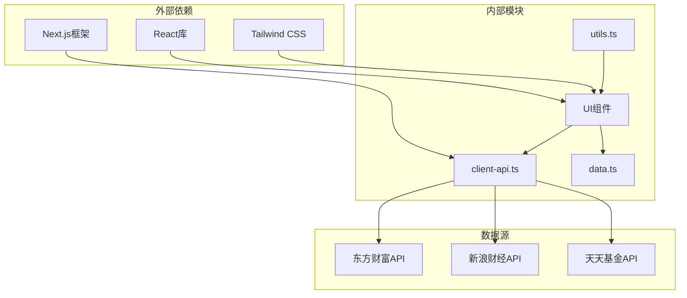

# JSONP跨域解决方案

<cite>
**本文档引用的文件**
- [client-api.ts](file://lib/client-api.ts)
- [data.ts](file://lib/data.ts)
- [LiveDashboard.tsx](file://components/LiveDashboard.tsx)
- [README.md](file://README.md)
</cite>

## 目录
1. [简介](#简介)
2. [项目结构](#项目结构)
3. [核心组件](#核心组件)
4. [架构概览](#架构概览)
5. [详细组件分析](#详细组件分析)
6. [依赖关系分析](#依赖关系分析)
7. [性能考量](#性能考量)
8. [故障排除指南](#故障排除指南)
9. [结论](#结论)

## 简介

本项目是一个基于Next.js的金融数据面板应用，专门用于实时跟踪全球指数、热门股票和基金净值。该应用采用JSONP（JSON with Padding）技术来解决跨域请求问题，实现了对多个金融数据API的实时访问。

JSONP作为一种经典的跨域解决方案，在现代Web开发中仍然具有重要价值，特别是在需要访问第三方金融数据服务时。该项目展示了如何正确实现和使用JSONP技术来绕过浏览器的同源策略限制。

## 项目结构

该项目采用标准的Next.js项目结构，重点关注金融数据获取和展示功能：



**图表来源**
- [client-api.ts:1-596](file://lib/client-api.ts#L1-L596)
- [LiveDashboard.tsx:1-375](file://components/LiveDashboard.tsx#L1-L375)

**章节来源**
- [README.md:132-161](file://README.md#L132-L161)

## 核心组件

### JSONP工具函数

项目的核心是`jsonp`函数，它提供了完整的JSONP实现，包括动态脚本注入、回调函数管理和超时处理机制。

### 加载脚本变量函数

`loadScriptVar`函数专门用于加载外部脚本并获取全局变量值，为某些特定的数据获取场景提供支持。

### 数据模型定义

项目定义了完整的数据接口，包括指数数据、股票数据、基金数据等，确保类型安全和代码可维护性。

**章节来源**
- [client-api.ts:5-84](file://lib/client-api.ts#L5-L84)
- [data.ts:1-255](file://lib/data.ts#L1-L255)

## 架构概览

项目采用分层架构设计，清晰分离了数据获取、业务逻辑和UI展示：



**图表来源**
- [LiveDashboard.tsx:39-95](file://components/LiveDashboard.tsx#L39-L95)
- [client-api.ts:105-136](file://lib/client-api.ts#L105-L136)

## 详细组件分析

### JSONP实现详解

#### 动态脚本注入机制

JSONP的核心在于动态创建`<script>`元素并将其插入DOM中。这种方法利用了`<script>`标签不受同源策略限制的特性。



**图表来源**
- [client-api.ts:5-36](file://lib/client-api.ts#L5-L36)

#### 唯一回调名称生成

为了确保每个JSONP请求都有唯一的回调标识符，系统使用时间戳和随机字符串组合的方式生成回调名称：

- 时间戳部分：`Date.now()` 提供精确的时间信息
- 随机字符串：`Math.random().toString(36).slice(2, 7)` 生成5位随机字符
- 前缀标识：`_jp_` 确保名称的可识别性

这种设计避免了全局命名冲突，确保多个并发请求不会相互干扰。

#### 超时处理机制

系统实现了双重超时保护机制：

1. **Promise超时**：默认10秒超时，防止长时间挂起
2. **脚本加载超时**：同样设置10秒超时，确保资源及时释放



**图表来源**
- [client-api.ts:29-32](file://lib/client-api.ts#L29-L32)

#### 内存清理机制

完整的资源清理流程确保不会产生内存泄漏：

1. **清除定时器**：使用`clearTimeout`防止内存泄漏
2. **删除全局回调**：从window对象中移除回调函数
3. **移除DOM节点**：从DOM树中移除script元素
4. **防止重复执行**：通过标志位确保清理操作只执行一次

**章节来源**
- [client-api.ts:11-15](file://lib/client-api.ts#L11-L15)
- [client-api.ts:24-27](file://lib/client-api.ts#L24-L27)

### loadScriptVar函数实现

`loadScriptVar`函数提供了更精细的脚本加载控制，特别适用于需要获取特定全局变量值的场景：



**图表来源**
- [client-api.ts:52-84](file://lib/client-api.ts#L52-L84)

**章节来源**
- [client-api.ts:51-84](file://lib/client-api.ts#L51-L84)

### 数据获取服务

项目实现了多个专门的数据获取服务，每个都针对特定的金融数据类型：

#### 指数数据获取



**图表来源**
- [client-api.ts:154-199](file://lib/client-api.ts#L154-L199)

#### 基金数据获取

基金数据获取包含了多个子功能：
- 基金净值查询
- 基金历史表现
- 基金搜索功能

**章节来源**
- [client-api.ts:253-290](file://lib/client-api.ts#L253-L290)
- [client-api.ts:292-346](file://lib/client-api.ts#L292-L346)
- [client-api.ts:364-379](file://lib/client-api.ts#L364-L379)

## 依赖关系分析

项目中的依赖关系体现了清晰的分层架构：



**图表来源**
- [client-api.ts:1-596](file://lib/client-api.ts#L1-L596)
- [LiveDashboard.tsx:39-95](file://components/LiveDashboard.tsx#L39-L95)

**章节来源**
- [README.md:67-76](file://README.md#L67-L76)

## 性能考量

### 并发请求优化

项目使用`Promise.allSettled`来并行处理多个数据请求，提高了整体性能：

```typescript
const [indicesRes, hotStocksRes, watchlistStocksRes, fundsRes, rankingRes] =
  await Promise.allSettled([
    fetchIndices(),
    fetchHotStocks(),
    stockList.length > 0
      ? fetchStocksByCodes(stockList.map((s) => s.code))
      : Promise.resolve([] as StockData[]),
    fundList.length > 0
      ? fetchFundsByCodes(fundList)
      : Promise.resolve([] as FundData[]),
    fetchFundRanking(),
  ])
```

### 缓存策略

虽然项目没有实现显式的缓存机制，但通过合理的超时设置和错误处理，确保了系统的稳定性和性能。

### 资源管理

完善的资源清理机制确保了长时间运行的稳定性，避免了内存泄漏问题。

## 故障排除指南

### 常见问题及解决方案

#### JSONP请求失败

**症状**：网络请求显示失败，控制台出现"JSONP failed"错误

**可能原因**：
1. 外部API不可用或响应格式不符合预期
2. 网络连接问题
3. 跨域策略变化

**解决方案**：
1. 检查API的可用性和响应格式
2. 验证网络连接状态
3. 查看浏览器开发者工具的网络面板

#### JSONP超时

**症状**：请求在10秒后被拒绝，出现"JSONP timeout"错误

**可能原因**：
1. API响应时间过长
2. 网络延迟过高
3. 服务器负载过重

**解决方案**：
1. 检查网络连接质量
2. 考虑增加超时时间
3. 实现重试机制

#### 内存泄漏

**症状**：应用运行时间越长，内存占用越高

**可能原因**：
1. 回调函数未正确清理
2. DOM节点未移除
3. 定时器未清除

**解决方案**：
1. 确保所有清理函数都被调用
2. 检查清理逻辑的执行顺序
3. 使用浏览器性能分析工具检测泄漏点

### 调试技巧

#### 开发者工具使用

1. **Network面板**：监控JSONP请求的状态和响应时间
2. **Console面板**：查看错误信息和调试输出
3. **Sources面板**：设置断点调试异步代码执行流程

#### 日志记录

项目在关键位置添加了错误处理和日志记录：

```typescript
console.error('fetchIndices error:', err)
console.error('fetchHotStocks error:', err)
console.error('fetchFundRanking fetch failed:', e)
```

这些日志有助于快速定位问题所在。

#### 性能监控

建议在生产环境中添加以下监控指标：
- 请求成功率
- 平均响应时间
- 错误率统计
- 内存使用情况

**章节来源**
- [client-api.ts:195-198](file://lib/client-api.ts#L195-L198)
- [client-api.ts:236-239](file://lib/client-api.ts#L236-L239)
- [client-api.ts:557-559](file://lib/client-api.ts#L557-L559)

## 结论

本项目展示了JSONP技术在现代Web开发中的实际应用价值。通过精心设计的实现方案，成功解决了跨域请求的技术难题，为金融数据的实时获取提供了可靠的解决方案。

### 主要优势

1. **技术成熟**：JSONP作为经典的跨域解决方案，技术相对成熟稳定
2. **兼容性强**：支持各种浏览器环境，包括较老版本的IE
3. **实现简洁**：代码结构清晰，易于理解和维护
4. **性能可靠**：通过合理的超时设置和资源管理，确保了系统的稳定性

### 最佳实践总结

1. **严格的错误处理**：始终包含完整的错误处理和超时机制
2. **资源清理**：确保所有临时资源都能得到及时清理
3. **类型安全**：使用TypeScript确保数据类型的正确性
4. **性能优化**：合理使用并发请求和适当的缓存策略
5. **监控告警**：建立完善的监控体系，及时发现和解决问题

### 发展建议

随着Web技术的发展，建议考虑以下改进方向：
1. **渐进式迁移**：在可能的情况下逐步迁移到现代的跨域解决方案
2. **安全增强**：加强输入验证和内容安全策略
3. **性能优化**：进一步优化请求频率和数据处理效率
4. **用户体验**：改善加载状态提示和错误反馈机制

通过持续的优化和完善，这个JSONP跨域解决方案将继续为用户提供稳定可靠的金融数据服务。