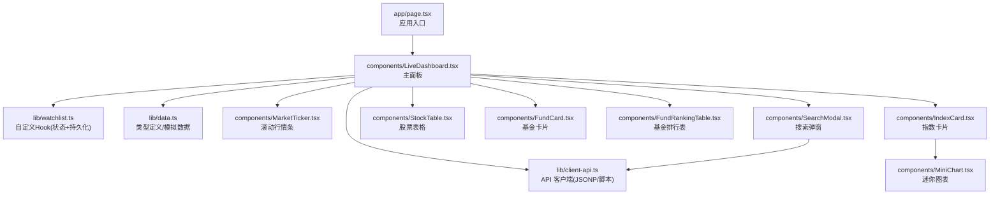
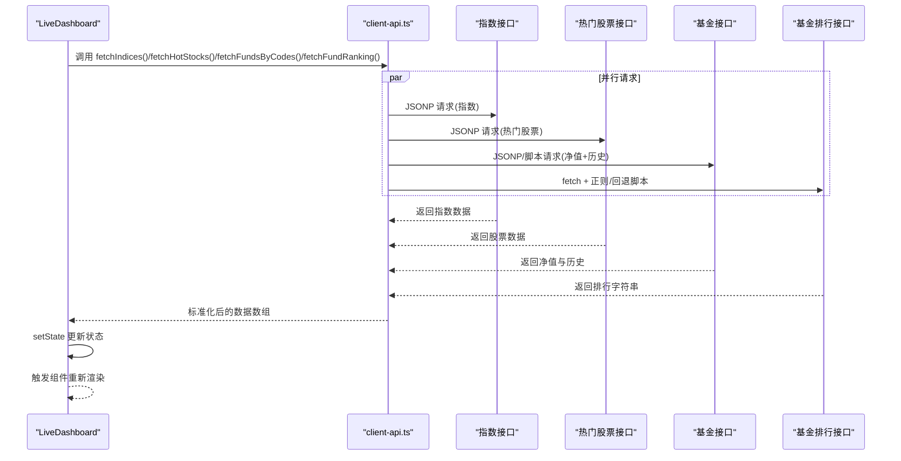
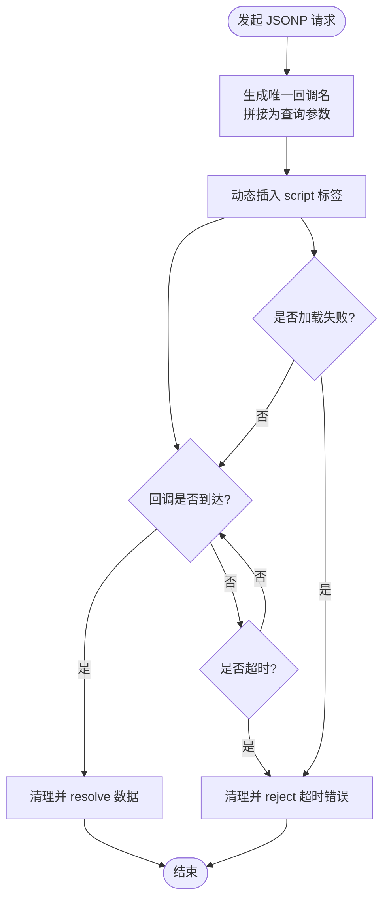
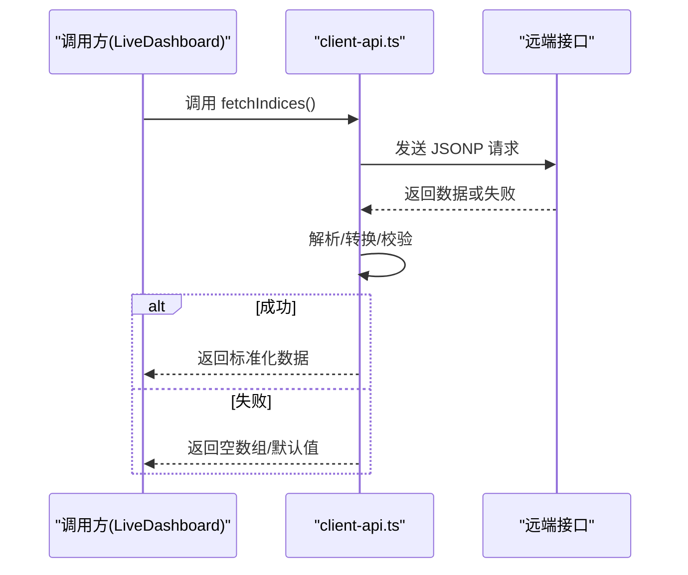
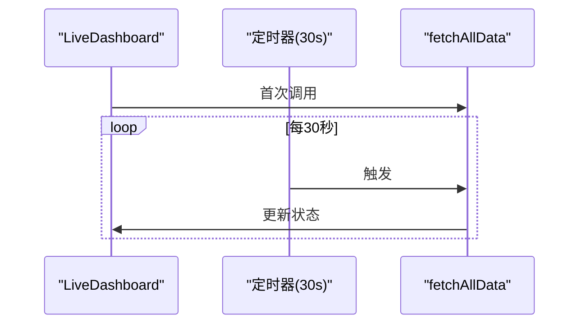
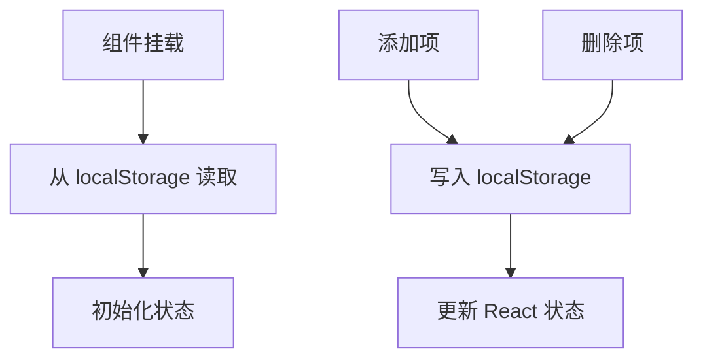
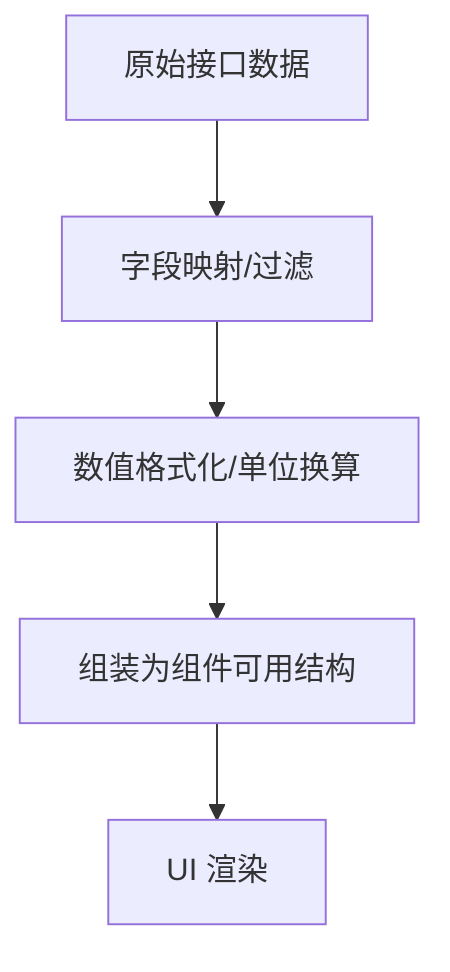
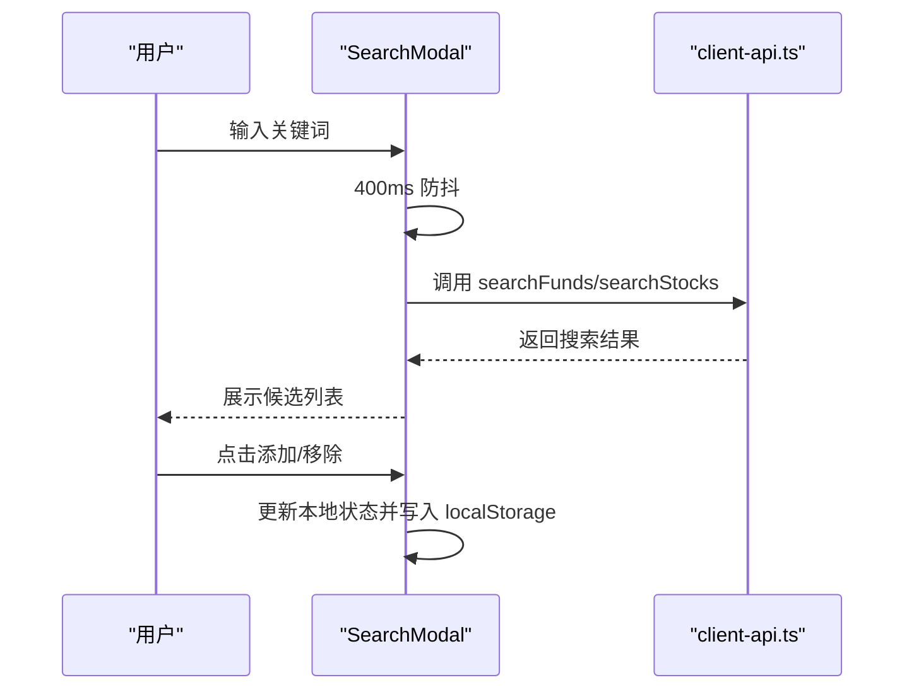
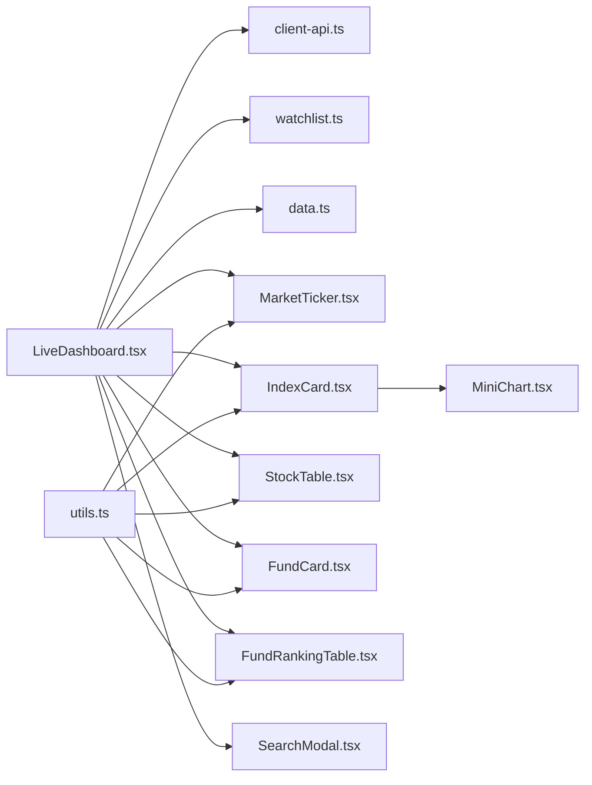

# 数据流架构

<cite>
**本文引用的文件**
- [app/page.tsx](file://app/page.tsx)
- [lib/client-api.ts](file://lib/client-api.ts)
- [lib/data.ts](file://lib/data.ts)
- [lib/watchlist.ts](file://lib/watchlist.ts)
- [components/LiveDashboard.tsx](file://components/LiveDashboard.tsx)
- [components/MarketTicker.tsx](file://components/MarketTicker.tsx)
- [components/FundRankingTable.tsx](file://components/FundRankingTable.tsx)
- [components/SearchModal.tsx](file://components/SearchModal.tsx)
- [components/FundCard.tsx](file://components/FundCard.tsx)
- [components/StockTable.tsx](file://components/StockTable.tsx)
- [components/IndexCard.tsx](file://components/IndexCard.tsx)
- [components/MiniChart.tsx](file://components/MiniChart.tsx)
- [lib/utils.ts](file://lib/utils.ts)
- [package.json](file://package.json)
- [README.md](file://README.md)
</cite>

## 目录
1. [简介](#简介)
2. [项目结构](#项目结构)
3. [核心组件](#核心组件)
4. [架构总览](#架构总览)
5. [详细组件分析](#详细组件分析)
6. [依赖关系分析](#依赖关系分析)
7. [性能考量](#性能考量)
8. [故障排查指南](#故障排查指南)
9. [结论](#结论)
10. [附录](#附录)

## 简介
本项目是一个基于 Next.js 的前端金融数据面板，展示全球指数、热门股票与自选基金的实时行情与净值变化。数据流从浏览器发起跨域请求（JSONP）到组件渲染的完整链路均在前端完成，配合 React 状态与 localStorage 实现“无后端”的纯前端数据驱动体验。

## 项目结构
- 应用入口与布局：根页面负责引入头部与主面板，并设置页面元信息。
- 数据层：统一的 API 客户端封装了 JSONP 请求、脚本加载与解析逻辑；类型定义集中于数据模块。
- 组件层：主面板负责调度多源数据拉取与定时刷新；各业务组件负责渲染与交互。
- 状态与持久化：自定义 Hook 管理用户自选列表，使用 localStorage 实现跨会话持久化。

**图表来源**
- [app/page.tsx:10-23](file://app/page.tsx#L10-L23)
- [components/LiveDashboard.tsx:39-301](file://components/LiveDashboard.tsx#L39-L301)
- [lib/client-api.ts:1-596](file://lib/client-api.ts#L1-L596)
- [lib/watchlist.ts:28-88](file://lib/watchlist.ts#L28-L88)
- [lib/data.ts:1-255](file://lib/data.ts#L1-L255)
- [components/MarketTicker.tsx:8-51](file://components/MarketTicker.tsx#L8-L51)
- [components/IndexCard.tsx:5-52](file://components/IndexCard.tsx#L5-L52)
- [components/StockTable.tsx:10-143](file://components/StockTable.tsx#L10-L143)
- [components/FundCard.tsx:19-131](file://components/FundCard.tsx#L19-L131)
- [components/FundRankingTable.tsx:10-190](file://components/FundRankingTable.tsx#L10-L190)
- [components/SearchModal.tsx:24-209](file://components/SearchModal.tsx#L24-L209)
- [components/MiniChart.tsx:9-56](file://components/MiniChart.tsx#L9-L56)

**章节来源**
- [app/page.tsx:10-23](file://app/page.tsx#L10-L23)
- [README.md:132-161](file://README.md#L132-L161)

## 核心组件
- LiveDashboard：主面板，负责定时拉取多源数据、聚合与状态更新，承载 UI 区块与交互。
- MarketTicker：顶部滚动行情条，展示指数快照。
- SearchModal：搜索弹窗，支持基金/股票搜索并管理自选列表。
- FundRankingTable：基金涨跌幅排行榜，支持多维度排序。
- FundCard/StockTable/IndexCard：具体业务卡片与表格，负责渲染与交互。
- client-api：统一的 API 客户端，封装 JSONP 与脚本加载，解析返回数据。
- watchlist：自定义 Hook，管理用户自选列表并在 localStorage 中持久化。
- data：类型定义与部分模拟数据，用于初始渲染与兜底。

**章节来源**
- [components/LiveDashboard.tsx:39-301](file://components/LiveDashboard.tsx#L39-L301)
- [components/MarketTicker.tsx:8-51](file://components/MarketTicker.tsx#L8-L51)
- [components/SearchModal.tsx:24-209](file://components/SearchModal.tsx#L24-L209)
- [components/FundRankingTable.tsx:10-190](file://components/FundRankingTable.tsx#L10-L190)
- [components/FundCard.tsx:19-131](file://components/FundCard.tsx#L19-L131)
- [components/StockTable.tsx:10-143](file://components/StockTable.tsx#L10-L143)
- [components/IndexCard.tsx:5-52](file://components/IndexCard.tsx#L5-L52)
- [lib/client-api.ts:1-596](file://lib/client-api.ts#L1-L596)
- [lib/watchlist.ts:28-88](file://lib/watchlist.ts#L28-L88)
- [lib/data.ts:1-255](file://lib/data.ts#L1-L255)

## 架构总览
整体数据流采用“前端直连第三方 API + JSONP/脚本注入”的跨域方案，避免服务端代理；主面板以定时器触发数据拉取，使用 Promise 并行聚合，最终将标准化后的数据写入 React 状态，驱动 UI 渲染。

**图表来源**
- [components/LiveDashboard.tsx:56-95](file://components/LiveDashboard.tsx#L56-L95)
- [lib/client-api.ts:154-199](file://lib/client-api.ts#L154-L199)
- [lib/client-api.ts:203-240](file://lib/client-api.ts#L203-L240)
- [lib/client-api.ts:462-523](file://lib/client-api.ts#L462-L523)
- [lib/client-api.ts:527-595](file://lib/client-api.ts#L527-L595)

## 详细组件分析

### JSONP 跨域解决方案与实现原理
- JSONP 封装：动态插入 script 标签，通过全局回调名接收数据，超时与失败清理资源，规避浏览器同源策略限制。
- 脚本注入：对部分接口使用 loadScriptVar 加载外部脚本，读取其挂载的全局变量，实现数据注入与解析。
- 适用场景：指数、股票、基金净值等第三方接口不支持 CORS 或需要兼容旧接口时优先使用 JSONP；对需要特定 Referer 的接口改用 fetch + 正则解析作为回退。

**图表来源**
- [lib/client-api.ts:5-36](file://lib/client-api.ts#L5-L36)
- [lib/client-api.ts:52-84](file://lib/client-api.ts#L52-L84)

**章节来源**
- [lib/client-api.ts:5-36](file://lib/client-api.ts#L5-L36)
- [lib/client-api.ts:52-84](file://lib/client-api.ts#L52-L84)
- [lib/client-api.ts:534-568](file://lib/client-api.ts#L534-L568)

### API 客户端设计模式（请求封装/错误处理/重试）
- 请求封装：每个数据源提供独立函数，内部统一封装 JSONP/脚本加载与数据解析。
- 错误处理：对异常进行捕获与降级，返回空数组或 null，保证 UI 不崩溃。
- 重试机制：当前未实现自动重试；可在调用侧按需增加重试逻辑（例如对网络抖动场景）。

**图表来源**
- [lib/client-api.ts:154-199](file://lib/client-api.ts#L154-L199)
- [components/LiveDashboard.tsx:56-95](file://components/LiveDashboard.tsx#L56-L95)

**章节来源**
- [lib/client-api.ts:154-199](file://lib/client-api.ts#L154-L199)
- [components/LiveDashboard.tsx:56-95](file://components/LiveDashboard.tsx#L56-L95)

### 异步流程与定时器触发
- 定时器：组件挂载后立即执行一次数据拉取，随后每 30 秒重复一次。
- 并行拉取：使用 Promise.allSettled 并行请求多源数据，分别更新对应状态。
- 实时指示：当任一指数数据成功返回时标记为“实时”，否则显示“模拟数据”。

**图表来源**
- [components/LiveDashboard.tsx:97-102](file://components/LiveDashboard.tsx#L97-L102)
- [components/LiveDashboard.tsx:56-95](file://components/LiveDashboard.tsx#L56-L95)

**章节来源**
- [components/LiveDashboard.tsx:97-102](file://components/LiveDashboard.tsx#L97-L102)
- [components/LiveDashboard.tsx:56-95](file://components/LiveDashboard.tsx#L56-L95)

### 状态管理架构（React 状态/localStorage/自定义 Hook）
- React 状态：主面板维护指数、热门股票、自选股票、自选基金、排行、刷新状态与时间戳。
- localStorage 持久化：自定义 Hook 在 mount 时从 localStorage 恢复，增删操作即时写回。
- 兼容性：对旧格式（仅代码数组）做向后兼容解析。

**图表来源**
- [lib/watchlist.ts:33-51](file://lib/watchlist.ts#L33-L51)
- [lib/watchlist.ts:53-85](file://lib/watchlist.ts#L53-L85)

**章节来源**
- [lib/watchlist.ts:28-88](file://lib/watchlist.ts#L28-L88)

### 数据转换与格式化
- 指数/股票：解析接口字段，计算涨跌额与百分比，格式化成交量/成交额文本。
- 基金：净值、日涨跌、历史收益与近 N 日净值序列，构造 returns 对象与 sparkline。
- 排行榜：从接口返回的字符串中提取字段，解析为结构化对象。
- 图表：迷你图根据数值序列计算相对变化，绘制 SVG 线条与渐变区域。

**图表来源**
- [lib/client-api.ts:154-199](file://lib/client-api.ts#L154-L199)
- [lib/client-api.ts:203-240](file://lib/client-api.ts#L203-L240)
- [lib/client-api.ts:462-523](file://lib/client-api.ts#L462-L523)
- [lib/client-api.ts:527-595](file://lib/client-api.ts#L527-L595)
- [components/MiniChart.tsx:9-56](file://components/MiniChart.tsx#L9-L56)

**章节来源**
- [lib/client-api.ts:154-199](file://lib/client-api.ts#L154-L199)
- [lib/client-api.ts:203-240](file://lib/client-api.ts#L203-L240)
- [lib/client-api.ts:462-523](file://lib/client-api.ts#L462-L523)
- [lib/client-api.ts:527-595](file://lib/client-api.ts#L527-L595)
- [components/MiniChart.tsx:9-56](file://components/MiniChart.tsx#L9-L56)

### 搜索与交互
- 搜索防抖：输入变更后延迟 400ms 触发搜索，避免频繁请求。
- 结果展示：根据类型映射为统一结构，支持“已添加”状态与一键操作。
- 添加/移除：联动自定义 Hook 更新 localStorage 与 React 状态。

**图表来源**
- [components/SearchModal.tsx:47-77](file://components/SearchModal.tsx#L47-L77)
- [components/SearchModal.tsx:58-74](file://components/SearchModal.tsx#L58-L74)
- [lib/client-api.ts:364-379](file://lib/client-api.ts#L364-L379)
- [lib/client-api.ts:381-413](file://lib/client-api.ts#L381-L413)

**章节来源**
- [components/SearchModal.tsx:47-77](file://components/SearchModal.tsx#L47-L77)
- [components/SearchModal.tsx:58-74](file://components/SearchModal.tsx#L58-L74)
- [lib/client-api.ts:364-379](file://lib/client-api.ts#L364-L379)
- [lib/client-api.ts:381-413](file://lib/client-api.ts#L381-L413)

## 依赖关系分析
- 组件依赖：主面板依赖 API 客户端、自定义 Hook 与各类业务组件；业务组件之间解耦，仅依赖数据类型与工具函数。
- 外部依赖：Next.js、React、Tailwind CSS、Lucide React 等。
- 数据依赖：所有数据均来自第三方 JSONP/脚本接口，无本地服务端依赖。

**图表来源**
- [components/LiveDashboard.tsx:39-301](file://components/LiveDashboard.tsx#L39-L301)
- [lib/client-api.ts:1-596](file://lib/client-api.ts#L1-L596)
- [lib/watchlist.ts:28-88](file://lib/watchlist.ts#L28-L88)
- [lib/data.ts:1-255](file://lib/data.ts#L1-L255)
- [components/MarketTicker.tsx:8-51](file://components/MarketTicker.tsx#L8-L51)
- [components/IndexCard.tsx:5-52](file://components/IndexCard.tsx#L5-L52)
- [components/StockTable.tsx:10-143](file://components/StockTable.tsx#L10-L143)
- [components/FundCard.tsx:19-131](file://components/FundCard.tsx#L19-L131)
- [components/FundRankingTable.tsx:10-190](file://components/FundRankingTable.tsx#L10-L190)
- [components/SearchModal.tsx:24-209](file://components/SearchModal.tsx#L24-L209)
- [components/MiniChart.tsx:9-56](file://components/MiniChart.tsx#L9-L56)
- [lib/utils.ts:4-6](file://lib/utils.ts#L4-L6)

**章节来源**
- [package.json:11-20](file://package.json#L11-L20)

## 性能考量
- 并行请求：使用 Promise.allSettled 并行拉取多源数据，缩短首屏等待时间。
- 防抖搜索：400ms 防抖降低无效请求频率。
- 本地存储：自选列表持久化减少重复搜索成本。
- 图表优化：迷你图仅在必要时渲染，且使用 SVG 轻量绘制。
- 缓存策略：当前未实现显式缓存；可考虑对热点数据（如指数快照）做短期内存缓存以减少重复解析。

[本节为通用性能建议，不直接分析具体文件]

## 故障排查指南
- JSONP 超时/失败：检查目标接口是否支持回调参数，确认动态 script 是否被拦截或网络异常。
- 脚本加载失败：确认外部脚本地址可访问，注意跨域与 CSP 限制。
- 排行接口回退：若 fetch 失败，检查 Referer 与 UA 是否满足接口要求，必要时启用脚本回退。
- 自选列表异常：检查 localStorage 格式，必要时清理后重试。
- UI 无数据：确认定时器已启动，查看控制台错误与网络面板；确认返回数据结构是否符合预期。

**章节来源**
- [lib/client-api.ts:29-32](file://lib/client-api.ts#L29-L32)
- [lib/client-api.ts:69-72](file://lib/client-api.ts#L69-L72)
- [lib/client-api.ts:557-559](file://lib/client-api.ts#L557-L559)
- [lib/watchlist.ts:35-50](file://lib/watchlist.ts#L35-L50)

## 结论
该数据流架构以 JSONP/脚本注入为核心，结合 React 状态与 localStorage，实现了“无后端”的实时金融数据面板。通过并行拉取、防抖搜索与轻量图表渲染，兼顾了性能与用户体验。未来可在错误重试、缓存与可观测性方面进一步增强。

## 附录
- 数据来源：指数、股票、基金净值、历史与搜索等均来自第三方接口，遵循 JSONP/脚本注入规范。
- 部署：支持静态导出与 GitHub Pages 自动部署。

**章节来源**
- [README.md:165-178](file://README.md#L165-L178)
- [README.md:113-129](file://README.md#L113-L129)