# K线数据转换

<cite>
**本文档引用的文件**
- [lib/client-api.ts](file://lib/client-api.ts)
- [lib/data.ts](file://lib/data.ts)
- [components/IndexChartModal.tsx](file://components/IndexChartModal.tsx)
- [components/MiniChart.tsx](file://components/MiniChart.tsx)
- [components/LiveDashboard.tsx](file://components/LiveDashboard.tsx)
- [lib/watchlist.ts](file://lib/watchlist.ts)
</cite>

## 目录
1. [简介](#简介)
2. [项目结构](#项目结构)
3. [核心组件](#核心组件)
4. [架构概览](#架构概览)
5. [详细组件分析](#详细组件分析)
6. [依赖关系分析](#依赖关系分析)
7. [性能考虑](#性能考虑)
8. [故障排除指南](#故障排除指南)
9. [结论](#结论)

## 简介

本项目是一个基于Next.js的金融数据可视化应用，专注于提供全球主要指数、热门股票和基金的实时数据展示。本文档深入分析了从东方财富K线API获取的原始K线数据到组件可用格式的完整转换流程，包括数据解析、技术指标计算、时间序列处理、数据验证与清洗以及SVG图表格式化输出等关键环节。

该系统通过JSONP技术从东方财富服务器获取K线数据，经过严格的数据转换和验证后，为前端组件提供标准化的数据格式，支持日K、周K、月K等多种时间周期的可视化展示。

## 项目结构

项目采用模块化的组织方式，主要分为以下几个核心部分：

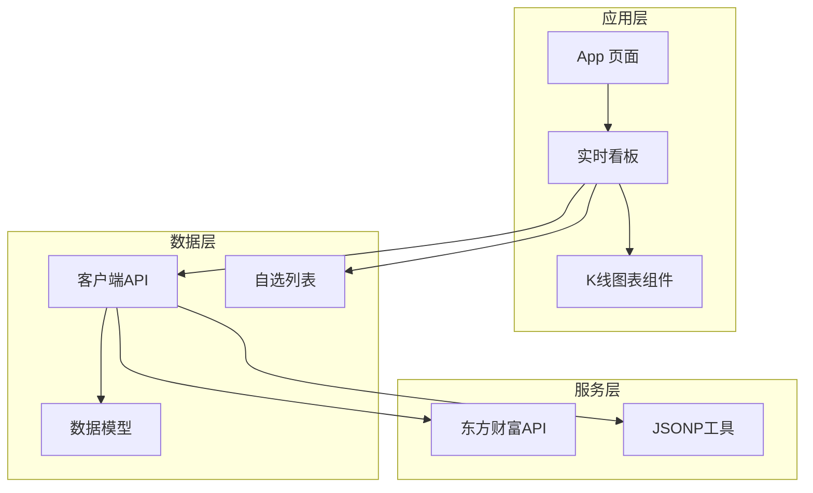

**图表来源**
- [app/page.tsx:1-24](file://app/page.tsx#L1-L24)
- [components/LiveDashboard.tsx:1-375](file://components/LiveDashboard.tsx#L1-L375)
- [lib/client-api.ts:1-596](file://lib/client-api.ts#L1-L596)

**章节来源**
- [app/page.tsx:1-24](file://app/page.tsx#L1-L24)
- [components/LiveDashboard.tsx:1-375](file://components/LiveDashboard.tsx#L1-L375)

## 核心组件

### 数据模型定义

项目定义了完整的数据模型体系，用于描述不同类型的金融数据：

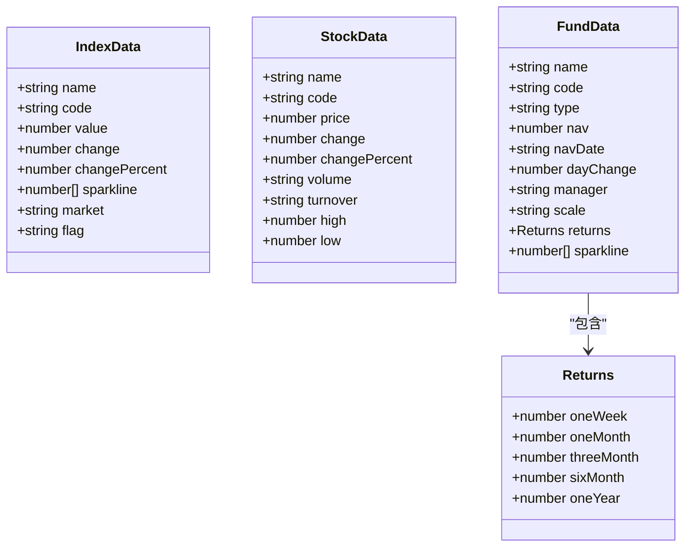

**图表来源**
- [lib/data.ts:1-41](file://lib/data.ts#L1-L41)

### K线数据接口

K线数据采用统一的接口格式，确保不同时间周期的数据一致性：

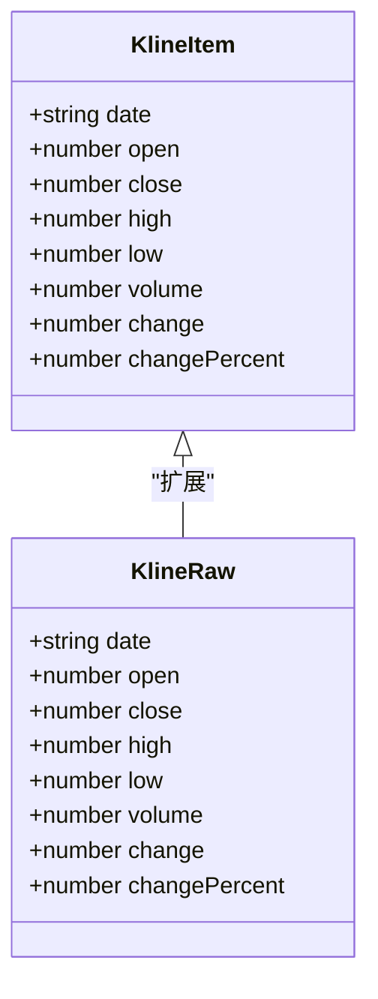

**图表来源**
- [lib/client-api.ts:88-97](file://lib/client-api.ts#L88-L97)
- [components/IndexChartModal.tsx:8-17](file://components/IndexChartModal.tsx#L8-L17)

**章节来源**
- [lib/data.ts:1-41](file://lib/data.ts#L1-L41)
- [lib/client-api.ts:88-97](file://lib/client-api.ts#L88-L97)
- [components/IndexChartModal.tsx:8-17](file://components/IndexChartModal.tsx#L8-L17)

## 架构概览

系统采用分层架构设计，从底层的数据获取到顶层的可视化展示形成完整的数据流：

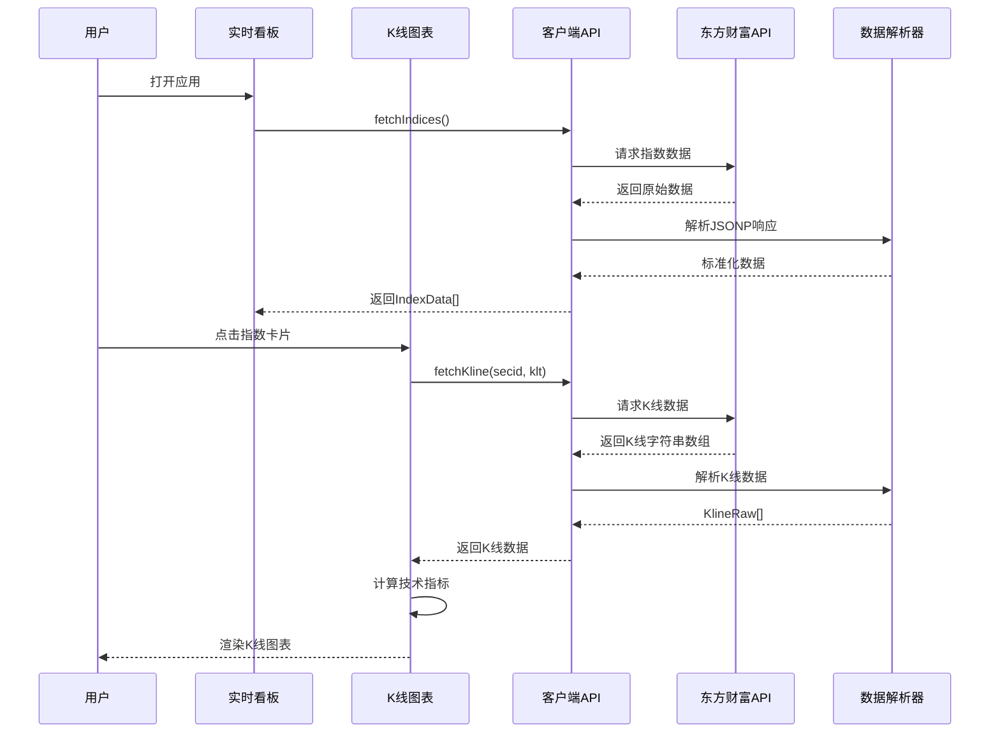

**图表来源**
- [components/LiveDashboard.tsx:56-95](file://components/LiveDashboard.tsx#L56-L95)
- [components/IndexChartModal.tsx:38-55](file://components/IndexChartModal.tsx#L38-L55)
- [lib/client-api.ts:105-136](file://lib/client-api.ts#L105-L136)

## 详细组件分析

### K线数据获取与解析

#### JSONP工具实现

系统使用自定义的JSONP工具来处理跨域请求，确保能够从东方财富API获取数据：

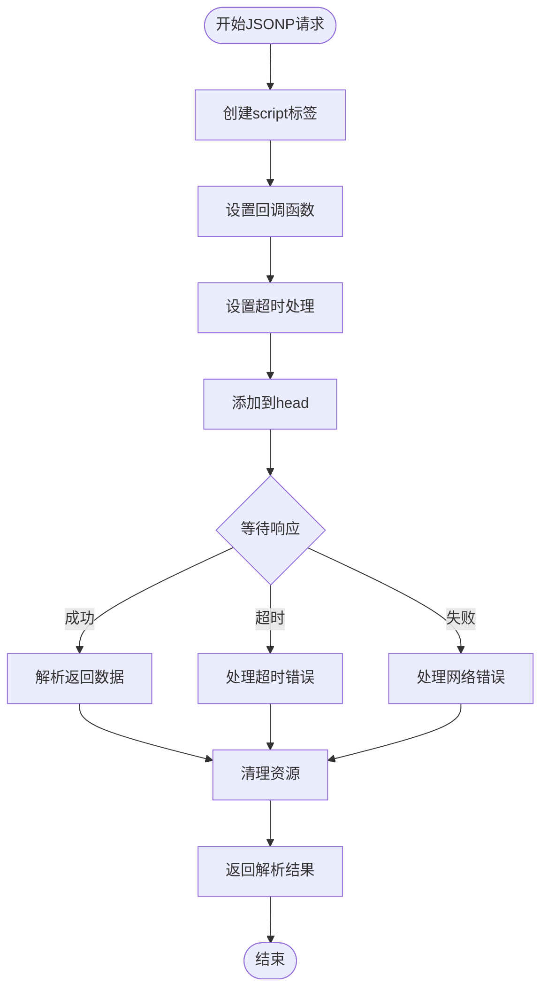

**图表来源**
- [lib/client-api.ts:5-36](file://lib/client-api.ts#L5-L36)

#### K线数据解析流程

K线数据从原始字符串数组转换为结构化对象的过程：

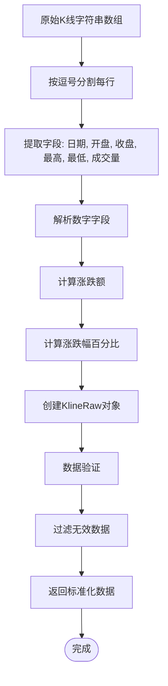

**图表来源**
- [lib/client-api.ts:115-131](file://lib/client-api.ts#L115-L131)

**章节来源**
- [lib/client-api.ts:5-36](file://lib/client-api.ts#L5-L36)
- [lib/client-api.ts:115-131](file://lib/client-api.ts#L115-L131)

### 技术指标计算

#### 涨跌额和涨跌幅计算

系统实现了标准的技术分析指标计算：

**涨跌额计算公式：**
```
涨跌额 = 收盘价 - 开盘价
```

**涨跌幅计算公式：**
```
涨跌幅(%) = (涨跌额 / 开盘价) × 100%
```

当开盘价为0时，涨跌幅设为0以避免除零错误。

#### 移动平均线计算

系统支持多种周期的移动平均线计算：

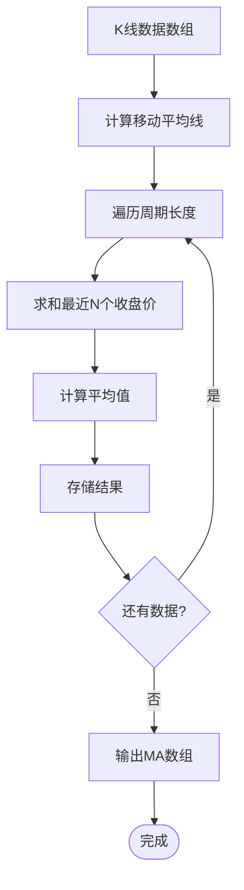

**图表来源**
- [components/IndexChartModal.tsx:356-366](file://components/IndexChartModal.tsx#L356-L366)

**章节来源**
- [lib/client-api.ts:119-120](file://lib/client-api.ts#L119-L120)
- [components/IndexChartModal.tsx:356-366](file://components/IndexChartModal.tsx#L356-L366)

### 时间序列处理

#### K线类型映射

系统支持三种K线时间周期，通过映射表实现：

| 周期类型 | 代码 | 时间维度 |
|---------|------|----------|
| 日K线 | 101 | 天 |
| 周K线 | 102 | 周 |
| 月K线 | 103 | 月 |

#### 日期格式化

K线数据中的日期格式保持原始字符串形式，便于后续的灵活处理和显示。

**章节来源**
- [lib/client-api.ts:99-103](file://lib/client-api.ts#L99-L103)

### 数据验证与清洗

#### 空值处理机制

系统实现了多层次的数据验证和空值处理：

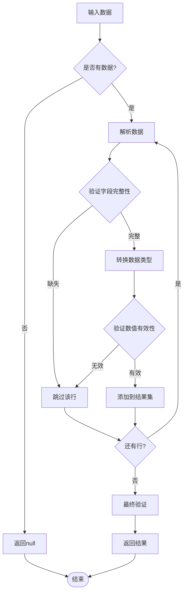

**图表来源**
- [lib/client-api.ts:114-135](file://lib/client-api.ts#L114-L135)

#### 数值有效性检查

系统对关键数值字段进行有效性检查：
- 价格字段必须为数字类型且大于等于0
- 成交量必须为非负数
- 涨跌幅允许为负值

**章节来源**
- [lib/client-api.ts:114-135](file://lib/client-api.ts#L114-L135)

### SVG图表格式化输出

#### K线图表渲染

系统使用SVG实现高性能的K线图表渲染：

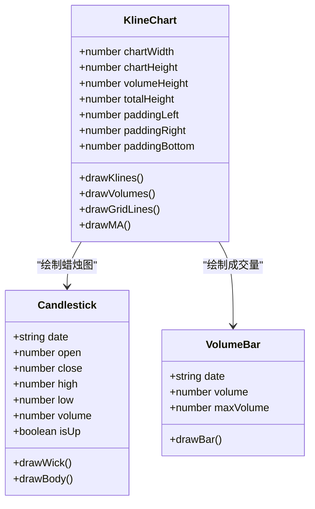

**图表来源**
- [components/IndexChartModal.tsx:169-354](file://components/IndexChartModal.tsx#L169-L354)

#### 坐标转换算法

系统实现了精确的坐标转换算法，将数据值映射到SVG画布坐标：

**价格坐标转换：**
```
priceY = drawHeight - ((price - minPrice) / priceRange) × (drawHeight - 10) + 5
```

**成交量坐标转换：**
```
volumeY = chartHeight + volumeHeight - (volume / maxVolume) × volumeHeight
```

**章节来源**
- [components/IndexChartModal.tsx:169-354](file://components/IndexChartModal.tsx#L169-L354)

### MiniChart组件实现

MiniChart组件用于展示指数的迷你图表，采用相对变化率计算：

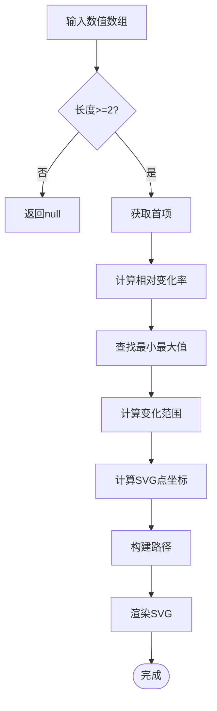

**图表来源**
- [components/MiniChart.tsx:9-57](file://components/MiniChart.tsx#L9-L57)

**章节来源**
- [components/MiniChart.tsx:9-57](file://components/MiniChart.tsx#L9-L57)

## 依赖关系分析

系统各组件之间的依赖关系如下：

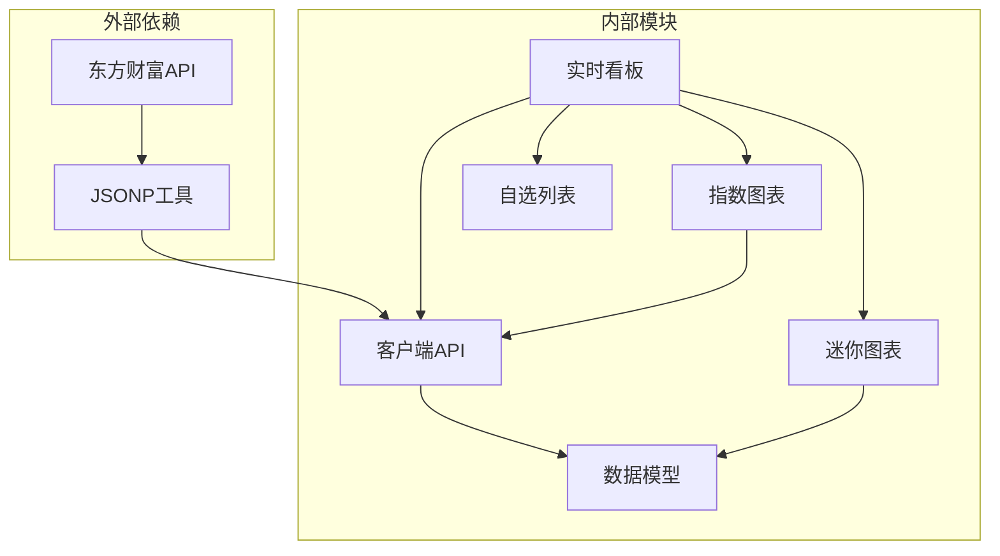

**图表来源**
- [lib/client-api.ts:1-596](file://lib/client-api.ts#L1-L596)
- [components/LiveDashboard.tsx:1-375](file://components/LiveDashboard.tsx#L1-L375)

**章节来源**
- [lib/client-api.ts:1-596](file://lib/client-api.ts#L1-L596)
- [components/LiveDashboard.tsx:1-375](file://components/LiveDashboard.tsx#L1-L375)

## 性能考虑

### 异步数据加载优化

系统采用Promise.allSettled实现并行数据加载，提高整体响应速度：

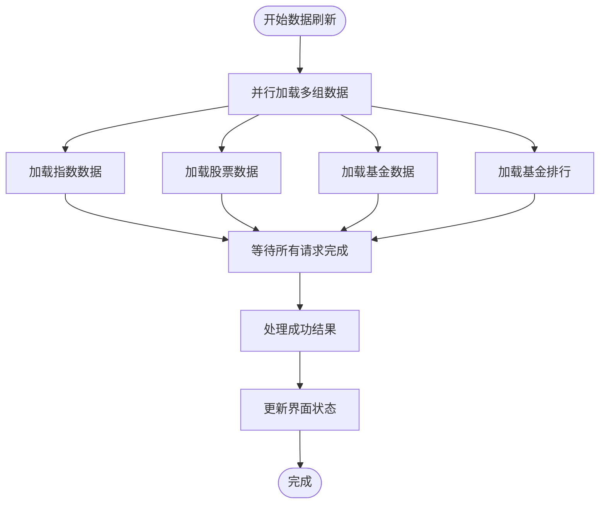

**图表来源**
- [components/LiveDashboard.tsx:56-95](file://components/LiveDashboard.tsx#L56-L95)

### 内存管理策略

- 使用useCallback优化函数组件的重新渲染
- 合理的定时器清理机制
- SVG元素的动态创建和销毁

### 缓存机制

- 本地存储自选列表数据
- 避免重复的API调用
- 合理的数据过期策略

## 故障排除指南

### 常见问题及解决方案

#### JSONP请求失败

**症状：** K线数据无法加载，显示"暂无K线数据"

**原因：**
- 网络连接异常
- 东方财富API暂时不可用
- JSONP回调未正确执行

**解决方案：**
- 检查网络连接状态
- 稍后重试请求
- 查看浏览器控制台错误信息

#### 数据解析错误

**症状：** 控制台出现数据解析相关错误

**原因：**
- API返回格式发生变化
- 数据字段缺失或格式不正确

**解决方案：**
- 检查API响应格式
- 更新数据解析逻辑
- 添加更严格的错误处理

#### SVG渲染问题

**症状：** 图表显示异常或空白

**原因：**
- 数据为空或格式不正确
- 坐标计算错误
- SVG属性设置问题

**解决方案：**
- 验证输入数据的有效性
- 检查坐标转换算法
- 确认SVG属性配置

**章节来源**
- [lib/client-api.ts:133-135](file://lib/client-api.ts#L133-L135)
- [components/IndexChartModal.tsx:156-162](file://components/IndexChartModal.tsx#L156-L162)

## 结论

本项目成功实现了从东方财富K线API到前端组件的完整数据转换流程。通过精心设计的数据模型、严格的数据验证机制、高效的SVG渲染技术和完善的错误处理策略，系统能够稳定地提供高质量的金融数据可视化服务。

主要特点包括：
- **标准化数据格式：** 统一的K线数据接口，支持多种时间周期
- **健壮的数据处理：** 完善的空值处理和数值验证机制
- **高性能渲染：** 基于SVG的高效图表渲染
- **用户友好：** 直观的交互界面和实时数据更新

未来可以考虑的改进方向：
- 添加更多的技术指标支持
- 实现数据缓存和离线功能
- 增强移动端的用户体验
- 扩展支持更多的金融数据源