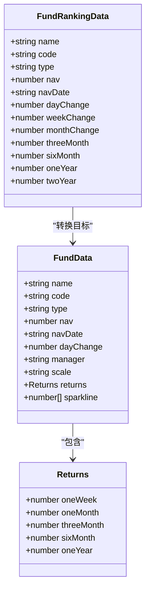
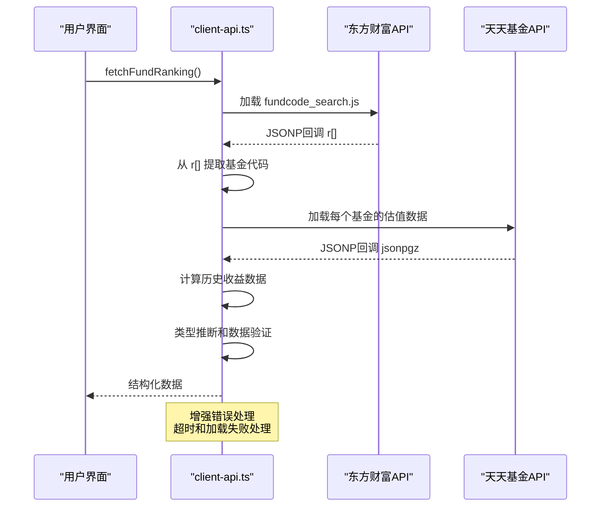
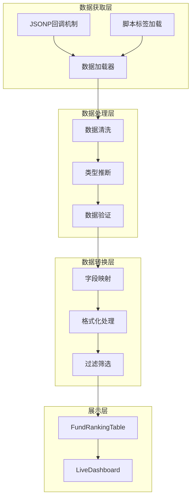
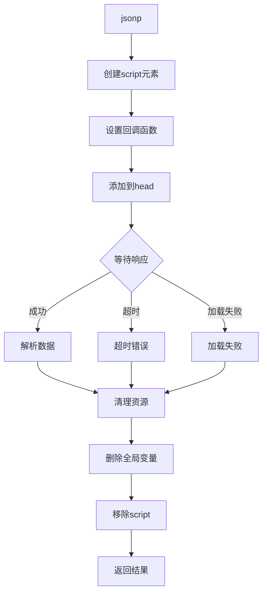
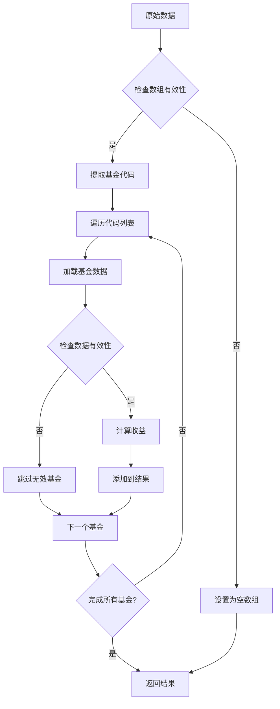
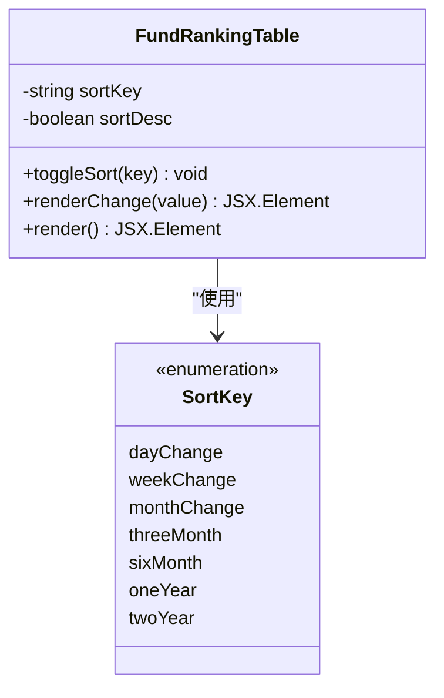
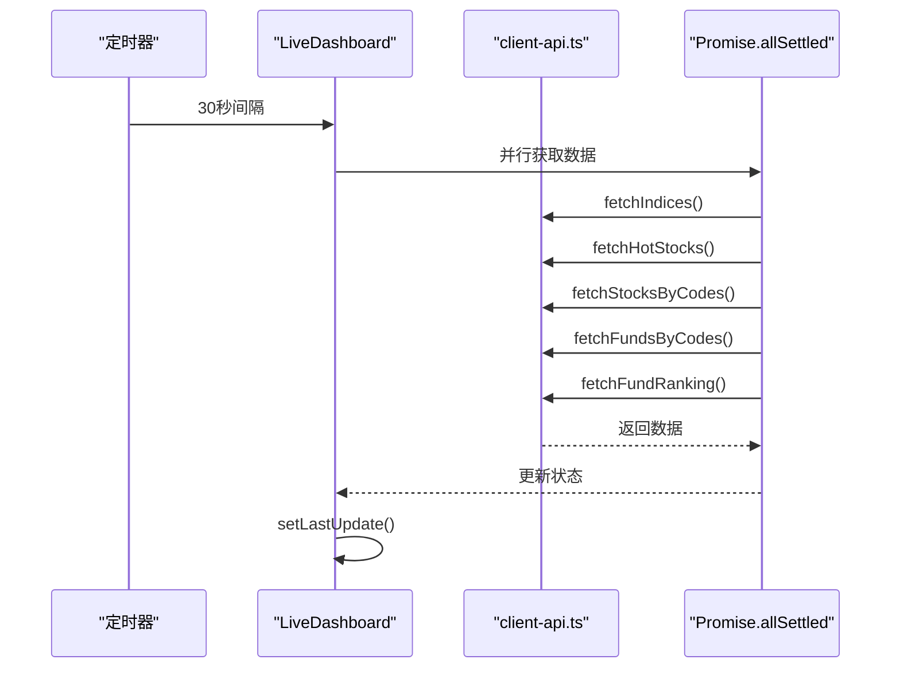
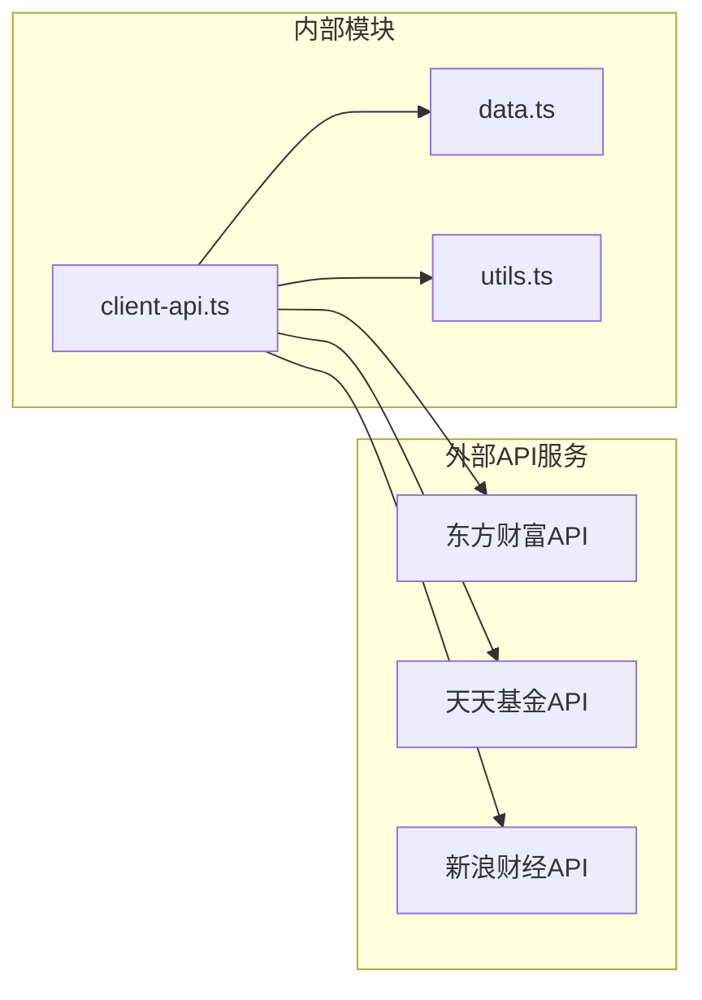
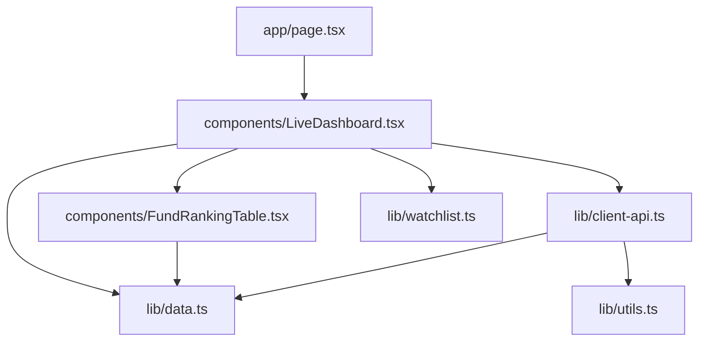

# 基金排名数据转换

<cite>
**本文档引用的文件**
- [lib/client-api.ts](file://lib/client-api.ts)
- [lib/data.ts](file://lib/data.ts)
- [components/FundRankingTable.tsx](file://components/FundRankingTable.tsx)
- [components/LiveDashboard.tsx](file://components/LiveDashboard.tsx)
- [lib/watchlist.ts](file://lib/watchlist.ts)
- [lib/utils.ts](file://lib/utils.ts)
- [app/page.tsx](file://app/page.tsx)
- [README.md](file://README.md)
</cite>

## 更新摘要
**变更内容**
- 采用新的JSONP回调模式替代复杂的HTML解析机制
- 优化错误处理和数据验证逻辑
- 简化数据获取流程，提升性能和可靠性
- 增强类型推断和数据转换的准确性

## 目录
1. [简介](#简介)
2. [项目结构](#项目结构)
3. [核心组件](#核心组件)
4. [架构概览](#架构概览)
5. [详细组件分析](#详细组件分析)
6. [依赖关系分析](#依赖关系分析)
7. [性能考虑](#性能考虑)
8. [故障排除指南](#故障排除指南)
9. [结论](#结论)

## 简介

这是一个基于 Next.js 的基金实盘跟踪应用，专注于从东方财富基金排名页面获取和转换基金排名数据。该系统实现了完整的数据获取、解析、转换和展示流程，包括JSONP回调机制、数据结构化处理、类型推断、多时间维度收益数据处理、数据清洗验证以及增强的错误处理机制。

**更新** 系统现已采用优化的JSONP回调模式，替代了原有的复杂HTML解析和脚本加载机制，显著提升了数据获取的可靠性和性能。

## 项目结构

该项目采用模块化的前端架构，主要包含以下核心目录和文件：

```mermaid
graph TB
subgraph "应用层"
APP[app/page.tsx]
LIVE[components/LiveDashboard.tsx]
TABLE[components/FundRankingTable.tsx]
end
subgraph "数据层"
DATA[lib/data.ts]
API[lib/client-api.ts]
UTILS[lib/utils.ts]
WATCH[lib/watchlist.ts]
end
subgraph "外部服务"
EM[东方财富 API]
TMF[天天基金 API]
END
APP --> LIVE
LIVE --> TABLE
LIVE --> API
API --> EM
API --> TMF
TABLE --> DATA
LIVE --> DATA
LIVE --> WATCH
```

**图表来源**
- [app/page.tsx:1-24](file://app/page.tsx#L1-L24)
- [components/LiveDashboard.tsx:1-406](file://components/LiveDashboard.tsx#L1-L406)
- [lib/client-api.ts:1-795](file://lib/client-api.ts#L1-L795)

**章节来源**
- [README.md:132-161](file://README.md#L132-L161)
- [package.json:1-31](file://package.json#L1-L31)

## 核心组件

### 数据模型定义

系统定义了完整的数据接口来描述基金排名数据结构：



**图表来源**
- [lib/data.ts:24-41](file://lib/data.ts#L24-L41)
- [lib/data.ts:147-160](file://lib/data.ts#L147-L160)

### JSONP客户端与数据获取

系统使用优化的JSONP工具和脚本加载器来处理跨域数据获取：



**图表来源**
- [lib/client-api.ts:709-794](file://lib/client-api.ts#L709-L794)

**章节来源**
- [lib/data.ts:24-41](file://lib/data.ts#L24-L41)
- [lib/client-api.ts:1-795](file://lib/client-api.ts#L1-L795)

## 架构概览

系统采用分层架构设计，实现了清晰的数据流和职责分离：



**图表来源**
- [components/LiveDashboard.tsx:73-112](file://components/LiveDashboard.tsx#L73-L112)
- [lib/client-api.ts:709-794](file://lib/client-api.ts#L709-L794)

## 详细组件分析

### 基金排名数据获取组件

#### JSONP回调机制

系统实现了基于JSONP的双重数据获取策略以确保可靠性：

```mermaid
flowchart TD
START([开始获取]) --> LOAD_SCRIPT[加载 fundcode_search.js]
LOAD_SCRIPT --> CHECK_R{检查 r[] 是否存在}
CHECK_R --> |是| EXTRACT_CODES[提取基金代码]
CHECK_R --> |否| ERROR[返回空数组]
EXTRACT_CODES --> LOOP_FUND[遍历每个基金代码]
LOOP_FUND --> LOAD_DETAIL[加载估值数据]
LOAD_DETAIL --> CHECK_DETAIL{检查数据有效性}
CHECK_DETAIL --> |是| CALCULATE[计算历史收益]
CHECK_DETAIL --> |否| SKIP[跳过该基金]
CALCULATE --> PUSH_RESULT[添加到结果数组]
SKIP --> NEXT_FUND[下一个基金]
PUSH_RESULT --> NEXT_FUND
NEXT_FUND --> DONE{完成所有基金?}
DONE --> |否| LOOP_FUND
DONE --> |是| RETURN[返回结果]
ERROR --> RETURN
```

**图表来源**
- [lib/client-api.ts:709-794](file://lib/client-api.ts#L709-L794)

#### JSONP工具函数

系统提供了专门的JSONP工具函数来处理跨域请求：



**图表来源**
- [lib/client-api.ts:5-36](file://lib/client-api.ts#L5-L36)

**章节来源**
- [lib/client-api.ts:5-36](file://lib/client-api.ts#L5-L36)
- [lib/client-api.ts:709-794](file://lib/client-api.ts#L709-L794)

### 数据类型推断系统

系统实现了智能的基金类型自动推断机制：

```mermaid
flowchart TD
NAME[基金名称] --> CHECK1{包含"混合"?}
CHECK1 --> |是| MIXED[返回"混合型"]
CHECK1 --> |否| CHECK2{包含"股票"?}
CHECK2 --> |是| STOCK[返回"股票型"]
CHECK2 --> |否| CHECK3{包含"债券"?}
CHECK3 --> |是| BOND[返回"债券型"]
CHECK3 --> |否| CHECK4{包含"指数"或"ETF联接"?}
CHECK4 --> |是| INDEX[返回"指数型"]
CHECK4 --> |否| CHECK5{包含"QDII"?}
CHECK5 --> |是| QDII[返回"QDII"]
CHECK5 --> |否| CHECK6{包含"FOF"?}
CHECK6 --> |是| FOF[返回"FOF"]
CHECK6 --> |否| CHECK7{包含"货币"?}
CHECK7 --> |是| MONEY[返回"货币型"]
CHECK7 --> |否| OTHER[返回"其他"]
```

**图表来源**
- [lib/client-api.ts:40-49](file://lib/client-api.ts#L40-L49)

**章节来源**
- [lib/client-api.ts:40-49](file://lib/client-api.ts#L40-L49)

### 多时间维度收益数据处理

系统支持多种时间维度的收益数据处理：

| 时间维度 | 字段名称 | 数据类型 | 描述 |
|---------|---------|---------|------|
| 日 | dayChange | number | 当日涨跌幅百分比 |
| 周 | weekChange | number | 近一周涨跌幅百分比 |
| 月 | monthChange | number | 近一月涨跌幅百分比 |
| 季度 | threeMonth | number | 近一季度涨跌幅百分比 |
| 半年 | sixMonth | number | 近半年涨跌幅百分比 |
| 年 | oneYear | number | 近一年涨跌幅百分比 |
| 两年 | twoYear | number | 近两年涨跌幅百分比 |

**章节来源**
- [lib/data.ts:147-160](file://lib/data.ts#L147-L160)
- [lib/client-api.ts:637-707](file://lib/client-api.ts#L637-L707)

### 数据清洗和验证机制

系统实施了多层次的数据验证和清洗：



**图表来源**
- [lib/client-api.ts:709-794](file://lib/client-api.ts#L709-L794)

**章节来源**
- [lib/client-api.ts:709-794](file://lib/client-api.ts#L709-L794)

### 展示组件分析

#### 基金排名表格组件

表格组件实现了交互式的排序功能和数据展示：



**图表来源**
- [components/FundRankingTable.tsx:8-44](file://components/FundRankingTable.tsx#L8-L44)

**章节来源**
- [components/FundRankingTable.tsx:1-192](file://components/FundRankingTable.tsx#L1-L192)

### 数据获取协调器

#### LiveDashboard 数据协调

主仪表板组件协调多个数据源的获取和更新：



**图表来源**
- [components/LiveDashboard.tsx:73-112](file://components/LiveDashboard.tsx#L73-L112)

**章节来源**
- [components/LiveDashboard.tsx:1-406](file://components/LiveDashboard.tsx#L1-L406)

## 依赖关系分析

### 外部依赖

系统依赖以下主要外部服务：



**图表来源**
- [lib/client-api.ts:1-795](file://lib/client-api.ts#L1-L795)
- [README.md:165-178](file://README.md#L165-L178)

### 内部模块依赖



**图表来源**
- [app/page.tsx:1-24](file://app/page.tsx#L1-L24)
- [components/LiveDashboard.tsx:1-406](file://components/LiveDashboard.tsx#L1-L406)
- [lib/client-api.ts:1-795](file://lib/client-api.ts#L1-L795)

**章节来源**
- [lib/client-api.ts:1-795](file://lib/client-api.ts#L1-L795)
- [lib/data.ts:1-262](file://lib/data.ts#L1-L262)

## 性能考虑

### 并行数据获取

系统使用 `Promise.allSettled` 实现并行数据获取，提高整体响应速度：

- **并发优势**：同时获取多个数据源，避免串行等待
- **容错机制**：单个数据源失败不影响其他数据的获取
- **资源控制**：合理设置超时时间，避免长时间阻塞

### JSONP优化策略

- **缓存机制**：利用浏览器缓存减少重复请求
- **超时控制**：每个JSONP请求设置合理的超时时间
- **错误恢复**：网络失败时自动重试和降级处理

### 内存优化

- **数据清理**：及时清理DOM节点和全局变量
- **条件渲染**：根据数据存在性进行条件渲染
- **懒加载**：按需加载搜索和图表组件

## 故障排除指南

### 常见问题诊断

#### 数据获取失败

**症状**：基金排名数据为空或显示"暂无数据"

**可能原因**：
1. 网络连接问题
2. 东方财富API临时不可用
3. JSONP回调未正确执行
4. 基金代码列表加载失败

**解决方案**：
1. 检查网络连接状态
2. 查看浏览器开发者工具的Network面板
3. 验证JSONP回调函数是否正确设置
4. 检查 fundcode_search.js 是否正确加载

#### 数据解析错误

**症状**：数值显示异常或NaN值

**可能原因**：
1. JSONP响应格式不符合预期
2. 基金估值数据缺失
3. 历史收益计算失败

**解决方案**：
1. 检查JSONP回调数据结构
2. 添加默认值处理机制
3. 实现更健壮的数值解析逻辑

#### 类型推断错误

**症状**：基金类型显示为"其他"

**可能原因**：
1. 基金名称包含特殊关键词
2. 名称格式不符合预期

**解决方案**：
1. 扩展关键词匹配规则
2. 添加更精确的类型推断逻辑
3. 提供手动类型选择功能

**章节来源**
- [lib/client-api.ts:709-794](file://lib/client-api.ts#L709-L794)
- [components/LiveDashboard.tsx:114-119](file://components/LiveDashboard.tsx#L114-L119)

## 结论

该基金排名数据转换系统展现了现代前端数据处理的最佳实践。通过精心设计的架构，系统实现了：

1. **可靠的JSONP回调机制**：替代复杂的HTML解析，提升数据获取的稳定性和性能
2. **智能的数据解析**：精确的JSONP回调处理和类型推断逻辑
3. **完善的错误处理**：多层次的验证和容错机制，包括超时和加载失败处理
4. **优秀的用户体验**：实时更新、响应式设计和交互式排序

系统的核心优势在于其对复杂数据源的适应能力和对技术债务的有效管理。通过模块化的架构设计，代码具有良好的可维护性和扩展性，为后续的功能增强奠定了坚实基础。

**更新** 新的JSONP回调模式显著简化了数据获取流程，减少了对DOM操作的依赖，提升了系统的可靠性和性能表现。增强的错误处理机制确保了在各种网络条件下都能提供稳定的用户体验。