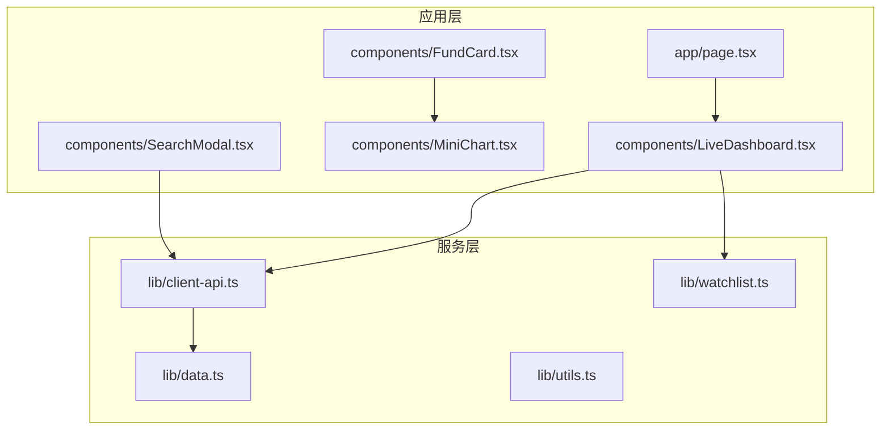
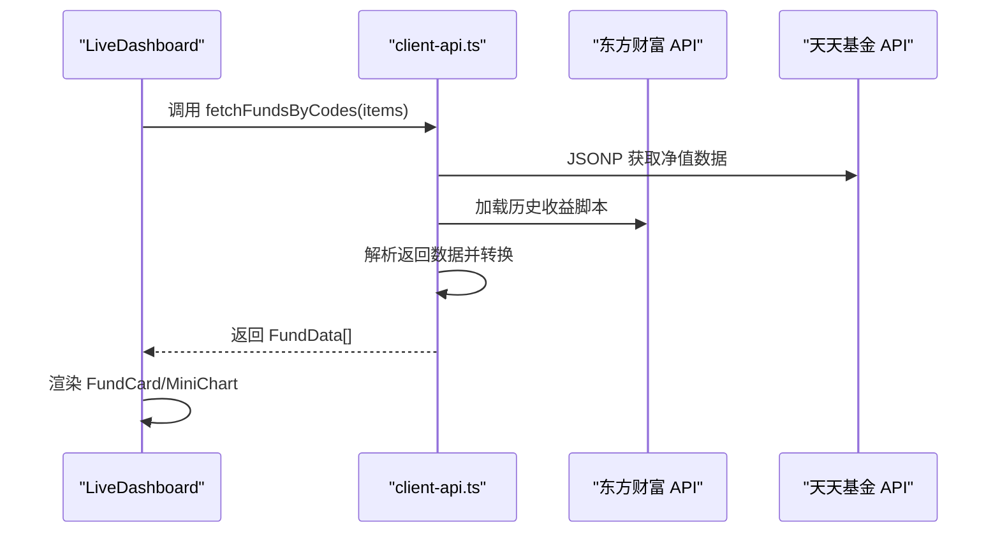
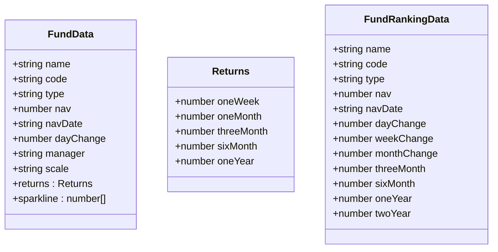
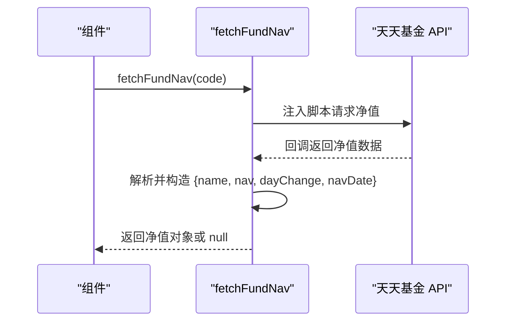
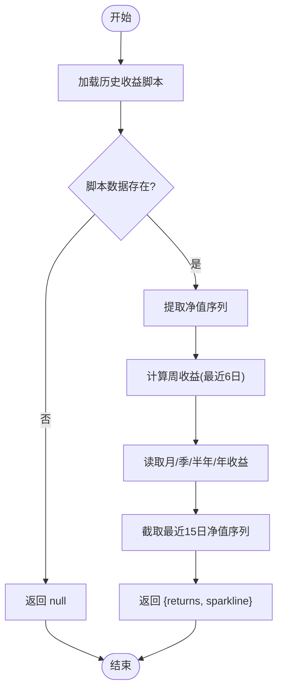
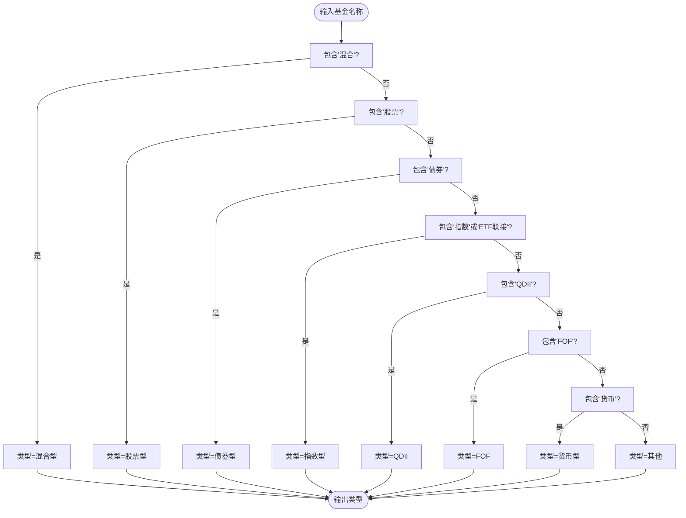
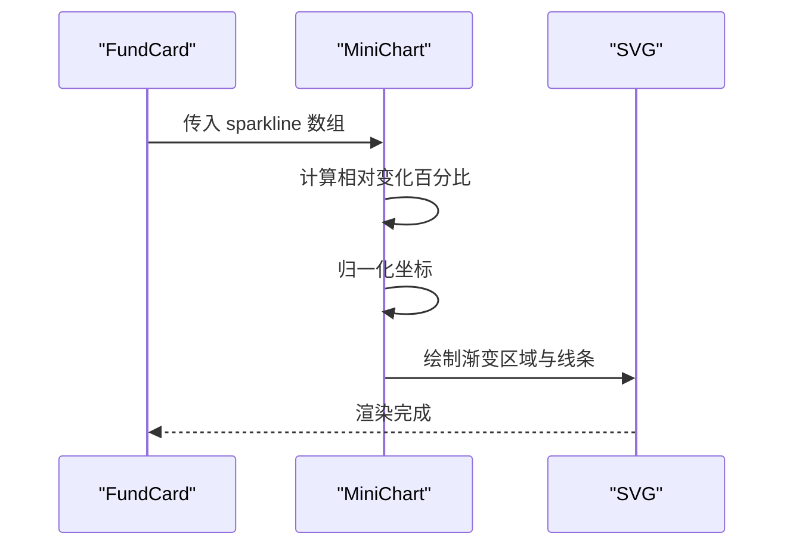
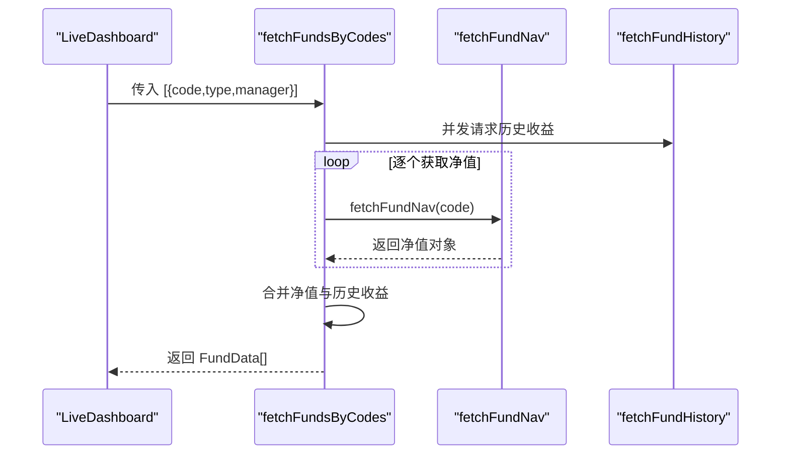
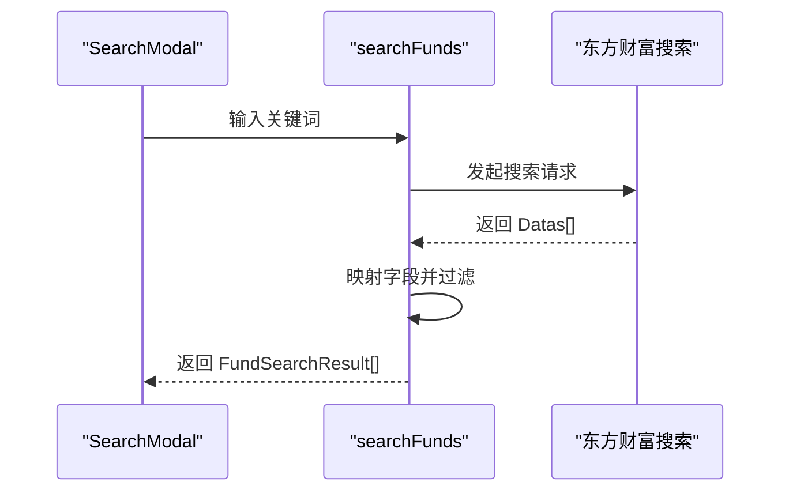
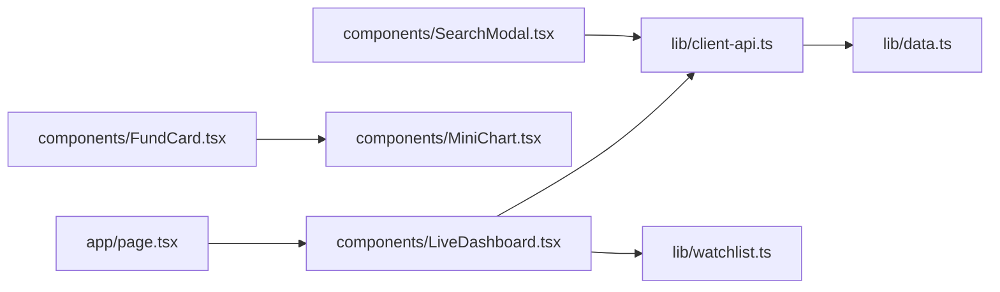

# 基金数据转换

<cite>
**本文档引用的文件**
- [lib/data.ts](file://lib/data.ts)
- [lib/client-api.ts](file://lib/client-api.ts)
- [components/MiniChart.tsx](file://components/MiniChart.tsx)
- [components/FundCard.tsx](file://components/FundCard.tsx)
- [components/LiveDashboard.tsx](file://components/LiveDashboard.tsx)
- [components/SearchModal.tsx](file://components/SearchModal.tsx)
- [lib/watchlist.ts](file://lib/watchlist.ts)
- [lib/utils.ts](file://lib/utils.ts)
- [app/page.tsx](file://app/page.tsx)
- [README.md](file://README.md)
- [package.json](file://package.json)
</cite>

## 目录
1. [简介](#简介)
2. [项目结构](#项目结构)
3. [核心组件](#核心组件)
4. [架构总览](#架构总览)
5. [详细组件分析](#详细组件分析)
6. [依赖关系分析](#依赖关系分析)
7. [性能考虑](#性能考虑)
8. [故障排除指南](#故障排除指南)
9. [结论](#结论)
10. [附录](#附录)

## 简介
本项目是一个基于 Next.js 的实时金融数据面板，专注于全球指数、热门股票和基金净值的可视化展示。本文档深入分析从天天基金和东方财富 API 获取的原始基金数据到组件可用格式的完整转换流程，涵盖净值数据获取与解析、历史收益数据处理、基金类型推断算法、迷你图表数据生成、批量数据并发处理策略、搜索结果解析与格式化，以及错误处理与数据验证机制。

## 项目结构
项目采用按功能模块划分的组织方式：
- app：应用入口与根布局
- components：UI 组件与业务组件
- lib：数据模型、客户端 API、工具函数与用户自选列表状态管理
- 根目录：配置文件与文档

**图表来源**
- [app/page.tsx:10-23](file://app/page.tsx#L10-L23)
- [components/LiveDashboard.tsx:39-301](file://components/LiveDashboard.tsx#L39-L301)
- [lib/client-api.ts:1-596](file://lib/client-api.ts#L1-L596)
- [lib/data.ts:1-255](file://lib/data.ts#L1-L255)

**章节来源**
- [README.md:132-161](file://README.md#L132-L161)
- [package.json:1-31](file://package.json#L1-L31)

## 核心组件
- 数据模型与类型定义：定义了指数、股票、基金、基金排行榜的数据结构，确保前端组件与 API 返回数据的一致性。
- 客户端 API：封装了 JSONP 请求、脚本加载、数据解析与转换逻辑，统一处理来自天天基金和东方财富的数据。
- UI 组件：负责渲染数据、交互与图表绘制，包括基金卡片、迷你图表、搜索模态框等。
- 状态管理：提供用户自选列表的本地存储与增删改查能力。

**章节来源**
- [lib/data.ts:24-41](file://lib/data.ts#L24-L41)
- [lib/client-api.ts:1-596](file://lib/client-api.ts#L1-L596)
- [components/FundCard.tsx:19-131](file://components/FundCard.tsx#L19-L131)
- [lib/watchlist.ts:28-88](file://lib/watchlist.ts#L28-L88)

## 架构总览
系统采用“组件驱动 + 客户端 API + 数据模型”的三层架构：
- 组件层：负责展示与交互，调用客户端 API 获取数据。
- 客户端 API 层：封装网络请求、数据解析与转换。
- 数据模型层：定义统一的数据结构与默认值，保证组件渲染一致性。

**图表来源**
- [components/LiveDashboard.tsx:56-95](file://components/LiveDashboard.tsx#L56-L95)
- [lib/client-api.ts:462-523](file://lib/client-api.ts#L462-L523)

## 详细组件分析

### 基金数据模型与类型定义
- FundData：包含名称、代码、类型、净值、净值日期、日涨跌幅、基金经理、规模、历史收益（周/月/季/半年/年）与迷你图表数据。
- FundRankingData：用于排行榜展示，包含多周期收益字段。
- 默认数据：提供 mock 数据以支持开发与演示。

**图表来源**
- [lib/data.ts:24-41](file://lib/data.ts#L24-L41)
- [lib/data.ts:147-160](file://lib/data.ts#L147-L160)

**章节来源**
- [lib/data.ts:24-41](file://lib/data.ts#L24-L41)
- [lib/data.ts:147-160](file://lib/data.ts#L147-L160)

### 基金净值数据获取与解析
- 天天基金净值接口：通过动态脚本注入获取净值、日涨跌幅与净值日期，设置超时与清理逻辑。
- 字段提取：从返回对象中提取名称、单位净值、日涨跌幅、净值日期。
- 错误处理：失败时返回空值，避免影响整体流程。

**图表来源**
- [lib/client-api.ts:253-290](file://lib/client-api.ts#L253-L290)

**章节来源**
- [lib/client-api.ts:253-290](file://lib/client-api.ts#L253-L290)

### 基金历史收益数据处理
- 东方财富历史收益脚本：通过动态加载脚本获取净值曲线与各周期收益。
- 周收益计算：基于净值曲线最后 6 个交易日计算周收益。
- 其他周期收益：直接读取脚本中的年化收益字段。
- 迷你图表数据：截取最近 15 个交易日的净值序列作为趋势数据。

**图表来源**
- [lib/client-api.ts:292-346](file://lib/client-api.ts#L292-L346)

**章节来源**
- [lib/client-api.ts:292-346](file://lib/client-api.ts#L292-L346)

### 基金类型推断算法
- 关键词匹配：根据基金名称中的关键词判断类型，如“混合”、“股票”、“债券”、“指数/ETF联接”、“QDII”、“FOF”、“货币”。
- 默认类型：若未匹配到关键词，默认为“其他”。

**图表来源**
- [lib/client-api.ts:40-49](file://lib/client-api.ts#L40-L49)

**章节来源**
- [lib/client-api.ts:40-49](file://lib/client-api.ts#L40-L49)

### 迷你图表数据生成（MiniChart）
- 数据准备：接收净值数组，计算相对变化百分比。
- 归一化：根据最小最大值进行归一化，确定 SVG 坐标。
- 渲染：生成路径并绘制渐变填充区域与线条。

**图表来源**
- [components/MiniChart.tsx:9-56](file://components/MiniChart.tsx#L9-L56)
- [components/FundCard.tsx:101-127](file://components/FundCard.tsx#L101-L127)

**章节来源**
- [components/MiniChart.tsx:9-56](file://components/MiniChart.tsx#L9-L56)
- [components/FundCard.tsx:101-127](file://components/FundCard.tsx#L101-L127)

### 批量基金数据的并发处理策略
- 并发获取：使用 Promise.all 并发请求历史收益数据，显著提升性能。
- 顺序获取净值：由于某些接口限制，净值数据采用串行获取，确保稳定性。
- 数据合并：将净值、历史收益与基础信息合并为统一的 FundData 结构。

**图表来源**
- [components/LiveDashboard.tsx:56-95](file://components/LiveDashboard.tsx#L56-L95)
- [lib/client-api.ts:462-523](file://lib/client-api.ts#L462-L523)

**章节来源**
- [lib/client-api.ts:462-523](file://lib/client-api.ts#L462-L523)
- [components/LiveDashboard.tsx:56-95](file://components/LiveDashboard.tsx#L56-L95)

### 基金搜索结果解析与格式化
- 搜索接口：调用东方财富的搜索 API，解析返回的 Datas 数组。
- 字段映射：提取代码、名称、类型（从 FundBaseInfo 中解析）、基金经理。
- 结果过滤：限制返回数量并过滤无效项。

**图表来源**
- [components/SearchModal.tsx:58-74](file://components/SearchModal.tsx#L58-L74)
- [lib/client-api.ts:364-379](file://lib/client-api.ts#L364-L379)

**章节来源**
- [components/SearchModal.tsx:58-74](file://components/SearchModal.tsx#L58-L74)
- [lib/client-api.ts:364-379](file://lib/client-api.ts#L364-L379)

### 错误处理与数据验证策略
- JSONP 超时与失败：JSONP 工具函数设置超时与错误回调，避免阻塞。
- 接口降级：部分接口失败时返回空数组或 null，不影响其他数据获取。
- 数据校验：对数值字段进行类型检查与边界值处理，确保渲染安全。
- Promise.allSettled：在仪表板中使用，确保即使部分请求失败也能更新成功的结果。

**章节来源**
- [lib/client-api.ts:5-36](file://lib/client-api.ts#L5-L36)
- [components/LiveDashboard.tsx:59-95](file://components/LiveDashboard.tsx#L59-L95)

## 依赖关系分析
- 组件依赖：LiveDashboard 依赖 client-api 与 watchlist；FundCard 依赖 MiniChart；SearchModal 依赖 client-api。
- 数据流：从 API 层获取原始数据，经过解析与转换，最终传递给 UI 组件渲染。
- 外部依赖：Next.js、React、Lucide React、Tailwind CSS。

**图表来源**
- [app/page.tsx:10-23](file://app/page.tsx#L10-L23)
- [components/LiveDashboard.tsx:39-301](file://components/LiveDashboard.tsx#L39-L301)
- [lib/client-api.ts:1-596](file://lib/client-api.ts#L1-L596)
- [lib/data.ts:1-255](file://lib/data.ts#L1-L255)

**章节来源**
- [package.json:11-29](file://package.json#L11-L29)

## 性能考虑
- 并发优化：使用 Promise.all 并发获取历史收益，减少等待时间。
- 缓存策略：利用浏览器缓存与本地存储，减少重复请求。
- 渲染优化：MiniChart 仅在数据满足条件时渲染，避免不必要的计算。
- 刷新频率：每 30 秒自动刷新一次，平衡实时性与性能。

## 故障排除指南
- JSONP 超时：检查网络连接与目标站点可用性，适当调整超时时间。
- 接口返回为空：确认查询参数正确，检查返回数据结构是否发生变化。
- 渲染异常：检查数据类型与边界值，确保组件接收的数据符合预期。
- 搜索无结果：确认关键词拼写与大小写，检查搜索接口的可用性。

**章节来源**
- [lib/client-api.ts:5-36](file://lib/client-api.ts#L5-L36)
- [components/LiveDashboard.tsx:59-95](file://components/LiveDashboard.tsx#L59-L95)

## 结论
本项目通过清晰的分层架构与完善的错误处理机制，实现了从天天基金与东方财富 API 获取的原始数据到组件可用格式的高效转换。并发处理策略提升了性能，类型推断与迷你图表生成增强了用户体验，而严格的验证与降级策略确保了系统的稳定性。

## 附录
- 数据来源：全球指数、股票行情、基金净值、历史收益、搜索结果均来自东方财富与天天基金的公开接口。
- 部署：支持静态部署至 GitHub Pages，无需后端服务。

**章节来源**
- [README.md:165-178](file://README.md#L165-L178)