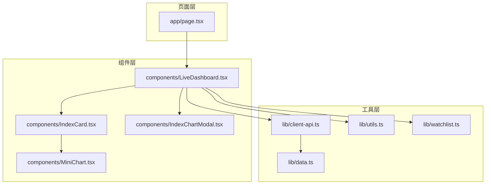
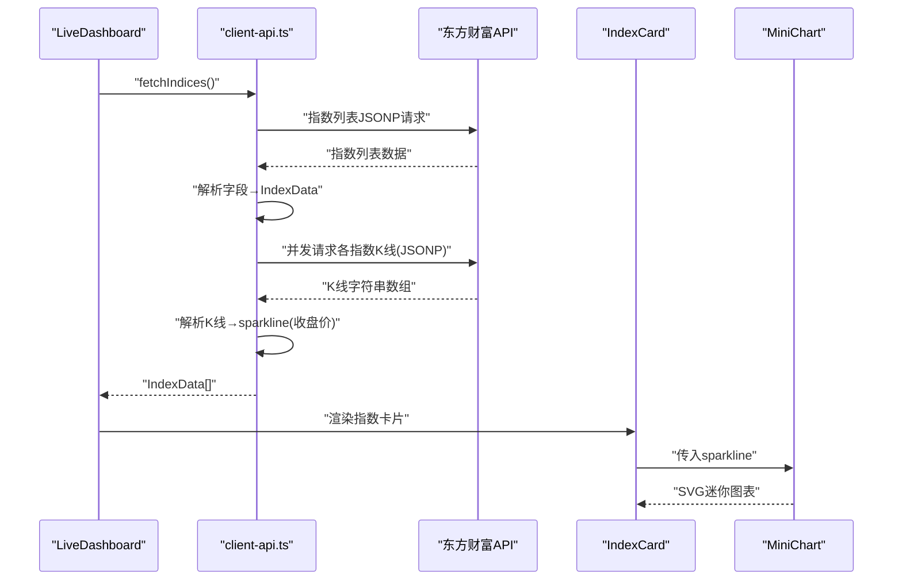
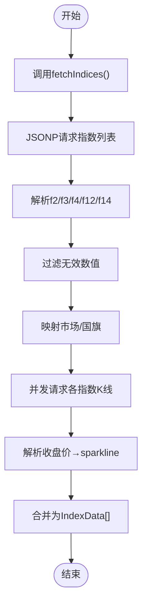
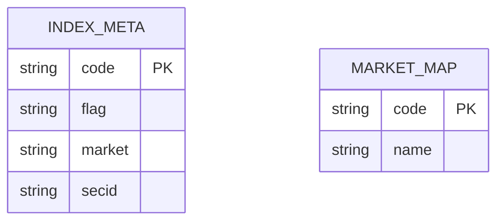
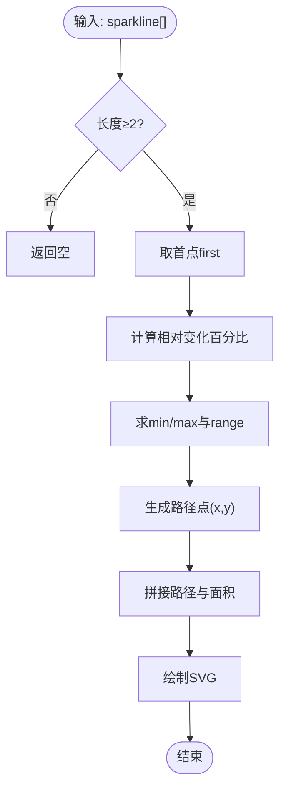
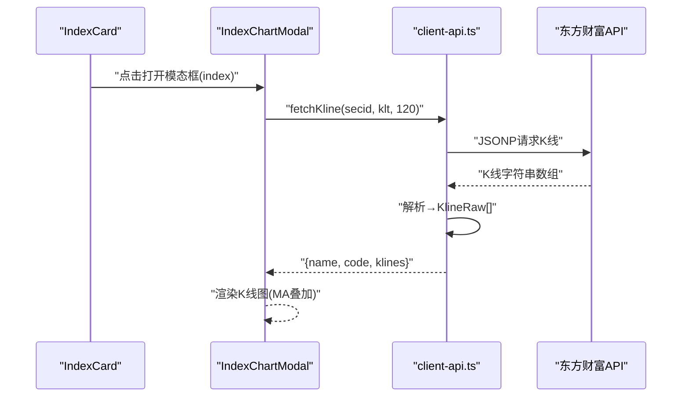
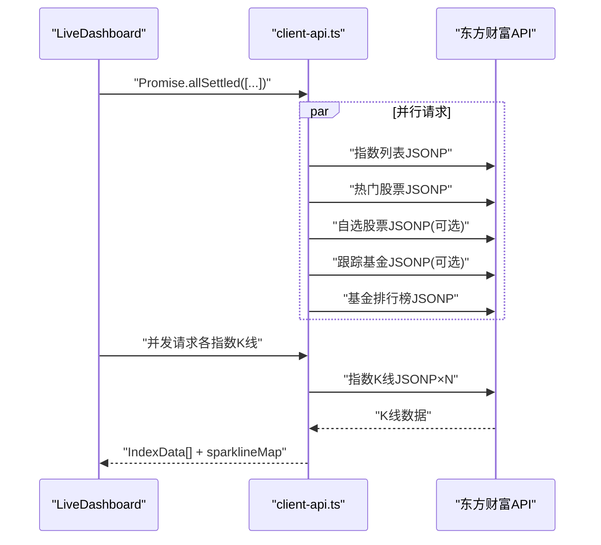
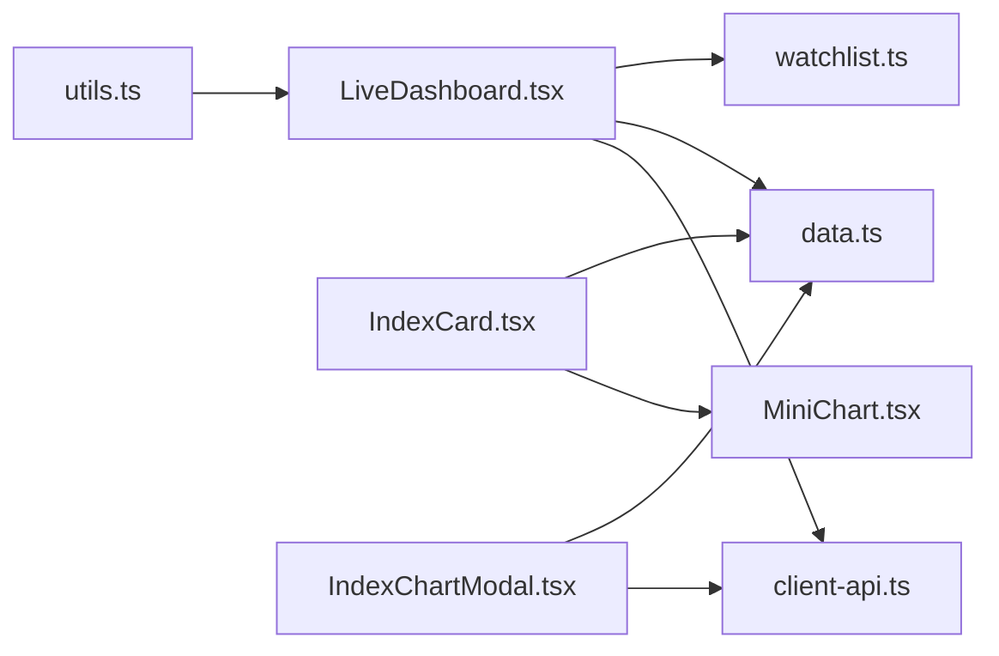

# 指数数据转换

<cite>
**本文引用的文件**
- [IndexCard.tsx](file://components/IndexCard.tsx)
- [MiniChart.tsx](file://components/MiniChart.tsx)
- [data.ts](file://lib/data.ts)
- [client-api.ts](file://lib/client-api.ts)
- [utils.ts](file://lib/utils.ts)
- [LiveDashboard.tsx](file://components/LiveDashboard.tsx)
- [IndexChartModal.tsx](file://components/IndexChartModal.tsx)
- [watchlist.ts](file://lib/watchlist.ts)
- [page.tsx](file://app/page.tsx)
</cite>

## 目录
1. [简介](#简介)
2. [项目结构](#项目结构)
3. [核心组件](#核心组件)
4. [架构总览](#架构总览)
5. [详细组件分析](#详细组件分析)
6. [依赖关系分析](#依赖关系分析)
7. [性能考量](#性能考量)
8. [故障排查指南](#故障排查指南)
9. [结论](#结论)

## 简介
本文件聚焦“指数数据转换”的完整流程，从东方财富API获取的原始指数数据，到组件可用的IndexData结构，并进一步生成迷你图表（sparkline）与K线图。内容涵盖：
- 指数数据结构解析：名称、代码、数值、涨跌额、涨跌幅等字段提取与转换
- 市场标识符与国旗表情映射、地区代码到市场名称的转换规则
- 迷你图表（sparkline）生成算法：历史K线数据获取、解析与格式化
- 数据过滤与验证：空值检查、数值类型转换、数据完整性校验
- 并发数据获取策略：Promise.all与Promise.allSettled的使用与异步处理
- 错误处理与降级策略、性能优化建议

## 项目结构
该项目为Next.js前端应用，采用按功能模块组织的组件与工具层：
- 组件层：展示指数卡片、迷你图表、K线模态框、仪表盘等
- 工具层：数据模型定义、客户端API封装、通用工具函数、自选列表状态管理
- 页面层：首页入口，组合仪表盘与全局布局

**图表来源**
- [page.tsx:10-23](file://app/page.tsx#L10-L23)
- [LiveDashboard.tsx:39-301](file://components/LiveDashboard.tsx#L39-L301)
- [IndexCard.tsx:1-52](file://components/IndexCard.tsx#L1-L52)
- [MiniChart.tsx:1-57](file://components/MiniChart.tsx#L1-L57)
- [IndexChartModal.tsx:1-367](file://components/IndexChartModal.tsx#L1-L367)
- [data.ts:1-255](file://lib/data.ts#L1-L255)
- [client-api.ts:1-596](file://lib/client-api.ts#L1-L596)
- [utils.ts:1-7](file://lib/utils.ts#L1-L7)
- [watchlist.ts:1-89](file://lib/watchlist.ts#L1-L89)

**章节来源**
- [page.tsx:10-23](file://app/page.tsx#L10-L23)
- [LiveDashboard.tsx:39-301](file://components/LiveDashboard.tsx#L39-L301)

## 核心组件
- IndexData：指数数据统一结构，包含名称、代码、数值、涨跌额、涨跌幅、市场、国旗表情、可选sparkline
- client-api.ts：封装指数、K线、搜索等API调用，负责数据抓取、解析、转换与并发控制
- LiveDashboard.tsx：仪表盘主控，调度并发请求、聚合结果、驱动UI渲染
- IndexCard.tsx：指数卡片展示，消费IndexData并渲染迷你图表
- MiniChart.tsx：基于sparkline生成迷你折线图
- IndexChartModal.tsx：指数K线详情页，支持日/周/月K线切换
- data.ts：定义数据模型与示例数据（用于演示）
- utils.ts：Tailwind样式合并工具
- watchlist.ts：自选列表本地持久化与增删改操作

**章节来源**
- [data.ts:1-134](file://lib/data.ts#L1-L134)
- [client-api.ts:138-199](file://lib/client-api.ts#L138-L199)
- [LiveDashboard.tsx:39-95](file://components/LiveDashboard.tsx#L39-L95)
- [IndexCard.tsx:1-52](file://components/IndexCard.tsx#L1-L52)
- [MiniChart.tsx:1-57](file://components/MiniChart.tsx#L1-L57)
- [IndexChartModal.tsx:1-367](file://components/IndexChartModal.tsx#L1-L367)
- [utils.ts:1-7](file://lib/utils.ts#L1-L7)
- [watchlist.ts:1-89](file://lib/watchlist.ts#L1-L89)

## 架构总览
指数数据转换的端到端流程如下：
- 客户端通过JSONP调用东方财富接口，获取指数列表与K线历史
- 对返回数据进行清洗与结构化，生成IndexData
- 为每个指数并发拉取其历史K线，提取收盘价序列作为sparkline
- 将IndexData传递给IndexCard，MiniChart基于sparkline绘制迷你图表
- 用户点击指数卡片打开K线模态框，根据选择的日/周/月K线参数再次拉取K线并渲染

**图表来源**
- [LiveDashboard.tsx:56-95](file://components/LiveDashboard.tsx#L56-L95)
- [client-api.ts:154-199](file://lib/client-api.ts#L154-L199)
- [client-api.ts:105-136](file://lib/client-api.ts#L105-L136)
- [IndexCard.tsx:44-48](file://components/IndexCard.tsx#L44-L48)
- [MiniChart.tsx:9-31](file://components/MiniChart.tsx#L9-L31)

## 详细组件分析

### 指数数据结构与解析
- 字段映射
  - 名称：来自f14
  - 代码：来自f12
  - 数值：来自f2（指数点位）
  - 涨跌额：来自f4
  - 涨跌幅：来自f3（百分比）
  - 市场：INDEX_META中映射
  - 国旗：INDEX_META中映射
  - sparkline：并发拉取K线后取收盘价序列
- 类型转换与过滤
  - 使用parseFloat确保数值字段为number
  - 过滤掉非数字或缺失的条目
  - 对空K线返回空sparkline，保证渲染安全

**图表来源**
- [client-api.ts:154-199](file://lib/client-api.ts#L154-L199)
- [client-api.ts:105-136](file://lib/client-api.ts#L105-L136)

**章节来源**
- [client-api.ts:154-199](file://lib/client-api.ts#L154-L199)
- [client-api.ts:105-136](file://lib/client-api.ts#L105-L136)

### 市场标识符与国旗映射、地区代码到市场名称
- INDEX_META提供指数代码到市场、国旗、东方财富内部secid的映射
- 地区代码到市场名称的映射在搜索接口中体现（MARKET_MAP），用于股票搜索结果的市场分类
- 指数侧直接使用INDEX_META中的market与flag字段

**图表来源**
- [client-api.ts:140-150](file://lib/client-api.ts#L140-L150)
- [client-api.ts:389-395](file://lib/client-api.ts#L389-L395)

**章节来源**
- [client-api.ts:140-150](file://lib/client-api.ts#L140-L150)
- [client-api.ts:389-395](file://lib/client-api.ts#L389-L395)

### 迷你图表（sparkline）生成算法
- 输入：IndexData.sparkline（收盘价序列）
- 步骤
  - 至少需要两个点；不足则不渲染
  - 以首点为基准计算相对变化百分比
  - 计算最小/最大变化与范围，用于归一化
  - 生成路径点坐标，绘制折线与渐变填充区域
  - 颜色依据涨跌状态选择成功/失败色
- 渲染：MiniChart接收数据、尺寸、方向与唯一ID，输出SVG

**图表来源**
- [MiniChart.tsx:9-31](file://components/MiniChart.tsx#L9-L31)

**章节来源**
- [MiniChart.tsx:9-31](file://components/MiniChart.tsx#L9-L31)

### K线数据获取与K线图渲染
- 获取方式：fetchKline(secid, klt, lmt)，返回包含名称、代码与K线数组的对象
- K线字段：日期、开盘、收盘、最高、最低、成交量、涨跌额、涨跌幅
- K线模态框：支持日/周/月切换，计算MA5/10/20叠加显示，价格与成交量双轴

**图表来源**
- [IndexCard.tsx:44-48](file://components/IndexCard.tsx#L44-L48)
- [IndexChartModal.tsx:27-59](file://components/IndexChartModal.tsx#L27-L59)
- [client-api.ts:105-136](file://lib/client-api.ts#L105-L136)

**章节来源**
- [IndexChartModal.tsx:27-167](file://components/IndexChartModal.tsx#L27-L167)
- [client-api.ts:105-136](file://lib/client-api.ts#L105-L136)

### 并发数据获取策略
- 指数列表与热门股票、自选股票、跟踪基金、排行榜并行请求，使用Promise.allSettled避免部分失败导致整体失败
- 指数sparkline并发请求：遍历INDEX_META，对每个指数发起K线请求，收集到sparklineMap后合并到IndexData
- 基金净值与历史：先顺序拉取净值，再并发拉取历史，最后合并返回

**图表来源**
- [LiveDashboard.tsx:56-95](file://components/LiveDashboard.tsx#L56-L95)
- [client-api.ts:154-199](file://lib/client-api.ts#L154-L199)

**章节来源**
- [LiveDashboard.tsx:56-95](file://components/LiveDashboard.tsx#L56-L95)
- [client-api.ts:154-199](file://lib/client-api.ts#L154-L199)

### 数据过滤与验证机制
- 空值检查
  - 指数列表：仅保留f2为number的条目
  - K线：若无klines或非数组，返回null并降级为空sparkline
  - 基金历史：若无有效数据，返回null并降级
- 数值类型转换
  - parseFloat确保数值字段为number
  - 除零保护：涨跌幅按开盘价计算，若开盘为0则置0
- 数据完整性验证
  - 返回数组长度检查，失败时返回空数组或默认值
  - MARKET_MAP过滤“其他”市场，确保只保留已知市场

**章节来源**
- [client-api.ts:180-194](file://lib/client-api.ts#L180-L194)
- [client-api.ts:115-131](file://lib/client-api.ts#L115-L131)
- [client-api.ts:407-412](file://lib/client-api.ts#L407-L412)

### 错误处理与降级策略
- JSONP超时与失败：设置超时定时器与onerror清理，捕获异常并返回空结果
- Promise.allSettled：即使部分请求失败，也继续处理其他成功结果
- sparkline可选：单个指数K线失败不影响整体渲染
- UI降级：无数据时显示占位文案，保持界面稳定

**章节来源**
- [client-api.ts:5-36](file://lib/client-api.ts#L5-L36)
- [client-api.ts:173-177](file://lib/client-api.ts#L173-L177)
- [client-api.ts:195-198](file://lib/client-api.ts#L195-L198)
- [IndexChartModal.tsx:156-162](file://components/IndexChartModal.tsx#L156-L162)

## 依赖关系分析

**图表来源**
- [LiveDashboard.tsx:39-37](file://components/LiveDashboard.tsx#L39-L37)
- [client-api.ts:1-596](file://lib/client-api.ts#L1-L596)
- [data.ts:1-255](file://lib/data.ts#L1-L255)
- [watchlist.ts:1-89](file://lib/watchlist.ts#L1-L89)
- [IndexCard.tsx:1-52](file://components/IndexCard.tsx#L1-L52)
- [MiniChart.tsx:1-57](file://components/MiniChart.tsx#L1-L57)
- [IndexChartModal.tsx:1-367](file://components/IndexChartModal.tsx#L1-L367)
- [utils.ts:1-7](file://lib/utils.ts#L1-L7)

**章节来源**
- [LiveDashboard.tsx:39-37](file://components/LiveDashboard.tsx#L39-L37)
- [client-api.ts:1-596](file://lib/client-api.ts#L1-L596)
- [data.ts:1-255](file://lib/data.ts#L1-L255)
- [watchlist.ts:1-89](file://lib/watchlist.ts#L1-L89)
- [IndexCard.tsx:1-52](file://components/IndexCard.tsx#L1-L52)
- [MiniChart.tsx:1-57](file://components/MiniChart.tsx#L1-L57)
- [IndexChartModal.tsx:1-367](file://components/IndexChartModal.tsx#L1-L367)
- [utils.ts:1-7](file://lib/utils.ts#L1-L7)

## 性能考量
- 并发优化
  - 使用Promise.allSettled并行抓取多路数据，缩短总等待时间
  - 指数sparkline并发请求，避免串行阻塞
- 渲染优化
  - MiniChart仅在数据长度≥2时渲染，减少无效计算
  - K线图按需渲染，切换周期时重新请求
- 内存与网络
  - K线限制lmt=120，控制数据量
  - JSONP超时与清理，防止资源泄漏
- 可靠性
  - 失败降级与空数据兜底，保证UI稳定

[本节为通用性能建议，无需特定文件来源]

## 故障排查指南
- 指数列表为空
  - 检查JSONP回调是否成功，确认返回rc与diff存在
  - 确认f2为number且非空
- sparkline缺失
  - 检查对应指数K线接口是否返回klines数组
  - 确认解析逻辑未抛出异常
- K线模态框无数据
  - 确认index.code与INDEX_META匹配
  - 检查fetchKline返回的klines是否存在
- 性能问题
  - 观察并发请求数量与响应时间
  - 调整lmt或缓存策略

**章节来源**
- [client-api.ts:159-160](file://lib/client-api.ts#L159-L160)
- [client-api.ts:114-115](file://lib/client-api.ts#L114-L115)
- [client-api.ts:173-177](file://lib/client-api.ts#L173-L177)
- [client-api.ts:195-198](file://lib/client-api.ts#L195-L198)
- [IndexChartModal.tsx:44-49](file://components/IndexChartModal.tsx#L44-L49)

## 结论
本项目通过清晰的数据模型与严谨的解析流程，实现了从东方财富API到组件可用指数数据的完整转换链路。并发策略提升了整体性能，错误处理与降级保障了用户体验。迷你图表与K线图的实现直观展示了指数走势，为用户决策提供可视化支撑。后续可在缓存、重试与指标监控方面进一步优化。