# 搜索数据转换

<cite>
**本文档引用的文件**
- [lib/client-api.ts](file://lib/client-api.ts)
- [lib/data.ts](file://lib/data.ts)
- [components/SearchModal.tsx](file://components/SearchModal.tsx)
- [components/LiveDashboard.tsx](file://components/LiveDashboard.tsx)
- [lib/watchlist.ts](file://lib/watchlist.ts)
- [components/FundCard.tsx](file://components/FundCard.tsx)
- [components/StockTable.tsx](file://components/StockTable.tsx)
- [README.md](file://README.md)
</cite>

## 目录
1. [简介](#简介)
2. [项目结构](#项目结构)
3. [核心组件](#核心组件)
4. [架构概览](#架构概览)
5. [详细组件分析](#详细组件分析)
6. [依赖关系分析](#依赖关系分析)
7. [性能考虑](#性能考虑)
8. [故障排除指南](#故障排除指南)
9. [结论](#结论)

## 简介

这是一个基于 Next.js 的金融数据监控应用，专注于搜索数据转换流程。该系统实现了从多个金融数据源获取的搜索结果到组件可用格式的完整转换流程，包括基金搜索结果和股票搜索结果的解析、映射和格式化。

系统通过 JSONP 方式从东方财富、天天基金等金融数据源获取实时数据，并将其转换为统一的数据结构供前端组件使用。搜索功能支持基金和股票两种类型，提供了完整的搜索、过滤、验证和格式化机制。

## 项目结构

该项目采用模块化的组织方式，主要分为以下几个层次：

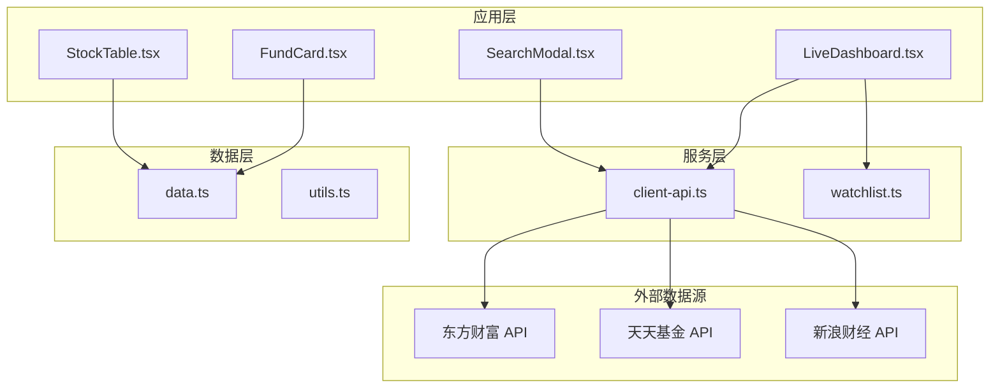

**图表来源**
- [components/LiveDashboard.tsx:1-375](file://components/LiveDashboard.tsx#L1-L375)
- [lib/client-api.ts:1-596](file://lib/client-api.ts#L1-L596)
- [lib/data.ts:1-255](file://lib/data.ts#L1-L255)

**章节来源**
- [README.md:132-161](file://README.md#L132-L161)
- [components/LiveDashboard.tsx:1-375](file://components/LiveDashboard.tsx#L1-L375)

## 核心组件

### 数据模型定义

系统定义了完整的数据模型来确保类型安全和数据一致性：

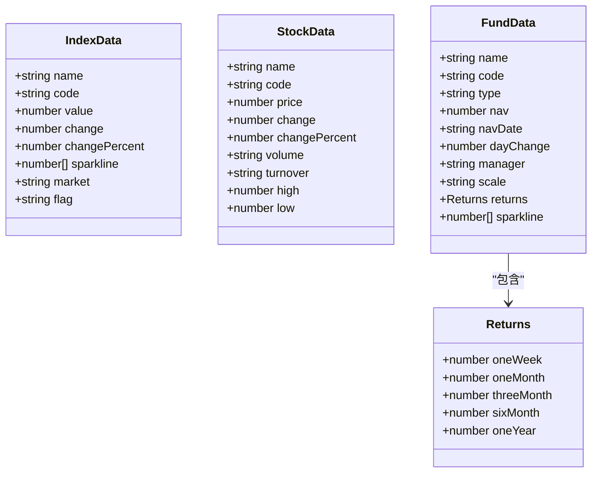

**图表来源**
- [lib/data.ts:1-41](file://lib/data.ts#L1-L41)

### 搜索结果接口

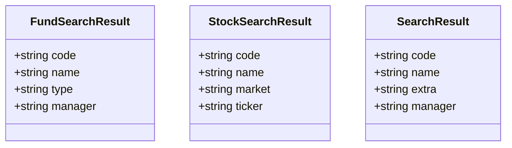

**图表来源**
- [lib/client-api.ts:350-362](file://lib/client-api.ts#L350-L362)
- [components/SearchModal.tsx:8-13](file://components/SearchModal.tsx#L8-L13)

**章节来源**
- [lib/data.ts:1-255](file://lib/data.ts#L1-L255)
- [lib/client-api.ts:350-362](file://lib/client-api.ts#L350-L362)

## 架构概览

系统采用分层架构设计，实现了清晰的关注点分离：

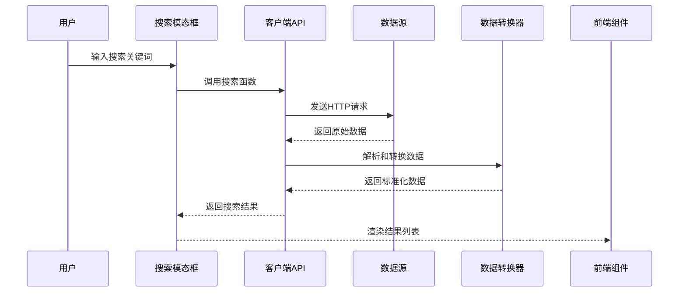

**图表来源**
- [components/SearchModal.tsx:47-77](file://components/SearchModal.tsx#L47-L77)
- [lib/client-api.ts:364-417](file://lib/client-api.ts#L364-L417)

系统的核心流程包括：

1. **搜索触发**：用户在搜索模态框中输入关键词
2. **数据获取**：通过 JSONP 方式从多个数据源获取数据
3. **数据解析**：解析原始数据并提取所需字段
4. **数据转换**：将数据转换为组件可用的格式
5. **数据渲染**：将转换后的数据传递给前端组件

## 详细组件分析

### 搜索API实现

#### 基金搜索功能

基金搜索功能实现了智能的关键词匹配和类型推断：

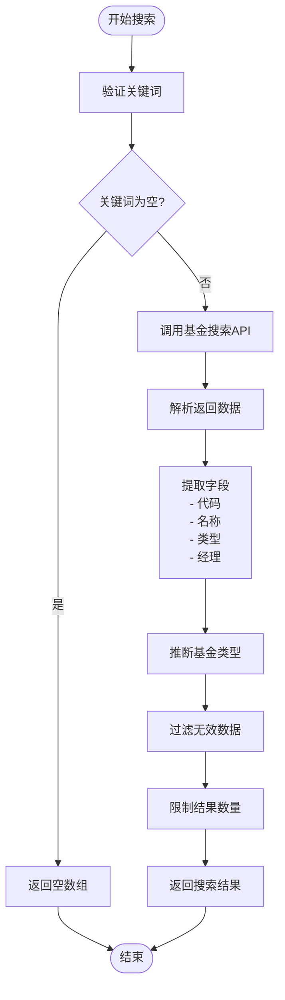

**图表来源**
- [lib/client-api.ts:364-379](file://lib/client-api.ts#L364-L379)

基金类型推断逻辑基于名称中的关键词：

| 关键词 | 基金类型 |
|--------|----------|
| 混合 | 混合型 |
| 股票 | 股票型 |
| 债券 | 债券型 |
| 指数 | 指数型 |
| ETF联接 | 指数型 |
| QDII | QDII |
| FOF | FOF |
| 货币 | 货币型 |

#### 股票搜索功能

股票搜索功能提供了多市场的支持和智能映射：

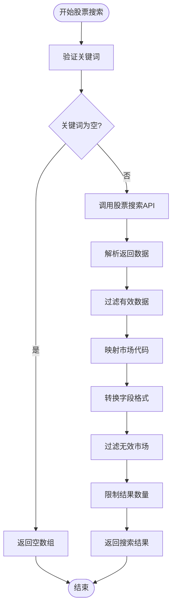

**图表来源**
- [lib/client-api.ts:381-417](file://lib/client-api.ts#L381-L417)

市场代码映射表：

| 市场代码 | 市场名称 | 说明 |
|----------|----------|------|
| 0 | 深A | 深圳A股 |
| 1 | 沪A | 上海A股 |
| 116 | 港股 | 港股（深港通） |
| 128 | 港股 | 港股（沪港通） |
| 105 | 美股 | 美股（纽交所） |
| 106 | 美股 | 美股（纳斯达克） |
| 107 | 美股 | 美股（AMEX） |
| 129 | 日股 | 日经225 |
| 130 | 日股 | 日经225 |
| 131 | 韩股 | 韩国综合指数 |
| 132 | 韩股 | 韩国综合指数 |

#### 数据转换和验证机制

系统实现了多层次的数据验证和转换：

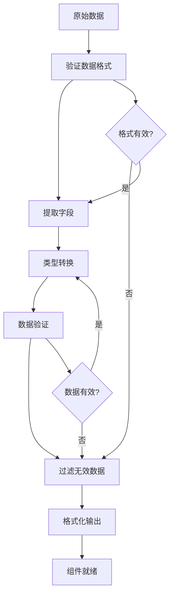

**图表来源**
- [lib/client-api.ts:203-240](file://lib/client-api.ts#L203-L240)
- [lib/client-api.ts:421-458](file://lib/client-api.ts#L421-L458)

### 搜索模态框组件

搜索模态框实现了完整的搜索交互流程：

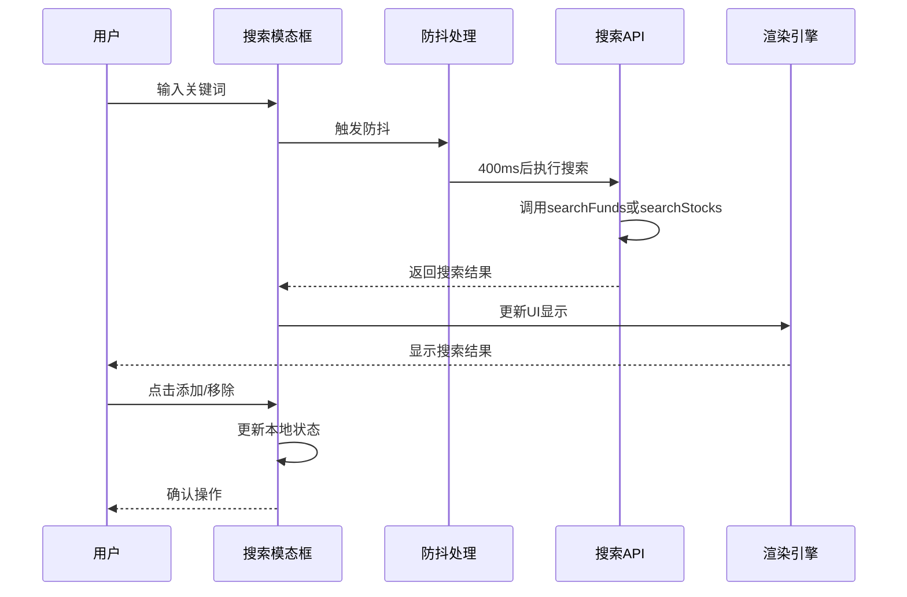

**图表来源**
- [components/SearchModal.tsx:47-77](file://components/SearchModal.tsx#L47-L77)
- [components/SearchModal.tsx:137-181](file://components/SearchModal.tsx#L137-L181)

### 数据持久化和状态管理

系统使用 localStorage 实现数据持久化：

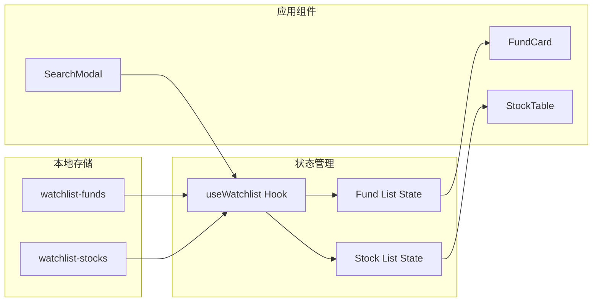

**图表来源**
- [lib/watchlist.ts:16-89](file://lib/watchlist.ts#L16-L89)

**章节来源**
- [lib/client-api.ts:364-417](file://lib/client-api.ts#L364-L417)
- [components/SearchModal.tsx:1-210](file://components/SearchModal.tsx#L1-L210)
- [lib/watchlist.ts:1-89](file://lib/watchlist.ts#L1-L89)

## 依赖关系分析

系统的主要依赖关系如下：

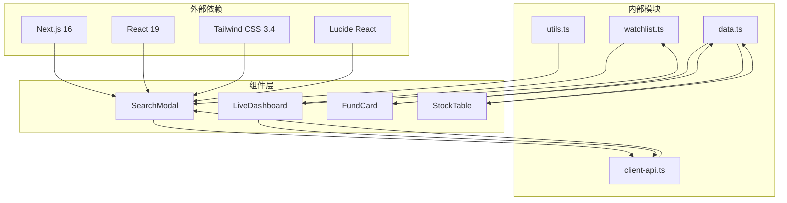

**图表来源**
- [README.md:67-76](file://README.md#L67-L76)
- [components/LiveDashboard.tsx:35-37](file://components/LiveDashboard.tsx#L35-L37)

### 数据流依赖

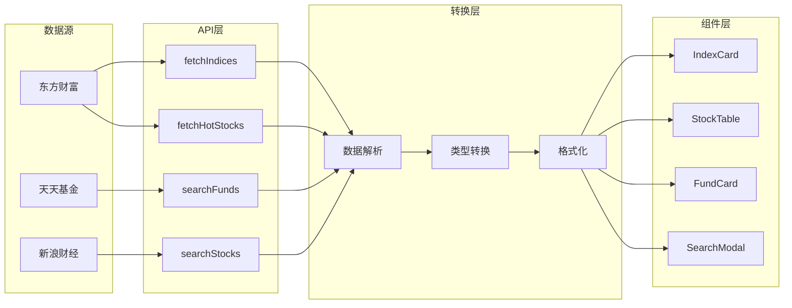

**图表来源**
- [lib/client-api.ts:154-199](file://lib/client-api.ts#L154-L199)
- [lib/client-api.ts:203-240](file://lib/client-api.ts#L203-L240)

**章节来源**
- [lib/client-api.ts:1-596](file://lib/client-api.ts#L1-L596)
- [components/LiveDashboard.tsx:1-375](file://components/LiveDashboard.tsx#L1-L375)

## 性能考虑

### 搜索性能优化

1. **防抖机制**：搜索输入采用400ms防抖，减少不必要的API调用
2. **结果限制**：基金搜索限制前15个结果，股票搜索限制20个结果
3. **并发处理**：使用Promise.allSettled并行获取多个数据源
4. **缓存策略**：利用localStorage避免重复加载相同数据

### 数据转换优化

1. **批量处理**：支持批量获取股票和基金数据，减少API调用次数
2. **类型转换**：在单次遍历中完成类型转换和格式化
3. **内存管理**：及时清理JSONP回调函数和脚本节点
4. **错误恢复**：每个API调用都有独立的错误处理和降级策略

### 前端渲染优化

1. **虚拟滚动**：对于大量数据使用虚拟滚动技术
2. **懒加载**：图片和图表采用懒加载策略
3. **状态最小化**：只在必要时更新组件状态
4. **事件节流**：滚动和窗口大小变化事件进行节流处理

## 故障排除指南

### 常见问题和解决方案

#### 搜索无结果

**问题**：搜索关键词无法返回任何结果
**可能原因**：
1. 关键词为空或只包含空白字符
2. 数据源API暂时不可用
3. 网络连接问题

**解决方法**：
1. 检查输入的关键词是否有效
2. 确认网络连接正常
3. 查看浏览器控制台的错误信息

#### 数据转换错误

**问题**：搜索结果显示异常或数据格式错误
**可能原因**：
1. API返回的数据格式发生变化
2. 字段映射规则不正确
3. 类型转换失败

**解决方法**：
1. 检查API响应格式
2. 更新字段映射规则
3. 添加类型检查和默认值处理

#### 性能问题

**问题**：页面加载缓慢或搜索响应慢
**可能原因**：
1. API调用过多
2. 数据处理复杂度过高
3. 内存泄漏

**解决方法**：
1. 实施更严格的防抖和去重机制
2. 优化数据处理算法
3. 使用性能分析工具检测内存泄漏

### 错误处理策略

系统采用了多层次的错误处理策略：

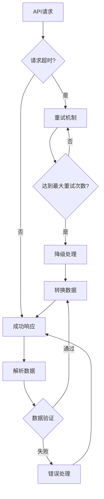

**图表来源**
- [lib/client-api.ts:5-36](file://lib/client-api.ts#L5-L36)
- [lib/client-api.ts:364-379](file://lib/client-api.ts#L364-L379)

**章节来源**
- [lib/client-api.ts:5-36](file://lib/client-api.ts#L5-L36)
- [lib/client-api.ts:364-379](file://lib/client-api.ts#L364-L379)

## 结论

该搜索数据转换系统实现了从多个金融数据源到组件可用格式的完整转换流程。系统具有以下特点：

1. **模块化设计**：清晰的分层架构，职责分离明确
2. **类型安全**：完整的TypeScript类型定义，确保数据一致性
3. **性能优化**：防抖、缓存、并发处理等多种优化策略
4. **错误处理**：多层次的错误处理和降级机制
5. **用户体验**：流畅的搜索体验和直观的结果展示

系统通过JSONP方式实现了与多个金融数据源的集成，提供了基金和股票的搜索功能，支持多市场的识别和转换。搜索结果经过严格的数据验证和格式化，最终以统一的数据结构提供给前端组件使用。

未来可以进一步优化的方向包括：实现更智能的搜索算法、增加搜索历史记录、提供搜索结果的排序和筛选功能、以及增强数据缓存策略等。