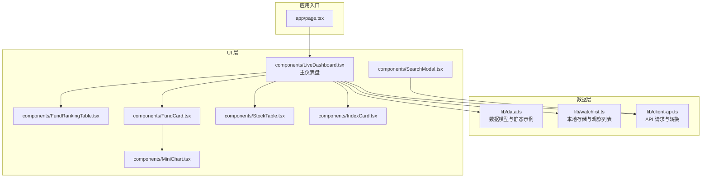
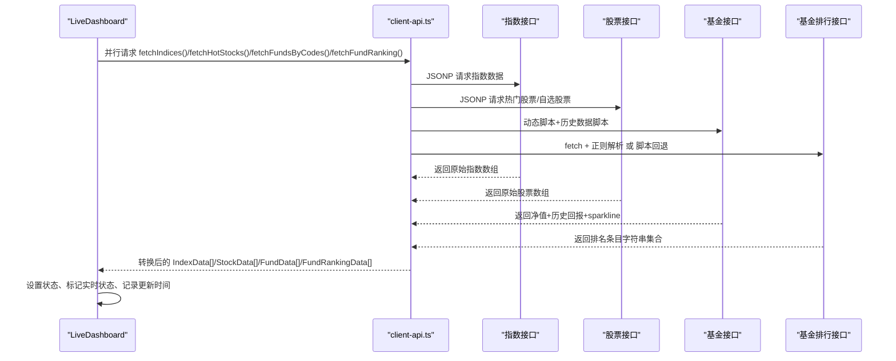
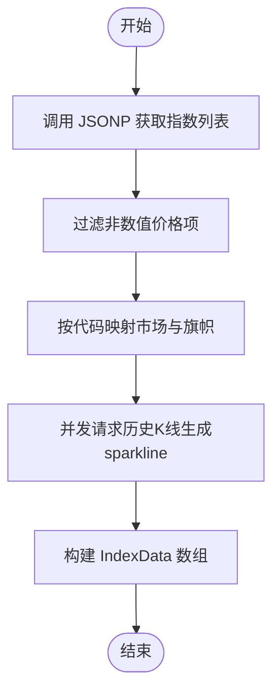
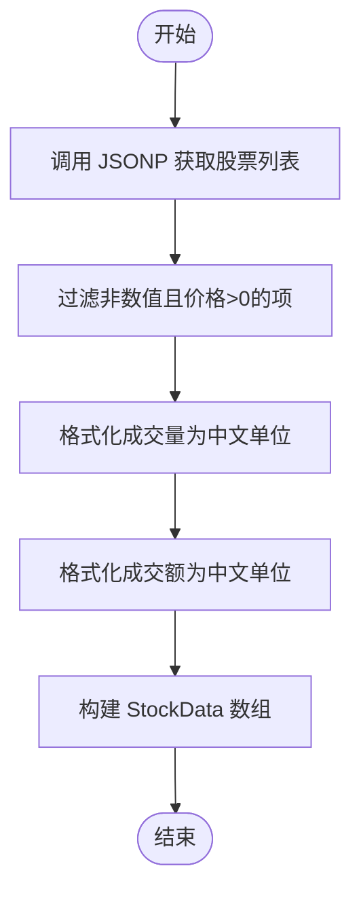
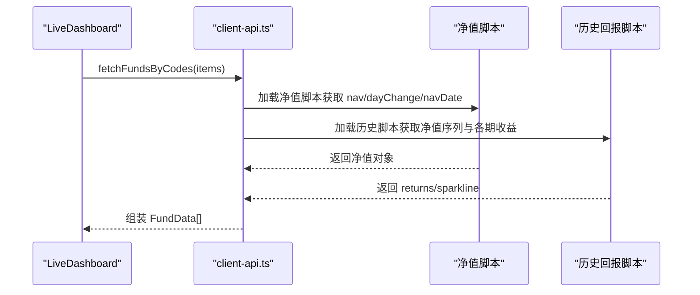
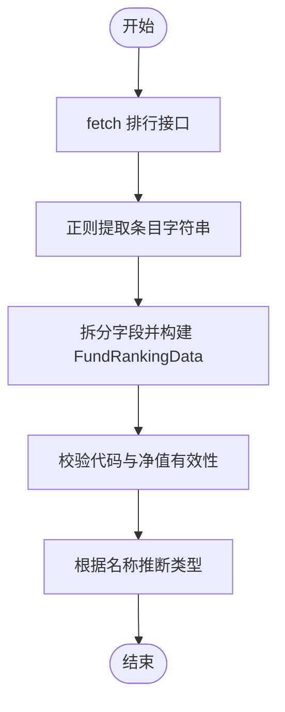
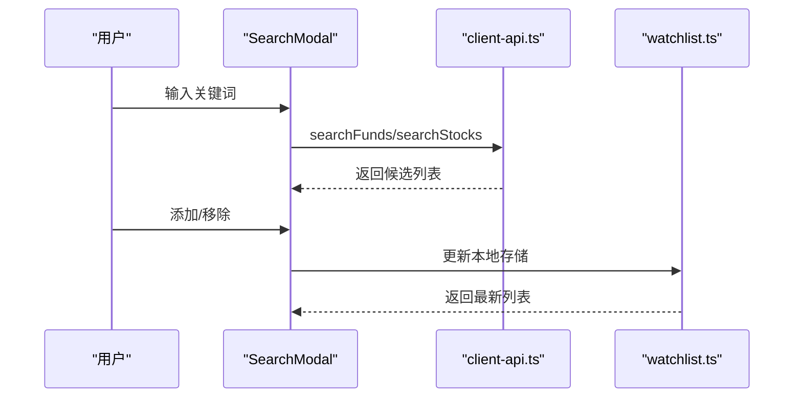
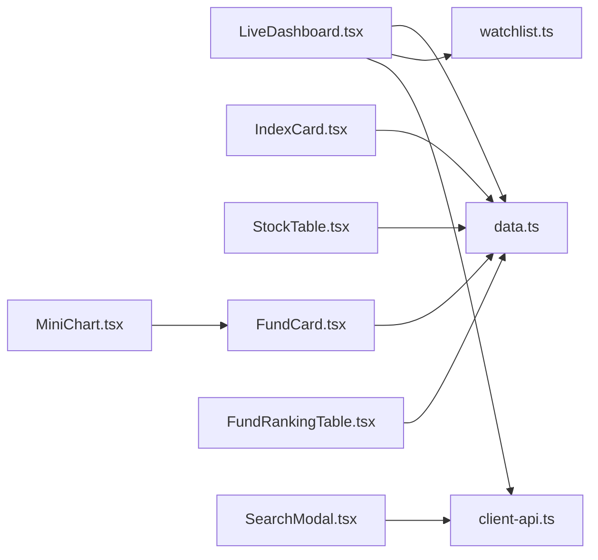

# 数据转换管道

<cite>
**本文引用的文件**
- [lib/data.ts](file://lib/data.ts)
- [lib/client-api.ts](file://lib/client-api.ts)
- [lib/watchlist.ts](file://lib/watchlist.ts)
- [components/LiveDashboard.tsx](file://components/LiveDashboard.tsx)
- [components/IndexCard.tsx](file://components/IndexCard.tsx)
- [components/StockTable.tsx](file://components/StockTable.tsx)
- [components/FundCard.tsx](file://components/FundCard.tsx)
- [components/FundRankingTable.tsx](file://components/FundRankingTable.tsx)
- [components/MiniChart.tsx](file://components/MiniChart.tsx)
- [components/SearchModal.tsx](file://components/SearchModal.tsx)
- [app/page.tsx](file://app/page.tsx)
</cite>

## 目录
1. [简介](#简介)
2. [项目结构](#项目结构)
3. [核心组件](#核心组件)
4. [架构总览](#架构总览)
5. [详细组件分析](#详细组件分析)
6. [依赖关系分析](#依赖关系分析)
7. [性能考量](#性能考量)
8. [故障排查指南](#故障排查指南)
9. [结论](#结论)
10. [附录](#附录)

## 简介
本文件系统性梳理该 Next.js 应用的数据转换管道，覆盖从原始 API 响应到组件可用数据的完整链路。重点包括：
- 指数数据、股票数据、基金数据与排名数据的解析与转换
- 数据清洗与验证（空值处理、格式标准化、数据类型转换）
- 数据聚合与计算（收益率计算、成交量/成交额格式化、图表数据准备）
- 缓存策略与性能优化（去重、增量更新、内存管理）
- 错误处理与降级策略
- 测试与质量保障方法

## 项目结构
该项目采用按功能模块组织的前端结构，核心数据层位于 lib 目录，UI 组件位于 components 目录，页面入口在 app 目录。

**图表来源**
- [app/page.tsx:10-23](file://app/page.tsx#L10-L23)
- [lib/data.ts:1-255](file://lib/data.ts#L1-L255)
- [lib/client-api.ts:1-596](file://lib/client-api.ts#L1-L596)
- [lib/watchlist.ts:1-89](file://lib/watchlist.ts#L1-L89)
- [components/LiveDashboard.tsx:39-301](file://components/LiveDashboard.tsx#L39-L301)
- [components/IndexCard.tsx:1-53](file://components/IndexCard.tsx#L1-L53)
- [components/StockTable.tsx:1-144](file://components/StockTable.tsx#L1-L144)
- [components/FundCard.tsx:1-132](file://components/FundCard.tsx#L1-L132)
- [components/FundRankingTable.tsx:1-191](file://components/FundRankingTable.tsx#L1-L191)
- [components/MiniChart.tsx:1-57](file://components/MiniChart.tsx#L1-L57)
- [components/SearchModal.tsx:1-210](file://components/SearchModal.tsx#L1-L210)

**章节来源**
- [app/page.tsx:10-23](file://app/page.tsx#L10-L23)
- [lib/data.ts:1-255](file://lib/data.ts#L1-L255)
- [lib/client-api.ts:1-596](file://lib/client-api.ts#L1-L596)
- [lib/watchlist.ts:1-89](file://lib/watchlist.ts#L1-L89)
- [components/LiveDashboard.tsx:39-301](file://components/LiveDashboard.tsx#L39-L301)

## 核心组件
- 数据模型与静态示例：定义指数、股票、基金、基金排名等数据接口，并提供部分静态示例用于开发调试。
- API 层：封装 JSONP、脚本加载、fetch 等请求方式，统一解析来自不同源的数据，完成字段映射、类型转换与格式化。
- 观察列表：基于 localStorage 的用户自选列表，支持增删与持久化。
- UI 组件：负责展示与交互，同时进行必要的数据格式化与可视化准备。

**章节来源**
- [lib/data.ts:1-255](file://lib/data.ts#L1-L255)
- [lib/client-api.ts:1-596](file://lib/client-api.ts#L1-L596)
- [lib/watchlist.ts:1-89](file://lib/watchlist.ts#L1-L89)

## 架构总览
数据流从 API 层开始，经过清洗与转换后进入 UI 组件；组件内部再进行二次格式化与渲染。

**图表来源**
- [components/LiveDashboard.tsx:56-95](file://components/LiveDashboard.tsx#L56-L95)
- [lib/client-api.ts:154-199](file://lib/client-api.ts#L154-L199)
- [lib/client-api.ts:203-240](file://lib/client-api.ts#L203-L240)
- [lib/client-api.ts:462-523](file://lib/client-api.ts#L462-L523)
- [lib/client-api.ts:527-595](file://lib/client-api.ts#L527-L595)

## 详细组件分析

### 指数数据转换（IndexData）
- 来源：通过 JSONP 请求统一行情接口，返回包含多只指数的数组。
- 清洗与验证：
  - 过滤掉非数值价格项，确保 f2 为数字。
  - 通过索引元信息表映射市场与旗帜标识。
  - 可选生成折线图数据（sparkline），失败不影响主数据。
- 数据类型转换：
  - 将字符串分隔后的字段转换为 number。
  - 计算涨跌百分比与绝对值。
- 图表数据准备：
  - 使用历史 K 线最后若干点构造 sparkline，供 IndexCard 与 MiniChart 使用。

**图表来源**
- [lib/client-api.ts:154-199](file://lib/client-api.ts#L154-L199)
- [lib/client-api.ts:88-136](file://lib/client-api.ts#L88-L136)

**章节来源**
- [lib/client-api.ts:154-199](file://lib/client-api.ts#L154-L199)
- [components/IndexCard.tsx:12-48](file://components/IndexCard.tsx#L12-L48)
- [components/MiniChart.tsx:9-31](file://components/MiniChart.tsx#L9-L31)

### 股票数据转换（StockData）
- 来源：热门股票与自选股票均通过统一 JSONP 接口获取。
- 清洗与验证：
  - 过滤非数值价格项，确保 f2 > 0。
  - 对成交量与成交额进行人性化格式化（单位转换与单位标注）。
- 数据类型转换：
  - 将 f5、f6 等字段转换为数字，再格式化为“手”、“万手”、“亿”等字符串。
  - 高低点字段缺失时回退为 0。
- 表格排序与展示：
  - 支持按现价、涨跌幅、成交额排序，内部使用 parseFloat 处理成交额比较。

**图表来源**
- [lib/client-api.ts:203-240](file://lib/client-api.ts#L203-L240)
- [lib/client-api.ts:421-458](file://lib/client-api.ts#L421-L458)
- [components/StockTable.tsx:14-25](file://components/StockTable.tsx#L14-L25)

**章节来源**
- [lib/client-api.ts:203-240](file://lib/client-api.ts#L203-L240)
- [lib/client-api.ts:421-458](file://lib/client-api.ts#L421-L458)
- [components/StockTable.tsx:10-144](file://components/StockTable.tsx#L10-L144)

### 基金数据转换（FundData）
- 来源：净值与历史回报分别通过动态脚本与历史数据脚本获取。
- 清洗与验证：
  - 若任一来源为空则跳过该基金。
  - 基金类型通过名称关键字推断。
- 数据聚合与计算：
  - 周收益：基于历史净值序列计算最近一周相对收益。
  - 多期收益：从历史脚本中提取近1/3/6/12个月收益。
  - Sparkline：取最近15天净值序列。
- 数据类型转换：
  - 将字符串解析为数字，日期字符串保留原样。
- 组件展示：
  - FundCard 支持切换日/周/月/年等周期收益显示，并绘制迷你折线图。

**图表来源**
- [lib/client-api.ts:462-523](file://lib/client-api.ts#L462-L523)
- [lib/client-api.ts:253-290](file://lib/client-api.ts#L253-L290)
- [lib/client-api.ts:292-346](file://lib/client-api.ts#L292-L346)
- [components/FundCard.tsx:19-131](file://components/FundCard.tsx#L19-L131)
- [components/MiniChart.tsx:9-31](file://components/MiniChart.tsx#L9-L31)

**章节来源**
- [lib/client-api.ts:462-523](file://lib/client-api.ts#L462-L523)
- [lib/client-api.ts:253-290](file://lib/client-api.ts#L253-L290)
- [lib/client-api.ts:292-346](file://lib/client-api.ts#L292-L346)
- [components/FundCard.tsx:19-131](file://components/FundCard.tsx#L19-L131)

### 基金排名数据转换（FundRankingData）
- 来源：通过 fetch + 正则解析或脚本回退方式获取。
- 清洗与验证：
  - 解析出的条目以逗号分隔，需校验首字段为6位基金代码且净值大于0。
  - 无法解析时尝试脚本回退。
- 数据类型转换：
  - 将字符串收益字段转换为数字。
  - 基金类型通过名称关键字推断。
- 组件展示：
  - FundRankingTable 支持按日/周/月/年等周期排序与高亮。

**图表来源**
- [lib/client-api.ts:527-595](file://lib/client-api.ts#L527-L595)

**章节来源**
- [lib/client-api.ts:527-595](file://lib/client-api.ts#L527-L595)
- [components/FundRankingTable.tsx:10-191](file://components/FundRankingTable.tsx#L10-L191)

### 搜索与观察列表
- 搜索：
  - 基金搜索：支持名称/代码模糊查询，返回候选列表。
  - 股票搜索：支持名称/代码模糊查询，返回带市场与代码的候选列表。
- 观察列表：
  - 基金与股票分别维护独立列表，支持去重添加与移除。
  - 使用 localStorage 持久化，兼容旧格式（仅字符串数组）。

**图表来源**
- [components/SearchModal.tsx:24-210](file://components/SearchModal.tsx#L24-L210)
- [lib/client-api.ts:364-417](file://lib/client-api.ts#L364-L417)
- [lib/watchlist.ts:28-89](file://lib/watchlist.ts#L28-L89)

**章节来源**
- [components/SearchModal.tsx:24-210](file://components/SearchModal.tsx#L24-L210)
- [lib/client-api.ts:364-417](file://lib/client-api.ts#L364-L417)
- [lib/watchlist.ts:28-89](file://lib/watchlist.ts#L28-L89)

## 依赖关系分析
- 组件依赖：
  - LiveDashboard 依赖 client-api 与 watchlist，组合数据模型与 UI 组件。
  - 各 UI 组件依赖数据模型与工具函数，负责最终渲染。
- 数据依赖：
  - client-api 依赖 JSONP 与脚本加载机制，统一处理跨域与第三方接口差异。
  - 数据模型定义了各组件的输入规范，确保类型安全。

**图表来源**
- [components/LiveDashboard.tsx:39-301](file://components/LiveDashboard.tsx#L39-L301)
- [lib/client-api.ts:1-596](file://lib/client-api.ts#L1-L596)
- [lib/watchlist.ts:1-89](file://lib/watchlist.ts#L1-L89)
- [lib/data.ts:1-255](file://lib/data.ts#L1-L255)
- [components/IndexCard.tsx:1-53](file://components/IndexCard.tsx#L1-L53)
- [components/StockTable.tsx:1-144](file://components/StockTable.tsx#L1-L144)
- [components/FundCard.tsx:1-132](file://components/FundCard.tsx#L1-L132)
- [components/FundRankingTable.tsx:1-191](file://components/FundRankingTable.tsx#L1-L191)
- [components/MiniChart.tsx:1-57](file://components/MiniChart.tsx#L1-L57)
- [components/SearchModal.tsx:1-210](file://components/SearchModal.tsx#L1-L210)

**章节来源**
- [components/LiveDashboard.tsx:39-301](file://components/LiveDashboard.tsx#L39-L301)
- [lib/client-api.ts:1-596](file://lib/client-api.ts#L1-L596)
- [lib/watchlist.ts:1-89](file://lib/watchlist.ts#L1-L89)
- [lib/data.ts:1-255](file://lib/data.ts#L1-L255)

## 性能考量
- 并发请求与去重：
  - 主界面使用 Promise.allSettled 并发拉取多类数据，避免串行等待。
  - 观察列表去重添加，避免重复请求同一代码。
- 增量更新与实时刷新：
  - 主界面每 30 秒轮询一次，优先使用真实数据，否则回退到模拟数据。
  - 股票与基金列表长度为 0 时不发起请求，减少无效网络开销。
- 内存管理：
  - 组件内部对数组进行浅拷贝后再排序，避免直接修改引用。
  - 图表数据仅在需要时生成，MiniChart 对变化率进行归一化，避免大数值导致 SVG 渲染异常。
- 缓存策略：
  - 本地存储用于观察列表，避免每次刷新丢失用户配置。
  - 搜索结果采用防抖（400ms）降低频繁请求。

**章节来源**
- [components/LiveDashboard.tsx:56-95](file://components/LiveDashboard.tsx#L56-L95)
- [lib/client-api.ts:421-458](file://lib/client-api.ts#L421-L458)
- [components/StockTable.tsx:14-25](file://components/StockTable.tsx#L14-L25)
- [components/MiniChart.tsx:9-31](file://components/MiniChart.tsx#L9-L31)
- [components/SearchModal.tsx:47-77](file://components/SearchModal.tsx#L47-L77)
- [lib/watchlist.ts:53-85](file://lib/watchlist.ts#L53-L85)

## 故障排查指南
- JSONP 超时/失败：
  - JSONP 包装器设置超时与清理逻辑，失败时返回空数组，避免阻塞后续流程。
- 脚本加载失败：
  - 动态脚本加载与历史数据脚本均设置超时与清理，失败时返回 null，调用方进行空值判断。
- fetch 排行回退：
  - 当 fetch + 正则解析失败时，尝试脚本回退，提升成功率。
- UI 回退策略：
  - API 返回空数组时，主界面仍可使用内置模拟数据，保证基本体验。
- 错误日志：
  - 关键 API 调用处打印错误日志，便于定位问题。

**章节来源**
- [lib/client-api.ts:5-36](file://lib/client-api.ts#L5-L36)
- [lib/client-api.ts:527-595](file://lib/client-api.ts#L527-L595)
- [components/LiveDashboard.tsx:90-95](file://components/LiveDashboard.tsx#L90-L95)

## 结论
该数据转换管道通过统一的 API 层实现对多源异构数据的标准化处理，结合 UI 组件的二次格式化与可视化，形成从原始响应到组件可用数据的完整闭环。其设计强调：
- 类型安全与数据模型先行
- 清洗与验证的健壮性
- 并发与增量更新的性能优化
- 失败回退与降级策略
- 用户观察列表的本地持久化

## 附录

### 数据模型与字段说明
- 指数数据（IndexData）
  - 字段：名称、代码、数值、涨跌、涨跌幅、市场、旗帜、可选折线图数据
- 股票数据（StockData）
  - 字段：名称、代码、现价、涨跌、涨跌幅、成交量（中文单位）、成交额（中文单位）、最高、最低
- 基金数据（FundData）
  - 字段：名称、代码、类型、净值、净值日期、日涨跌、可选经理、可选规模、可选多期收益、可选折线图
- 基金排名（FundRankingData）
  - 字段：名称、代码、类型、净值、净值日期、日/周/月/3月/6月/1年/2年涨跌幅

**章节来源**
- [lib/data.ts:1-255](file://lib/data.ts#L1-L255)

### 转换流程要点清单
- 指数：过滤数值、映射市场与旗帜、可选生成 sparkline
- 股票：过滤有效价格、格式化成交量/成交额、高低价缺省为0
- 基金：净值与历史回报合并、计算周收益、生成多期收益与sparkline
- 排行：正则解析或脚本回退、校验代码与净值、推断类型
- 组件：二次格式化（表格排序、图标颜色、迷你图）

**章节来源**
- [lib/client-api.ts:154-199](file://lib/client-api.ts#L154-L199)
- [lib/client-api.ts:203-240](file://lib/client-api.ts#L203-L240)
- [lib/client-api.ts:462-523](file://lib/client-api.ts#L462-L523)
- [lib/client-api.ts:527-595](file://lib/client-api.ts#L527-L595)
- [components/StockTable.tsx:14-25](file://components/StockTable.tsx#L14-L25)
- [components/FundCard.tsx:19-131](file://components/FundCard.tsx#L19-L131)
- [components/MiniChart.tsx:9-31](file://components/MiniChart.tsx#L9-L31)