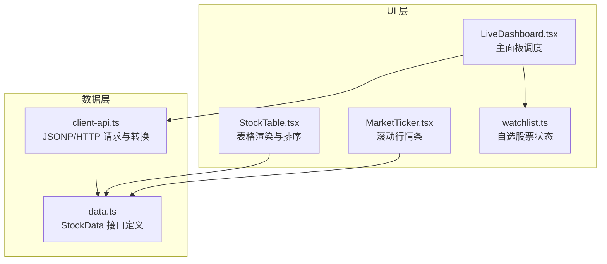
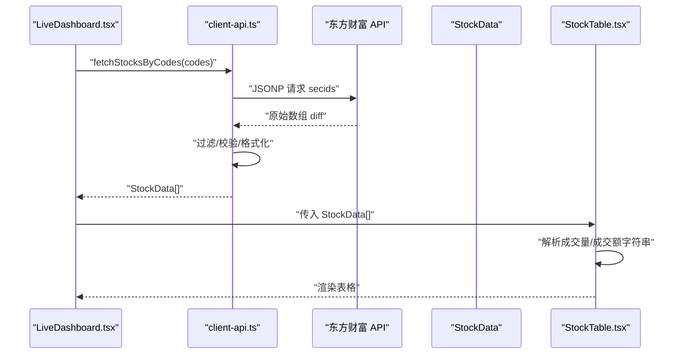
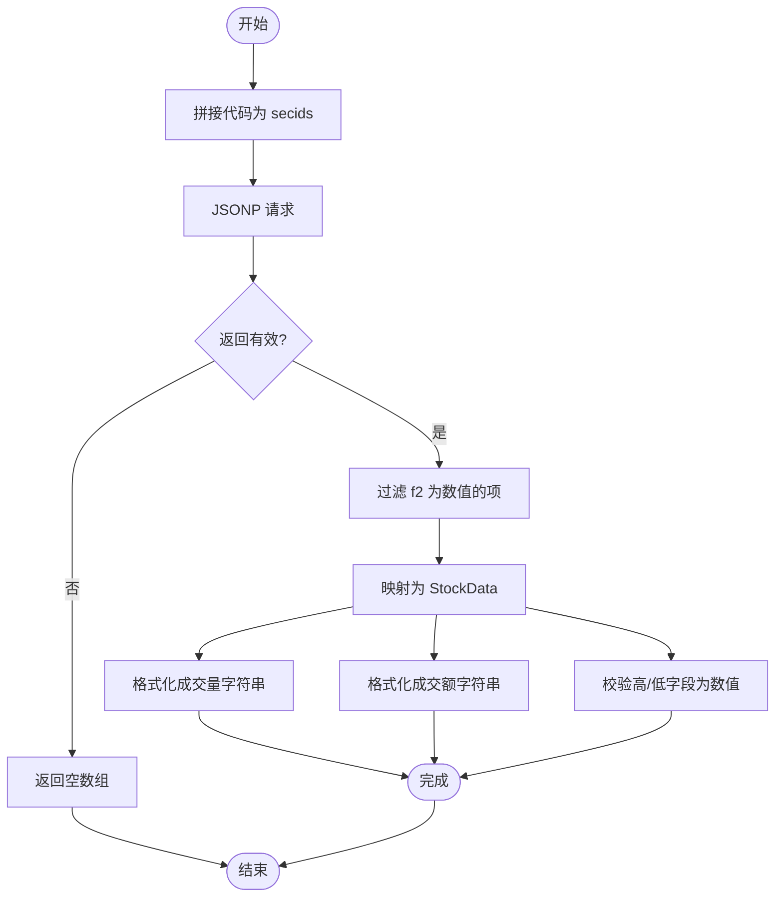
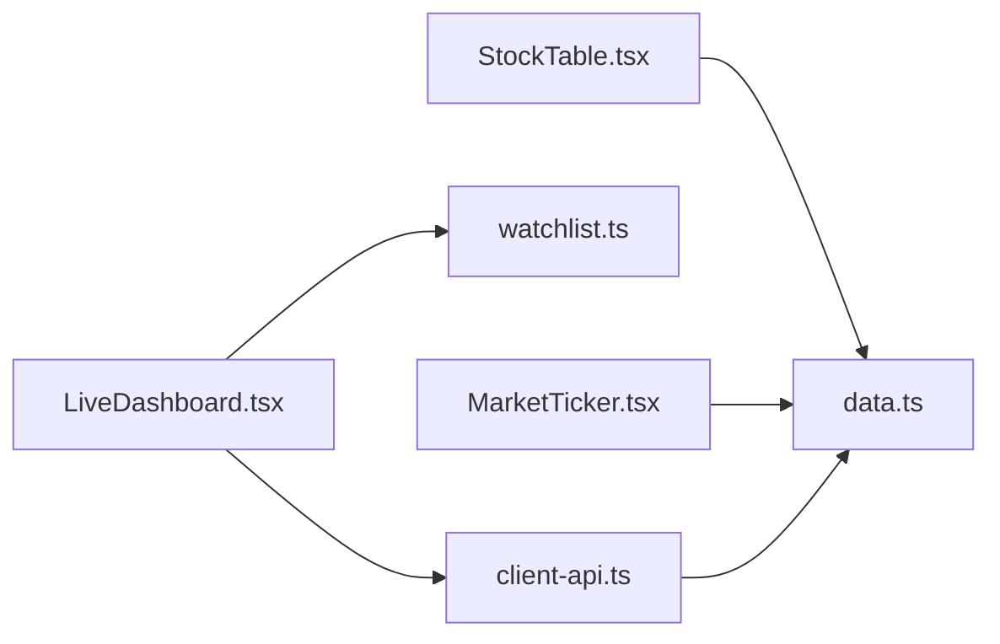

# 股票数据转换

<cite>
**本文引用的文件**
- [client-api.ts](file://lib/client-api.ts)
- [data.ts](file://lib/data.ts)
- [StockTable.tsx](file://components/StockTable.tsx)
- [LiveDashboard.tsx](file://components/LiveDashboard.tsx)
- [watchlist.ts](file://lib/watchlist.ts)
- [MarketTicker.tsx](file://components/MarketTicker.tsx)
- [README.md](file://README.md)
</cite>

## 目录
1. [简介](#简介)
2. [项目结构](#项目结构)
3. [核心组件](#核心组件)
4. [架构总览](#架构总览)
5. [详细组件分析](#详细组件分析)
6. [依赖关系分析](#依赖关系分析)
7. [性能考量](#性能考量)
8. [故障排查指南](#故障排查指南)
9. [结论](#结论)
10. [附录](#附录)

## 简介
本文件聚焦“股票数据转换”主题，系统性梳理从东方财富 API 获取的原始股票数据到组件可用格式的完整转换流程。内容涵盖：
- 字段解析与转换：名称、代码、价格、涨跌额、涨跌幅、成交量、成交额等
- 成交量与成交额格式化：大数转换、单位换算、字符串格式化
- 高低价字段处理与验证
- 批量股票数据获取：多股票代码组合查询与结果解析
- 数据过滤与验证：数值有效性检查与空值处理
- 错误处理与降级策略：网络请求失败与默认值设置
- 性能优化建议与最佳实践

## 项目结构
该项目采用前端单页应用架构，数据层通过 JSONP 与 HTTP 请求对接东方财富等第三方接口，UI 层以 React 组件展示。与“股票数据转换”直接相关的模块如下：
- lib/client-api.ts：封装 JSONP 与 HTTP 请求，负责从东方财富 API 获取并转换为统一结构
- lib/data.ts：定义 StockData 等数据模型
- components/StockTable.tsx：展示股票数据，包含排序与格式化渲染
- components/LiveDashboard.tsx：主面板，调度多路数据拉取与聚合
- lib/watchlist.ts：自选股票列表的状态管理（用于批量查询）
- components/MarketTicker.tsx：滚动行情条，消费指数数据（辅助理解数据结构）

图表来源
- [client-api.ts:1-596](file://lib/client-api.ts#L1-L596)
- [data.ts:1-255](file://lib/data.ts#L1-L255)
- [StockTable.tsx:1-144](file://components/StockTable.tsx#L1-L144)
- [LiveDashboard.tsx:1-375](file://components/LiveDashboard.tsx#L1-L375)
- [watchlist.ts:1-89](file://lib/watchlist.ts#L1-L89)
- [MarketTicker.tsx:1-52](file://components/MarketTicker.tsx#L1-L52)

章节来源
- [README.md:132-161](file://README.md#L132-L161)

## 核心组件
- 数据模型 StockData：包含名称、代码、价格、涨跌额、涨跌幅、成交量（字符串）、成交额（字符串）、最高、最低等字段
- JSONP 工具：封装动态脚本注入、超时与清理逻辑
- 批量股票查询：按代码列表一次性拉取多只股票数据
- 热门股票查询：按成交额排序的热门个股
- 表格组件：对成交量/成交额进行解析排序，渲染涨跌样式

章节来源
- [data.ts:12-22](file://lib/data.ts#L12-L22)
- [client-api.ts:5-36](file://lib/client-api.ts#L5-L36)
- [client-api.ts:421-458](file://lib/client-api.ts#L421-L458)
- [client-api.ts:203-240](file://lib/client-api.ts#L203-L240)
- [StockTable.tsx:8-34](file://components/StockTable.tsx#L8-L34)

## 架构总览
下图展示从 API 到组件的数据流路径，以及关键转换节点。

图表来源
- [LiveDashboard.tsx:56-95](file://components/LiveDashboard.tsx#L56-L95)
- [client-api.ts:421-458](file://lib/client-api.ts#L421-L458)
- [StockTable.tsx:14-25](file://components/StockTable.tsx#L14-L25)

## 详细组件分析

### 1) JSONP 工具与超时控制
- 动态注入 script 标签，设置全局回调，实现跨域 JSONP 请求
- 超时与错误清理：10 秒超时、onerror 清理、DOM 移除
- 返回 Promise 包裹的解析结果，便于后续链式处理

章节来源
- [client-api.ts:5-36](file://lib/client-api.ts#L5-L36)

### 2) 批量股票数据获取与转换
- 输入：股票代码数组
- 请求：将代码拼接为 secids 参数，一次性请求
- 解析：过滤非数值价格项，计算涨跌额与涨跌幅，格式化成交量与成交额字符串
- 输出：StockData 数组

图表来源
- [client-api.ts:421-458](file://lib/client-api.ts#L421-L458)

章节来源
- [client-api.ts:421-458](file://lib/client-api.ts#L421-L458)

### 3) 热门股票数据获取与转换
- 请求：按成交额字段排序的热门个股
- 解析：与批量查询一致的字段映射与格式化逻辑
- 输出：StockData 数组（Top 10）

章节来源
- [client-api.ts:203-240](file://lib/client-api.ts#L203-L240)

### 4) 成交量与成交额格式化逻辑
- 成交量：单位“手”，大于等于 1 万时转“万手”，否则保留“手”
- 成交额：单位“元”，大于等于 1 亿时转“亿”，大于等于 1 万时转“万”，否则保留原值
- 字符串化：保留一位小数，末尾“0”省略（由 toFixed(1) 控制）

章节来源
- [client-api.ts:213-222](file://lib/client-api.ts#L213-L222)
- [client-api.ts:438-441](file://lib/client-api.ts#L438-L441)

### 5) 高低价字段处理与验证
- 高/低字段若非数值，回退为 0；确保后续渲染与排序安全
- 在批量查询与热门查询中均执行该校验

章节来源
- [client-api.ts:232-233](file://lib/client-api.ts#L232-L233)
- [client-api.ts:450-451](file://lib/client-api.ts#L450-L451)

### 6) 数据过滤与验证规则
- 价格 f2 必须为数值，否则过滤掉该条目
- 返回数组为空时，组件层使用空数组兜底，避免渲染异常
- 其他字段如 f6（成交额）与 f5（成交量）同样进行数值校验与格式化

章节来源
- [client-api.ts:211-211](file://lib/client-api.ts#L211-L211)
- [client-api.ts:430-430](file://lib/client-api.ts#L430-L430)

### 7) 错误处理与降级策略
- JSONP 超时/失败：捕获异常并返回空数组
- 网络请求失败：Promise.allSettled 并行调用中某项失败不影响其他项
- 默认值：高/低字段默认 0；空数组兜底；实时状态仅在成功返回时开启

章节来源
- [client-api.ts:24-32](file://lib/client-api.ts#L24-L32)
- [client-api.ts:195-198](file://lib/client-api.ts#L195-L198)
- [client-api.ts:454-457](file://lib/client-api.ts#L454-L457)
- [LiveDashboard.tsx:56-95](file://components/LiveDashboard.tsx#L56-L95)

### 8) 表格组件中的排序与渲染
- 支持按价格、涨跌幅、成交额排序
- 成交额排序时，先将字符串解析为数值再比较
- 涨跌幅正负决定颜色与图标
- 高/低字段以固定两位小数渲染

章节来源
- [StockTable.tsx:8-34](file://components/StockTable.tsx#L8-L34)
- [StockTable.tsx:14-25](file://components/StockTable.tsx#L14-L25)
- [StockTable.tsx:77-120](file://components/StockTable.tsx#L77-L120)

### 9) 主面板调度与自选列表
- 主面板并发拉取多路数据，包含指数、热门股票、自选股票、基金、排行榜
- 自选股票列表来源于 watchlist，按需触发批量查询
- 实时状态：仅当指数数据成功返回时标记为“实时”

章节来源
- [LiveDashboard.tsx:56-95](file://components/LiveDashboard.tsx#L56-L95)
- [watchlist.ts:28-88](file://lib/watchlist.ts#L28-L88)

## 依赖关系分析
- LiveDashboard.tsx 依赖 client-api.ts 的批量查询与热门查询
- StockTable.tsx 依赖 data.ts 的 StockData 接口
- watchlist.ts 提供自选股票列表，驱动批量查询
- MarketTicker.tsx 依赖 data.ts 的 IndexData 接口（用于理解数据结构）

图表来源
- [LiveDashboard.tsx:39-375](file://components/LiveDashboard.tsx#L39-L375)
- [client-api.ts:1-596](file://lib/client-api.ts#L1-L596)
- [StockTable.tsx:1-144](file://components/StockTable.tsx#L1-L144)
- [MarketTicker.tsx:1-52](file://components/MarketTicker.tsx#L1-L52)
- [watchlist.ts:1-89](file://lib/watchlist.ts#L1-L89)
- [data.ts:1-255](file://lib/data.ts#L1-L255)

## 性能考量
- 并发请求：主面板使用 Promise.allSettled 并行拉取多路数据，减少总等待时间
- 批量查询：单次请求返回多只股票数据，降低请求数量
- 本地存储：自选列表使用 localStorage 缓存，避免重复初始化
- 渲染优化：表格排序在内存中完成，避免重复渲染
- 超时与降级：JSONP 超时与失败快速返回，保证 UI 流畅

章节来源
- [LiveDashboard.tsx:56-95](file://components/LiveDashboard.tsx#L56-L95)
- [client-api.ts:421-458](file://lib/client-api.ts#L421-L458)
- [watchlist.ts:33-51](file://lib/watchlist.ts#L33-L51)

## 故障排查指南
- 现象：表格无数据或空白
  - 检查批量查询返回是否为空（可能因网络或参数问题）
  - 检查价格字段是否为数值（非数值会被过滤）
- 现象：涨跌幅颜色异常
  - 检查涨跌幅字段是否为数值，确保正负判断正确
- 现象：成交额排序异常
  - 检查成交额字符串格式是否符合预期（“亿”、“万”、“手”等）
- 现象：实时状态未启用
  - 检查指数数据返回是否成功，仅当成功时才标记为“实时”
- 现象：JSONP 超时
  - 检查网络环境与代理设置，确认跨域与回调函数名正确

章节来源
- [client-api.ts:24-32](file://lib/client-api.ts#L24-L32)
- [client-api.ts:454-457](file://lib/client-api.ts#L454-L457)
- [LiveDashboard.tsx:72-78](file://components/LiveDashboard.tsx#L72-L78)

## 结论
本项目通过 JSONP 与 HTTP 请求从东方财富 API 获取原始数据，经过严格的过滤、校验与格式化，最终输出统一的 StockData 结构供组件渲染。批量查询与并发调度提升了性能，错误处理与降级策略保障了用户体验。成交量与成交额的格式化逻辑清晰，高低价字段具备健壮的默认值处理，适合在生产环境中稳定运行。

## 附录

### A. 字段映射与转换要点
- 名称/代码：直接映射
- 价格：数值校验后使用
- 涨跌额：收盘价 - 开盘价
- 涨跌幅：开盘价非零时计算，否则为 0
- 成交量：单位“手”，≥1 万转“万手”
- 成交额：单位“元”，≥1 亿转“亿”，≥1 万转“万”
- 高/低：数值校验，非数值回退为 0

章节来源
- [client-api.ts:115-131](file://lib/client-api.ts#L115-L131)
- [client-api.ts:213-234](file://lib/client-api.ts#L213-L234)
- [client-api.ts:438-452](file://lib/client-api.ts#L438-L452)

### B. 数据模型定义
- StockData：名称、代码、价格、涨跌额、涨跌幅、成交量（字符串）、成交额（字符串）、最高、最低

章节来源
- [data.ts:12-22](file://lib/data.ts#L12-L22)