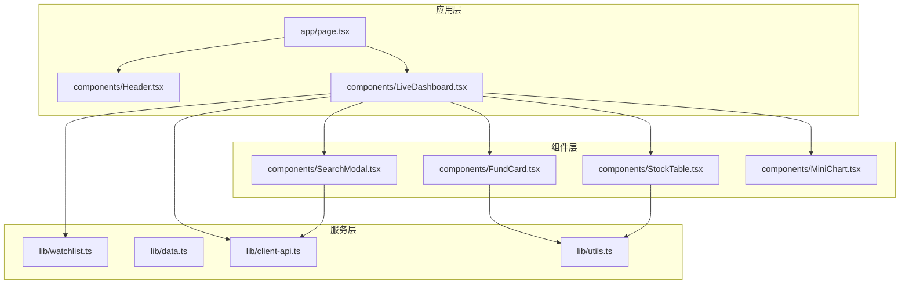
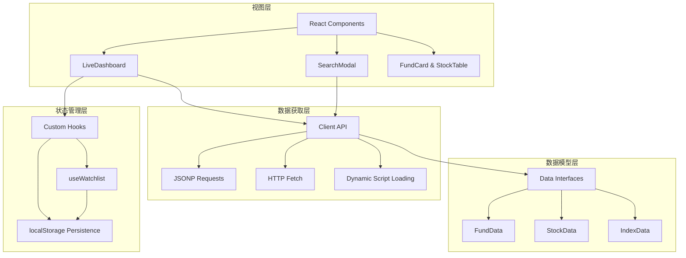
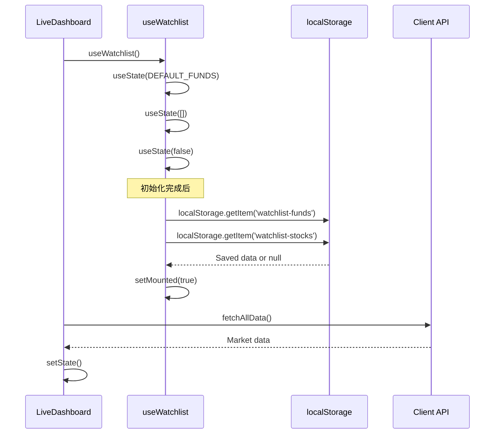
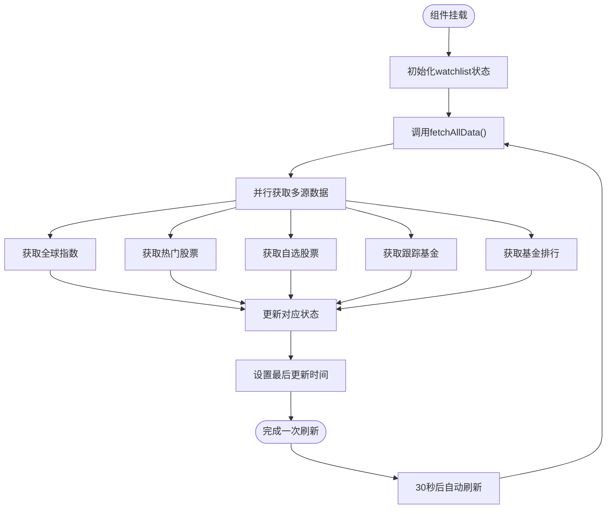
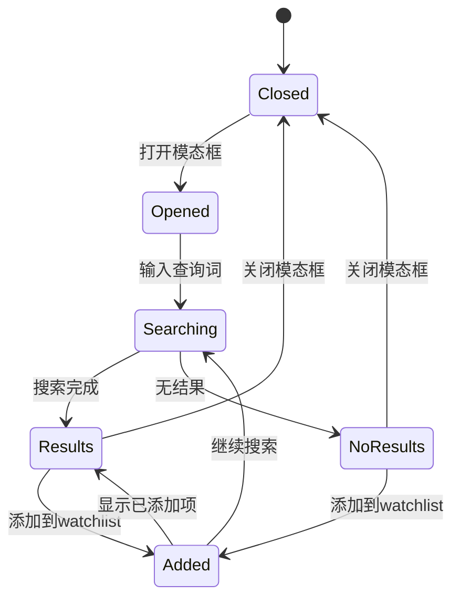
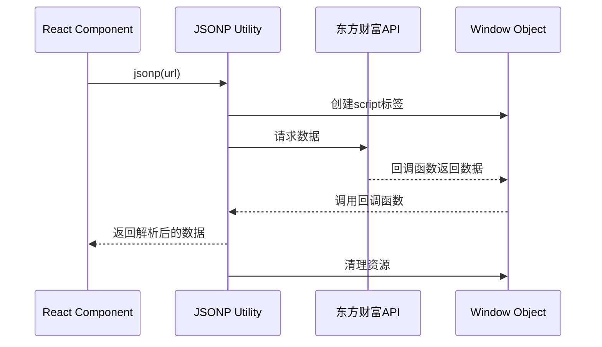
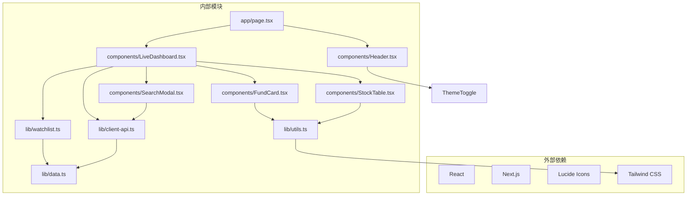
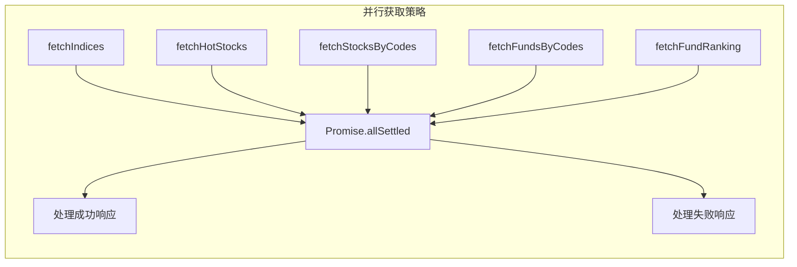

# 状态管理架构

<cite>
**本文档引用的文件**
- [lib/watchlist.ts](file://lib/watchlist.ts)
- [lib/data.ts](file://lib/data.ts)
- [lib/client-api.ts](file://lib/client-api.ts)
- [components/LiveDashboard.tsx](file://components/LiveDashboard.tsx)
- [components/SearchModal.tsx](file://components/SearchModal.tsx)
- [components/FundCard.tsx](file://components/FundCard.tsx)
- [components/StockTable.tsx](file://components/StockTable.tsx)
- [lib/utils.ts](file://lib/utils.ts)
- [app/page.tsx](file://app/page.tsx)
- [components/Header.tsx](file://components/Header.tsx)
- [components/MiniChart.tsx](file://components/MiniChart.tsx)
</cite>

## 目录
1. [简介](#简介)
2. [项目结构](#项目结构)
3. [核心组件](#核心组件)
4. [架构概览](#架构概览)
5. [详细组件分析](#详细组件分析)
6. [依赖关系分析](#依赖关系分析)
7. [性能考虑](#性能考虑)
8. [故障排除指南](#故障排除指南)
9. [最佳实践](#最佳实践)
10. [结论](#结论)

## 简介

本项目是一个基于Next.js的实时金融数据监控应用，专注于基金、股票和指数的实时追踪。系统采用React Hooks作为核心状态管理机制，实现了完整的前端状态管理架构，包括本地存储持久化、自定义Hook设计和异步数据获取。

该应用的核心特点是：
- 使用自定义Hook `useWatchlist` 管理用户偏好设置
- 实现localStorage持久化，确保页面刷新后用户数据不丢失
- 通过Promise.allSettled实现并行数据获取
- 支持手动刷新和定时自动刷新机制
- 提供完整的状态调试和故障排除方法

## 项目结构

项目采用按功能模块组织的结构，主要分为以下几个层次：



**图表来源**
- [app/page.tsx:1-24](file://app/page.tsx#L1-L24)
- [components/LiveDashboard.tsx:1-375](file://components/LiveDashboard.tsx#L1-L375)
- [lib/watchlist.ts:1-89](file://lib/watchlist.ts#L1-L89)

**章节来源**
- [app/page.tsx:1-24](file://app/page.tsx#L1-L24)
- [lib/watchlist.ts:1-89](file://lib/watchlist.ts#L1-L89)

## 核心组件

### 自定义Hook：useWatchlist

`useWatchlist` 是整个应用状态管理的核心，负责管理用户的自选基金和自选股票列表。

#### 主要特性
- **状态初始化**：提供默认基金列表和空的股票列表
- **本地存储持久化**：自动从localStorage恢复用户数据
- **双向数据同步**：状态变化时自动更新localStorage
- **向后兼容性**：支持旧版本数据格式的自动转换

#### 状态结构
```typescript
interface WatchlistFund {
  code: string
  type: string
  manager?: string
}

interface WatchlistStock {
  code: string
  market?: string
}
```

**章节来源**
- [lib/watchlist.ts:28-88](file://lib/watchlist.ts#L28-L88)

### 数据模型

系统定义了完整的数据模型来规范状态结构：

#### 基金数据模型
```typescript
interface FundData {
  name: string
  code: string
  type: string
  nav: number
  navDate: string
  dayChange: number
  manager?: string
  scale?: string
  returns?: {
    oneWeek: number
    oneMonth: number
    threeMonth: number
    sixMonth: number
    oneYear: number
  }
  sparkline?: number[]
}
```

#### 指数数据模型
```typescript
interface IndexData {
  name: string
  code: string
  value: number
  change: number
  changePercent: number
  sparkline?: number[]
  market: string
  flag: string
}
```

#### 股票数据模型
```typescript
interface StockData {
  name: string
  code: string
  price: number
  change: number
  changePercent: number
  volume: string
  turnover: string
  high: number
  low: number
}
```

**章节来源**
- [lib/data.ts:1-255](file://lib/data.ts#L1-L255)

## 架构概览

系统采用分层架构设计，每层都有明确的职责分工：



**图表来源**
- [components/LiveDashboard.tsx:39-102](file://components/LiveDashboard.tsx#L39-L102)
- [lib/watchlist.ts:28-51](file://lib/watchlist.ts#L28-L51)
- [lib/client-api.ts:5-36](file://lib/client-api.ts#L5-L36)

## 详细组件分析

### LiveDashboard 组件状态管理

LiveDashboard 是应用的核心组件，负责协调所有状态管理和数据获取逻辑。

#### 状态初始化流程



**图表来源**
- [components/LiveDashboard.tsx:39-102](file://components/LiveDashboard.tsx#L39-L102)
- [lib/watchlist.ts:33-51](file://lib/watchlist.ts#L33-L51)

#### 数据获取与状态更新

组件实现了完整的数据获取和状态更新机制：



**图表来源**
- [components/LiveDashboard.tsx:56-95](file://components/LiveDashboard.tsx#L56-L95)

#### 手动刷新与自动刷新机制

系统同时支持手动和自动两种刷新方式：

| 特性 | 手动刷新 | 自动刷新 |
|------|----------|----------|
| 触发方式 | 用户点击刷新按钮 | 每30秒定时执行 |
| 状态管理 | isRefreshing 控制加载状态 | useEffect 设置定时器 |
| 数据获取 | fetchAllData() | fetchAllData() |
| 取消机制 | 立即停止 | 清理定时器 |

**章节来源**
- [components/LiveDashboard.tsx:97-102](file://components/LiveDashboard.tsx#L97-L102)
- [components/LiveDashboard.tsx:128-136](file://components/LiveDashboard.tsx#L128-L136)

### SearchModal 组件交互状态

SearchModal 实现了智能的搜索和状态管理：



**图表来源**
- [components/SearchModal.tsx:24-90](file://components/SearchModal.tsx#L24-L90)

**章节来源**
- [components/SearchModal.tsx:47-77](file://components/SearchModal.tsx#L47-L77)

### 数据获取与API集成

系统通过多种方式获取实时数据：

#### JSONP请求处理


**图表来源**
- [lib/client-api.ts:5-36](file://lib/client-api.ts#L5-L36)

**章节来源**
- [lib/client-api.ts:154-199](file://lib/client-api.ts#L154-L199)
- [lib/client-api.ts:203-240](file://lib/client-api.ts#L203-L240)

## 依赖关系分析

系统各组件之间的依赖关系清晰明确：



**图表来源**
- [package.json:11-20](file://package.json#L11-L20)
- [components/LiveDashboard.tsx:3-37](file://components/LiveDashboard.tsx#L3-L37)

**章节来源**
- [package.json:1-31](file://package.json#L1-L31)

## 性能考虑

### 并行数据获取优化

系统使用 `Promise.allSettled` 实现并行数据获取，避免单点故障影响整体性能：



**图表来源**
- [components/LiveDashboard.tsx:59-70](file://components/LiveDashboard.tsx#L59-L70)

### 内存管理策略

1. **定时器清理**：组件卸载时自动清理定时器
2. **事件监听器清理**：键盘事件监听器在组件卸载时移除
3. **防抖搜索**：400ms防抖减少不必要的API调用
4. **状态最小化**：只存储必要的数据字段

**章节来源**
- [components/LiveDashboard.tsx:97-102](file://components/LiveDashboard.tsx#L97-L102)
- [components/SearchModal.tsx:79-88](file://components/SearchModal.tsx#L79-L88)

## 故障排除指南

### 常见问题诊断

#### 1. 数据获取失败

**症状**：页面显示模拟数据而非实时数据
**排查步骤**：
1. 检查网络连接状态
2. 查看浏览器控制台错误信息
3. 验证API接口可用性
4. 检查localStorage存储状态

#### 2. watchlist数据丢失

**症状**：刷新页面后自选列表清空
**排查步骤**：
1. 检查浏览器localStorage是否被禁用
2. 验证localStorage存储格式
3. 检查JSON序列化/反序列化错误

#### 3. 刷新按钮无响应

**症状**：点击刷新按钮无任何反应
**排查步骤**：
1. 检查isRefreshing状态是否正确设置
2. 验查定时器是否正常工作
3. 验证Promise.allSettled的错误处理

### 调试工具和技巧

#### 开发者工具使用
- **React DevTools**：检查组件状态和props
- **Network面板**：监控API请求和响应
- **Application面板**：查看localStorage内容
- **Console**：查看错误日志和警告信息

#### 日志记录策略
```typescript
// 在关键位置添加日志
console.log('[fetchIndices] 请求参数:', url)
console.log('[fetchIndices] 返回数据:', data)
console.error('[fetchIndices] 错误:', error)
```

**章节来源**
- [lib/client-api.ts:195-198](file://lib/client-api.ts#L195-L198)
- [components/LiveDashboard.tsx:90-92](file://components/LiveDashboard.tsx#L90-L92)

## 最佳实践

### 状态管理最佳实践

#### 1. 自定义Hook设计原则
- **单一职责**：每个Hook只负责一个特定的状态管理
- **可复用性**：Hook应该可以在多个组件中使用
- **类型安全**：使用TypeScript接口确保类型安全
- **性能优化**：使用useCallback和useMemo避免不必要的重渲染

#### 2. 数据持久化策略
- **本地存储键值管理**：使用常量定义存储键名
- **向后兼容性**：处理旧版本数据格式
- **错误处理**：捕获JSON解析异常
- **数据验证**：验证存储数据的有效性

#### 3. 异步数据处理
- **并发优化**：使用Promise.allSettled并行获取数据
- **错误隔离**：单个API失败不影响其他数据获取
- **超时处理**：为长时间运行的请求设置超时
- **缓存策略**：合理使用缓存减少重复请求

### 代码组织最佳实践

#### 1. 文件命名规范
- 组件文件：PascalCase.tsx（如 LiveDashboard.tsx）
- 工具函数：camelCase.ts（如 utils.ts）
- 接口定义：PascalCase.ts（如 data.ts）

#### 2. 导入路径规范
- 使用相对路径导入同级目录文件
- 使用绝对路径导入跨目录文件
- 避免循环依赖

#### 3. 类型定义最佳实践
- 将接口定义放在独立文件中
- 使用Partial和Pick等工具类型
- 为可选属性添加明确的类型标注

### 性能优化策略

#### 1. 渲染优化
- 使用React.memo包装纯组件
- 合理使用key属性优化列表渲染
- 避免在render函数中创建新对象

#### 2. 网络优化
- 实现请求去重机制
- 使用防抖和节流优化频繁操作
- 合理设置缓存策略

#### 3. 内存管理
- 及时清理定时器和事件监听器
- 避免内存泄漏
- 合理使用useEffect的依赖数组

## 结论

本项目展示了现代React应用中状态管理的最佳实践，通过以下关键设计实现了高效、可靠的前端状态管理：

### 核心成就

1. **完整的状态管理架构**：从自定义Hook到组件状态的完整链路
2. **智能的数据持久化**：localStorage与组件状态的双向同步
3. **高效的异步处理**：并行数据获取和错误隔离机制
4. **良好的用户体验**：手动和自动刷新的灵活切换

### 技术亮点

- **useWatchlist Hook**：实现了用户偏好的完整生命周期管理
- **Promise.allSettled**：确保部分API失败不影响整体体验
- **localStorage持久化**：提供无缝的用户体验
- **防抖搜索**：优化API调用频率

### 扩展建议

1. **状态持久化增强**：可以考虑使用IndexedDB存储大量数据
2. **缓存策略优化**：实现更精细的缓存控制
3. **错误边界**：添加React错误边界提升应用稳定性
4. **性能监控**：集成性能监控工具跟踪应用表现

这个状态管理架构为类似的投资理财应用提供了优秀的参考模板，展示了如何在实际项目中有效运用React Hooks和现代前端技术栈。