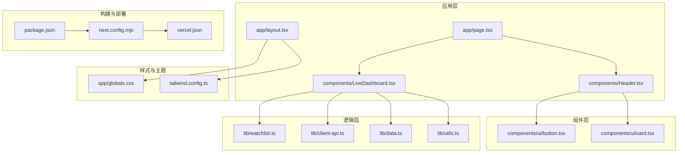
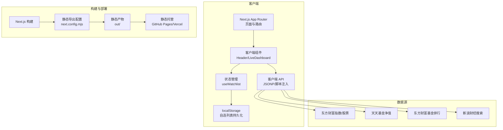
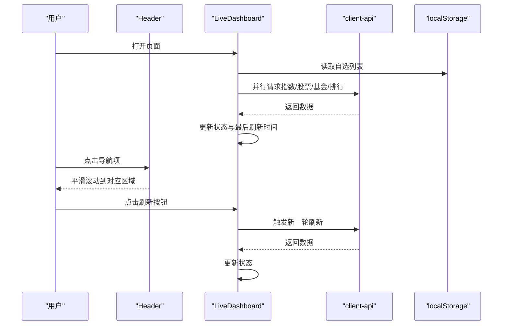
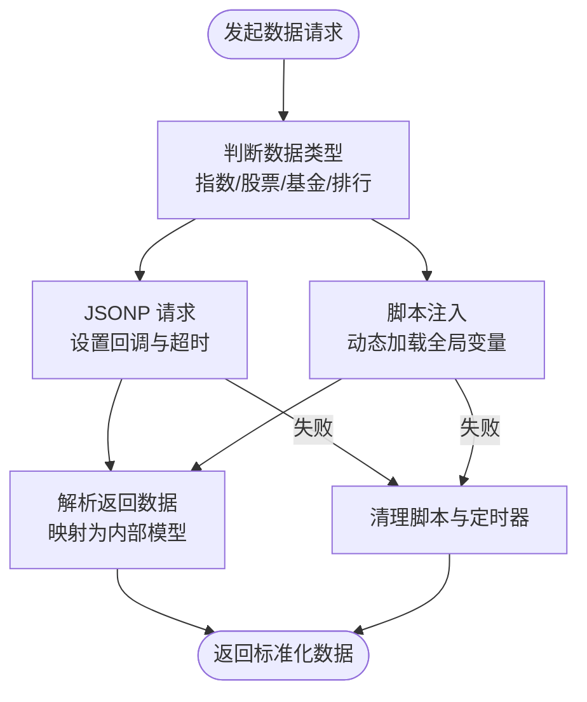
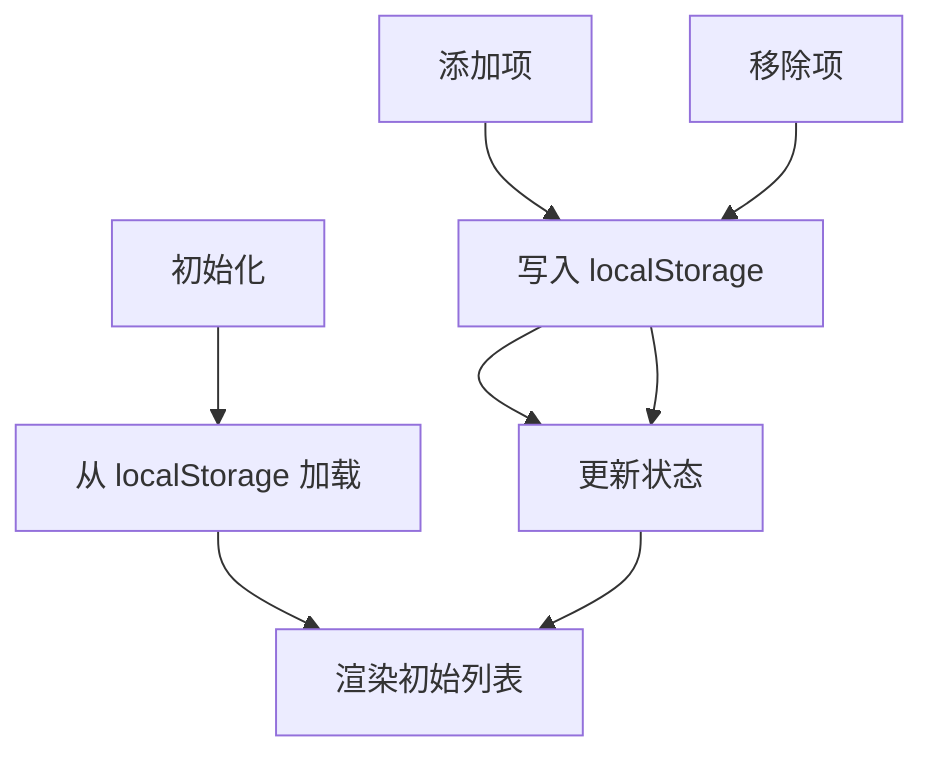
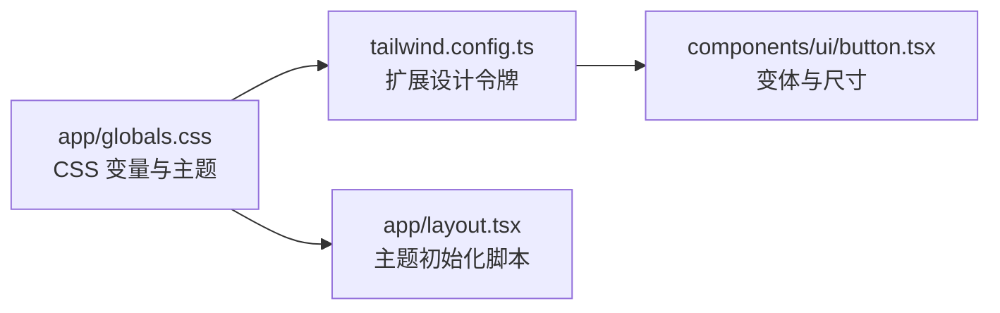
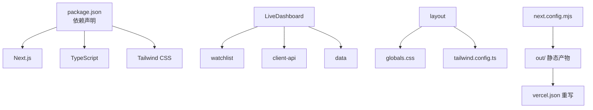

# 整体架构设计

<cite>
**本文引用的文件**
- [README.md](file://README.md)
- [package.json](file://package.json)
- [next.config.mjs](file://next.config.mjs)
- [tsconfig.json](file://tsconfig.json)
- [app/layout.tsx](file://app/layout.tsx)
- [app/page.tsx](file://app/page.tsx)
- [components/Header.tsx](file://components/Header.tsx)
- [components/LiveDashboard.tsx](file://components/LiveDashboard.tsx)
- [lib/client-api.ts](file://lib/client-api.ts)
- [lib/watchlist.ts](file://lib/watchlist.ts)
- [lib/data.ts](file://lib/data.ts)
- [lib/utils.ts](file://lib/utils.ts)
- [components/ui/button.tsx](file://components/ui/button.tsx)
- [tailwind.config.ts](file://tailwind.config.ts)
- [app/globals.css](file://app/globals.css)
- [vercel.json](file://vercel.json)
</cite>

## 目录
1. [引言](#引言)
2. [项目结构](#项目结构)
3. [核心组件](#核心组件)
4. [架构总览](#架构总览)
5. [详细组件分析](#详细组件分析)
6. [依赖关系分析](#依赖关系分析)
7. [性能考量](#性能考量)
8. [故障排查指南](#故障排查指南)
9. [结论](#结论)
10. [附录](#附录)

## 引言
本项目是一个“基金实盘跟踪”前端应用，目标是为用户提供全球指数、热门股票与自选基金的实时行情面板。系统采用 Next.js 16 App Router 架构，结合 TypeScript 提升类型安全与开发体验；通过静态导出（Static Export）模式实现纯静态部署，便于部署至 GitHub Pages 或 Vercel 等平台。应用以客户端组件为核心，使用 JSONP 与部分脚本注入方式从多家数据源拉取实时数据，并通过本地存储实现用户自选列表的持久化。

## 项目结构
项目采用基于功能的模块化组织方式，围绕 Next.js 16 App Router 的 app 目录进行组织，同时将通用 UI 组件与业务逻辑拆分至 components 与 lib 目录，确保职责清晰、复用性强。

- app 目录：包含根布局与入口页面，负责全局样式、元数据与主题初始化。
- components 目录：包含页面级与基础 UI 组件，如头部导航、实时看板、卡片与模态框等。
- lib 目录：封装客户端 API、数据模型、工具函数与用户自选列表的状态管理。
- 样式与主题：通过 Tailwind CSS 与 CSS 变量实现深浅主题切换与一致的设计系统。
- 构建与部署：通过 next.config.mjs 配置静态导出与路径前缀，vercel.json 提供重写规则以适配静态托管。

图表来源
- [app/layout.tsx:1-35](file://app/layout.tsx#L1-L35)
- [app/page.tsx:1-24](file://app/page.tsx#L1-L24)
- [components/Header.tsx:1-92](file://components/Header.tsx#L1-L92)
- [components/LiveDashboard.tsx:1-375](file://components/LiveDashboard.tsx#L1-L375)
- [lib/watchlist.ts:1-89](file://lib/watchlist.ts#L1-L89)
- [lib/client-api.ts:1-596](file://lib/client-api.ts#L1-L596)
- [lib/data.ts:1-255](file://lib/data.ts#L1-L255)
- [lib/utils.ts:1-7](file://lib/utils.ts#L1-L7)
- [components/ui/button.tsx:1-49](file://components/ui/button.tsx#L1-L49)
- [tailwind.config.ts:1-105](file://tailwind.config.ts#L1-L105)
- [app/globals.css:1-125](file://app/globals.css#L1-L125)
- [next.config.mjs:1-13](file://next.config.mjs#L1-L13)
- [vercel.json:1-1](file://vercel.json#L1-L1)
- [package.json:1-31](file://package.json#L1-L31)

章节来源
- [README.md:132-161](file://README.md#L132-L161)
- [package.json:1-31](file://package.json#L1-L31)
- [next.config.mjs:1-13](file://next.config.mjs#L1-L13)
- [tsconfig.json:1-42](file://tsconfig.json#L1-L42)
- [tailwind.config.ts:1-105](file://tailwind.config.ts#L1-L105)
- [app/globals.css:1-125](file://app/globals.css#L1-L125)

## 核心组件
- 根布局与入口
  - 根布局负责设置站点元信息、字体加载、主题初始化脚本与全局样式容器。
  - 入口页面聚合头部导航与实时看板，作为用户首屏内容。
- 实时看板
  - 负责全局指数、热门股票、自选基金与基金排行的数据拉取与展示，提供手动刷新与自动刷新机制。
  - 内部集成搜索弹窗、指数图表弹窗与回到顶部等交互组件。
- 用户自选列表
  - 使用 React Hooks 管理自选基金与自选股票，持久化至 localStorage 并兼容旧格式。
- 客户端 API
  - 通过 JSONP 与脚本注入方式从多家数据源拉取实时数据，包含指数、股票、基金净值与历史收益等接口。
- 基础 UI 组件
  - 提供按钮、卡片等基础组件，配合设计系统与主题变量实现一致的视觉与交互体验。

章节来源
- [app/layout.tsx:1-35](file://app/layout.tsx#L1-L35)
- [app/page.tsx:1-24](file://app/page.tsx#L1-L24)
- [components/LiveDashboard.tsx:1-375](file://components/LiveDashboard.tsx#L1-L375)
- [lib/watchlist.ts:1-89](file://lib/watchlist.ts#L1-L89)
- [lib/client-api.ts:1-596](file://lib/client-api.ts#L1-L596)
- [components/ui/button.tsx:1-49](file://components/ui/button.tsx#L1-L49)

## 架构总览
系统采用“客户端渲染 + 静态导出”的单页应用架构。Next.js 16 App Router 提供页面级路由与资源组织能力，客户端组件负责数据获取与状态管理。静态导出模式将应用编译为纯静态文件，适合部署到 GitHub Pages、Vercel 等静态托管平台。

图表来源
- [app/layout.tsx:1-35](file://app/layout.tsx#L1-L35)
- [app/page.tsx:1-24](file://app/page.tsx#L1-L24)
- [components/Header.tsx:1-92](file://components/Header.tsx#L1-L92)
- [components/LiveDashboard.tsx:1-375](file://components/LiveDashboard.tsx#L1-L375)
- [lib/watchlist.ts:1-89](file://lib/watchlist.ts#L1-L89)
- [lib/client-api.ts:1-596](file://lib/client-api.ts#L1-L596)
- [next.config.mjs:1-13](file://next.config.mjs#L1-L13)

## 详细组件分析

### 实时看板组件（LiveDashboard）
- 职责与流程
  - 负责聚合多路数据源，包括全球指数、热门股票、自选股票、自选基金与基金排行。
  - 通过定时器每 30 秒触发一次数据刷新，支持手动刷新。
  - 管理页面内状态（如股票标签页、搜索类型、指数选择等），并与搜索弹窗、指数图表弹窗协作。
- 关键交互
  - 自选列表联动：当自选列表为空时，展示空态引导；当有数据时，展示对应卡片并支持移除。
  - 指数点击：点击指数卡片打开指数图表弹窗，展示 K 线数据。
- 性能与健壮性
  - 使用 Promise.allSettled 并行请求多路数据，避免某一路失败影响整体展示。
  - 对 JSONP 请求设置超时与清理逻辑，防止内存泄漏与重复脚本注入。

图表来源
- [components/LiveDashboard.tsx:1-375](file://components/LiveDashboard.tsx#L1-L375)
- [lib/client-api.ts:1-596](file://lib/client-api.ts#L1-L596)
- [lib/watchlist.ts:1-89](file://lib/watchlist.ts#L1-L89)
- [components/Header.tsx:1-92](file://components/Header.tsx#L1-L92)

章节来源
- [components/LiveDashboard.tsx:1-375](file://components/LiveDashboard.tsx#L1-L375)

### 客户端 API（client-api）
- 设计要点
  - JSONP 与脚本注入：针对不同数据源采用 JSONP 或动态脚本注入，兼容跨域与特定 API 的回调约定。
  - 错误处理与超时控制：为每个请求设置超时与清理逻辑，避免悬挂脚本与内存泄漏。
  - 数据转换：统一将原始数据映射为内部数据模型，保证后续组件消费的一致性。
- 数据模型
  - 指数、股票、基金与基金排行均定义了明确的接口类型，便于类型检查与 IDE 支持。

图表来源
- [lib/client-api.ts:1-596](file://lib/client-api.ts#L1-L596)
- [lib/data.ts:1-255](file://lib/data.ts#L1-L255)

章节来源
- [lib/client-api.ts:1-596](file://lib/client-api.ts#L1-L596)
- [lib/data.ts:1-255](file://lib/data.ts#L1-L255)

### 用户自选列表（watchlist）
- 状态管理
  - 使用 React Hooks 在客户端维护自选基金与自选股票列表，提供添加、移除与持久化能力。
  - 初始化时从 localStorage 恢复数据，兼容旧格式（字符串数组）。
- 交互体验
  - 列表变更即时同步至 localStorage，确保刷新不丢失。
  - 与 LiveDashboard 协作，驱动自选股票与自选基金的动态数据拉取。

图表来源
- [lib/watchlist.ts:1-89](file://lib/watchlist.ts#L1-L89)

章节来源
- [lib/watchlist.ts:1-89](file://lib/watchlist.ts#L1-L89)

### 样式与主题系统
- 设计系统
  - 通过 Tailwind CSS 与 CSS 变量定义颜色、阴影、圆角等设计令牌，支持深浅主题切换。
- 主题初始化
  - 根布局在客户端执行主题初始化脚本，优先使用 localStorage 中的主题偏好，避免首次闪烁。
- 组件样式
  - 基础 UI 组件（如按钮）使用变体与尺寸系统，确保风格一致性。

图表来源
- [app/globals.css:1-125](file://app/globals.css#L1-L125)
- [tailwind.config.ts:1-105](file://tailwind.config.ts#L1-L105)
- [components/ui/button.tsx:1-49](file://components/ui/button.tsx#L1-L49)
- [app/layout.tsx:1-35](file://app/layout.tsx#L1-L35)

章节来源
- [app/globals.css:1-125](file://app/globals.css#L1-L125)
- [tailwind.config.ts:1-105](file://tailwind.config.ts#L1-L105)
- [components/ui/button.tsx:1-49](file://components/ui/button.tsx#L1-L49)
- [app/layout.tsx:1-35](file://app/layout.tsx#L1-L35)

## 依赖关系分析
- 模块耦合
  - LiveDashboard 依赖 watchlist、client-api 与 data 模型，形成“视图-状态-数据”的清晰分层。
  - Header 仅负责导航与主题切换，保持低耦合。
- 外部依赖
  - Next.js 16 App Router 提供页面路由与资源组织。
  - Tailwind CSS 与 CSS 变量提供样式与主题能力。
  - TypeScript 提升类型安全与开发体验。
- 构建与部署
  - next.config.mjs 配置静态导出与路径前缀，确保在子路径部署场景下的正确行为。
  - vercel.json 提供重写规则，适配静态托管环境。

图表来源
- [package.json:1-31](file://package.json#L1-L31)
- [components/LiveDashboard.tsx:1-375](file://components/LiveDashboard.tsx#L1-L375)
- [lib/watchlist.ts:1-89](file://lib/watchlist.ts#L1-L89)
- [lib/client-api.ts:1-596](file://lib/client-api.ts#L1-L596)
- [lib/data.ts:1-255](file://lib/data.ts#L1-L255)
- [app/layout.tsx:1-35](file://app/layout.tsx#L1-L35)
- [app/globals.css:1-125](file://app/globals.css#L1-L125)
- [tailwind.config.ts:1-105](file://tailwind.config.ts#L1-L105)
- [next.config.mjs:1-13](file://next.config.mjs#L1-L13)
- [vercel.json:1-1](file://vercel.json#L1-L1)

章节来源
- [package.json:1-31](file://package.json#L1-L31)
- [next.config.mjs:1-13](file://next.config.mjs#L1-L13)
- [vercel.json:1-1](file://vercel.json#L1-L1)

## 性能考量
- 静态导出与按需加载
  - 通过静态导出减少运行时开销，利于 CDN 缓存与快速加载。
  - 路由层面按需渲染组件，避免一次性加载过多资源。
- 数据刷新策略
  - 30 秒自动刷新，支持手动刷新，平衡实时性与网络开销。
  - 并行请求多路数据，缩短整体等待时间。
- 样式与主题
  - CSS 变量与 Tailwind 扩展减少重复样式，降低包体积。
  - 深浅主题切换在客户端完成，避免服务端渲染成本。
- 本地存储
  - 自选列表持久化至 localStorage，减少重复请求与网络压力。

## 故障排查指南
- JSONP 请求失败或超时
  - 检查网络与跨域策略，确认回调参数与超时时间设置合理。
  - 查看控制台错误与清理逻辑是否正常执行。
- 数据为空或格式异常
  - 核对数据源返回字段与映射逻辑，确保类型安全。
  - 在客户端 API 中增加兜底返回与日志输出。
- 主题初始化闪烁
  - 确认根布局中的主题初始化脚本在客户端执行，且优先读取 localStorage。
- 静态部署路径问题
  - 确认 next.config.mjs 中的 basePath 与 assetPrefix 与实际部署路径一致。
  - Vercel 环境下检查 vercel.json 的重写规则是否生效。

章节来源
- [lib/client-api.ts:1-596](file://lib/client-api.ts#L1-L596)
- [app/layout.tsx:1-35](file://app/layout.tsx#L1-L35)
- [next.config.mjs:1-13](file://next.config.mjs#L1-L13)
- [vercel.json:1-1](file://vercel.json#L1-L1)

## 结论
本项目以 Next.js 16 App Router 为基础，结合 TypeScript、Tailwind CSS 与静态导出模式，构建了一个轻量、可维护且易于部署的金融数据看板应用。通过客户端组件与本地存储实现用户自定义与持久化，借助多数据源与并行请求保障实时性与稳定性。整体架构清晰、模块职责明确，适合进一步扩展更多数据维度与交互能力。

## 附录

### Next.js 静态导出配置说明
- 输出模式
  - output: export 将应用编译为静态文件，适合 GitHub Pages、Vercel 等静态托管。
- 路径前缀
  - basePath 与 assetPrefix 用于子路径部署场景，确保资源路径与链接正确。
- 图片优化
  - images.unoptimized: true 适配静态导出环境，避免 Next.js 图像优化带来的复杂度。

章节来源
- [next.config.mjs:1-13](file://next.config.mjs#L1-L13)

### TypeScript 类型体系
- 类型安全
  - 通过 lib/data.ts 定义指数、股票、基金与排行的数据模型，确保组件消费数据时的类型一致性。
- 开发体验
  - tsconfig.json 启用严格模式与增量编译，提升开发效率与构建速度。

章节来源
- [lib/data.ts:1-255](file://lib/data.ts#L1-L255)
- [tsconfig.json:1-42](file://tsconfig.json#L1-L42)