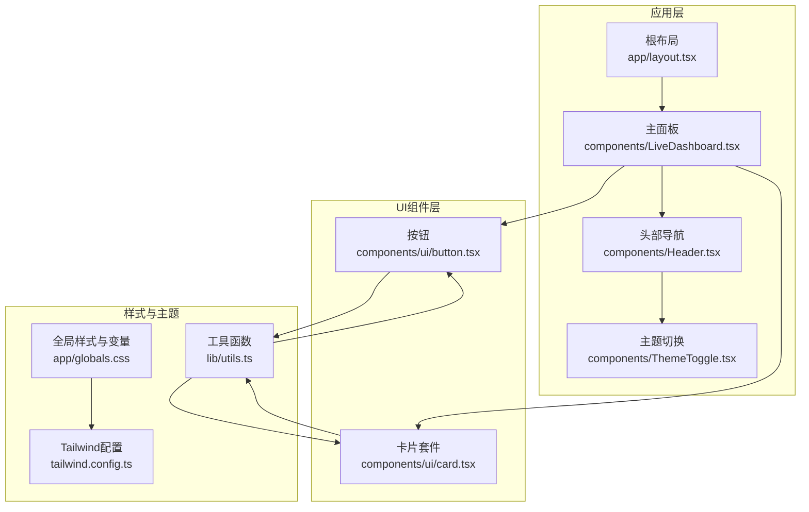
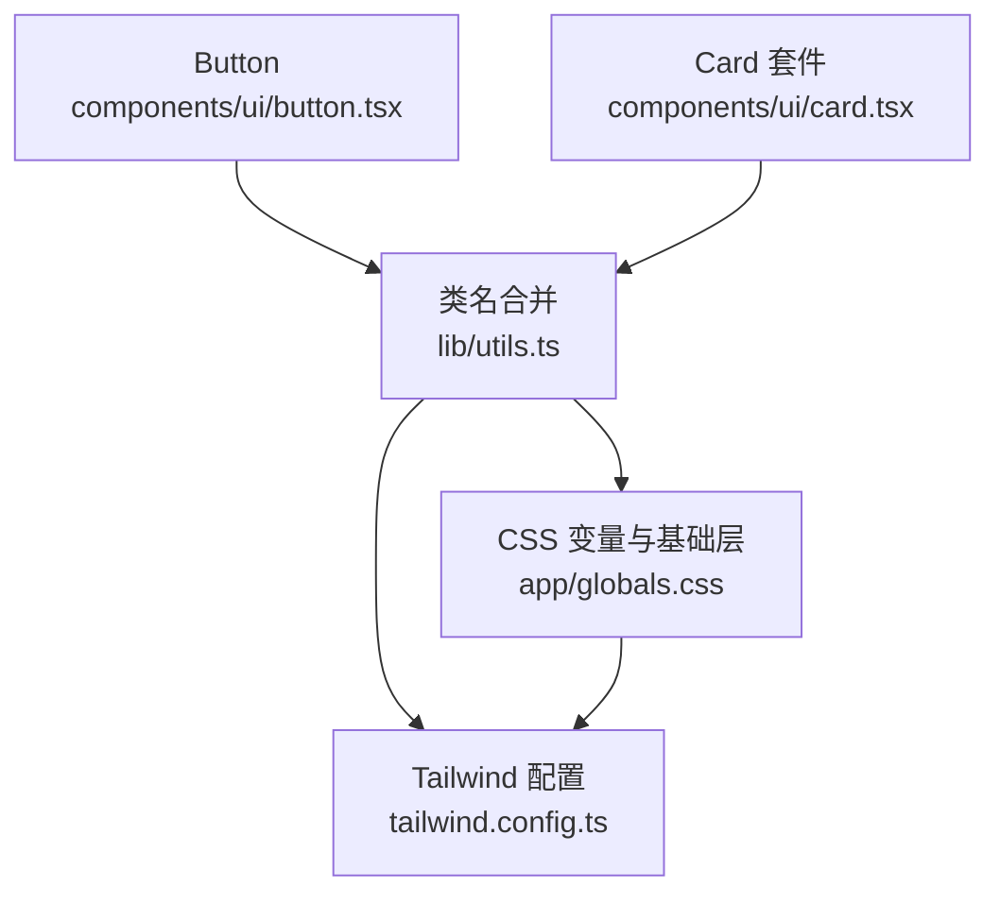
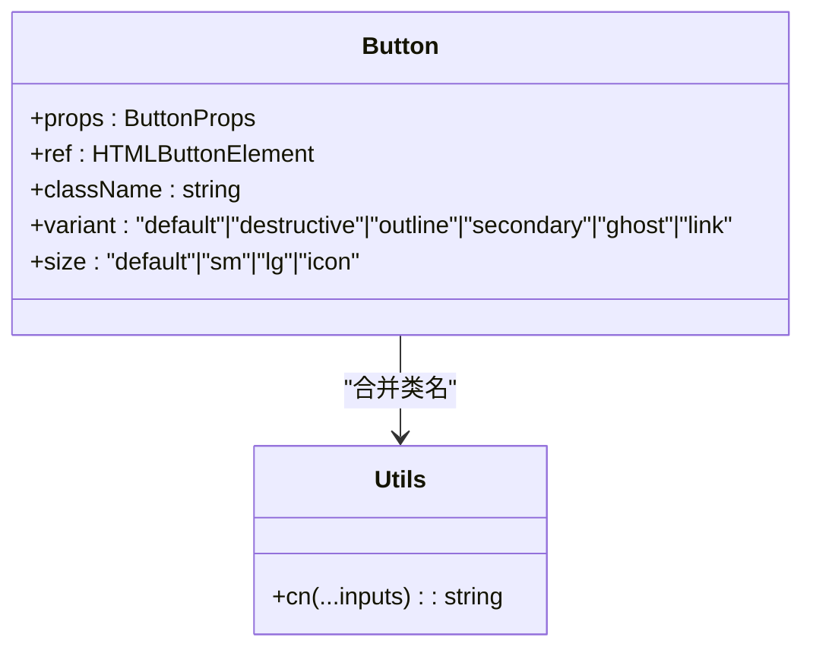
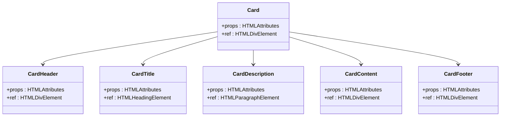
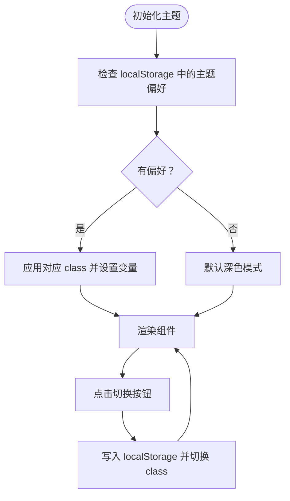
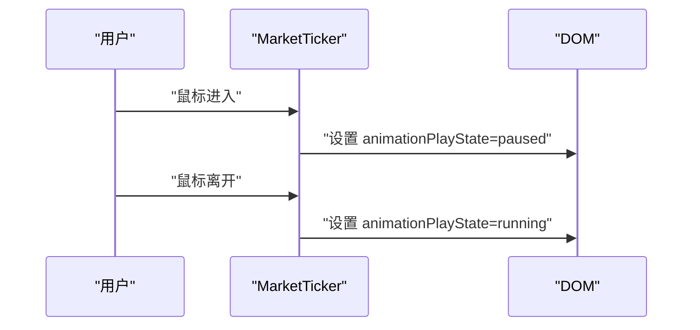
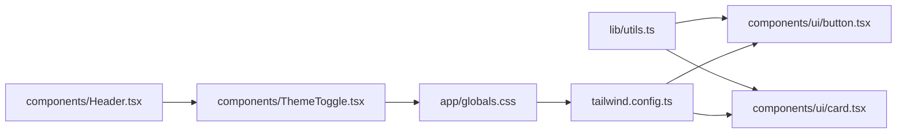

# UI组件库设计

<cite>
**本文引用的文件**
- [components/ui/button.tsx](file://components/ui/button.tsx)
- [components/ui/card.tsx](file://components/ui/card.tsx)
- [app/globals.css](file://app/globals.css)
- [tailwind.config.ts](file://tailwind.config.ts)
- [lib/utils.ts](file://lib/utils.ts)
- [components/ThemeToggle.tsx](file://components/ThemeToggle.tsx)
- [components/Header.tsx](file://components/Header.tsx)
- [components/LiveDashboard.tsx](file://components/LiveDashboard.tsx)
- [components/IndexCard.tsx](file://components/IndexCard.tsx)
- [components/FundCard.tsx](file://components/FundCard.tsx)
- [components/MiniChart.tsx](file://components/MiniChart.tsx)
- [components/MarketTicker.tsx](file://components/MarketTicker.tsx)
- [app/layout.tsx](file://app/layout.tsx)
- [next.config.mjs](file://next.config.mjs)
- [package.json](file://package.json)
- [README.md](file://README.md)
</cite>

## 目录
1. [简介](#简介)
2. [项目结构](#项目结构)
3. [核心组件](#核心组件)
4. [架构总览](#架构总览)
5. [组件详解](#组件详解)
6. [依赖关系分析](#依赖关系分析)
7. [性能考量](#性能考量)
8. [故障排查指南](#故障排查指南)
9. [结论](#结论)
10. [附录](#附录)

## 简介
本设计文档围绕一个以金融仪表盘为主题的前端组件库展开，重点阐述基础UI组件（如Button、Card）的设计理念与实现方式，覆盖原子化设计原则、可定制性（样式变量、主题与尺寸）、可访问性（ARIA、键盘导航、屏幕阅读器）、响应式设计（断点与移动端适配）、动画与过渡（CSS与JS）、国际化与本地化、版本管理与发布流程以及维护策略，并提供使用指南与扩展方法。

## 项目结构
该组件库采用“按功能分层 + 原子化组件”的组织方式：
- 基础UI组件集中于 components/ui，遵循原子化与变体模式，便于复用与组合
- 主题与样式变量集中在 app/globals.css 与 tailwind.config.ts，统一色板、圆角、阴影与动画
- 工具函数 lib/utils.ts 提供类名合并能力，确保样式叠加与覆盖逻辑清晰
- 交互组件（如 ThemeToggle、Header、LiveDashboard）演示如何在业务场景中使用基础组件

图表来源
- [app/layout.tsx:13-34](file://app/layout.tsx#L13-L34)
- [components/LiveDashboard.tsx:1-375](file://components/LiveDashboard.tsx#L1-L375)
- [components/Header.tsx:1-92](file://components/Header.tsx#L1-L92)
- [components/ThemeToggle.tsx:1-52](file://components/ThemeToggle.tsx#L1-L52)
- [components/ui/button.tsx:1-49](file://components/ui/button.tsx#L1-L49)
- [components/ui/card.tsx:1-79](file://components/ui/card.tsx#L1-L79)
- [app/globals.css:1-125](file://app/globals.css#L1-L125)
- [tailwind.config.ts:1-105](file://tailwind.config.ts#L1-L105)
- [lib/utils.ts:1-7](file://lib/utils.ts#L1-L7)

章节来源
- [README.md:132-161](file://README.md#L132-L161)
- [package.json:1-31](file://package.json#L1-L31)

## 核心组件
本节聚焦两个基础组件：Button 与 Card，说明其设计理念、变体与尺寸体系、可定制性与可访问性要点。

- Button
  - 设计理念：基于原子化与变体（Variant）模式，通过 class-variance-authority 组合不同外观与尺寸，保持一致的交互反馈与视觉层级
  - 关键特性：支持 variant（默认/破坏性/描边/次要/幽灵/链接）与 size（默认/小/大/图标），继承原生 button 属性，支持 ref 透传
  - 可定制性：通过样式变量与 Tailwind 扩展，可在主题中调整颜色、圆角、阴影；通过 className 覆盖实现局部定制
  - 可访问性：保留原生 button 的语义与键盘行为；可通过 aria-* 属性进一步增强

- Card
  - 设计理念：卡片容器与其子块（Header/Title/Description/Content/Footer）解耦，便于按需组合
  - 关键特性：提供标准卡片容器与标题、描述、内容区、页脚的子组件，均支持 className 透传
  - 可定制性：通过 CSS 变量与 Tailwind 颜色映射，统一卡片背景、前景色、边框与阴影
  - 可访问性：子组件均为语义化 HTML 元素，可配合 ARIA 属性使用

章节来源
- [components/ui/button.tsx:1-49](file://components/ui/button.tsx#L1-L49)
- [components/ui/card.tsx:1-79](file://components/ui/card.tsx#L1-L79)
- [lib/utils.ts:1-7](file://lib/utils.ts#L1-L7)

## 架构总览
下图展示组件库与主题系统、动画系统、工具函数之间的交互关系，体现“样式变量驱动 + Tailwind 扩展 + 原子化组件”的整体架构。

图表来源
- [components/ui/button.tsx:1-49](file://components/ui/button.tsx#L1-L49)
- [components/ui/card.tsx:1-79](file://components/ui/card.tsx#L1-L79)
- [lib/utils.ts:1-7](file://lib/utils.ts#L1-L7)
- [app/globals.css:1-125](file://app/globals.css#L1-L125)
- [tailwind.config.ts:1-105](file://tailwind.config.ts#L1-L105)

## 组件详解

### Button 组件
- 设计原则
  - 原子化：将通用交互态（如 ring、focus-visible、disabled）抽离为基础类
  - 变体模式：通过 variants 控制外观（variant），通过 sizes 控制尺寸（size）
  - 可组合：className 与变体参数可叠加，最终由 cn 合并
- 可定制性
  - 主题：通过 CSS 变量与 Tailwind colors 映射，统一 primary/secondary/muted 等色板
  - 尺寸：提供 default/sm/lg/icon 四档尺寸，满足不同信息密度需求
  - 动画：内置 transition-colors，可结合 Tailwind 动画类实现 hover/focus 效果
- 可访问性
  - 使用原生 button，具备默认键盘可达性
  - 可通过 aria-* 属性补充状态与角色
- 使用示例路径
  - [components/LiveDashboard.tsx:128-135](file://components/LiveDashboard.tsx#L128-L135)
  - [components/Header.tsx:60-66](file://components/Header.tsx#L60-L66)

图表来源
- [components/ui/button.tsx:31-46](file://components/ui/button.tsx#L31-L46)
- [lib/utils.ts:4-6](file://lib/utils.ts#L4-L6)

章节来源
- [components/ui/button.tsx:1-49](file://components/ui/button.tsx#L1-L49)
- [tailwind.config.ts:21-63](file://tailwind.config.ts#L21-L63)
- [app/globals.css:5-90](file://app/globals.css#L5-L90)

### Card 组件套件
- 设计原则
  - 容器与内容分离：Card 作为外层容器，子组件负责标题、描述、内容与页脚
  - 语义化：Title 使用 h3，Description 使用 p，保证可读性与 SEO
- 可定制性
  - 通过 CSS 变量控制 card 背景、前景、边框与阴影
  - 通过 Tailwind 圆角与阴影扩展，统一卡片风格
- 可访问性
  - 子组件使用语义化标签，可配合 role、aria-level 等属性提升可读性
- 使用示例路径
  - [components/LiveDashboard.tsx:139-161](file://components/LiveDashboard.tsx#L139-L161)
  - [components/IndexCard.tsx:14-50](file://components/IndexCard.tsx#L14-L50)

图表来源
- [components/ui/card.tsx:4-77](file://components/ui/card.tsx#L4-L77)

章节来源
- [components/ui/card.tsx:1-79](file://components/ui/card.tsx#L1-L79)
- [app/globals.css:11-13](file://app/globals.css#L11-L13)

### 主题与可定制性设计
- 样式变量
  - 在 :root 与 .dark 中定义 HSL 变量，覆盖 background/foreground、card/popover、primary/secondary、muted/accent、destructive/success/warning、border/input/ring、圆角与阴影等
- Tailwind 扩展
  - colors、borderRadius、boxShadow、keyframes、animation 均映射至 CSS 变量，确保组件与主题强一致
- 尺寸规格
  - 通过 variants/尺寸映射与 CSS 变量控制高度、内边距、圆角与阴影，形成统一的密度体系
- 主题支持
  - ThemeToggle 通过 class='dark' 与 localStorage 记忆用户偏好，避免水合不一致问题

图表来源
- [components/ThemeToggle.tsx:6-33](file://components/ThemeToggle.tsx#L6-L33)
- [app/layout.tsx:18-24](file://app/layout.tsx#L18-L24)
- [app/globals.css:5-90](file://app/globals.css#L5-L90)
- [tailwind.config.ts:21-74](file://tailwind.config.ts#L21-L74)

章节来源
- [components/ThemeToggle.tsx:1-52](file://components/ThemeToggle.tsx#L1-L52)
- [app/layout.tsx:1-35](file://app/layout.tsx#L1-L35)
- [app/globals.css:1-125](file://app/globals.css#L1-L125)
- [tailwind.config.ts:1-105](file://tailwind.config.ts#L1-L105)

### 可访问性设计
- ARIA 属性
  - Header 中的导航开关按钮提供 aria-label，便于屏幕阅读器识别
  - ThemeToggle 提供 aria-label 与 title，明确当前模式
- 键盘导航
  - Button 保持原生可聚焦性与键盘激活行为
  - 下拉/菜单在移动端通过点击切换，建议在桌面端补充键盘切换（Tab/Shift+Tab、Enter/Space）
- 屏幕阅读器支持
  - 语义化标签与标题层级（h3）有助于结构化阅读
  - 对动态状态（如“实时数据”）可增加 aria-live 或 role=status 提升可感知性

章节来源
- [components/Header.tsx:63-65](file://components/Header.tsx#L63-L65)
- [components/ThemeToggle.tsx:44-45](file://components/ThemeToggle.tsx#L44-L45)
- [components/ui/button.tsx:31-33](file://components/ui/button.tsx#L31-L33)

### 响应式设计
- 断点与容器
  - Tailwind container 在 2xl 达到 1400px，配合 padding 与网格布局实现桌面优先的响应式
- 移动端适配
  - Header 在 md 以下折叠为移动端菜单，提供汉堡菜单与关闭按钮
  - 指数卡片与基金卡片在小屏下调整布局与字体大小，保持可读性
- 数字宽度一致性
  - 使用 .tabular-nums 确保数字列对齐，提升金融数据可读性

章节来源
- [tailwind.config.ts:13-19](file://tailwind.config.ts#L13-L19)
- [components/Header.tsx:16-89](file://components/Header.tsx#L16-L89)
- [app/globals.css:121-124](file://app/globals.css#L121-L124)

### 动画与过渡效果
- CSS 动画
  - accordion-down/up、fade-up、ticker-scroll 等 keyframes 与 animation
  - MarketTicker 使用 ticker 动画实现无缝横向滚动
- JavaScript 动画
  - 刷新按钮在加载时旋转，通过类名切换实现
  - ThemeToggle 使用透明度与旋转过渡表达昼夜模式切换
- 组合使用
  - 动画类与交互事件（mouseenter/pause、点击切换）结合，提供流畅的反馈

图表来源
- [components/MarketTicker.tsx:8-21](file://components/MarketTicker.tsx#L8-L21)
- [tailwind.config.ts:75-98](file://tailwind.config.ts#L75-L98)

章节来源
- [components/MarketTicker.tsx:1-33](file://components/MarketTicker.tsx#L1-L33)
- [components/LiveDashboard.tsx:128-135](file://components/LiveDashboard.tsx#L128-L135)
- [components/ThemeToggle.tsx:47-49](file://components/ThemeToggle.tsx#L47-L49)
- [tailwind.config.ts:75-98](file://tailwind.config.ts#L75-L98)

### 国际化与本地化适配
- 文本与格式
  - 数字格式化使用 locale 'zh-CN'，确保千分位与小数位符合中文习惯
  - 时间与状态文本采用中文，便于目标用户理解
- 字体与排版
  - 使用 Inter 字体，开启字符变体（font-feature-settings）提升数字可读性
- 扩展建议
  - 引入 i18n 库（如 next-i18next）以支持多语言
  - 将文案抽取为消息文件，按语言拆分，保持组件无硬编码文本

章节来源
- [components/IndexCard.tsx:31-32](file://components/IndexCard.tsx#L31-L32)
- [components/FundCard.tsx:29-30](file://components/FundCard.tsx#L29-L30)
- [app/layout.tsx:2-6](file://app/layout.tsx#L2-L6)

### 版本管理、发布流程与维护策略
- 版本管理
  - 当前版本号在 package.json 中定义，遵循语义化版本
- 发布流程
  - 通过 GitHub Actions 自动构建与部署到 GitHub Pages
  - next.config.mjs 配置静态导出与路径前缀，适配子路径部署
- 维护策略
  - 依赖升级：定期更新 Tailwind、Lucide React、class-variance-authority 等核心依赖
  - 变更追踪：在 README 中记录功能变更与技术栈演进
  - 可靠性：利用静态导出减少运行时依赖，便于长期维护

章节来源
- [package.json:1-31](file://package.json#L1-L31)
- [next.config.mjs:1-12](file://next.config.mjs#L1-L12)
- [README.md:113-129](file://README.md#L113-L129)

### 使用指南与扩展方法
- 使用指南
  - 引入 Button 与 Card 组件，在业务组件中直接使用
  - 通过 variant/size 与 className 实现差异化样式
  - 使用 cn 合并类名，确保样式覆盖与原子化叠加
- 扩展方法
  - 新增变体：在 buttonVariants 中新增 variant，并在 tailwind.config.ts 中扩展颜色
  - 新增尺寸：在 buttonVariants 中新增 size，并在 CSS 变量中定义对应高度与内边距
  - 新增动画：在 tailwind.config.ts 的 keyframes/animation 中新增动画，并在组件中引用
  - 新增主题：在 app/globals.css 中新增 :root/.dark 变量，并在 tailwind.config.ts 中映射

章节来源
- [components/ui/button.tsx:5-29](file://components/ui/button.tsx#L5-L29)
- [tailwind.config.ts:21-98](file://tailwind.config.ts#L21-L98)
- [app/globals.css:5-90](file://app/globals.css#L5-L90)
- [lib/utils.ts:4-6](file://lib/utils.ts#L4-L6)

## 依赖关系分析
- 组件与工具函数
  - Button/Card 依赖 lib/utils.ts 的 cn，确保类名合并与覆盖逻辑稳定
- 样式与主题
  - app/globals.css 定义 CSS 变量，tailwind.config.ts 将变量映射为 Tailwind 原子类
- 交互与布局
  - ThemeToggle 与 Header 依赖 Lucide React 图标，共同完成主题切换与导航
- 动画与性能
  - tailwindcss-animate 插件提供开箱即用的动画能力，减少手写 CSS

图表来源
- [lib/utils.ts:1-7](file://lib/utils.ts#L1-L7)
- [components/ui/button.tsx:1-49](file://components/ui/button.tsx#L1-L49)
- [components/ui/card.tsx:1-79](file://components/ui/card.tsx#L1-L79)
- [app/globals.css:1-125](file://app/globals.css#L1-L125)
- [tailwind.config.ts:1-105](file://tailwind.config.ts#L1-L105)
- [components/ThemeToggle.tsx:1-52](file://components/ThemeToggle.tsx#L1-L52)
- [components/Header.tsx:1-92](file://components/Header.tsx#L1-L92)

章节来源
- [lib/utils.ts:1-7](file://lib/utils.ts#L1-L7)
- [tailwind.config.ts:1-105](file://tailwind.config.ts#L1-L105)
- [app/globals.css:1-125](file://app/globals.css#L1-L125)

## 性能考量
- 静态导出与无运行时依赖：next.config.mjs 配置静态导出，降低部署与运行成本
- 动画优化：使用 CSS 动画与硬件加速属性（transform/opacity），避免重排
- 样式体积：通过原子化与变量复用，减少重复样式定义
- 图标与资源：Lucide React 作为轻量图标库，按需引入，避免全量打包

章节来源
- [next.config.mjs:1-12](file://next.config.mjs#L1-L12)
- [tailwind.config.ts:75-98](file://tailwind.config.ts#L75-L98)
- [package.json:11-20](file://package.json#L11-L20)

## 故障排查指南
- 水合不一致（Hydration Mismatch）
  - 现象：SSR 与 CSR 渲染结果不一致导致警告
  - 解决：ThemeToggle 在未挂载时渲染占位元素，避免首屏闪烁与不一致
- 动画异常
  - 现象：动画不播放或卡顿
  - 排查：确认 tailwindcss-animate 插件已启用，动画类名正确拼接
- 主题切换无效
  - 现象：切换主题后样式未更新
  - 排查：检查 localStorage 写入与 documentElement.class 的切换逻辑
- 响应式布局错乱
  - 现象：小屏下布局拥挤或文字溢出
  - 排查：检查容器宽度、网格列数与字体大小断点

章节来源
- [components/ThemeToggle.tsx:35-38](file://components/ThemeToggle.tsx#L35-L38)
- [tailwind.config.ts:101-102](file://tailwind.config.ts#L101-L102)
- [components/Header.tsx:16-89](file://components/Header.tsx#L16-L89)

## 结论
本组件库以原子化设计为核心，通过变体与尺寸体系实现高复用性；借助 CSS 变量与 Tailwind 扩展，达成主题与样式的强一致；在可访问性、响应式、动画与国际化方面提供了基础能力与扩展路径。建议后续引入 i18n、完善键盘导航与 ARIA 状态提示，并持续迭代动画与主题变量，以支撑更丰富的金融场景。

## 附录
- 组件使用参考路径
  - [components/LiveDashboard.tsx:107-136](file://components/LiveDashboard.tsx#L107-L136)
  - [components/IndexCard.tsx:14-50](file://components/IndexCard.tsx#L14-L50)
  - [components/FundCard.tsx:19-131](file://components/FundCard.tsx#L19-L131)
  - [components/MiniChart.tsx:9-41](file://components/MiniChart.tsx#L9-L41)
- 主题与动画参考路径
  - [app/globals.css:5-90](file://app/globals.css#L5-L90)
  - [tailwind.config.ts:21-98](file://tailwind.config.ts#L21-L98)
- 部署与版本参考路径
  - [next.config.mjs:1-12](file://next.config.mjs#L1-L12)
  - [package.json:1-31](file://package.json#L1-L31)
  - [README.md:113-129](file://README.md#L113-L129)