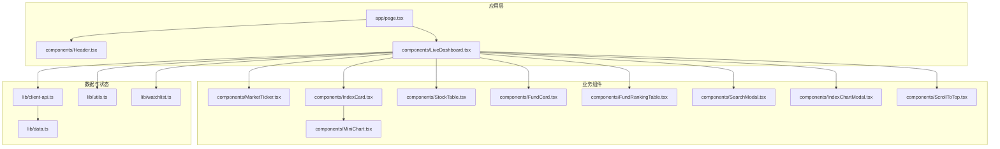
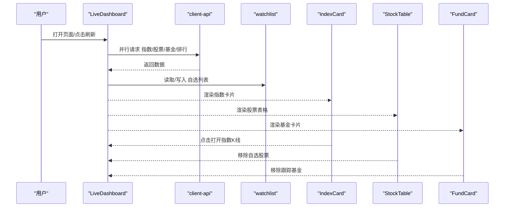
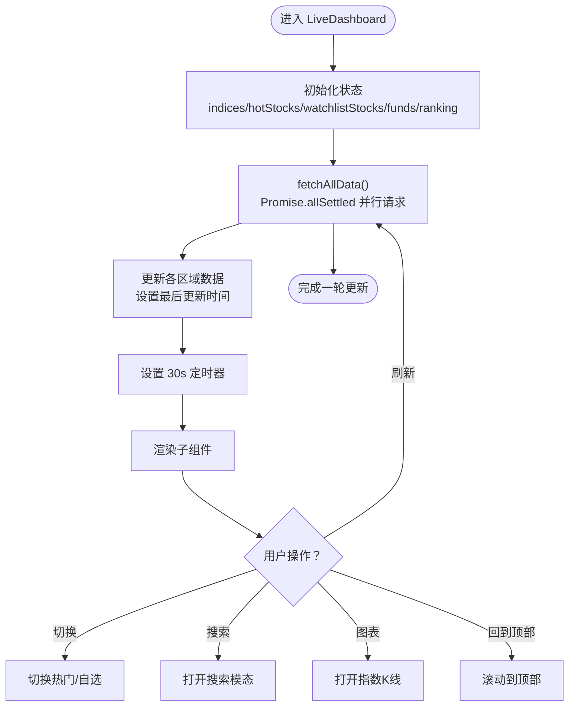
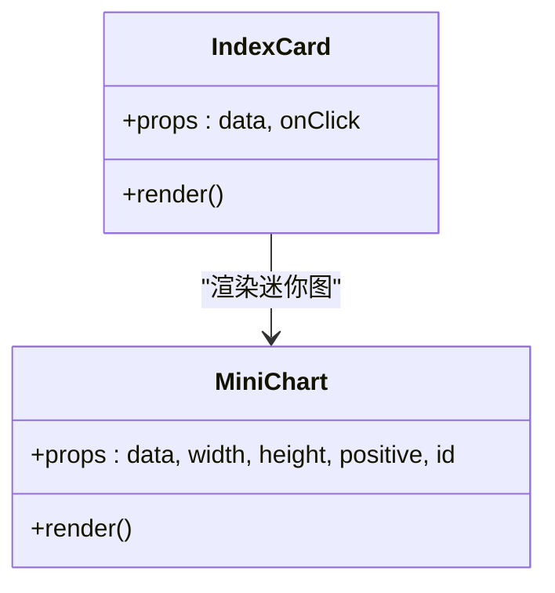
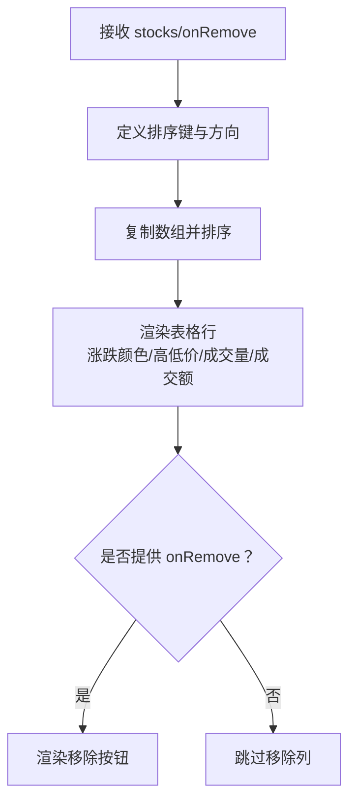
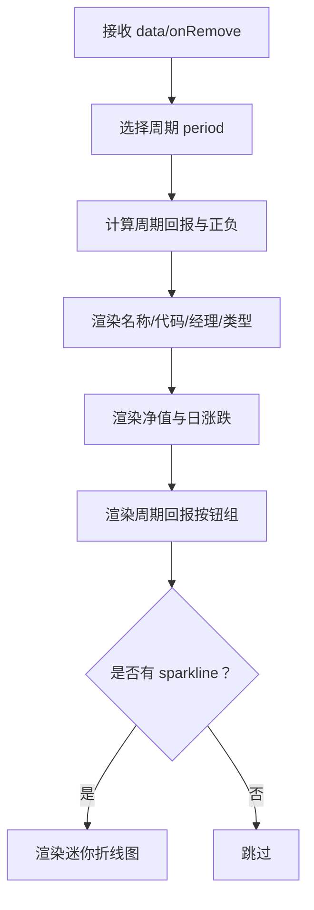
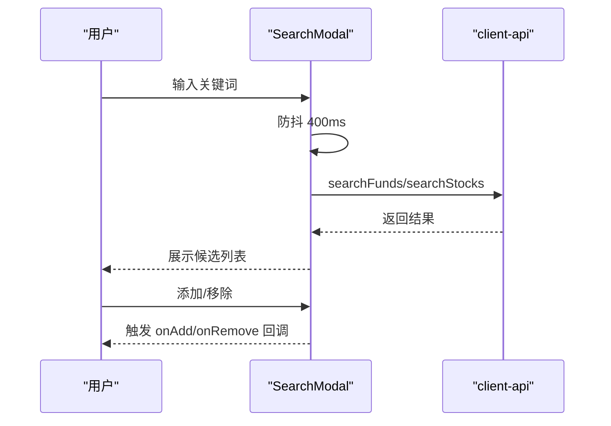
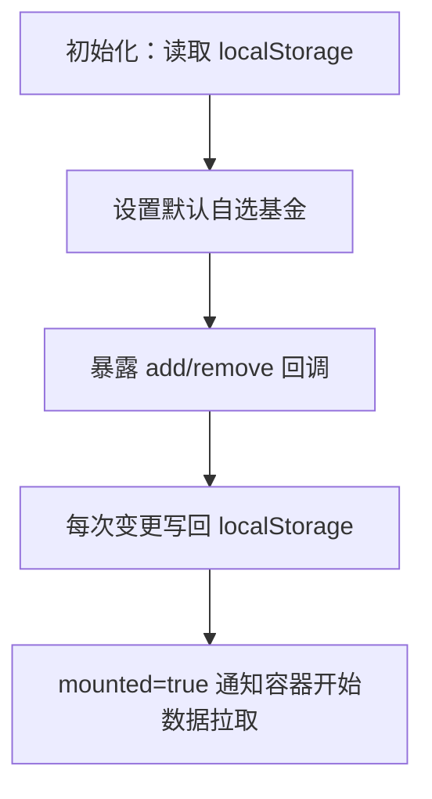
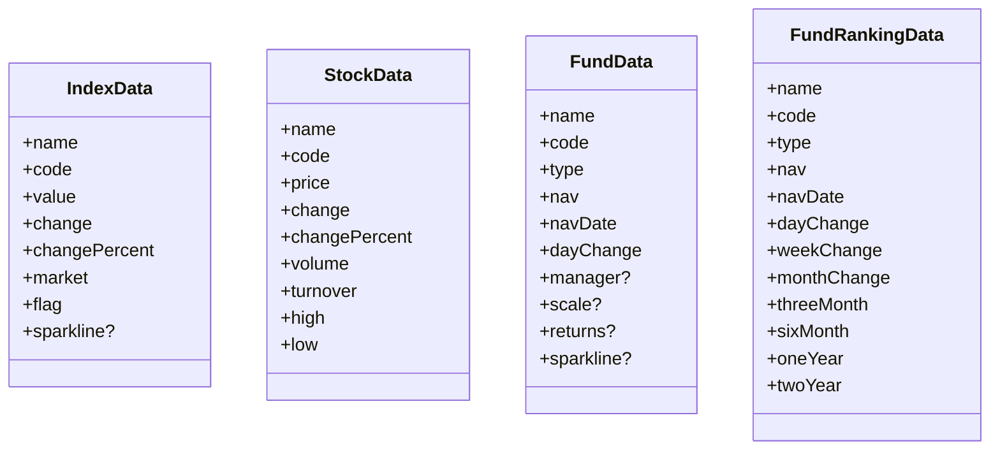
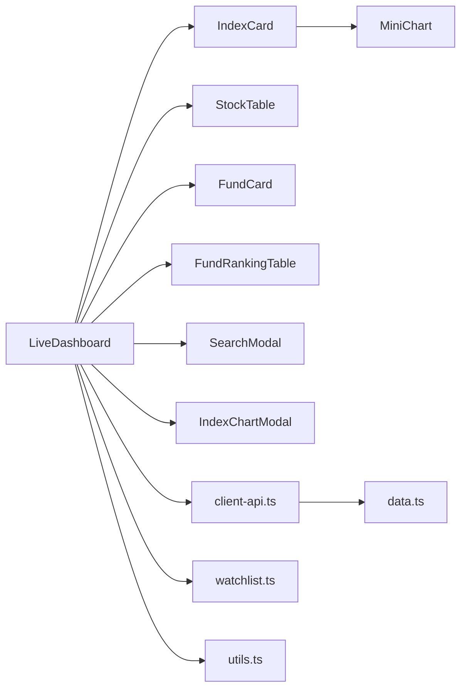

# 业务组件系统

<cite>
**本文引用的文件**
- [README.md](file://README.md)
- [package.json](file://package.json)
- [app/page.tsx](file://app/page.tsx)
- [components/LiveDashboard.tsx](file://components/LiveDashboard.tsx)
- [components/MarketTicker.tsx](file://components/MarketTicker.tsx)
- [components/IndexCard.tsx](file://components/IndexCard.tsx)
- [components/MiniChart.tsx](file://components/MiniChart.tsx)
- [components/StockTable.tsx](file://components/StockTable.tsx)
- [components/FundCard.tsx](file://components/FundCard.tsx)
- [components/FundRankingTable.tsx](file://components/FundRankingTable.tsx)
- [components/SearchModal.tsx](file://components/SearchModal.tsx)
- [components/IndexChartModal.tsx](file://components/IndexChartModal.tsx)
- [components/ScrollToTop.tsx](file://components/ScrollToTop.tsx)
- [components/Header.tsx](file://components/Header.tsx)
- [lib/client-api.ts](file://lib/client-api.ts)
- [lib/data.ts](file://lib/data.ts)
- [lib/utils.ts](file://lib/utils.ts)
- [lib/watchlist.ts](file://lib/watchlist.ts)
</cite>

## 目录
1. [引言](#引言)
2. [项目结构](#项目结构)
3. [核心组件](#核心组件)
4. [架构总览](#架构总览)
5. [详细组件分析](#详细组件分析)
6. [依赖关系分析](#依赖关系分析)
7. [性能考量](#性能考量)
8. [故障排查指南](#故障排查指南)
9. [结论](#结论)
10. [附录](#附录)

## 引言
本项目是一个基于 Next.js 的金融数据仪表板，提供全球指数、热门股票与自选/跟踪基金的实时行情与历史表现。业务组件系统围绕“数据展示组件、交互控制组件、状态管理组件”三大职责划分展开，采用组合模式实现复杂业务功能；通过统一的状态管理与数据层抽象，实现数据获取、状态管理与视图更新的清晰分离；同时内置错误处理与降级策略，并提供可扩展的测试与调试方法。

## 项目结构
项目采用按功能域分层的组织方式：
- 应用入口与根布局：app/page.tsx
- 业务组件：components/ 下的各功能模块（仪表盘、表格、卡片、图表、模态框等）
- 数据与状态：lib/ 下的 API 客户端、类型定义、工具函数、自选列表状态钩子
- 样式与主题：Tailwind CSS 与 CSS 变量

**图表来源**
- [app/page.tsx:1-24](file://app/page.tsx#L1-L24)
- [components/LiveDashboard.tsx:1-375](file://components/LiveDashboard.tsx#L1-L375)
- [components/MarketTicker.tsx:1-52](file://components/MarketTicker.tsx#L1-L52)
- [components/IndexCard.tsx:1-53](file://components/IndexCard.tsx#L1-L53)
- [components/MiniChart.tsx:1-57](file://components/MiniChart.tsx#L1-L57)
- [components/StockTable.tsx:1-144](file://components/StockTable.tsx#L1-L144)
- [components/FundCard.tsx:1-132](file://components/FundCard.tsx#L1-L132)
- [components/FundRankingTable.tsx:1-191](file://components/FundRankingTable.tsx#L1-L191)
- [components/SearchModal.tsx:1-210](file://components/SearchModal.tsx#L1-L210)
- [components/IndexChartModal.tsx:1-367](file://components/IndexChartModal.tsx#L1-L367)
- [components/ScrollToTop.tsx:1-44](file://components/ScrollToTop.tsx#L1-L44)
- [lib/client-api.ts:1-596](file://lib/client-api.ts#L1-L596)
- [lib/data.ts:1-255](file://lib/data.ts#L1-L255)
- [lib/utils.ts:1-7](file://lib/utils.ts#L1-L7)
- [lib/watchlist.ts:1-89](file://lib/watchlist.ts#L1-L89)

**章节来源**
- [README.md:132-161](file://README.md#L132-L161)
- [package.json:1-31](file://package.json#L1-L31)

## 核心组件
- 仪表盘容器：负责聚合数据、调度刷新、协调子组件渲染与交互
- 数据展示组件：指数卡片、股票表格、基金卡片、基金排行表、迷你图、K线图
- 交互控制组件：搜索模态、索引图表模态、回到顶部、导航栏
- 状态管理：自选列表（localStorage 持久化）、全局刷新状态、排序与筛选状态

职责划分与协作：
- 数据展示组件：专注渲染与简单交互（排序、悬浮显隐、点击跳转）
- 交互控制组件：封装用户行为（搜索、模态、滚动、主题切换）
- 状态管理组件：集中管理用户偏好与订阅列表，提供回调以驱动父组件更新

**章节来源**
- [components/LiveDashboard.tsx:39-301](file://components/LiveDashboard.tsx#L39-L301)
- [lib/watchlist.ts:28-88](file://lib/watchlist.ts#L28-L88)

## 架构总览
整体采用“容器组件 + 展示组件”的组合模式：
- 容器组件（LiveDashboard）负责数据拉取、状态聚合与事件分发
- 展示组件（如 IndexCard、StockTable、FundCard）负责具体 UI 渲染与局部交互
- 数据层（client-api）封装异步请求与解析逻辑
- 状态层（watchlist）提供订阅与持久化能力

**图表来源**
- [components/LiveDashboard.tsx:56-102](file://components/LiveDashboard.tsx#L56-L102)
- [lib/client-api.ts:154-595](file://lib/client-api.ts#L154-L595)
- [lib/watchlist.ts:28-88](file://lib/watchlist.ts#L28-L88)
- [components/IndexCard.tsx:5-52](file://components/IndexCard.tsx#L5-L52)
- [components/StockTable.tsx:10-144](file://components/StockTable.tsx#L10-L144)
- [components/FundCard.tsx:19-132](file://components/FundCard.tsx#L19-L132)

## 详细组件分析

### 仪表盘容器（LiveDashboard）
- 职责：统一调度数据获取、维护刷新状态、协调子组件渲染
- 关键点：
  - 使用 Promise.allSettled 并行拉取多源数据，失败项不影响其他数据
  - 30 秒定时刷新，支持手动刷新按钮禁用动画反馈
  - 通过 useWatchlist 提供自选列表与持久化能力
  - 支持“热门成交/我的自选”切换、空态占位与搜索入口

**图表来源**
- [components/LiveDashboard.tsx:56-102](file://components/LiveDashboard.tsx#L56-L102)
- [components/LiveDashboard.tsx:173-276](file://components/LiveDashboard.tsx#L173-L276)
- [lib/watchlist.ts:28-88](file://lib/watchlist.ts#L28-L88)

**章节来源**
- [components/LiveDashboard.tsx:39-301](file://components/LiveDashboard.tsx#L39-L301)

### 数据展示组件

#### 指数卡片（IndexCard）
- 职责：展示单个指数的名称、数值、涨跌与迷你图
- 特性：点击触发打开指数K线模态；根据涨跌使用不同颜色；支持响应式布局

**图表来源**
- [components/IndexCard.tsx:5-52](file://components/IndexCard.tsx#L5-L52)
- [components/MiniChart.tsx:9-56](file://components/MiniChart.tsx#L9-L56)

**章节来源**
- [components/IndexCard.tsx:1-53](file://components/IndexCard.tsx#L1-L53)
- [components/MiniChart.tsx:1-57](file://components/MiniChart.tsx#L1-L57)

#### 股票表格（StockTable）
- 职责：展示股票列表，支持按价格/涨跌幅/成交额排序
- 特性：偶数行浅色背景；支持移除按钮（自选）

**图表来源**
- [components/StockTable.tsx:10-144](file://components/StockTable.tsx#L10-L144)

**章节来源**
- [components/StockTable.tsx:1-144](file://components/StockTable.tsx#L1-L144)

#### 基金卡片（FundCard）
- 职责：展示单只基金净值、日涨跌与多周期回报
- 特性：支持周期切换（日/周/月/年等），悬停显示移除按钮，支持迷你折线图

**图表来源**
- [components/FundCard.tsx:19-132](file://components/FundCard.tsx#L19-L132)

**章节来源**
- [components/FundCard.tsx:1-132](file://components/FundCard.tsx#L1-L132)

#### 基金排行表（FundRankingTable）
- 职责：展示全市场基金涨跌幅排行，支持多周期排序
- 特性：空态提示；排序图标指示当前排序维度与方向

**章节来源**
- [components/FundRankingTable.tsx:1-191](file://components/FundRankingTable.tsx#L1-L191)

### 交互控制组件

#### 搜索模态（SearchModal）
- 职责：提供基金/股票搜索与添加/移除入口
- 特性：防抖搜索（400ms）、加载态、已添加状态高亮、Esc 关闭

**图表来源**
- [components/SearchModal.tsx:24-210](file://components/SearchModal.tsx#L24-L210)
- [lib/client-api.ts:364-417](file://lib/client-api.ts#L364-L417)

**章节来源**
- [components/SearchModal.tsx:1-210](file://components/SearchModal.tsx#L1-L210)

#### 指数K线模态（IndexChartModal）
- 职责：展示指数日/周/月K线，包含 MA5/10/20
- 特性：键盘 Esc 关闭；加载态；K线与成交量叠加

**章节来源**
- [components/IndexChartModal.tsx:27-367](file://components/IndexChartModal.tsx#L27-L367)

#### 回到顶部（ScrollToTop）
- 职责：滚动超过阈值显示按钮，平滑回到顶部

**章节来源**
- [components/ScrollToTop.tsx:7-44](file://components/ScrollToTop.tsx#L7-L44)

#### 导航栏（Header）
- 职责：移动端汉堡菜单、主题切换、锚点导航

**章节来源**
- [components/Header.tsx:16-92](file://components/Header.tsx#L16-L92)

### 状态管理组件
- 自选列表（useWatchlist）：提供基金与股票的增删与持久化，兼容旧格式；返回 mounted 标记避免 hydration 不一致

**图表来源**
- [lib/watchlist.ts:28-88](file://lib/watchlist.ts#L28-L88)

**章节来源**
- [lib/watchlist.ts:1-89](file://lib/watchlist.ts#L1-L89)

### 数据层与类型系统
- client-api.ts：封装 JSONP 与动态脚本加载，统一指数/股票/基金/排行数据获取
- data.ts：定义指数、股票、基金、基金排行的数据模型与模拟数据

**图表来源**
- [lib/data.ts:1-255](file://lib/data.ts#L1-L255)

**章节来源**
- [lib/client-api.ts:1-596](file://lib/client-api.ts#L1-L596)
- [lib/data.ts:1-255](file://lib/data.ts#L1-L255)

## 依赖关系分析
- 组件间依赖：LiveDashboard 作为中枢，依赖各展示组件与交互组件；展示组件之间保持弱耦合
- 数据依赖：所有数据均来自 client-api.ts，类型约束来自 data.ts
- 工具依赖：utils.ts 提供样式合并工具；watchlist.ts 提供状态钩子

**图表来源**
- [components/LiveDashboard.tsx:39-301](file://components/LiveDashboard.tsx#L39-L301)
- [components/IndexCard.tsx:1-53](file://components/IndexCard.tsx#L1-L53)
- [components/MiniChart.tsx:1-57](file://components/MiniChart.tsx#L1-L57)
- [components/StockTable.tsx:1-144](file://components/StockTable.tsx#L1-L144)
- [components/FundCard.tsx:1-132](file://components/FundCard.tsx#L1-L132)
- [components/FundRankingTable.tsx:1-191](file://components/FundRankingTable.tsx#L1-L191)
- [components/SearchModal.tsx:1-210](file://components/SearchModal.tsx#L1-L210)
- [components/IndexChartModal.tsx:1-367](file://components/IndexChartModal.tsx#L1-L367)
- [lib/client-api.ts:1-596](file://lib/client-api.ts#L1-L596)
- [lib/data.ts:1-255](file://lib/data.ts#L1-L255)
- [lib/watchlist.ts:1-89](file://lib/watchlist.ts#L1-L89)
- [lib/utils.ts:1-7](file://lib/utils.ts#L1-L7)

**章节来源**
- [components/LiveDashboard.tsx:1-375](file://components/LiveDashboard.tsx#L1-L375)
- [lib/client-api.ts:1-596](file://lib/client-api.ts#L1-L596)

## 性能考量
- 并行数据拉取：使用 Promise.allSettled 并行获取指数、热门股票、自选股票、跟踪基金与排行，缩短首屏等待时间
- 防抖搜索：SearchModal 对输入进行 400ms 防抖，降低频繁请求
- 轻量渲染：MiniChart 与 K 线图仅在需要时渲染，且使用 SVG 简化绘制
- 惰性加载：K 线模态打开时才发起 K 线请求，避免不必要的网络开销
- 本地存储：watchlist 使用 localStorage 缓存用户订阅，减少重复请求
- 优化建议：
  - 表格组件可引入虚拟滚动（如 react-window）以提升大数据集渲染性能
  - 对高频排序的表格可增加内存缓存，避免重复计算
  - 对指数/股票数据可增加版本号或 ETag 校验，减少无效更新

[本节为通用性能讨论，无需特定文件分析]

## 故障排查指南
- 数据为空或延迟：
  - 检查 client-api.ts 中 JSONP/脚本加载是否超时或失败
  - 查看 LiveDashboard 的 isLive 标志与 lastUpdate 时间
- 搜索无结果：
  - 确认防抖时间与关键词长度；检查 searchFunds/searchStocks 返回
- 自选列表异常：
  - 检查 localStorage 是否被清理；确认 watchlist.ts 的兼容逻辑
- 模态无法关闭：
  - 确认 ESC 键监听与点击遮罩关闭逻辑
- K 线为空：
  - 检查 fetchKline 返回与 INDEX_META 映射

**章节来源**
- [components/LiveDashboard.tsx:56-102](file://components/LiveDashboard.tsx#L56-L102)
- [components/SearchModal.tsx:38-88](file://components/SearchModal.tsx#L38-L88)
- [lib/watchlist.ts:33-51](file://lib/watchlist.ts#L33-L51)
- [components/IndexChartModal.tsx:57-67](file://components/IndexChartModal.tsx#L57-L67)
- [lib/client-api.ts:105-136](file://lib/client-api.ts#L105-L136)

## 结论
该业务组件系统通过清晰的职责划分与组合模式，实现了金融数据仪表板的核心功能。容器组件统一调度、展示组件专注渲染、状态与数据层解耦，配合防抖、并行请求与本地存储等策略，在保证用户体验的同时兼顾了性能与可维护性。后续可在虚拟滚动、缓存与可观测性方面进一步增强。

[本节为总结性内容，无需特定文件分析]

## 附录

### 组件生命周期管理
- 初始化：useEffect 读取 localStorage，设置 mounted，启动数据拉取
- 运行期：30 秒定时器持续刷新；用户可手动刷新
- 卸载：清理定时器与键盘事件监听

**章节来源**
- [lib/watchlist.ts:33-51](file://lib/watchlist.ts#L33-L51)
- [components/LiveDashboard.tsx:97-102](file://components/LiveDashboard.tsx#L97-L102)
- [components/IndexChartModal.tsx:61-67](file://components/IndexChartModal.tsx#L61-L67)

### 错误处理与降级策略
- Promise.allSettled 保证部分失败不影响整体渲染
- 空态组件（如“暂无数据”、“未找到匹配结果”）提升可用性
- K 线与迷你图在数据不足时优雅降级为空图或占位

**章节来源**
- [components/LiveDashboard.tsx:56-95](file://components/LiveDashboard.tsx#L56-L95)
- [components/FundRankingTable.tsx:14-20](file://components/FundRankingTable.tsx#L14-L20)
- [components/SearchModal.tsx:183-191](file://components/SearchModal.tsx#L183-L191)

### 测试策略与调试方法
- 单元测试：对纯函数（如 MiniChart 坐标计算、K 线 MA 计算）进行断言
- 集成测试：模拟 client-api 返回，验证 LiveDashboard 的数据聚合与渲染
- 端到端测试：覆盖搜索、添加/移除、模态交互、主题切换等关键流程
- 调试技巧：利用浏览器 Network 面板观察 JSONP/脚本加载；在控制台打印 watchlist 变更；使用 React DevTools 检查 props 与状态

[本节为通用测试与调试建议，无需特定文件分析]

### 扩展与定制指导
- 新增数据源：在 client-api.ts 新增接口，返回 data.ts 定义的类型
- 新增展示组件：遵循现有 props 约定，尽量无副作用，避免直接访问 DOM
- 自定义排序/筛选：复用现有排序逻辑（如 StockTable/FundRankingTable），保持一致性
- 主题与样式：通过 Tailwind 变量与 utils.cn 合并类名，确保主题切换一致

[本节为通用扩展建议，无需特定文件分析]