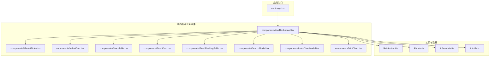
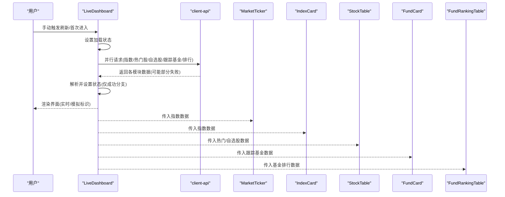
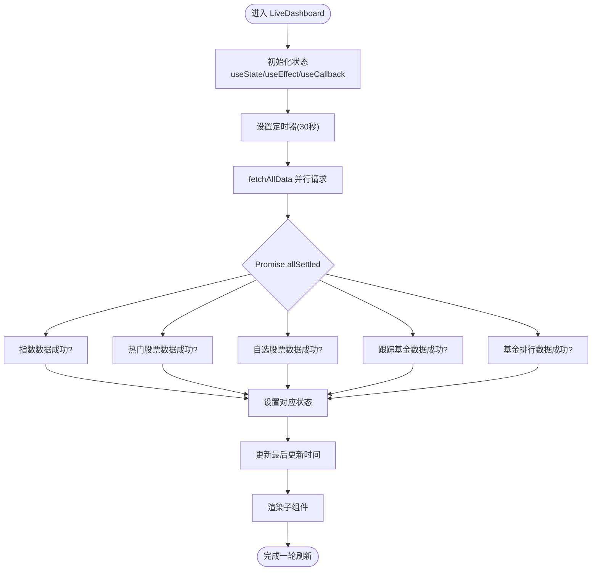
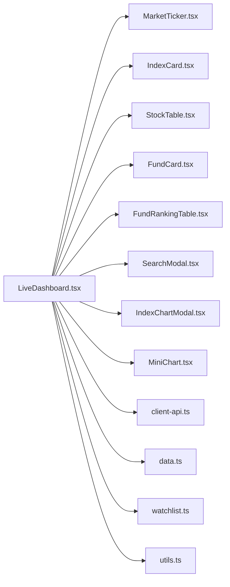

# 主面板组件 LiveDashboard

<cite>
**本文档引用的文件**
- [LiveDashboard.tsx](file://components/LiveDashboard.tsx)
- [client-api.ts](file://lib/client-api.ts)
- [data.ts](file://lib/data.ts)
- [watchlist.ts](file://lib/watchlist.ts)
- [utils.ts](file://lib/utils.ts)
- [MarketTicker.tsx](file://components/MarketTicker.tsx)
- [IndexCard.tsx](file://components/IndexCard.tsx)
- [StockTable.tsx](file://components/StockTable.tsx)
- [FundCard.tsx](file://components/FundCard.tsx)
- [FundRankingTable.tsx](file://components/FundRankingTable.tsx)
- [SearchModal.tsx](file://components/SearchModal.tsx)
- [IndexChartModal.tsx](file://components/IndexChartModal.tsx)
- [MiniChart.tsx](file://components/MiniChart.tsx)
- [page.tsx](file://app/page.tsx)
- [package.json](file://package.json)
</cite>

## 目录
1. [简介](#简介)
2. [项目结构](#项目结构)
3. [核心组件](#核心组件)
4. [架构总览](#架构总览)
5. [详细组件分析](#详细组件分析)
6. [依赖分析](#依赖分析)
7. [性能考虑](#性能考虑)
8. [故障排除指南](#故障排除指南)
9. [结论](#结论)
10. [附录](#附录)

## 简介
LiveDashboard 是本项目的主面板组件，作为金融数据仪表板的核心控制器，负责协调所有业务组件的数据流与状态管理。它通过并行数据拉取策略、状态管理与组件间通信机制，实现全球指数、热门股票、自选股票、跟踪基金与基金排行等模块的统一展示与实时刷新。

## 项目结构
该项目采用按功能分层的组织方式：页面入口负责路由与布局，主面板组件承载核心逻辑，子组件负责具体展示，工具模块提供数据类型、API 与本地存储能力。

**图表来源**
- [page.tsx:10-23](file://app/page.tsx#L10-L23)
- [LiveDashboard.tsx:39-301](file://components/LiveDashboard.tsx#L39-L301)
- [client-api.ts:154-595](file://lib/client-api.ts#L154-L595)
- [data.ts:1-255](file://lib/data.ts#L1-L255)
- [watchlist.ts:28-88](file://lib/watchlist.ts#L28-L88)
- [utils.ts:4-6](file://lib/utils.ts#L4-L6)

**章节来源**
- [page.tsx:10-23](file://app/page.tsx#L10-L23)
- [package.json:11-20](file://package.json#L11-L20)

## 核心组件
- LiveDashboard：主面板组件，负责状态管理、数据拉取与组件编排。
- MarketTicker：顶部市场行情跑马灯，展示指数实时涨跌。
- IndexCard：单个全球指数卡片，支持点击打开指数 K 线图。
- StockTable：股票表格，支持多种排序与自选移除。
- FundCard：单只跟踪基金卡片，支持周期切换与移除。
- FundRankingTable：基金排行表格，支持多周期排序。
- SearchModal：搜索与添加/移除基金/股票的模态框。
- IndexChartModal：指数 K 线图弹窗，支持日/周/月周期切换。
- MiniChart：小型折线图，用于指数与基金卡片的迷你趋势展示。
- client-api：封装各类金融数据接口，含 JSONP、脚本加载与正则解析。
- data：定义指数、股票、基金、基金排行的数据模型。
- watchlist：自定义 Hook，管理用户自选基金与股票，持久化到 localStorage。
- utils：工具函数，合并 Tailwind 类名。

**章节来源**
- [LiveDashboard.tsx:39-301](file://components/LiveDashboard.tsx#L39-L301)
- [MarketTicker.tsx:8-51](file://components/MarketTicker.tsx#L8-L51)
- [IndexCard.tsx:5-52](file://components/IndexCard.tsx#L5-L52)
- [StockTable.tsx:10-143](file://components/StockTable.tsx#L10-L143)
- [FundCard.tsx:19-131](file://components/FundCard.tsx#L19-L131)
- [FundRankingTable.tsx:10-190](file://components/FundRankingTable.tsx#L10-L190)
- [SearchModal.tsx:24-209](file://components/SearchModal.tsx#L24-L209)
- [IndexChartModal.tsx:27-167](file://components/IndexChartModal.tsx#L27-L167)
- [MiniChart.tsx:9-56](file://components/MiniChart.tsx#L9-L56)
- [client-api.ts:5-595](file://lib/client-api.ts#L5-L595)
- [data.ts:1-255](file://lib/data.ts#L1-L255)
- [watchlist.ts:28-88](file://lib/watchlist.ts#L28-L88)
- [utils.ts:4-6](file://lib/utils.ts#L4-L6)

## 架构总览
LiveDashboard 采用“集中式状态 + 并行数据拉取”的架构模式：
- 状态管理：使用 useState 管理各模块数据与 UI 状态；useEffect 驱动定时刷新；useCallback 缓存回调以减少重渲染。
- 数据获取：通过 Promise.allSettled 并行调用多个数据源，分别处理成功与失败分支，确保部分接口异常不影响整体展示。
- 组件通信：通过 props 向子组件传递数据与回调；通过全局状态（watchlist）在不同模块间共享用户偏好。
- 错误处理：对网络请求进行 try/catch 包裹，并在 finally 中清理加载状态；对部分可选数据（如指数 K 线）进行降级处理。

**图表来源**
- [LiveDashboard.tsx:56-102](file://components/LiveDashboard.tsx#L56-L102)
- [client-api.ts:154-595](file://lib/client-api.ts#L154-L595)

**章节来源**
- [LiveDashboard.tsx:56-102](file://components/LiveDashboard.tsx#L56-L102)

## 详细组件分析

### LiveDashboard 组件分析
- 状态与生命周期
  - 使用 useState 管理指数、热门股票、自选股票、跟踪基金、基金排行、最后更新时间、刷新状态与实时状态。
  - 使用 useEffect 在挂载后立即拉取数据，并每 30 秒轮询一次；清理定时器避免内存泄漏。
  - 使用 useCallback 包装 fetchAllData，基于依赖数组（watchlist）避免不必要的重渲染。
- 数据拉取策略
  - 通过 Promise.allSettled 并行请求多个接口，分别处理成功与失败分支，保证即使部分接口失败也能继续渲染其他模块。
  - 自选股票与跟踪基金根据 watchlist 是否为空决定是否发起请求，避免空请求。
- 组件编排
  - 将 MarketTicker 放置在顶部，实时显示全球指数行情。
  - 通过统计卡片展示各模块概览。
  - 分区渲染全球指数、跟踪基金、基金排行与股票行情（热门/自选）。
  - 通过 SearchModal 与 IndexChartModal 提供交互能力。
- 错误处理与降级
  - 对异常进行捕获并记录日志，finally 中关闭加载状态。
  - 当指数数据可用时启用“实时数据”状态，否则显示“模拟数据”。

**图表来源**
- [LiveDashboard.tsx:56-102](file://components/LiveDashboard.tsx#L56-L102)

**章节来源**
- [LiveDashboard.tsx:39-301](file://components/LiveDashboard.tsx#L39-L301)

### MarketTicker 组件分析
- 功能：顶部跑马灯展示指数实时涨跌，鼠标悬停暂停滚动。
- 实现要点：复制指数列表以实现无缝循环；根据涨跌状态切换颜色；使用 CSS 动画控制播放状态。

**章节来源**
- [MarketTicker.tsx:8-51](file://components/MarketTicker.tsx#L8-L51)

### IndexCard 组件分析
- 功能：展示单个指数的名称、代码、数值、涨跌额与涨跌幅，并可选显示迷你 K 线。
- 实现要点：根据涨跌状态切换样式；可点击触发父组件传入的回调以打开指数 K 线图。

**章节来源**
- [IndexCard.tsx:5-52](file://components/IndexCard.tsx#L5-L52)

### StockTable 组件分析
- 功能：展示股票列表，支持按价格、涨跌幅、成交额排序；可选提供移除按钮。
- 实现要点：内部维护排序键与方向；对成交额进行数值转换后再排序；提供移除回调。

**章节来源**
- [StockTable.tsx:10-143](file://components/StockTable.tsx#L10-L143)

### FundCard 组件分析
- 功能：展示单只跟踪基金的净值、日涨跌幅与多周期收益，并可选提供移除按钮。
- 实现要点：内部维护周期选择状态；根据周期返回对应收益；绘制迷你折线图。

**章节来源**
- [FundCard.tsx:19-131](file://components/FundCard.tsx#L19-L131)

### FundRankingTable 组件分析
- 功能：展示基金排行，支持按日/周/月/年等周期排序。
- 实现要点：根据排序键动态计算列标题图标；对收益值进行正负样式区分。

**章节来源**
- [FundRankingTable.tsx:10-190](file://components/FundRankingTable.tsx#L10-L190)

### SearchModal 组件分析
- 功能：搜索并添加/移除基金或股票，支持防抖搜索与键盘事件。
- 实现要点：使用 400ms 防抖；根据类型调用不同搜索接口；根据已添加集合显示“已添加”状态。

**章节来源**
- [SearchModal.tsx:24-209](file://components/SearchModal.tsx#L24-L209)

### IndexChartModal 组件分析
- 功能：展示指数 K 线图，支持日/周/月周期切换，内置 MA 线。
- 实现要点：根据指数代码映射 secid；异步拉取 K 线数据；使用 SVG 绘制蜡烛图与成交量柱状图。

**章节来源**
- [IndexChartModal.tsx:27-167](file://components/IndexChartModal.tsx#L27-L167)

### MiniChart 组件分析
- 功能：绘制迷你折线图，用于指数与基金卡片的趋势展示。
- 实现要点：计算相对变化百分比，生成路径点；使用线性渐变填充区域。

**章节来源**
- [MiniChart.tsx:9-56](file://components/MiniChart.tsx#L9-L56)

### client-api 数据层分析
- JSONP 与脚本加载：封装 jsonp 与 loadScriptVar，统一处理超时与清理。
- 指数数据：批量获取指数行情与 K 线，构建带迷你趋势的指数数据。
- 股票数据：获取热门股票与自选股票列表，格式化成交量与成交额。
- 基金数据：获取基金净值、历史收益与 15 日净值曲线，推导多周期收益。
- 基金排行：通过 fetch + 正则解析或回退脚本加载方式获取排行数据。
- 搜索：提供基金与股票搜索接口。

**章节来源**
- [client-api.ts:5-595](file://lib/client-api.ts#L5-L595)

### data 类型定义分析
- IndexData：指数名称、代码、数值、涨跌额、涨跌幅、市场、国旗与可选迷你 K 线。
- StockData：股票名称、代码、现价、涨跌额、涨跌幅、成交量、成交额与最高最低价。
- FundData：基金名称、代码、类型、净值、净值日期、日涨跌幅、基金经理、规模、收益与净值曲线。
- FundRankingData：基金名称、代码、类型、净值、净值日期与多周期涨跌幅。

**章节来源**
- [data.ts:1-255](file://lib/data.ts#L1-L255)

### watchlist 状态管理分析
- 功能：管理用户自选基金与股票，持久化到 localStorage，并兼容旧格式。
- 实现要点：useEffect 初始化时从本地恢复；提供添加/移除回调并同步更新本地存储；mounted 标记用于避免 SSR 异常。

**章节来源**
- [watchlist.ts:28-88](file://lib/watchlist.ts#L28-L88)

## 依赖分析
LiveDashboard 与各模块之间的依赖关系如下：

**图表来源**
- [LiveDashboard.tsx:3-37](file://components/LiveDashboard.tsx#L3-L37)
- [MarketTicker.tsx:3-6](file://components/MarketTicker.tsx#L3-L6)
- [IndexCard.tsx:1-3](file://components/IndexCard.tsx#L1-L3)
- [StockTable.tsx:3-6](file://components/StockTable.tsx#L3-L6)
- [FundCard.tsx:3-6](file://components/FundCard.tsx#L3-L6)
- [FundRankingTable.tsx:3-6](file://components/FundRankingTable.tsx#L3-L6)
- [SearchModal.tsx:3-6](file://components/SearchModal.tsx#L3-L6)
- [IndexChartModal.tsx:3-6](file://components/IndexChartModal.tsx#L3-L6)
- [MiniChart.tsx:1-7](file://components/MiniChart.tsx#L1-L7)
- [client-api.ts:1-2](file://lib/client-api.ts#L1-L2)
- [data.ts:1-2](file://lib/data.ts#L1-L2)
- [watchlist.ts:3](file://lib/watchlist.ts#L3)
- [utils.ts:1-2](file://lib/utils.ts#L1-L2)

**章节来源**
- [LiveDashboard.tsx:3-37](file://components/LiveDashboard.tsx#L3-L37)

## 性能考虑
- 并行数据拉取：使用 Promise.allSettled 并行请求多个接口，缩短首屏等待时间，同时保证部分失败不影响整体渲染。
- 防抖搜索：SearchModal 对搜索输入使用 400ms 防抖，降低频繁网络请求带来的压力。
- 状态缓存：watchlist 使用 localStorage 缓存用户偏好，避免每次进入都重新请求。
- 组件重渲染控制：fetchAllData 使用 useCallback 包裹，依赖项为 watchlist，减少不必要的重渲染。
- 内存管理：定时器在组件卸载时清理，防止内存泄漏。
- 可选数据降级：指数 K 线与部分接口失败时返回空数据，保证主流程稳定运行。

**章节来源**
- [LiveDashboard.tsx:56-102](file://components/LiveDashboard.tsx#L56-L102)
- [SearchModal.tsx:48-77](file://components/SearchModal.tsx#L48-L77)
- [watchlist.ts:33-51](file://lib/watchlist.ts#L33-L51)

## 故障排除指南
- 数据未刷新
  - 检查定时器是否正常启动与清理。
  - 查看控制台是否有网络错误或 JSONP 超时。
- 部分模块空白
  - 确认对应接口返回数据是否为空；检查 Promise.allSettled 的成功分支是否被正确处理。
- 指数 K 线不显示
  - 确认 INDEX_META 映射是否存在；检查 fetchKline 返回的 klines 是否为空。
- 自选股票/基金无法添加
  - 检查 SearchModal 的 existingCodes 与 onAdd/onRemove 回调是否正确传递。
- 性能问题
  - 关注组件重渲染次数，确认 useCallback/useMemo 的使用是否合理；避免不必要的状态提升。

**章节来源**
- [LiveDashboard.tsx:89-95](file://components/LiveDashboard.tsx#L89-L95)
- [client-api.ts:105-136](file://lib/client-api.ts#L105-L136)
- [SearchModal.tsx:137-181](file://components/SearchModal.tsx#L137-L181)

## 结论
LiveDashboard 通过清晰的状态管理、稳健的并行数据拉取策略与完善的错误降级机制，实现了金融数据仪表板的核心功能。其模块化设计便于扩展与维护，结合 watchlist 的本地持久化能力，为用户提供良好的个性化体验。后续可在数据缓存、请求去重与更细粒度的性能监控方面进一步优化。

## 附录
- 使用示例与最佳实践
  - 扩展新模块：新增数据接口 → 定义数据模型 → 在 LiveDashboard 中添加状态与请求分支 → 在页面中渲染对应组件。
  - 自定义配置：通过 watchlist 添加默认自选；利用 SearchModal 的 existingCodes 控制已添加状态；在 IndexChartModal 中扩展更多周期。
  - 性能优化：对高频组件使用 memo 化；对长列表使用虚拟滚动；对图片与图表资源进行懒加载。
- 与其他业务组件的集成
  - LiveDashboard 作为中枢，向上接收页面入口，向下驱动各业务组件；通过 props 与回调实现松耦合通信；通过 watchlist 实现跨模块状态共享。