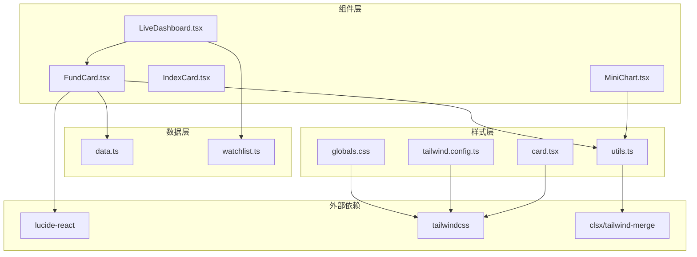
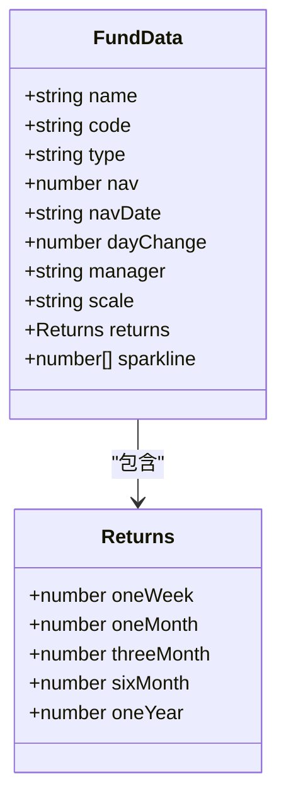
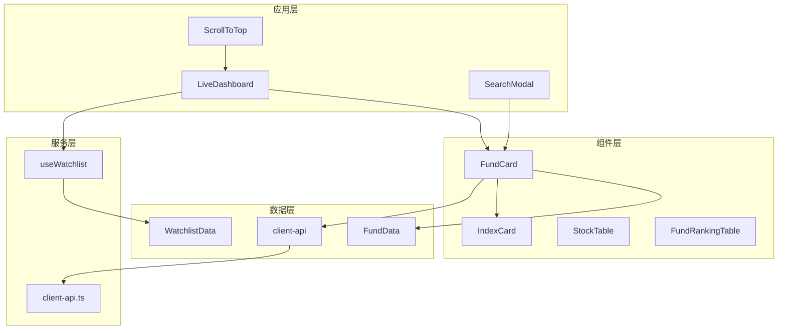
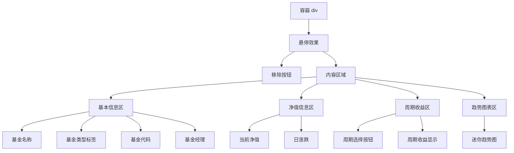
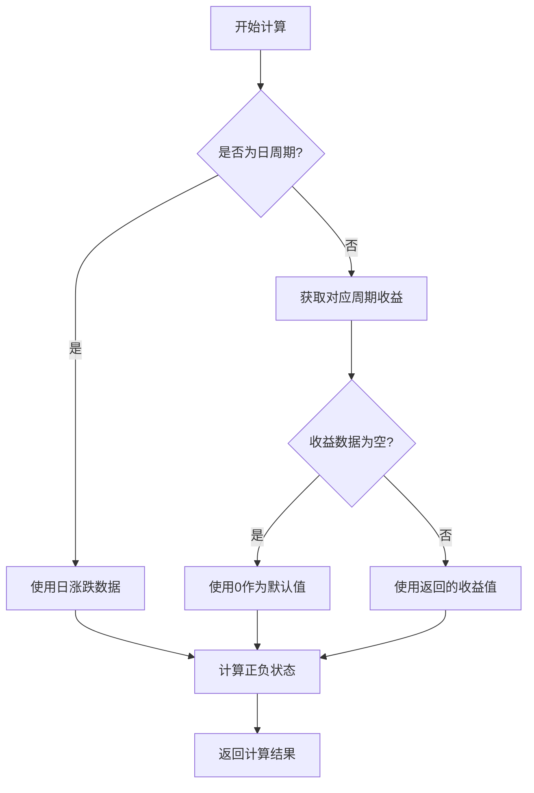
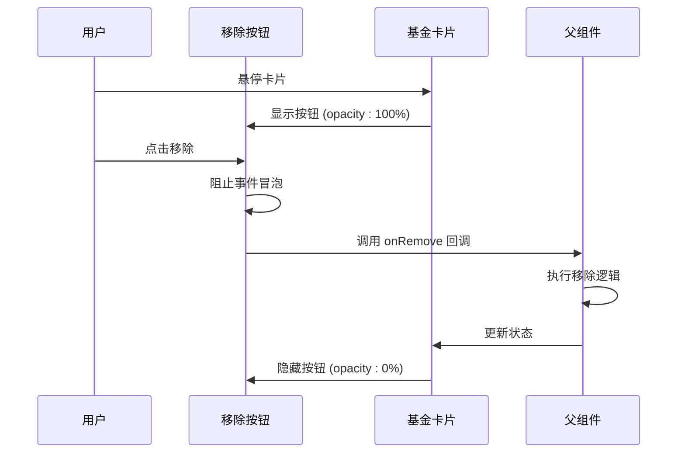
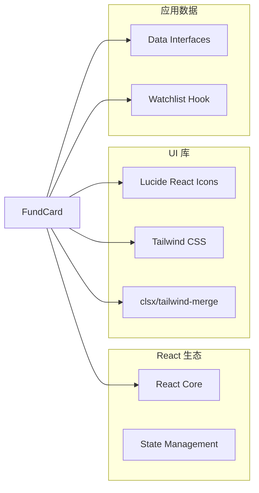
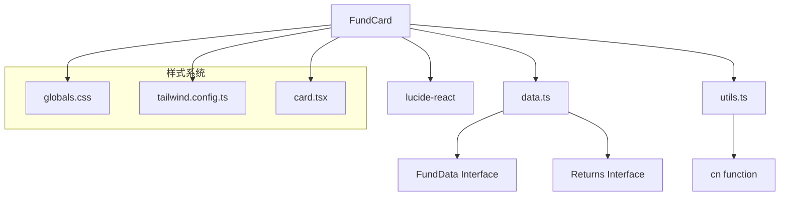

# 基金卡片组件 FundCard

<cite>
**本文档引用的文件**
- [FundCard.tsx](file://components/FundCard.tsx)
- [data.ts](file://lib/data.ts)
- [utils.ts](file://lib/utils.ts)
- [watchlist.ts](file://lib/watchlist.ts)
- [LiveDashboard.tsx](file://components/LiveDashboard.tsx)
- [MiniChart.tsx](file://components/MiniChart.tsx)
- [card.tsx](file://components/ui/card.tsx)
- [globals.css](file://app/globals.css)
- [tailwind.config.ts](file://tailwind.config.ts)
</cite>

## 目录
1. [简介](#简介)
2. [项目结构](#项目结构)
3. [核心组件](#核心组件)
4. [架构概览](#架构概览)
5. [详细组件分析](#详细组件分析)
6. [依赖关系分析](#依赖关系分析)
7. [性能考虑](#性能考虑)
8. [故障排除指南](#故障排除指南)
9. [结论](#结论)

## 简介

FundCard 是一个专门用于展示单只基金实时净值和收益信息的 React 组件。该组件提供了直观的视觉化界面，帮助用户快速了解基金的基本信息、当前净值、日涨跌情况以及多时间周期的收益表现。

该组件支持多种交互功能，包括移除操作、点击跳转和状态指示器，同时具备响应式设计，能够在不同屏幕尺寸下提供良好的用户体验。组件采用现代化的设计语言，使用 Tailwind CSS 进行样式管理，并集成了专业的金融色彩系统。

## 项目结构

FundCard 组件位于项目的组件目录中，与相关的数据模型、工具函数和样式文件协同工作：



**图表来源**
- [FundCard.tsx:1-132](file://components/FundCard.tsx#L1-L132)
- [data.ts:24-41](file://lib/data.ts#L24-L41)
- [utils.ts:1-7](file://lib/utils.ts#L1-L7)

**章节来源**
- [FundCard.tsx:1-132](file://components/FundCard.tsx#L1-L132)
- [data.ts:1-255](file://lib/data.ts#L1-L255)

## 核心组件

### FundData 数据接口

FundCard 组件的核心数据结构是 FundData 接口，它定义了基金的所有必要信息：



**图表来源**
- [data.ts:24-41](file://lib/data.ts#L24-L41)

### 组件 Props 接口

FundCard 组件接受以下 props 参数：

| 属性名 | 类型 | 必需 | 描述 |
|--------|------|------|------|
| data | FundData | 是 | 基金数据对象，包含净值、涨跌等信息 |
| onRemove | () => void | 否 | 移除按钮点击回调函数 |

### 主要功能特性

1. **实时净值显示**：展示基金当前净值（保留4位小数）
2. **日涨跌信息**：显示当日涨跌百分比，使用颜色标识涨跌状态
3. **多周期收益**：支持日、周、月、3月、6月、年等多时间周期收益对比
4. **趋势图表**：可选的迷你趋势图，显示净值变化趋势
5. **交互功能**：支持移除操作和悬停效果

**章节来源**
- [FundCard.tsx:19-131](file://components/FundCard.tsx#L19-L131)
- [data.ts:24-41](file://lib/data.ts#L24-L41)

## 架构概览

FundCard 组件在整个应用架构中的位置和作用：



**图表来源**
- [LiveDashboard.tsx:39-301](file://components/LiveDashboard.tsx#L39-L301)
- [FundCard.tsx:19-131](file://components/FundCard.tsx#L19-L131)
- [watchlist.ts:28-88](file://lib/watchlist.ts#L28-L88)

**章节来源**
- [LiveDashboard.tsx:1-375](file://components/LiveDashboard.tsx#L1-L375)

## 详细组件分析

### 组件结构设计

FundCard 采用了模块化的布局设计，将不同的信息区域清晰分离：



**图表来源**
- [FundCard.tsx:27-129](file://components/FundCard.tsx#L27-L129)

### 数据展示设计

#### 净值变化趋势

组件通过多种方式展示净值变化：

1. **日涨跌显示**：使用 TrendingUp/TrendingDown 图标配合颜色标识
2. **周期收益对比**：支持多时间周期收益的可视化对比
3. **趋势图表**：可选的 SVG 趋势图，自动计算坐标和路径

#### 收益计算逻辑



**图表来源**
- [FundCard.tsx:22-25](file://components/FundCard.tsx#L22-L25)

#### 时间显示机制

组件使用本地化的周期标签，支持以下时间维度：
- 日 (oneDay)：当日涨跌
- 周 (oneWeek)：最近一周收益
- 月 (oneMonth)：最近一月收益
- 3月 (threeMonth)：最近三月收益
- 6月 (sixMonth)：最近六月收益
- 年 (oneYear)：最近一年收益

**章节来源**
- [FundCard.tsx:8-15](file://components/FundCard.tsx#L8-L15)
- [FundCard.tsx:17](file://components/FundCard.tsx#L17)

### 交互功能设计

#### 移除按钮功能

移除按钮采用渐隐渐现的交互设计：



**图表来源**
- [FundCard.tsx:33-41](file://components/FundCard.tsx#L33-L41)

#### 点击跳转功能

虽然 FundCard 本身不直接处理点击跳转，但可以通过父组件的事件处理实现导航功能。组件支持点击事件的传递和阻止冒泡，确保交互的精确控制。

#### 状态指示器

组件使用颜色编码来表示不同的状态：
- 成功状态：绿色 (success) - 表示上涨
- 错误状态：红色 (destructive) - 表示下跌
- 中性状态：灰色 (muted) - 表示默认

**章节来源**
- [FundCard.tsx:34-40](file://components/FundCard.tsx#L34-L40)
- [FundCard.tsx:61-64](file://components/FundCard.tsx#L61-L64)

### 性能优化策略

#### 渲染优化

1. **条件渲染**：仅在存在数据时渲染趋势图表
2. **状态管理**：使用 useState 管理周期选择状态
3. **事件处理**：使用 useCallback 优化事件处理器

#### 计算优化

1. **SVG 计算**：在渲染时动态计算 SVG 路径点坐标
2. **颜色计算**：根据数值自动确定颜色状态
3. **格式化处理**：使用 toFixed 方法进行数值格式化

#### 内存管理

1. **依赖数组**：合理设置 useEffect 和 useCallback 的依赖
2. **清理函数**：避免内存泄漏
3. **条件渲染**：减少不必要的 DOM 元素创建

**章节来源**
- [FundCard.tsx:101-127](file://components/FundCard.tsx#L101-L127)
- [FundCard.tsx:19](file://components/FundCard.tsx#L19)

### 使用示例

#### 基础使用

```typescript
// 在 LiveDashboard 中的使用
<FundCard
  data={fund}
  onRemove={() => removeFund(fund.code)}
/>
```

#### 不同数据状态下的表现

1. **正常数据状态**：显示完整的净值、涨跌和收益信息
2. **空收益数据**：显示默认的 0% 收益值
3. **无趋势数据**：隐藏趋势图表区域
4. **无基金经理信息**：隐藏基金经理显示

#### 自定义配置选项

组件支持以下自定义配置：
- 自定义移除回调函数
- 条件渲染移除按钮
- 响应式布局适配
- 主题颜色定制

**章节来源**
- [LiveDashboard.tsx:187-202](file://components/LiveDashboard.tsx#L187-L202)

## 依赖关系分析

### 外部依赖

FundCard 组件依赖以下外部库和模块：



**图表来源**
- [FundCard.tsx:3-6](file://components/FundCard.tsx#L3-L6)
- [utils.ts:1-7](file://lib/utils.ts#L1-L7)

### 内部依赖关系



**图表来源**
- [FundCard.tsx:4-6](file://components/FundCard.tsx#L4-L6)
- [data.ts:24-41](file://lib/data.ts#L24-L41)
- [utils.ts:4-6](file://lib/utils.ts#L4-L6)

**章节来源**
- [FundCard.tsx:1-132](file://components/FundCard.tsx#L1-L132)
- [data.ts:1-255](file://lib/data.ts#L1-L255)

## 性能考虑

### 渲染性能

1. **虚拟化支持**：对于大量基金数据，可以考虑使用虚拟化列表
2. **懒加载**：趋势图表可以按需加载
3. **防抖处理**：频繁的周期切换可以添加防抖机制

### 内存优化

1. **事件监听**：合理管理事件监听器的生命周期
2. **定时器清理**：确保组件卸载时清理所有定时器
3. **缓存策略**：对计算结果进行适当的缓存

### 网络性能

1. **批量请求**：多个基金数据可以批量获取
2. **缓存机制**：实现数据缓存减少重复请求
3. **错误处理**：优雅处理网络请求失败的情况

### 用户体验优化

1. **加载状态**：为异步数据提供加载指示器
2. **错误边界**：实现错误边界处理异常情况
3. **响应式设计**：确保在移动设备上的良好表现

## 故障排除指南

### 常见问题及解决方案

#### 数据格式问题

**问题**：净值或收益数据格式不正确
**解决方案**：
1. 验证 FundData 接口的字段完整性
2. 添加数据验证和默认值处理
3. 实现类型检查和错误边界

#### 样式显示异常

**问题**：组件样式在某些环境下显示异常
**解决方案**：
1. 检查 Tailwind CSS 配置
2. 验证 CSS 变量的定义
3. 确认主题切换的兼容性

#### 交互功能失效

**问题**：移除按钮或点击事件无法正常工作
**解决方案**：
1. 检查事件处理器的绑定
2. 验证事件冒泡阻止逻辑
3. 确认父组件回调函数的正确性

#### 性能问题

**问题**：大量基金数据导致渲染缓慢
**解决方案**：
1. 实现虚拟化列表
2. 添加数据分页
3. 优化 SVG 渲染逻辑

**章节来源**
- [FundCard.tsx:35](file://components/FundCard.tsx#L35)
- [utils.ts:4-6](file://lib/utils.ts#L4-L6)

## 结论

FundCard 组件是一个设计精良的金融数据展示组件，具有以下特点：

### 设计优势

1. **专业性**：符合金融产品的设计规范，使用专业的色彩系统
2. **可用性**：提供直观的信息层次和清晰的状态指示
3. **响应性**：支持多种屏幕尺寸，适应不同的使用场景
4. **可扩展性**：模块化设计便于功能扩展和定制

### 技术亮点

1. **类型安全**：完整的 TypeScript 接口定义
2. **性能优化**：合理的渲染策略和计算优化
3. **用户体验**：流畅的交互反馈和视觉效果
4. **代码质量**：清晰的代码结构和注释

### 改进建议

1. **国际化支持**：添加多语言支持
2. **无障碍访问**：增强无障碍功能
3. **测试覆盖**：增加单元测试和集成测试
4. **文档完善**：补充更详细的使用文档

该组件为整个基金跟踪应用提供了坚实的基础，能够有效提升用户的投资决策效率和体验质量。