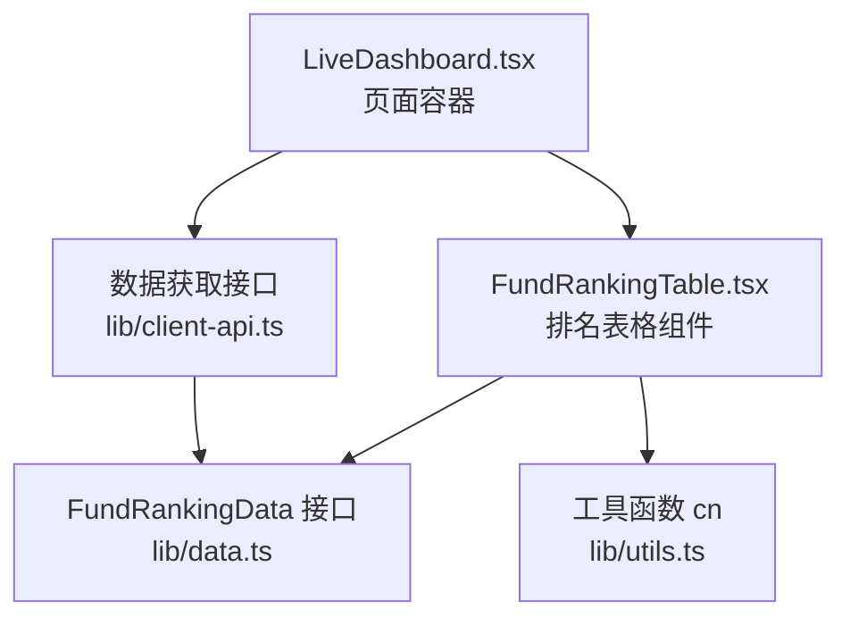
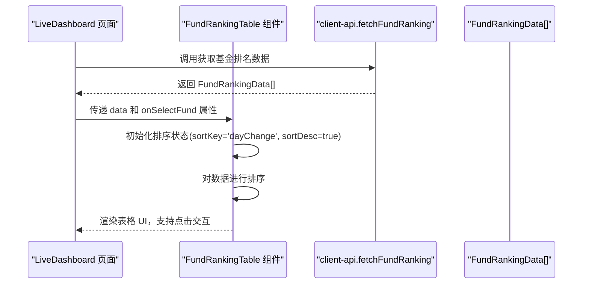
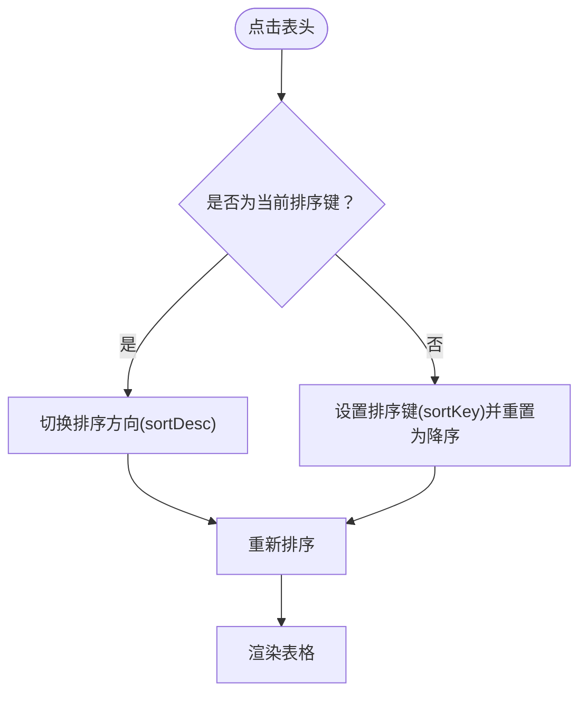
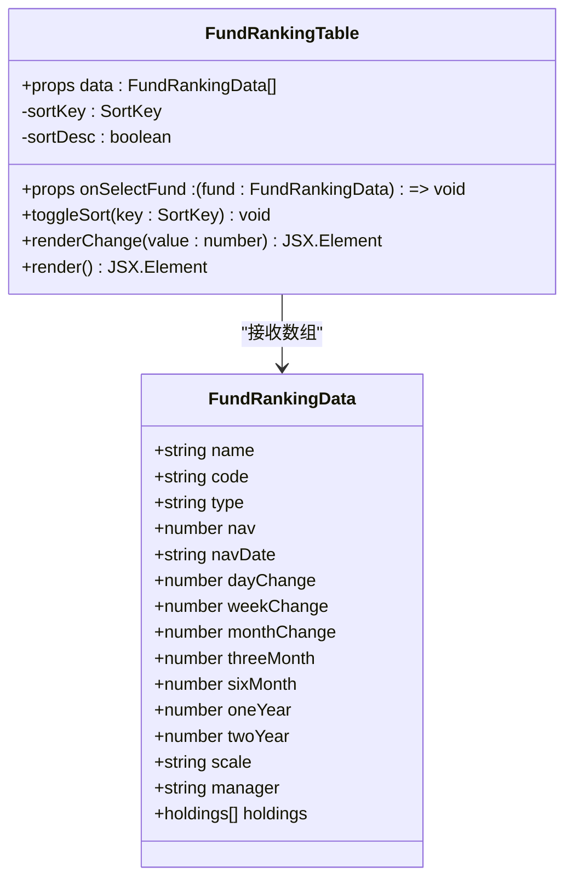
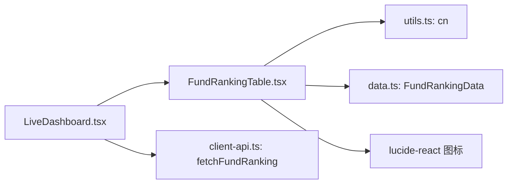

# 基金排名表格组件 FundRankingTable

<cite>
**本文档引用的文件**
- [FundRankingTable.tsx](file://components/FundRankingTable.tsx)
- [data.ts](file://lib/data.ts)
- [utils.ts](file://lib/utils.ts)
- [LiveDashboard.tsx](file://components/LiveDashboard.tsx)
- [client-api.ts](file://lib/client-api.ts)
- [card.tsx](file://components/ui/card.tsx)
- [FundCard.tsx](file://components/FundCard.tsx)
- [tailwind.config.ts](file://tailwind.config.ts)
</cite>

## 更新摘要
**变更内容**
- 新增了 onSelectFund 回调属性，支持点击交互功能
- 扩展了排序机制，支持日、周、月、三月、半年、一年、两年期收益数据的点击排序
- 增强了表格的交互性，支持点击行选择基金详情
- 完善了响应式设计，支持不同屏幕尺寸下的列显示策略

## 目录
1. [简介](#简介)
2. [项目结构](#项目结构)
3. [核心组件](#核心组件)
4. [架构总览](#架构总览)
5. [详细组件分析](#详细组件分析)
6. [依赖关系分析](#依赖关系分析)
7. [性能考量](#性能考量)
8. [故障排除指南](#故障排除指南)
9. [结论](#结论)
10. [附录](#附录)

## 简介
本文件为基金排名表格组件 FundRankingTable 的详细技术文档。该组件用于展示当日基金涨跌幅排行榜，提供市场整体表现的概览。组件支持按日、周、月、三月、半年、一年、两年等不同时间维度对基金进行排序，并通过颜色编码直观呈现涨跌情况。组件采用响应式设计，在不同屏幕尺寸下隐藏或显示相应列，确保在移动端与桌面端均有良好的可读性。**最新版本**增强了交互功能，支持点击选择基金详情，并提供了更丰富的收益数据展示。

## 项目结构
FundRankingTable 位于 components 目录下，作为前端展示层的一部分，与数据层（lib/data.ts、lib/client-api.ts）和页面容器（LiveDashboard.tsx）协同工作。组件通过 props 接收 FundRankingData 数组，内部维护排序状态并渲染表格。

**图表来源**
- [LiveDashboard.tsx:233-236](file://components/LiveDashboard.tsx#L233-L236)
- [FundRankingTable.tsx:10](file://components/FundRankingTable.tsx#L10-L12)
- [data.ts:147-167](file://lib/data.ts#L147-L167)
- [utils.ts:4-6](file://lib/utils.ts#L4-L6)
- [client-api.ts:600-638](file://lib/client-api.ts#L600-L638)

**章节来源**
- [FundRankingTable.tsx:1-192](file://components/FundRankingTable.tsx#L1-L192)
- [LiveDashboard.tsx:233-236](file://components/LiveDashboard.tsx#L233-L236)
- [data.ts:147-167](file://lib/data.ts#L147-L167)
- [utils.ts:4-6](file://lib/utils.ts#L4-L6)
- [client-api.ts:600-638](file://lib/client-api.ts#L600-L638)

## 核心组件
- 组件名称：FundRankingTable
- 功能定位：展示当日基金涨跌幅排行榜，支持多维度排序与响应式列显示
- 输入参数：data（FundRankingData[]）、onSelectFund（可选回调函数）
- 输出：表格 UI，包含排名、名称/代码、类型、净值、各周期涨跌幅等列
- 关键特性：
  - 内置排序逻辑（按日/周/月/三月/半年/一年/两年涨跌幅）
  - 颜色编码（正负涨跌用不同颜色）
  - 响应式列显示（根据屏幕宽度隐藏/显示不同周期列）
  - 排名样式（前三名特殊样式）
  - **新增**：点击交互功能，支持选择基金详情

**章节来源**
- [FundRankingTable.tsx:10-192](file://components/FundRankingTable.tsx#L10-L192)

## 架构总览
FundRankingTable 作为展示组件，接收来自 LiveDashboard 的 FundRankingData[] 数据，内部通过 useState 维护排序状态（sortKey、sortDesc），并在渲染时对数据进行排序。数据来源由 client-api.ts 提供的 fetchFundRanking 方法负责拉取。

**图表来源**
- [LiveDashboard.tsx:73-112](file://components/LiveDashboard.tsx#L73-L112)
- [client-api.ts:600-638](file://lib/client-api.ts#L600-L638)
- [FundRankingTable.tsx:10-35](file://components/FundRankingTable.tsx#L10-L35)

**章节来源**
- [LiveDashboard.tsx:73-112](file://components/LiveDashboard.tsx#L73-L112)
- [client-api.ts:600-638](file://lib/client-api.ts#L600-L638)
- [FundRankingTable.tsx:10-35](file://components/FundRankingTable.tsx#L10-L35)

## 详细组件分析

### Props 接口与数据模型
- 组件接收 data: FundRankingData[] 和可选的 onSelectFund 回调函数，其中 FundRankingData 定义如下：
  - name: 基金名称
  - code: 基金代码
  - type: 基金类型
  - nav: 基金净值
  - navDate: 净值日期
  - dayChange: 日涨跌幅
  - weekChange: 近一周涨跌幅
  - monthChange: 近一月涨跌幅
  - threeMonth: 近三月涨跌幅
  - sixMonth: 近六月涨跌幅
  - oneYear: 近一年涨跌幅
  - twoYear: 近两年涨跌幅
  - scale?: 基金规模（可选）
  - manager?: 基金经理（可选）
  - holdings?: 持仓信息（可选）

- 使用示例（路径参考）：
  - 数据接口定义：[data.ts:147-167](file://lib/data.ts#L147-L167)
  - 页面传参调用：[LiveDashboard.tsx:233-236](file://components/LiveDashboard.tsx#L233-L236)

**章节来源**
- [data.ts:147-167](file://lib/data.ts#L147-L167)
- [LiveDashboard.tsx:233-236](file://components/LiveDashboard.tsx#L233-L236)

### 表格设计与交互
- 表头列：
  - 排名：固定显示，前三名使用强调样式
  - 名称/代码：显示基金名称与代码
  - 类型：在小屏隐藏，大屏显示
  - 净值：右对齐，使用等宽字体
  - 各周期涨跌幅：支持点击排序（日/周/月/三月/半年/一年/两年）
- 排序逻辑：
  - sortKey：当前排序字段
  - sortDesc：是否降序
  - 点击表头切换排序字段或反转排序方向
- 排名样式：
  - 前三名使用强调背景与主色调文本
  - 其他行交替背景色提升可读性
- 响应式列：
  - 日涨幅：始终显示
  - 近1周：中等屏及以上显示
  - 近1月：中等屏及以上显示
  - 近3月：大屏及以上显示
  - 近6月：大屏及以上显示
  - 近1年：超大屏及以上显示
  - 近2年：超大屏及以上显示
- **新增**：点击交互
  - 整行点击触发 onSelectFund 回调
  - 支持选择特定基金查看详情

**章节来源**
- [FundRankingTable.tsx:61-192](file://components/FundRankingTable.tsx#L61-L192)

### 视觉设计与颜色编码
- 颜色系统基于 Tailwind CSS 自定义变量：
  - 成功色（上涨）：hsl(var(--success))
  - 错误色（下跌）：hsl(var(--destructive))
  - 主色：hsl(var(--primary))
  - 次要背景：hsl(var(--secondary))
- 排名样式：
  - 前三名：使用主色背景与主色文字
  - 其余：使用次色文字
- 涨跌幅显示：
  - 正数：使用成功色，显示"+"号
  - 负数：使用错误色，显示负号
- 表格行样式：
  - 交替行背景色，悬停高亮
  - 表头使用次色背景与次色文字
  - **新增**：点击行具有指针光标，提升交互体验

**章节来源**
- [FundRankingTable.tsx:46-59](file://components/FundRankingTable.tsx#L46-L59)
- [tailwind.config.ts:21-63](file://tailwind.config.ts#L21-L63)

### 数据排序逻辑
- 排序键类型：'dayChange' | 'weekChange' | 'monthChange' | 'threeMonth' | 'sixMonth' | 'oneYear' | 'twoYear'
- 排序规则：
  - 当前排序键相同时，切换升/降序
  - 切换到新排序键时，默认降序
  - 使用数值比较进行排序
- 排序图标：
  - 未激活：默认图标
  - 升序：向右箭头
  - 降序：向上箭头

**图表来源**
- [FundRankingTable.tsx:28-35](file://components/FundRankingTable.tsx#L28-L35)
- [FundRankingTable.tsx:22-26](file://components/FundRankingTable.tsx#L22-L26)

**章节来源**
- [FundRankingTable.tsx:22-35](file://components/FundRankingTable.tsx#L22-L35)

### 组件类图

**图表来源**
- [FundRankingTable.tsx:10-192](file://components/FundRankingTable.tsx#L10-L192)
- [data.ts:147-167](file://lib/data.ts#L147-L167)

**章节来源**
- [FundRankingTable.tsx:10-192](file://components/FundRankingTable.tsx#L10-L192)
- [data.ts:147-167](file://lib/data.ts#L147-L167)

### 使用示例与最佳实践
- 基本用法（路径参考）：
  - 在页面中引入组件并传入数据：[LiveDashboard.tsx:233-236](file://components/LiveDashboard.tsx#L233-L236)
- 数据格式化建议：
  - 确保传入的 FundRankingData[] 包含所有必需字段
  - 数值字段建议保留两位小数，便于统一展示
- 自定义展示选项：
  - 可通过外部容器控制组件的宽度与边距
  - 可结合卡片组件（Card）统一风格：[card.tsx:1-79](file://components/ui/card.tsx#L1-L79)
- 与 FundCard 的一致性：
  - FundCard 也使用相同的颜色编码策略，保持界面一致性：[FundCard.tsx:19-104](file://components/FundCard.tsx#L19-L104)
- **新增**：交互式使用
  - 通过 onSelectFund 回调处理基金选择事件
  - 支持跳转到基金详情页面或显示模态框

**章节来源**
- [LiveDashboard.tsx:233-236](file://components/LiveDashboard.tsx#L233-L236)
- [card.tsx:1-79](file://components/ui/card.tsx#L1-L79)
- [FundCard.tsx:19-104](file://components/FundCard.tsx#L19-L104)

## 依赖关系分析
- 组件依赖：
  - 内部状态：useState（排序状态）
  - 工具函数：cn（类名合并）
  - 图标：lucide-react 的排序图标
- 外部依赖：
  - 数据模型：FundRankingData（lib/data.ts）
  - 数据获取：client-api.ts 的 fetchFundRanking
  - 页面容器：LiveDashboard.tsx
- 依赖关系图：

**图表来源**
- [FundRankingTable.tsx:3-6](file://components/FundRankingTable.tsx#L3-L6)
- [data.ts:147-167](file://lib/data.ts#L147-L167)
- [LiveDashboard.tsx:233-236](file://components/LiveDashboard.tsx#L233-L236)
- [client-api.ts:600-638](file://lib/client-api.ts#L600-L638)

**章节来源**
- [FundRankingTable.tsx:3-6](file://components/FundRankingTable.tsx#L3-L6)
- [data.ts:147-167](file://lib/data.ts#L147-L167)
- [LiveDashboard.tsx:233-236](file://components/LiveDashboard.tsx#L233-L236)
- [client-api.ts:600-638](file://lib/client-api.ts#L600-L638)

## 性能考量
- 排序复杂度：
  - 当前实现对每个渲染周期进行一次排序，时间复杂度 O(n log n)
  - 对于较小的数据集（如 20 条记录）性能影响可忽略
- 优化建议：
  - 若数据量增大，可在父组件缓存已排序结果，避免重复排序
  - 使用 useMemo 缓存排序结果，减少不必要的重渲染
  - 将排序逻辑抽取为独立函数，便于测试与复用
- 数据更新策略：
  - LiveDashboard 中使用定时器每 30 秒刷新一次数据，保证信息时效性
  - 刷新时通过 Promise.allSettled 并行请求多个接口，提升加载速度
  - 刷新状态通过 isRefreshing 控制按钮禁用与动画
- **新增**：交互性能
  - 点击事件使用防抖处理，避免频繁触发
  - 回调函数通过 useCallback 包装，减少不必要的重新渲染

**章节来源**
- [LiveDashboard.tsx:73-112](file://components/LiveDashboard.tsx#L73-L112)
- [client-api.ts:600-638](file://lib/client-api.ts#L600-L638)

## 故障排除指南
- 无数据时的处理：
  - 当 data 为空时，组件返回占位提示，避免渲染空表格
  - 占位样式使用虚线边框与居中布局，提升用户体验
- 排序异常：
  - 确认传入的数值字段均为数字类型，避免 NaN 导致排序异常
  - 检查 sortKey 是否为合法枚举值
- 样式问题：
  - 如颜色不生效，检查 Tailwind CSS 自定义变量是否正确配置
  - 确认 cn 工具函数正常合并类名
- 数据源问题：
  - 若 fetchFundRanking 返回空数据，LiveDashboard 会回退到模拟数据或保持上次有效数据
- **新增**：交互问题
  - 确认 onSelectFund 回调函数正确传入
  - 检查点击事件是否被其他元素阻止传播

**章节来源**
- [FundRankingTable.tsx:14-20](file://components/FundRankingTable.tsx#L14-L20)
- [LiveDashboard.tsx:73-112](file://components/LiveDashboard.tsx#L73-L112)
- [client-api.ts:600-638](file://lib/client-api.ts#L600-L638)

## 结论
FundRankingTable 组件通过简洁的接口与清晰的排序逻辑，实现了对当日基金涨跌幅的高效展示。组件具备良好的响应式设计与一致的视觉风格，能够满足用户对市场概览的需求。**最新版本**增强了交互功能，支持点击选择基金详情，提升了用户体验。配合 LiveDashboard 的定时刷新机制，确保了数据的实时性与准确性。未来可在大数据场景下进一步优化排序与渲染性能，并增强错误处理与可访问性支持。

## 附录
- 相关文件路径参考：
  - 组件实现：[FundRankingTable.tsx](file://components/FundRankingTable.tsx)
  - 数据模型：[data.ts](file://lib/data.ts)
  - 工具函数：[utils.ts](file://lib/utils.ts)
  - 页面容器：[LiveDashboard.tsx](file://components/LiveDashboard.tsx)
  - 数据获取：[client-api.ts](file://lib/client-api.ts)
  - UI 卡片：[card.tsx](file://components/ui/card.tsx)
  - 基金卡片：[FundCard.tsx](file://components/FundCard.tsx)
  - 样式配置：[tailwind.config.ts](file://tailwind.config.ts)