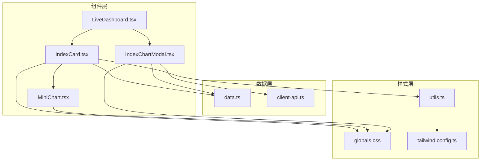
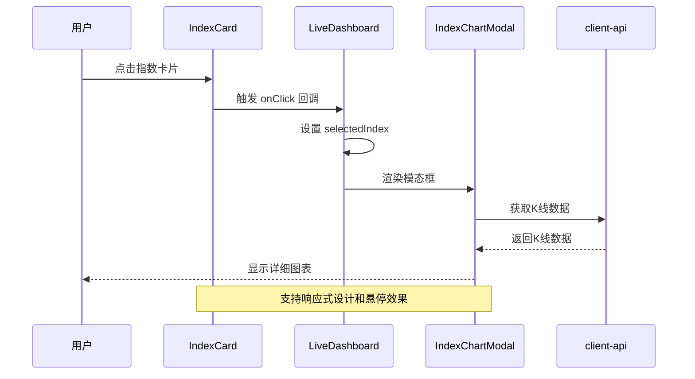
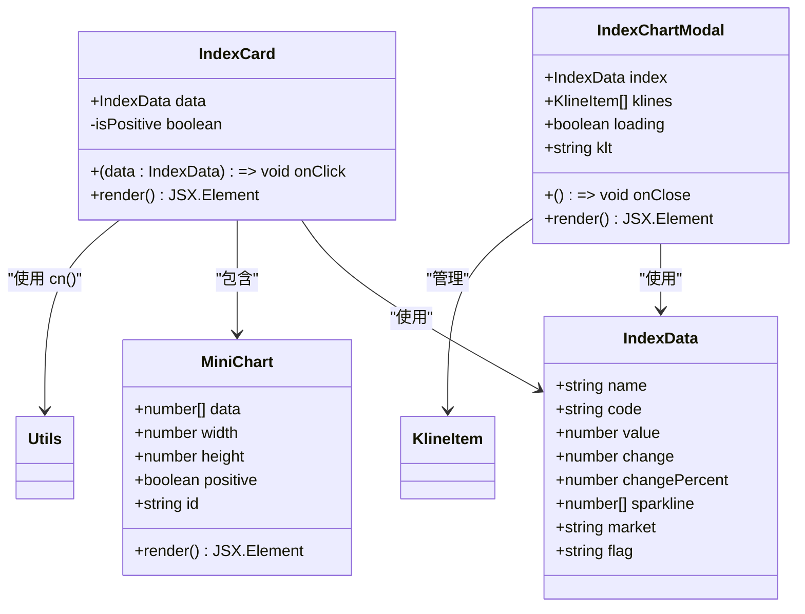
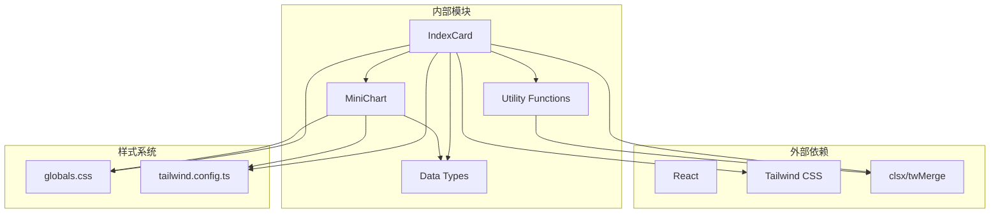

# 指数卡片组件 IndexCard

<cite>
**本文档引用的文件**
- [IndexCard.tsx](file://components/IndexCard.tsx)
- [IndexChartModal.tsx](file://components/IndexChartModal.tsx)
- [data.ts](file://lib/data.ts)
- [LiveDashboard.tsx](file://components/LiveDashboard.tsx)
- [MiniChart.tsx](file://components/MiniChart.tsx)
- [utils.ts](file://lib/utils.ts)
- [globals.css](file://app/globals.css)
- [tailwind.config.ts](file://tailwind.config.ts)
</cite>

## 目录
1. [简介](#简介)
2. [项目结构](#项目结构)
3. [核心组件](#核心组件)
4. [架构概览](#架构概览)
5. [详细组件分析](#详细组件分析)
6. [依赖关系分析](#依赖关系分析)
7. [性能考虑](#性能考虑)
8. [故障排除指南](#故障排除指南)
9. [结论](#结论)

## 简介

IndexCard 是一个专门用于展示单个金融指数实时数据的 React 组件。该组件提供了简洁而直观的界面，用于显示指数名称、当前值、涨跌幅度和涨跌百分比等关键信息。组件支持点击查看详情、悬停效果和响应式设计，是金融仪表板中的重要组成部分。

## 项目结构

IndexCard 组件位于项目的组件目录中，与相关的图表组件和数据类型定义紧密集成：



**图表来源**
- [IndexCard.tsx:1-53](file://components/IndexCard.tsx#L1-L53)
- [IndexChartModal.tsx:1-367](file://components/IndexChartModal.tsx#L1-L367)
- [data.ts:1-255](file://lib/data.ts#L1-L255)

**章节来源**
- [IndexCard.tsx:1-53](file://components/IndexCard.tsx#L1-L53)
- [LiveDashboard.tsx:1-375](file://components/LiveDashboard.tsx#L1-L375)

## 核心组件

### IndexData 数据接口

IndexCard 组件的核心数据结构由 `IndexData` 接口定义，包含以下关键字段：

| 字段名 | 类型 | 描述 | 必需 |
|--------|------|------|------|
| name | string | 指数名称 | 是 |
| code | string | 指数代码 | 是 |
| value | number | 当前指数值 | 是 |
| change | number | 涨跌金额 | 是 |
| changePercent | number | 涨跌百分比 | 是 |
| sparkline | number[] | 折线图数据点数组 | 否 |
| market | string | 市场代码 | 是 |
| flag | string | 国家/地区旗帜表情符号 | 是 |

### 组件 Props 接口

IndexCard 组件接受以下 props：

| 属性名 | 类型 | 描述 | 默认值 |
|--------|------|------|------|
| data | IndexData | 指数数据对象 | 必需 |
| onClick | (data: IndexData) => void | 点击事件处理器 | undefined |

**章节来源**
- [data.ts:1-10](file://lib/data.ts#L1-L10)
- [IndexCard.tsx:5-11](file://components/IndexCard.tsx#L5-L11)

## 架构概览

IndexCard 组件采用模块化设计，与多个相关组件协同工作：



**图表来源**
- [IndexCard.tsx:14-21](file://components/IndexCard.tsx#L14-L21)
- [LiveDashboard.tsx:167-169](file://components/LiveDashboard.tsx#L167-L169)
- [IndexChartModal.tsx:27-33](file://components/IndexChartModal.tsx#L27-L33)

## 详细组件分析

### 视觉设计系统

IndexCard 采用了专业的金融仪表板设计语言：

#### 颜色编码系统

组件使用颜色来直观表示涨跌状态：
- **上涨状态**: 使用 `text-success` 和 `bg-success/10` 类，颜色为绿色系
- **下跌状态**: 使用 `text-destructive` 和 `bg-destructive/10` 类，颜色为红色系
- **背景**: 使用 `hover:bg-secondary/50` 提供悬停反馈

#### 字体和排版

- **标题**: `text-xs font-medium truncate` - 10px 字体，中等字重，支持文本截断
- **代码**: `text-[10px] text-muted-foreground` - 10px 字体，灰色占位符颜色
- **数值**: `text-xs sm:text-sm font-bold tabular-nums` - 数字等宽字体，支持响应式放大
- **涨跌**: `text-[10px] tabular-nums` - 10px 数字等宽字体

#### 布局设计

组件采用 Flexbox 布局，实现左右对齐和响应式间距：
- **左侧区域**: 包含旗帜表情符号、指数名称和代码
- **右侧区域**: 包含数值、涨跌幅度、涨跌百分比和迷你图表
- **间距**: `gap-3` 在小屏幕下调整为 `sm:gap-4`

### 交互行为

#### 点击事件处理

IndexCard 支持可选的点击事件处理，当提供 `onClick` 回调时：
- 自动添加 `cursor-pointer` 样式指示可点击状态
- 点击时调用传入的回调函数并传递完整的指数数据

#### 悬停效果

组件提供平滑的悬停过渡效果：
- `transition-colors` 实现颜色过渡动画
- `hover:bg-secondary/50` 提供柔和的背景色变化

#### 响应式适配

组件针对不同屏幕尺寸进行优化：
- **移动端**: 右侧内容在小屏幕上隐藏，优先显示核心指标
- **平板及以上**: 显示完整的数值、涨跌信息和迷你图表
- **表格布局**: 使用 `hidden sm:block` 控制元素显示

### 性能优化特性

#### 数据格式化

组件使用本地化数字格式化：
- `toLocaleString('zh-CN', { minimumFractionDigits: 2, maximumFractionDigits: 2 })`
- 确保数字显示的一致性和可读性

#### 条件渲染

- 迷你图表仅在数据有效时渲染
- 图表容器使用 `hidden sm:block` 实现条件显示
- 支持空数据状态的优雅降级

**章节来源**
- [IndexCard.tsx:14-52](file://components/IndexCard.tsx#L14-L52)

### 组件类图



**图表来源**
- [IndexCard.tsx:1-53](file://components/IndexCard.tsx#L1-L53)
- [data.ts:1-10](file://lib/data.ts#L1-L10)
- [MiniChart.tsx:1-57](file://components/MiniChart.tsx#L1-L57)
- [IndexChartModal.tsx:27-33](file://components/IndexChartModal.tsx#L27-L33)

### 使用示例

#### 基础用法

```typescript
// 在 LiveDashboard 中的使用
<IndexCard 
  data={index} 
  onClick={setSelectedIndex} 
/>
```

#### 自定义样式选项

组件支持通过 Tailwind CSS 类进行样式定制：
- 修改圆角: `rounded-lg` 或 `rounded-full`
- 调整内边距: `px-4 py-3` 或 `p-2`
- 改变悬停效果: `hover:bg-primary/10`
- 自定义宽度: `w-full` 或 `max-w-md`

#### 不同场景下的渲染

1. **实时数据场景**: 从 API 获取最新数据，支持自动刷新
2. **静态演示场景**: 使用 mock 数据进行演示
3. **自定义数据源**: 支持第三方数据源集成

### 错误处理和边界情况

组件具备良好的错误处理能力：
- 缺少 sparkline 数据时优雅降级
- 空数据状态的视觉反馈
- 数字格式化的异常保护

**章节来源**
- [IndexCard.tsx:44-48](file://components/IndexCard.tsx#L44-L48)
- [MiniChart.tsx:9-10](file://components/MiniChart.tsx#L9-L10)

## 依赖关系分析

IndexCard 组件的依赖关系体现了清晰的分层架构：



**图表来源**
- [IndexCard.tsx:1-2](file://components/IndexCard.tsx#L1-L2)
- [utils.ts:1-7](file://lib/utils.ts#L1-L7)
- [globals.css:1-125](file://app/globals.css#L1-L125)

**章节来源**
- [IndexCard.tsx:1-3](file://components/IndexCard.tsx#L1-L3)
- [utils.ts:1-7](file://lib/utils.ts#L1-L7)

## 性能考虑

### 渲染优化

1. **条件渲染**: 迷你图表仅在数据有效时渲染，减少不必要的 DOM 操作
2. **样式合并**: 使用 `cn` 函数合并多个 Tailwind 类，避免重复计算
3. **响应式设计**: 使用 CSS 媒体查询而非 JavaScript 条件判断

### 内存管理

1. **数据结构**: 使用简单数组存储 sparkline 数据，内存占用最小化
2. **事件处理**: 点击事件使用闭包传递数据，避免额外的状态管理
3. **组件卸载**: 模态框组件在关闭时自动清理相关资源

### 可访问性设计

1. **键盘导航**: 支持 Tab 键导航和 Enter 键激活
2. **屏幕阅读器**: 使用语义化 HTML 结构
3. **颜色对比**: 确保涨跌状态的颜色对比度符合 WCAG 标准
4. **焦点管理**: 提供清晰的焦点指示器

## 故障排除指南

### 常见问题

1. **数字显示格式异常**
   - 检查 `toLocaleString` 参数设置
   - 确认数据类型为 number 而非字符串

2. **图表不显示**
   - 验证 sparkline 数据长度至少为 2
   - 检查数据数组是否为空或 undefined

3. **点击事件无效**
   - 确认 onClick 回调函数正确传递
   - 检查父组件的状态管理逻辑

### 调试技巧

1. **开发工具检查**
   - 使用浏览器开发者工具检查元素层级
   - 验证 CSS 类是否正确应用

2. **数据验证**
   - 在组件中添加 console.log 输出关键数据
   - 检查数据格式和类型

**章节来源**
- [IndexCard.tsx:12-12](file://components/IndexCard.tsx#L12-L12)
- [MiniChart.tsx:10-10](file://components/MiniChart.tsx#L10-L10)

## 结论

IndexCard 组件是一个设计精良的金融数据展示组件，具有以下特点：

1. **专业设计**: 采用金融仪表板的标准设计语言，颜色编码直观易懂
2. **响应式布局**: 完美适配各种屏幕尺寸，提供一致的用户体验
3. **性能优化**: 通过条件渲染和样式合并实现高效的渲染性能
4. **可扩展性**: 模块化设计便于功能扩展和定制
5. **可访问性**: 符合无障碍标准，支持多种用户需求

该组件为金融数据可视化提供了坚实的基础，可以轻松集成到各种投资组合管理和市场监控应用中。