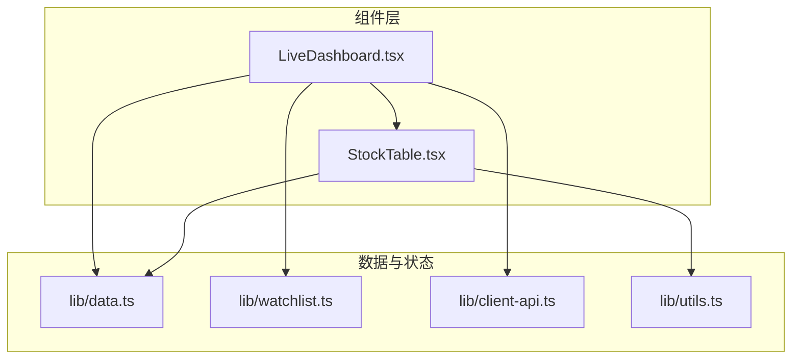
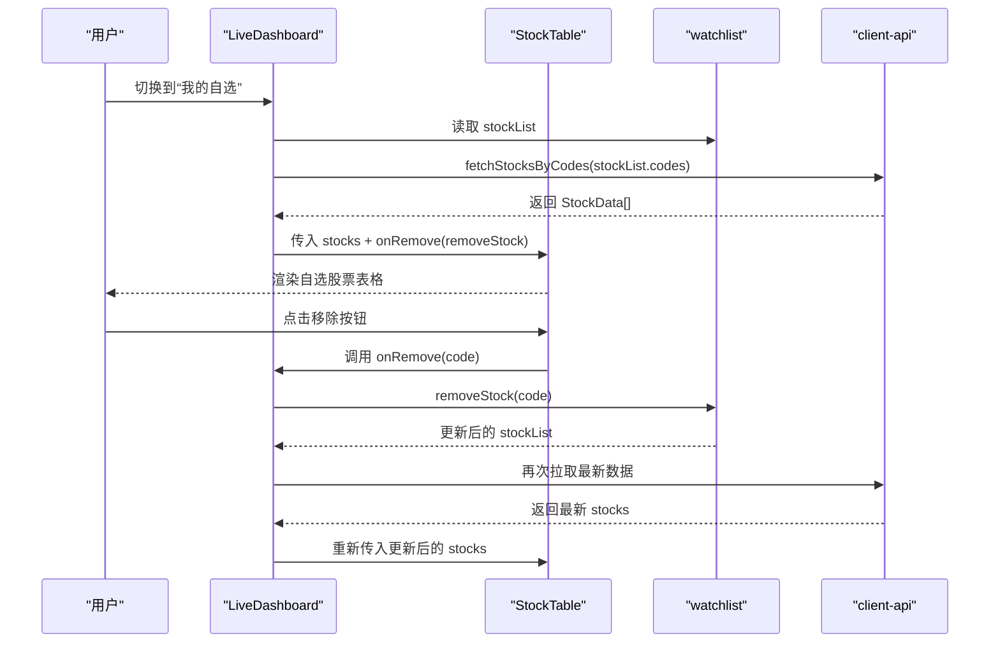
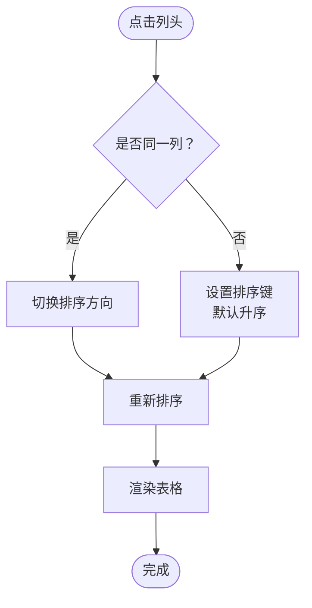
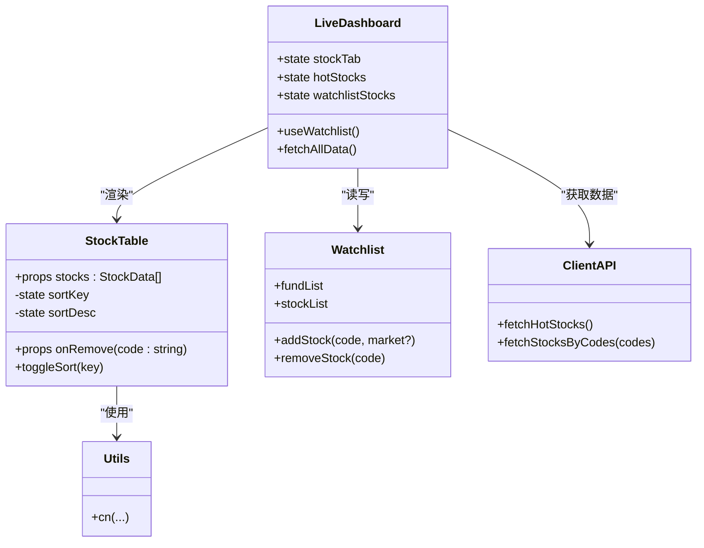

# 股票表格组件 StockTable

<cite>
**本文档引用的文件**
- [StockTable.tsx](file://components/StockTable.tsx)
- [data.ts](file://lib/data.ts)
- [watchlist.ts](file://lib/watchlist.ts)
- [LiveDashboard.tsx](file://components/LiveDashboard.tsx)
- [client-api.ts](file://lib/client-api.ts)
- [utils.ts](file://lib/utils.ts)
- [README.md](file://README.md)
</cite>

## 目录
1. [简介](#简介)
2. [项目结构](#项目结构)
3. [核心组件](#核心组件)
4. [架构总览](#架构总览)
5. [详细组件分析](#详细组件分析)
6. [依赖关系分析](#依赖关系分析)
7. [性能考虑](#性能考虑)
8. [故障排除指南](#故障排除指南)
9. [结论](#结论)
10. [附录](#附录)

## 简介
StockTable 是一个用于展示股票列表数据的表格组件，支持“热门股票”和“自选股票”两种模式。组件提供列排序、数据格式化、交互式移除等功能，并在 LiveDashboard 中与数据获取层、自选列表状态管理协同工作，实现从数据源到用户界面的完整闭环。

## 项目结构
StockTable 位于 components 目录下，配合 lib 下的数据类型定义、自选列表状态管理以及数据获取模块共同工作。LiveDashboard 负责调度数据获取与状态管理，并根据用户选择在“热门成交”和“我的自选”之间切换展示。

图表来源
- [StockTable.tsx:1-144](file://components/StockTable.tsx#L1-L144)
- [LiveDashboard.tsx:1-301](file://components/LiveDashboard.tsx#L1-L301)
- [data.ts:12-22](file://lib/data.ts#L12-L22)
- [watchlist.ts:28-88](file://lib/watchlist.ts#L28-L88)
- [client-api.ts:203-240](file://lib/client-api.ts#L203-L240)
- [utils.ts:4-6](file://lib/utils.ts#L4-L6)

章节来源
- [README.md:132-161](file://README.md#L132-L161)
- [StockTable.tsx:1-144](file://components/StockTable.tsx#L1-L144)
- [LiveDashboard.tsx:1-301](file://components/LiveDashboard.tsx#L1-L301)

## 核心组件
StockTable 接收两个主要 props：
- stocks: StockData[] — 要展示的股票数据数组
- onRemove?: (code: string) => void — 当提供该回调时，表格右侧会显示移除按钮，点击触发 onRemove(code)

内部状态：
- sortKey: 'changePercent' | 'price' | 'turnover' — 当前排序字段
- sortDesc: boolean — 是否降序排列

排序逻辑：
- 支持按“涨跌幅”、“现价”、“成交额”排序
- “成交额”列使用 parseFloat 解析字符串数值进行比较
- 点击同一列可切换升/降序；点击不同列则重置为升序

表格列定义与交互：
- 名称/代码：固定列，包含股票名称与代码
- 现价：右对齐，数字格式化
- 涨跌幅：右对齐，正负颜色区分，带箭头图标
- 最高/最低：隐藏列（sm 屏以上可见）
- 成交量：隐藏列（md 屏以上可见）
- 成交额：右对齐，隐藏列（lg 屏以上可见，支持排序）
- 移除列：仅当 onRemove 提供时显示，按钮悬浮高亮

数据格式化：
- 价格保留两位小数
- 涨跌幅保留两位小数并带百分号
- 成交量与成交额采用中文单位（亿、万、手）的友好显示

章节来源
- [StockTable.tsx:10-34](file://components/StockTable.tsx#L10-L34)
- [StockTable.tsx:36-142](file://components/StockTable.tsx#L36-L142)
- [data.ts:12-22](file://lib/data.ts#L12-L22)

## 架构总览
StockTable 在 LiveDashboard 中被两种数据源驱动：
- 热门股票：直接使用 mock 数据或实时接口返回的热门股票列表
- 自选股票：根据 watchlist 中的股票代码动态拉取实时行情

图表来源
- [LiveDashboard.tsx:264-276](file://components/LiveDashboard.tsx#L264-L276)
- [LiveDashboard.tsx:40-41](file://components/LiveDashboard.tsx#L40-L41)
- [client-api.ts:421-458](file://lib/client-api.ts#L421-L458)
- [watchlist.ts:79-85](file://lib/watchlist.ts#L79-L85)

## 详细组件分析

### Props 接口与数据模型
- 输入 props
  - stocks: StockData[] — 必填，包含 name、code、price、change、changePercent、volume、turnover、high、low
  - onRemove?: (code: string) => void — 可选，用于自选股票的移除交互
- 内部状态
  - sortKey: 当前排序键
  - sortDesc: 当前排序方向
- 输出行为
  - 点击列头触发排序切换
  - 点击移除按钮触发 onRemove 回调

章节来源
- [StockTable.tsx:10-34](file://components/StockTable.tsx#L10-L34)
- [data.ts:12-22](file://lib/data.ts#L12-L22)

### 表格设计与列定义
- 列布局
  - 名称/代码：左侧固定，包含股票名称与代码
  - 现价：右对齐，数字等宽字体
  - 涨跌幅：右对齐，正负颜色区分，带箭头图标
  - 最高/最低：隐藏列（sm 屏以上可见）
  - 成交量：隐藏列（md 屏以上可见）
  - 成交额：右对齐，隐藏列（lg 屏以上可见），支持排序
  - 移除列：仅在提供 onRemove 时显示
- 响应式显示
  - 使用 Tailwind 的断点类控制列的显示/隐藏
- 视觉样式
  - 行交替背景色
  - 悬停高亮
  - 正负涨跌颜色区分

章节来源
- [StockTable.tsx:36-142](file://components/StockTable.tsx#L36-L142)

### 排序功能与数据格式化
- 排序逻辑
  - 支持三列排序：changePercent、price、turnover
  - turnover 使用 parseFloat 解析字符串数值
  - 点击同一列切换升/降序；点击不同列重置为升序
- 数据格式化
  - 价格：保留两位小数
  - 涨跌幅：保留两位小数并带百分号，正数带加号
  - 成交量/成交额：中文单位友好显示（亿、万、手）

图表来源
- [StockTable.tsx:27-34](file://components/StockTable.tsx#L27-L34)
- [StockTable.tsx:14-25](file://components/StockTable.tsx#L14-L25)

章节来源
- [StockTable.tsx:14-34](file://components/StockTable.tsx#L14-L34)

### 交互特性
- 行点击
  - 表格行具备 hover 效果与背景色变化，但未绑定行点击事件
- 排序切换
  - 点击列头触发排序逻辑
- 批量操作
  - 通过 onRemove 回调实现单个移除
  - 未实现多选/批量移除
- 移除交互
  - 仅在提供 onRemove 时显示移除按钮
  - 悬停显示，点击触发回调

章节来源
- [StockTable.tsx:121-131](file://components/StockTable.tsx#L121-L131)
- [LiveDashboard.tsx:264-276](file://components/LiveDashboard.tsx#L264-L276)

### 使用示例与数据源适配
- 热门股票模式
  - 直接传入 hotStocks 数据，不提供 onRemove
  - 适用于“热门成交”标签页
- 自选股票模式
  - 传入 watchlistStocks 数据，并提供 onRemove(removeStock)
  - 适用于“我的自选”标签页
- 数据源适配
  - 热门股票：mock 数据或 fetchHotStocks 接口
  - 自选股票：根据 watchlist 中的股票代码调用 fetchStocksByCodes 获取实时数据
- 自定义列配置
  - 可通过扩展 props 或在父组件中控制列的显示/隐藏（基于现有响应式类）

章节来源
- [LiveDashboard.tsx:264-276](file://components/LiveDashboard.tsx#L264-L276)
- [client-api.ts:203-240](file://lib/client-api.ts#L203-L240)
- [client-api.ts:421-458](file://lib/client-api.ts#L421-L458)
- [data.ts:136-145](file://lib/data.ts#L136-L145)

## 依赖关系分析
- 组件依赖
  - StockTable 依赖 utils.ts 的 cn 工具函数进行类名合并
  - 使用 lucide-react 的图标组件（ArrowUpDown、ArrowUpRight、ArrowDownRight、X）
- 数据依赖
  - StockData 接口定义了表格所需字段
  - LiveDashboard 通过 client-api.ts 获取实时数据
  - watchlist.ts 提供自选列表的状态管理与持久化
- 状态依赖
  - LiveDashboard 维护当前标签页状态（hot/watchlist）与数据状态
  - watchlist 状态变更后触发重新获取数据

图表来源
- [StockTable.tsx:10-34](file://components/StockTable.tsx#L10-L34)
- [LiveDashboard.tsx:40-95](file://components/LiveDashboard.tsx#L40-L95)
- [watchlist.ts:28-88](file://lib/watchlist.ts#L28-L88)
- [client-api.ts:203-240](file://lib/client-api.ts#L203-L240)
- [utils.ts:4-6](file://lib/utils.ts#L4-L6)

章节来源
- [StockTable.tsx:1-6](file://components/StockTable.tsx#L1-L6)
- [LiveDashboard.tsx:1-375](file://components/LiveDashboard.tsx#L1-L375)
- [watchlist.ts:1-89](file://lib/watchlist.ts#L1-L89)
- [client-api.ts:1-596](file://lib/client-api.ts#L1-L596)
- [utils.ts:1-7](file://lib/utils.ts#L1-L7)

## 性能考虑
- 当前实现
  - 使用原生数组 sort 对整个数据集进行排序，时间复杂度 O(n log n)，适合中小规模数据
  - 每次渲染时对数据进行排序，未做 memoization
- 大数据集处理建议
  - 引入 useMemo 缓存排序结果，避免重复计算
  - 对于超大数据集，考虑虚拟滚动（例如 react-window 或 react-virtualized）减少 DOM 节点数量
- 渲染优化策略
  - 使用 React.memo 包裹行组件，避免不必要的重渲染
  - 将列内容拆分为独立子组件，按需渲染
- 数据获取优化
  - LiveDashboard 已使用 Promise.allSettled 并定时轮询，可结合缓存策略降低请求频率
  - 对于自选股票，按需拉取而非全量刷新

[本节为通用性能建议，不直接分析具体文件，故无章节来源]

## 故障排除指南
- 表格不显示数据
  - 检查传入的 stocks 是否为空或未正确更新
  - 确认 LiveDashboard 中的 hotStocks/watchlistStocks 状态是否已更新
- 排序无效
  - 确认列头点击事件已绑定
  - 检查 sortKey 与 sortDesc 状态是否正确切换
- 成交额排序异常
  - turnover 字段为字符串，确保解析逻辑与数据格式一致
- 移除按钮不显示
  - 确认 onRemove 回调已传入
- 数据未刷新
  - 检查 LiveDashboard 的定时器与 fetchAllData 调用
  - 确认 client-api 的 JSONP 请求是否成功

章节来源
- [StockTable.tsx:14-34](file://components/StockTable.tsx#L14-L34)
- [LiveDashboard.tsx:56-95](file://components/LiveDashboard.tsx#L56-L95)
- [client-api.ts:203-240](file://lib/client-api.ts#L203-L240)

## 结论
StockTable 是一个简洁而实用的股票表格组件，具备清晰的列定义、直观的排序交互与良好的响应式设计。它与 LiveDashboard、watchlist 与 client-api 协同工作，形成从数据获取到展示的完整链路。对于更大规模的数据与更高性能需求，建议引入虚拟滚动与缓存策略以进一步提升用户体验。

## 附录
- 相关文件路径
  - 组件：components/StockTable.tsx
  - 数据类型：lib/data.ts
  - 状态管理：lib/watchlist.ts
  - 数据获取：lib/client-api.ts
  - 工具函数：lib/utils.ts
  - 页面入口：components/LiveDashboard.tsx
  - 项目说明：README.md

[本节为概览性信息，不直接分析具体文件，故无章节来源]