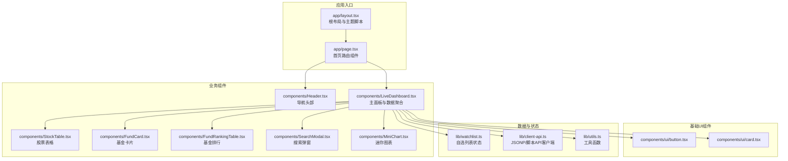
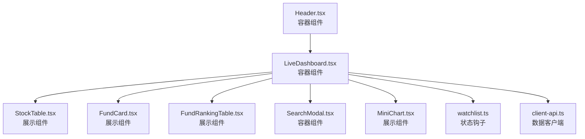
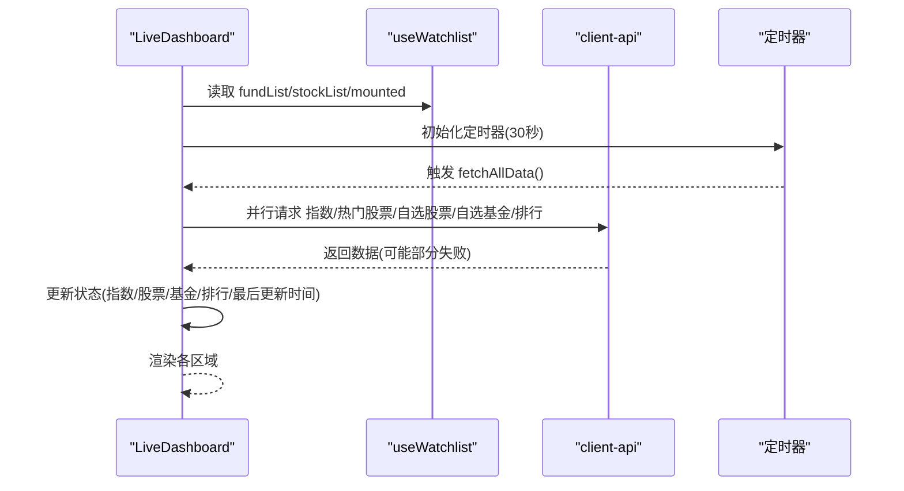
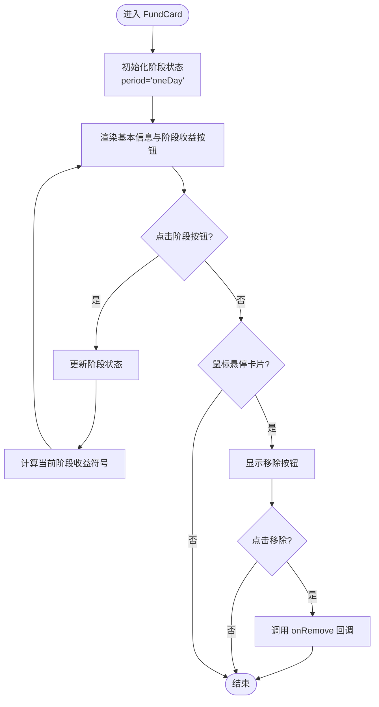
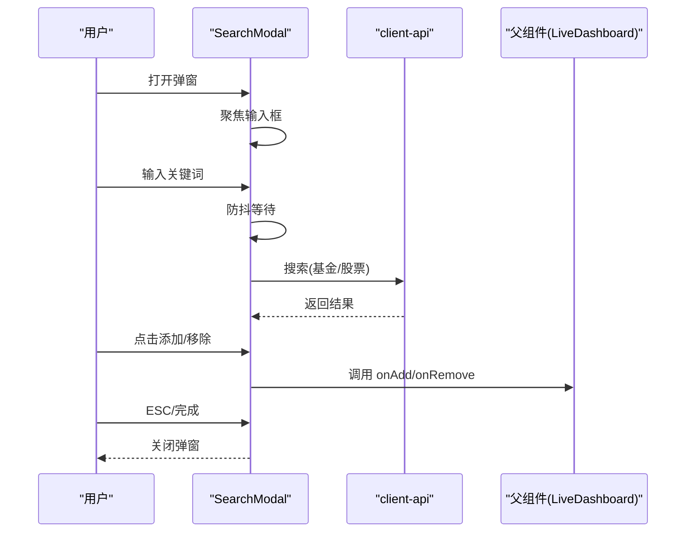
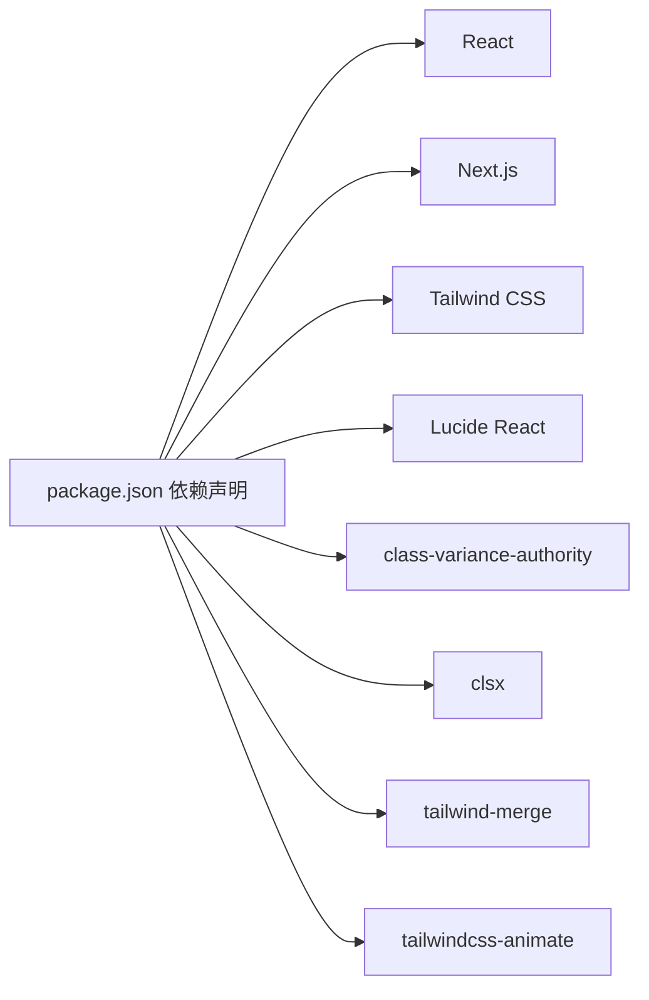

# 组件系统架构

<cite>
**本文引用的文件**
- [README.md](file://README.md)
- [package.json](file://package.json)
- [app/layout.tsx](file://app/layout.tsx)
- [app/page.tsx](file://app/page.tsx)
- [components/ui/button.tsx](file://components/ui/button.tsx)
- [components/ui/card.tsx](file://components/ui/card.tsx)
- [components/Header.tsx](file://components/Header.tsx)
- [components/LiveDashboard.tsx](file://components/LiveDashboard.tsx)
- [components/StockTable.tsx](file://components/StockTable.tsx)
- [components/FundCard.tsx](file://components/FundCard.tsx)
- [components/FundRankingTable.tsx](file://components/FundRankingTable.tsx)
- [components/MiniChart.tsx](file://components/MiniChart.tsx)
- [components/SearchModal.tsx](file://components/SearchModal.tsx)
- [lib/watchlist.ts](file://lib/watchlist.ts)
- [lib/client-api.ts](file://lib/client-api.ts)
- [lib/utils.ts](file://lib/utils.ts)
</cite>

## 目录
1. [引言](#引言)
2. [项目结构](#项目结构)
3. [核心组件](#核心组件)
4. [架构总览](#架构总览)
5. [详细组件分析](#详细组件分析)
6. [依赖关系分析](#依赖关系分析)
7. [性能考量](#性能考量)
8. [故障排查指南](#故障排查指南)
9. [结论](#结论)
10. [附录](#附录)

## 引言
本项目是一个基于 Next.js 16（App Router）与 React 的前端应用，聚焦“全球指数、热门股票、基金跟踪”的实时行情面板。组件系统采用函数式组件与 Hooks 的现代模式，结合 Tailwind CSS 实现一致的设计系统；通过自研基础 UI 组件库（Button、Card 等）与业务组件（如 FundCard、StockTable、LiveDashboard）分层组织，形成清晰的职责边界与可复用性。

## 项目结构
项目采用按功能模块划分的目录结构，入口位于 app 目录，组件集中在 components，数据与状态逻辑位于 lib，样式与工具函数位于根部。

**图表来源**
- [app/layout.tsx:1-35](file://app/layout.tsx#L1-L35)
- [app/page.tsx:1-24](file://app/page.tsx#L1-L24)
- [components/Header.tsx:1-92](file://components/Header.tsx#L1-L92)
- [components/LiveDashboard.tsx:1-375](file://components/LiveDashboard.tsx#L1-L375)
- [components/StockTable.tsx:1-144](file://components/StockTable.tsx#L1-L144)
- [components/FundCard.tsx:1-132](file://components/FundCard.tsx#L1-L132)
- [components/FundRankingTable.tsx:1-191](file://components/FundRankingTable.tsx#L1-L191)
- [components/SearchModal.tsx:1-210](file://components/SearchModal.tsx#L1-L210)
- [components/MiniChart.tsx:1-57](file://components/MiniChart.tsx#L1-L57)
- [components/ui/button.tsx:1-49](file://components/ui/button.tsx#L1-L49)
- [components/ui/card.tsx:1-79](file://components/ui/card.tsx#L1-L79)
- [lib/watchlist.ts:1-89](file://lib/watchlist.ts#L1-L89)
- [lib/client-api.ts:1-596](file://lib/client-api.ts#L1-L596)
- [lib/utils.ts:1-7](file://lib/utils.ts#L1-L7)

**章节来源**
- [README.md:132-161](file://README.md#L132-L161)
- [package.json:1-31](file://package.json#L1-L31)

## 核心组件
- 基础 UI 组件：Button、Card 系列（Card、CardHeader、CardTitle、CardDescription、CardContent、CardFooter），通过变体与尺寸系统统一风格，便于主题与样式扩展。
- 业务组件：Header（导航）、LiveDashboard（主面板）、StockTable（股票列表）、FundCard（基金卡片）、FundRankingTable（基金排行）、SearchModal（搜索）、MiniChart（迷你图）。
- 数据与状态：useWatchlist（自选列表状态管理，含本地存储持久化）、client-api（统一的数据获取与解析）。

**章节来源**
- [components/ui/button.tsx:1-49](file://components/ui/button.tsx#L1-L49)
- [components/ui/card.tsx:1-79](file://components/ui/card.tsx#L1-L79)
- [components/Header.tsx:1-92](file://components/Header.tsx#L1-L92)
- [components/LiveDashboard.tsx:1-375](file://components/LiveDashboard.tsx#L1-L375)
- [components/StockTable.tsx:1-144](file://components/StockTable.tsx#L1-L144)
- [components/FundCard.tsx:1-132](file://components/FundCard.tsx#L1-L132)
- [components/FundRankingTable.tsx:1-191](file://components/FundRankingTable.tsx#L1-L191)
- [components/SearchModal.tsx:1-210](file://components/SearchModal.tsx#L1-L210)
- [components/MiniChart.tsx:1-57](file://components/MiniChart.tsx#L1-L57)
- [lib/watchlist.ts:1-89](file://lib/watchlist.ts#L1-L89)
- [lib/client-api.ts:1-596](file://lib/client-api.ts#L1-L596)

## 架构总览
组件系统遵循“容器-展示”分层与“职责单一”原则：
- 容器组件：LiveDashboard 负责数据拉取、状态聚合与子组件编排；SearchModal 负责搜索交互与回调；Header 负责导航与主题切换。
- 展示组件：FundCard、StockTable、FundRankingTable、MiniChart 等专注于渲染与用户交互反馈。
- 数据流：通过 useWatchlist 提供自选列表，client-api 提供异步数据，组件通过 props 传递数据与回调，实现单向数据流与事件向上冒泡。

**图表来源**
- [components/LiveDashboard.tsx:1-375](file://components/LiveDashboard.tsx#L1-L375)
- [components/Header.tsx:1-92](file://components/Header.tsx#L1-L92)
- [components/SearchModal.tsx:1-210](file://components/SearchModal.tsx#L1-L210)
- [components/StockTable.tsx:1-144](file://components/StockTable.tsx#L1-L144)
- [components/FundCard.tsx:1-132](file://components/FundCard.tsx#L1-L132)
- [components/FundRankingTable.tsx:1-191](file://components/FundRankingTable.tsx#L1-L191)
- [components/MiniChart.tsx:1-57](file://components/MiniChart.tsx#L1-L57)
- [lib/watchlist.ts:1-89](file://lib/watchlist.ts#L1-L89)
- [lib/client-api.ts:1-596](file://lib/client-api.ts#L1-L596)

## 详细组件分析

### 容器组件：LiveDashboard
- 职责：集中管理全局状态（指数、股票、基金、排行、刷新状态等），调度多路异步请求，维护定时刷新与“实时/模拟”状态，协调子组件渲染。
- 关键点：
  - 使用 useCallback 包裹 fetchAllData，避免重复订阅与渲染抖动。
  - 使用 Promise.allSettled 并行拉取多源数据，提升响应速度。
  - 通过 useWatchlist 获取自选列表，动态决定是否请求对应数据。
  - 内嵌 StatCard、SectionHeader、EmptyWatchlist 等局部组件，保持页面结构清晰。

**图表来源**
- [components/LiveDashboard.tsx:56-102](file://components/LiveDashboard.tsx#L56-L102)
- [lib/watchlist.ts:28-88](file://lib/watchlist.ts#L28-L88)
- [lib/client-api.ts:154-199](file://lib/client-api.ts#L154-L199)
- [lib/client-api.ts:203-240](file://lib/client-api.ts#L203-L240)
- [lib/client-api.ts:421-458](file://lib/client-api.ts#L421-L458)
- [lib/client-api.ts:462-495](file://lib/client-api.ts#L462-L495)
- [lib/client-api.ts:527-595](file://lib/client-api.ts#L527-L595)

**章节来源**
- [components/LiveDashboard.tsx:1-375](file://components/LiveDashboard.tsx#L1-L375)

### 展示组件：FundCard
- 职责：渲染单只基金的名称、类型、净值、日涨跌、阶段收益与迷你图，支持移除操作。
- 关键点：
  - 使用内部状态切换阶段收益（日/周/月/年等）。
  - 通过 props.onRemove 接收外部回调，实现“移除”事件向上冒泡。
  - 使用 MiniChart 或内联 SVG 绘制迷你线图，颜色随涨跌变化。

**图表来源**
- [components/FundCard.tsx:19-131](file://components/FundCard.tsx#L19-L131)
- [components/MiniChart.tsx:1-57](file://components/MiniChart.tsx#L1-L57)

**章节来源**
- [components/FundCard.tsx:1-132](file://components/FundCard.tsx#L1-L132)

### 展示组件：StockTable
- 职责：展示股票列表，支持按价格、涨跌幅、成交额排序，可选移除操作。
- 关键点：
  - 内部状态维护排序键与方向，点击表头切换。
  - 通过 props.onRemove 接收移除回调，实现行级操作。

**章节来源**
- [components/StockTable.tsx:1-144](file://components/StockTable.tsx#L1-L144)

### 展示组件：FundRankingTable
- 职责：展示基金排行，支持多周期排序。
- 关键点：
  - 内部状态维护排序键与方向，点击表头切换。
  - 无数据时渲染占位提示。

**章节来源**
- [components/FundRankingTable.tsx:1-191](file://components/FundRankingTable.tsx#L1-L191)

### 交互组件：SearchModal
- 职责：提供搜索与添加/移除能力，支持防抖与键盘事件。
- 关键点：
  - 输入防抖（约 400ms）减少网络请求。
  - 支持 Esc 关闭、自动聚焦输入框。
  - 通过 props.onAdd/onRemove 与父组件通信。

**图表来源**
- [components/SearchModal.tsx:32-88](file://components/SearchModal.tsx#L32-L88)
- [components/SearchModal.tsx:137-191](file://components/SearchModal.tsx#L137-L191)
- [lib/client-api.ts:364-379](file://lib/client-api.ts#L364-L379)
- [lib/client-api.ts:415-417](file://lib/client-api.ts#L415-L417)

**章节来源**
- [components/SearchModal.tsx:1-210](file://components/SearchModal.tsx#L1-L210)

### 基础UI组件：Button 与 Card
- Button：通过变体与尺寸系统统一按钮风格，支持 forwardRef 与 className 合并。
- Card：语义化卡片结构，包含 Header、Title、Description、Content、Footer，便于主题与布局扩展。

**章节来源**
- [components/ui/button.tsx:1-49](file://components/ui/button.tsx#L1-L49)
- [components/ui/card.tsx:1-79](file://components/ui/card.tsx#L1-L79)

### 状态与数据：useWatchlist 与 client-api
- useWatchlist：封装自选列表的增删改查与本地持久化，提供 mounted 标记避免水合问题。
- client-api：统一 JSONP 与脚本加载策略，封装指数、股票、基金、排行等接口，提供错误降级与超时控制。

**章节来源**
- [lib/watchlist.ts:1-89](file://lib/watchlist.ts#L1-L89)
- [lib/client-api.ts:1-596](file://lib/client-api.ts#L1-L596)

## 依赖关系分析
- 组件间依赖：LiveDashboard 作为中枢，依赖 Header、SearchModal、StockTable、FundCard、FundRankingTable、MiniChart、UI 组件与状态/数据模块。
- 外部依赖：Next.js、React、Lucide React、Tailwind CSS、class-variance-authority、clsx、tailwind-merge、tailwindcss-animate。

**图表来源**
- [package.json:11-29](file://package.json#L11-L29)

**章节来源**
- [package.json:1-31](file://package.json#L1-L31)

## 性能考量
- 并行请求：LiveDashboard 使用 Promise.allSettled 并行拉取多源数据，缩短首屏等待时间。
- 防抖与节流：SearchModal 对输入进行防抖，降低搜索请求频率。
- 本地存储：useWatchlist 将自选列表持久化至 localStorage，避免每次重载重新请求。
- 样式合并：使用 cn/twMerge 合并 Tailwind 类，减少无效类名与重绘。
- 仅在需要时渲染：MiniChart 在数据不足时直接返回空，避免无效绘制。
- 事件优化：LiveDashboard 对 fetchAllData 使用 useCallback，避免不必要的订阅与销毁。

**章节来源**
- [components/LiveDashboard.tsx:56-95](file://components/LiveDashboard.tsx#L56-L95)
- [components/SearchModal.tsx:48-77](file://components/SearchModal.tsx#L48-L77)
- [lib/watchlist.ts:33-51](file://lib/watchlist.ts#L33-L51)
- [lib/utils.ts:1-7](file://lib/utils.ts#L1-L7)
- [components/MiniChart.tsx:9-10](file://components/MiniChart.tsx#L9-L10)

## 故障排查指南
- 数据为空或延迟：检查 client-api 的 JSONP/脚本加载是否成功，确认网络与跨域策略；查看 LiveDashboard 中的 Promise.allSettled 结果分支。
- 搜索无结果：确认 searchFunds/searchStocks 的关键词与接口可用性；检查防抖时间与输入状态。
- 自选列表不同步：确认 useWatchlist 的本地存储键值与格式兼容；检查 mounted 标记以避免水合异常。
- 主题切换无效：确认 app/layout.tsx 中的主题脚本执行顺序与 html 根节点类名设置。

**章节来源**
- [lib/client-api.ts:5-36](file://lib/client-api.ts#L5-L36)
- [components/SearchModal.tsx:48-77](file://components/SearchModal.tsx#L48-L77)
- [lib/watchlist.ts:33-51](file://lib/watchlist.ts#L33-L51)
- [app/layout.tsx:18-24](file://app/layout.tsx#L18-L24)

## 结论
该组件系统以函数组件与 Hooks 为核心，通过容器-展示分层、Props 与事件双向流动、基础 UI 组件库与业务组件解耦，实现了高可读性与可维护性。配合并行请求、防抖、本地存储与样式合并等策略，整体具备良好的性能表现与用户体验。建议持续完善单元测试与集成测试，强化错误边界与加载态设计，进一步提升稳定性与可测试性。

## 附录
- 设计系统与主题：通过 Tailwind CSS 与 CSS 变量实现主题切换与一致性风格。
- 部署与环境：Next.js 静态导出，支持 GitHub Pages 自动部署。

**章节来源**
- [README.md:67-77](file://README.md#L67-L77)
- [README.md:113-129](file://README.md#L113-L129)