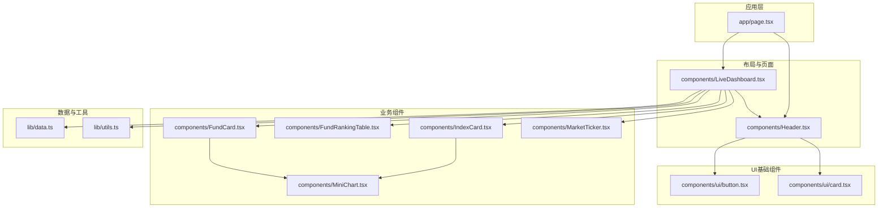
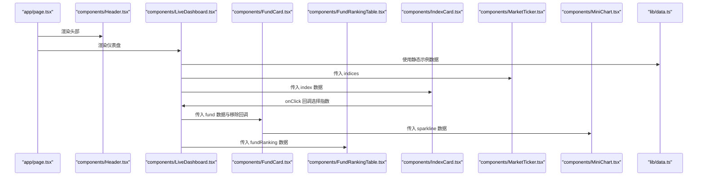
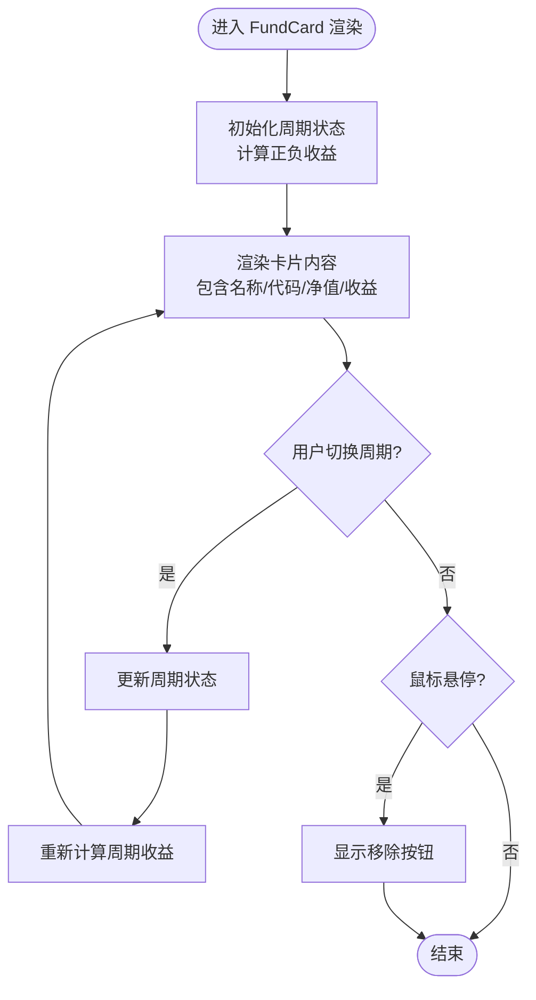
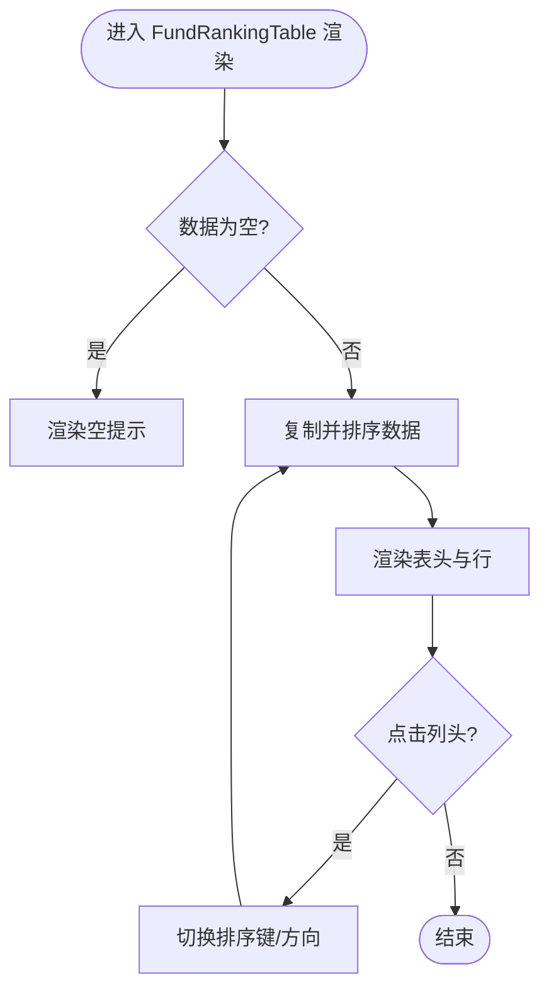
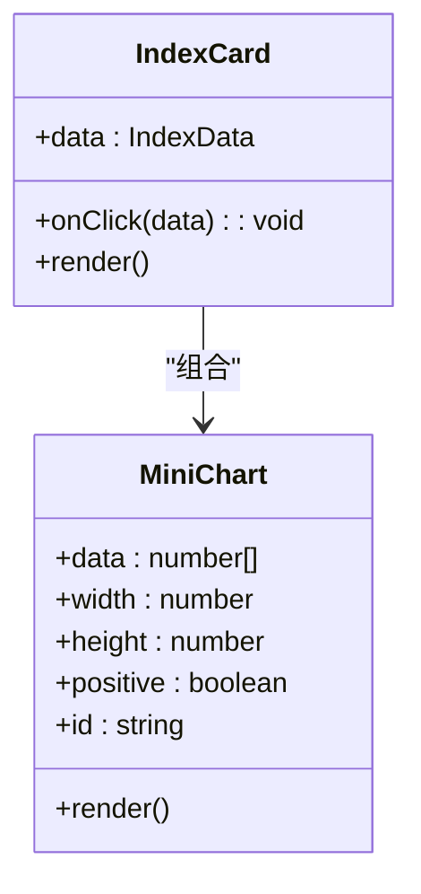
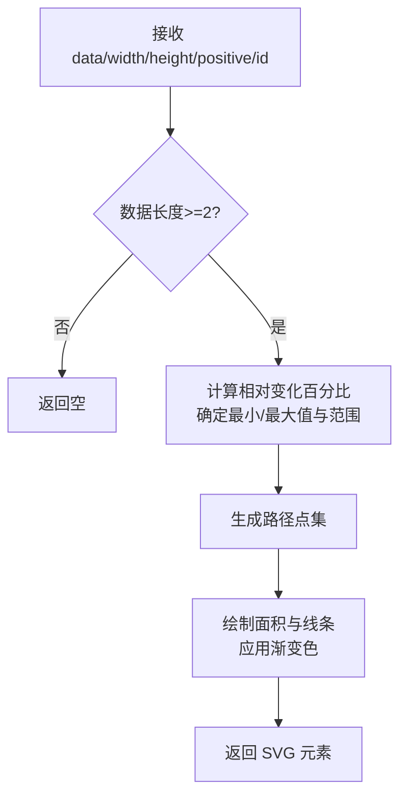
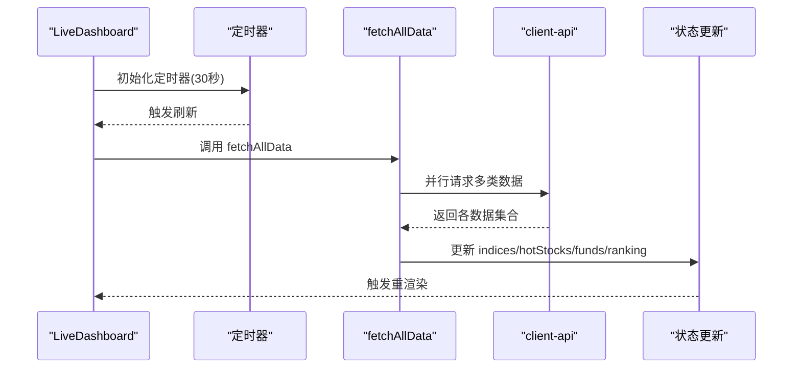
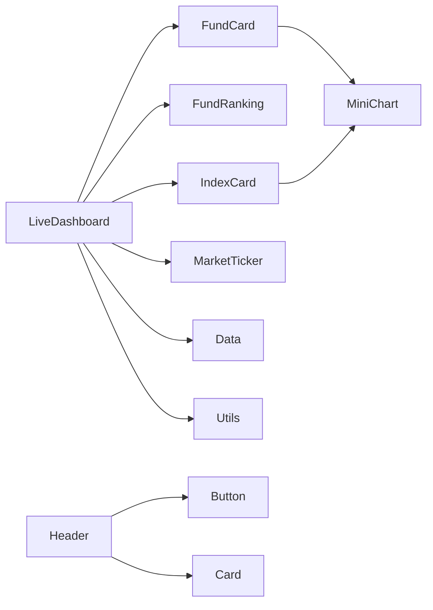

# 组件设计原则

<cite>
**本文档引用的文件**
- [components/FundCard.tsx](file://components/FundCard.tsx)
- [components/FundRankingTable.tsx](file://components/FundRankingTable.tsx)
- [components/Header.tsx](file://components/Header.tsx)
- [components/IndexCard.tsx](file://components/IndexCard.tsx)
- [components/MiniChart.tsx](file://components/MiniChart.tsx)
- [components/LiveDashboard.tsx](file://components/LiveDashboard.tsx)
- [components/MarketTicker.tsx](file://components/MarketTicker.tsx)
- [components/ui/button.tsx](file://components/ui/button.tsx)
- [components/ui/card.tsx](file://components/ui/card.tsx)
- [lib/data.ts](file://lib/data.ts)
- [lib/utils.ts](file://lib/utils.ts)
- [app/page.tsx](file://app/page.tsx)
- [package.json](file://package.json)
</cite>

## 目录
1. [引言](#引言)
2. [项目结构](#项目结构)
3. [核心组件](#核心组件)
4. [架构总览](#架构总览)
5. [详细组件分析](#详细组件分析)
6. [依赖关系分析](#依赖关系分析)
7. [性能考虑](#性能考虑)
8. [可测试性设计](#可测试性设计)
9. [故障排除指南](#故障排除指南)
10. [结论](#结论)

## 引言
本文件系统性总结基于 React 的组件化设计原则与最佳实践，结合仓库现有组件进行深入分析。内容涵盖函数组件与类组件的选择标准、Hooks 在状态管理与副作用处理中的优势、单一职责原则、可复用性设计（props 接口、默认值、类型约束）、可测试性设计（纯函数组件优势与测试策略）、性能优化（memoization、懒加载、渲染优化）以及常见问题解决方案。目标是帮助开发者在实际项目中构建高内聚、低耦合、可维护且高性能的组件体系。

## 项目结构
该项目采用以功能域为中心的组织方式，页面入口位于应用层，业务组件集中在 components 目录，共享类型定义与工具函数位于 lib 目录。整体结构清晰，便于按功能模块扩展与维护。

图表来源
- [app/page.tsx:10-23](file://app/page.tsx#L10-L23)
- [components/LiveDashboard.tsx:39-301](file://components/LiveDashboard.tsx#L39-L301)
- [components/Header.tsx:16-91](file://components/Header.tsx#L16-L91)
- [components/FundCard.tsx:19-131](file://components/FundCard.tsx#L19-L131)
- [components/FundRankingTable.tsx:10-190](file://components/FundRankingTable.tsx#L10-L190)
- [components/IndexCard.tsx:5-52](file://components/IndexCard.tsx#L5-L52)
- [components/MiniChart.tsx:9-56](file://components/MiniChart.tsx#L9-L56)
- [components/MarketTicker.tsx:8-51](file://components/MarketTicker.tsx#L8-L51)
- [components/ui/button.tsx:35-46](file://components/ui/button.tsx#L35-L46)
- [components/ui/card.tsx:4-78](file://components/ui/card.tsx#L4-L78)
- [lib/data.ts:1-255](file://lib/data.ts#L1-L255)
- [lib/utils.ts:4-6](file://lib/utils.ts#L4-L6)

章节来源
- [app/page.tsx:10-23](file://app/page.tsx#L10-L23)
- [package.json:1-31](file://package.json#L1-L31)

## 核心组件
本节从设计原则角度对关键组件进行剖析，重点说明其职责边界、状态管理、数据流与可复用性设计。

- 函数组件优先：所有业务组件均采用函数组件，配合 Hooks 实现状态与副作用管理，符合现代 React 最佳实践。
- 单一职责：每个组件聚焦一个明确的功能点，如 FundCard 负责单只基金卡片展示与周期切换；FundRankingTable 负责表格排序与渲染；IndexCard 负责指数项点击回调；MiniChart 负责迷你图表绘制；MarketTicker 负责跑马灯行情展示；Header 负责导航与主题切换。
- Props 设计：组件通过明确的 props 接口传递数据与回调，如 FundCard 的 data 与 onRemove；IndexCard 的 data 与 onClick；FundRankingTable 的 data；MiniChart 的 data、width、height、positive、id；MarketTicker 的 indices。
- 类型约束：使用 TypeScript 接口定义数据模型（IndexData、StockData、FundData、FundRankingData），确保组件输入输出的类型安全。
- 默认值与容错：部分组件对缺失数据进行保护（如 MiniChart 对数据长度不足返回空；FundRankingTable 对空数组返回占位）。

章节来源
- [components/FundCard.tsx:19-131](file://components/FundCard.tsx#L19-L131)
- [components/FundRankingTable.tsx:10-190](file://components/FundRankingTable.tsx#L10-L190)
- [components/IndexCard.tsx:5-52](file://components/IndexCard.tsx#L5-L52)
- [components/MiniChart.tsx:9-56](file://components/MiniChart.tsx#L9-L56)
- [components/MarketTicker.tsx:8-51](file://components/MarketTicker.tsx#L8-L51)
- [lib/data.ts:1-255](file://lib/data.ts#L1-L255)

## 架构总览
下图展示了页面到业务组件的整体交互流程，体现数据从顶层容器拉取、向下传递、局部状态管理与用户交互的闭环。

图表来源
- [app/page.tsx:10-23](file://app/page.tsx#L10-L23)
- [components/LiveDashboard.tsx:39-301](file://components/LiveDashboard.tsx#L39-L301)
- [components/MarketTicker.tsx:8-51](file://components/MarketTicker.tsx#L8-L51)
- [components/IndexCard.tsx:5-52](file://components/IndexCard.tsx#L5-L52)
- [components/FundCard.tsx:19-131](file://components/FundCard.tsx#L19-L131)
- [components/MiniChart.tsx:9-56](file://components/MiniChart.tsx#L9-L56)
- [components/FundRankingTable.tsx:10-190](file://components/FundRankingTable.tsx#L10-L190)
- [lib/data.ts:1-255](file://lib/data.ts#L1-L255)

## 详细组件分析

### FundCard 组件分析
- 职责：展示单只基金信息，支持日/周/月等多周期收益切换，并提供移除按钮。
- 状态管理：使用 useState 管理当前周期与正负收益状态，逻辑内聚在组件内部。
- 数据绑定：根据所选周期动态计算收益值，支持空值回退。
- 交互设计：悬停显示移除按钮，点击事件阻止冒泡避免误触父级。
- 性能考量：周期切换与收益计算为纯函数逻辑，适合在渲染阶段直接执行；若数据量增大可考虑 useMemo 缓存计算结果。
- 可复用性：通过 props 传入 data 与 onRemove，保持与业务容器解耦。

图表来源
- [components/FundCard.tsx:19-131](file://components/FundCard.tsx#L19-L131)

章节来源
- [components/FundCard.tsx:19-131](file://components/FundCard.tsx#L19-L131)

### FundRankingTable 组件分析
- 职责：展示基金涨跌幅排行榜，支持多列排序与图标指示。
- 状态管理：使用 useState 管理排序键与方向，排序逻辑在渲染阶段完成。
- 可复用性：通过 data 属性接收列表，无需关心具体数据源；renderChange 提供统一的正负样式渲染。
- 容错设计：当数据为空时返回占位提示，提升用户体验。
- 性能考量：排序使用原地复制数组后排序，复杂度 O(n log n)；对于大列表可考虑虚拟滚动或分页。

图表来源
- [components/FundRankingTable.tsx:10-190](file://components/FundRankingTable.tsx#L10-L190)

章节来源
- [components/FundRankingTable.tsx:10-190](file://components/FundRankingTable.tsx#L10-L190)

### IndexCard 组件分析
- 职责：展示单个指数项，支持点击回调与迷你图表展示。
- 可复用性：通过 onClick 回调暴露交互，外部决定行为（如打开模态框）。
- 图表集成：将 MiniChart 作为子组件，传入 sparkline 数据与标识 id，实现数据驱动的可视化。
- 性能考量：点击事件仅触发回调，渲染逻辑轻量，适合高频渲染场景。

图表来源
- [components/IndexCard.tsx:5-52](file://components/IndexCard.tsx#L5-L52)
- [components/MiniChart.tsx:9-56](file://components/MiniChart.tsx#L9-L56)

章节来源
- [components/IndexCard.tsx:5-52](file://components/IndexCard.tsx#L5-L52)
- [components/MiniChart.tsx:9-56](file://components/MiniChart.tsx#L9-L56)

### MiniChart 组件分析
- 职责：绘制迷你折线图与面积填充，支持正负颜色区分与渐变效果。
- 数据处理：计算相对变化百分比，归一化坐标生成路径数据。
- 可复用性：通过 props 接收数据、尺寸与颜色状态，适配多种场景。
- 性能考量：SVG 路径计算为纯函数，渲染开销小；若数据点过多可考虑采样或缓存。

图表来源
- [components/MiniChart.tsx:9-56](file://components/MiniChart.tsx#L9-L56)

章节来源
- [components/MiniChart.tsx:9-56](file://components/MiniChart.tsx#L9-L56)

### MarketTicker 组件分析
- 职责：实现跑马灯行情展示，支持鼠标悬停暂停动画。
- 动画控制：通过 useState 控制暂停状态，利用 CSS 动画属性实现无缝循环。
- 性能考量：将数组复制一次以实现无缝滚动，内存占用翻倍；对大量数据可考虑虚拟滚动或分段渲染。

章节来源
- [components/MarketTicker.tsx:8-51](file://components/MarketTicker.tsx#L8-L51)

### Header 组件分析
- 职责：提供站点标题、导航菜单、主题切换与移动端菜单。
- 状态管理：使用 useState 管理移动端菜单开关。
- 可复用性：导航项通过配置数组定义，便于扩展与维护。

章节来源
- [components/Header.tsx:16-91](file://components/Header.tsx#L16-L91)

### LiveDashboard 组件分析
- 职责：页面主容器，负责数据拉取、状态管理、布局与交互编排。
- 状态管理：集中管理指数、热门股票、自选股、跟踪基金、排行榜、刷新状态、实时模式等。
- 副作用处理：使用 useEffect 设置定时器定期刷新；使用 useCallback 包装异步拉取函数以减少重渲染。
- 并行请求：使用 Promise.allSettled 并行拉取多类数据，提升响应速度。
- 可复用性：将统计卡片、空状态组件等抽象为局部组件，提高复用性与可读性。

图表来源
- [components/LiveDashboard.tsx:56-102](file://components/LiveDashboard.tsx#L56-L102)
- [components/LiveDashboard.tsx:39-301](file://components/LiveDashboard.tsx#L39-L301)

章节来源
- [components/LiveDashboard.tsx:39-301](file://components/LiveDashboard.tsx#L39-L301)

### UI 基础组件分析
- Button：基于 class-variance-authority 提供变体与尺寸，支持 forwardRef 透传 ref。
- Card：提供卡片容器与标题/描述/内容/底部等子组件，统一风格与语义。

章节来源
- [components/ui/button.tsx:35-46](file://components/ui/button.tsx#L35-L46)
- [components/ui/card.tsx:4-78](file://components/ui/card.tsx#L4-L78)

## 依赖关系分析
- 组件间依赖：LiveDashboard 作为顶层容器，聚合多个业务组件；IndexCard 与 FundCard 内部组合 MiniChart；Header 组合 UI 基础组件。
- 数据依赖：业务组件依赖 lib/data.ts 中的数据模型与静态示例数据；LiveDashboard 通过 client-api 进行真实数据拉取。
- 工具依赖：lib/utils.ts 提供 cn 合并样式类名，统一 Tailwind 与 class-variance-authorience 的类名合并。

图表来源
- [components/LiveDashboard.tsx:39-301](file://components/LiveDashboard.tsx#L39-L301)
- [components/IndexCard.tsx:5-52](file://components/IndexCard.tsx#L5-L52)
- [components/FundCard.tsx:19-131](file://components/FundCard.tsx#L19-L131)
- [components/MiniChart.tsx:9-56](file://components/MiniChart.tsx#L9-L56)
- [components/Header.tsx:16-91](file://components/Header.tsx#L16-L91)
- [components/ui/button.tsx:35-46](file://components/ui/button.tsx#L35-L46)
- [components/ui/card.tsx:4-78](file://components/ui/card.tsx#L4-L78)
- [lib/data.ts:1-255](file://lib/data.ts#L1-L255)
- [lib/utils.ts:4-6](file://lib/utils.ts#L4-L6)

章节来源
- [lib/data.ts:1-255](file://lib/data.ts#L1-L255)
- [lib/utils.ts:4-6](file://lib/utils.ts#L4-L6)

## 性能考虑
- 渲染优化
  - 避免不必要的重渲染：将稳定的数据与回调通过 useCallback 包装，减少子组件重渲染（参考 LiveDashboard 的 fetchAllData）。
  - 局部状态隔离：将与 UI 交互相关的状态（如周期切换、排序方向、菜单开关）保留在组件内部，降低全局状态复杂度。
  - 虚拟化与分页：对于长列表（如排行榜、股票列表），可引入虚拟滚动或分页，降低 DOM 节点数量。
- 计算优化
  - 将纯函数计算（如 MiniChart 的路径生成、收益计算）放在渲染阶段，必要时使用 useMemo 缓存昂贵计算。
  - 对数组复制与排序操作进行限制，避免在高频渲染中重复创建大数组。
- 资源优化
  - 图表渲染：SVG 路径计算为纯函数，渲染成本较低；若数据点过多，可考虑采样或降采样。
  - 动画控制：跑马灯动画通过 CSS 控制，鼠标悬停暂停可减少视觉负担与 CPU 占用。
- 并行请求
  - 使用 Promise.allSettled 并行拉取多类数据，缩短首屏等待时间；对失败项进行容错处理，保证整体稳定性。

章节来源
- [components/LiveDashboard.tsx:56-102](file://components/LiveDashboard.tsx#L56-L102)
- [components/MiniChart.tsx:9-56](file://components/MiniChart.tsx#L9-L56)
- [components/MarketTicker.tsx:8-51](file://components/MarketTicker.tsx#L8-L51)

## 可测试性设计
- 纯函数组件优势
  - FundCard、FundRankingTable、IndexCard、MiniChart、MarketTicker 等均为纯函数组件，输入输出稳定，易于断言与测试。
- 测试策略建议
  - 单元测试：针对纯函数逻辑（如收益计算、正负判断、路径生成）编写测试用例，验证边界条件与错误处理。
  - 组件快照测试：对渲染结果进行快照对比，确保 UI 变更可控。
  - 交互测试：使用测试框架模拟用户交互（点击、悬停、键盘操作），验证回调与状态变更。
  - Mock 数据：使用 lib/data.ts 中的接口与示例数据构造测试场景，覆盖空数据、异常数据等情况。
- Hooks 测试
  - 对 useState/useEffect 的副作用进行隔离，使用测试工具模拟状态与副作用，确保测试独立性。

章节来源
- [components/FundCard.tsx:19-131](file://components/FundCard.tsx#L19-L131)
- [components/FundRankingTable.tsx:10-190](file://components/FundRankingTable.tsx#L10-L190)
- [components/IndexCard.tsx:5-52](file://components/IndexCard.tsx#L5-L52)
- [components/MiniChart.tsx:9-56](file://components/MiniChart.tsx#L9-L56)
- [components/MarketTicker.tsx:8-51](file://components/MarketTicker.tsx#L8-L51)
- [lib/data.ts:1-255](file://lib/data.ts#L1-L255)

## 故障排除指南
- 数据为空或格式异常
  - 现象：排行榜或列表为空时出现空白或报错。
  - 处理：在组件中增加空数据检查与占位渲染，确保 UI 稳定（参考 FundRankingTable 的空数据处理）。
- 性能问题
  - 症状：长列表滚动卡顿、频繁刷新导致卡顿。
  - 解决：引入虚拟滚动、分页或 useMemo 缓存；减少不必要的状态提升与重渲染。
- 动画与交互异常
  - 症状：跑马灯无法暂停、按钮点击无效。
  - 处理：检查事件绑定与状态更新逻辑，确认事件冒泡与防抖处理是否正确。
- 类名冲突
  - 症状：样式错乱或覆盖。
  - 处理：使用 lib/utils.ts 的 cn 合并类名，避免重复与冲突；统一使用 Tailwind 与 class-variance-authority 的变体系统。

章节来源
- [components/FundRankingTable.tsx:14-20](file://components/FundRankingTable.tsx#L14-L20)
- [components/MarketTicker.tsx:15-20](file://components/MarketTicker.tsx#L15-L20)
- [lib/utils.ts:4-6](file://lib/utils.ts#L4-L6)

## 结论
本项目在组件设计上体现了现代 React 的最佳实践：函数组件优先、Hooks 状态与副作用管理、单一职责与高内聚、明确的 props 接口与类型约束、良好的可复用性与可测试性。通过合理的数据流与状态管理、性能优化策略与故障排除方案，能够支撑复杂业务场景下的稳定运行。建议在后续迭代中进一步引入虚拟化、分页与缓存机制，持续提升性能与用户体验。