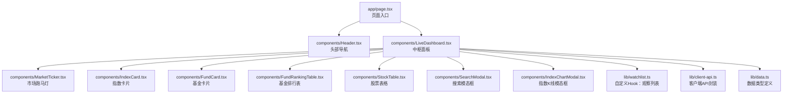
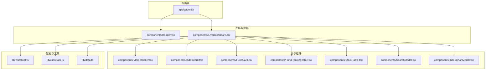
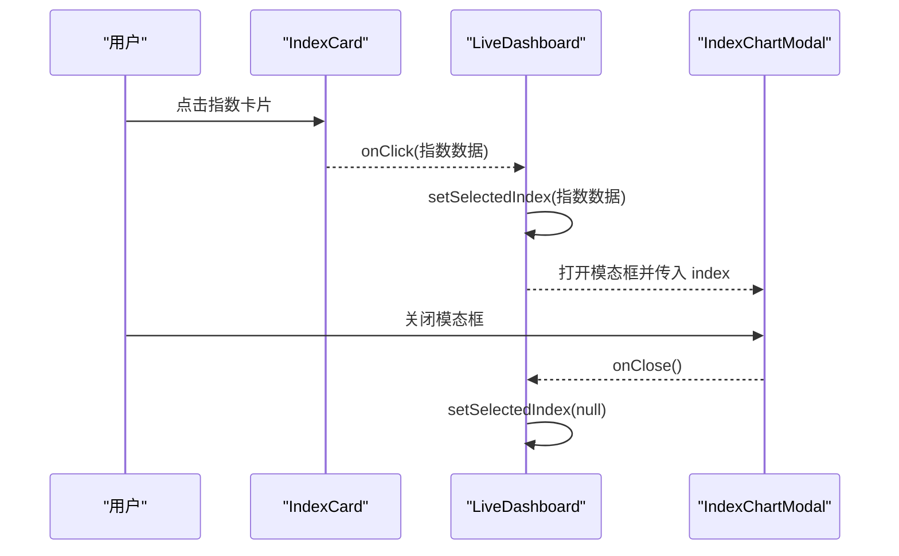
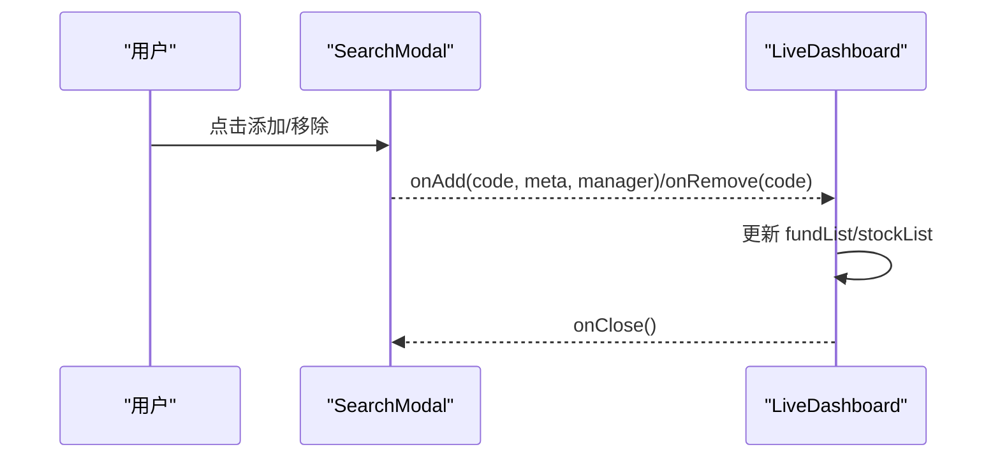
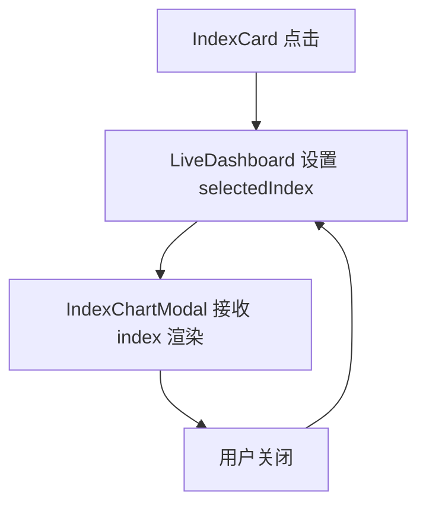
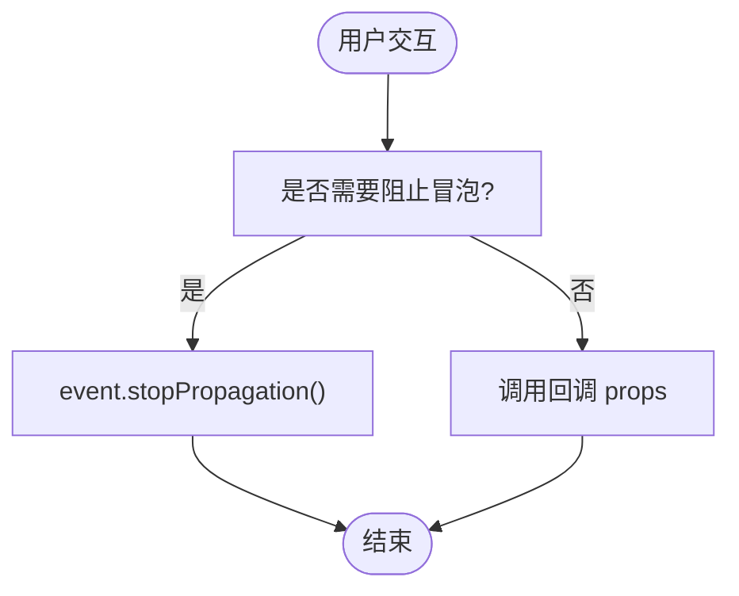
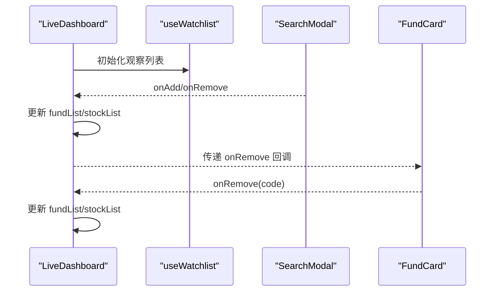
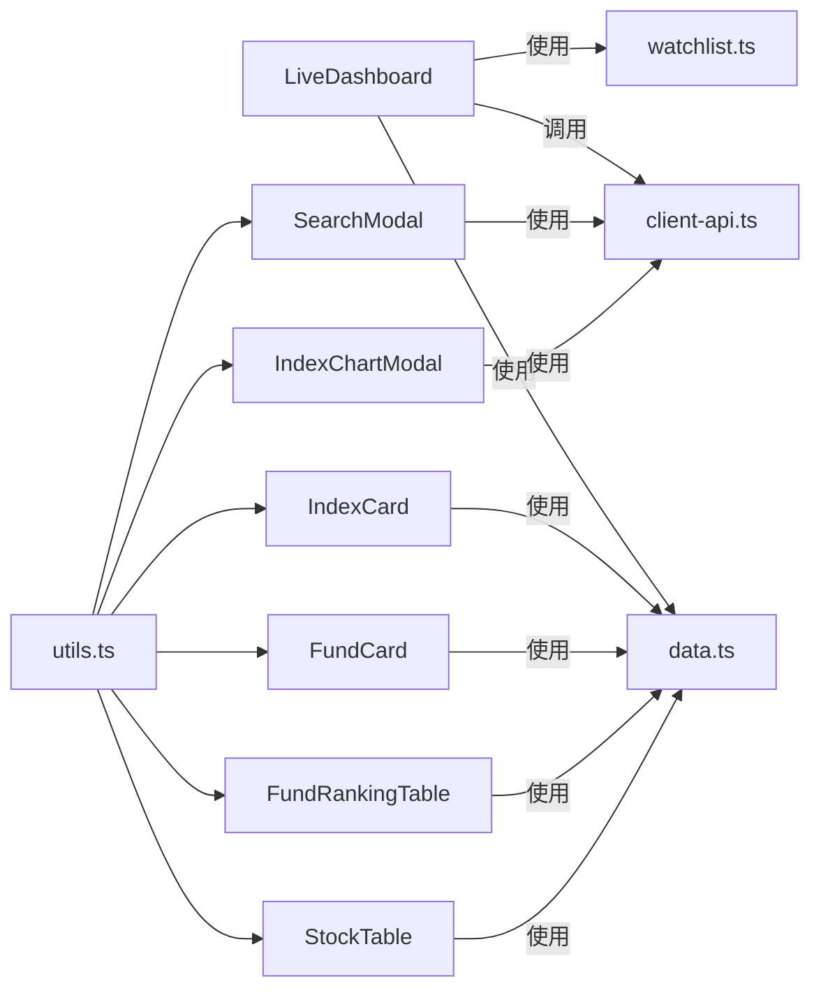

# 组件通信机制

<cite>
**本文引用的文件**
- [app/page.tsx](file://app/page.tsx)
- [components/Header.tsx](file://components/Header.tsx)
- [components/LiveDashboard.tsx](file://components/LiveDashboard.tsx)
- [components/MarketTicker.tsx](file://components/MarketTicker.tsx)
- [components/IndexCard.tsx](file://components/IndexCard.tsx)
- [components/IndexChartModal.tsx](file://components/IndexChartModal.tsx)
- [components/FundRankingTable.tsx](file://components/FundRankingTable.tsx)
- [components/FundCard.tsx](file://components/FundCard.tsx)
- [components/StockTable.tsx](file://components/StockTable.tsx)
- [components/SearchModal.tsx](file://components/SearchModal.tsx)
- [lib/watchlist.ts](file://lib/watchlist.ts)
- [lib/client-api.ts](file://lib/client-api.ts)
- [lib/data.ts](file://lib/data.ts)
- [lib/utils.ts](file://lib/utils.ts)
- [package.json](file://package.json)
</cite>

## 目录
1. [引言](#引言)
2. [项目结构](#项目结构)
3. [核心组件](#核心组件)
4. [架构总览](#架构总览)
5. [详细组件分析](#详细组件分析)
6. [依赖关系分析](#依赖关系分析)
7. [性能考量](#性能考量)
8. [故障排查指南](#故障排查指南)
9. [结论](#结论)
10. [附录](#附录)

## 引言
本文件系统性梳理该 React 应用中的组件通信机制，覆盖 props 传递、事件处理、状态提升、Context 使用场景与替代方案、事件总线与发布订阅模式、性能影响与优化策略，以及设计模式与调试技巧。文档以实际源码为依据，配合可视化图示帮助读者快速建立对整体通信体系的认知。

## 项目结构
该项目采用按功能模块组织的目录结构，页面级入口位于 app/page.tsx，业务组件集中在 components 目录，数据模型与工具函数分别在 lib 目录下。页面通过 LiveDashboard 作为中枢聚合多个子组件，形成清晰的单向数据流与事件回调链路。

图表来源
- [app/page.tsx:10-23](file://app/page.tsx#L10-L23)
- [components/LiveDashboard.tsx:39-301](file://components/LiveDashboard.tsx#L39-L301)

章节来源
- [app/page.tsx:10-23](file://app/page.tsx#L10-L23)
- [package.json:11-20](file://package.json#L11-L20)

## 核心组件
- 页面入口与布局：app/page.tsx 渲染 Header 与 LiveDashboard，并在底部放置页脚信息。
- 中枢面板：components/LiveDashboard.tsx 负责状态管理、数据拉取、Tab 切换、模态框控制等，是典型的“容器组件”。
- 子组件族：
  - 市场跑马灯 MarketTicker.tsx 接收指数数组进行展示。
  - 指数卡片 IndexCard.tsx 展示指数并支持点击打开 K 线模态框。
  - 基金卡片 FundCard.tsx 展示净值与区间收益，并可移除。
  - 基金排行表 FundRankingTable.tsx 支持多维度排序。
  - 股票表格 StockTable.tsx 支持多列排序与移除操作。
  - 搜索模态框 SearchModal.tsx 提供搜索与添加/移除能力。
  - 指数 K 线模态框 IndexChartModal.tsx 展示 K 线与均线。
- 自定义 Hook：lib/watchlist.ts 提供观察列表的增删改查与本地持久化。
- 客户端 API：lib/client-api.ts 封装 JSONP/脚本加载等异步数据获取逻辑。
- 数据类型：lib/data.ts 定义指数、股票、基金、基金排行的数据结构。

章节来源
- [app/page.tsx:10-23](file://app/page.tsx#L10-L23)
- [components/LiveDashboard.tsx:39-301](file://components/LiveDashboard.tsx#L39-L301)
- [components/MarketTicker.tsx:8-51](file://components/MarketTicker.tsx#L8-L51)
- [components/IndexCard.tsx:5-52](file://components/IndexCard.tsx#L5-L52)
- [components/FundCard.tsx:19-131](file://components/FundCard.tsx#L19-L131)
- [components/FundRankingTable.tsx:10-190](file://components/FundRankingTable.tsx#L10-L190)
- [components/StockTable.tsx:10-143](file://components/StockTable.tsx#L10-L143)
- [components/SearchModal.tsx:24-209](file://components/SearchModal.tsx#L24-L209)
- [components/IndexChartModal.tsx:27-167](file://components/IndexChartModal.tsx#L27-L167)
- [lib/watchlist.ts:28-88](file://lib/watchlist.ts#L28-L88)
- [lib/client-api.ts:154-595](file://lib/client-api.ts#L154-L595)
- [lib/data.ts:1-255](file://lib/data.ts#L1-L255)

## 架构总览
该应用采用“容器组件 + 展示组件”的分层思想：
- 容器组件（LiveDashboard）负责：
  - 状态集中管理（指数、热门股票、自选股票、基金、排行、刷新状态、模态框状态等）
  - 数据拉取与并发请求（Promise.allSettled 并行）
  - 事件回调（刷新、添加/移除、切换 Tab、打开模态框）
- 展示组件（MarketTicker、IndexCard、FundCard、FundRankingTable、StockTable、SearchModal、IndexChartModal）负责：
  - 仅接收 props 和触发回调，不直接管理全局状态
  - 通过 props 与回调完成父子通信

图表来源
- [app/page.tsx:10-23](file://app/page.tsx#L10-L23)
- [components/LiveDashboard.tsx:39-301](file://components/LiveDashboard.tsx#L39-L301)

## 详细组件分析

### 父子组件通信（Props 与回调）
- 父传子：LiveDashboard 将数据与状态通过 props 下发给子组件，如指数数组、股票列表、基金列表、模态框开关等。
- 子传父：子组件通过回调向上返回用户交互，如 IndexCard 的点击回调用于打开 IndexChartModal；FundCard 的移除回调用于更新观察列表；StockTable 的移除回调用于从自选中移除；SearchModal 的 onAdd/onRemove 回调用于更新观察列表。

图表来源
- [components/IndexCard.tsx:14-20](file://components/IndexCard.tsx#L14-L20)
- [components/LiveDashboard.tsx:168-169](file://components/LiveDashboard.tsx#L168-L169)
- [components/IndexChartModal.tsx:69-167](file://components/IndexChartModal.tsx#L69-L167)

章节来源
- [components/IndexCard.tsx:14-20](file://components/IndexCard.tsx#L14-L20)
- [components/LiveDashboard.tsx:168-169](file://components/LiveDashboard.tsx#L168-L169)
- [components/IndexChartModal.tsx:69-167](file://components/IndexChartModal.tsx#L69-L167)

### 兄弟组件通信（通过共同祖先）
- 兄弟组件之间不直接通信，而是通过共同祖先 LiveDashboard 协调。例如：
  - Header 中的导航点击切换页面锚点，但不直接影响 LiveDashboard 内部状态。
  - SearchModal 与 LiveDashboard 通过 onAdd/onRemove 回调在共同祖先处统一更新观察列表。
  - IndexChartModal 与 IndexCard 通过 LiveDashboard 的 selectedIndex 状态在共同祖先处协调显示/隐藏。

图表来源
- [components/SearchModal.tsx:142-144](file://components/SearchModal.tsx#L142-L144)
- [components/LiveDashboard.tsx:288-296](file://components/LiveDashboard.tsx#L288-L296)
- [lib/watchlist.ts:53-85](file://lib/watchlist.ts#L53-L85)

章节来源
- [components/SearchModal.tsx:142-144](file://components/SearchModal.tsx#L142-L144)
- [components/LiveDashboard.tsx:288-296](file://components/LiveDashboard.tsx#L288-L296)
- [lib/watchlist.ts:53-85](file://lib/watchlist.ts#L53-L85)

### 跨层级通信（通过共同祖先）
- 当需要跨越多层组件传递状态时，采用“状态提升”至最近公共祖先的方式。例如：
  - IndexCard 需要打开 IndexChartModal，通过 LiveDashboard 的状态与回调完成跨层级联动。
  - FundRankingTable 需要排序，内部维护局部状态，但其数据来自 LiveDashboard 的 props，属于“受控组件”。

图表来源
- [components/IndexCard.tsx:14-20](file://components/IndexCard.tsx#L14-L20)
- [components/LiveDashboard.tsx:54-55](file://components/LiveDashboard.tsx#L54-L55)
- [components/IndexChartModal.tsx:27-33](file://components/IndexChartModal.tsx#L27-L33)

章节来源
- [components/IndexCard.tsx:14-20](file://components/IndexCard.tsx#L14-L20)
- [components/LiveDashboard.tsx:54-55](file://components/LiveDashboard.tsx#L54-L55)
- [components/IndexChartModal.tsx:27-33](file://components/IndexChartModal.tsx#L27-L33)

### 事件处理模式（回调、冒泡与自定义）
- 回调函数传递：子组件通过 props 接收回调并在用户交互时触发，如 onRemove、onClick、onAdd 等。
- 事件冒泡：在需要阻止冒泡的场景（如 FundCard 的移除按钮），通过事件对象阻止默认行为或冒泡。
- 自定义事件：组件内部通过 useState/useEffect 管理自身状态，对外暴露受控属性与回调，避免直接读写 DOM 或全局状态。

图表来源
- [components/FundCard.tsx:35-41](file://components/FundCard.tsx#L35-L41)
- [components/LiveDashboard.tsx:191](file://components/LiveDashboard.tsx#L191)

章节来源
- [components/FundCard.tsx:35-41](file://components/FundCard.tsx#L35-L41)
- [components/LiveDashboard.tsx:191](file://components/LiveDashboard.tsx#L191)

### 状态提升策略
- 观察列表（基金/股票）的状态提升至 LiveDashboard，并通过 useWatchlist Hook 提供统一的增删改查与本地持久化。
- 模态框状态（搜索类型、选中指数）也提升至 LiveDashboard，确保跨组件可见与可控。
- 排序状态（如 FundRankingTable 的 sortKey/sortDesc）在组件内局部维护，但数据来自父组件 props，保持受控特性。

图表来源
- [lib/watchlist.ts:28-88](file://lib/watchlist.ts#L28-L88)
- [components/LiveDashboard.tsx:288-296](file://components/LiveDashboard.tsx#L288-L296)
- [components/FundCard.tsx:35-41](file://components/FundCard.tsx#L35-L41)

章节来源
- [lib/watchlist.ts:28-88](file://lib/watchlist.ts#L28-L88)
- [components/LiveDashboard.tsx:288-296](file://components/LiveDashboard.tsx#L288-L296)
- [components/FundCard.tsx:35-41](file://components/FundCard.tsx#L35-L41)

### Context API 的使用场景与实现
- 当前项目未显式使用 React Context。推荐场景：
  - 主题、语言、布局偏好等横切关注点，可在根组件 Provider 包裹，消费组件通过 useContext 获取。
  - 复杂层级下的共享状态（如用户会话、权限、全局配置）。
- 实现要点：
  - Provider 模式：在应用根部创建 Context 并注入值。
  - 消费组件：通过 useContext 访问上下文，避免逐层 props 下传。
  - 注意：Context 变更会导致所有消费组件重渲染，应拆分细粒度 Context 或使用选择性订阅。

[本节为概念性说明，不直接分析具体文件，故无章节来源]

### 事件总线与发布订阅模式
- 当前项目未实现专用事件总线。可在以下场景考虑：
  - 全局快捷键响应（如 Escape 关闭模态框）。
  - 跨组件解耦的消息广播（如刷新指令、主题切换通知）。
- 实现建议：
  - 使用简单发布/订阅对象或第三方库（如 mitt）。
  - 在组件卸载时清理订阅，避免内存泄漏。
  - 严格命名事件，集中管理事件常量。

[本节为概念性说明，不直接分析具体文件，故无章节来源]

### 组件通信的性能影响与优化策略
- 渲染优化
  - 使用 useCallback 缓存回调，减少子组件重渲染（如 LiveDashboard 的 fetchAllData）。
  - 使用 useMemo 缓存计算结果（如排序后的数据）。
- 请求优化
  - 并行请求：使用 Promise.allSettled 并行拉取多类数据，缩短首屏等待时间。
  - 防抖/去抖：搜索输入使用防抖（SearchModal 中的定时器）降低请求频率。
- 状态管理
  - 局部状态优先：仅在必要层级维护状态，避免过度提升导致大面积重渲染。
  - 合理拆分组件：将大组件拆分为更小的纯展示组件，减少不必要的更新。
- 图表与动画
  - 指数 K 线图表按需渲染，避免每次状态变更都重绘整个 SVG。
  - 动画与轮播（MarketTicker）在鼠标悬停时暂停，提升可读性与性能。

章节来源
- [components/LiveDashboard.tsx:56-95](file://components/LiveDashboard.tsx#L56-L95)
- [components/SearchModal.tsx:48-77](file://components/SearchModal.tsx#L48-L77)
- [components/MarketTicker.tsx:18-21](file://components/MarketTicker.tsx#L18-L21)

## 依赖关系分析
- 组件依赖
  - LiveDashboard 依赖所有子组件与其数据类型定义。
  - 子组件依赖 lib/utils.ts 的样式合并工具与 lib/data.ts 的数据类型。
- 数据流依赖
  - lib/client-api.ts 提供异步数据获取能力，被 LiveDashboard 调用。
  - lib/watchlist.ts 提供观察列表的本地持久化与增删改查。
- 外部依赖
  - React、Next.js、TailwindCSS、Lucide Icons 等运行时与构建依赖。

图表来源
- [components/LiveDashboard.tsx:39-301](file://components/LiveDashboard.tsx#L39-L301)
- [lib/client-api.ts:154-595](file://lib/client-api.ts#L154-L595)
- [lib/watchlist.ts:28-88](file://lib/watchlist.ts#L28-L88)
- [lib/data.ts:1-255](file://lib/data.ts#L1-L255)
- [lib/utils.ts:4-6](file://lib/utils.ts#L4-L6)

章节来源
- [components/LiveDashboard.tsx:39-301](file://components/LiveDashboard.tsx#L39-L301)
- [lib/client-api.ts:154-595](file://lib/client-api.ts#L154-L595)
- [lib/watchlist.ts:28-88](file://lib/watchlist.ts#L28-L88)
- [lib/data.ts:1-255](file://lib/data.ts#L1-L255)
- [lib/utils.ts:4-6](file://lib/utils.ts#L4-L6)

## 性能考量
- 并发与缓存
  - 并行请求：LiveDashboard 使用 Promise.allSettled 并行拉取指数、热门股票、自选股票、基金、排行数据，显著降低等待时间。
  - 缓存策略：指数 K 线的短期历史数据可通过本地缓存或服务端缓存减少重复请求。
- 渲染与计算
  - 使用 useCallback 包裹回调，避免子组件因引用变化而重渲染。
  - 对排序等计算密集型操作，尽量在数据到达后一次性计算并复用结果。
- 用户体验
  - 搜索输入防抖：SearchModal 对输入进行防抖，降低频繁网络请求。
  - 动画与滚动：MarketTicker 的动画与滚动条按需显示，避免阻塞主线程。

章节来源
- [components/LiveDashboard.tsx:56-95](file://components/LiveDashboard.tsx#L56-L95)
- [components/SearchModal.tsx:48-77](file://components/SearchModal.tsx#L48-L77)
- [components/MarketTicker.tsx:18-21](file://components/MarketTicker.tsx#L18-L21)

## 故障排查指南
- 数据为空或异常
  - 检查 client-api.ts 的 JSONP/脚本加载是否成功，确认回调变量名与超时处理。
  - 在 LiveDashboard 中对每个请求分支进行状态检查与错误捕获。
- 模态框无法关闭
  - 确认 IndexChartModal 的点击遮罩层与键盘事件监听是否正确绑定与解绑。
  - 确认 SearchModal 的 Escape 键盘事件监听是否在 isOpen 时启用。
- 观察列表不同步
  - 检查 useWatchlist 的本地存储读写逻辑与回退兼容（旧格式数组）。
  - 确保 onAdd/onRemove 回调在 LiveDashboard 中正确更新状态并持久化。

章节来源
- [lib/client-api.ts:5-36](file://lib/client-api.ts#L5-L36)
- [components/IndexChartModal.tsx:62-67](file://components/IndexChartModal.tsx#L62-L67)
- [components/SearchModal.tsx:80-88](file://components/SearchModal.tsx#L80-L88)
- [lib/watchlist.ts:33-51](file://lib/watchlist.ts#L33-L51)

## 结论
该应用通过“容器组件 + 展示组件”的清晰分层，结合状态提升与受控组件模式，实现了稳定高效的组件通信。通过并行请求、防抖与回调缓存等策略，兼顾了性能与用户体验。对于更大规模的复杂场景，可考虑引入细粒度 Context 或事件总线以进一步解耦与扩展。

## 附录
- 设计模式
  - 受控组件：由父组件统一管理状态，子组件只负责展示与回调。
  - 命令式回调：子组件通过回调将用户意图传递给父组件，父组件决定如何更新状态。
  - 组合优于继承：通过 props 与回调组合出多种行为，避免复杂的继承层次。
- 调试技巧
  - 使用浏览器开发者工具的 React DevTools 查看组件树与状态变化。
  - 在关键回调（如 onAdd/onRemove）处设置断点，验证状态更新路径。
  - 对高频渲染的组件使用 React Profiler 分析渲染热点。