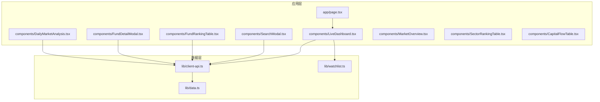
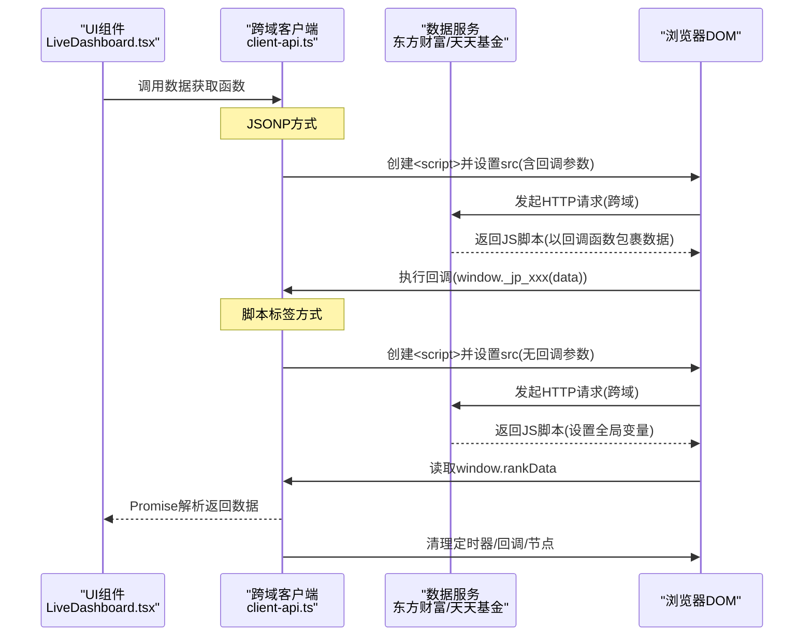
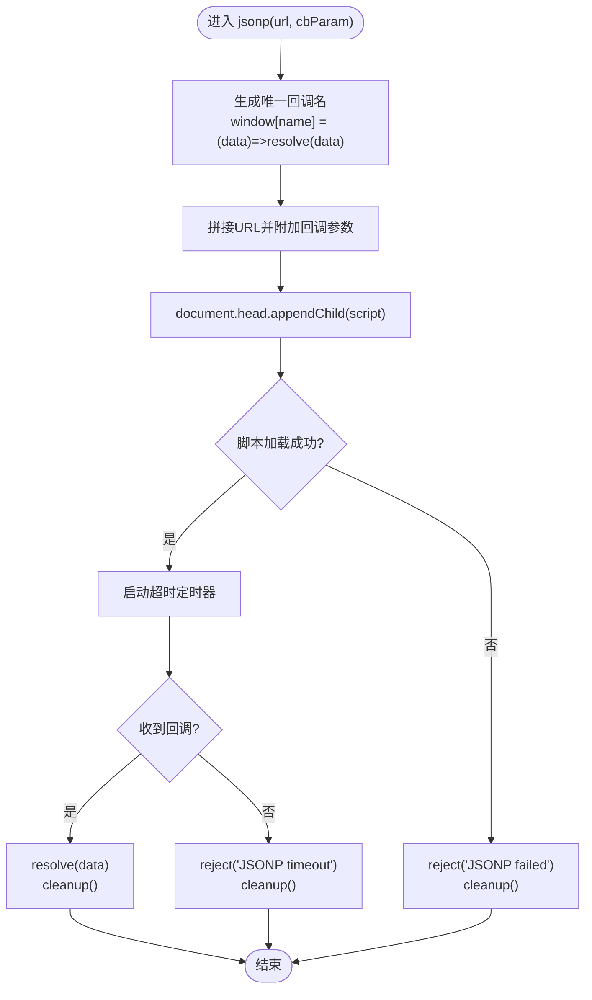
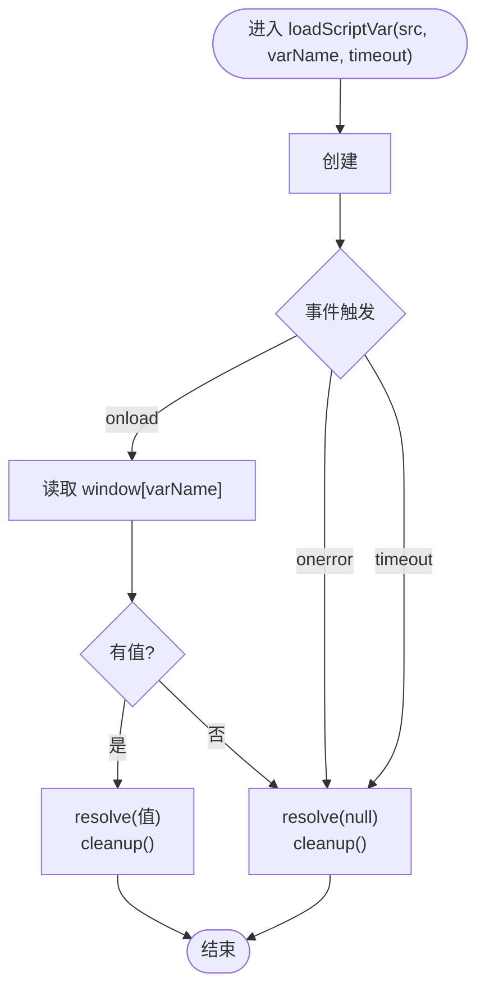
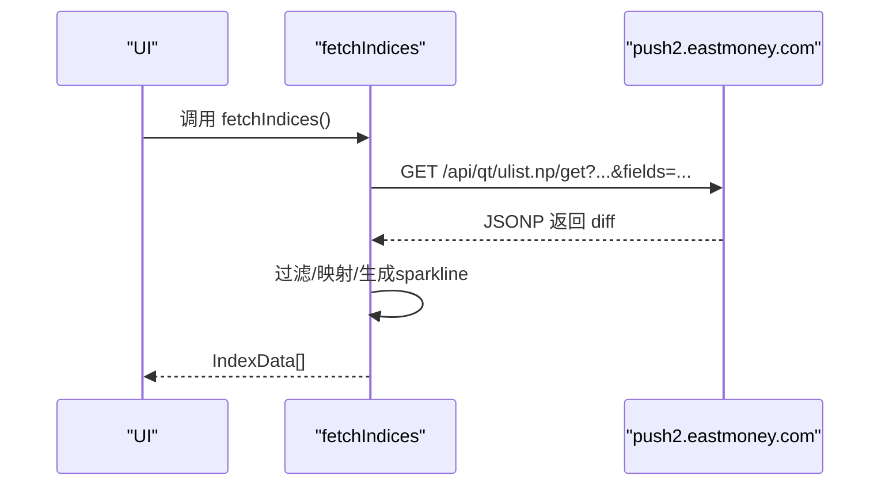
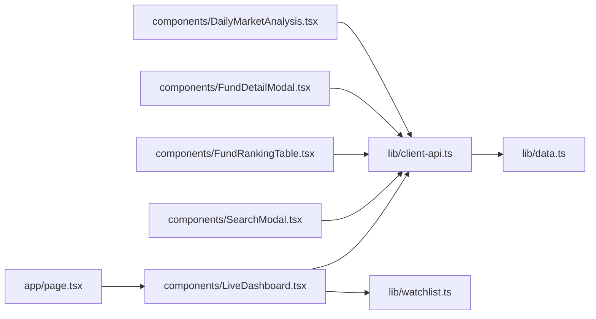

# API客户端

<cite>
**本文引用的文件**
- [client-api.ts](file://lib/client-api.ts)
- [data.ts](file://lib/data.ts)
- [watchlist.ts](file://lib/watchlist.ts)
- [LiveDashboard.tsx](file://components/LiveDashboard.tsx)
- [SearchModal.tsx](file://components/SearchModal.tsx)
- [FundRankingTable.tsx](file://components/FundRankingTable.tsx)
- [FundDetailModal.tsx](file://components/FundDetailModal.tsx)
- [DailyMarketAnalysis.tsx](file://components/DailyMarketAnalysis.tsx)
- [MarketOverview.tsx](file://components/MarketOverview.tsx)
- [SectorRankingTable.tsx](file://components/SectorRankingTable.tsx)
- [CapitalFlowTable.tsx](file://components/CapitalFlowTable.tsx)
- [page.tsx](file://app/page.tsx)
- [README.md](file://README.md)
- [package.json](file://package.json)
</cite>

## 更新摘要
**变更内容**
- 新增了loadScriptVar函数，专门用于脚本标签加载和全局变量提取
- 改进了跨域解决方案的实现细节，增强了错误处理和调试能力
- 新增了fetchFundDetail函数，提供基金经理、基金规模和前十大持仓信息
- 优化了fetchFundRanking函数，使用loadScriptVar替代直接JSONP方式
- 新增了4个市场分析相关的API函数：fetchMarketStats、fetchSectorRanking、fetchSectorCapitalFlow、fetchDailyAnalysis
- 增强了组件间的数据传递和错误处理机制

## 目录
1. [简介](#简介)
2. [项目结构](#项目结构)
3. [核心组件](#核心组件)
4. [架构总览](#架构总览)
5. [详细组件分析](#详细组件分析)
6. [依赖关系分析](#依赖关系分析)
7. [性能考量](#性能考量)
8. [故障排查指南](#故障排查指南)
9. [结论](#结论)
10. [附录](#附录)

## 简介
本项目是一个基于 Next.js 的前端应用，用于实时展示全球指数、热门股票与基金净值等金融数据。API 客户端位于 lib/client-api.ts 中，采用 JSONP 和脚本标签加载相结合的跨域解决方案，统封装了多个数据源接口，包括指数、股票、基金净值与历史、搜索、基金排行榜、基金详情以及新增的市场分析数据。本文档聚焦于跨域解决方案的实现细节，解释动态脚本注入、回调函数生成、超时与内存清理机制，并对各数据获取函数的 URL 构造规则、参数配置进行深入分析，同时提供调用示例、错误处理策略、安全注意事项与扩展建议。

## 项目结构
- 应用入口与页面组织：app/page.tsx 提供根页面，组件 LiveDashboard.tsx 作为主面板负责数据拉取与展示。
- 数据层：lib/client-api.ts 提供跨域客户端与各类数据获取函数；lib/data.ts 定义数据模型；lib/watchlist.ts 管理用户自选列表（基金/股票）。
- 组件层：components/LiveDashboard.tsx 使用 client-api.ts 的接口；components/SearchModal.tsx 调用搜索接口并集成 watchlist.ts；components/FundRankingTable.tsx 和 components/FundDetailModal.tsx 展示基金排行和详情信息；components/DailyMarketAnalysis.tsx 展示市场分析数据。

**图表来源**
- [page.tsx:10-23](file://app/page.tsx#L10-L23)
- [LiveDashboard.tsx:39-301](file://components/LiveDashboard.tsx#L39-L301)
- [SearchModal.tsx:24-209](file://components/SearchModal.tsx#L24-L209)
- [FundRankingTable.tsx:1-192](file://components/FundRankingTable.tsx#L1-L192)
- [FundDetailModal.tsx:1-233](file://components/FundDetailModal.tsx#L1-L233)
- [DailyMarketAnalysis.tsx:1-54](file://components/DailyMarketAnalysis.tsx#L1-L54)
- [MarketOverview.tsx:1-126](file://components/MarketOverview.tsx#L1-L126)
- [SectorRankingTable.tsx:1-115](file://components/SectorRankingTable.tsx#L1-L115)
- [CapitalFlowTable.tsx:1-160](file://components/CapitalFlowTable.tsx#L1-L160)
- [client-api.ts:1-765](file://lib/client-api.ts#L1-L765)
- [data.ts:1-300](file://lib/data.ts#L1-L300)
- [watchlist.ts:28-88](file://lib/watchlist.ts#L28-L88)

**章节来源**
- [page.tsx:10-23](file://app/page.tsx#L10-L23)
- [LiveDashboard.tsx:39-301](file://components/LiveDashboard.tsx#L39-L301)
- [SearchModal.tsx:24-209](file://components/SearchModal.tsx#L24-L209)
- [FundRankingTable.tsx:1-192](file://components/FundRankingTable.tsx#L1-L192)
- [FundDetailModal.tsx:1-233](file://components/FundDetailModal.tsx#L1-L233)
- [DailyMarketAnalysis.tsx:1-54](file://components/DailyMarketAnalysis.tsx#L1-L54)
- [MarketOverview.tsx:1-126](file://components/MarketOverview.tsx#L1-L126)
- [SectorRankingTable.tsx:1-115](file://components/SectorRankingTable.tsx#L1-L115)
- [CapitalFlowTable.tsx:1-160](file://components/CapitalFlowTable.tsx#L1-L160)
- [client-api.ts:1-765](file://lib/client-api.ts#L1-L765)
- [data.ts:1-300](file://lib/data.ts#L1-L300)
- [watchlist.ts:28-88](file://lib/watchlist.ts#L28-L88)

## 核心组件
- **跨域解决方案**：提供通用的动态脚本注入与回调执行能力，支持 JSONP 和脚本标签加载两种方式，支持超时与内存清理。
- **辅助工具**：loadScriptVar 用于加载外部脚本并提取全局变量值；inferFundType 用于根据基金名称推断类型。
- **数据获取函数**：fetchIndices、fetchHotStocks、fetchFunds、fetchFundsByCodes、fetchStocksByCodes、searchFunds、searchStocks、fetchFundRanking、fetchFundDetail、fetchKline、fetchMarketStats、fetchSectorRanking、fetchSectorCapitalFlow、fetchDailyAnalysis 等。
- **数据模型**：IndexData、StockData、FundData、FundRankingData、MarketStatsData、SectorData、SectorCapitalFlowData、DailyAnalysisData 等接口定义。

**章节来源**
- [client-api.ts:5-36](file://lib/client-api.ts#L5-L36)
- [client-api.ts:51-84](file://lib/client-api.ts#L51-L84)
- [client-api.ts:40-49](file://lib/client-api.ts#L40-L49)
- [data.ts:1-300](file://lib/data.ts#L1-L300)

## 架构总览
下图展示了前端组件与 API 客户端之间的交互流程，以及跨域场景下的工作方式。

**图表来源**
- [LiveDashboard.tsx:56-95](file://components/LiveDashboard.tsx#L56-L95)
- [client-api.ts:5-36](file://lib/client-api.ts#L5-L36)
- [client-api.ts:51-84](file://lib/client-api.ts#L51-L84)

## 详细组件分析

### 跨域解决方案改进
**更新** 新增了loadScriptVar函数，专门用于脚本标签加载方式，解决了GitHub Pages等环境中的CORS限制问题

- **动态脚本注入**：创建 script 元素，设置 src 为目标 URL，并附加回调参数名，使服务端返回以回调函数包裹的数据。
- **脚本标签加载**：使用 loadScriptVar 函数加载外部脚本，等待 onload 或 onerror，读取 window 上的指定全局变量，超时后返回 null。
- **回调函数生成**：生成唯一全局回调名（如 _jp_时间戳_随机串），挂载到 window 对象，服务端返回时直接调用该函数传入数据。
- **超时处理**：JSONP 默认 10 秒，loadScriptVar 默认 8 秒，超时后拒绝 Promise 并清理资源。
- **错误处理**：当脚本加载失败（onerror）时拒绝 Promise 并清理。
- **内存清理**：清理定时器、删除全局回调、移除 script 节点，避免内存泄漏与命名污染。

**图表来源**
- [client-api.ts:5-36](file://lib/client-api.ts#L5-L36)

**章节来源**
- [client-api.ts:5-36](file://lib/client-api.ts#L5-L36)

### loadScriptVar 加载脚本并提取全局变量
**新增** 专门用于解决CORS限制问题的新函数

- **作用**：加载外部脚本，等待 onload 或 onerror，读取 window 上的指定全局变量，超时后返回 null。
- **超时控制**：默认超时时间可配置（例如 8 秒），超时后清理并返回空值。
- **安全性**：仅在 onload 成功且存在全局变量时才返回，否则返回 null，避免异常传播。
- **应用场景**：专门用于基金排名API等受CORS限制的接口。
- **错误处理**：包含完整的错误捕获和清理机制。

**图表来源**
- [client-api.ts:51-84](file://lib/client-api.ts#L51-L84)

**章节来源**
- [client-api.ts:51-84](file://lib/client-api.ts#L51-L84)

### 市场分析API函数详解

#### fetchMarketStats：市场统计数据
**新增** 获取市场整体统计数据，包括涨跌家数、涨停跌停家数和成交额

- **URL 构造**：基于 push2.eastmoney.com 的 ulist 接口，分别获取上证指数涨跌家数、深证成指涨跌家数和两市成交额。
- **并发处理**：使用 Promise.allSettled 并发获取多个统计数据，提高响应速度。
- **数据聚合**：将多个API返回的数据整合为 MarketStatsData 结构。
- **参数要点**：fltt=2、fields 指定返回字段、_ 时间戳防缓存。
- **错误处理**：每个API请求都有独立的错误处理，失败不影响整体数据获取。

**章节来源**
- [client-api.ts:640-695](file://lib/client-api.ts#L640-L695)

#### fetchSectorRanking：板块排名
**新增** 获取行业板块和概念板块的涨跌幅排名

- **参数类型**：支持 'industry'（行业板块）和 'concept'（概念板块）两种类型。
- **URL 构造**：基于 push2.eastmoney.com 的 clist 接口，fs 参数根据类型选择不同的筛选条件。
- **数据格式化**：提取板块名称、代码、涨跌幅、涨跌家数、领涨股等信息。
- **字段映射**：f104 表示上涨家数，f105 表示下跌家数，f128 表示领涨股代码，f140 表示领涨股名称。

**章节来源**
- [client-api.ts:697-724](file://lib/client-api.ts#L697-L724)

#### fetchSectorCapitalFlow：板块资金流向
**新增** 获取各板块的资金流向数据

- **URL 构造**：基于 push2.eastmoney.com 的 clist 接口，fs=m:90+t:2 筛选行业板块。
- **资金流向指标**：
  - mainNetInflow：主力净流入（f62）
  - mainNetRatio：主力净占比（f184）
  - superLargeNet：超大单净量（f66）
  - largeNet：大单净量（f72）
- **数据格式化**：将原始数据转换为 SectorCapitalFlowData 结构，包含板块基本信息和资金流向指标。

**章节来源**
- [client-api.ts:726-748](file://lib/client-api.ts#L726-L748)

#### fetchDailyAnalysis：每日市场分析
**新增** 组合调用多个市场分析API，提供完整的市场分析数据

- **组合调用**：内部调用 fetchMarketStats、fetchSectorRanking('industry')、fetchSectorRanking('concept')、fetchSectorCapitalFlow。
- **并发优化**：使用 Promise.allSettled 并发获取所有分析数据。
- **数据结构**：返回 DailyAnalysisData，包含市场概况、行业板块、概念板块和资金流向数据。
- **错误处理**：每个子任务都有独立的错误处理，失败的请求会返回 null 或空数组。

**章节来源**
- [client-api.ts:750-764](file://lib/client-api.ts#L750-L764)

### 数据获取函数详解

#### fetchIndices：全球指数
- **URL 构造**：基于 push2.eastmoney.com 的 ulist 接口，一次性拉取多指数行情。
- **参数要点**：fltt=2、fields 指定返回字段、_ 时间戳防缓存。
- **行情映射**：过滤有效数值，补充市场与旗帜标识，按 INDEX_META 映射生成 sparkline。
- **失败回退**：返回空数组并记录错误日志。

**图表来源**
- [client-api.ts:154-201](file://lib/client-api.ts#L154-L201)

**章节来源**
- [client-api.ts:154-201](file://lib/client-api.ts#L154-L201)

#### fetchHotStocks：热门股票
- **URL 构造**：基于 push2.eastmoney.com 的 clist 接口，按成交额排序取前若干只。
- **参数要点**：pn/pz 控制页码与数量，fs 为筛选条件，fields 指定返回字段。
- **数据格式化**：将数值转换为字符串形式的"亿/万"单位，保留必要字段。

**章节来源**
- [client-api.ts:205-242](file://lib/client-api.ts#L205-L242)

#### fetchStocksByCodes：按代码批量获取股票
- **URL 构造**：将多个 secid 以逗号连接传入 secids 参数。
- **参数要点**：fields 指定返回字段，_ 时间戳防缓存。
- **数据格式化**：同热门股票，统一输出结构。

**章节来源**
- [client-api.ts:423-460](file://lib/client-api.ts#L423-L460)

#### fetchFundsByCodes：按代码批量获取基金
- **组合调用**：先并发拉取历史收益与净值，再合并为 FundData。
- **历史收益**：通过 loadScriptVar 加载 pingzhongdata 脚本，提取 Data_netWorthTrend 与 syl_* 系列变量。
- **净值**：通过独立脚本回调获取 name、dwjz、gszzl、jzrq 等字段。

**章节来源**
- [client-api.ts:464-525](file://lib/client-api.ts#L464-L525)
- [client-api.ts:255-292](file://lib/client-api.ts#L255-L292)
- [client-api.ts:294-348](file://lib/client-api.ts#L294-L348)
- [client-api.ts:51-84](file://lib/client-api.ts#L51-L84)

#### fetchFunds：内置配置的基金集合
- **配置**：FUND_CONFIG 定义了默认跟踪的基金代码、类型、经理与规模。
- **调用**：复用 fetchFundsByCodes 逻辑，返回完整 FundData 列表。

**章节来源**
- [client-api.ts:246-253](file://lib/client-api.ts#L246-L253)
- [client-api.ts:499-525](file://lib/client-api.ts#L499-L525)

#### searchFunds：基金搜索
- **URL 构造**：基于 fundsuggest.eastmoney.com 的搜索接口，传入关键词与时间戳。
- **结果映射**：截取前若干条，提取 CODE、NAME、FundBaseInfo.FTYPE、JJJL 等字段。

**章节来源**
- [client-api.ts:366-381](file://lib/client-api.ts#L366-L381)

#### searchStocks/searchAllStocks：股票搜索
- **URL 构造**：基于 searchapi.eastmoney.com 的 suggest 接口，传入输入与 token。
- **结果映射**：根据 QuotationCodeTable.Data 过滤与映射，包含名称、代码、市场编号映射。

**章节来源**
- [client-api.ts:383-415](file://lib/client-api.ts#L383-L415)

#### fetchFundRanking：基金涨跌幅排行榜
**更新** 从直接JSONP请求改为脚本标签加载方式，解决CORS限制问题

- **主流程**：使用 loadScriptVar 加载脚本，读取 window.rankData 全局变量，解析返回文本中的 datas 字段。
- **回退机制**：若 loadScriptVar 失败，尝试通过 JSONP 方式回退。
- **结果映射**：按逗号分割字符串，提取代码、名称、类型、净值、日期与多周期收益。
- **调试增强**：包含详细的 console.log 输出，便于问题排查。

**章节来源**
- [client-api.ts:598-636](file://lib/client-api.ts#L598-L636)

#### fetchFundDetail：基金详情
**新增** 提供基金经理、基金规模和前十大持仓信息

- **基金经理和规模**：通过 loadScriptVar 加载 pingzhongdata 脚本，提取 Data_currentFundManager 和 Data_fundInfo 全局变量。
- **前十大持仓**：使用 JSONP 方式获取持仓信息，支持多种数据结构格式。
- **错误处理**：持仓请求失败时忽略错误，不影响整体数据获取。
- **数据清理**：获取完成后清理全局变量，避免内存泄漏。
- **类型安全**：返回 FundDetail 接口，包含可选字段。

**章节来源**
- [client-api.ts:537-594](file://lib/client-api.ts#L537-L594)

#### fetchKline：股票K线
- **URL 构造**：基于 push2his.eastmoney.com 的 kline 接口，支持 day/week/month。
- **结果映射**：解析字符串分隔的字段，计算涨跌与涨跌幅，返回 KlineRaw 数组。

**章节来源**
- [client-api.ts:105-136](file://lib/client-api.ts#L105-L136)

### 数据模型
- **IndexData**：指数名称、代码、数值、涨跌、涨跌幅、市场、旗帜、可选 sparkline。
- **StockData**：股票名称、代码、价格、涨跌、涨跌幅、成交量/成交额字符串、最高/最低。
- **FundData**：基金名称、代码、类型、净值、净值日期、日涨跌、可选经理/规模、可选收益与sparkline。
- **FundRankingData**：基金名称、代码、类型、净值、净值日期、日/周/月/季/半年/年收益、可选基金经理/规模/持仓。
- **FundDetail**：基金经理、基金规模、前十大持仓信息。
- **MarketStatsData**：上涨家数、下跌家数、平盘家数、涨停家数、跌停家数、总成交额。
- **SectorData**：板块名称、代码、涨跌幅、涨跌、价格、上涨家数、下跌家数、领涨股、领涨股代码。
- **SectorCapitalFlowData**：板块名称、代码、涨跌幅、主力净流入、主力净占比、超大单净量、大单净量。
- **DailyAnalysisData**：市场统计数据、行业板块排名、概念板块排名、资金流向数据。

**章节来源**
- [data.ts:1-300](file://lib/data.ts#L1-L300)

## 依赖关系分析
- **组件依赖**：LiveDashboard.tsx 依赖 client-api.ts 的多个函数，包括新增的市场分析API；SearchModal.tsx 依赖 searchFunds/searchStocks；FundRankingTable.tsx 和 FundDetailModal.tsx 依赖 fetchFundRanking 和 fetchFundDetail；DailyMarketAnalysis.tsx 依赖 fetchDailyAnalysis 及其子组件。
- **数据依赖**：client-api.ts 依赖 data.ts 的类型定义；watchlist.ts 提供自选数据，驱动 LiveDashboard 的动态数据拉取。

**图表来源**
- [page.tsx:10-23](file://app/page.tsx#L10-L23)
- [LiveDashboard.tsx:30-37](file://components/LiveDashboard.tsx#L30-L37)
- [SearchModal.tsx:6](file://components/SearchModal.tsx#L6)
- [FundRankingTable.tsx:1-192](file://components/FundRankingTable.tsx#L1-L192)
- [FundDetailModal.tsx:1-233](file://components/FundDetailModal.tsx#L1-L233)
- [DailyMarketAnalysis.tsx:1-54](file://components/DailyMarketAnalysis.tsx#L1-L54)
- [client-api.ts:1](file://lib/client-api.ts#L1)
- [data.ts:1](file://lib/data.ts#L1)
- [watchlist.ts:28](file://lib/watchlist.ts#L28)

**章节来源**
- [page.tsx:10-23](file://app/page.tsx#L10-L23)
- [LiveDashboard.tsx:30-37](file://components/LiveDashboard.tsx#L30-L37)
- [SearchModal.tsx:6](file://components/SearchModal.tsx#L6)
- [FundRankingTable.tsx:1-192](file://components/FundRankingTable.tsx#L1-L192)
- [FundDetailModal.tsx:1-233](file://components/FundDetailModal.tsx#L1-L233)
- [DailyMarketAnalysis.tsx:1-54](file://components/DailyMarketAnalysis.tsx#L1-L54)
- [client-api.ts:1](file://lib/client-api.ts#L1)
- [data.ts:1](file://lib/data.ts#L1)
- [watchlist.ts:28](file://lib/watchlist.ts#L28)

## 性能考量
- **并发优化**：LiveDashboard 使用 Promise.allSettled 并发拉取多路数据，包括新增的市场分析API，减少总等待时间。
- **缓存与防抖**：搜索接口使用 400ms 防抖，降低频繁请求；URL 中加入时间戳参数避免缓存。
- **资源清理**：JSONP 与 loadScriptVar 均在成功/失败/超时后清理定时器与 DOM 节点，避免内存泄漏。
- **超时策略**：JSONP 默认 10 秒，loadScriptVar 默认 8 秒，可根据网络环境调整。
- **CORS优化**：新增的脚本标签加载方式专门解决CORS限制，提高GitHub Pages等环境的兼容性。
- **调试增强**：新增的 console.log 输出帮助开发者快速定位问题。
- **市场分析API优化**：fetchDailyAnalysis 使用 Promise.allSettled 并发获取所有分析数据，提高响应速度。

**章节来源**
- [LiveDashboard.tsx:73-112](file://components/LiveDashboard.tsx#L73-L112)
- [client-api.ts:5-36](file://lib/client-api.ts#L5-L36)
- [client-api.ts:51-84](file://lib/client-api.ts#L51-L84)
- [client-api.ts:750-764](file://lib/client-api.ts#L750-L764)

## 故障排查指南
- **JSONP 失败**：检查服务端是否正确返回回调包裹的数据；确认回调参数名与 URL 拼接一致；查看 onerror 是否触发。
- **JSONP 超时**：适当延长超时时间；检查网络状况与服务端响应速度；确认脚本加载路径可达。
- **loadScriptVar 失败**：确认目标脚本可被正常加载且全局变量存在；检查超时阈值是否合理。
- **CORS 限制**：使用新的脚本标签加载方式替代直接JSONP；确保服务端支持脚本加载。
- **数据为空**：检查 fields 参数是否正确；确认服务端返回结构与预期一致；查看过滤逻辑是否导致结果为空。
- **基金详情获取失败**：检查持仓接口是否可用；验证数据结构兼容性；确认全局变量清理是否正确。
- **市场分析API失败**：检查各个子API的可用性；验证数据格式一致性；确认并发请求的错误处理。
- **调试信息**：利用新增的 console.log 输出进行问题定位。

**章节来源**
- [client-api.ts:5-36](file://lib/client-api.ts#L5-L36)
- [client-api.ts:51-84](file://lib/client-api.ts#L51-L84)
- [LiveDashboard.tsx:73-112](file://components/LiveDashboard.tsx#L73-L112)
- [client-api.ts:640-695](file://lib/client-api.ts#L640-L695)
- [client-api.ts:697-748](file://lib/client-api.ts#L697-L748)

## 结论
本项目通过改进的跨域客户端实现了对多个金融数据源的跨域访问，采用 JSONP 和脚本标签加载相结合的方式，配合 loadScriptVar 与自定义回调机制，提供了稳定的数据获取能力。新增的 loadScriptVar 函数专门解决CORS限制问题，增强了在GitHub Pages等环境中的兼容性。新增的 fetchFundDetail 函数丰富了数据维度，提供了基金经理、基金规模和前十大持仓信息，增强了用户体验。新增的4个市场分析API函数（fetchMarketStats、fetchSectorRanking、fetchSectorCapitalFlow、fetchDailyAnalysis）提供了全面的市场分析能力，包括市场统计数据、板块排名和资金流向数据。组件层通过并发与防抖策略优化用户体验，同时在错误处理与资源清理方面做了充分考虑。对于后续扩展，可在保持现有接口不变的前提下，增加更多数据源与更细粒度的错误分类，进一步提升健壮性与可维护性。

## 附录

### API 调用示例与最佳实践
- **获取全球指数**
  - 调用：fetchIndices()
  - 返回：IndexData[]，包含名称、代码、数值、涨跌、涨跌幅、市场、旗帜与可选 sparkline。
  - 注意：若网络异常，返回空数组并记录错误日志。
- **获取热门股票**
  - 调用：fetchHotStocks()
  - 返回：StockData[]，包含价格、涨跌、涨跌幅、成交量/成交额字符串等。
- **按代码批量获取股票**
  - 调用：fetchStocksByCodes(['105.TSLA','128.0992.HK'])
  - 返回：StockData[]
- **按代码批量获取基金**
  - 调用：fetchFundsByCodes([{code:'005827',type:'混合型',manager:'张坤'}])
  - 返回：FundData[]
- **基金搜索**
  - 调用：searchFunds('易方达')
  - 返回：FundSearchResult[]
- **股票搜索**
  - 调用：searchStocks('贵州茅台')
  - 返回：StockSearchResult[]
- **基金涨跌幅排行榜**
  - 调用：fetchFundRanking()
  - 返回：FundRankingData[]（支持CORS限制）
- **基金详情**
  - 调用：fetchFundDetail('005827')
  - 返回：FundDetail（包含基金经理、规模、前十大持仓）
- **股票K线**
  - 调用：fetchKline('105.TSLA','day',120)
  - 返回：包含名称、代码与K线数组的对象
- **市场统计数据**
  - 调用：fetchMarketStats()
  - 返回：MarketStatsData（上涨家数、下跌家数、平盘家数、涨停家数、跌停家数、总成交额）
- **板块排名**
  - 调用：fetchSectorRanking('industry' | 'concept')
  - 返回：SectorData[]（板块名称、代码、涨跌幅、涨跌家数、领涨股等）
- **板块资金流向**
  - 调用：fetchSectorCapitalFlow()
  - 返回：SectorCapitalFlowData[]（主力净流入、主力净占比、超大单净量、大单净量等）
- **每日市场分析**
  - 调用：fetchDailyAnalysis()
  - 返回：DailyAnalysisData（完整的市场分析数据）

**章节来源**
- [client-api.ts:154-201](file://lib/client-api.ts#L154-L201)
- [client-api.ts:205-242](file://lib/client-api.ts#L205-L242)
- [client-api.ts:423-460](file://lib/client-api.ts#L423-L460)
- [client-api.ts:464-525](file://lib/client-api.ts#L464-L525)
- [client-api.ts:366-381](file://lib/client-api.ts#L366-L381)
- [client-api.ts:383-415](file://lib/client-api.ts#L383-L415)
- [client-api.ts:598-636](file://lib/client-api.ts#L598-L636)
- [client-api.ts:537-594](file://lib/client-api.ts#L537-L594)
- [client-api.ts:105-136](file://lib/client-api.ts#L105-L136)
- [client-api.ts:640-695](file://lib/client-api.ts#L640-L695)
- [client-api.ts:697-748](file://lib/client-api.ts#L697-L748)
- [client-api.ts:750-764](file://lib/client-api.ts#L750-L764)

### 跨域限制与安全考虑
- **跨域限制**：现代浏览器对跨域请求有限制，JSONP 通过动态注入 script 标签绕过 CORS，但要求服务端支持回调参数。
- **脚本标签方式**：新增的 loadScriptVar 函数专门解决CORS限制，适用于受限制的环境如GitHub Pages。
- **安全性**：JSONP 返回的脚本由第三方提供，应避免执行不受信任的脚本；确保回调参数名唯一，防止全局变量冲突；及时清理定时器与 DOM 节点。
- **可靠性**：为关键接口设置合理的超时与重试策略；对返回数据进行严格校验与过滤，避免空值或异常数据影响 UI。
- **兼容性**：新的跨域解决方案提高了应用在不同部署环境中的兼容性。
- **调试能力**：新增的 console.log 输出帮助开发者快速定位问题。

**章节来源**
- [client-api.ts:5-36](file://lib/client-api.ts#L5-L36)
- [client-api.ts:51-84](file://lib/client-api.ts#L51-L84)
- [README.md:165-178](file://README.md#L165-L178)

### 开发者使用指南与扩展方法
- **使用指南**
  - 在组件中导入所需函数，如 fetchIndices、fetchFunds、searchFunds、fetchFundRanking、fetchFundDetail、fetchMarketStats、fetchSectorRanking、fetchSectorCapitalFlow、fetchDailyAnalysis 等。
  - 使用 Promise.allSettled 并发拉取多路数据，提升响应速度。
  - 对返回数据进行必要的格式化与过滤，保证 UI 层稳定。
  - 利用新增的市场分析功能，提供更全面的投资决策信息。
  - 利用新增的基金详情功能，提供更丰富的投资决策信息。
- **扩展方法**
  - 新增数据源：遵循跨域客户端模式，新增函数并定义数据模型接口。
  - 增强错误处理：为不同接口定义更细粒度的错误类型与提示信息。
  - 优化性能：引入缓存策略与更智能的并发控制，减少重复请求。
  - 增加监控：在关键接口埋点统计成功率与耗时，便于定位问题。
  - 扩展跨域支持：根据新的脚本标签加载方式，适配更多受CORS限制的接口。
  - 利用调试信息：充分利用新增的 console.log 输出进行问题排查。
  - 市场分析扩展：可以基于现有的市场分析API框架，添加更多分析维度，如行业景气度、资金流变化等。

**章节来源**
- [LiveDashboard.tsx:73-112](file://components/LiveDashboard.tsx#L73-L112)
- [client-api.ts:1-765](file://lib/client-api.ts#L1-L765)
- [data.ts:1-300](file://lib/data.ts#L1-L300)
- [watchlist.ts:28-88](file://lib/watchlist.ts#L28-L88)