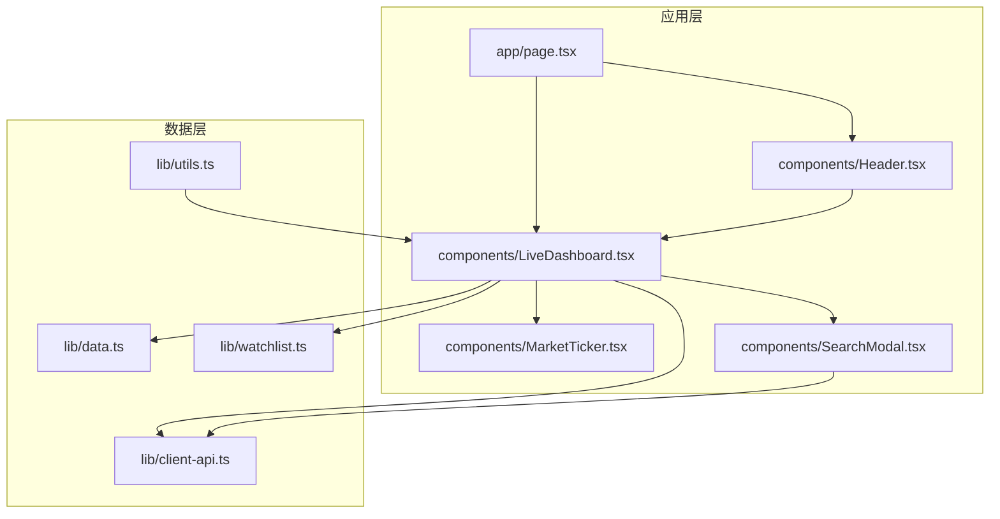
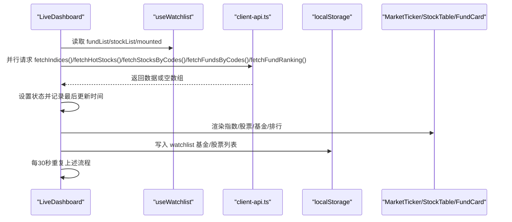
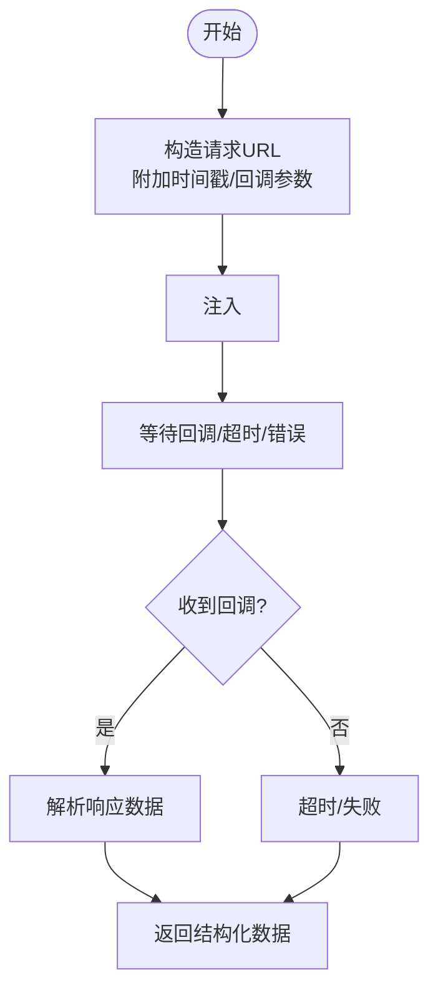
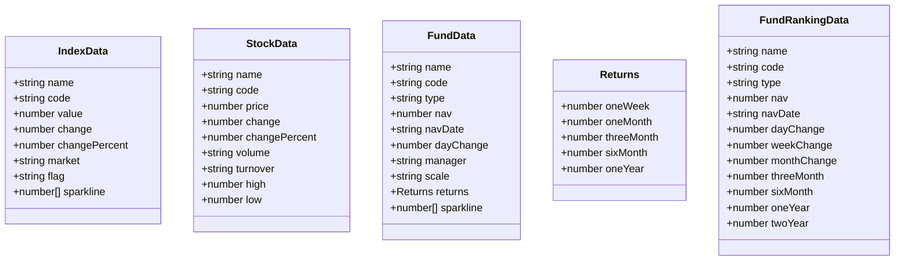
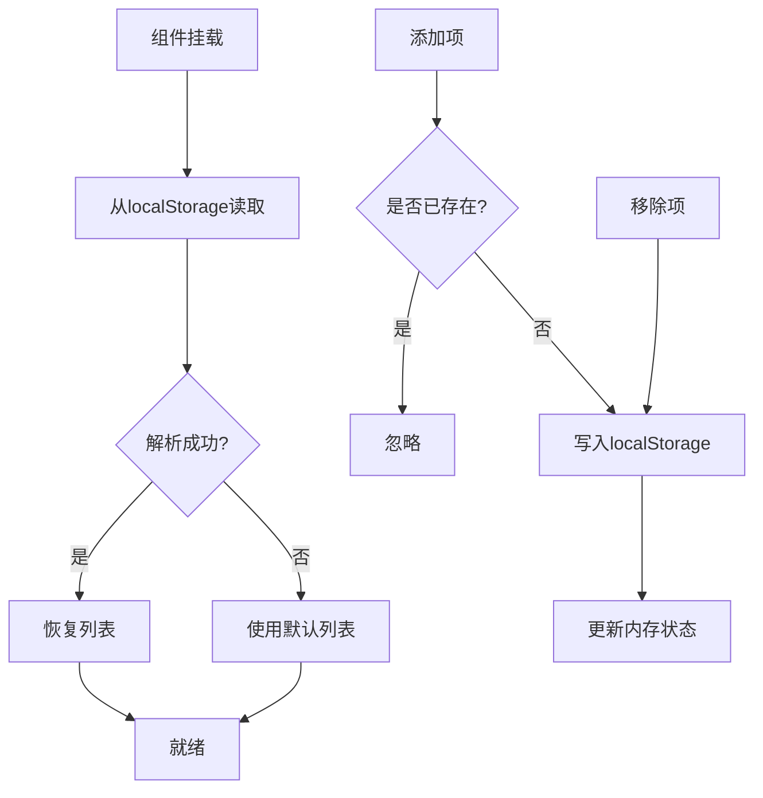
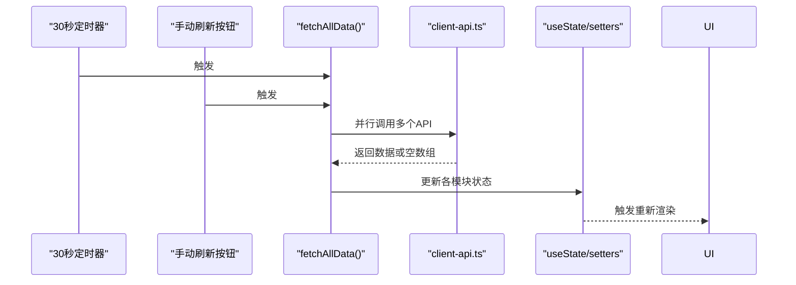
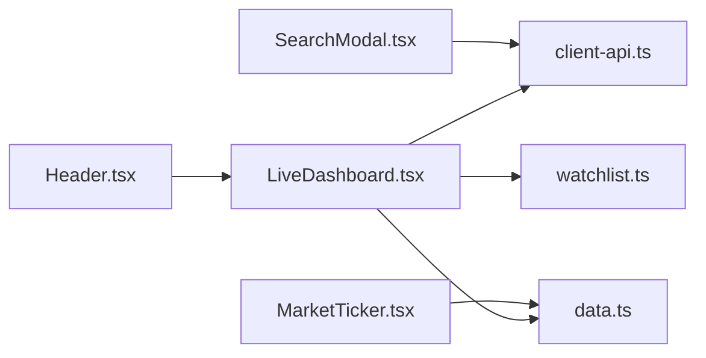

# 数据管理

<cite>
**本文引用的文件**
- [client-api.ts](file://lib/client-api.ts)
- [data.ts](file://lib/data.ts)
- [watchlist.ts](file://lib/watchlist.ts)
- [utils.ts](file://lib/utils.ts)
- [LiveDashboard.tsx](file://components/LiveDashboard.tsx)
- [MarketTicker.tsx](file://components/MarketTicker.tsx)
- [SearchModal.tsx](file://components/SearchModal.tsx)
- [Header.tsx](file://components/Header.tsx)
- [page.tsx](file://app/page.tsx)
- [package.json](file://package.json)
</cite>

## 目录
1. [简介](#简介)
2. [项目结构](#项目结构)
3. [核心组件](#核心组件)
4. [架构总览](#架构总览)
5. [详细组件分析](#详细组件分析)
6. [依赖关系分析](#依赖关系分析)
7. [性能考量](#性能考量)
8. [故障排查指南](#故障排查指南)
9. [结论](#结论)
10. [附录](#附录)

## 简介
本文件面向数据工程师与高级开发者，系统性梳理“基金实盘跟踪”应用的数据管理机制，覆盖数据获取、处理与存储的全流程。重点解析以下方面：
- JSONP API 客户端实现与跨域数据获取策略
- 数据类型定义与模拟数据结构
- 自定义 Hook（watchlist）设计：用户偏好持久化、状态同步与数据管理
- 数据刷新机制：30 秒自动刷新与手动刷新
- 缓存策略与性能优化
- 数据流生命周期：从 API 调用到 UI 更新的全过程

## 项目结构
应用采用 Next.js 13+ App Router 架构，数据层位于 lib 目录，UI 组件位于 components 目录，入口页面在 app 目录。数据管理的关键模块如下：
- lib/client-api.ts：JSONP 与脚本注入式 API 客户端，封装跨域数据获取
- lib/data.ts：数据类型定义与静态模拟数据
- lib/watchlist.ts：自定义 Hook，负责用户关注列表的本地持久化与状态同步
- components/LiveDashboard.tsx：主面板，协调多源数据拉取、刷新与 UI 渲染
- components/MarketTicker.tsx：指数滚动行情展示
- components/SearchModal.tsx：搜索与添加关注项
- app/page.tsx：页面元信息与布局入口

图表来源
- [page.tsx:1-24](file://app/page.tsx#L1-L24)
- [LiveDashboard.tsx:1-375](file://components/LiveDashboard.tsx#L1-L375)
- [client-api.ts:1-596](file://lib/client-api.ts#L1-L596)
- [data.ts:1-255](file://lib/data.ts#L1-L255)
- [watchlist.ts:1-89](file://lib/watchlist.ts#L1-L89)
- [utils.ts:1-7](file://lib/utils.ts#L1-L7)

章节来源
- [page.tsx:1-24](file://app/page.tsx#L1-L24)
- [package.json:1-31](file://package.json#L1-L31)

## 核心组件
- JSONP 客户端：提供通用 JSONP 工具函数与多个业务 API 封装，支持超时与清理，适配不同第三方接口回调参数命名
- 数据模型：统一定义指数、股票、基金、基金排行等数据结构，同时提供静态模拟数据用于演示
- Watchlist Hook：基于 localStorage 的用户偏好持久化，支持基金与股票的关注列表增删改查
- 主面板：集中调度数据拉取、定时刷新、手动刷新与 UI 展示

章节来源
- [client-api.ts:1-596](file://lib/client-api.ts#L1-L596)
- [data.ts:1-255](file://lib/data.ts#L1-L255)
- [watchlist.ts:1-89](file://lib/watchlist.ts#L1-L89)
- [LiveDashboard.tsx:1-375](file://components/LiveDashboard.tsx#L1-L375)

## 架构总览
应用的数据流以“主面板驱动 + 多源 API 汇聚”的方式组织：
- 主面板通过 useEffect 在挂载后立即拉取一次数据，并每 30 秒触发一次自动刷新
- 手动刷新按钮可即时触发一次数据拉取
- 数据拉取采用 Promise.allSettled 并行聚合，确保部分失败不影响其他模块
- 用户关注列表由 watchlist Hook 提供，影响股票与基金数据的动态拉取

图表来源
- [LiveDashboard.tsx:56-102](file://components/LiveDashboard.tsx#L56-L102)
- [client-api.ts:154-199](file://lib/client-api.ts#L154-L199)
- [client-api.ts:203-240](file://lib/client-api.ts#L203-L240)
- [client-api.ts:421-458](file://lib/client-api.ts#L421-L458)
- [client-api.ts:462-523](file://lib/client-api.ts#L462-L523)
- [client-api.ts:527-595](file://lib/client-api.ts#L527-L595)
- [watchlist.ts:28-88](file://lib/watchlist.ts#L28-L88)

## 详细组件分析

### JSONP API 客户端（client-api.ts）
- JSONP 工具：生成唯一回调名、注入 script 标签、设置超时与错误处理、清理 DOM 与全局变量
- 指数数据：批量获取全球主要指数，按需加载短期 K 线作为折线图数据
- 热门股票：分页与字段过滤，格式化成交量与成交额显示
- 基金数据：净值与历史收益（周/月/季/半年/年）的异步拉取；支持按配置或按代码列表动态拉取
- 基金排行：优先使用 fetch + 正则解析，回退到脚本注入方式
- 搜索：支持基金与股票搜索，返回标准化结果

图表来源
- [client-api.ts:5-36](file://lib/client-api.ts#L5-L36)
- [client-api.ts:154-199](file://lib/client-api.ts#L154-L199)
- [client-api.ts:203-240](file://lib/client-api.ts#L203-L240)
- [client-api.ts:421-458](file://lib/client-api.ts#L421-L458)
- [client-api.ts:462-523](file://lib/client-api.ts#L462-L523)
- [client-api.ts:527-595](file://lib/client-api.ts#L527-L595)

章节来源
- [client-api.ts:1-596](file://lib/client-api.ts#L1-L596)

### 数据类型与模拟数据（data.ts）
- 类型定义：IndexData、StockData、FundData、FundRankingData，涵盖名称、代码、数值、变化幅度、市场标识、返回率与折线图等字段
- 静态模拟数据：globalIndices、hotStocks、fundRanking、funds，用于演示与开发调试

图表来源
- [data.ts:1-255](file://lib/data.ts#L1-L255)

章节来源
- [data.ts:1-255](file://lib/data.ts#L1-L255)

### 自定义 Hook：watchlist（watchlist.ts）
- 功能：提供用户关注的基金与股票列表，支持增删、去重、持久化到 localStorage
- 生命周期：首次挂载时从 localStorage 恢复；后续变更实时写入
- 兼容性：兼容旧版字符串数组格式，自动转换为新结构
- 返回值：包含 fundList、stockList、增删方法与 mounted 标记

图表来源
- [watchlist.ts:28-88](file://lib/watchlist.ts#L28-L88)

章节来源
- [watchlist.ts:1-89](file://lib/watchlist.ts#L1-L89)

### 主面板：数据拉取与刷新（LiveDashboard.tsx）
- 并行拉取：指数、热门股票、自选股票、跟踪基金、基金排行
- 自动刷新：30 秒定时器，避免重复请求叠加
- 手动刷新：按钮触发，禁用期间防止并发
- 实时状态：根据指数数据是否有效切换“实时/模拟”状态指示
- 数据合并：Promise.allSettled 保证部分失败不影响整体渲染

图表来源
- [LiveDashboard.tsx:56-102](file://components/LiveDashboard.tsx#L56-L102)
- [LiveDashboard.tsx:128-136](file://components/LiveDashboard.tsx#L128-L136)

章节来源
- [LiveDashboard.tsx:1-375](file://components/LiveDashboard.tsx#L1-L375)

### 指数滚动条（MarketTicker.tsx）
- 将指数列表复制一份拼接，形成无缝滚动效果
- 鼠标悬停暂停动画，离开恢复
- 使用正负号与颜色区分涨跌

章节来源
- [MarketTicker.tsx:1-52](file://components/MarketTicker.tsx#L1-L52)

### 搜索与添加关注（SearchModal.tsx）
- 输入防抖：400ms 延迟，降低请求频率
- 结果映射：将搜索结果映射为 UI 可用的结构，区分基金类型与股票代码
- 添加/移除：根据现有代码集合决定按钮状态，调用父级回调更新 watchlist

章节来源
- [SearchModal.tsx:1-210](file://components/SearchModal.tsx#L1-L210)
- [client-api.ts:364-413](file://lib/client-api.ts#L364-L413)

## 依赖关系分析
- 组件依赖：LiveDashboard 依赖 client-api、data、watchlist；SearchModal 依赖 client-api；MarketTicker 依赖 data
- 运行时依赖：Next.js、React、TailwindCSS、Lucide Icons、clsx/tailwind-merge
- 数据依赖：跨域 JSONP 与脚本注入，依赖第三方站点的回调约定与字段结构

图表来源
- [LiveDashboard.tsx:19-37](file://components/LiveDashboard.tsx#L19-L37)
- [SearchModal.tsx:6](file://components/SearchModal.tsx#L6)
- [MarketTicker.tsx:5](file://components/MarketTicker.tsx#L5)
- [Header.tsx:1-92](file://components/Header.tsx#L1-L92)

章节来源
- [package.json:11-29](file://package.json#L11-L29)

## 性能考量
- 并行拉取：使用 Promise.allSettled 同时发起多个请求，缩短首屏等待时间
- 防抖搜索：400ms 防抖降低搜索请求压力
- 30 秒刷新：平衡实时性与网络开销，避免频繁轮询
- 本地持久化：watchlist 使用 localStorage，减少服务端依赖
- 资源清理：JSONP 注入的 script 与全局回调在完成后清理，避免内存泄漏
- UI 优化：滚动条动画仅在可见区域启用，鼠标悬停暂停

章节来源
- [LiveDashboard.tsx:56-102](file://components/LiveDashboard.tsx#L56-L102)
- [SearchModal.tsx:47-77](file://components/SearchModal.tsx#L47-L77)
- [client-api.ts:5-36](file://lib/client-api.ts#L5-L36)

## 故障排查指南
- JSONP 失败或超时
  - 现象：API 返回空数组或控制台报错
  - 排查：检查目标站点回调参数命名、Referer/UA 是否满足要求、网络连通性
  - 参考路径：[client-api.ts:5-36](file://lib/client-api.ts#L5-L36)、[client-api.ts:534-568](file://lib/client-api.ts#L534-L568)
- 基金排行解析失败
  - 现象：基金排行为空
  - 排查：确认 fetch 正则解析是否命中，或回退到脚本注入方式
  - 参考路径：[client-api.ts:527-595](file://lib/client-api.ts#L527-L595)
- watchlist 恢复异常
  - 现象：关注列表丢失或显示异常
  - 排查：检查 localStorage 中键值是否存在、格式是否符合预期（兼容旧格式）
  - 参考路径：[watchlist.ts:33-51](file://lib/watchlist.ts#L33-L51)
- 刷新按钮无效
  - 现象：点击刷新无响应
  - 排查：确认 isRefreshing 状态是否被正确置位与复位
  - 参考路径：[LiveDashboard.tsx:128-136](file://components/LiveDashboard.tsx#L128-L136)

章节来源
- [client-api.ts:5-36](file://lib/client-api.ts#L5-L36)
- [client-api.ts:527-595](file://lib/client-api.ts#L527-L595)
- [watchlist.ts:33-51](file://lib/watchlist.ts#L33-L51)
- [LiveDashboard.tsx:128-136](file://components/LiveDashboard.tsx#L128-L136)

## 结论
该应用通过 JSONP 与脚本注入的方式实现跨域数据获取，结合 watchlist 的本地持久化与主面板的定时刷新机制，构建了轻量、可维护且具备良好用户体验的数据管理方案。建议在生产环境中进一步引入缓存层与更严格的错误监控，以提升稳定性与可观测性。

## 附录
- 关键实现路径索引
  - JSONP 工具与 API 封装：[client-api.ts:5-36](file://lib/client-api.ts#L5-L36)、[client-api.ts:154-199](file://lib/client-api.ts#L154-L199)、[client-api.ts:203-240](file://lib/client-api.ts#L203-L240)、[client-api.ts:421-458](file://lib/client-api.ts#L421-L458)、[client-api.ts:462-523](file://lib/client-api.ts#L462-L523)、[client-api.ts:527-595](file://lib/client-api.ts#L527-L595)
  - 数据类型与模拟数据：[data.ts:1-255](file://lib/data.ts#L1-L255)
  - watchlist Hook：[watchlist.ts:28-88](file://lib/watchlist.ts#L28-L88)
  - 主面板刷新与渲染：[LiveDashboard.tsx:56-102](file://components/LiveDashboard.tsx#L56-L102)、[LiveDashboard.tsx:128-136](file://components/LiveDashboard.tsx#L128-L136)
  - 指数滚动条：[MarketTicker.tsx:1-52](file://components/MarketTicker.tsx#L1-L52)
  - 搜索与添加关注：[SearchModal.tsx:1-210](file://components/SearchModal.tsx#L1-L210)