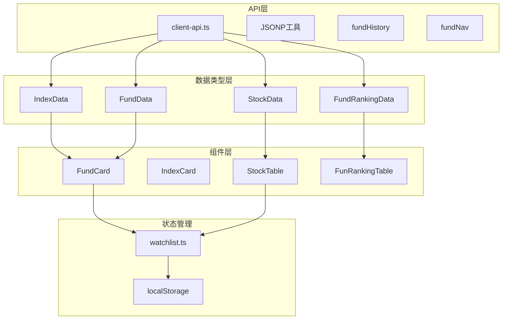
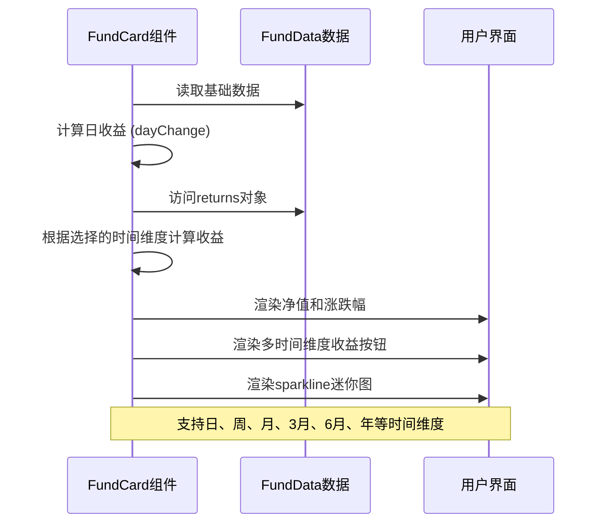
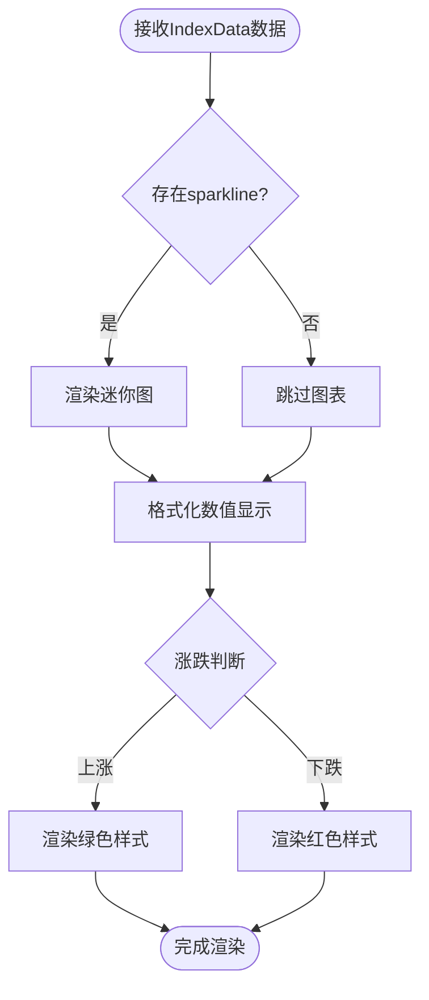
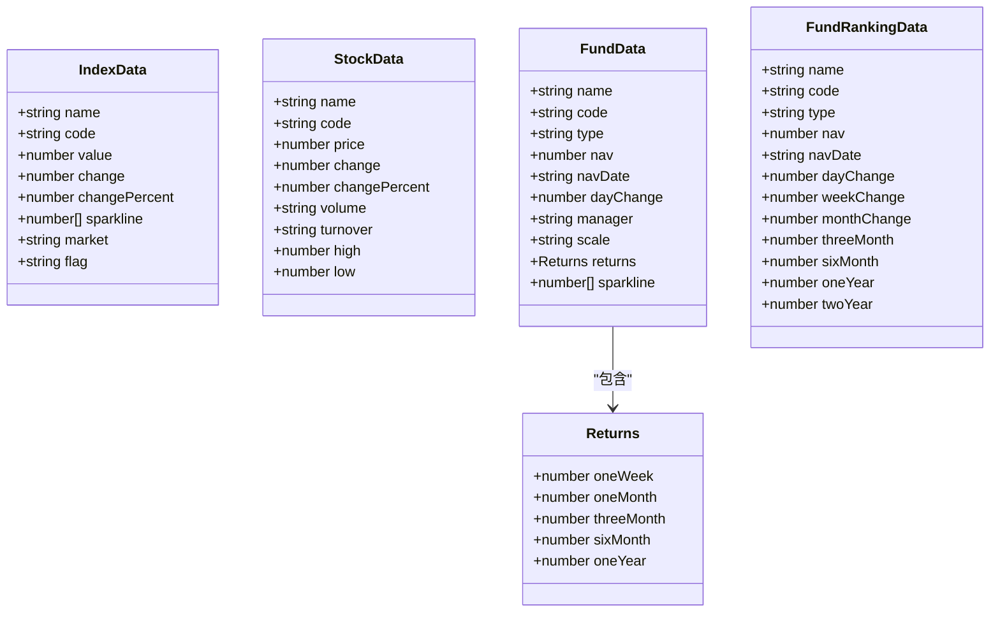
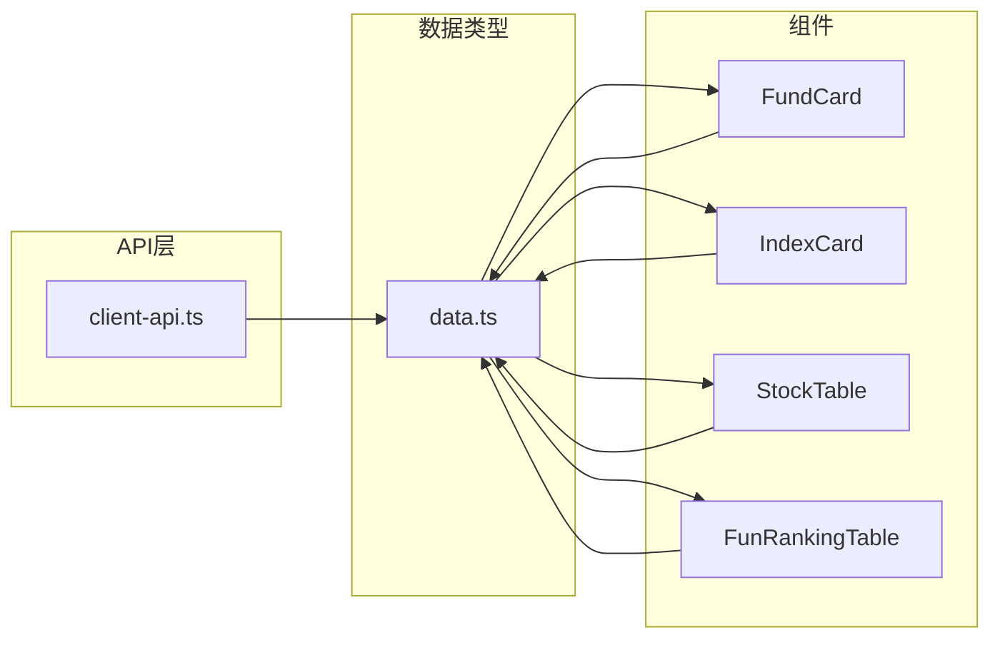

# 数据类型定义

<cite>
**本文档引用的文件**
- [lib/data.ts](file://lib/data.ts)
- [lib/client-api.ts](file://lib/client-api.ts)
- [lib/watchlist.ts](file://lib/watchlist.ts)
- [components/FundCard.tsx](file://components/FundCard.tsx)
- [components/IndexCard.tsx](file://components/IndexCard.tsx)
- [components/StockTable.tsx](file://components/StockTable.tsx)
- [components/FundRankingTable.tsx](file://components/FundRankingTable.tsx)
- [README.md](file://README.md)
</cite>

## 目录
1. [简介](#简介)
2. [项目结构](#项目结构)
3. [核心数据类型](#核心数据类型)
4. [架构概览](#架构概览)
5. [详细组件分析](#详细组件分析)
6. [依赖关系分析](#依赖关系分析)
7. [性能考虑](#性能考虑)
8. [故障排除指南](#故障排除指南)
9. [结论](#结论)

## 简介

本项目是一个基于 Next.js 的金融数据展示应用，专注于实时展示全球指数、热门股票和基金净值信息。本文档详细解析了数据类型定义系统，包括 IndexData、StockData、FundData 和 FundRankingData 等核心数据接口，以及它们之间的关系和使用方式。

该应用通过 JSONP 方式从多个金融数据源获取实时数据，并使用 TypeScript 提供完整的类型安全保障。数据类型设计遵循金融数据的特点，确保数值精度和格式一致性。

## 项目结构

项目采用模块化的文件组织方式，核心数据类型定义位于 lib 目录下的 data.ts 文件中，配合客户端 API 和组件使用。

```mermaid
graph TB
subgraph "数据层"
DT[lib/data.ts<br/>数据类型定义]
WL[lib/watchlist.ts<br/>自选列表管理]
end
subgraph "API层"
CA[lib/client-api.ts<br/>JSONP客户端]
end
subgraph "视图层"
FC[components/FundCard.tsx<br/>基金卡片组件]
IC[components/IndexCard.tsx<br/>指数卡片组件]
ST[components/StockTable.tsx<br/>股票表格组件]
FR[components/FundRankingTable.tsx<br/>基金排行组件]
end
DT --> FC
DT --> IC
DT --> ST
DT --> FR
CA --> DT
WL --> FC
WL --> ST
```

**图表来源**
- [lib/data.ts:1-255](file://lib/data.ts#L1-L255)
- [lib/client-api.ts:1-596](file://lib/client-api.ts#L1-L596)
- [lib/watchlist.ts:1-89](file://lib/watchlist.ts#L1-L89)

**章节来源**
- [README.md:132-161](file://README.md#L132-L161)

## 核心数据类型

### IndexData 接口

IndexData 用于表示全球主要指数的实时数据，包含以下字段：

| 字段名 | 类型 | 单位 | 取值范围 | 描述 |
|--------|------|------|----------|------|
| name | string | - | 任意字符串 | 指数名称（如：上证指数、恒生指数） |
| code | string | - | 6-10位字符 | 指数代码（如：000001.SH、HSI） |
| value | number | - | 0+ | 当前指数点位值 |
| change | number | - | 任意数值 | 涨跌点数 |
| changePercent | number | % | 任意数值 | 涨跌幅百分比 |
| sparkline | number[] | - | 数值数组 | 15日点位历史数据序列 |
| market | string | - | CN/HK/US/EU/KR/JP/OTHER | 市场代码 |
| flag | string | - | Unicode表情符号 | 地区旗帜标识 |

### StockData 接口

StockData 用于表示股票的实时行情数据：

| 字段名 | 类型 | 单位 | 取值范围 | 描述 |
|--------|------|------|----------|------|
| name | string | - | 任意字符串 | 股票名称（如：贵州茅台） |
| code | string | - | 6位数字 | 股票代码（如：600519） |
| price | number | 元 | 0+ | 当前股价 |
| change | number | 元 | 任意数值 | 涨跌额 |
| changePercent | number | % | 任意数值 | 涨跌幅百分比 |
| volume | string | 手/万手/亿 | 格式化字符串 | 成交量（格式化显示） |
| turnover | string | 元/万/亿 | 格式化字符串 | 成交额（格式化显示） |
| high | number | 元 | 0+ | 当日最高价 |
| low | number | 元 | 0+ | 当日最低价 |

### FundData 接口

FundData 用于表示基金的详细信息，包含净值和历史表现数据：

| 字段名 | 类型 | 单位 | 取值范围 | 描述 |
|--------|------|------|----------|------|
| name | string | - | 任意字符串 | 基金名称（如：易方达蓝筹精选混合） |
| code | string | - | 6位数字 | 基金代码（如：005827） |
| type | string | - | 混合型/股票型/指数型/ETF/QDII/FOF/货币型/其他 | 基金类型 |
| nav | number | - | 0+ | 基金净值（保留4位小数） |
| navDate | string | YYYY-MM-DD | 日期格式 | 净值日期 |
| dayChange | number | % | 任意数值 | 当日涨跌幅 |
| manager | string | - | 可选 | 基金经理姓名 |
| scale | string | 元/亿 | 可选 | 基金规模（格式化显示） |
| returns | object | - | 可选 | 历史收益率 |
| sparkline | number[] | - | 可选 | 15日净值历史数据 |

returns 对象包含以下子字段：
- oneWeek: number (%)
- oneMonth: number (%)
- threeMonth: number (%)
- sixMonth: number (%)
- oneYear: number (%)

### FundRankingData 接口

FundRankingData 用于表示基金排行数据，展示不同时间维度的表现：

| 字段名 | 类型 | 单位 | 取值范围 | 描述 |
|--------|------|------|----------|------|
| name | string | - | 任意字符串 | 基金名称 |
| code | string | - | 6位数字 | 基金代码 |
| type | string | - | 基金类型分类 | 基金类型 |
| nav | number | - | 0+ | 基金净值 |
| navDate | string | YYYY-MM-DD | 日期格式 | 净值日期 |
| dayChange | number | % | 任意数值 | 当日涨跌幅 |
| weekChange | number | % | 任意数值 | 近1周涨跌幅 |
| monthChange | number | % | 任意数值 | 近1月涨跌幅 |
| threeMonth | number | % | 任意数值 | 近3月涨跌幅 |
| sixMonth | number | % | 任意数值 | 近6月涨跌幅 |
| oneYear | number | % | 任意数值 | 近1年涨跌幅 |
| twoYear | number | % | 任意数值 | 近2年涨跌幅 |

**章节来源**
- [lib/data.ts:1-255](file://lib/data.ts#L1-L255)

## 架构概览

项目采用分层架构设计，数据类型作为核心抽象层，向上支撑 API 层和视图层。

**图表来源**
- [lib/data.ts:1-255](file://lib/data.ts#L1-L255)
- [lib/client-api.ts:1-596](file://lib/client-api.ts#L1-L596)
- [lib/watchlist.ts:1-89](file://lib/watchlist.ts#L1-L89)

## 详细组件分析

### FundCard 组件数据处理流程

FundCard 组件展示了 FundData 类型数据的典型使用方式，包括多时间维度收益计算和可视化。

**图表来源**
- [components/FundCard.tsx:19-131](file://components/FundCard.tsx#L19-L131)
- [lib/data.ts:24-41](file://lib/data.ts#L24-L41)

### IndexCard 组件数据展示

IndexCard 组件演示了 IndexData 类型数据的简洁展示方式：

**图表来源**
- [components/IndexCard.tsx:5-52](file://components/IndexCard.tsx#L5-L52)
- [lib/data.ts:1-10](file://lib/data.ts#L1-L10)

### StockTable 组件数据排序逻辑

StockTable 组件展示了 StockData 类型数据的排序和格式化处理：

**图表来源**
- [components/StockTable.tsx:10-143](file://components/StockTable.tsx#L10-L143)
- [lib/data.ts:12-22](file://lib/data.ts#L12-L22)

### FundRankingTable 组件数据处理

FundRankingTable 组件展示了 FundRankingData 类型数据的复杂排序和格式化需求：

**图表来源**
- [components/FundRankingTable.tsx:10-190](file://components/FundRankingTable.tsx#L10-L190)
- [lib/data.ts:147-160](file://lib/data.ts#L147-L160)

## 依赖关系分析

### 数据类型依赖图

**图表来源**
- [lib/data.ts:1-255](file://lib/data.ts#L1-L255)

### 组件依赖关系

**图表来源**
- [lib/data.ts:1-255](file://lib/data.ts#L1-L255)
- [lib/client-api.ts:1-596](file://lib/client-api.ts#L1-L596)

**章节来源**
- [lib/data.ts:1-255](file://lib/data.ts#L1-L255)
- [lib/client-api.ts:1-596](file://lib/client-api.ts#L1-L596)

## 性能考虑

### 数据类型优化策略

1. **数值精度控制**：所有浮点数都经过适当的精度控制，避免不必要的内存占用
2. **可选字段设计**：使用可选字段减少不必要的数据传输和存储
3. **数组长度限制**：sparkline 数组限制在合理范围内（如15个点）
4. **格式化字符串**：成交量和成交额使用格式化字符串，减少计算开销

### 内存使用优化

- 使用基本数据类型而非复杂对象结构
- 合理使用可选字段避免空值存储
- 组件层面进行数据缓存和重用

## 故障排除指南

### 常见数据类型问题

1. **数值格式错误**
   - 症状：数值显示异常或计算错误
   - 解决方案：检查数据源返回格式，确保数值类型正确

2. **可选字段访问错误**
   - 症状：访问 undefined 字段导致运行时错误
   - 解决方案：使用可选链操作符或类型守卫检查

3. **数组数据为空**
   - 症状：sparkline 或 returns 数组为空
   - 解决方案：提供默认值或空数组检查

### 类型安全最佳实践

1. **严格类型检查**：始终使用 TypeScript 编译器进行类型检查
2. **接口完整性**：确保所有必需字段都得到实现
3. **可选字段处理**：正确处理可选字段的 null/undefined 情况
4. **枚举值验证**：对有限枚举值进行验证和转换

**章节来源**
- [lib/client-api.ts:154-199](file://lib/client-api.ts#L154-L199)
- [lib/client-api.ts:203-240](file://lib/client-api.ts#L203-L240)

## 结论

本项目的数据类型定义系统设计精良，充分考虑了金融数据的特点和实际使用场景。通过清晰的接口定义、合理的数据结构设计和完善的类型安全保障，为整个应用提供了稳定可靠的数据基础。

核心优势包括：
- **类型安全**：完整的 TypeScript 类型定义确保编译时错误检测
- **数据完整性**：严格的字段定义和验证机制保证数据质量
- **扩展性**：灵活的接口设计支持未来功能扩展
- **性能优化**：合理的数据结构和格式化策略提升用户体验

建议在实际使用中：
1. 始终进行数据验证和类型检查
2. 合理处理可选字段和边界情况
3. 注意数值精度和格式化的一致性
4. 在组件层面做好数据缓存和性能优化