# 数据类型定义

<cite>
**本文档引用的文件**
- [lib/data.ts](file://lib/data.ts)
- [lib/client-api.ts](file://lib/client-api.ts)
- [lib/watchlist.ts](file://lib/watchlist.ts)
- [components/DailyMarketAnalysis.tsx](file://components/DailyMarketAnalysis.tsx)
- [components/MarketOverview.tsx](file://components/MarketOverview.tsx)
- [components/SectorRankingTable.tsx](file://components/SectorRankingTable.tsx)
- [components/CapitalFlowTable.tsx](file://components/CapitalFlowTable.tsx)
- [components/FundCard.tsx](file://components/FundCard.tsx)
- [components/IndexCard.tsx](file://components/IndexCard.tsx)
- [components/StockTable.tsx](file://components/StockTable.tsx)
- [components/FundRankingTable.tsx](file://components/FundRankingTable.tsx)
- [README.md](file://README.md)
</cite>

## 更新摘要
**变更内容**
- 新增4个市场分析相关接口：MarketStatsData、SectorData、SectorCapitalFlowData、DailyAnalysisData
- 更新核心数据类型章节以包含新的金融分析数据结构
- 新增市场分析功能章节，详细说明4个新接口的用途和字段定义
- 更新架构概览以反映新的数据分析组件
- 新增市场分析组件使用示例和最佳实践

## 目录
1. [简介](#简介)
2. [项目结构](#项目结构)
3. [核心数据类型](#核心数据类型)
4. [市场分析数据类型](#市场分析数据类型)
5. [架构概览](#架构概览)
6. [详细组件分析](#详细组件分析)
7. [依赖关系分析](#依赖关系分析)
8. [性能考虑](#性能考虑)
9. [故障排除指南](#故障排除指南)
10. [结论](#结论)

## 简介

本项目是一个基于 Next.js 的金融数据展示应用，专注于实时展示全球指数、热门股票、基金净值信息以及市场分析数据。本文档详细解析了数据类型定义系统，包括原有的 IndexData、StockData、FundData、FundRankingData 等核心数据接口，以及新增的 MarketStatsData、SectorData、SectorCapitalFlowData、DailyAnalysisData 等市场分析数据接口，以及它们之间的关系和使用方式。

该应用通过 JSONP 方式从多个金融数据源获取实时数据，并使用 TypeScript 提供完整的类型安全保障。数据类型设计遵循金融数据的特点，确保数值精度和格式一致性，同时新增的市场分析功能为用户提供更全面的市场洞察。

## 项目结构

项目采用模块化的文件组织方式，核心数据类型定义位于 lib 目录下的 data.ts 文件中，配合客户端 API 和组件使用。新增的市场分析功能通过专门的组件和 API 接口实现。

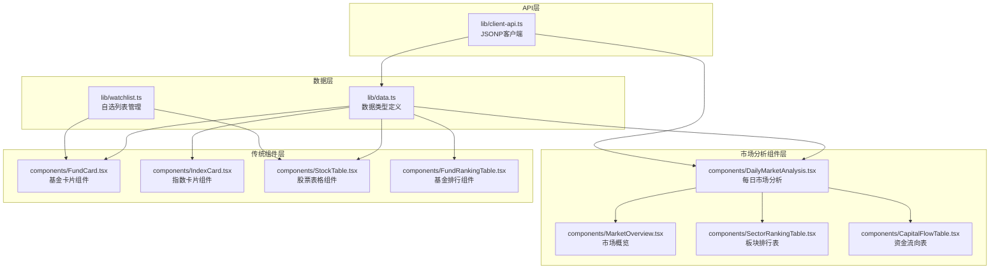

**图表来源**
- [lib/data.ts:1-37](file://lib/data.ts#L1-L37)
- [lib/client-api.ts:639-764](file://lib/client-api.ts#L639-L764)
- [components/DailyMarketAnalysis.tsx:1-53](file://components/DailyMarketAnalysis.tsx#L1-L53)

**章节来源**
- [README.md:132-161](file://README.md#L132-L161)

## 核心数据类型

### IndexData 接口

IndexData 用于表示全球主要指数的实时数据，包含以下字段：

| 字段名 | 类型 | 单位 | 取值范围 | 描述 |
|--------|------|------|----------|------|
| name | string | - | 任意字符串 | 指数名称（如：上证指数、恒生指数） |
| code | string | - | 6-10位字符 | 指数代码（如：000001.SH、HSI） |
| value | number | - | 0+ | 当前指数点位值 |
| change | number | - | 任意数值 | 涨跌点数 |
| changePercent | number | % | 任意数值 | 涨跌幅百分比 |
| sparkline | number[] | - | 数值数组 | 15日点位历史数据序列 |
| market | string | - | CN/HK/US/EU/KR/JP/OTHER | 市场代码 |
| flag | string | - | Unicode表情符号 | 地区旗帜标识 |

### StockData 接口

StockData 用于表示股票的实时行情数据：

| 字段名 | 类型 | 单位 | 取值范围 | 描述 |
|--------|------|------|----------|------|
| name | string | - | 任意字符串 | 股票名称（如：贵州茅台） |
| code | string | - | 6位数字 | 股票代码（如：600519） |
| price | number | 元 | 0+ | 当前股价 |
| change | number | 元 | 任意数值 | 涨跌额 |
| changePercent | number | % | 任意数值 | 涨跌幅百分比 |
| volume | string | 手/万手/亿 | 格式化字符串 | 成交量（格式化显示） |
| turnover | string | 元/万/亿 | 格式化字符串 | 成交额（格式化显示） |
| high | number | 元 | 0+ | 当日最高价 |
| low | number | 元 | 0+ | 当日最低价 |

### FundData 接口

FundData 用于表示基金的详细信息，包含净值和历史表现数据：

| 字段名 | 类型 | 单位 | 取值范围 | 描述 |
|--------|------|------|----------|------|
| name | string | - | 任意字符串 | 基金名称（如：易方达蓝筹精选混合） |
| code | string | - | 6位数字 | 基金代码（如：005827） |
| type | string | - | 混合型/股票型/指数型/ETF/QDII/FOF/货币型/其他 | 基金类型 |
| nav | number | - | 0+ | 基金净值（保留4位小数） |
| navDate | string | YYYY-MM-DD | 日期格式 | 净值日期 |
| dayChange | number | % | 任意数值 | 当日涨跌幅 |
| manager | string | - | 可选 | 基金经理姓名 |
| scale | string | 元/亿 | 可选 | 基金规模（格式化显示） |
| returns | object | - | 可选 | 历史收益率 |
| sparkline | number[] | - | 可选 | 15日净值历史数据 |

returns 对象包含以下子字段：
- oneWeek: number (%)
- oneMonth: number (%)
- threeMonth: number (%)
- sixMonth: number (%)
- oneYear: number (%)

### FundRankingData 接口

FundRankingData 用于表示基金排行数据，展示不同时间维度的表现：

| 字段名 | 类型 | 单位 | 取值范围 | 描述 |
|--------|------|------|----------|------|
| name | string | - | 任意字符串 | 基金名称 |
| code | string | - | 6位数字 | 基金代码 |
| type | string | - | 基金类型分类 | 基金类型 |
| nav | number | - | 0+ | 基金净值 |
| navDate | string | YYYY-MM-DD | 日期格式 | 净值日期 |
| dayChange | number | % | 任意数值 | 当日涨跌幅 |
| weekChange | number | % | 任意数值 | 近1周涨跌幅 |
| monthChange | number | % | 任意数值 | 近1月涨跌幅 |
| threeMonth | number | % | 任意数值 | 近3月涨跌幅 |
| sixMonth | number | % | 任意数值 | 近6月涨跌幅 |
| oneYear | number | % | 任意数值 | 近1年涨跌幅 |
| twoYear | number | % | 任意数值 | 近2年涨跌幅 |
| scale | string | 元/亿 | 可选 | 基金规模（格式化显示） |
| manager | string | - | 可选 | 基金经理姓名 |
| holdings | object[] | - | 可选 | 前十大持仓股 |

**章节来源**
- [lib/data.ts:39-300](file://lib/data.ts#L39-L300)

## 市场分析数据类型

### MarketStatsData 接口

MarketStatsData 用于表示市场的整体统计数据，包含涨跌家数、涨跌停数量和成交额等关键指标：

| 字段名 | 类型 | 单位 | 取值范围 | 描述 |
|--------|------|------|----------|------|
| advancers | number | 家 | 0+ | 上涨家数 |
| decliners | number | 家 | 0+ | 下跌家数 |
| unchanged | number | 家 | 0+ | 平盘家数 |
| limitUp | number | 家 | 0+ | 涨停家数 |
| limitDown | number | 家 | 0+ | 跌停家数 |
| totalTurnover | number | 元 | 0+ | 总成交额（原始数值） |

### SectorData 接口

SectorData 用于表示行业板块或概念板块的实时数据，包含涨跌幅、涨跌家数、领涨股等信息：

| 字段名 | 类型 | 单位 | 取值范围 | 描述 |
|--------|------|------|----------|------|
| name | string | - | 任意字符串 | 板块名称（如：白酒、新能源汽车） |
| code | string | - | 任意字符串 | 板块代码 |
| changePercent | number | % | 任意数值 | 板块涨跌幅 |
| change | number | 元 | 任意数值 | 板块涨跌额 |
| price | number | 元 | 0+ | 板块当前价格 |
| advancers | number | 家 | 0+ | 上涨个股数 |
| decliners | number | 家 | 0+ | 下跌个股数 |
| leadStock | string | - | 任意字符串 | 领涨个股名称 |
| leadStockCode | string | - | 任意字符串 | 领涨个股代码 |

### SectorCapitalFlowData 接口

SectorCapitalFlowData 用于表示板块的资金流向数据，包含主力净流入、净占比等关键指标：

| 字段名 | 类型 | 单位 | 取值范围 | 描述 |
|--------|------|------|----------|------|
| name | string | - | 任意字符串 | 板块名称 |
| code | string | - | 任意字符串 | 板块代码 |
| changePercent | number | % | 任意数值 | 板块涨跌幅 |
| mainNetInflow | number | 元 | 任意数值 | 主力净流入金额（原始数值） |
| mainNetRatio | number | % | 任意数值 | 主力净占比 |
| superLargeNet | number | 元 | 任意数值 | 超大单净流入/流出（原始数值） |
| largeNet | number | 元 | 任意数值 | 大单净流入/流出（原始数值） |

### DailyAnalysisData 接口

DailyAnalysisData 用于表示每日市场分析的聚合数据，包含市场统计、行业板块、概念板块和资金流向：

| 字段名 | 类型 | 描述 |
|--------|------|------|
| marketStats | MarketStatsData \| null | 市场统计数据 |
| industrySectors | SectorData[] | 行业板块排行数据 |
| conceptSectors | SectorData[] | 概念板块排行数据 |
| capitalFlow | SectorCapitalFlowData[] | 资金流向数据 |

**章节来源**
- [lib/data.ts:1-37](file://lib/data.ts#L1-L37)

## 架构概览

项目采用分层架构设计，数据类型作为核心抽象层，向上支撑 API 层、市场分析组件层和传统组件层。

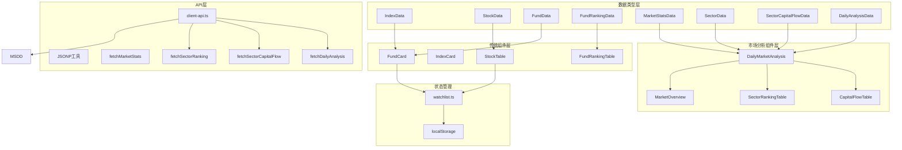

**图表来源**
- [lib/data.ts:1-37](file://lib/data.ts#L1-L37)
- [lib/client-api.ts:639-764](file://lib/client-api.ts#L639-L764)
- [components/DailyMarketAnalysis.tsx:1-53](file://components/DailyMarketAnalysis.tsx#L1-L53)

## 详细组件分析

### DailyMarketAnalysis 组件数据处理流程

DailyMarketAnalysis 组件展示了 DailyAnalysisData 类型数据的典型使用方式，整合了市场概览、板块排行和资金流向三个核心功能。

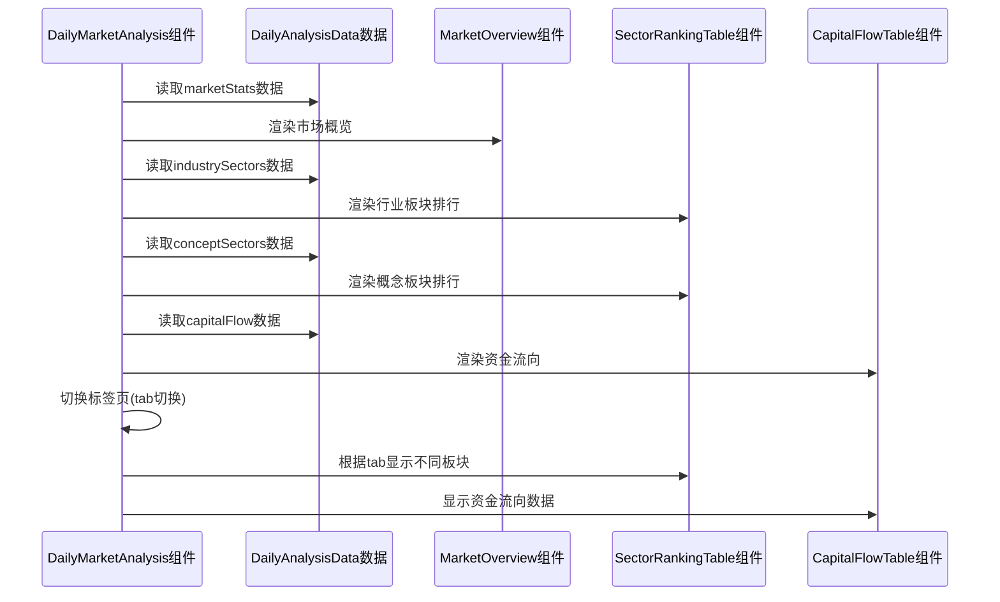

**图表来源**
- [components/DailyMarketAnalysis.tsx:12-53](file://components/DailyMarketAnalysis.tsx#L12-L53)
- [lib/data.ts:32-37](file://lib/data.ts#L32-L37)

### MarketOverview 组件数据展示

MarketOverview 组件演示了 MarketStatsData 类型数据的可视化展示，包括涨跌家数统计和成交额格式化。

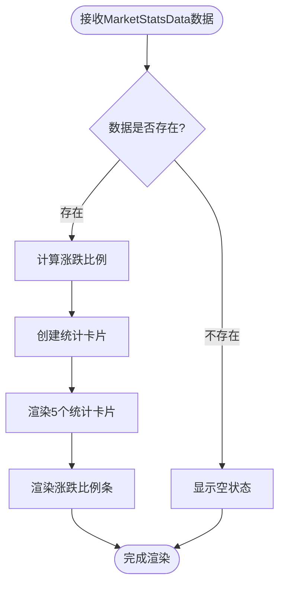

**图表来源**
- [components/MarketOverview.tsx:14-125](file://components/MarketOverview.tsx#L14-L125)
- [lib/data.ts:1-8](file://lib/data.ts#L1-L8)

### SectorRankingTable 组件数据排序逻辑

SectorRankingTable 组件展示了 SectorData 类型数据的排序和格式化处理，支持按涨跌幅排序。

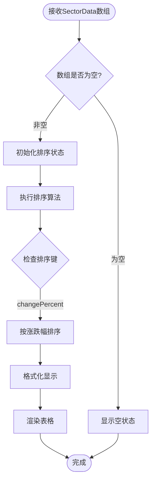

**图表来源**
- [components/SectorRankingTable.tsx:10-114](file://components/SectorRankingTable.tsx#L10-L114)
- [lib/data.ts:10-20](file://lib/data.ts#L10-L20)

### CapitalFlowTable 组件数据处理

CapitalFlowTable 组件展示了 SectorCapitalFlowData 类型数据的复杂排序和格式化需求，支持多种排序方式。

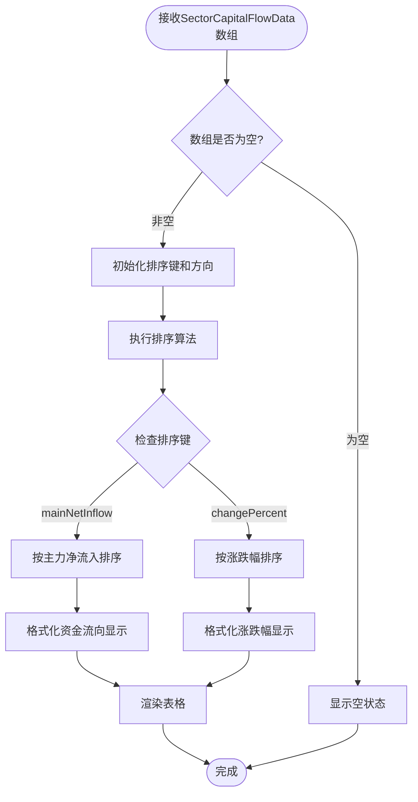

**图表来源**
- [components/CapitalFlowTable.tsx:17-159](file://components/CapitalFlowTable.tsx#L17-L159)
- [lib/data.ts:22-30](file://lib/data.ts#L22-L30)

### FundCard 组件数据处理流程

FundCard 组件展示了 FundData 类型数据的典型使用方式，包括多时间维度收益计算和可视化。

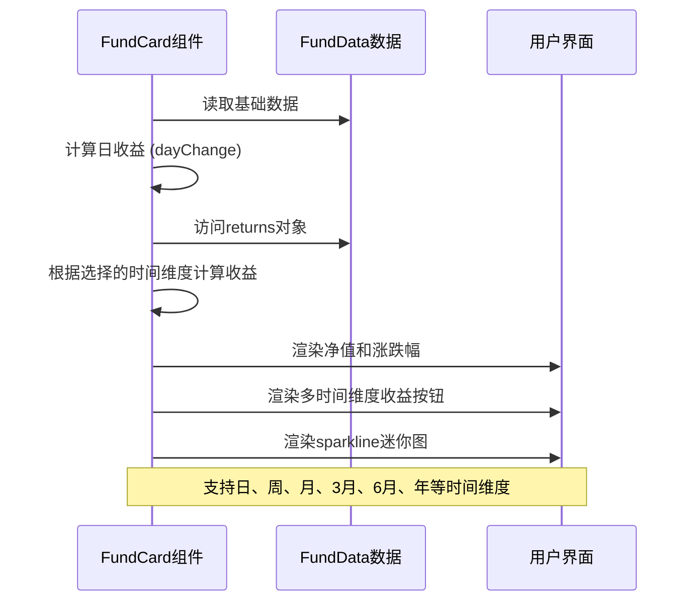

**图表来源**
- [components/FundCard.tsx:19-131](file://components/FundCard.tsx#L19-L131)
- [lib/data.ts:62-79](file://lib/data.ts#L62-L79)

### IndexCard 组件数据展示

IndexCard 组件演示了 IndexData 类型数据的简洁展示方式：

**图表来源**
- [components/IndexCard.tsx:5-52](file://components/IndexCard.tsx#L5-L52)
- [lib/data.ts:39-48](file://lib/data.ts#L39-L48)

### StockTable 组件数据排序逻辑

StockTable 组件展示了 StockData 类型数据的排序和格式化处理：

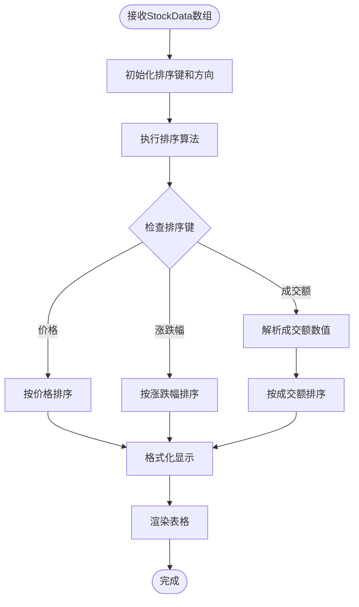

**图表来源**
- [components/StockTable.tsx:10-143](file://components/StockTable.tsx#L10-L143)
- [lib/data.ts:50-60](file://lib/data.ts#L50-L60)

### FundRankingTable 组件数据处理

FundRankingTable 组件展示了 FundRankingData 类型数据的复杂排序和格式化需求：

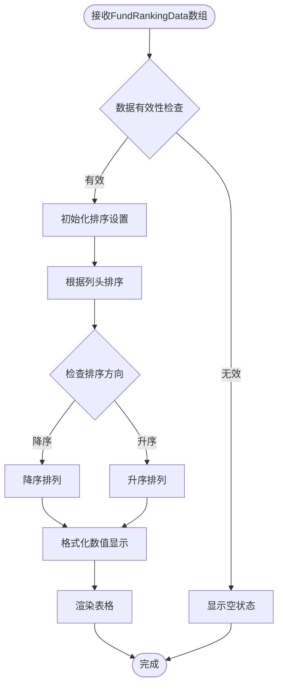

**图表来源**
- [components/FundRankingTable.tsx:10-190](file://components/FundRankingTable.tsx#L10-L190)
- [lib/data.ts:185-205](file://lib/data.ts#L185-L205)

## 依赖关系分析

### 数据类型依赖图

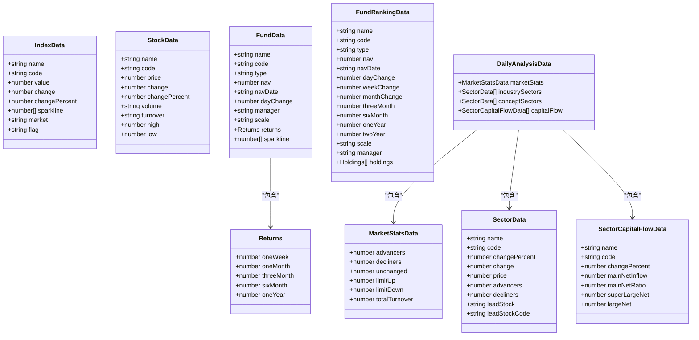

**图表来源**
- [lib/data.ts:1-300](file://lib/data.ts#L1-L300)

### 组件依赖关系

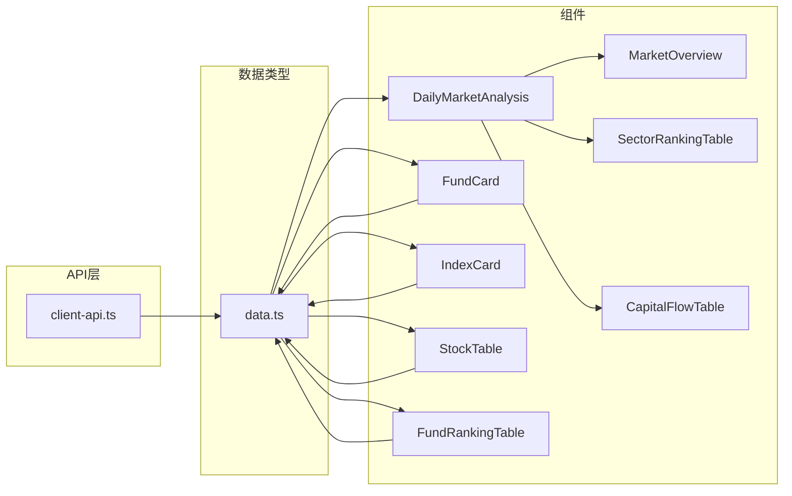

**图表来源**
- [lib/data.ts:1-300](file://lib/data.ts#L1-L300)
- [lib/client-api.ts:639-764](file://lib/client-api.ts#L639-L764)

**章节来源**
- [lib/data.ts:1-300](file://lib/data.ts#L1-L300)
- [lib/client-api.ts:639-764](file://lib/client-api.ts#L639-L764)

## 性能考虑

### 数据类型优化策略

1. **数值精度控制**：所有浮点数都经过适当的精度控制，避免不必要的内存占用
2. **可选字段设计**：使用可选字段减少不必要的数据传输和存储
3. **数组长度限制**：sparkline 数组限制在合理范围内（如15个点）
4. **格式化字符串**：成交量和成交额使用格式化字符串，减少计算开销
5. **市场分析数据缓存**：新增的市场分析数据具有较大的数据量，建议实现适当的缓存策略

### 内存使用优化

- 使用基本数据类型而非复杂对象结构
- 合理使用可选字段避免空值存储
- 组件层面进行数据缓存和重用
- 市场分析组件中实现虚拟滚动以处理大量数据

## 故障排除指南

### 常见数据类型问题

1. **数值格式错误**
   - 症状：数值显示异常或计算错误
   - 解决方案：检查数据源返回格式，确保数值类型正确

2. **可选字段访问错误**
   - 症状：访问 undefined 字段导致运行时错误
   - 解决方案：使用可选链操作符或类型守卫检查

3. **数组数据为空**
   - 症状：sparkline 或 returns 数组为空
   - 解决方案：提供默认值或空数组检查

4. **市场分析数据加载失败**
   - 症状：市场概览或板块排行显示空白
   - 解决方案：检查 API 请求状态，实现适当的错误处理和重试机制

### 类型安全最佳实践

1. **严格类型检查**：始终使用 TypeScript 编译器进行类型检查
2. **接口完整性**：确保所有必需字段都得到实现
3. **可选字段处理**：正确处理可选字段的 null/undefined 情况
4. **枚举值验证**：对有限枚举值进行验证和转换
5. **市场分析数据验证**：对新增的市场分析接口进行严格的输入验证

**章节来源**
- [lib/client-api.ts:640-695](file://lib/client-api.ts#L640-L695)
- [lib/client-api.ts:697-748](file://lib/client-api.ts#L697-L748)

## 结论

本项目的数据类型定义系统设计精良，充分考虑了金融数据的特点和实际使用场景。通过清晰的接口定义、合理的数据结构设计和完善的类型安全保障，为整个应用提供了稳定可靠的数据基础。

**新增的市场分析功能显著增强了应用的价值**：
- **MarketStatsData** 提供了全面的市场宏观统计数据
- **SectorData** 实现了行业和概念板块的实时排行
- **SectorCapitalFlowData** 展示了资金流向的深度分析
- **DailyAnalysisData** 将所有分析数据整合为统一的接口

核心优势包括：
- **类型安全**：完整的 TypeScript 类型定义确保编译时错误检测
- **数据完整性**：严格的字段定义和验证机制保证数据质量
- **扩展性**：灵活的接口设计支持未来功能扩展
- **性能优化**：合理的数据结构和格式化策略提升用户体验
- **市场洞察**：新增的分析功能为用户提供了更全面的市场视角

建议在实际使用中：
1. 始终进行数据验证和类型检查
2. 合理处理可选字段和边界情况
3. 注意数值精度和格式化的一致性
4. 在组件层面做好数据缓存和性能优化
5. 实现适当的错误处理和重试机制
6. 考虑实现数据更新频率控制和缓存策略