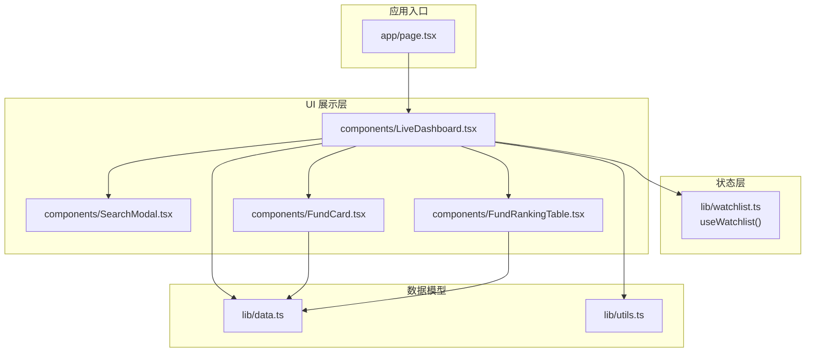
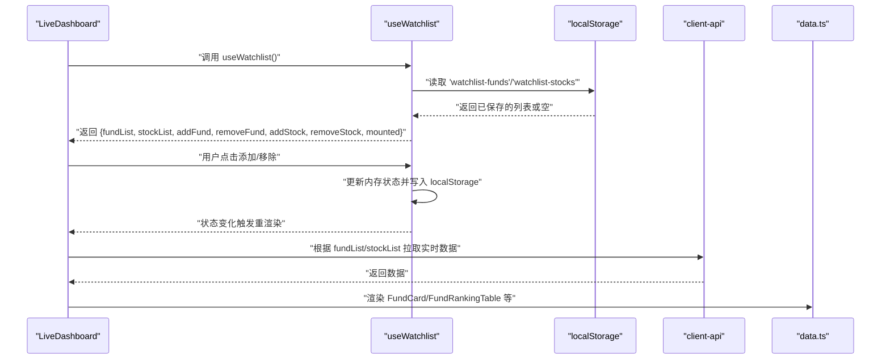
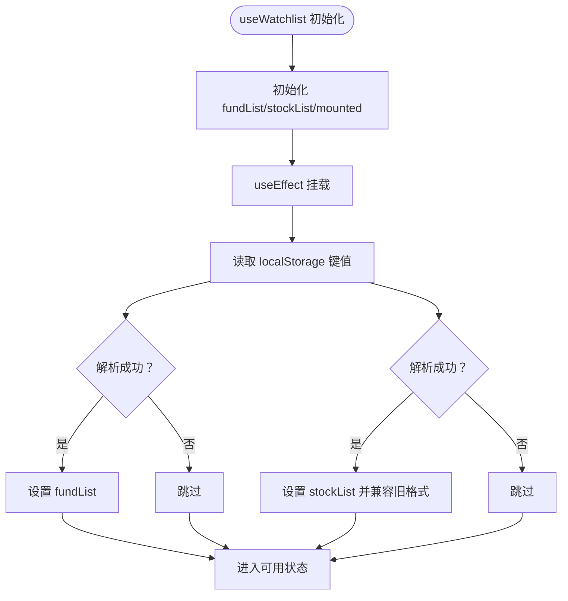
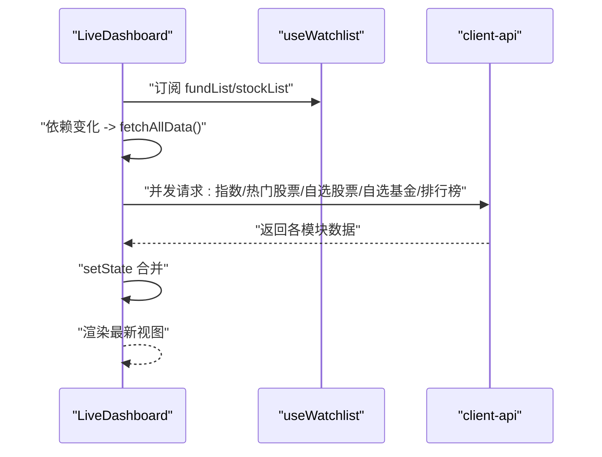
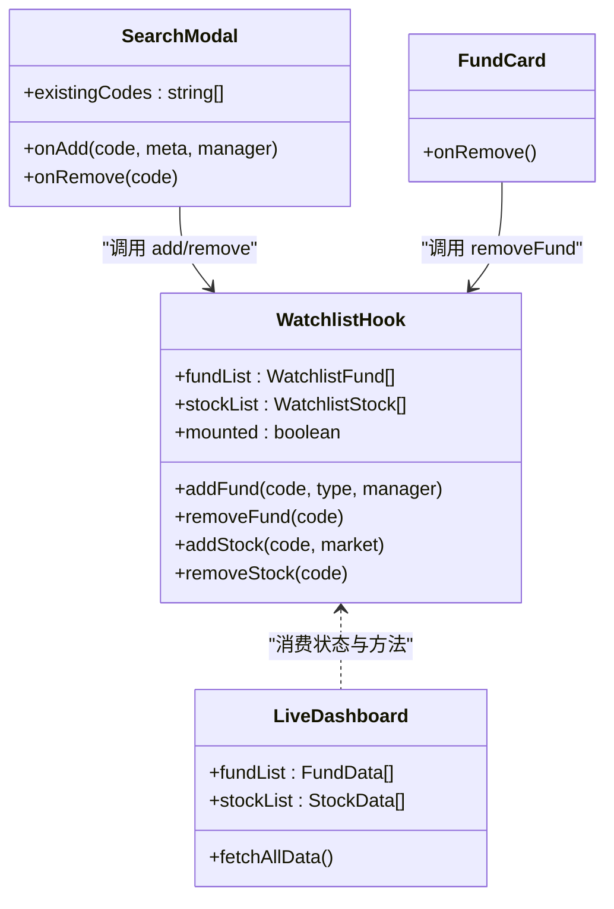
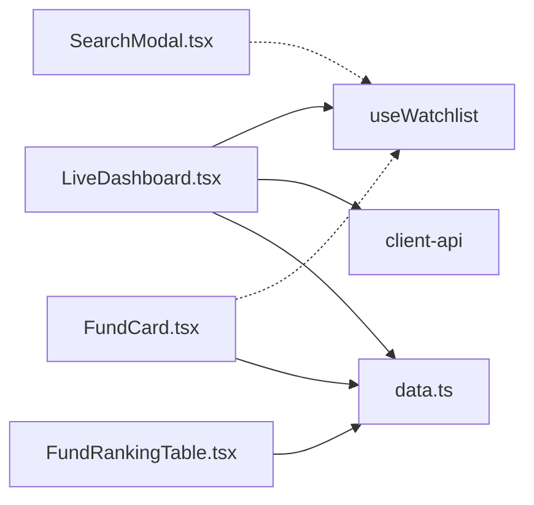

# 状态管理

<cite>
**本文引用的文件**
- [watchlist.ts](file://lib/watchlist.ts)
- [data.ts](file://lib/data.ts)
- [LiveDashboard.tsx](file://components/LiveDashboard.tsx)
- [SearchModal.tsx](file://components/SearchModal.tsx)
- [FundCard.tsx](file://components/FundCard.tsx)
- [FundRankingTable.tsx](file://components/FundRankingTable.tsx)
- [utils.ts](file://lib/utils.ts)
</cite>

## 目录
1. [简介](#简介)
2. [项目结构](#项目结构)
3. [核心组件](#核心组件)
4. [架构总览](#架构总览)
5. [详细组件分析](#详细组件分析)
6. [依赖关系分析](#依赖关系分析)
7. [性能考量](#性能考量)
8. [故障排查指南](#故障排查指南)
9. [结论](#结论)
10. [附录：最佳实践与扩展指南](#附录最佳实践与扩展指南)

## 简介
本文件围绕 lib/watchlist.ts 中的自定义 Hook useWatchlist 的设计与实现进行系统性解析，覆盖以下主题：
- 生命周期：状态初始化、本地存储读取与回填、挂载标记与副作用时机
- 数据持久化：localStorage 的键值约定、序列化/反序列化策略与兼容性处理
- 状态同步与更新：fundList 与 stockList 的增删改策略、批量拉取与联动刷新
- 用户自选列表管理：添加、删除、去重、排序（组件内）、批量操作（通过外部接口）
- 触发条件与更新策略：useEffect 挂载时机、依赖项与重渲染控制
- 组件间共享：LiveDashboard 如何消费 Hook 返回的状态与方法
- 最佳实践与性能优化：避免重复写入、批量化更新、防抖与去抖
- 扩展指南：如何在现有基础上新增字段、支持排序与分页、引入集中式状态管理

## 项目结构
本项目采用按功能域划分的目录组织，状态管理集中在 lib/watchlist.ts，UI 展示由 components 下的多个组件协作完成。Home 页面通过 LiveDashboard 集成展示全局指标、基金跟踪、股票行情与搜索等能力。

图表来源
- [watchlist.ts:1-89](file://lib/watchlist.ts#L1-L89)
- [LiveDashboard.tsx:1-375](file://components/LiveDashboard.tsx#L1-L375)
- [SearchModal.tsx:1-210](file://components/SearchModal.tsx#L1-L210)
- [FundCard.tsx:1-132](file://components/FundCard.tsx#L1-L132)
- [FundRankingTable.tsx:1-191](file://components/FundRankingTable.tsx#L1-L191)
- [data.ts:1-255](file://lib/data.ts#L1-L255)
- [utils.ts:1-7](file://lib/utils.ts#L1-L7)

章节来源
- [watchlist.ts:1-89](file://lib/watchlist.ts#L1-L89)
- [LiveDashboard.tsx:1-375](file://components/LiveDashboard.tsx#L1-L375)

## 核心组件
- 自定义 Hook：useWatchlist 提供两个独立列表的状态与方法：fundList（基金）与 stockList（股票），并暴露 mounted 标记用于控制副作用执行时机。
- 数据模型：Fund 与 Stock 的 Watchlist 条目结构在 Hook 内部定义；真实行情数据结构在 data.ts 中定义，二者通过 code 关联。
- UI 协作：LiveDashboard 作为容器组件，消费 useWatchlist 的状态与方法，驱动数据拉取、Tab 切换与搜索弹窗；SearchModal 基于现有列表决定“添加/移除”按钮状态；FundCard/FundRankingTable 负责展示与交互。

章节来源
- [watchlist.ts:5-26](file://lib/watchlist.ts#L5-L26)
- [data.ts:24-41](file://lib/data.ts#L24-L41)
- [LiveDashboard.tsx:39-41](file://components/LiveDashboard.tsx#L39-L41)

## 架构总览
useWatchlist 的职责是“本地持久化的用户自选列表”，其与 UI 的交互路径如下：

图表来源
- [watchlist.ts:28-87](file://lib/watchlist.ts#L28-L87)
- [LiveDashboard.tsx:39-41](file://components/LiveDashboard.tsx#L39-L41)
- [LiveDashboard.tsx:56-95](file://components/LiveDashboard.tsx#L56-L95)
- [data.ts:24-41](file://lib/data.ts#L24-L41)

## 详细组件分析

### useWatchlist Hook 设计与生命周期
- 状态初始化
  - fundList 默认值来自 DEFAULT_FUNDS，便于首次访问即有示例数据。
  - stockList 初始为空数组，等待用户添加。
  - mounted 用于标记组件已挂载，避免在服务端或首屏渲染时执行副作用。
- 本地存储读取与回填
  - 在首次挂载时读取 localStorage 中的两个键：watchlist-funds 与 watchlist-stocks。
  - 对旧格式（字符串数组）进行向后兼容处理：若解析为字符串数组，则转换为带 code 字段的对象数组。
  - 解析失败时静默忽略，保证健壮性。
- 增删改方法
  - addFund/addStock：先去重检查，再拼接新元素，最后写入 localStorage。
  - removeFund/removeStock：过滤掉目标 code，再写入 localStorage。
  - 方法均使用 useCallback 包裹，减少子组件重渲染。
- 返回值
  - 返回 fundList、stockList、四个增删方法与 mounted 标记，供上层组件直接消费。

图表来源
- [watchlist.ts:28-51](file://lib/watchlist.ts#L28-L51)
- [watchlist.ts:36-47](file://lib/watchlist.ts#L36-L47)

章节来源
- [watchlist.ts:28-87](file://lib/watchlist.ts#L28-L87)

### 状态同步与更新机制
- 依赖与刷新
  - LiveDashboard 将 fundList 与 stockList 作为 fetchAllData 的依赖，当用户增删自选时，列表变化会触发重新拉取数据。
  - mounted 作为 useEffect 的依赖，确保只在客户端挂载后执行一次本地存储读取。
- 批量拉取
  - 使用 Promise.allSettled 并行拉取指数、热门股票、自选股票、自选基金与排行榜数据，提升整体响应速度。
- 数据回填
  - 当自选列表为空时，不发起对应接口请求，避免无效网络开销。

图表来源
- [LiveDashboard.tsx:56-95](file://components/LiveDashboard.tsx#L56-L95)
- [LiveDashboard.tsx:97-102](file://components/LiveDashboard.tsx#L97-L102)

章节来源
- [LiveDashboard.tsx:56-95](file://components/LiveDashboard.tsx#L56-L95)
- [LiveDashboard.tsx:97-102](file://components/LiveDashboard.tsx#L97-L102)

### 用户自选列表管理逻辑
- 基金管理
  - 添加：addFund 接收 code、type、manager，去重后写入 localStorage。
  - 删除：removeFund 过滤后写入 localStorage。
  - 展示：FundCard 支持移除按钮回调，LiveDashboard 在基金卡片上绑定 removeFund。
- 股票管理
  - 添加：addStock 接收 code、market，去重后写入 localStorage。
  - 删除：removeStock 过滤后写入 localStorage。
  - 展示：StockTable 在“我的自选”Tab 下显示，并支持移除按钮回调。
- 搜索与批量操作
  - SearchModal 根据当前类型（fund/stock）决定 onAdd/onRemove 的行为，并传入 existingCodes 以控制按钮状态。
  - LiveDashboard 将当前列表映射为 existingCodes，从而在搜索结果中显示“已添加”。

图表来源
- [watchlist.ts:28-87](file://lib/watchlist.ts#L28-L87)
- [LiveDashboard.tsx:39-41](file://components/LiveDashboard.tsx#L39-L41)
- [LiveDashboard.tsx:281-296](file://components/LiveDashboard.tsx#L281-L296)
- [FundCard.tsx:19-41](file://components/FundCard.tsx#L19-L41)

章节来源
- [LiveDashboard.tsx:177-203](file://components/LiveDashboard.tsx#L177-L203)
- [LiveDashboard.tsx:264-275](file://components/LiveDashboard.tsx#L264-L275)
- [LiveDashboard.tsx:281-296](file://components/LiveDashboard.tsx#L281-L296)
- [FundCard.tsx:19-41](file://components/FundCard.tsx#L19-L41)

### localStorage 使用模式与序列化/反序列化
- 键名约定
  - 基金列表键：watchlist-funds
  - 股票列表键：watchlist-stocks
- 序列化/反序列化
  - 写入：所有状态在变更后立即 JSON.stringify 写入 localStorage。
  - 读取：初次挂载时 JSON.parse 读取；若解析失败则忽略。
- 向后兼容
  - 股票列表旧格式为字符串数组，新格式为对象数组；解析后自动转换为新格式。
- 注意事项
  - localStorage 不适合存储大体量数据，建议限制条目数量或采用分页/分片策略。
  - 写入频繁可能影响主线程性能，可考虑节流或合并写入。

章节来源
- [watchlist.ts:16-17](file://lib/watchlist.ts#L16-L17)
- [watchlist.ts:36-47](file://lib/watchlist.ts#L36-L47)
- [watchlist.ts:57-83](file://lib/watchlist.ts#L57-L83)

### 触发条件与更新策略
- 挂载阶段
  - mounted 为 false 时不执行数据拉取；仅在客户端挂载后开始定时刷新。
- 列表变更
  - 增删操作会改变依赖，触发 fetchAllData 重新拉取数据。
- 定时刷新
  - 每 30 秒自动刷新一次，除非处于加载中状态。
- 组件内排序
  - FundRankingTable 在组件内部对数据进行排序，不影响持久化状态。

章节来源
- [watchlist.ts:33-51](file://lib/watchlist.ts#L33-L51)
- [LiveDashboard.tsx:97-102](file://components/LiveDashboard.tsx#L97-L102)
- [LiveDashboard.tsx:56-95](file://components/LiveDashboard.tsx#L56-L95)
- [FundRankingTable.tsx:22-35](file://components/FundRankingTable.tsx#L22-L35)

## 依赖关系分析
- 组件耦合
  - LiveDashboard 与 useWatchlist 强耦合：依赖其返回的状态与方法。
  - SearchModal 通过 props 与 useWatchlist 解耦：通过 onAdd/onRemove 回调与 Hook 交互。
  - FundCard 与 useWatchlist 解耦：通过 onRemove 回调移除。
- 外部依赖
  - client-api：提供指数、股票、基金与排行榜的数据接口。
  - data.ts：提供数据模型与示例数据，用于 Mock 与类型约束。

图表来源
- [LiveDashboard.tsx:39-41](file://components/LiveDashboard.tsx#L39-L41)
- [LiveDashboard.tsx:281-296](file://components/LiveDashboard.tsx#L281-L296)
- [FundCard.tsx:19-41](file://components/FundCard.tsx#L19-L41)
- [FundRankingTable.tsx:1-191](file://components/FundRankingTable.tsx#L1-L191)
- [data.ts:1-255](file://lib/data.ts#L1-L255)

章节来源
- [LiveDashboard.tsx:39-41](file://components/LiveDashboard.tsx#L39-L41)
- [LiveDashboard.tsx:281-296](file://components/LiveDashboard.tsx#L281-L296)
- [FundCard.tsx:19-41](file://components/FundCard.tsx#L19-L41)
- [FundRankingTable.tsx:1-191](file://components/FundRankingTable.tsx#L1-L191)

## 性能考量
- 写入频率控制
  - 当前实现每次增删都写入 localStorage，建议在高频场景下引入节流/防抖或批量写入策略。
- 渲染优化
  - 使用 useCallback 包裹回调函数，减少子组件不必要的重渲染。
  - 对长列表使用虚拟滚动或分页，降低 DOM 节点数量。
- 网络请求
  - 使用 Promise.allSettled 并行拉取，避免阻塞；对空列表跳过请求，减少无效调用。
- 存储容量
  - 控制 watchlist 条目数量，避免 localStorage 达到上限导致写入失败。
- 计算复杂度
  - 组件内排序为 O(n log n)，建议仅在需要时触发；或在数据源侧预排序。

[本节为通用性能建议，无需特定文件来源]

## 故障排查指南
- 本地存储读取异常
  - 现象：列表未从 localStorage 加载。
  - 排查：确认键名是否正确、数据格式是否合法；检查浏览器隐私模式或禁用 localStorage 的情况。
- 向后兼容问题
  - 现象：旧格式字符串数组导致解析错误。
  - 排查：确认解析分支是否命中；必要时清理 localStorage 中的旧数据。
- 增删无效
  - 现象：点击添加/移除按钮无反应。
  - 排查：确认回调是否正确传递；检查 code 是否存在重复导致去重逻辑生效。
- 刷新不生效
  - 现象：定时刷新未触发。
  - 排查：确认 mounted 为 true；检查 isRefreshing 状态是否被置位；确认依赖项是否变化。

章节来源
- [watchlist.ts:36-50](file://lib/watchlist.ts#L36-L50)
- [watchlist.ts:53-85](file://lib/watchlist.ts#L53-L85)
- [LiveDashboard.tsx:97-102](file://components/LiveDashboard.tsx#L97-L102)

## 结论
useWatchlist 通过最小化的状态与方法集合，实现了用户自选列表的本地持久化与 UI 协同。其设计遵循“状态单一职责、副作用集中处理、方法幂等”的原则，配合 LiveDashboard 的批量数据拉取与定时刷新，形成了稳定可靠的前端状态管理方案。后续可在保持现有 API 不变的前提下，引入节流、分页、排序与集中式状态管理等优化手段，进一步提升性能与可维护性。

[本节为总结性内容，无需特定文件来源]

## 附录：最佳实践与扩展指南

### 最佳实践
- 保持方法幂等：增删方法内部已做去重与写入，避免重复调用造成多次写入。
- 合理使用 mounted：仅在客户端挂载后执行副作用，避免 SSR 期间访问 localStorage。
- 依赖最小化：将列表作为数据拉取的依赖，确保状态变化时及时更新视图。
- 组件解耦：通过回调与 props 与 Hook 交互，避免直接修改 Hook 内部状态。

### 性能优化建议
- 节流/防抖：对频繁的增删操作引入节流/防抖，减少 localStorage 写入次数。
- 批量写入：将多次变更合并为一次写入，降低 I/O 开销。
- 虚拟滚动：对长列表使用虚拟滚动，减少 DOM 节点数量。
- 分页与缓存：对大量数据采用分页与缓存策略，避免一次性加载。

### 扩展指南
- 新增字段
  - 在 WatchlistFund/WatchlistStock 接口中增加字段，同时在 addFund/addStock 中填充默认值。
  - 若涉及向后兼容，需在读取时进行字段迁移。
- 排序与筛选
  - 在 Hook 内暴露排序/筛选方法，或在 UI 层通过 props 传入排序规则。
- 集中式状态管理
  - 引入 Zustand 或 Redux Toolkit，将 watchlist 与全局状态统一管理，便于跨页面共享与调试。
- 数据校验
  - 在增删方法中加入参数校验与边界检查，提升健壮性。

### 使用示例（路径指引）
- 在组件中使用 Hook
  - 导入：[LiveDashboard.tsx:36](file://components/LiveDashboard.tsx#L36)
  - 解构使用：[LiveDashboard.tsx:40-41](file://components/LiveDashboard.tsx#L40-L41)
- 添加/移除基金
  - 调用 addFund/removeFund：[LiveDashboard.tsx:191](file://components/LiveDashboard.tsx#L191)、[LiveDashboard.tsx:289](file://components/LiveDashboard.tsx#L289)
- 添加/移除股票
  - 调用 addStock/removeStock：[LiveDashboard.tsx:267](file://components/LiveDashboard.tsx#L267)、[LiveDashboard.tsx:290](file://components/LiveDashboard.tsx#L290)
- 搜索与批量操作
  - 传入 existingCodes 与回调：[LiveDashboard.tsx:285-296](file://components/LiveDashboard.tsx#L285-L296)

章节来源
- [LiveDashboard.tsx:36-41](file://components/LiveDashboard.tsx#L36-L41)
- [LiveDashboard.tsx:191](file://components/LiveDashboard.tsx#L191)
- [LiveDashboard.tsx:267](file://components/LiveDashboard.tsx#L267)
- [LiveDashboard.tsx:285-296](file://components/LiveDashboard.tsx#L285-L296)