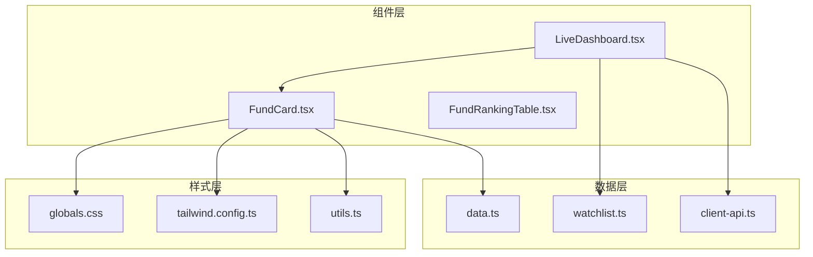
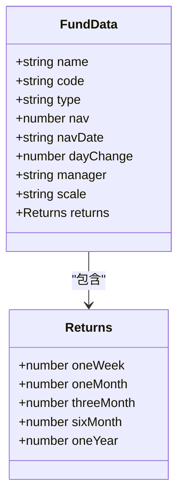
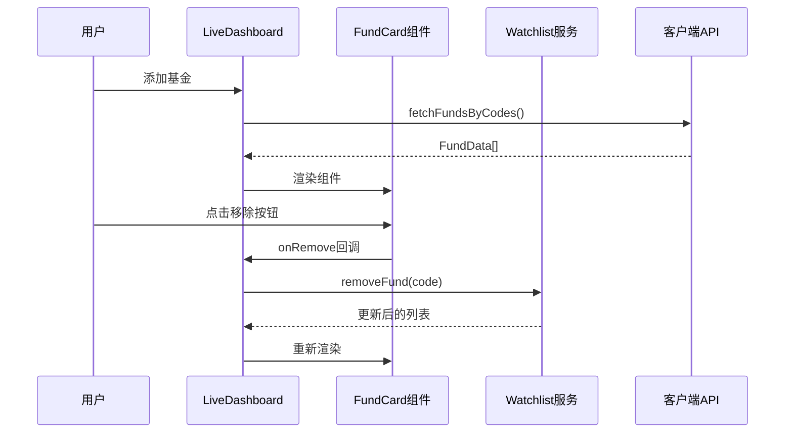
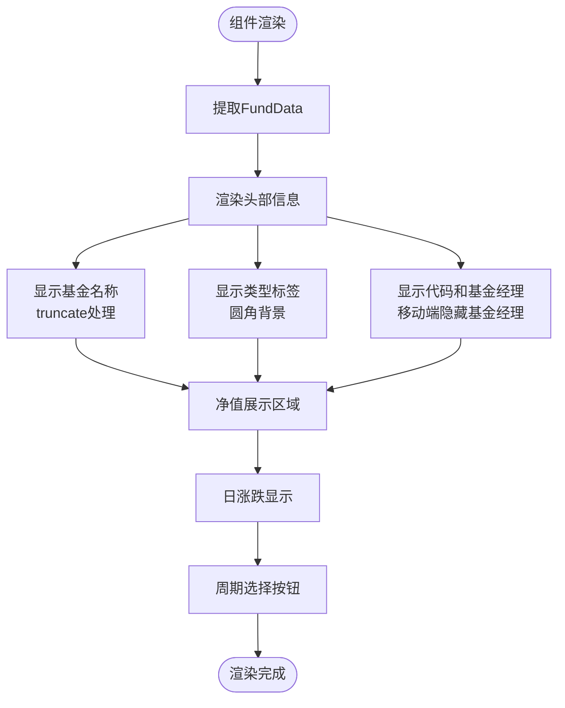
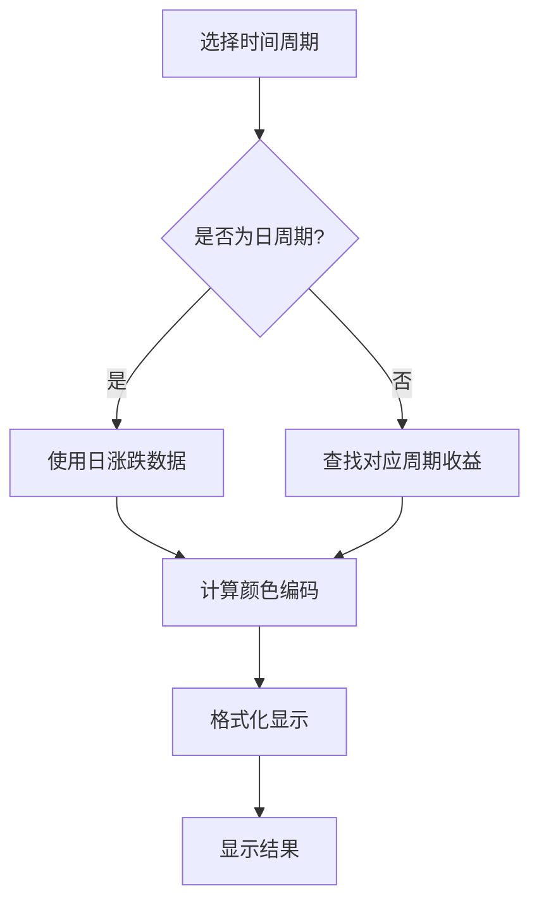
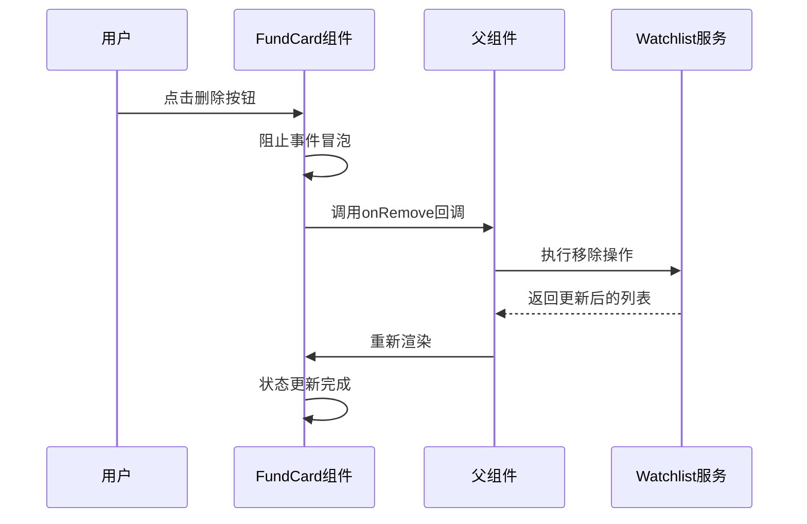
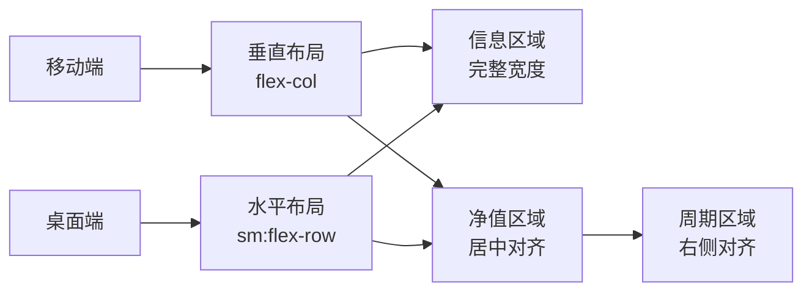
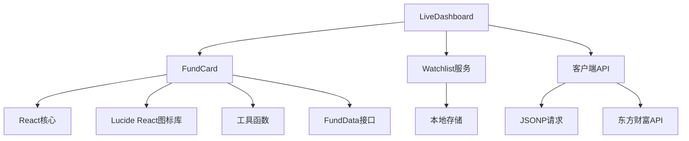

# FundCard 基金卡片组件

<cite>
**本文档引用的文件**
- [FundCard.tsx](file://components/FundCard.tsx)
- [data.ts](file://lib/data.ts)
- [watchlist.ts](file://lib/watchlist.ts)
- [client-api.ts](file://lib/client-api.ts)
- [LiveDashboard.tsx](file://components/LiveDashboard.tsx)
- [globals.css](file://app/globals.css)
- [utils.ts](file://lib/utils.ts)
- [tailwind.config.ts](file://tailwind.config.ts)
</cite>

## 更新摘要
**变更内容**
- 移除了sparkline可视化功能，简化了UI设计
- 优化了组件性能，减少了不必要的渲染开销
- 保持了核心的净值和涨跌信息展示功能
- 更新了组件的响应式布局设计

## 目录
1. [简介](#简介)
2. [项目结构](#项目结构)
3. [核心组件](#核心组件)
4. [架构概览](#架构概览)
5. [详细组件分析](#详细组件分析)
6. [依赖关系分析](#依赖关系分析)
7. [性能考虑](#性能考虑)
8. [故障排除指南](#故障排除指南)
9. [结论](#结论)

## 简介

FundCard 是一个专门用于展示基金信息的 React 组件，提供了专业的金融数据可视化功能。该组件不仅展示了基金的基本信息（名称、代码、类型），还包含了净值、日涨跌、历史收益等关键指标，并支持用户交互功能如移除操作。

**更新后** 组件经过重构，移除了sparkline可视化功能，专注于核心的净值和涨跌信息展示，提升了页面加载性能和用户体验。

该组件采用现代化的设计理念，使用 Tailwind CSS 进行样式管理，结合了响应式设计原则，确保在各种设备上都能提供优秀的用户体验。组件支持多种时间周期的收益展示，从日收益到年收益，为用户提供全面的投资分析视角。

## 项目结构

FundCard 组件位于项目的组件目录中，与相关的数据模型和工具函数共同构成了完整的基金跟踪系统。

**图表来源**
- [FundCard.tsx:1-104](file://components/FundCard.tsx#L1-L104)
- [LiveDashboard.tsx:1-406](file://components/LiveDashboard.tsx#L1-L406)
- [data.ts:24-41](file://lib/data.ts#L24-L41)

**章节来源**
- [FundCard.tsx:1-104](file://components/FundCard.tsx#L1-L104)
- [LiveDashboard.tsx:1-406](file://components/LiveDashboard.tsx#L1-L406)

## 核心组件

### FundData 数据模型

FundCard 组件基于严格的 TypeScript 接口定义，确保了数据的完整性和类型安全：

**图表来源**
- [data.ts:24-41](file://lib/data.ts#L24-L41)

### 组件接口设计

组件通过 props 接收数据和回调函数，实现了清晰的单向数据流：

- `data`: FundData 类型的基金数据对象
- `onRemove`: 可选的移除回调函数
- 内部状态：`period` - 当前选择的时间周期

**章节来源**
- [FundCard.tsx:19-25](file://components/FundCard.tsx#L19-L25)
- [data.ts:24-41](file://lib/data.ts#L24-L41)

## 架构概览

FundCard 组件在整个应用架构中扮演着重要的角色，它连接了数据层、业务逻辑层和用户界面层。

**图表来源**
- [LiveDashboard.tsx:186-203](file://components/LiveDashboard.tsx#L186-L203)
- [watchlist.ts:62-68](file://lib/watchlist.ts#L62-L68)
- [client-api.ts:462-495](file://lib/client-api.ts#L462-L495)

## 详细组件分析

### 基金信息展示逻辑

#### 基本信息区域

组件顶部显示基金的核心信息，包括名称、代码和类型标识：

**图表来源**
- [FundCard.tsx:43-56](file://components/FundCard.tsx#L43-L56)
- [FundCard.tsx:58-99](file://components/FundCard.tsx#L58-L99)

#### 净值和日涨跌格式化

净值和日涨跌是组件最重要的信息展示部分，采用了专业的金融数据格式化：

- **净值显示**：使用固定小数位数格式化，确保数字对齐
- **日涨跌显示**：根据涨跌情况使用不同的颜色编码
- **图标表示**：上涨使用 TrendingUp 图标，下跌使用 TrendingDown 图标

#### 周期收益计算机制

组件支持多种时间周期的收益展示，从日收益到年收益：

**图表来源**
- [FundCard.tsx:22-24](file://components/FundCard.tsx#L22-L24)
- [FundCard.tsx:68-89](file://components/FundCard.tsx#L68-L89)

### 移除功能实现机制

#### 删除按钮交互

移除功能通过绝对定位的删除按钮实现，具有以下特性：

- **悬停显示**：只有在鼠标悬停时才显示删除按钮
- **位置设计**：固定在卡片右上角，不影响主要内容
- **透明度动画**：使用过渡效果实现平滑显示/隐藏

#### 确认对话框机制

虽然组件本身没有内置的确认对话框，但通过回调函数实现了灵活的确认机制：

**图表来源**
- [FundCard.tsx:33-41](file://components/FundCard.tsx#L33-L41)
- [LiveDashboard.tsx:191](file://components/LiveDashboard.tsx#L191)

#### 状态更新流程

移除操作的状态更新遵循以下流程：

1. **事件处理**：阻止事件冒泡，避免触发父级点击事件
2. **回调调用**：调用传入的 onRemove 回调函数
3. **数据更新**：父组件更新 watchlist 状态
4. **重新渲染**：React 自动重新渲染组件树

**章节来源**
- [FundCard.tsx:33-41](file://components/FundCard.tsx#L33-L41)
- [LiveDashboard.tsx:188-193](file://components/LiveDashboard.tsx#L188-L193)

### 样式设计分析

#### 颜色编码系统

组件采用了统一的颜色编码系统来表示不同的数据状态：

- **成功颜色**：用于正值收益，表示上涨趋势
- **破坏性颜色**：用于负值收益，表示下跌趋势  
- **中性颜色**：用于文本和边框，保持视觉一致性

#### 字体层级设计

组件使用了精心设计的字体层级系统：

- **标题字体**：粗体，用于基金名称显示
- **标签字体**：较小字号，用于类型标识
- **数值字体**：等宽字体，确保数字对齐
- **辅助文本**：细小字号，用于代码和备注信息

#### 布局适配策略

组件实现了多层次的响应式布局：

**图表来源**
- [FundCard.tsx:28-31](file://components/FundCard.tsx#L28-L31)
- [FundCard.tsx:58-59](file://components/FundCard.tsx#L58-L59)

### 响应式设计实现

#### 断点策略

组件使用了 Tailwind CSS 的断点系统：

- **sm 屏幕**：最小宽度 640px，启用水平布局
- **默认布局**：移动优先，适应各种屏幕尺寸

#### 交互优化

- **触摸友好**：按钮大小适合手指点击
- **视觉反馈**：悬停状态提供清晰的视觉指示
- **无障碍支持**：提供适当的标题和语义化标记

**章节来源**
- [FundCard.tsx:101-127](file://components/FundCard.tsx#L101-L127)

## 依赖关系分析

### 组件间依赖关系

**图表来源**
- [FundCard.tsx:3-6](file://components/FundCard.tsx#L3-L6)
- [LiveDashboard.tsx:39-41](file://components/LiveDashboard.tsx#L39-L41)

### 外部依赖分析

组件依赖于多个外部库和服务：

- **React Hooks**：useState 提供组件状态管理
- **Lucide Icons**：提供专业的图标资源
- **Tailwind CSS**：提供实用的样式类
- **本地存储**：持久化用户偏好设置

**章节来源**
- [FundCard.tsx:1-6](file://components/FundCard.tsx#L1-L6)
- [watchlist.ts:1-3](file://lib/watchlist.ts#L1-L3)

## 性能考虑

### 渲染优化

**更新后** 组件经过重构，移除了sparkline可视化功能，显著提升了渲染性能：

- **移除条件渲染**：不再需要检查sparkline数据的存在性
- **简化DOM结构**：减少了SVG元素的渲染开销
- **状态最小化**：只维护必要的组件状态
- **事件委托**：通过回调函数减少事件处理开销

### 数据处理优化

- **缓存策略**：利用浏览器缓存和本地存储
- **批量更新**：通过父组件统一管理数据更新
- **防抖处理**：避免频繁的重新渲染

## 故障排除指南

### 常见问题及解决方案

#### 数据为空或未加载

**症状**：组件显示空白或加载状态
**解决方案**：
1. 检查父组件的数据传递
2. 验证 API 请求是否成功
3. 确认本地存储状态

#### 移除功能不工作

**症状**：点击删除按钮无反应
**解决方案**：
1. 确认 onRemove 回调函数正确传递
2. 检查父组件的移除逻辑
3. 验证事件冒泡是否被正确阻止

#### 样式显示异常

**症状**：组件样式错乱或颜色不正确
**解决方案**：
1. 检查 Tailwind CSS 配置
2. 验证 CSS 变量定义
3. 确认主题切换正常工作

**章节来源**
- [FundCard.tsx:35](file://components/FundCard.tsx#L35)
- [watchlist.ts:62-68](file://lib/watchlist.ts#L62-L68)

## 结论

**更新后** FundCard 组件是一个更加精简高效的金融数据展示组件，它成功地将复杂的投资数据以简洁直观的方式呈现给用户。组件的设计体现了以下几个关键优势：

1. **专业性**：采用金融行业的标准格式和颜色编码
2. **可用性**：提供直观的交互和响应式设计
3. **可维护性**：清晰的代码结构和类型安全
4. **性能优化**：移除sparkline功能后显著提升渲染性能
5. **扩展性**：灵活的接口设计支持功能扩展

该组件为整个基金跟踪系统奠定了坚实的基础，为用户提供了专业的投资数据分析工具。通过合理的架构设计和性能优化，确保了在实际应用中的稳定性和可靠性。