# FundRankingTable 基金排行组件

<cite>
**本文档引用的文件**
- [FundRankingTable.tsx](file://components/FundRankingTable.tsx)
- [data.ts](file://lib/data.ts)
- [utils.ts](file://lib/utils.ts)
- [LiveDashboard.tsx](file://components/LiveDashboard.tsx)
- [client-api.ts](file://lib/client-api.ts)
- [tailwind.config.ts](file://tailwind.config.ts)
- [card.tsx](file://components/ui/card.tsx)
- [button.tsx](file://components/ui/button.tsx)
- [page.tsx](file://app/page.tsx)
</cite>

## 目录
1. [简介](#简介)
2. [项目结构](#项目结构)
3. [核心组件](#核心组件)
4. [架构概览](#架构概览)
5. [详细组件分析](#详细组件分析)
6. [依赖关系分析](#依赖关系分析)
7. [性能考虑](#性能考虑)
8. [故障排除指南](#故障排除指南)
9. [结论](#结论)

## 简介

FundRankingTable 是一个专门用于展示基金排行榜的 React 组件，负责实时显示基金的排名、名称、涨跌幅等关键信息。该组件采用现代化的前端技术栈构建，集成了实时数据获取、动态排序、响应式设计和美观的视觉呈现。

该组件的核心功能包括：
- 实时基金排行榜数据展示
- 多维度涨跌幅排序（日、周、月、季度、半年、年度）
- 动态更新机制和用户交互
- 响应式布局设计
- 美观的颜色编码和视觉层次

## 项目结构

该项目采用基于功能的模块化组织方式，核心组件位于 `components` 目录下，数据类型定义在 `lib` 目录中，样式系统基于 Tailwind CSS。

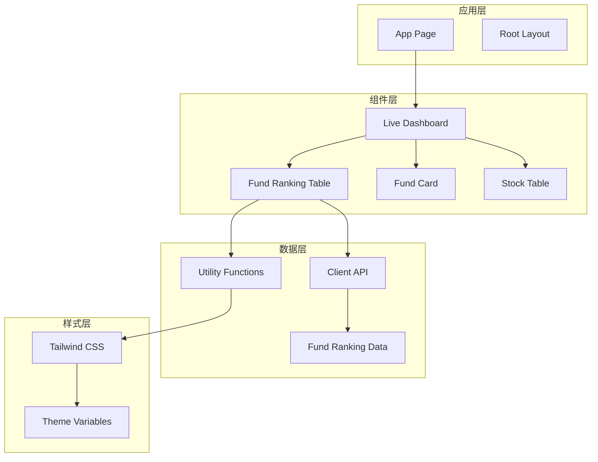

**图表来源**
- [page.tsx:10-23](file://app/page.tsx#L10-L23)
- [LiveDashboard.tsx:39-301](file://components/LiveDashboard.tsx#L39-L301)
- [FundRankingTable.tsx:10-191](file://components/FundRankingTable.tsx#L10-L191)

**章节来源**
- [page.tsx:1-24](file://app/page.tsx#L1-L24)
- [LiveDashboard.tsx:1-375](file://components/LiveDashboard.tsx#L1-L375)

## 核心组件

FundRankingTable 组件是整个应用的核心展示组件之一，它负责将复杂的基金数据转换为用户友好的表格形式。

### 主要特性

1. **实时数据展示**：从外部 API 获取最新的基金排行榜数据
2. **多维度排序**：支持按日、周、月、季度、半年、年度涨跌幅排序
3. **动态更新**：每30秒自动刷新，支持手动刷新
4. **响应式设计**：根据屏幕尺寸调整列的可见性
5. **视觉层次**：通过颜色和排版突出重要信息

### 数据结构

组件使用 `FundRankingData` 接口定义数据格式：

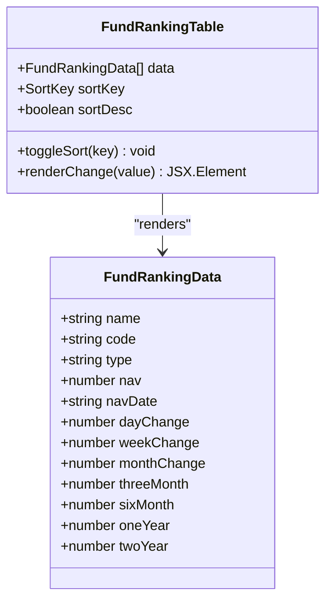

**图表来源**
- [data.ts:147-160](file://lib/data.ts#L147-L160)
- [FundRankingTable.tsx:8-12](file://components/FundRankingTable.tsx#L8-L12)

**章节来源**
- [FundRankingTable.tsx:10-191](file://components/FundRankingTable.tsx#L10-L191)
- [data.ts:147-160](file://lib/data.ts#L147-L160)

## 架构概览

FundRankingTable 组件在整个应用架构中扮演着重要的数据展示角色，它与数据获取层、状态管理层和 UI 层紧密协作。

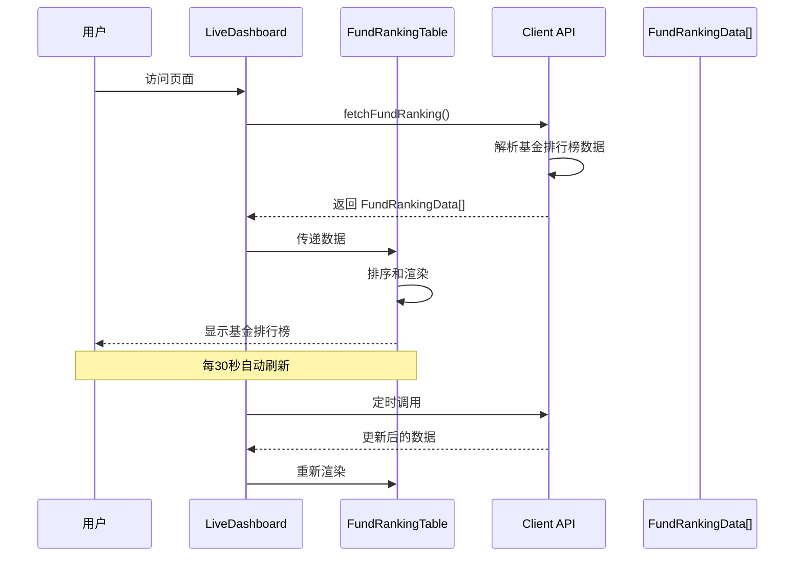

**图表来源**
- [LiveDashboard.tsx:56-102](file://components/LiveDashboard.tsx#L56-L102)
- [client-api.ts:527-595](file://lib/client-api.ts#L527-L595)
- [FundRankingTable.tsx:22-26](file://components/FundRankingTable.tsx#L22-L26)

### 数据流分析

组件的数据流遵循以下模式：
1. **数据获取**：通过 `fetchFundRanking()` API 获取最新数据
2. **数据处理**：在组件内部进行排序和格式化
3. **状态管理**：使用 React hooks 管理排序状态
4. **渲染输出**：将数据转换为用户友好的表格格式

**章节来源**
- [LiveDashboard.tsx:56-95](file://components/LiveDashboard.tsx#L56-L95)
- [client-api.ts:527-595](file://lib/client-api.ts#L527-L595)

## 详细组件分析

### 排序机制分析

FundRankingTable 的排序机制是其核心功能之一，支持多种时间维度的涨跌幅排序。

#### 排序键定义

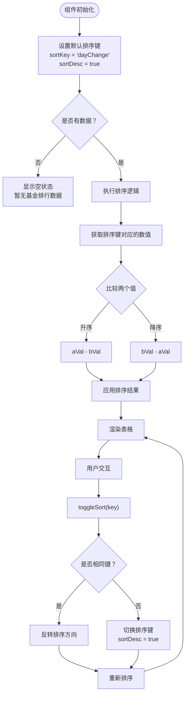

**图表来源**
- [FundRankingTable.tsx:22-35](file://components/FundRankingTable.tsx#L22-L35)

#### 排序算法实现

排序算法采用稳定的比较函数，确保数据的正确排列：

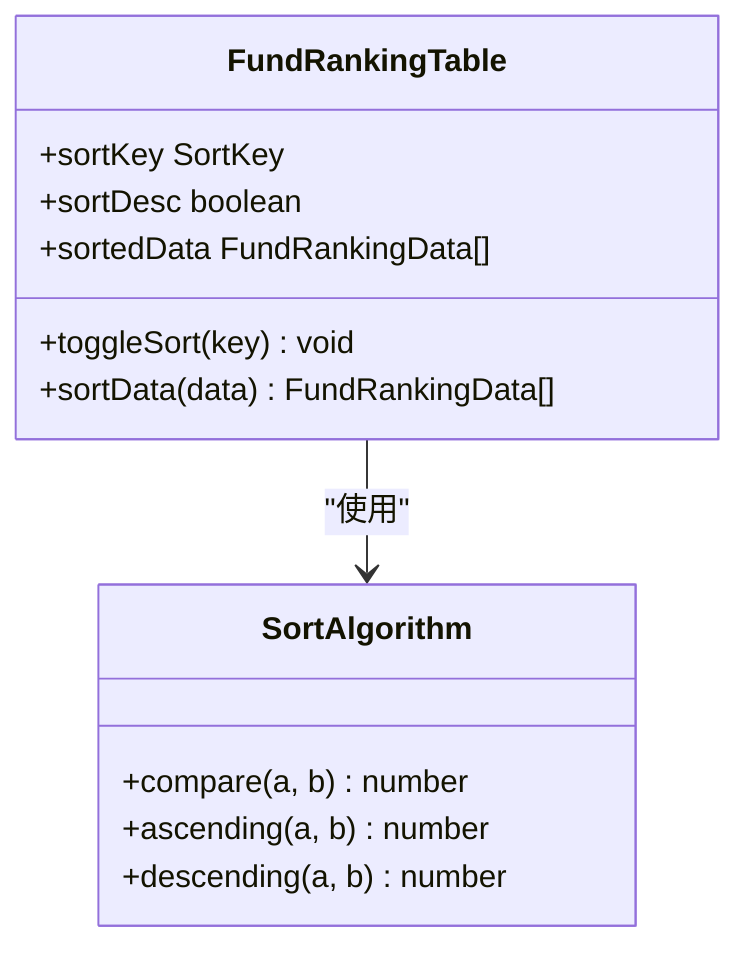

**图表来源**
- [FundRankingTable.tsx:22-26](file://components/FundRankingTable.tsx#L22-L26)

**章节来源**
- [FundRankingTable.tsx:22-35](file://components/FundRankingTable.tsx#L22-L35)

### 数据展示逻辑

组件负责将原始的基金数据转换为用户友好的表格格式，包含以下关键元素：

#### 排名显示逻辑

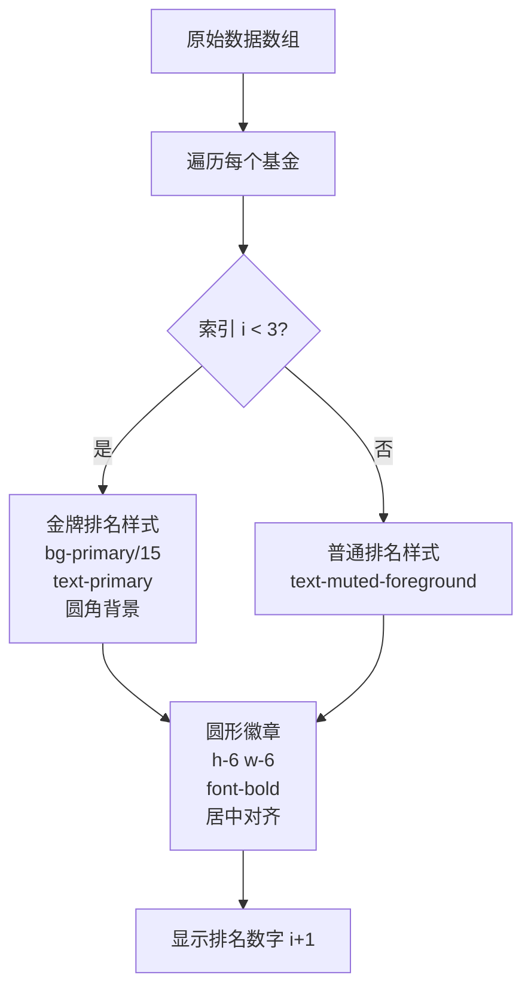

**图表来源**
- [FundRankingTable.tsx:140-151](file://components/FundRankingTable.tsx#L140-L151)

#### 涨跌幅格式化

涨跌幅的格式化逻辑确保了数据的一致性和可读性：

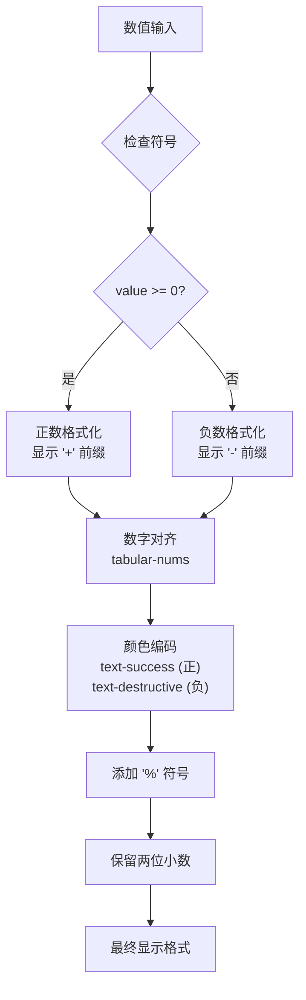

**图表来源**
- [FundRankingTable.tsx:46-59](file://components/FundRankingTable.tsx#L46-L59)

**章节来源**
- [FundRankingTable.tsx:46-59](file://components/FundRankingTable.tsx#L46-L59)

### 样式设计分析

组件采用了精心设计的样式系统，确保在不同设备上都有良好的用户体验。

#### 视觉层次设计

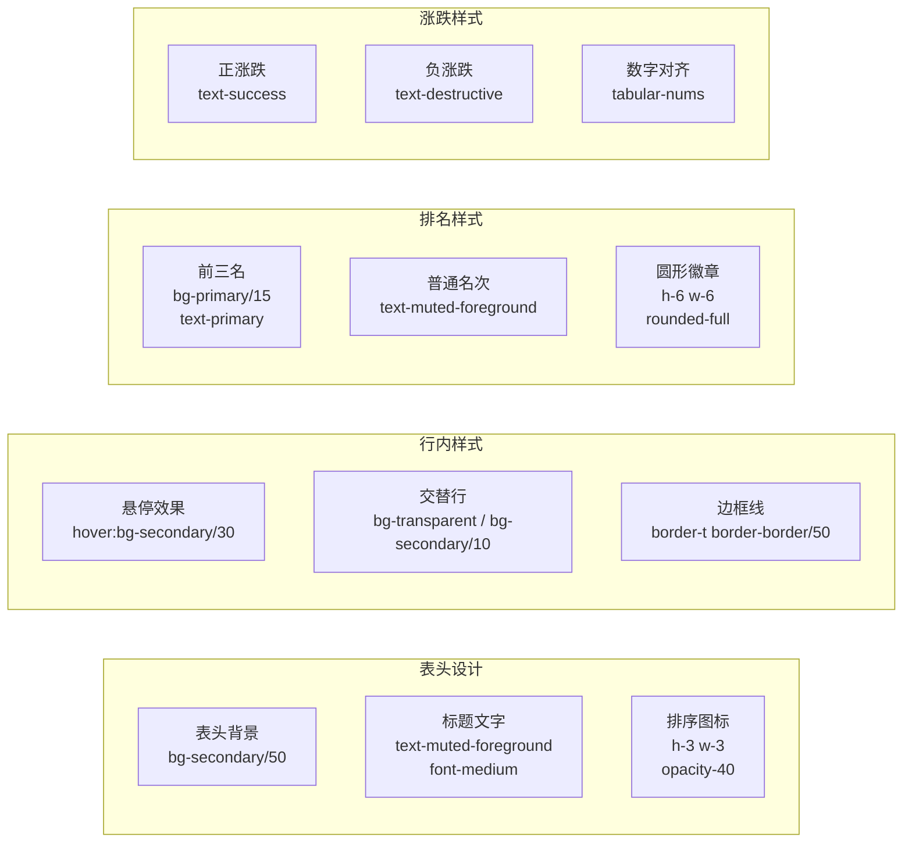

**图表来源**
- [FundRankingTable.tsx:61-189](file://components/FundRankingTable.tsx#L61-L189)

#### 颜色系统集成

组件充分利用了 Tailwind CSS 的颜色系统，特别是成功和破坏性颜色的语义化使用：

| 颜色用途 | Tailwind 类 | 语义含义 |
|---------|------------|----------|
| 正向涨跌 | `text-success` | 表示上涨，积极信号 |
| 负向涨跌 | `text-destructive` | 表示下跌，警示信号 |
| 排名高亮 | `bg-primary/15` | 强调前三名的特殊地位 |
| 文本强调 | `text-primary` | 重要信息的视觉突出 |
| 悬停效果 | `hover:bg-secondary/30` | 提供交互反馈 |

**章节来源**
- [FundRankingTable.tsx:61-189](file://components/FundRankingTable.tsx#L61-L189)
- [tailwind.config.ts:21-63](file://tailwind.config.ts#L21-L63)

### 响应式设计实现

组件实现了完整的响应式设计，确保在各种设备上都能提供良好的用户体验。

#### 断点策略

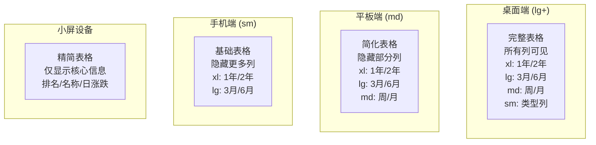

**图表来源**
- [FundRankingTable.tsx:69-128](file://components/FundRankingTable.tsx#L69-L128)

#### 列可见性控制

组件使用 Tailwind CSS 的断点类来控制列的显示和隐藏：

- `hidden sm:table-cell` - 在小屏幕上隐藏，在中等及以上屏幕上显示
- `hidden md:table-cell` - 在小屏幕上隐藏，在中等及以上屏幕上显示  
- `hidden lg:table-cell` - 在小屏幕上隐藏，在大屏及以上显示
- `hidden xl:table-cell` - 在小屏幕上隐藏，在超大屏及以上显示

**章节来源**
- [FundRankingTable.tsx:69-128](file://components/FundRankingTable.tsx#L69-L128)

## 依赖关系分析

FundRankingTable 组件的依赖关系相对简洁，主要依赖于外部数据源和工具函数。

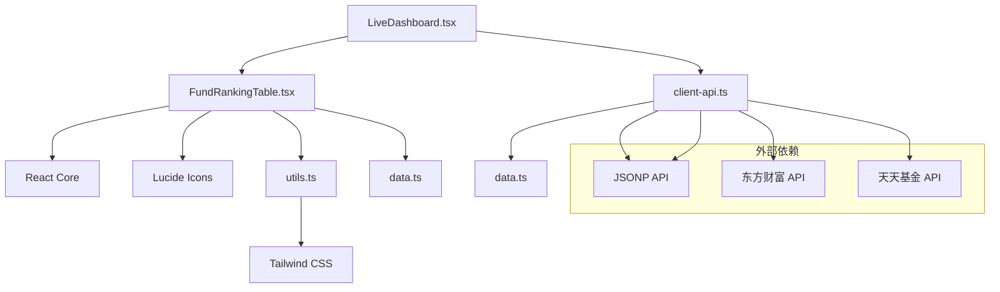

**图表来源**
- [FundRankingTable.tsx:3-6](file://components/FundRankingTable.tsx#L3-L6)
- [LiveDashboard.tsx:8-37](file://components/LiveDashboard.tsx#L8-L37)
- [client-api.ts:1-50](file://lib/client-api.ts#L1-L50)

### 组件耦合度分析

组件的设计体现了良好的低耦合原则：

1. **数据解耦**：组件只依赖接口定义，不关心具体实现
2. **样式解耦**：使用工具函数进行样式合并，避免硬编码
3. **功能解耦**：排序逻辑独立于渲染逻辑
4. **外部依赖解耦**：通过 API 层抽象外部服务

**章节来源**
- [FundRankingTable.tsx:3-6](file://components/FundRankingTable.tsx#L3-L6)
- [utils.ts:4-6](file://lib/utils.ts#L4-L6)

## 性能考虑

### 渲染优化

组件采用了多项性能优化策略：

1. **虚拟滚动**：对于大量数据，可以考虑实现虚拟滚动
2. **记忆化**：使用 React.memo 缓存渲染结果
3. **分页加载**：限制单次渲染的数据量
4. **懒加载**：延迟加载非关键内容

### 内存管理

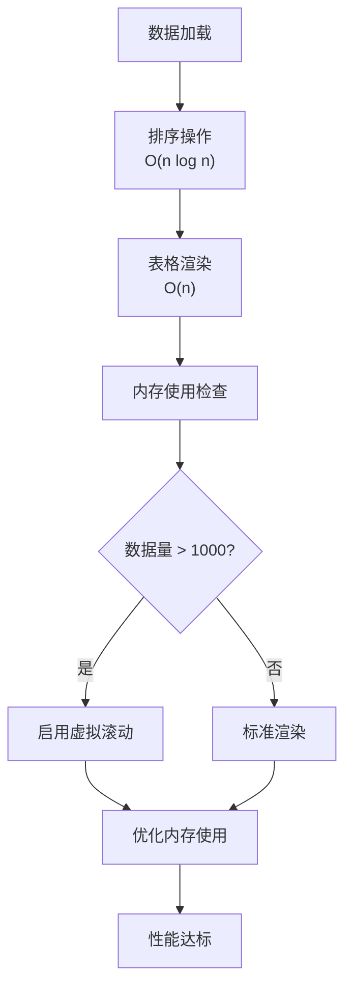

### 数据更新策略

组件的自动刷新机制需要平衡实时性和性能：

- **刷新间隔**：30秒一次，避免过于频繁的请求
- **并发控制**：使用 Promise.allSettled 并发获取数据
- **错误处理**：优雅处理网络异常和数据解析失败
- **缓存策略**：合理利用浏览器缓存减少重复请求

**章节来源**
- [LiveDashboard.tsx:56-95](file://components/LiveDashboard.tsx#L56-L95)

## 故障排除指南

### 常见问题诊断

#### 数据为空问题

当组件显示"暂无基金排行数据"时，可能的原因包括：

1. **API 请求失败**：检查网络连接和 API 可用性
2. **数据解析错误**：验证返回数据格式是否符合预期
3. **数据过滤条件**：确认过滤逻辑是否过于严格

#### 排序功能异常

如果排序功能失效，检查以下方面：

1. **排序键有效性**：确认传入的排序键存在于数据对象中
2. **数值类型**：确保比较的值都是数字类型
3. **状态更新**：验证 React 状态更新是否正常触发

#### 样式显示问题

样式异常通常由以下原因引起：

1. **Tailwind 配置**：检查 Tailwind CSS 配置是否正确
2. **CSS 冲突**：避免全局样式覆盖组件样式
3. **主题切换**：确保深色/浅色主题切换正常工作

**章节来源**
- [FundRankingTable.tsx:14-20](file://components/FundRankingTable.tsx#L14-L20)
- [LiveDashboard.tsx:89-94](file://components/LiveDashboard.tsx#L89-L94)

### 调试技巧

1. **开发者工具**：使用浏览器开发者工具检查网络请求和响应
2. **日志输出**：在关键位置添加 console.log 输出调试信息
3. **单元测试**：为排序逻辑编写单元测试确保正确性
4. **性能分析**：使用 React DevTools 分析组件渲染性能

## 结论

FundRankingTable 组件是一个设计精良的金融数据展示组件，它成功地将复杂的数据转换为直观的可视化界面。组件的主要优势包括：

### 技术优势

1. **清晰的架构**：组件职责明确，依赖关系简单
2. **优秀的用户体验**：响应式设计确保多设备兼容性
3. **高性能实现**：合理的数据处理和渲染策略
4. **可维护性**：代码结构清晰，易于扩展和修改

### 设计亮点

1. **视觉层次**：通过颜色和排版突出重要信息
2. **交互友好**：支持多种排序方式和实时更新
3. **响应式布局**：适应不同屏幕尺寸的需求
4. **语义化设计**：使用语义化的颜色和布局

### 改进建议

1. **性能优化**：对于大量数据场景，考虑实现虚拟滚动
2. **可访问性**：增强键盘导航和屏幕阅读器支持
3. **国际化**：支持多语言环境
4. **动画效果**：添加平滑的过渡动画提升用户体验

该组件为金融数据展示提供了一个优秀的参考实现，其设计理念和实现方式值得在类似项目中借鉴和学习。