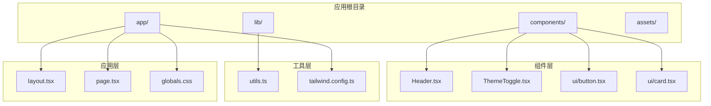
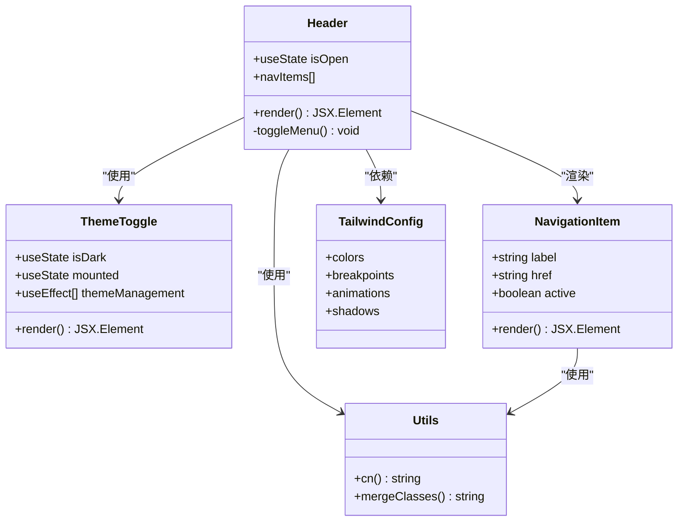
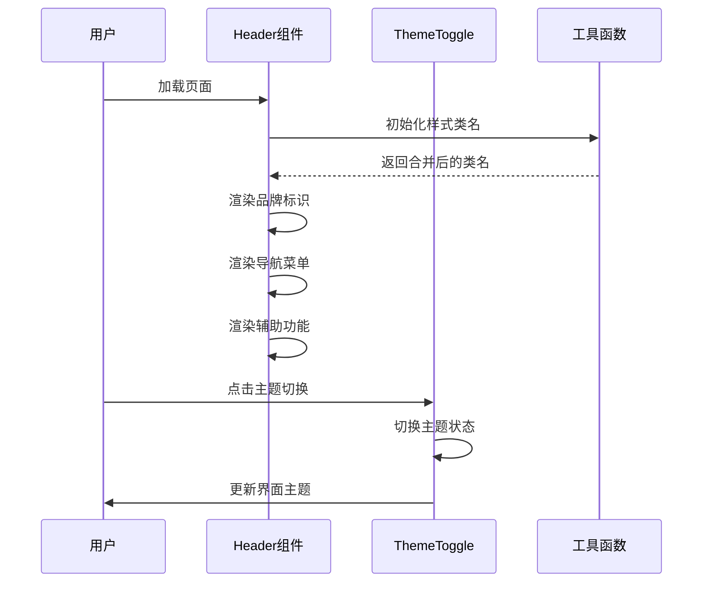
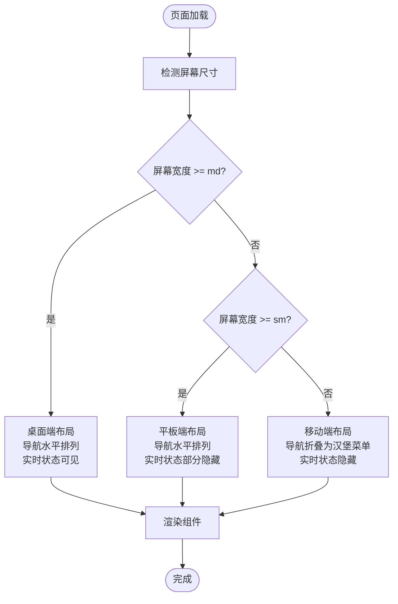
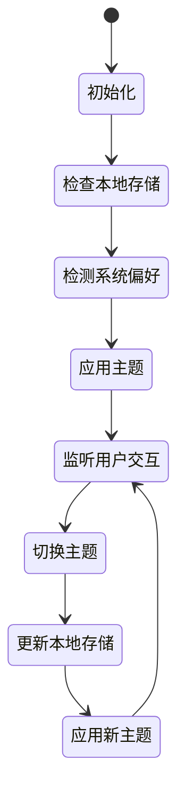
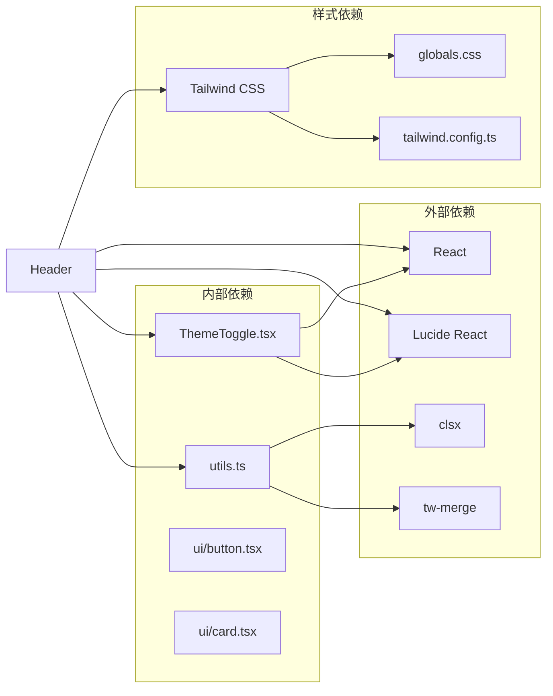

# Header 导航组件

<cite>
**本文档引用的文件**
- [components/Header.tsx](file://components/Header.tsx)
- [components/ThemeToggle.tsx](file://components/ThemeToggle.tsx)
- [app/layout.tsx](file://app/layout.tsx)
- [app/page.tsx](file://app/page.tsx)
- [components/ui/button.tsx](file://components/ui/button.tsx)
- [components/ui/card.tsx](file://components/ui/card.tsx)
- [lib/utils.ts](file://lib/utils.ts)
- [tailwind.config.ts](file://tailwind.config.ts)
- [app/globals.css](file://app/globals.css)
</cite>

## 目录
1. [简介](#简介)
2. [项目结构](#项目结构)
3. [核心组件](#核心组件)
4. [架构概览](#架构概览)
5. [详细组件分析](#详细组件分析)
6. [依赖关系分析](#依赖关系分析)
7. [性能考虑](#性能考虑)
8. [故障排除指南](#故障排除指南)
9. [结论](#结论)

## 简介

Header 导航组件是本金融数据仪表板项目的核心界面元素，负责提供统一的品牌标识、导航功能和主题切换能力。该组件采用现代化的响应式设计，支持从移动设备到桌面端的完整屏幕尺寸适配，为用户提供一致的导航体验。

组件集成了专业的金融主题设计，使用深色和浅色两种主题模式，配合专业的色彩系统和动画效果，营造出专业可靠的金融数据展示氛围。

## 项目结构

Header 组件位于组件目录中，与应用的其他核心组件协同工作，形成完整的用户界面架构。

**图表来源**
- [components/Header.tsx:1-92](file://components/Header.tsx#L1-L92)
- [app/layout.tsx:1-35](file://app/layout.tsx#L1-L35)
- [app/page.tsx:1-24](file://app/page.tsx#L1-L24)

**章节来源**
- [components/Header.tsx:1-92](file://components/Header.tsx#L1-L92)
- [app/layout.tsx:1-35](file://app/layout.tsx#L1-L35)
- [app/page.tsx:1-24](file://app/page.tsx#L1-L24)

## 核心组件

Header 组件是一个客户端组件，使用 React Hooks 管理状态，实现了完整的响应式导航功能。组件包含以下核心功能模块：

### 品牌标识区域
- Logo 图标：使用 TrendingUp 图标创建专业的金融图标
- 品牌名称：包含主标题"基金实盘"和副标题"Fund Tracker"
- 悬停效果：鼠标悬停时背景色渐变变化

### 导航菜单区域
- 桌面端布局：使用隐藏显示机制，在中等及以上屏幕尺寸显示
- 移动端布局：通过汉堡菜单按钮切换显示隐藏
- 活动状态：支持当前页面高亮显示

### 辅助功能区域
- 实时状态指示器：显示实时行情连接状态
- 主题切换：支持明暗主题切换
- 响应式设计：根据屏幕尺寸自动调整布局

**章节来源**
- [components/Header.tsx:16-91](file://components/Header.tsx#L16-L91)

## 架构概览

Header 组件采用模块化设计，与其他组件形成清晰的层次结构。

**图表来源**
- [components/Header.tsx:3-6](file://components/Header.tsx#L3-L6)
- [components/ThemeToggle.tsx:3-4](file://components/ThemeToggle.tsx#L3-L4)
- [lib/utils.ts:4-6](file://lib/utils.ts#L4-L6)
- [tailwind.config.ts:21-63](file://tailwind.config.ts#L21-L63)

## 详细组件分析

### 组件结构设计

Header 组件采用语义化的 HTML 结构，确保良好的可访问性和SEO优化。

**图表来源**
- [components/Header.tsx:16-91](file://components/Header.tsx#L16-L91)
- [components/ThemeToggle.tsx:6-51](file://components/ThemeToggle.tsx#L6-L51)

### 响应式设计实现

组件实现了完整的响应式设计，支持多种屏幕尺寸：

#### 桌面端布局 (md 及以上)
- 导航菜单水平排列
- 品牌标识左侧对齐
- 辅助功能右侧对齐
- 实时状态指示器可见

#### 平板端布局 (sm 到 md-1)
- 导航菜单仍保持水平
- 实时状态指示器部分隐藏
- 品牌标识和导航菜单间距调整

#### 移动端布局 (md 以下)
- 导航菜单折叠为汉堡菜单
- 点击按钮展开垂直导航
- 实时状态指示器完全隐藏
- 菜单项垂直排列

**图表来源**
- [components/Header.tsx:34-66](file://components/Header.tsx#L34-L66)

### 样式系统集成

组件深度集成了 Tailwind CSS 和自定义样式系统：

#### 颜色系统
- 主色调：专业蓝色调，适合金融行业
- 背景色：半透明背景，支持毛玻璃效果
- 边框色：使用系统边框变量
- 成功色：绿色系，用于状态指示

#### 动画效果
- 毛玻璃模糊效果：backdrop-blur-xl
- 悬停过渡：平滑的颜色和状态变化
- 加载动画：Ping 动画效果
- 主题切换：平滑的主题切换动画

#### 字体系统
- 中文标题：使用粗体字体强调品牌识别
- 英文副标题：小号字体，保持视觉层次
- 导航文字：适中的字号，确保可读性

**章节来源**
- [components/Header.tsx:20-31](file://components/Header.tsx#L20-L31)
- [tailwind.config.ts:21-63](file://tailwind.config.ts#L21-L63)
- [app/globals.css:7-90](file://app/globals.css#L7-L90)

### 主题切换机制

组件集成了智能的主题切换功能，支持本地存储和系统偏好检测。

**图表来源**
- [components/ThemeToggle.tsx:10-33](file://components/ThemeToggle.tsx#L10-L33)

**章节来源**
- [components/ThemeToggle.tsx:6-51](file://components/ThemeToggle.tsx#L6-L51)

## 依赖关系分析

Header 组件的依赖关系清晰明确，形成了稳定的组件生态系统。

**图表来源**
- [components/Header.tsx:3-6](file://components/Header.tsx#L3-L6)
- [lib/utils.ts:1-7](file://lib/utils.ts#L1-L7)
- [tailwind.config.ts:1-105](file://tailwind.config.ts#L1-L105)

### 组件耦合度分析

- **低耦合**：Header 组件与具体业务逻辑解耦，专注于UI展示
- **高内聚**：所有导航相关功能集中在单一组件中
- **可替换性**：导航项可以通过 props 参数化配置
- **扩展性**：支持添加新的导航项和功能模块

**章节来源**
- [components/Header.tsx:8-14](file://components/Header.tsx#L8-L14)
- [lib/utils.ts:4-6](file://lib/utils.ts#L4-L6)

## 性能考虑

### 渲染优化
- 使用 React.memo 包装避免不必要的重渲染
- 条件渲染减少 DOM 元素数量
- CSS 过渡动画由 GPU 处理，保证流畅性

### 资源管理
- 图标组件按需加载，减少初始包大小
- 样式类名合并优化，避免重复样式
- 本地存储主题状态，避免每次重新计算

### 性能监控
- 使用浏览器开发者工具监控渲染性能
- 关注首屏加载时间和交互延迟
- 监控内存使用情况，避免内存泄漏

## 故障排除指南

### 常见问题及解决方案

#### 主题切换不生效
**问题描述**：点击主题切换按钮后界面没有变化
**解决方案**：
1. 检查浏览器控制台是否有错误信息
2. 验证本地存储是否正常工作
3. 确认 CSS 变量是否正确应用

#### 导航菜单无法展开
**问题描述**：移动端汉堡菜单点击无响应
**解决方案**：
1. 检查事件处理器绑定是否正确
2. 验证状态管理逻辑
3. 确认 CSS 媒体查询是否正常

#### 样式显示异常
**问题描述**：组件样式错乱或颜色不正确
**解决方案**：
1. 检查 Tailwind CSS 配置
2. 验证 CSS 变量定义
3. 确认样式优先级设置

**章节来源**
- [components/ThemeToggle.tsx:10-33](file://components/ThemeToggle.tsx#L10-L33)
- [components/Header.tsx:17-17](file://components/Header.tsx#L17-L17)

## 结论

Header 导航组件展现了现代前端开发的最佳实践，通过精心设计的响应式架构、专业的样式系统和完善的主题切换机制，为用户提供了优秀的导航体验。

组件的主要优势包括：
- **响应式设计**：完美适配各种屏幕尺寸
- **主题友好**：支持明暗主题切换
- **性能优化**：轻量级实现，高效渲染
- **可维护性**：清晰的代码结构和依赖关系
- **可扩展性**：易于添加新功能和自定义样式

该组件为整个金融数据仪表板项目奠定了坚实的基础，体现了专业级的用户体验设计理念。