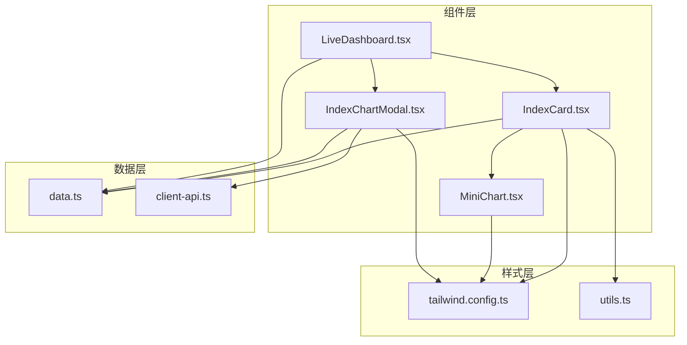
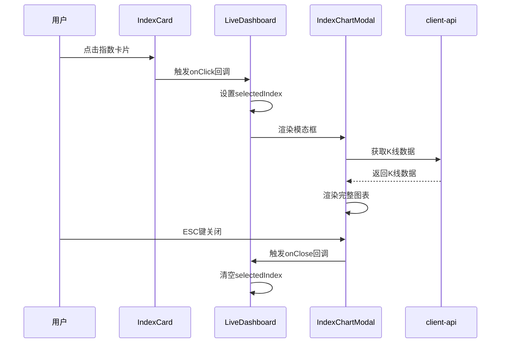
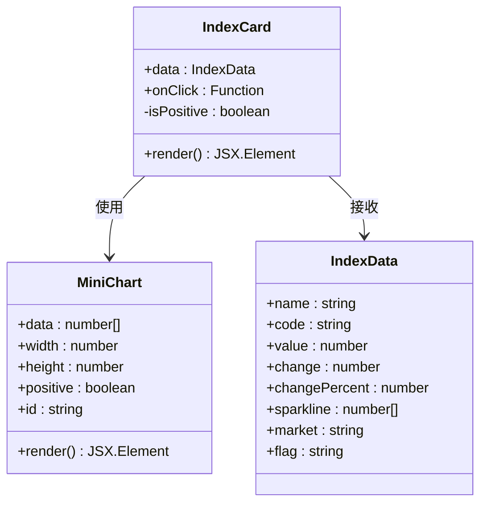
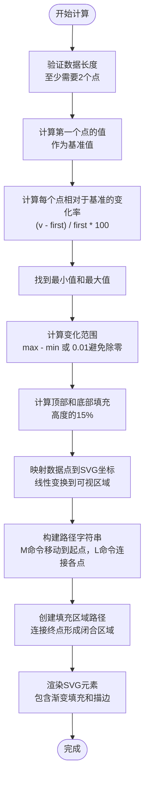
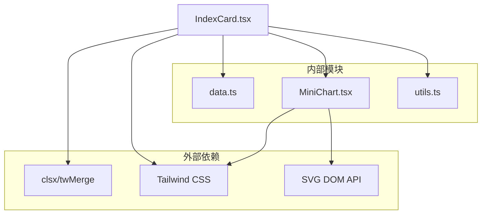

# IndexCard 指数卡片组件

<cite>
**本文档引用的文件**
- [IndexCard.tsx](file://components/IndexCard.tsx)
- [MiniChart.tsx](file://components/MiniChart.tsx)
- [IndexChartModal.tsx](file://components/IndexChartModal.tsx)
- [data.ts](file://lib/data.ts)
- [LiveDashboard.tsx](file://components/LiveDashboard.tsx)
- [utils.ts](file://lib/utils.ts)
- [tailwind.config.ts](file://tailwind.config.ts)
</cite>

## 目录
1. [简介](#简介)
2. [项目结构](#项目结构)
3. [核心组件](#核心组件)
4. [架构概览](#架构概览)
5. [详细组件分析](#详细组件分析)
6. [依赖关系分析](#依赖关系分析)
7. [性能考虑](#性能考虑)
8. [故障排除指南](#故障排除指南)
9. [结论](#结论)
10. [附录](#附录)

## 简介

IndexCard 指数卡片组件是金融数据展示系统中的核心组件之一，专门用于展示全球主要指数的实时行情信息。该组件提供了完整的数据可视化功能，包括指数基本信息、价格变化趋势、涨跌幅度显示以及迷你图表集成等特性。

该组件采用现代化的React函数式组件设计，结合Tailwind CSS样式系统，实现了响应式布局和丰富的视觉效果。通过与MiniChart迷你图表组件的深度集成，用户可以直观地了解指数的历史走势和当前状态。

## 项目结构

IndexCard组件位于项目的组件目录中，与其他金融数据组件协同工作，形成完整的金融数据仪表板系统。



**图表来源**
- [IndexCard.tsx:1-53](file://components/IndexCard.tsx#L1-L53)
- [MiniChart.tsx:1-57](file://components/MiniChart.tsx#L1-L57)
- [IndexChartModal.tsx:1-367](file://components/IndexChartModal.tsx#L1-L367)

**章节来源**
- [IndexCard.tsx:1-53](file://components/IndexCard.tsx#L1-L53)
- [LiveDashboard.tsx:1-375](file://components/LiveDashboard.tsx#L1-L375)

## 核心组件

IndexCard组件的核心功能围绕以下五个关键要素构建：

### 数据展示逻辑
- **指数名称显示**：支持多语言字符和截断显示
- **代码标识**：清晰的指数代码展示
- **当前值格式化**：千分位分隔符和两位小数显示
- **涨跌幅度**：数值变化量的精确显示
- **涨跌百分比**：百分比变化的格式化输出

### 迷你图表集成
- **SVG图形渲染**：基于SVG的高性能图表渲染
- **数据点计算**：相对变化率计算和坐标映射
- **颜色判断逻辑**：根据涨跌状态动态选择颜色方案

### 交互功能
- **点击事件处理**：支持外部回调函数
- **模态框触发**：完整的全屏图表展示
- **键盘事件支持**：ESC键关闭模态框

### 样式设计
- **颜色编码系统**：成功/破坏色的语义化颜色
- **字体大小适配**：响应式字体尺寸调整
- **间距优化**：合理的内边距和外边距设置

**章节来源**
- [IndexCard.tsx:5-52](file://components/IndexCard.tsx#L5-L52)
- [data.ts:1-10](file://lib/data.ts#L1-L10)

## 架构概览

IndexCard组件在整个金融数据系统中扮演着关键角色，它不仅负责数据展示，还承担着用户交互的入口职责。



**图表来源**
- [IndexCard.tsx:14-20](file://components/IndexCard.tsx#L14-L20)
- [LiveDashboard.tsx:167-169](file://components/LiveDashboard.tsx#L167-L169)
- [IndexChartModal.tsx:27-33](file://components/IndexChartModal.tsx#L27-L33)

## 详细组件分析

### IndexCard 组件架构

IndexCard组件采用函数式组件设计，通过props接收数据和回调函数，内部状态仅包含简单的布尔值用于颜色判断。



**图表来源**
- [IndexCard.tsx:1-11](file://components/IndexCard.tsx#L1-L11)
- [MiniChart.tsx:1-7](file://components/MiniChart.tsx#L1-L7)
- [data.ts:1-10](file://lib/data.ts#L1-L10)

### 数据展示逻辑详解

组件的核心数据展示逻辑遵循以下流程：

#### 数值格式化处理
- **当前值格式化**：使用本地化方法进行千分位分隔符处理，确保数字可读性
- **涨跌幅度显示**：绝对值显示，正数前缀可选
- **涨跌百分比**：百分比形式显示，保留两位小数

#### 颜色编码系统
组件使用Tailwind CSS的颜色系统，通过条件渲染实现语义化的颜色编码：
- **上涨状态**：使用success颜色变量
- **下跌状态**：使用destructive颜色变量
- **背景色**：使用透明度10%的辅助色

**章节来源**
- [IndexCard.tsx:30-43](file://components/IndexCard.tsx#L30-L43)
- [tailwind.config.ts:55-58](file://tailwind.config.ts#L55-L58)

### MiniChart 迷你图表实现

MiniChart组件实现了完整的SVG图表渲染功能，包括数据点计算、坐标映射和图形绘制。

#### 数据点计算算法



**图表来源**
- [MiniChart.tsx:9-30](file://components/MiniChart.tsx#L9-L30)

#### SVG 图形渲染

MiniChart使用SVG标准元素实现图表渲染：
- **路径元素**：用于绘制折线图和填充区域
- **渐变定义**：创建从深色到透明的垂直渐变效果
- **线性渐变**：支持动态颜色配置

**章节来源**
- [MiniChart.tsx:32-55](file://components/MiniChart.tsx#L32-L55)

### 交互功能实现

IndexCard组件提供了完整的用户交互体验，包括点击事件处理和模态框触发机制。

#### 点击事件处理

组件通过props接收onClick回调函数，当用户点击卡片时触发相应的业务逻辑：
- **事件传播控制**：使用条件渲染决定是否启用点击功能
- **数据传递**：将完整的IndexData对象传递给回调函数
- **样式反馈**：悬停状态下的背景色变化提供视觉反馈

#### 模态框触发机制

在LiveDashboard组件中，IndexCard的点击事件被用来触发IndexChartModal的显示：
- **状态管理**：通过useState管理模态框的显示状态
- **数据传递**：将选中的指数数据传递给模态框组件
- **生命周期管理**：正确的模态框打开和关闭时机控制

**章节来源**
- [IndexCard.tsx:14-20](file://components/IndexCard.tsx#L14-L20)
- [LiveDashboard.tsx:167-169](file://components/LiveDashboard.tsx#L167-L169)

### 样式设计分析

IndexCard组件的样式设计体现了现代Web应用的最佳实践，通过Tailwind CSS实现了响应式和语义化的样式系统。

#### 响应式适配策略

组件采用了多层次的响应式设计：
- **基础样式**：适用于移动端的小屏幕设备
- **平板适配**：sm断点以上的样式调整
- **桌面优化**：lg及以上断点的布局优化

#### 颜色系统集成

组件充分利用了Tailwind CSS的CSS变量系统：
- **语义化颜色**：success和destructive颜色变量提供明确的语义含义
- **透明度控制**：使用10%透明度的背景色增强视觉层次
- **主题一致性**：与整体应用主题保持一致的颜色方案

**章节来源**
- [IndexCard.tsx:29-48](file://components/IndexCard.tsx#L29-L48)
- [tailwind.config.ts:21-63](file://tailwind.config.ts#L21-L63)

## 依赖关系分析

IndexCard组件的依赖关系相对简洁，主要依赖于外部库和内部模块。



**图表来源**
- [IndexCard.tsx:1](file://components/IndexCard.tsx#L1)
- [MiniChart.tsx:33-54](file://components/MiniChart.tsx#L33-L54)

### 外部依赖分析

- **clsx/twMerge**：用于合并CSS类名，避免重复和冲突
- **Tailwind CSS**：提供原子化样式系统，支持响应式设计
- **SVG DOM API**：浏览器原生SVG支持，无需额外库

### 内部模块依赖

- **data.ts**：提供IndexData接口定义和示例数据
- **MiniChart.tsx**：迷你图表组件，提供数据可视化功能
- **utils.ts**：工具函数，提供cn函数用于类名合并

**章节来源**
- [IndexCard.tsx:1-3](file://components/IndexCard.tsx#L1-L3)
- [utils.ts:4-6](file://lib/utils.ts#L4-L6)

## 性能考虑

IndexCard组件在设计时充分考虑了性能优化，特别是在数据渲染和交互响应方面。

### 渲染性能优化

- **条件渲染**：只有当sparkline数据存在且长度足够时才渲染迷你图表
- **浅比较**：使用React的默认比较机制避免不必要的重渲染
- **内存管理**：及时清理事件监听器和定时器

### 计算性能优化

- **数据预处理**：在组件外部进行数据格式化，减少渲染时的计算开销
- **缓存策略**：利用浏览器缓存SVG渐变定义
- **批量更新**：通过父组件统一管理数据更新，避免频繁的状态切换

### 内存使用优化

- **数据结构**：使用简单数组存储数值数据，减少内存占用
- **事件绑定**：只在必要时绑定事件处理器
- **资源释放**：正确管理模态框的生命周期

## 故障排除指南

### 常见问题及解决方案

#### 迷你图表不显示
**问题描述**：指数卡片右侧的迷你图表没有显示
**可能原因**：
- sparkline数据为空或长度不足
- 数据格式不符合预期
- SVG渲染失败

**解决方案**：
- 检查IndexData接口中的sparkline字段
- 确保数据数组至少包含2个数值
- 验证数据类型为number[]

#### 颜色显示异常
**问题描述**：涨跌颜色显示不符合预期
**可能原因**：
- changePercent值计算错误
- Tailwind CSS颜色变量未正确配置
- 条件渲染逻辑错误

**解决方案**：
- 验证changePercent的计算逻辑
- 检查tailwind.config.ts中的颜色配置
- 确认条件渲染表达式的正确性

#### 点击事件无效
**问题描述**：点击指数卡片没有响应
**可能原因**：
- onClick回调函数未正确传递
- 条件渲染阻止了事件绑定
- 事件冒泡被意外阻止

**解决方案**：
- 确认IndexCard组件接收了onClick属性
- 检查onClick函数的实现
- 验证事件绑定的条件逻辑

**章节来源**
- [IndexCard.tsx:44-47](file://components/IndexCard.tsx#L44-L47)
- [IndexCard.tsx:16](file://components/IndexCard.tsx#L16)

## 结论

IndexCard指数卡片组件是一个设计精良、功能完整的金融数据展示组件。它成功地将复杂的数据可视化需求转化为简洁易用的用户界面，同时保持了良好的性能和可维护性。

组件的主要优势包括：
- **模块化设计**：清晰的职责分离和依赖关系
- **响应式布局**：适应不同屏幕尺寸的布局策略
- **语义化样式**：基于Tailwind CSS的颜色系统
- **交互友好**：直观的用户交互和反馈机制
- **性能优化**：合理的渲染策略和计算优化

通过与MiniChart组件的深度集成和IndexChartModal的完整图表展示功能，用户可以获得从概览到细节的全方位指数信息。

## 附录

### 使用示例代码

#### 基础使用方式
```typescript
// 在父组件中使用IndexCard
<IndexCard 
  data={indexData} 
  onClick={(data) => console.log('Selected:', data)}
/>
```

#### 自定义样式扩展
```typescript
// 添加自定义样式类
<IndexCard 
  data={indexData}
  className="custom-card-style"
/>
```

#### 扩展功能实现
```typescript
// 实现自定义点击行为
const handleIndexClick = (data: IndexData) => {
  // 自定义业务逻辑
  navigateToDetailPage(data.code);
};
```

### 扩展指南

#### 自定义数据格式
要支持不同的数据格式，可以修改IndexData接口：
```typescript
interface CustomIndexData extends IndexData {
  additionalField?: string;
}
```

#### 自定义图表样式
可以通过修改MiniChart组件的参数来自定义图表外观：
```typescript
<MiniChart 
  data={data.sparkline}
  width={120}
  height={50}
  positive={isPositive}
  id={data.code}
  className="custom-chart-style"
/>
```

#### 增强交互功能
可以扩展IndexCard组件以支持更多交互模式：
```typescript
interface EnhancedIndexCardProps {
  data: IndexData;
  onClick?: (data: IndexData) => void;
  onContextMenu?: (data: IndexData) => void;
  showDetails?: boolean;
}
```