# LiveDashboard 主面板组件

<cite>
**本文档引用的文件**
- [LiveDashboard.tsx](file://components/LiveDashboard.tsx)
- [DailyMarketAnalysis.tsx](file://components/DailyMarketAnalysis.tsx)
- [MarketOverview.tsx](file://components/MarketOverview.tsx)
- [SectorRankingTable.tsx](file://components/SectorRankingTable.tsx)
- [CapitalFlowTable.tsx](file://components/CapitalFlowTable.tsx)
- [client-api.ts](file://lib/client-api.ts)
- [data.ts](file://lib/data.ts)
- [watchlist.ts](file://lib/watchlist.ts)
- [IndexCard.tsx](file://components/IndexCard.tsx)
- [SearchModal.tsx](file://components/SearchModal.tsx)
- [IndexChartModal.tsx](file://components/IndexChartModal.tsx)
- [StockTable.tsx](file://components/StockTable.tsx)
- [FundCard.tsx](file://components/FundCard.tsx)
- [FundRankingTable.tsx](file://components/FundRankingTable.tsx)
- [MiniChart.tsx](file://components/MiniChart.tsx)
- [utils.ts](file://lib/utils.ts)
- [page.tsx](file://app/page.tsx)
</cite>

## 目录
1. [简介](#简介)
2. [项目结构](#项目结构)
3. [核心组件](#核心组件)
4. [架构概览](#架构概览)
5. [详细组件分析](#详细组件分析)
6. [依赖关系分析](#依赖关系分析)
7. [性能考虑](#性能考虑)
8. [故障排除指南](#故障排除指南)
9. [结论](#结论)
10. [附录](#附录)

## 简介

LiveDashboard 是一个实时金融数据监控面板组件，为用户提供全球指数、热门股票、跟踪基金等实时数据展示。该组件采用现代化的 React 架构设计，实现了高效的数据获取机制、智能的状态管理和丰富的用户交互体验。

**更新** 最新版本集成了全新的日市场分析模块，提供更全面的市场洞察和数据分析功能。

## 项目结构

该项目采用模块化架构，主要分为以下几个层次：

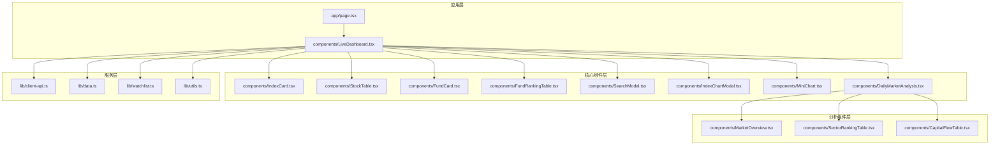

**图表来源**
- [LiveDashboard.tsx:1-441](file://components/LiveDashboard.tsx#L1-L441)
- [DailyMarketAnalysis.tsx:1-54](file://components/DailyMarketAnalysis.tsx#L1-L54)
- [page.tsx:1-24](file://app/page.tsx#L1-L24)

**章节来源**
- [LiveDashboard.tsx:1-441](file://components/LiveDashboard.tsx#L1-L441)
- [page.tsx:1-24](file://app/page.tsx#L1-L24)

## 核心组件

### LiveDashboard 主面板组件

LiveDashboard 是整个应用的核心组件，负责协调所有子组件并管理全局状态。该组件实现了以下关键功能：

#### 状态管理架构

组件维护了多个独立的状态管理器：

| 状态类型 | 状态变量 | 数据源 | 用途 |
|---------|---------|--------|------|
| 市场数据 | `indices` | `fetchIndices()` | 全球指数实时数据 |
| 热门股票 | `hotStocks` | `fetchHotStocks()` | A股热门股票行情 |
| 自选股 | `watchlistStocks` | `fetchStocksByCodes()` | 用户自选股票数据 |
| 基金跟踪 | `funds` | `fetchFundsByCodes()` | 用户跟踪的基金净值 |
| 基金排行 | `fundRanking` | `fetchFundRanking()` | 全市场基金涨跌幅排行 |
| 日市场分析 | `dailyAnalysis` | `fetchDailyAnalysis()` | 日市场综合分析数据 |
| UI状态 | `isLive`, `isRefreshing`, `lastUpdate` | 内部逻辑 | 界面状态指示 |

#### 数据获取机制

组件采用 `Promise.allSettled` 并行请求策略，确保即使部分请求失败也不会影响整体数据展示：

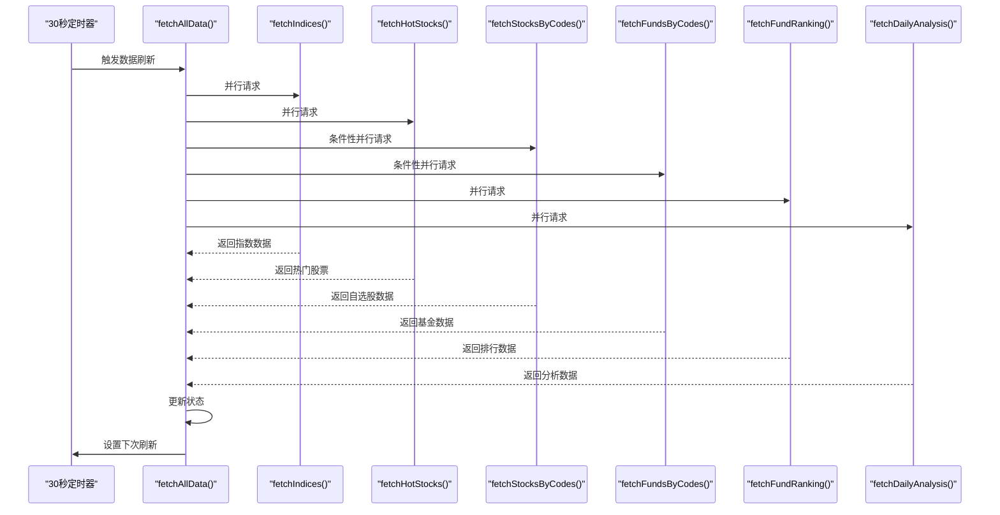

**图表来源**
- [LiveDashboard.tsx:81-124](file://components/LiveDashboard.tsx#L81-L124)

#### 实时刷新逻辑

组件实现了智能的实时数据刷新机制：

1. **定时刷新**：每30秒自动触发数据更新
2. **手动刷新**：用户可点击刷新按钮强制更新
3. **状态指示**：通过 `isLive` 和 `isRefreshing` 状态显示数据状态
4. **时间戳记录**：记录最后更新时间

**章节来源**
- [LiveDashboard.tsx:39-131](file://components/LiveDashboard.tsx#L39-L131)

## 架构概览

### 组件间通信机制

LiveDashboard 采用了多种组件间通信方式：

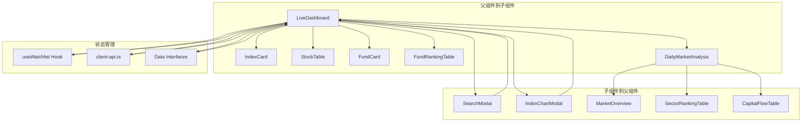

**图表来源**
- [LiveDashboard.tsx:9-13](file://components/LiveDashboard.tsx#L9-L13)
- [SearchModal.tsx:15-31](file://components/SearchModal.tsx#L15-L31)
- [IndexChartModal.tsx:27-33](file://components/IndexChartModal.tsx#L27-L33)
- [DailyMarketAnalysis.tsx:6-8](file://components/DailyMarketAnalysis.tsx#L6-L8)

### 数据流架构

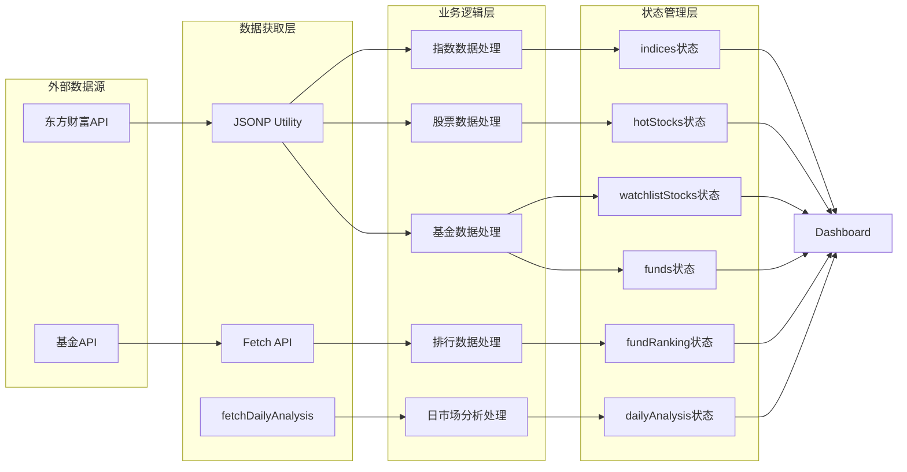

**图表来源**
- [client-api.ts:5-36](file://lib/client-api.ts#L5-L36)
- [client-api.ts:154-201](file://lib/client-api.ts#L154-L201)
- [client-api.ts:205-242](file://lib/client-api.ts#L205-L242)
- [client-api.ts:423-458](file://lib/client-api.ts#L423-L458)
- [client-api.ts:462-495](file://lib/client-api.ts#L462-L495)
- [client-api.ts:598-636](file://lib/client-api.ts#L598-L636)
- [client-api.ts:750-764](file://lib/client-api.ts#L750-L764)

**章节来源**
- [client-api.ts:1-765](file://lib/client-api.ts#L1-L765)

## 详细组件分析

### 日市场分析模块

**更新** 新增的日市场分析模块是LiveDashboard的重要组成部分，提供全面的市场洞察和数据分析功能。

#### DailyMarketAnalysis 主组件

DailyMarketAnalysis 是日市场分析的核心组件，负责整合市场概况、板块排行和资金流向数据：

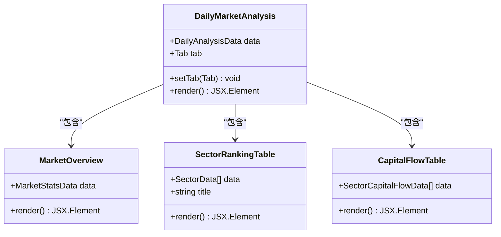

**图表来源**
- [DailyMarketAnalysis.tsx:12-53](file://components/DailyMarketAnalysis.tsx#L12-L53)
- [MarketOverview.tsx:14-125](file://components/MarketOverview.tsx#L14-L125)
- [SectorRankingTable.tsx:10-114](file://components/SectorRankingTable.tsx#L10-L114)
- [CapitalFlowTable.tsx:17-159](file://components/CapitalFlowTable.tsx#L17-L159)

#### 市场概况组件 (MarketOverview)

MarketOverview 展示了市场的基本统计数据：

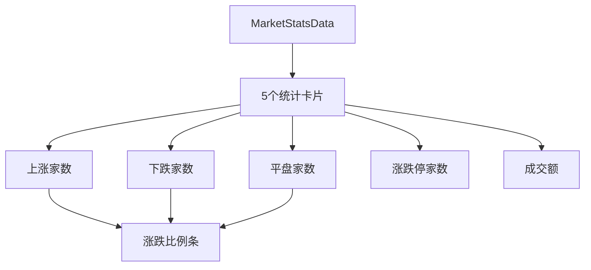

**图表来源**
- [MarketOverview.tsx:28-80](file://components/MarketOverview.tsx#L28-L80)

#### 板块排行组件 (SectorRankingTable)

SectorRankingTable 提供行业板块和概念板块的排行功能：

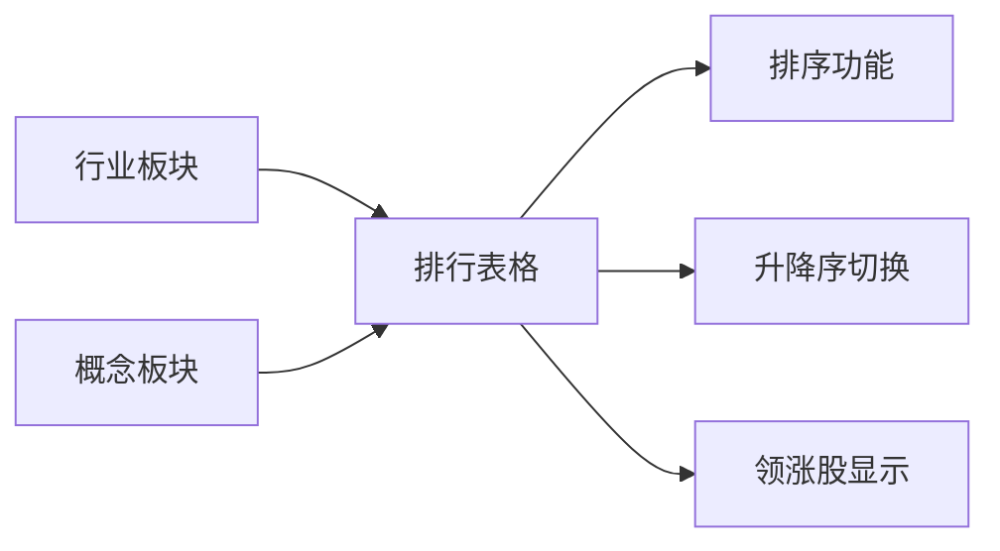

**图表来源**
- [SectorRankingTable.tsx:21-48](file://components/SectorRankingTable.tsx#L21-L48)

#### 资金流向组件 (CapitalFlowTable)

CapitalFlowTable 展示各板块的资金流向情况：

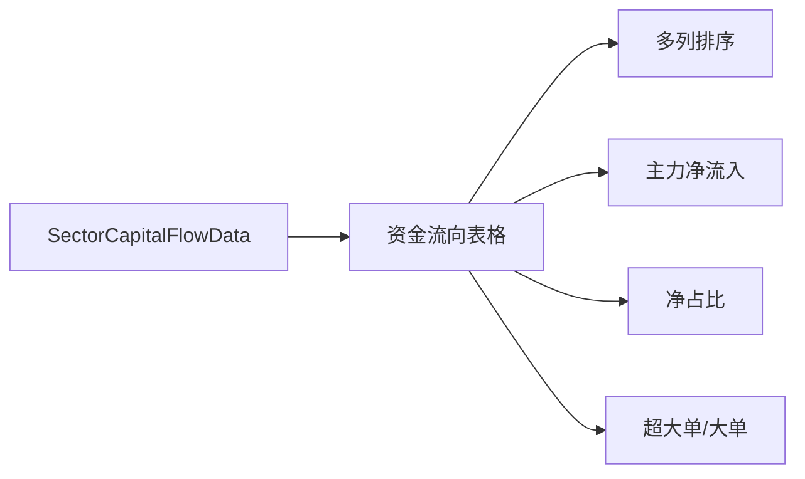

**图表来源**
- [CapitalFlowTable.tsx:29-80](file://components/CapitalFlowTable.tsx#L29-L80)

#### 分析数据接口

日市场分析模块使用了专门的数据接口定义：

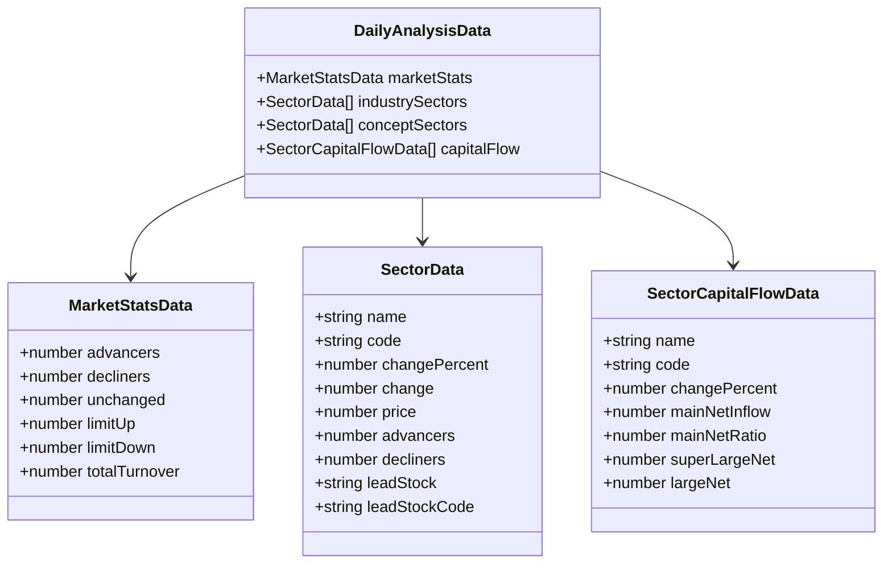

**图表来源**
- [data.ts:32-37](file://lib/data.ts#L32-L37)
- [data.ts:1-8](file://lib/data.ts#L1-L8)
- [data.ts:10-20](file://lib/data.ts#L10-L20)
- [data.ts:22-30](file://lib/data.ts#L22-L30)

### 统计卡片组件 (StatCard)

StatCard 是一个通用的统计信息展示组件，用于显示各类统计数据：

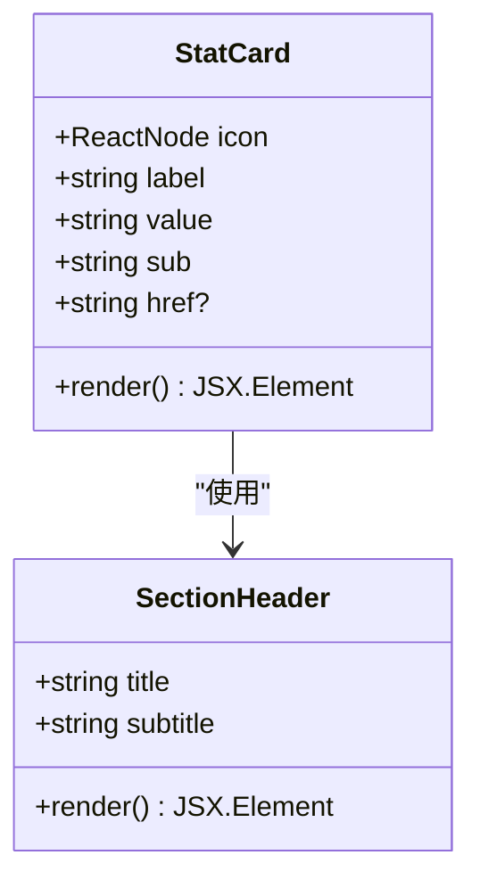

**图表来源**
- [LiveDashboard.tsx:380-416](file://components/LiveDashboard.tsx#L380-L416)
- [LiveDashboard.tsx:371-378](file://components/LiveDashboard.tsx#L371-L378)

StatCard 的设计特点：
- 支持图标、标签、数值和副标题的组合展示
- 可选的链接功能，支持页面内导航
- 响应式布局，适配不同屏幕尺寸
- 悬停效果和点击反馈

### 空状态组件 (EmptyWatchlist)

EmptyWatchlist 提供了统一的空状态展示，增强了用户体验：

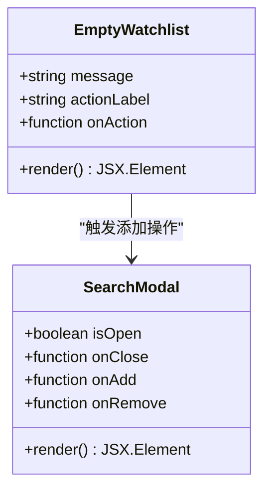

**图表来源**
- [LiveDashboard.tsx:418-440](file://components/LiveDashboard.tsx#L418-L440)
- [SearchModal.tsx:15-31](file://components/SearchModal.tsx#L15-L31)

EmptyWatchlist 的设计模式：
- 统一的视觉风格和交互行为
- 明确的操作引导
- 与搜索模态框的无缝集成

### 搜索功能集成

搜索功能通过 SearchModal 组件实现，支持基金和股票的双重搜索：

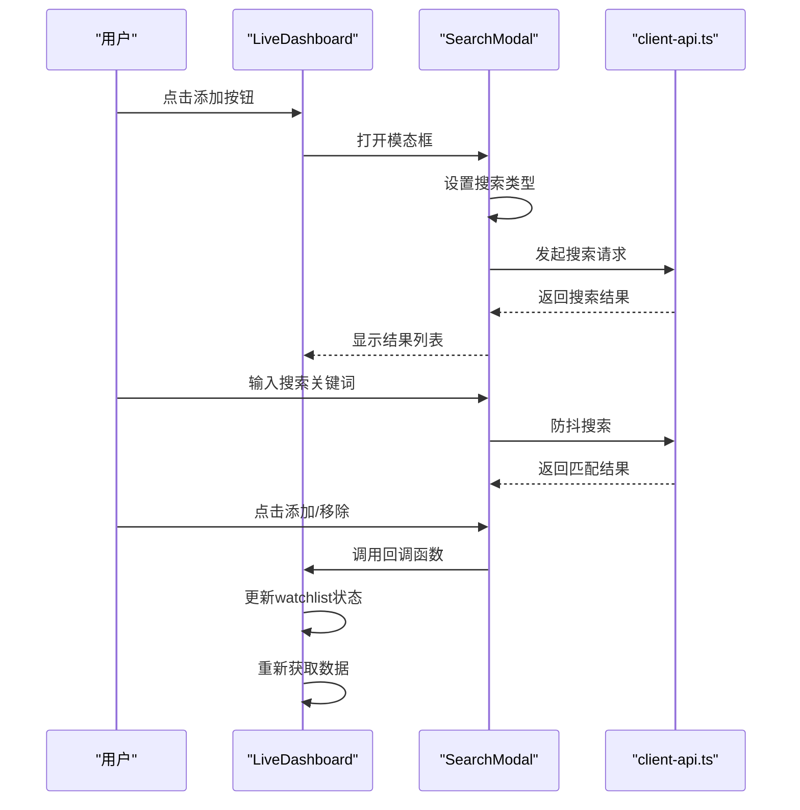

**图表来源**
- [SearchModal.tsx:48-77](file://components/SearchModal.tsx#L48-L77)
- [LiveDashboard.tsx:342-363](file://components/LiveDashboard.tsx#L342-L363)

**章节来源**
- [SearchModal.tsx:1-210](file://components/SearchModal.tsx#L1-L210)
- [LiveDashboard.tsx:342-363](file://components/LiveDashboard.tsx#L342-L363)

### 模态框状态管理

系统提供了两种重要的模态框组件：

#### 指数图表模态框 (IndexChartModal)

IndexChartModal 展示了指数的历史K线数据：

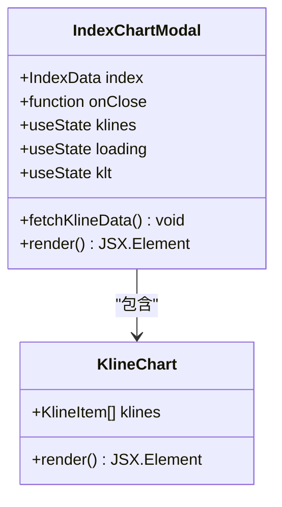

**图表来源**
- [IndexChartModal.tsx:27-55](file://components/IndexChartModal.tsx#L27-L55)
- [IndexChartModal.tsx:169-354](file://components/IndexChartModal.tsx#L169-L354)

#### 搜索模态框 (SearchModal)

SearchModal 提供了完整的搜索和选择功能：

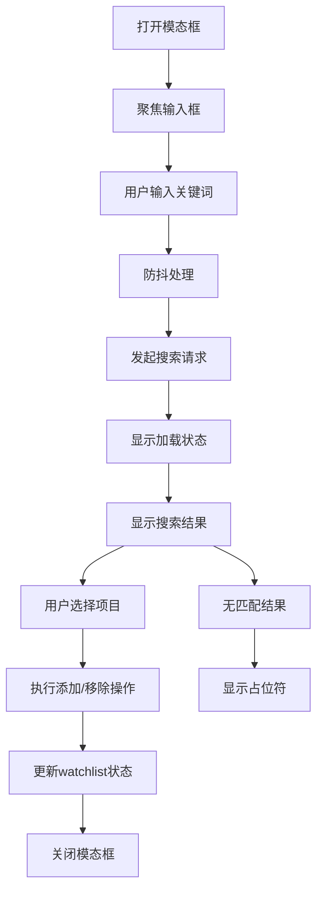

**图表来源**
- [SearchModal.tsx:48-77](file://components/SearchModal.tsx#L48-L77)
- [SearchModal.tsx:134-192](file://components/SearchModal.tsx#L134-L192)

**章节来源**
- [IndexChartModal.tsx:1-367](file://components/IndexChartModal.tsx#L1-L367)
- [SearchModal.tsx:1-210](file://components/SearchModal.tsx#L1-L210)

### 基金涨跌幅排行榜模块

**更新** 基金排行榜模块的UI标题已简化，反映了数据源的改进

基金涨跌幅排行榜是LiveDashboard中的重要模块，负责展示全市场基金的实时涨跌幅排行。该模块经过UI优化，标题更加简洁明了：

```mermaid
flowchart TD
Title[标题: "基金涨跌幅排行榜"] --> Subtitle[副标题: "全市场基金最新排行"]
Subtitle --> Table[FundRankingTable组件]
Table --> Data[FundRankingData数据]
Data --> Sorting[多维度排序]
Sorting --> Visualization[涨跌幅可视化]
Visualization --> Interaction[用户交互]
```

**图表来源**
- [LiveDashboard.tsx:266-273](file://components/LiveDashboard.tsx#L266-L273)
- [FundRankingTable.tsx:10-192](file://components/FundRankingTable.tsx#L10-L192)

模块特点：
- **标题简化**：从"当日基金涨跌幅排行榜"简化为"基金涨跌幅排行榜"
- **副标题更新**：从"全市场基金实时排行"更新为"全市场基金最新排行"
- **数据源改进**：反映数据获取逻辑的优化，提供最新的基金排行数据
- **多维度排序**：支持按日涨幅、周涨幅、月涨幅等多个时间维度排序
- **涨跌幅可视化**：使用颜色编码直观展示涨跌情况

**章节来源**
- [LiveDashboard.tsx:266-273](file://components/LiveDashboard.tsx#L266-L273)
- [FundRankingTable.tsx:10-192](file://components/FundRankingTable.tsx#L10-L192)

## 依赖关系分析

### 外部依赖

组件系统依赖于以下外部库和服务：

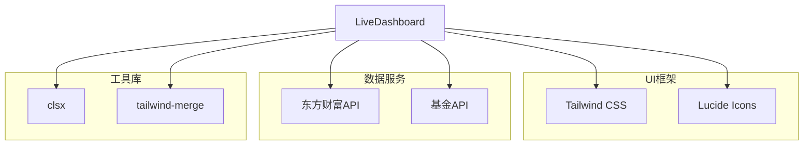

**图表来源**
- [LiveDashboard.tsx:14-28](file://components/LiveDashboard.tsx#L14-L28)
- [utils.ts:1-7](file://lib/utils.ts#L1-L7)

### 内部依赖关系

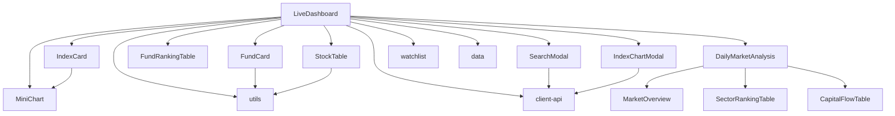

**图表来源**
- [LiveDashboard.tsx:5-13](file://components/LiveDashboard.tsx#L5-L13)
- [client-api.ts:1-2](file://lib/client-api.ts#L1-L2)

**章节来源**
- [LiveDashboard.tsx:1-441](file://components/LiveDashboard.tsx#L1-L441)
- [client-api.ts:1-765](file://lib/client-api.ts#L1-L765)

## 性能考虑

### 数据获取优化

1. **并行请求策略**：使用 `Promise.allSettled` 确保部分请求失败不影响整体性能
2. **条件性数据获取**：仅在用户有关注的股票或基金时才发起相应请求
3. **缓存机制**：利用浏览器缓存和本地存储减少重复请求
4. **分析数据优化**：fetchDailyAnalysis 使用 Promise.allSettled 并行获取多个分析数据源

### 渲染性能优化

1. **状态分离**：将不同类型的数据分离到独立状态，避免不必要的重渲染
2. **组件拆分**：将大组件拆分为多个小组件，提高渲染效率
3. **虚拟滚动**：对于大量数据的表格组件，可考虑实现虚拟滚动
4. **分析组件懒加载**：日市场分析组件可根据需要延迟加载

### 内存管理

1. **定时器清理**：确保组件卸载时清除定时器，防止内存泄漏
2. **事件监听器清理**：及时移除键盘事件监听器
3. **防抖优化**：对搜索功能使用防抖，减少频繁的API调用
4. **分析数据清理**：定期清理过期的分析数据，避免内存累积

## 故障排除指南

### 常见问题及解决方案

#### 数据获取失败

**问题描述**：某些API请求失败导致数据不完整

**解决方案**：
1. 检查网络连接状态
2. 查看控制台错误信息
3. 确认API接口可用性
4. 实现适当的错误边界处理

#### 性能问题

**问题描述**：页面渲染缓慢或卡顿

**解决方案**：
1. 检查是否有过多的重渲染
2. 优化数据获取频率
3. 实现数据分页加载
4. 使用React.memo优化子组件

#### 搜索功能异常

**问题描述**：搜索结果不准确或响应慢

**解决方案**：
1. 检查防抖参数设置
2. 验证API返回格式
3. 实现搜索历史缓存
4. 添加搜索结果过滤

#### 基金排行榜显示问题

**问题描述**：基金排行榜标题显示不正确或数据为空

**解决方案**：
1. 检查 `fetchFundRanking()` API 调用是否成功
2. 验证数据格式是否符合 `FundRankingData` 接口
3. 确认 `FundRankingTable` 组件的渲染逻辑
4. 检查UI标题和副标题的显示逻辑

#### 日市场分析模块问题

**问题描述**：日市场分析数据不显示或显示异常

**解决方案**：
1. 检查 `fetchDailyAnalysis()` API 调用是否成功
2. 验证 `DailyAnalysisData` 接口的数据结构
3. 确认 MarketOverview、SectorRankingTable、CapitalFlowTable 组件的渲染逻辑
4. 检查分析数据的格式化和显示逻辑
5. 验证 fetchDailyAnalysis 函数的并行请求处理

**章节来源**
- [LiveDashboard.tsx:81-124](file://components/LiveDashboard.tsx#L81-L124)
- [SearchModal.tsx:48-77](file://components/SearchModal.tsx#L48-L77)
- [FundRankingTable.tsx:14-20](file://components/FundRankingTable.tsx#L14-L20)
- [client-api.ts:750-764](file://lib/client-api.ts#L750-L764)

## 结论

LiveDashboard 主面板组件展现了现代前端开发的最佳实践，通过合理的架构设计和状态管理，实现了高性能、可维护的金融数据展示系统。组件间清晰的职责划分、灵活的通信机制以及完善的错误处理策略，为用户提供了流畅的使用体验。

**更新** 最新的日市场分析模块进一步增强了LiveDashboard的功能，提供了全面的市场洞察和数据分析能力。该模块通过三个核心组件（MarketOverview、SectorRankingTable、CapitalFlowTable）提供了多层次的市场分析视角，满足了不同用户的需求。

该组件体系具有良好的扩展性，可以轻松添加新的数据源和功能模块，同时保持系统的稳定性和性能表现。最新的UI优化和分析功能集成进一步提升了用户体验，使界面更加简洁直观且功能更加丰富。

## 附录

### 组件使用最佳实践

1. **状态管理**：合理划分组件状态，避免过度耦合
2. **错误处理**：实现全面的错误边界和降级策略
3. **性能优化**：使用防抖、节流和缓存技术
4. **用户体验**：提供清晰的加载状态和反馈信息
5. **代码组织**：遵循单一职责原则，保持组件简洁
6. **分析数据**：合理处理并行请求，确保分析模块的稳定性

### 错误处理策略

- 实现 `Promise.allSettled` 的错误处理
- 提供默认数据回退机制
- 实现用户友好的错误提示
- 记录错误日志便于调试
- 对分析模块实现独立的错误处理

### UI优化指南

- **标题简洁化**：保持UI标题简洁明了，避免冗余信息
- **副标题准确性**：确保副标题准确反映数据时效性
- **数据源透明度**：向用户明确展示数据来源和更新频率
- **视觉一致性**：保持整体UI风格的一致性和专业性
- **分析模块集成**：确保日市场分析模块与主界面的视觉和谐统一

### 日市场分析模块最佳实践

- **数据完整性**：确保分析数据的完整性和准确性
- **响应式设计**：保证分析组件在不同设备上的良好显示效果
- **交互友好**：提供直观的排序和筛选功能
- **性能优化**：对大量分析数据进行适当的分页和虚拟滚动
- **错误处理**：实现分析模块的独立错误处理和降级显示