# LiveDashboard 主面板组件

<cite>
**本文档引用的文件**
- [LiveDashboard.tsx](file://components/LiveDashboard.tsx)
- [client-api.ts](file://lib/client-api.ts)
- [data.ts](file://lib/data.ts)
- [watchlist.ts](file://lib/watchlist.ts)
- [IndexCard.tsx](file://components/IndexCard.tsx)
- [SearchModal.tsx](file://components/SearchModal.tsx)
- [IndexChartModal.tsx](file://components/IndexChartModal.tsx)
- [StockTable.tsx](file://components/StockTable.tsx)
- [FundCard.tsx](file://components/FundCard.tsx)
- [FundRankingTable.tsx](file://components/FundRankingTable.tsx)
- [MiniChart.tsx](file://components/MiniChart.tsx)
- [utils.ts](file://lib/utils.ts)
- [page.tsx](file://app/page.tsx)
</cite>

## 目录
1. [简介](#简介)
2. [项目结构](#项目结构)
3. [核心组件](#核心组件)
4. [架构概览](#架构概览)
5. [详细组件分析](#详细组件分析)
6. [依赖关系分析](#依赖关系分析)
7. [性能考虑](#性能考虑)
8. [故障排除指南](#故障排除指南)
9. [结论](#结论)
10. [附录](#附录)

## 简介

LiveDashboard 是一个实时金融数据监控面板组件，为用户提供全球指数、热门股票、跟踪基金等实时数据展示。该组件采用现代化的 React 架构设计，实现了高效的数据获取机制、智能的状态管理和丰富的用户交互体验。

## 项目结构

该项目采用模块化架构，主要分为以下几个层次：

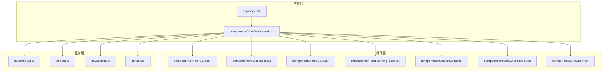

**图表来源**
- [LiveDashboard.tsx:1-375](file://components/LiveDashboard.tsx#L1-L375)
- [page.tsx:1-24](file://app/page.tsx#L1-L24)

**章节来源**
- [LiveDashboard.tsx:1-375](file://components/LiveDashboard.tsx#L1-L375)
- [page.tsx:1-24](file://app/page.tsx#L1-L24)

## 核心组件

### LiveDashboard 主面板组件

LiveDashboard 是整个应用的核心组件，负责协调所有子组件并管理全局状态。该组件实现了以下关键功能：

#### 状态管理架构

组件维护了多个独立的状态管理器：

| 状态类型 | 状态变量 | 数据源 | 用途 |
|---------|---------|--------|------|
| 市场数据 | `indices` | `fetchIndices()` | 全球指数实时数据 |
| 热门股票 | `hotStocks` | `fetchHotStocks()` | A股热门股票行情 |
| 自选股 | `watchlistStocks` | `fetchStocksByCodes()` | 用户自选股票数据 |
| 基金跟踪 | `funds` | `fetchFundsByCodes()` | 用户跟踪的基金净值 |
| 基金排行 | `fundRanking` | `fetchFundRanking()` | 全市场基金涨跌幅排行 |
| UI状态 | `isLive`, `isRefreshing`, `lastUpdate` | 内部逻辑 | 界面状态指示 |

#### 数据获取机制

组件采用 `Promise.allSettled` 并行请求策略，确保即使部分请求失败也不会影响整体数据展示：

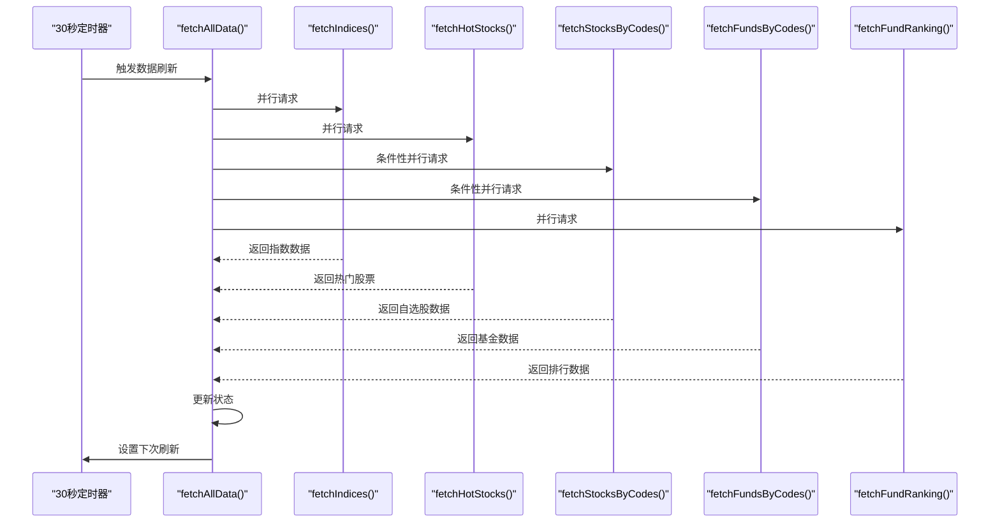

**图表来源**
- [LiveDashboard.tsx:56-95](file://components/LiveDashboard.tsx#L56-L95)

#### 实时刷新逻辑

组件实现了智能的实时数据刷新机制：

1. **定时刷新**：每30秒自动触发数据更新
2. **手动刷新**：用户可点击刷新按钮强制更新
3. **状态指示**：通过 `isLive` 和 `isRefreshing` 状态显示数据状态
4. **时间戳记录**：记录最后更新时间

**章节来源**
- [LiveDashboard.tsx:39-102](file://components/LiveDashboard.tsx#L39-L102)

## 架构概览

### 组件间通信机制

LiveDashboard 采用了多种组件间通信方式：

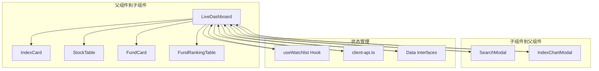

**图表来源**
- [LiveDashboard.tsx:13-37](file://components/LiveDashboard.tsx#L13-L37)
- [SearchModal.tsx:15-31](file://components/SearchModal.tsx#L15-L31)
- [IndexChartModal.tsx:27-33](file://components/IndexChartModal.tsx#L27-L33)

### 数据流架构

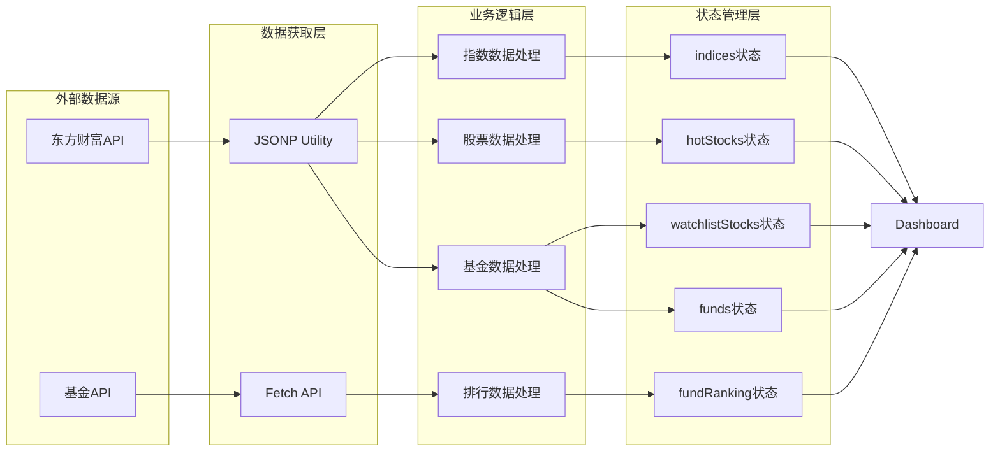

**图表来源**
- [client-api.ts:5-36](file://lib/client-api.ts#L5-L36)
- [client-api.ts:154-199](file://lib/client-api.ts#L154-L199)
- [client-api.ts:203-240](file://lib/client-api.ts#L203-L240)
- [client-api.ts:462-495](file://lib/client-api.ts#L462-L495)
- [client-api.ts:527-595](file://lib/client-api.ts#L527-L595)

**章节来源**
- [client-api.ts:1-596](file://lib/client-api.ts#L1-L596)

## 详细组件分析

### 统计卡片组件 (StatCard)

StatCard 是一个通用的统计信息展示组件，用于显示各类统计数据：

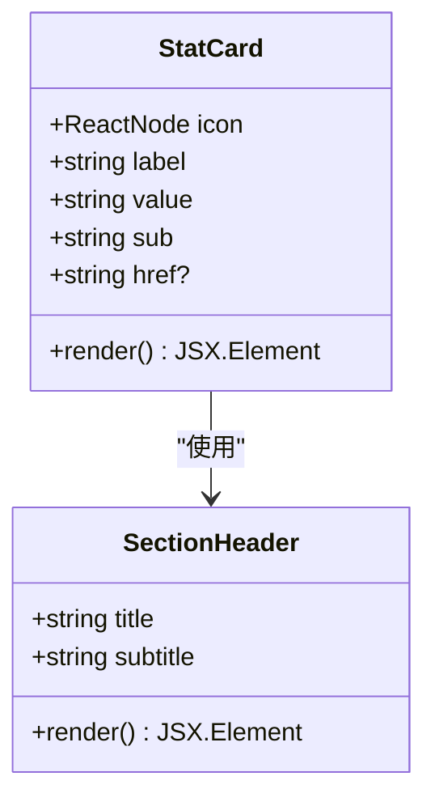

**图表来源**
- [LiveDashboard.tsx:314-350](file://components/LiveDashboard.tsx#L314-L350)
- [LiveDashboard.tsx:305-312](file://components/LiveDashboard.tsx#L305-L312)

StatCard 的设计特点：
- 支持图标、标签、数值和副标题的组合展示
- 可选的链接功能，支持页面内导航
- 响应式布局，适配不同屏幕尺寸
- 悬停效果和点击反馈

### 空状态组件 (EmptyWatchlist)

EmptyWatchlist 提供了统一的空状态展示，增强了用户体验：

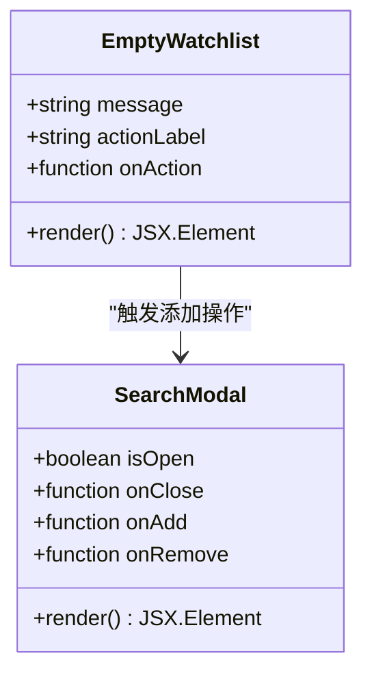

**图表来源**
- [LiveDashboard.tsx:352-374](file://components/LiveDashboard.tsx#L352-L374)
- [SearchModal.tsx:15-31](file://components/SearchModal.tsx#L15-L31)

EmptyWatchlist 的设计模式：
- 统一的视觉风格和交互行为
- 明确的操作引导
- 与搜索模态框的无缝集成

### 搜索功能集成

搜索功能通过 SearchModal 组件实现，支持基金和股票的双重搜索：

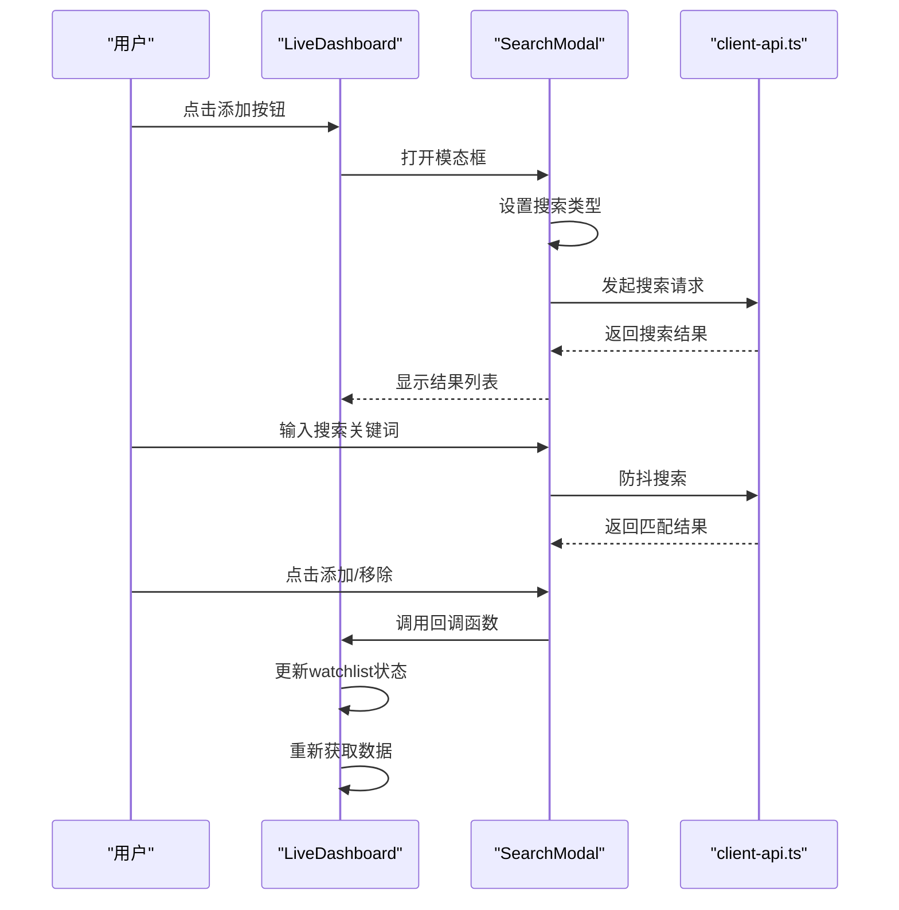

**图表来源**
- [SearchModal.tsx:48-77](file://components/SearchModal.tsx#L48-L77)
- [LiveDashboard.tsx:280-296](file://components/LiveDashboard.tsx#L280-L296)

**章节来源**
- [SearchModal.tsx:1-210](file://components/SearchModal.tsx#L1-L210)
- [LiveDashboard.tsx:280-296](file://components/LiveDashboard.tsx#L280-L296)

### 模态框状态管理

系统提供了两种重要的模态框组件：

#### 指数图表模态框 (IndexChartModal)

IndexChartModal 展示了指数的历史K线数据：

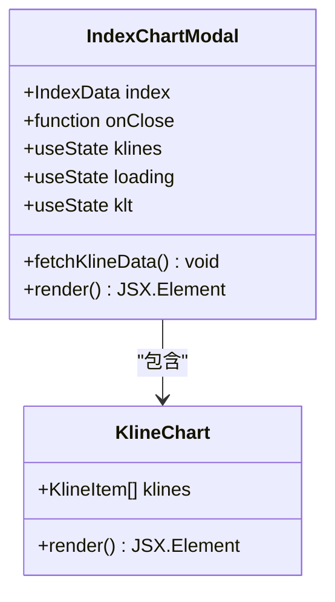

**图表来源**
- [IndexChartModal.tsx:27-55](file://components/IndexChartModal.tsx#L27-L55)
- [IndexChartModal.tsx:169-354](file://components/IndexChartModal.tsx#L169-L354)

#### 搜索模态框 (SearchModal)

SearchModal 提供了完整的搜索和选择功能：

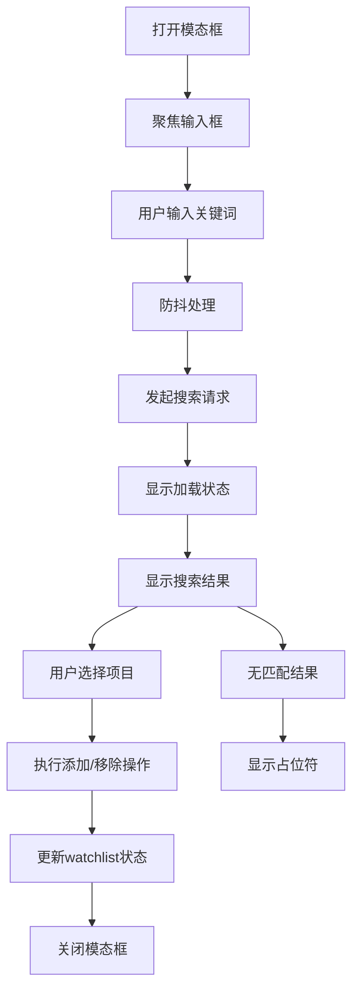

**图表来源**
- [SearchModal.tsx:48-77](file://components/SearchModal.tsx#L48-L77)
- [SearchModal.tsx:134-192](file://components/SearchModal.tsx#L134-L192)

**章节来源**
- [IndexChartModal.tsx:1-367](file://components/IndexChartModal.tsx#L1-L367)
- [SearchModal.tsx:1-210](file://components/SearchModal.tsx#L1-L210)

## 依赖关系分析

### 外部依赖

组件系统依赖于以下外部库和服务：

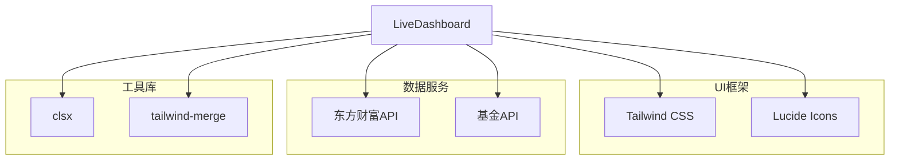

**图表来源**
- [LiveDashboard.tsx:12-28](file://components/LiveDashboard.tsx#L12-L28)
- [utils.ts:1-7](file://lib/utils.ts#L1-L7)

### 内部依赖关系

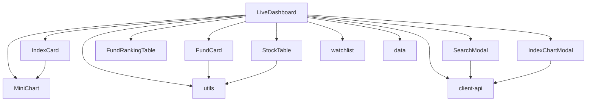

**图表来源**
- [LiveDashboard.tsx:3-12](file://components/LiveDashboard.tsx#L3-L12)
- [client-api.ts:1-2](file://lib/client-api.ts#L1-L2)

**章节来源**
- [LiveDashboard.tsx:1-375](file://components/LiveDashboard.tsx#L1-L375)
- [client-api.ts:1-596](file://lib/client-api.ts#L1-L596)

## 性能考虑

### 数据获取优化

1. **并行请求策略**：使用 `Promise.allSettled` 确保部分请求失败不影响整体性能
2. **条件性数据获取**：仅在用户有关注的股票或基金时才发起相应请求
3. **缓存机制**：利用浏览器缓存和本地存储减少重复请求

### 渲染性能优化

1. **状态分离**：将不同类型的数据分离到独立状态，避免不必要的重渲染
2. **组件拆分**：将大组件拆分为多个小组件，提高渲染效率
3. **虚拟滚动**：对于大量数据的表格组件，可考虑实现虚拟滚动

### 内存管理

1. **定时器清理**：确保组件卸载时清除定时器，防止内存泄漏
2. **事件监听器清理**：及时移除键盘事件监听器
3. **防抖优化**：对搜索功能使用防抖，减少频繁的API调用

## 故障排除指南

### 常见问题及解决方案

#### 数据获取失败

**问题描述**：某些API请求失败导致数据不完整

**解决方案**：
1. 检查网络连接状态
2. 查看控制台错误信息
3. 确认API接口可用性
4. 实现适当的错误边界处理

#### 性能问题

**问题描述**：页面渲染缓慢或卡顿

**解决方案**：
1. 检查是否有过多的重渲染
2. 优化数据获取频率
3. 实现数据分页加载
4. 使用React.memo优化子组件

#### 搜索功能异常

**问题描述**：搜索结果不准确或响应慢

**解决方案**：
1. 检查防抖参数设置
2. 验证API返回格式
3. 实现搜索历史缓存
4. 添加搜索结果过滤

**章节来源**
- [LiveDashboard.tsx:89-94](file://components/LiveDashboard.tsx#L89-L94)
- [SearchModal.tsx:48-77](file://components/SearchModal.tsx#L48-L77)

## 结论

LiveDashboard 主面板组件展现了现代前端开发的最佳实践，通过合理的架构设计和状态管理，实现了高性能、可维护的金融数据展示系统。组件间清晰的职责划分、灵活的通信机制以及完善的错误处理策略，为用户提供了流畅的使用体验。

该组件体系具有良好的扩展性，可以轻松添加新的数据源和功能模块，同时保持系统的稳定性和性能表现。

## 附录

### 组件使用最佳实践

1. **状态管理**：合理划分组件状态，避免过度耦合
2. **错误处理**：实现全面的错误边界和降级策略
3. **性能优化**：使用防抖、节流和缓存技术
4. **用户体验**：提供清晰的加载状态和反馈信息
5. **代码组织**：遵循单一职责原则，保持组件简洁

### 错误处理策略

- 实现 `Promise.allSettled` 的错误处理
- 提供默认数据回退机制
- 实现用户友好的错误提示
- 记录错误日志便于调试