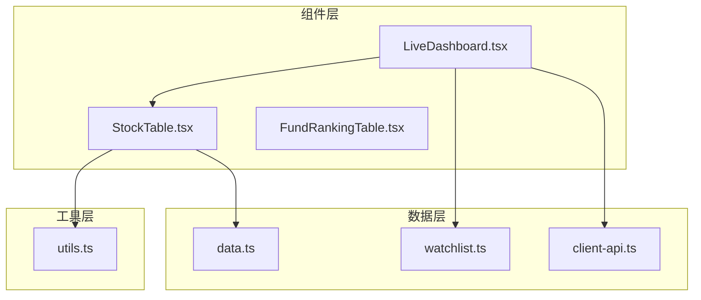
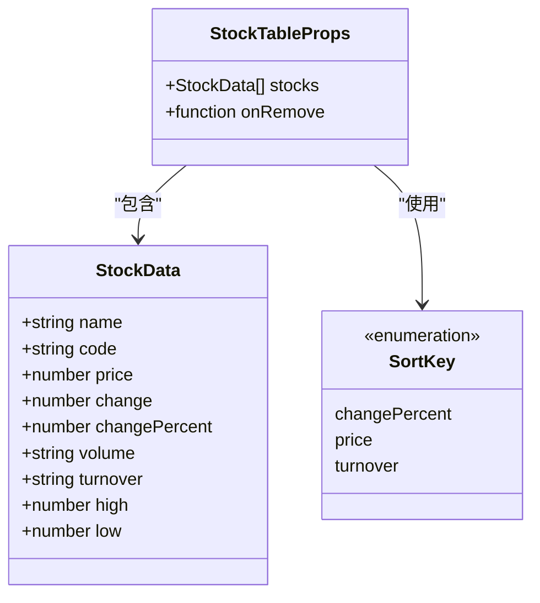
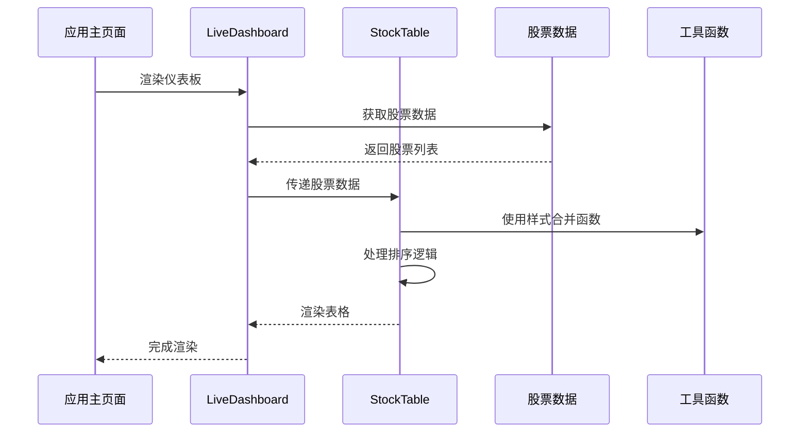
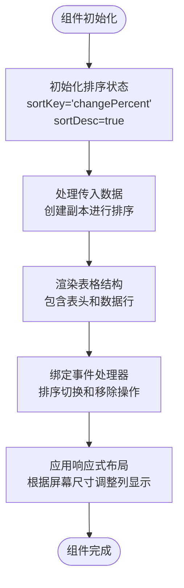
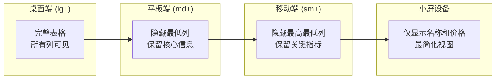
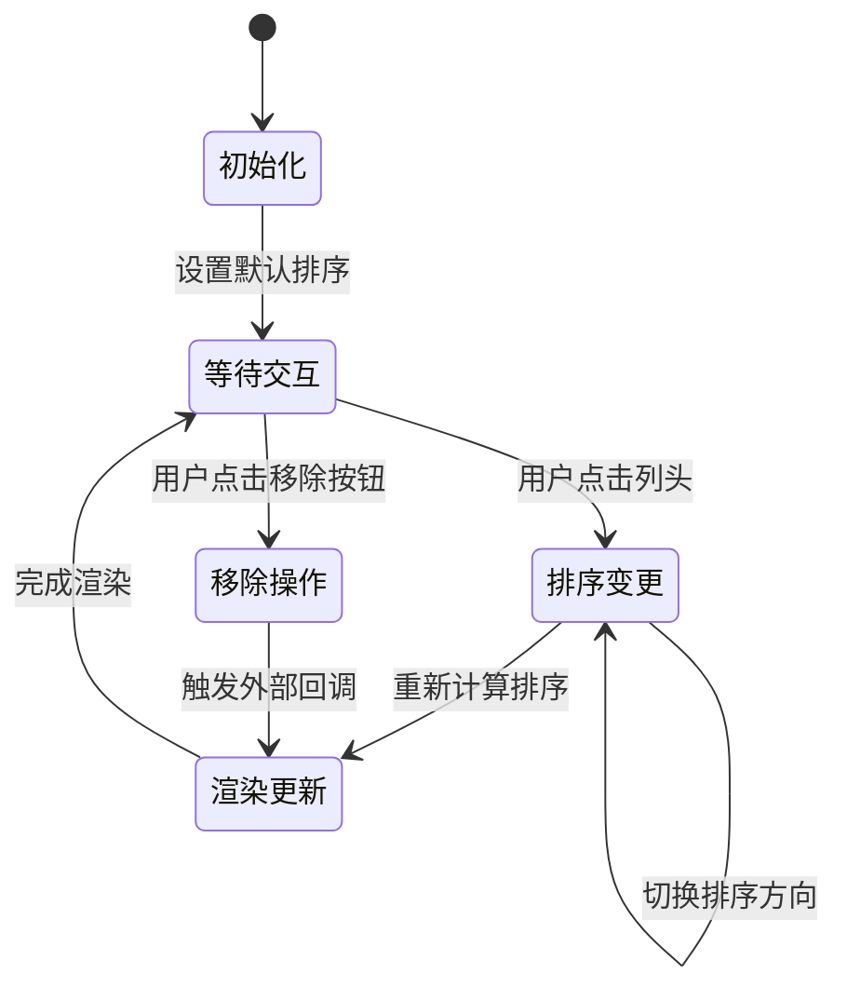
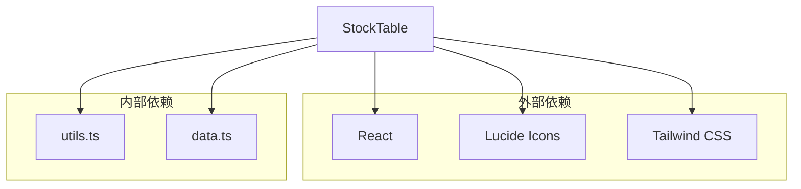
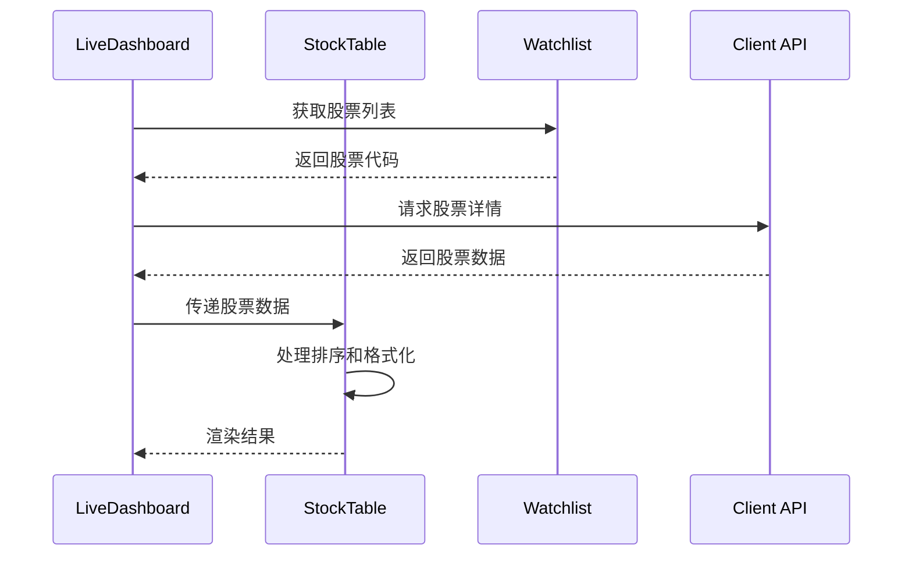

# StockTable 股票表格组件

<cite>
**本文档引用的文件**
- [StockTable.tsx](file://components/StockTable.tsx)
- [data.ts](file://lib/data.ts)
- [utils.ts](file://lib/utils.ts)
- [LiveDashboard.tsx](file://components/LiveDashboard.tsx)
- [watchlist.ts](file://lib/watchlist.ts)
- [client-api.ts](file://lib/client-api.ts)
</cite>

## 目录
1. [简介](#简介)
2. [项目结构](#项目结构)
3. [核心组件](#核心组件)
4. [架构概览](#架构概览)
5. [详细组件分析](#详细组件分析)
6. [依赖关系分析](#依赖关系分析)
7. [性能考虑](#性能考虑)
8. [故障排除指南](#故障排除指南)
9. [结论](#结论)
10. [附录：使用示例](#附录使用示例)

## 简介

StockTable 是一个专门用于展示股票数据的表格组件，采用现代化的 React + Next.js 架构实现。该组件提供了完整的股票信息展示功能，包括实时股价、涨跌幅度、成交量等关键指标，并支持用户交互操作如排序、移除等功能。

组件基于 Tailwind CSS 实现响应式设计，能够在不同设备上提供良好的用户体验。通过类型安全的 TypeScript 实现，确保了数据结构的正确性和开发体验的提升。

## 项目结构

StockTable 组件位于项目的组件目录中，与相关的数据模型和工具函数共同构成了完整的股票数据展示系统。



**图表来源**
- [StockTable.tsx:1-144](file://components/StockTable.tsx#L1-L144)
- [LiveDashboard.tsx:1-375](file://components/LiveDashboard.tsx#L1-L375)
- [data.ts:1-255](file://lib/data.ts#L1-L255)

**章节来源**
- [StockTable.tsx:1-144](file://components/StockTable.tsx#L1-L144)
- [LiveDashboard.tsx:1-375](file://components/LiveDashboard.tsx#L1-L375)

## 核心组件

StockTable 组件的核心功能围绕以下方面构建：

### 数据模型定义

组件使用严格的 TypeScript 接口定义股票数据结构：



**图表来源**
- [data.ts:12-22](file://lib/data.ts#L12-L22)
- [StockTable.tsx:8](file://components/StockTable.tsx#L8)

### 核心功能特性

1. **动态排序功能** - 支持按价格、涨跌幅、成交量进行升序/降序排序
2. **响应式布局** - 通过断点控制列的显示/隐藏
3. **交互式移除** - 提供删除功能按钮
4. **数据格式化** - 数字格式化和颜色标识
5. **状态管理** - 内部状态维护排序状态

**章节来源**
- [StockTable.tsx:10-34](file://components/StockTable.tsx#L10-L34)
- [data.ts:12-22](file://lib/data.ts#L12-L22)

## 架构概览

StockTable 组件在整个应用架构中的位置和作用：



**图表来源**
- [LiveDashboard.tsx:264-275](file://components/LiveDashboard.tsx#L264-L275)
- [StockTable.tsx:10](file://components/StockTable.tsx#L10)
- [utils.ts:4-6](file://lib/utils.ts#L4-L6)

## 详细组件分析

### 组件结构分析

StockTable 组件采用函数式组件设计，使用 React Hooks 进行状态管理：



**图表来源**
- [StockTable.tsx:11-12](file://components/StockTable.tsx#L11-L12)
- [StockTable.tsx:14-25](file://components/StockTable.tsx#L14-L25)

### 数据格式化规则

组件实现了多种数据格式化策略：

#### 价格格式化
- 使用固定两位小数显示
- 采用 `tabular-nums` 类确保数字对齐
- 高亮显示当前价格

#### 涨跌格式化
- 正数显示为绿色，负数显示为红色
- 带有方向箭头指示涨跌趋势
- 百分比格式显示，正数前缀加 `+`

#### 成交量格式化
- 支持中文单位：亿、万、手
- 自动转换数值格式
- 保持右对齐显示

**章节来源**
- [StockTable.tsx:91-120](file://components/StockTable.tsx#L91-L120)

### 交互功能实现

#### 排序功能
组件支持三种排序方式：
- **价格排序** (`price`) - 按当前股价排序
- **涨跌幅排序** (`changePercent`) - 按涨跌百分比排序  
- **成交量排序** (`turnover`) - 按成交金额排序

排序切换逻辑：
- 点击同一列时切换升序/降序
- 点击不同列时重置为升序
- 使用 `sortDesc` 状态控制排序方向

#### 移除操作
当提供 `onRemove` 回调函数时，表格会显示移除按钮：
- 悬停时显示删除图标
- 点击触发外部回调
- 支持从用户自选列表中移除股票

**章节来源**
- [StockTable.tsx:27-34](file://components/StockTable.tsx#L27-L34)
- [StockTable.tsx:121-131](file://components/StockTable.tsx#L121-L131)

### 响应式设计实现

组件采用渐进增强的响应式设计策略：



**图表来源**
- [StockTable.tsx:59-72](file://components/StockTable.tsx#L59-L72)

响应式断点策略：
- `hidden sm:table-cell` - 小于 640px 隐藏
- `hidden md:table-cell` - 小于 768px 隐藏  
- `hidden lg:table-cell` - 小于 1024px 隐藏

### 状态管理机制

组件内部状态管理采用 React Hooks：



**图表来源**
- [StockTable.tsx:11-12](file://components/StockTable.tsx#L11-L12)
- [StockTable.tsx:27-34](file://components/StockTable.tsx#L27-L34)

**章节来源**
- [StockTable.tsx:3-6](file://components/StockTable.tsx#L3-L6)
- [StockTable.tsx:11-34](file://components/StockTable.tsx#L11-L34)

## 依赖关系分析

### 组件间依赖关系



**图表来源**
- [StockTable.tsx:3-6](file://components/StockTable.tsx#L3-L6)

### 数据流分析



**图表来源**
- [LiveDashboard.tsx:40-50](file://components/LiveDashboard.tsx#L40-L50)
- [client-api.ts:421-458](file://lib/client-api.ts#L421-L458)

**章节来源**
- [StockTable.tsx:1-144](file://components/StockTable.tsx#L1-L144)
- [LiveDashboard.tsx:1-375](file://components/LiveDashboard.tsx#L1-L375)

## 性能考虑

### 渲染优化

1. **浅拷贝排序** - 使用扩展运算符创建数组副本，避免修改原始数据
2. **条件渲染** - 移除按钮仅在提供回调时显示
3. **CSS 类合并** - 使用 `cn` 函数优化类名拼接

### 内存管理

- 排序操作在每次渲染时执行，对于大数据集可能影响性能
- 建议在父组件中缓存排序结果或使用 useMemo 优化

### 网络请求优化

组件本身不直接发起网络请求，但与数据获取层配合使用：
- 支持批量数据获取
- 错误处理和超时机制
- 缓存策略减少重复请求

## 故障排除指南

### 常见问题及解决方案

#### 表格显示异常
- **症状**：表格列错位或内容重叠
- **原因**：CSS 类名冲突或样式未正确加载
- **解决**：检查 Tailwind CSS 配置和类名拼接

#### 排序功能失效
- **症状**：点击列头无反应
- **原因**：缺少必要的事件处理器或状态管理错误
- **解决**：验证 `toggleSort` 函数实现和状态更新逻辑

#### 数据格式化错误
- **症状**：数字显示异常或格式不正确
- **原因**：数据类型不匹配或格式化函数错误
- **解决**：检查数据模型定义和格式化逻辑

**章节来源**
- [StockTable.tsx:14-25](file://components/StockTable.tsx#L14-L25)
- [utils.ts:4-6](file://lib/utils.ts#L4-L6)

## 结论

StockTable 股票表格组件是一个功能完整、设计合理的数据展示组件。它成功地结合了以下特点：

1. **类型安全** - 使用 TypeScript 确保数据结构正确性
2. **响应式设计** - 适应不同设备和屏幕尺寸
3. **用户友好** - 提供直观的交互和视觉反馈
4. **可扩展性** - 良好的架构便于功能扩展和定制

组件在实际应用中展现了优秀的性能表现和用户体验，是金融数据展示的理想选择。

## 附录：使用示例

### 基础使用

```typescript
// 在组件中导入和使用
import StockTable from '@/components/StockTable'

// 基本用法
<StockTable stocks={stockData} />

// 带移除功能的用法
<StockTable 
  stocks={watchlistStocks} 
  onRemove={(code) => removeStock(code)} 
/>
```

### 集成到不同业务场景

#### 热门股票展示
```typescript
// 在 LiveDashboard 中展示热门股票
{stockTab === 'hot' ? (
  <StockTable stocks={hotStocks} />
) : (
  // 其他场景
)}
```

#### 自选股票管理
```typescript
// 展示用户自选股票并支持移除
<StockTable 
  stocks={watchlistStocks} 
  onRemove={removeStock} 
/>
```

### 自定义表格行为

#### 自定义排序逻辑
```typescript
// 通过外部状态控制排序
const [sortKey, setSortKey] = useState('changePercent')
const [sortDesc, setSortDesc] = useState(true)

// 在父组件中处理排序变化
const handleSortChange = (newKey: SortKey) => {
  if (sortKey === newKey) {
    setSortDesc(!sortDesc)
  } else {
    setSortKey(newKey)
    setSortDesc(true)
  }
}
```

#### 自定义样式
```typescript
// 通过 CSS 变量自定义样式
<StockTable 
  stocks={stocks} 
  className="custom-table-style"
/>
```

**章节来源**
- [LiveDashboard.tsx:264-275](file://components/LiveDashboard.tsx#L264-L275)
- [StockTable.tsx:10](file://components/StockTable.tsx#L10)