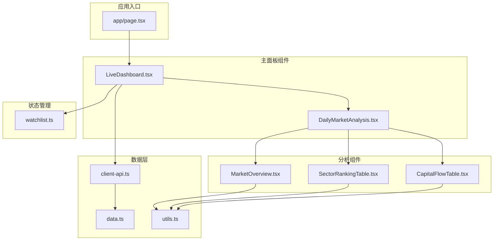
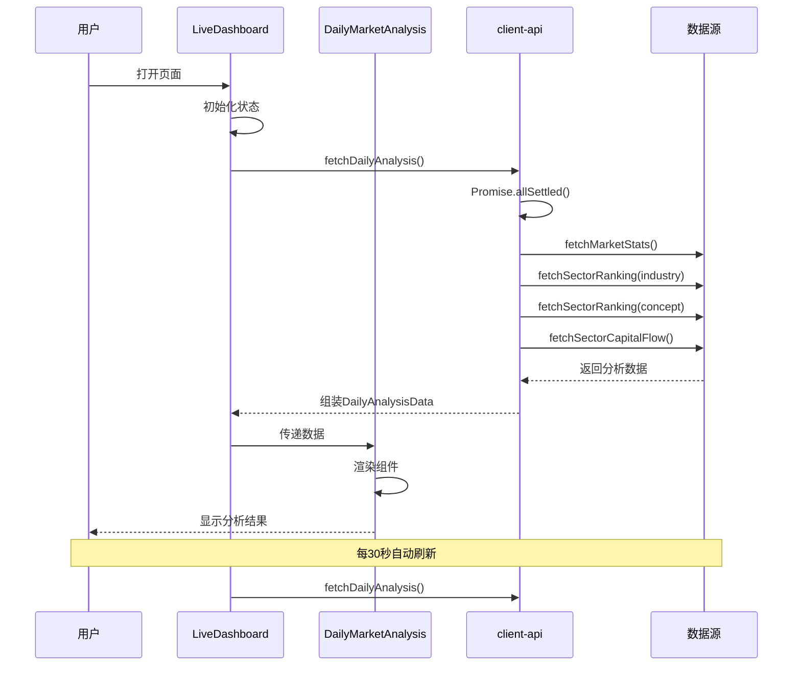
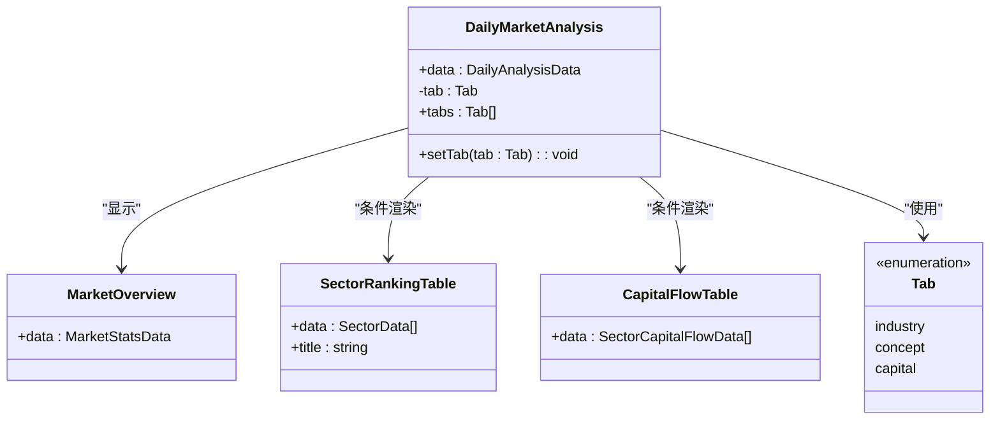
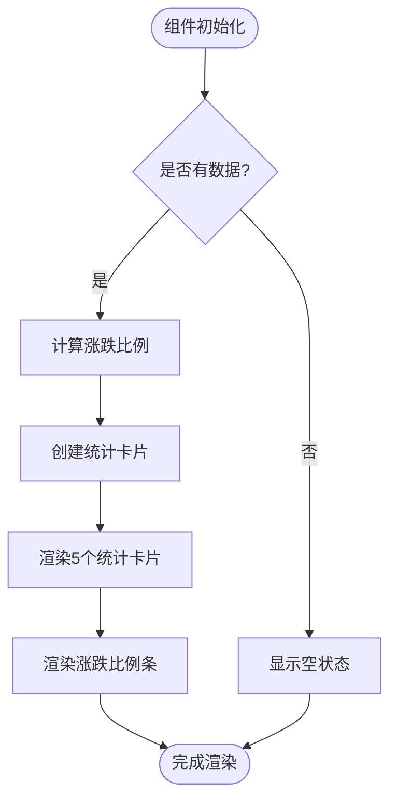
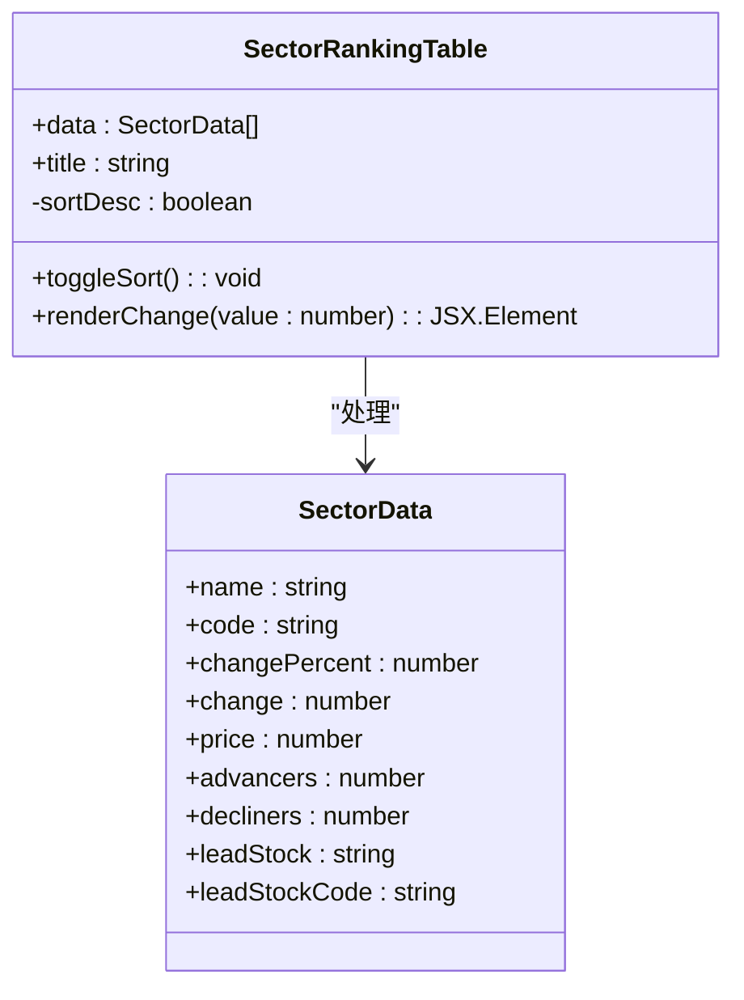
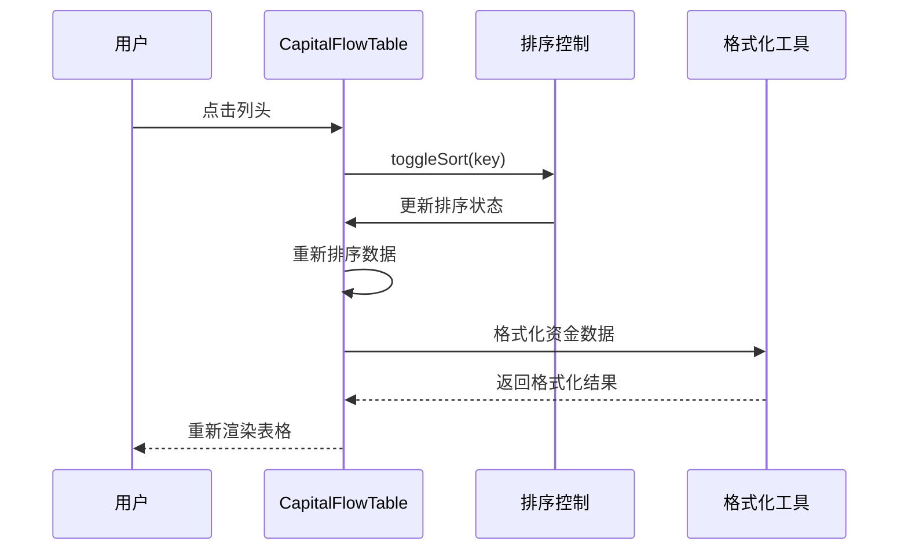
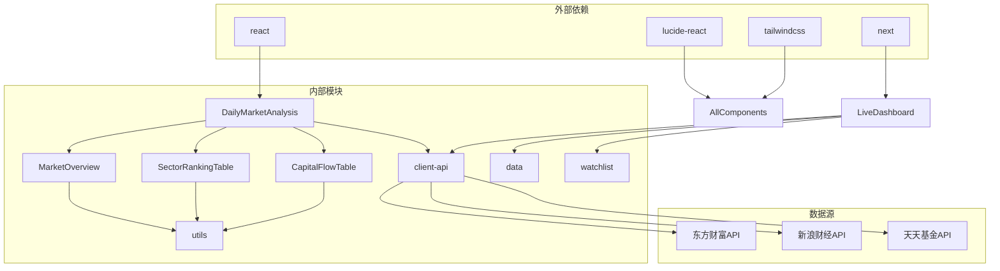
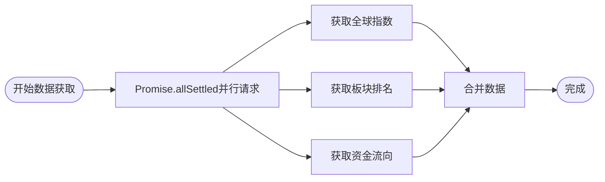

# 日市场分析模块

<cite>
**本文档引用的文件**
- [README.md](file://README.md)
- [DailyMarketAnalysis.tsx](file://components/DailyMarketAnalysis.tsx)
- [MarketOverview.tsx](file://components/MarketOverview.tsx)
- [SectorRankingTable.tsx](file://components/SectorRankingTable.tsx)
- [CapitalFlowTable.tsx](file://components/CapitalFlowTable.tsx)
- [client-api.ts](file://lib/client-api.ts)
- [data.ts](file://lib/data.ts)
- [utils.ts](file://lib/utils.ts)
- [LiveDashboard.tsx](file://components/LiveDashboard.tsx)
- [watchlist.ts](file://lib/watchlist.ts)
- [page.tsx](file://app/page.tsx)
- [package.json](file://package.json)
</cite>

## 目录
1. [简介](#简介)
2. [项目结构](#项目结构)
3. [核心组件](#核心组件)
4. [架构概览](#架构概览)
5. [详细组件分析](#详细组件分析)
6. [依赖关系分析](#依赖关系分析)
7. [性能考虑](#性能考虑)
8. [故障排除指南](#故障排除指南)
9. [结论](#结论)

## 简介

日市场分析模块是基金实盘跟踪项目中的核心功能模块，专门用于提供每日股市分析和市场概况。该模块通过整合多个数据源，为用户提供全面的市场洞察，包括大盘概况、板块轮动分析和资金流向监测。

该项目采用现代化的前端技术栈，基于Next.js 16框架构建，使用TypeScript进行类型安全编程，配合Tailwind CSS实现响应式设计。模块支持实时数据更新，每30秒自动刷新一次，确保用户获取最新的市场信息。

## 项目结构

项目采用按功能模块组织的结构，日市场分析模块位于components目录下，与其他核心组件协同工作：

**图表来源**
- [page.tsx:10-23](file://app/page.tsx#L10-L23)
- [LiveDashboard.tsx:41-367](file://components/LiveDashboard.tsx#L41-L367)
- [DailyMarketAnalysis.tsx:12-53](file://components/DailyMarketAnalysis.tsx#L12-L53)

**章节来源**
- [README.md:132-161](file://README.md#L132-L161)
- [package.json:1-31](file://package.json#L1-L31)

## 核心组件

日市场分析模块由四个主要组件构成，每个组件都有特定的功能职责：

### DailyMarketAnalysis 组件
作为主容器组件，负责协调各个子组件的展示和交互逻辑。该组件实现了标签页切换功能，允许用户在行业板块、概念板块和资金流向之间自由切换。

### MarketOverview 组件
提供大盘概况的核心指标展示，包括上涨家数、下跌家数、平盘家数、涨停/跌停数量以及两市成交额等关键指标。组件还提供了涨跌比例的可视化展示。

### SectorRankingTable 组件
展示行业板块和概念板块的涨跌幅排名，支持按涨跌幅排序，并显示各板块的领涨股票信息。

### CapitalFlowTable 组件
专注于资金流向分析，展示各板块的主力净流入、主力净占比、超大单和大单资金流向等关键指标。

**章节来源**
- [DailyMarketAnalysis.tsx:12-53](file://components/DailyMarketAnalysis.tsx#L12-L53)
- [MarketOverview.tsx:14-125](file://components/MarketOverview.tsx#L14-L125)
- [SectorRankingTable.tsx:10-114](file://components/SectorRankingTable.tsx#L10-L114)
- [CapitalFlowTable.tsx:17-159](file://components/CapitalFlowTable.tsx#L17-L159)

## 架构概览

日市场分析模块采用分层架构设计，确保了良好的可维护性和扩展性：

**图表来源**
- [LiveDashboard.tsx:81-124](file://components/LiveDashboard.tsx#L81-L124)
- [client-api.ts:750-764](file://lib/client-api.ts#L750-L764)

模块的数据流遵循以下模式：
1. **数据获取层**：通过client-api.ts统一管理所有API调用
2. **数据处理层**：在client-api.ts中进行数据格式化和转换
3. **组件渲染层**：各分析组件负责具体的UI展示
4. **状态管理层**：使用React状态管理组件内部状态

**章节来源**
- [client-api.ts:638-764](file://lib/client-api.ts#L638-L764)
- [LiveDashboard.tsx:81-124](file://components/LiveDashboard.tsx#L81-L124)

## 详细组件分析

### DailyMarketAnalysis 组件深度分析

该组件是整个日市场分析模块的核心协调器，实现了灵活的标签页切换机制：

**图表来源**
- [DailyMarketAnalysis.tsx:10-19](file://components/DailyMarketAnalysis.tsx#L10-L19)
- [DailyMarketAnalysis.tsx:43-49](file://components/DailyMarketAnalysis.tsx#L43-L49)

组件特点：
- **响应式设计**：使用Flexbox布局适应不同屏幕尺寸
- **状态管理**：通过useState管理当前选中的标签页
- **条件渲染**：根据标签页状态动态渲染不同的子组件
- **样式系统**：集成Tailwind CSS实现一致的视觉风格

### MarketOverview 组件详细分析

该组件负责展示大盘的核心统计数据，采用了直观的卡片式布局：

**图表来源**
- [MarketOverview.tsx:14-125](file://components/MarketOverview.tsx#L14-L125)

数据格式化策略：
- **成交量格式化**：支持万亿、亿、万、单位的智能转换
- **比例计算**：精确计算上涨、下跌、平盘的比例
- **颜色编码**：使用语义化颜色区分涨跌情况

**章节来源**
- [MarketOverview.tsx:7-12](file://components/MarketOverview.tsx#L7-L12)
- [MarketOverview.tsx:23-26](file://components/MarketOverview.tsx#L23-L26)

### SectorRankingTable 组件分析

该组件提供板块轮动分析的核心功能，支持多种排序方式：

**图表来源**
- [SectorRankingTable.tsx:8-25](file://components/SectorRankingTable.tsx#L8-L25)
- [data.ts:10-20](file://lib/data.ts#L10-L20)

排序机制：
- **动态排序**：支持点击表头切换升序/降序排列
- **多级排序**：当前版本专注于涨跌幅排序
- **视觉反馈**：通过箭头图标显示排序方向

### CapitalFlowTable 组件分析

资金流向分析是该模块的重要特色，提供了多层次的资金流动分析：

**图表来源**
- [CapitalFlowTable.tsx:17-80](file://components/CapitalFlowTable.tsx#L17-L80)

数据处理特性：
- **多维度排序**：支持按涨跌幅和主力净流入双重排序
- **资金流向可视化**：清晰展示各板块的资金流入流出情况
- **格式化显示**：智能处理大额资金的单位转换

**章节来源**
- [CapitalFlowTable.tsx:10-15](file://components/CapitalFlowTable.tsx#L10-L15)
- [CapitalFlowTable.tsx:29-42](file://components/CapitalFlowTable.tsx#L29-L42)

## 依赖关系分析

日市场分析模块的依赖关系体现了清晰的分层架构：

**图表来源**
- [package.json:11-29](file://package.json#L11-L29)
- [client-api.ts:1-765](file://lib/client-api.ts#L1-L765)

**章节来源**
- [README.md:67-77](file://README.md#L67-L77)
- [client-api.ts:165-178](file://lib/client-api.ts#L165-L178)

## 性能考虑

日市场分析模块在性能优化方面采用了多项策略：

### 并行数据获取
模块使用Promise.allSettled实现并行数据获取，避免了串行等待导致的性能瓶颈：

**图表来源**
- [LiveDashboard.tsx:84-96](file://components/LiveDashboard.tsx#L84-L96)

### 缓存策略
- **本地存储**：用户自选列表持久化到localStorage
- **内存缓存**：组件内部状态缓存最近获取的数据
- **防抖处理**：避免频繁的重复请求

### 优化建议
1. **虚拟滚动**：对于大量数据的表格可以考虑虚拟滚动
2. **懒加载**：非关键路径的组件可以实现懒加载
3. **数据压缩**：对传输的大数据进行压缩处理
4. **CDN加速**：使用CDN加速静态资源和API请求

## 故障排除指南

### 常见问题及解决方案

#### 数据获取失败
**症状**：组件显示"暂无数据"或加载状态持续
**原因**：
- 网络连接问题
- API接口限流
- 数据格式异常

**解决方案**：
1. 检查网络连接状态
2. 查看浏览器开发者工具的网络面板
3. 验证API返回的数据格式
4. 实现重试机制和错误边界

#### 性能问题
**症状**：页面加载缓慢或响应迟钝
**原因**：
- 数据量过大
- 渲染复杂度高
- 重复渲染

**解决方案**：
1. 实施数据分页
2. 优化组件渲染逻辑
3. 使用React.memo进行组件缓存
4. 减少不必要的状态更新

#### 样式问题
**症状**：组件样式错乱或显示异常
**原因**：
- Tailwind CSS配置问题
- 组件间样式冲突
- 响应式断点设置不当

**解决方案**：
1. 检查Tailwind配置文件
2. 使用CSS隔离技术
3. 调整响应式断点设置
4. 实现样式主题系统

**章节来源**
- [client-api.ts:5-36](file://lib/client-api.ts#L5-L36)
- [LiveDashboard.tsx:119-123](file://components/LiveDashboard.tsx#L119-L123)

## 结论

日市场分析模块是一个功能完整、架构清晰的金融数据分析组件。通过精心设计的组件结构和数据流，该模块成功地将复杂的市场数据转化为易于理解的可视化信息。

### 主要优势
1. **模块化设计**：清晰的组件分离和职责划分
2. **响应式布局**：适配各种设备和屏幕尺寸
3. **实时更新**：30秒自动刷新机制确保数据时效性
4. **用户体验**：直观的界面设计和交互反馈

### 技术亮点
1. **异步数据处理**：高效的并行数据获取和处理
2. **类型安全**：完整的TypeScript类型定义
3. **样式系统**：基于Tailwind CSS的现代化样式架构
4. **状态管理**：合理的React状态管理模式

### 改进建议
1. **国际化支持**：添加多语言支持以服务更广泛的用户群体
2. **数据可视化**：引入图表库提供更丰富的数据可视化选项
3. **离线支持**：实现Service Worker缓存机制
4. **性能监控**：集成性能监控工具跟踪应用表现

该模块为金融数据可视化提供了一个优秀的参考实现，其设计理念和最佳实践可以应用于类似的金融分析应用场景。