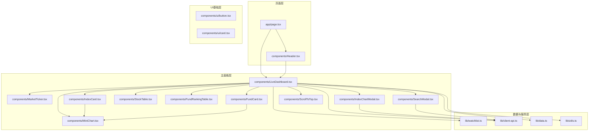
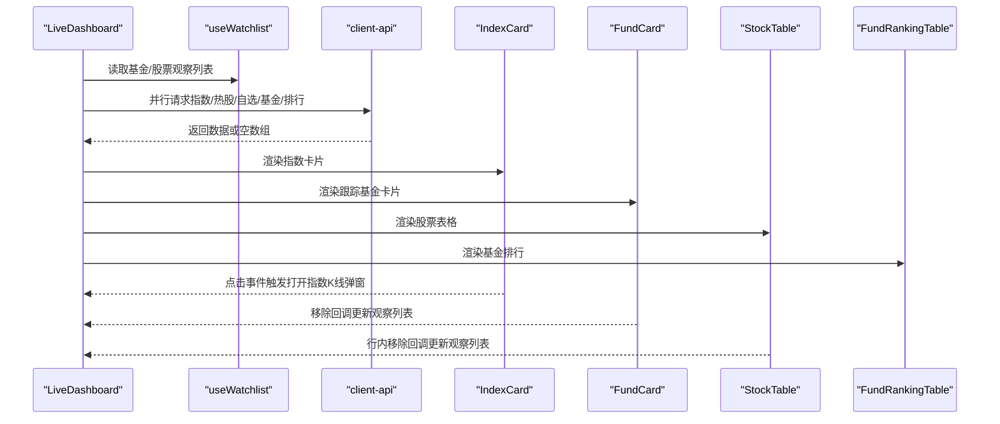
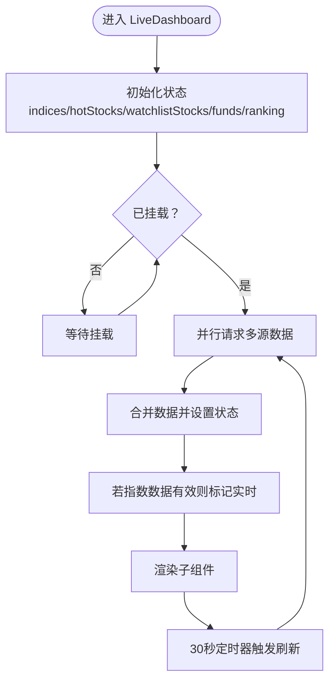
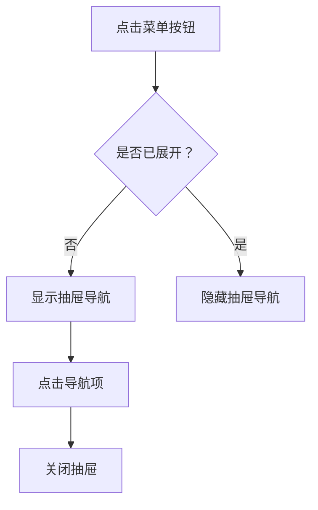
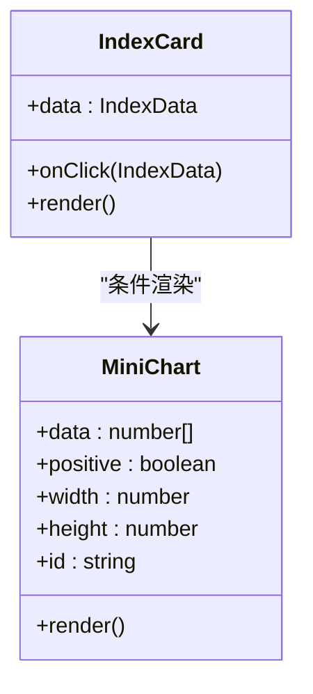
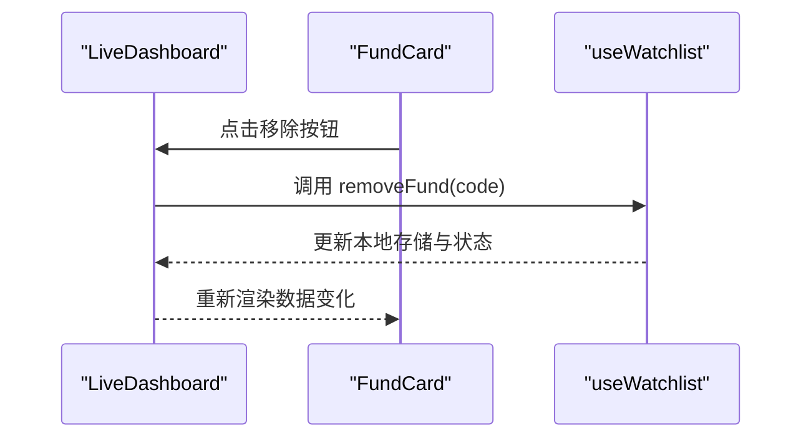
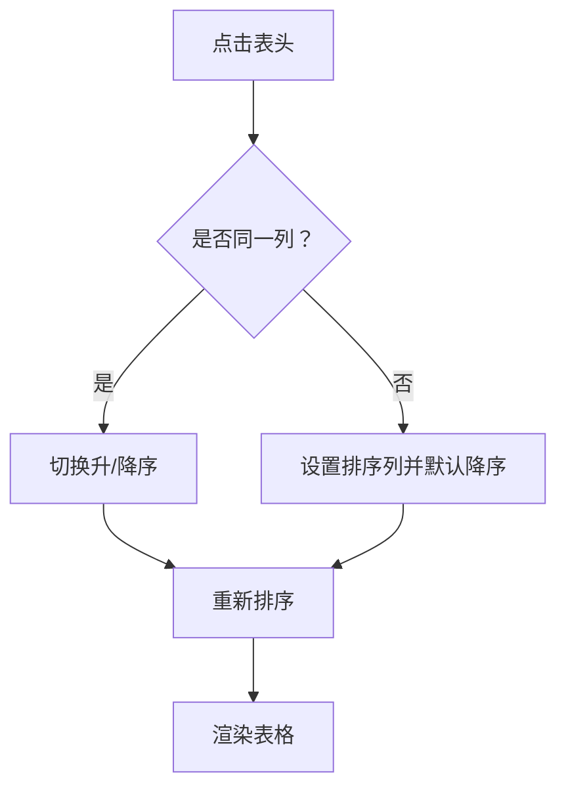
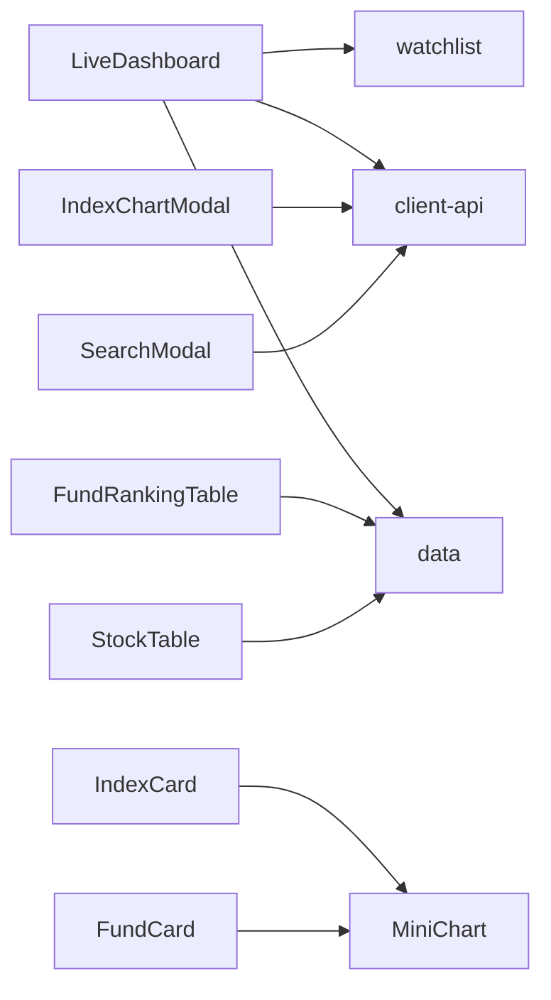

# 核心组件系统

<cite>
**本文档引用的文件**
- [LiveDashboard.tsx](file://components/LiveDashboard.tsx)
- [Header.tsx](file://components/Header.tsx)
- [IndexCard.tsx](file://components/IndexCard.tsx)
- [FundCard.tsx](file://components/FundCard.tsx)
- [StockTable.tsx](file://components/StockTable.tsx)
- [FundRankingTable.tsx](file://components/FundRankingTable.tsx)
- [SearchModal.tsx](file://components/SearchModal.tsx)
- [IndexChartModal.tsx](file://components/IndexChartModal.tsx)
- [MarketTicker.tsx](file://components/MarketTicker.tsx)
- [MiniChart.tsx](file://components/MiniChart.tsx)
- [ScrollToTop.tsx](file://components/ScrollToTop.tsx)
- [watchlist.ts](file://lib/watchlist.ts)
- [client-api.ts](file://lib/client-api.ts)
- [data.ts](file://lib/data.ts)
- [page.tsx](file://app/page.tsx)
- [button.tsx](file://components/ui/button.tsx)
- [card.tsx](file://components/ui/card.tsx)
- [utils.ts](file://lib/utils.ts)
</cite>

## 目录
1. [简介](#简介)
2. [项目结构](#项目结构)
3. [核心组件](#核心组件)
4. [架构总览](#架构总览)
5. [详细组件分析](#详细组件分析)
6. [依赖关系分析](#依赖关系分析)
7. [性能考量](#性能考量)
8. [故障排查指南](#故障排查指南)
9. [结论](#结论)
10. [附录](#附录)

## 简介
本项目是一个基金实盘跟踪应用，围绕“实时行情 + 基金跟踪 + 排行榜 + 股票监控”的核心业务目标构建。核心组件系统以 LiveDashboard 主面板为核心，串联起指数卡片、基金卡片、股票表格、搜索与图表弹窗等子组件，通过本地观察列表（watchlist）与客户端 API 实现数据驱动与用户交互闭环。

## 项目结构
应用采用按功能分层的组织方式：页面入口负责装配头部与主面板；主面板负责聚合各类业务卡片与表格；工具库封装数据模型、API 请求与本地持久化；UI 组件提供通用样式与交互能力。

**图示来源**
- [page.tsx:10-23](file://app/page.tsx#L10-L23)
- [Header.tsx:16-91](file://components/Header.tsx#L16-L91)
- [LiveDashboard.tsx:39-301](file://components/LiveDashboard.tsx#L39-L301)
- [watchlist.ts:28-88](file://lib/watchlist.ts#L28-L88)
- [client-api.ts:154-595](file://lib/client-api.ts#L154-L595)
- [data.ts:1-255](file://lib/data.ts#L1-L255)

**章节来源**
- [page.tsx:10-23](file://app/page.tsx#L10-L23)
- [Header.tsx:16-91](file://components/Header.tsx#L16-L91)
- [LiveDashboard.tsx:39-301](file://components/LiveDashboard.tsx#L39-L301)

## 核心组件
- LiveDashboard 主面板：统一调度数据拉取、状态管理与子组件渲染，提供刷新控制、实时指示与滚动到顶部能力。
- Header 导航：提供移动端适配的抽屉式导航与主题切换入口。
- IndexCard 指数卡片：展示全球指数行情与迷你折线图，支持点击打开指数K线详情。
- FundCard 基金卡片：展示基金净值、日涨跌与多周期收益，支持移除与迷你净值曲线。
- StockTable 股票表格：支持多字段排序、行内移除与响应式布局。
- FundRankingTable 基金排行榜：按多周期涨跌幅排序展示。
- SearchModal 搜索模态框：支持基金/股票搜索与添加/移除。
- IndexChartModal 指数K线详情：按日/周/月维度展示K线与成交量。
- MarketTicker 市场跑马灯：全局指数滚动播报。
- MiniChart 迷你图表：通用的迷你折线图组件。
- ScrollToTop 回到顶部按钮：基于滚动位置显示/隐藏。
- watchlist 观察列表：本地持久化的自选基金/股票集合。
- client-api 客户端API：封装 JSONP/脚本加载与数据解析。
- data 数据模型：定义指数/股票/基金/排行榜的数据结构。

**章节来源**
- [LiveDashboard.tsx:39-301](file://components/LiveDashboard.tsx#L39-L301)
- [Header.tsx:16-91](file://components/Header.tsx#L16-L91)
- [IndexCard.tsx:5-53](file://components/IndexCard.tsx#L5-L53)
- [FundCard.tsx:19-132](file://components/FundCard.tsx#L19-L132)
- [StockTable.tsx:10-144](file://components/StockTable.tsx#L10-L144)
- [FundRankingTable.tsx:10-191](file://components/FundRankingTable.tsx#L10-L191)
- [SearchModal.tsx:24-210](file://components/SearchModal.tsx#L24-L210)
- [IndexChartModal.tsx:27-167](file://components/IndexChartModal.tsx#L27-L167)
- [MarketTicker.tsx:8-52](file://components/MarketTicker.tsx#L8-L52)
- [MiniChart.tsx:9-57](file://components/MiniChart.tsx#L9-L57)
- [ScrollToTop.tsx:7-44](file://components/ScrollToTop.tsx#L7-L44)
- [watchlist.ts:28-88](file://lib/watchlist.ts#L28-L88)
- [client-api.ts:154-595](file://lib/client-api.ts#L154-L595)
- [data.ts:1-255](file://lib/data.ts#L1-L255)

## 架构总览
LiveDashboard 作为中枢，通过 useWatchlist 获取观察列表，使用 Promise.allSettled 并行拉取指数、热门股票、自选股票、跟踪基金与排行榜数据。组件内部维护刷新状态与实时指示，子组件通过 props 传入数据与回调，实现松耦合协作。

**图示来源**
- [LiveDashboard.tsx:56-102](file://components/LiveDashboard.tsx#L56-L102)
- [client-api.ts:154-595](file://lib/client-api.ts#L154-L595)
- [watchlist.ts:28-88](file://lib/watchlist.ts#L28-L88)

**章节来源**
- [LiveDashboard.tsx:56-102](file://components/LiveDashboard.tsx#L56-L102)
- [client-api.ts:154-595](file://lib/client-api.ts#L154-L595)
- [watchlist.ts:28-88](file://lib/watchlist.ts#L28-L88)

## 详细组件分析

### LiveDashboard 主面板
- 设计要点
  - 使用 Promise.allSettled 并行抓取多源数据，避免单点阻塞。
  - 通过 useWatchlist 提供观察列表与本地持久化，确保刷新后状态一致。
  - 内置定时器每30秒自动刷新，支持手动刷新按钮与动画反馈。
  - 将“实时/模拟”状态与最后更新时间注入 UI，增强用户感知。
- 数据流
  - 输入：观察列表（基金/股票）。
  - 处理：并行请求 → 合并/过滤 → 更新状态。
  - 输出：渲染统计卡片、指数卡片、基金卡片、股票表格、排行榜。
- 组件协调
  - 通过 props 传递数据与回调（如 onRemove），实现子组件对父级状态的可控变更。
  - 通过状态 selected 搭配 IndexChartModal 展示指数K线详情。
- 错误处理
  - 所有网络请求在 try/catch 中执行，失败时记录错误并保持界面可用。
- 性能优化
  - 使用 useCallback 包裹 fetchAllData，减少重渲染。
  - 仅在 mounted 后开始轮询，避免 SSR 风险。

**图示来源**
- [LiveDashboard.tsx:39-102](file://components/LiveDashboard.tsx#L39-L102)

**章节来源**
- [LiveDashboard.tsx:39-102](file://components/LiveDashboard.tsx#L39-L102)
- [watchlist.ts:28-88](file://lib/watchlist.ts#L28-L88)

### Header 导航
- 功能概述
  - 桌面端直列导航项，移动端以抽屉菜单呈现。
  - 实时状态指示与主题切换入口。
  - 支持移动端开关与键盘事件关闭。
- 交互细节
  - active 状态通过类名切换实现视觉反馈。
  - 抽屉展开时阻止背景滚动，提升可访问性。

**图示来源**
- [Header.tsx:16-91](file://components/Header.tsx#L16-L91)

**章节来源**
- [Header.tsx:16-91](file://components/Header.tsx#L16-L91)

### IndexCard 指数卡片
- 数据展示
  - 名称/代码/国旗标识、当前值、涨跌额与涨跌幅百分比。
- 迷你图表集成
  - 条件渲染 MiniChart，按涨跌决定颜色与透明度。
- 交互逻辑
  - 点击卡片触发父级回调，打开指数K线详情弹窗。
- 设计原则
  - 使用 cn 合并条件类名，保证响应式与可读性。

**图示来源**
- [IndexCard.tsx:5-53](file://components/IndexCard.tsx#L5-L53)
- [MiniChart.tsx:9-57](file://components/MiniChart.tsx#L9-L57)

**章节来源**
- [IndexCard.tsx:5-53](file://components/IndexCard.tsx#L5-L53)
- [MiniChart.tsx:9-57](file://components/MiniChart.tsx#L9-L57)

### FundCard 基金卡片
- 信息展示
  - 基金名称/代码/类型/经理、最新净值与日涨跌。
- 交互逻辑
  - 支持移除按钮（悬停可见），点击回调由父级处理。
  - 多周期收益切换（日/周/月/3月/6月/年），动态计算正负状态。
- 迷你图表
  - 自定义 SVG 折线图绘制净值序列，按涨跌着色。
- 用户体验
  - 通过分组 hover 控制移除按钮显隐，降低误触风险。

**图示来源**
- [FundCard.tsx:19-132](file://components/FundCard.tsx#L19-L132)
- [watchlist.ts:62-68](file://lib/watchlist.ts#L62-L68)

**章节来源**
- [FundCard.tsx:19-132](file://components/FundCard.tsx#L19-L132)
- [watchlist.ts:62-68](file://lib/watchlist.ts#L62-L68)

### StockTable 股票表格
- 排序机制
  - 支持按价格、涨跌幅、成交额排序，支持升/降序切换。
- 行操作
  - 在存在 onRemove 回调时显示移除按钮，点击触发父级移除逻辑。
- 响应式布局
  - 隐藏列随屏幕尺寸变化，保证移动端可读性。
- 性能注意
  - 排序在内存中进行，避免重复渲染；仅在数据变化时重新计算。

**图示来源**
- [StockTable.tsx:10-144](file://components/StockTable.tsx#L10-L144)

**章节来源**
- [StockTable.tsx:10-144](file://components/StockTable.tsx#L10-L144)

### FundRankingTable 基金排行榜
- 排序机制
  - 支持日/周/月/3月/6月/1年/2年涨跌幅排序。
- 视觉反馈
  - 前三名突出显示；涨跌以正负颜色区分。
- 空状态
  - 无数据时提示“暂无数据”。

**章节来源**
- [FundRankingTable.tsx:10-191](file://components/FundRankingTable.tsx#L10-L191)

### SearchModal 搜索模态框
- 搜索策略
  - 基金：关键词 → 搜索接口 → 结果映射（含类型/经理）。
  - 股票：关键词 → 搜索接口 → 结果映射（含代码/名称/市场代号）。
- 交互细节
  - 输入防抖（400ms）、加载指示、ESC 关闭、已添加状态高亮。
- 与观察列表联动
  - 根据 existingCodes 决定按钮状态与行为（添加/移除）。

**章节来源**
- [SearchModal.tsx:24-210](file://components/SearchModal.tsx#L24-L210)
- [client-api.ts:364-417](file://lib/client-api.ts#L364-L417)
- [watchlist.ts:53-85](file://lib/watchlist.ts#L53-L85)

### IndexChartModal 指数K线详情
- 数据获取
  - 根据指数代码查询对应 secid，按日/周/月维度请求K线。
- 图表绘制
  - 价格与成交量双轴，K线蜡烛图、MA5/10/20 线条叠加。
- 交互细节
  - ESC 关闭、点击遮罩关闭、K线类型切换。

**章节来源**
- [IndexChartModal.tsx:27-167](file://components/IndexChartModal.tsx#L27-L167)
- [client-api.ts:105-136](file://lib/client-api.ts#L105-L136)

### MarketTicker 市场跑马灯
- 功能概述
  - 指数列表横向滚动展示，鼠标悬停暂停。
- 实现要点
  - 复制列表实现无缝循环；根据涨跌设置颜色。

**章节来源**
- [MarketTicker.tsx:8-52](file://components/MarketTicker.tsx#L8-L52)

### MiniChart 迷你图表
- 功能概述
  - 接收数值序列，计算相对变化并绘制面积与折线。
- 设计要点
  - 渐变填充、圆角线帽、按涨跌着色。

**章节来源**
- [MiniChart.tsx:9-57](file://components/MiniChart.tsx#L9-L57)

### ScrollToTop 回到顶部
- 功能概述
  - 滚动超过阈值显示按钮，点击平滑回到顶部。
- 交互细节
  - 监听 scroll/touchmove 事件，使用被动监听优化性能。

**章节来源**
- [ScrollToTop.tsx:7-44](file://components/ScrollToTop.tsx#L7-L44)

## 依赖关系分析
- 组件间依赖
  - LiveDashboard 依赖 watchlist 与 client-api，向子组件传递数据与回调。
  - IndexCard/FundCard 依赖 MiniChart 进行迷你图表展示。
  - IndexChartModal/SearchModal 依赖 client-api 进行数据获取。
- 数据模型
  - data.ts 定义了 IndexData/StockData/FundData/FundRankingData 的结构，被各组件严格使用。
- UI 基础
  - button.tsx 与 card.tsx 提供通用样式变体，被多个组件复用。

**图示来源**
- [LiveDashboard.tsx:39-301](file://components/LiveDashboard.tsx#L39-L301)
- [client-api.ts:154-595](file://lib/client-api.ts#L154-L595)
- [data.ts:1-255](file://lib/data.ts#L1-L255)

**章节来源**
- [LiveDashboard.tsx:39-301](file://components/LiveDashboard.tsx#L39-L301)
- [client-api.ts:154-595](file://lib/client-api.ts#L154-L595)
- [data.ts:1-255](file://lib/data.ts#L1-L255)

## 性能考量
- 并行请求与去抖
  - 使用 Promise.allSettled 并行抓取，减少总等待时间；搜索输入使用防抖降低请求频率。
- 内存排序
  - 表格排序在内存中完成，避免不必要的重渲染。
- 本地持久化
  - 观察列表使用 localStorage，减少重复加载成本。
- 图表绘制
  - MiniChart 与 K线图采用 SVG，按需重绘，避免复杂 DOM 操作。
- 事件监听
  - ScrollToTop 使用被动监听，降低滚动卡顿风险。

[本节为通用指导，无需特定文件来源]

## 故障排查指南
- 数据为空或延迟
  - 检查 client-api 的 JSONP/脚本加载是否成功，确认返回字段与过滤条件。
  - 查看 LiveDashboard 的错误捕获与状态更新逻辑。
- 观察列表不同步
  - 确认 useWatchlist 的本地存储键值与解析逻辑，检查 mounted 状态后再开始轮询。
- 模态框无法关闭
  - 检查 SearchModal/IndexChartModal 的 ESC 事件绑定与点击遮罩关闭逻辑。
- 图表异常
  - 确认 K 线数据长度与 MA 计算边界，避免除零与 NaN。

**章节来源**
- [client-api.ts:154-595](file://lib/client-api.ts#L154-L595)
- [watchlist.ts:33-51](file://lib/watchlist.ts#L33-L51)
- [SearchModal.tsx:80-88](file://components/SearchModal.tsx#L80-L88)
- [IndexChartModal.tsx:61-67](file://components/IndexChartModal.tsx#L61-L67)

## 结论
该核心组件系统以 LiveDashboard 为中心，通过清晰的数据模型、稳定的 API 抽象与灵活的交互组件，实现了从数据获取、状态管理到组件渲染与用户交互的完整闭环。模块化设计便于扩展与维护，适合进一步引入更多指标与可视化组件。

[本节为总结，无需特定文件来源]

## 附录
- 最佳实践
  - 优先使用并行请求与本地缓存，减少网络开销。
  - 对用户输入进行防抖与节流，提升交互流畅度。
  - 组件间通过 props 明确职责边界，避免跨层级直接修改状态。
- 扩展指南
  - 新增指标：在 data.ts 定义新接口，client-api 新增请求函数，组件中按需渲染。
  - 新增图表：复用 MiniChart 或扩展 SVG 绘制逻辑，保持统一风格。
  - 新增筛选/排序：在现有表格组件基础上扩展列与排序键，保持一致的交互体验。

[本节为通用指导，无需特定文件来源]